两种数据模型

知识图谱的数据模型
知识图谱本体
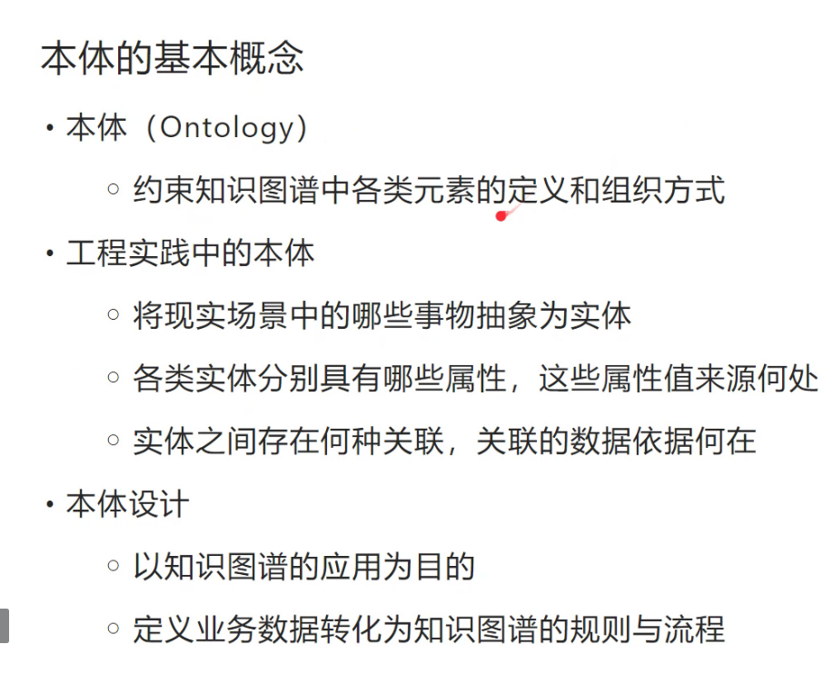

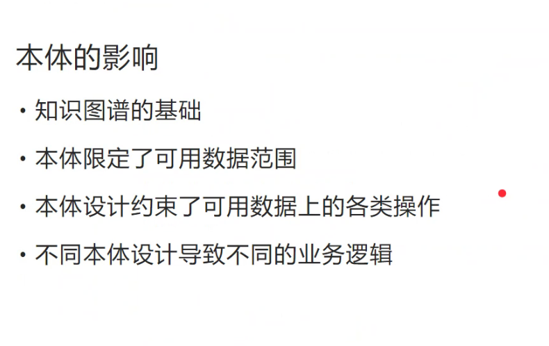

相同实体定义不同的关系
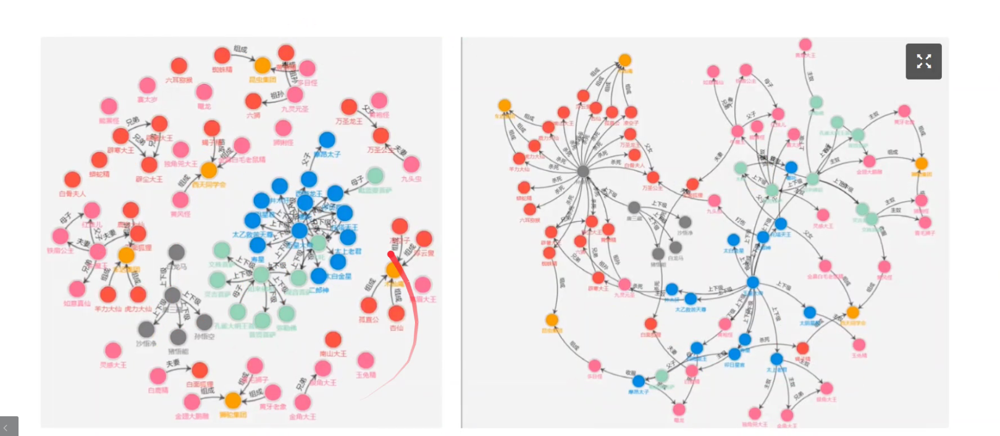
左边是上下级关系型 以及亲情关系型 联盟关系 但是不支持不同类型之间的关系

右边的加入杀死与收服，表明了不同团体之间的关系
体现了更多的信息量，体现了本体设计的意义

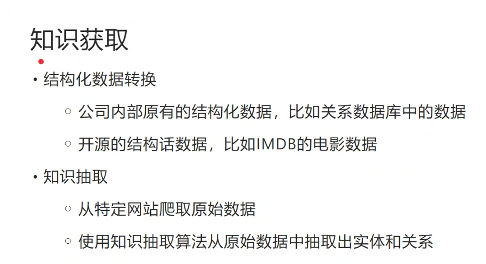
通过知识获取技术来获得本体构建的血肉

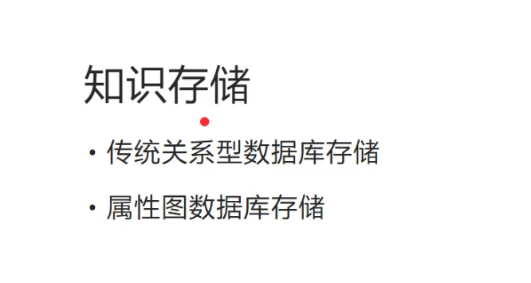
知识建模之后有了是实体，如何存储
1、传统：MySQ…
2、属性图
3、RDF图数据库——语义网

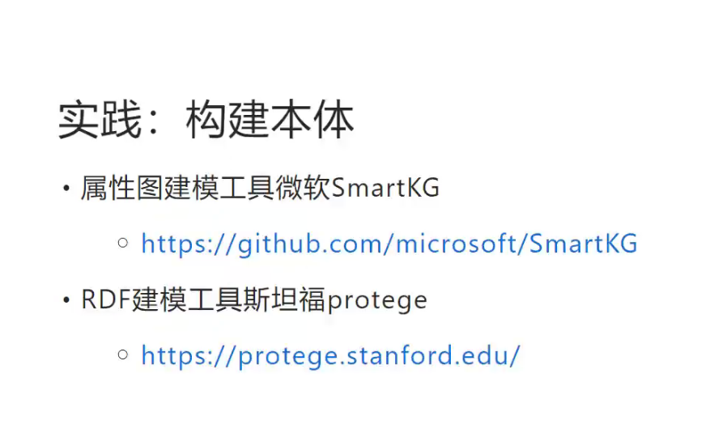

1、偏向工程
2、偏向学术
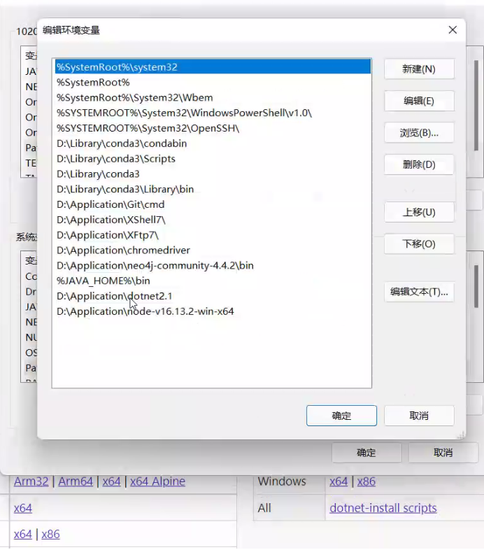

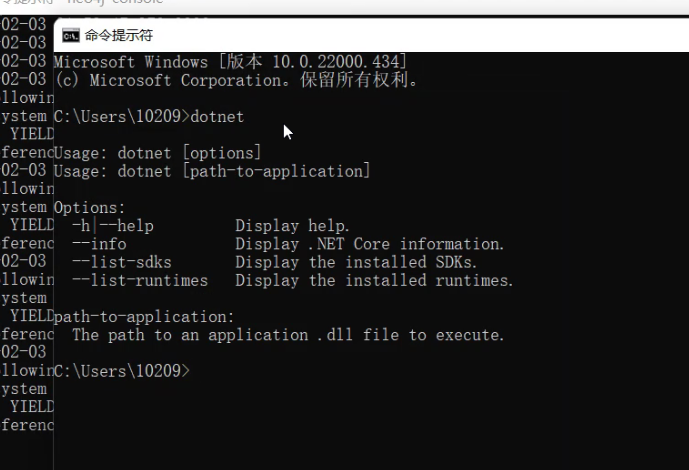

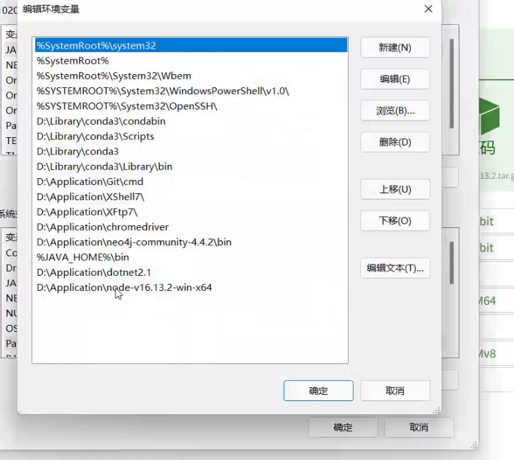

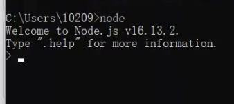

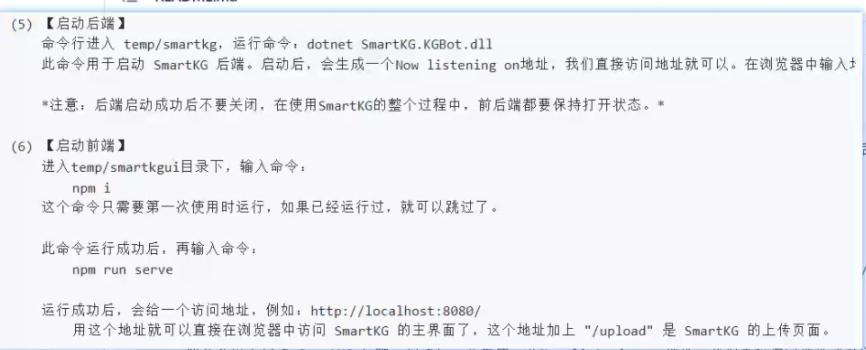

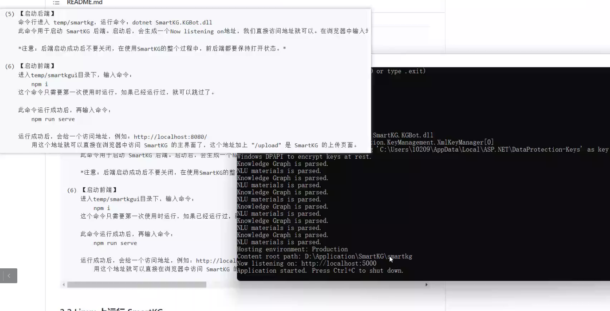

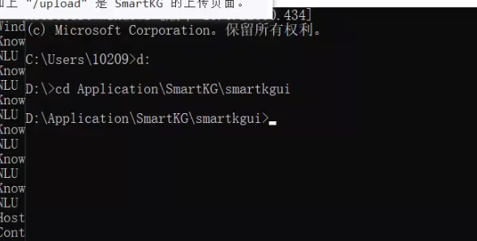

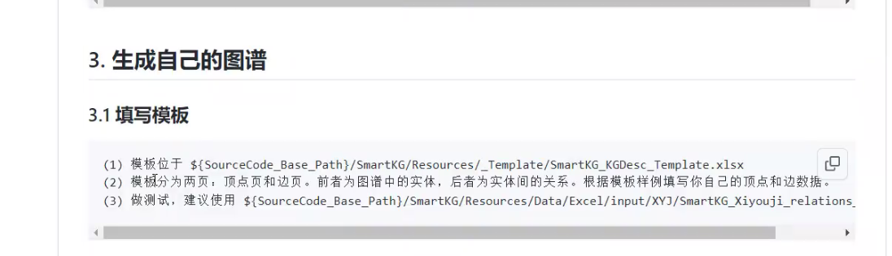

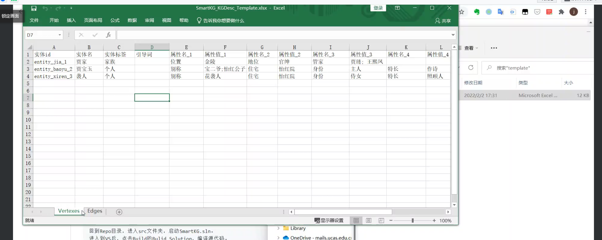
Vertexes 顶点
Edges 边

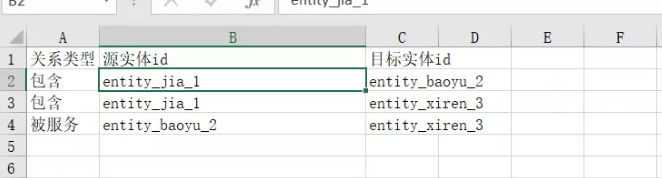

将excle表导入

以图的形式将表展示出来

