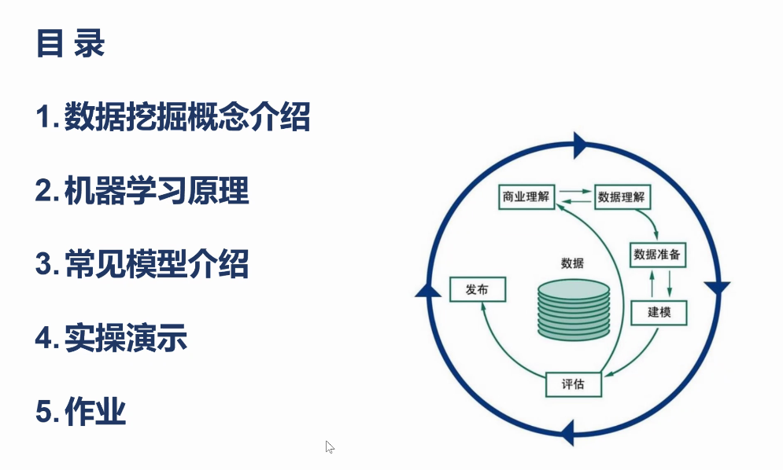

excle是一个数据分析工具

数据挖掘 ——\>机器学习

统一思想：用样本估计总体
总体无法得到，所以利用样本

随着机器学习的深入，样本越多越好
但是样本太多也不太好

对未知的数据进行运算

凸优化课程

凸集
凸函数
非凸转化为凸问题(数学定理)，找到最优解
加入非tu结果是p\*
tu问题结果是d\*
一般d\*\<P\*
但是我们希望d\*=p\*
此时需要满足一些充分必要条件

此时就可以用tu问题替代掉原来的非tu问题

此时要利用到三个人提出的5个条件
KKT条件——\>很重要
一般会在 xgboost与SVM的非线性运算

求函数的最小值
一阶导数，求驻点。
机器学习的原理是一个优化问题

损失可以理解为误差

首先做一个得分函数
x多了就是组成超平面
由三位平面直角坐标系，推到到多维超平面
X1~Xn都有了，求a1~an
利用梯度下降

首先瞎猜
都给零，都给1，都给正太分步

此时算出来的y与实际Y有误差

将误差都加起来就是总误差
然后有正的，有负的，那就用平方

让第三个最小，就是让总误差最小
此时的a1~an就是有效的

线性回归就是在不断的优化损失函数，让误差变小
为未来做预测

回归问题是预测具体的数值

因为得分方程是线性方程
所以叫做线性回归

有监督：
原来的数据集里有Y，即有参考
无监督
原来的数据集里没有Y，即无参考

带着2的原因是求导数的时候指数会下去

MSE均方误差

多元线性回归
矩阵化表示

逻辑回归极大似然估计

梯度下降
如何找到a1~an
梯度是一个有方向的量，方向导数
直角坐标系中，向量可以表示一个点
点就是向量

上述就是梯度
梯度就是其上升最快的方向
其反方向就是函数值下降的最快的方向
沿着负方向到达x轴就是最优值

由等高线
向中间走，喇嘛塔的值每次小一点往中间走，直到误差最小。

每一个得分函数都得到一个误差，等误差收敛

线性回归一定能找到最优值
动量自适应

需要手动调整的都是超参数
例如哪个喇嘛塔

高等数学——\>数学分析
线性代数——\>高等代数
矩阵论✔
学线性代数理解空间与空间的变换
例如坐标变换，利于运算

用类似于中间的平面来拟合实际变化

但是过度拟合不可取
即拟合了所有的现有的点，但是对未来的变化没有拟合

如果拟合的等高线都一样，也不太可取
画一个园或者菱形与等高线相切，缩小最优解的范围

范数

欧式几何，两个点之间的距离，

稀疏最优解，就是对最优解加了一个约束

逻辑hi贵
回归——\>预测一个数
分类——\>分类
逻辑回归——\>分类
二分类，多分类问题

逻辑回归与线性回归的共同点
一次线性回归

二分类：让Y等于概率
即让y在0~1之间

sigmoid函数\<——\>激活函数
激活是1
未激活是0
拟合后大于0.5是1
小于0.5是0

那么这就变成了一个分类函数

依然用MSA均方误差

实现多分类

三分类

交叉熵
比较两个不同的概率分布之间的额损失
用熵来形容误差
MSE
在多分类的时候不太适用
所以引用交叉熵
但是其中哟log所以是使用e

决策树的引入

决策树是一个分类的模型
也可以做回归——\>回归树
分类与线性回归
树模型的业务解释性很强
但是使用线性回归方程业务解释性就不太强

度：
在一个数据集里，找到一个变量，用这个变量分类，分类结果很正确
分的做好的放在最上面

熵表示的是信息量，与纯度有相通的地方
信息量描述纯度
用熵描述纯度
用别的信息增益分类，熵当损失函数，可以让结果准确

信息增益初一增益个数，得到增益率

随机森林

下面就是深度学习
卷积——\>提取特征

bin是python的执行文件

重要算法

越不确定，，信息量越大
熵大的先分裂

Anaconda ——\> 可以管理虚拟环境，提供很多IDE

安装python 的库用pip

