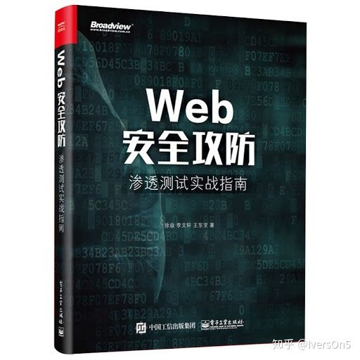
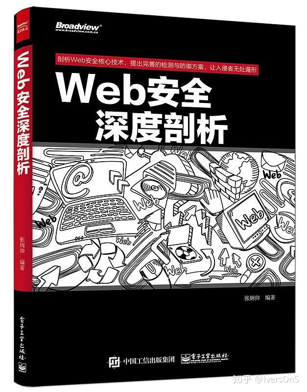
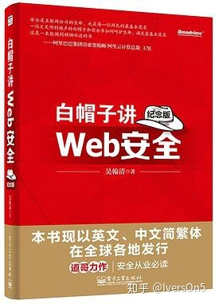
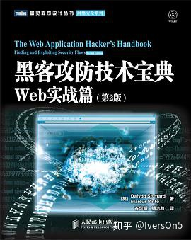
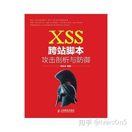
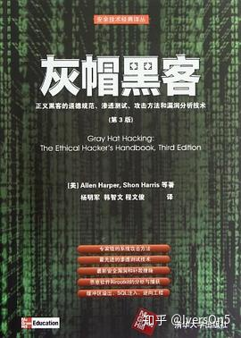

入门书籍1
2021年10月22日
0:24

# Web综合渗透方向

## 《Web安全攻防：渗透测试实战指南》

在新手层面相对深入讲解了SQL注入的利用；知识排序衔接存在一定的问题。

如：SQL注入虽不一定都会进后台，但是不能直接拿SHELL的时候都会想办法进后台，而文件上传一般都会在后台，包括管理和用户后台，所以文件上传章节排在SQL后面较为合适。 

该书90%的文字是不涉及原理的，截图和基础部分占了非常大的篇幅，总体来说，新人朋友可以阅读学习，操作不多的朋友还是有益处的。

*（私以为，涉及面广那么目录就会显得高大上，对于没买到只能看目录和新手朋友来说，咋一看：哇，贼强！买了，作者肯定很用心。其实，emmm……该书展现出来的意思其实就是想赚个名头，为后期搞钱做铺垫，当然这无可厚非。)*

## 《Web安全深度剖析》

该书内容符合“Web安全”的主题，没有过多涉及其他领域的知识，相对比较专一，深度和广度适中，有一定的原理讲解，算是由浅入深了。 就Web渗透的内容来说会更加深入、细致，适合有一定计算机基础的人阅读学习。

## 《白帽子讲web安全》

用3个词形容：专业、全面、较为深入。

 专业意味着一般人是看不懂的，有很多的专业名词，比较晦涩，一般人看不懂，估计看着看着就想睡觉。 全面意味着80%的知识你现阶段都没办法用得到，所以会比较难掌握，毕竟想要掌握知识点就要实际操作一波才能记牢。 深入指的是相对上面两本来说会更加深入，但是不用使用一些图片来展示，而是用文字来概括。
总结说来，全书能不用图片就不用图片，能不涉及具体案例就不涉及，当然是会引用一些事件来表明某些技术的特性和产生原因。你看完全书，并不会发现自己的渗透技术会提高很多，好像书中没啥子营养，但感觉又很有味道，具体是啥又讲不出。
为了得到答案，我们看下该书作者的背景吧。该书作者是吴翰清，道上称其道哥，早年叫“刺”，也被人敬称为“刺总”，是阿里巴巴云计算有限公司的安全专家。他自2005年起就任职于阿里巴巴，到2014年该书出版，他将近工作20年，包括工作前的实战经验，超过20年。这样一位身经百战的安全专家，我能感觉到他在努力地讲解web渗透的技术，但是20年的经历使得他的安全视角变得非常高，不会拘泥于其中的技术细节，更多的是其安全观的阐述和安全理论的表达。
鹿衔草是这样说的：普通渗透选手看这本书就类似于本科生看院士的书，思想知识储备都不在一个层面上，作者是安全专家，从高屋建瓴地角度去刻画web安全，更侧重框架的构建，而小白往往更关注一个技术在实际当中的体现，所以这本书更适合于理论实践都到达一个层次之后，回头去总结审视自己的web安全观。

## 《黑客攻防技术宝典 Web实战篇 第2版》

摘抄一段该书籍前言中的几段话： 1. “本书是发现并利用Web应用程序安全漏洞的实用指南。” 2. “如果你想了解如何运行端口扫描器、攻击防火墙或者以其他方式对服务器进行渗透测试，我们建议你阅读其他图书。\*\*但是，如果你希望了解渗透测试员如何攻击Web应用程序、窃取敏感数据、执行未授权操作，那么本书可以满足你的需要。” 3. “本书极其注重实用性。”
该书也如起前言说的，从原理到实践，详细、透测、全面。乃实战渗透的经典之作。*毕竟作者团队是Burp suite的团队，注重实战。*
翻译版不足：我本人没有细看，根据豆瓣评书的评论，该书翻译的并不好。
推荐有了一定实战经验的人群阅读学习。
豆瓣书评：[https://book.douban.com/subject/10793814/](https://link.zhihu.com/?target=https%3A//book.douban.com/subject/10793814/)
推荐星级：⭐⭐⭐⭐⭐新手阅读推荐星级：⭐⭐

# Web专项渗透

## 《SQL注入攻击与防御（第二版）》

该书共426页，就讲SQL注入的攻防，这也就是为什么这么多年来，各种培训课程都会有很大的篇幅讲解SQL注入，因为SQL注入的内容确实多！ 同样的，这种专业的书，是需要有基础的，因为提到了各种数据库，至少来说你得熟悉其中一种数据库，不然玩不转的。 想要深入SQL注入的朋友，必看这本书。
豆瓣书评：[https://book.douban.com/subject/25815527/](https://link.zhihu.com/?target=https%3A//book.douban.com/subject/25815527/)
推荐星级：⭐⭐⭐⭐新手阅读推荐星级：⭐

《XSS跨站脚本攻击剖析与防御》

该书共263页，适合有javascript和html基础的朋友看，只讲XSS攻防，相对于SQL注入少了很多了，且书内图片、代码占了不少的篇幅，不过专门讲XSS的书就这本，讲的其实也不错，想要深入XSS的可以看一下，说真的，我不会XSS。
豆瓣评分：[https://book.douban.com/subject/25711796/](https://link.zhihu.com/?target=https%3A//book.douban.com/subject/25711796/)
推荐星级：⭐⭐⭐⭐新手阅读推荐星级：⭐

## 《社会工程》

这个话，其实也挺看天赋，有些人天生就能吹牛，跟人自然熟。后天也能学习一下，这个没啥子推荐的，饱览群书就行，把淘宝天猫京东当当能买到的关于社工、心理学、社交学的书都看一遍咯。
如果非要推荐一本跟咱们渗透接近的，那就《社会工程：安全体系中的人性漏洞》

## 《灰帽黑客》

该书是业界大佬【不能告诉你们是谁】推荐看的，我没有具体看，看了一页，写的确实不错，想要看这本书，没有深厚的各类编程基础和几年的实战经验，还是不要看了。
其他
Kali
这个我打算单独写个文章，因为对于新手想学kali这件事情感触颇多，寥寥几行怎能表达我的愤懑之情。
最后的推荐
无任何基础的可以先看《Web安全攻防：渗透测试实战指南》来找找感觉，然后再看一下渗透教程，不过对于网上的那些教程，我不敢推荐，实在是不敢恭维。我还是推荐我们5号黯区的Web渗透培训课程的，由浅入深，原理和实战，课程讲解思路清晰，文档结构明了。学完我们的课程之后再用《Web安全深度剖析》查漏补缺。等这些都搞定，且已经都实战检验完成，那去面试安全公司，没得任何问题。毕竟我们的课程确实够深度。

书籍电子版可加群获取

*来自 \<<https://zhuanlan.zhihu.com/p/141886446>\>*

