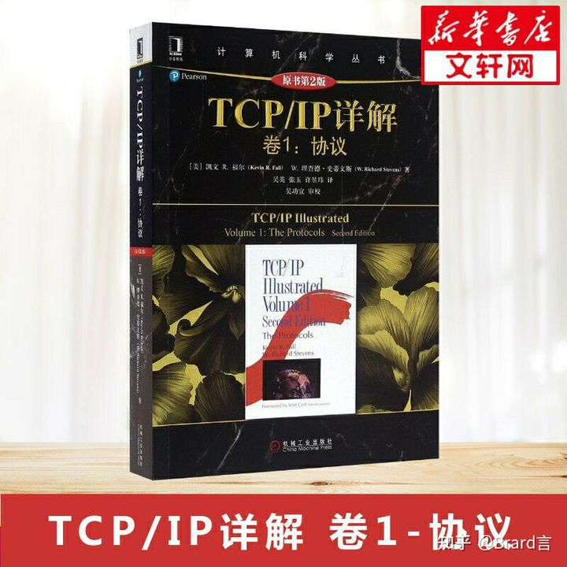
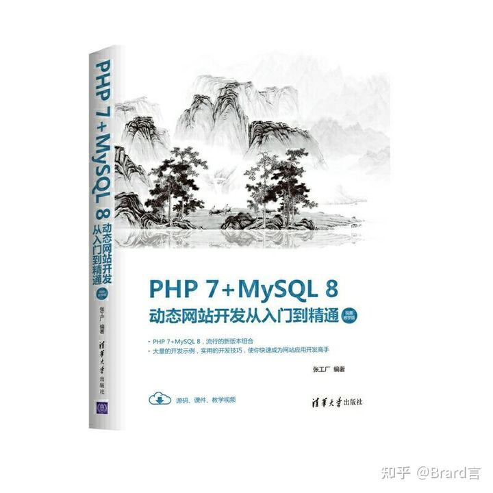
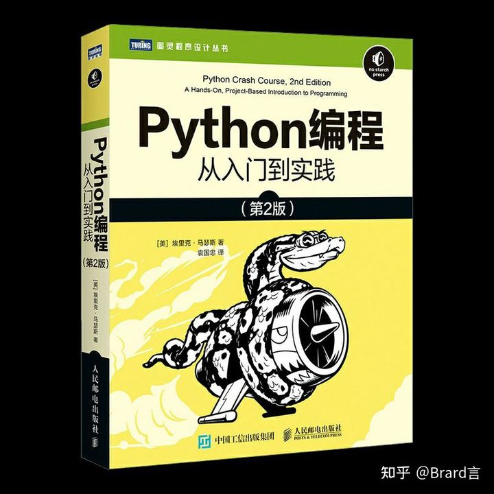

入门书籍2
2021年10月22日
0:25
作者：Beard言
链接：https://www.zhihu.com/question/454481552/answer/1834333982

# 新手路线

## **1.网络基础**

### 《TCP/IP详解卷1：协议》

协议在以后得学习中非常重要，比如隐蔽隧道的搭建，代理，主机发现，端口探测等都和协议有着很大的关系

## **2.编程基础**

### 《PHP7+MySQL 8动态网站开发从入门到精通》

### 《Python编程从入门到实践 》

用第一本书了解编程以及数据库，只有明白程序运行的规则，才能有效的利用漏洞进行攻击。
python是著名的胶水程序，在大部分攻击时，需要自己编写适用于该系统的攻击脚本。
以上之前让你入门，后续再继续学习其他数据库自己其他语言

## **3.漏洞基础**

恭喜你，到这一步已经可以利用漏洞进行简单攻击了。
此阶段没有书籍推荐，可去各大论坛进行学习。
上面学到的知识现在就可以用到了。
搭建靶场
直接在网络上进行漏洞尝试是很危险的。

## **4.学好英文**

这一步很无奈，很多资料都是英文版本的，cve也是国外的网站。

## **5.内网渗透**

这一步也没有什么推荐的书，攻击技术与更新换代很快，这个时间可能快到 书籍出售时，技术已经落伍。

