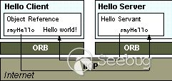

白帽子
2021年10月22日
0:16

## 白帽子入门书籍

- 《白帽子讲Web安全》
- 《白帽子讲浏览器安全》
- 《Burp Suite实战指南》
- 《黑客大曝光系列》
- 《代码审计》
- 《鸟哥的Linux私房菜》
- 《Nmap Network Scanning》
白帽子进阶
- 《OWASP测试指南》
- 《加密与解密》
- 《TCP/IP详解》
- 《HTTP权威指南》
- 《0day安全：软件漏洞分析技术》
- 《漏洞战争》
白帽子高级
- 《Windows核心编程》
- 《内核漏洞的利用与防范》
- 《Hacking: The Art of Exploitation》
- 《深入理解Java虚拟机》
- 《现代编译原理》
- 《无线电安全攻防大揭秘》
我也为大家搜集了一些电子版的书籍，有需要的可以在公众号后台留言“电子书”领取

*来自 \< <https://zhuanlan.zhihu.com/p/136872221>\>*

## 方向选择

- web安全
- 内网安全
- 无线安全
- 安卓/ios安全逆向
- 云计算安全
- 区块链安全
- 工控安全
这里只列出了常见的一些安全方向（狗头保命）。安全的细分方向有很多，更多的随着大家入坑越来越深就会有所了解的~

## 就业（仅供参考）

- 渗透测试工程师 （1-3年 本科）10-15K
- 渗透测试专家 （5-10年 本科） 15-25K
- 二进制安全研究员（经验不限 本科）10-18K
- 源代码审计工程师（3-5年 本科） 10-15K
- 应急响应工程师（经验不限，学历不限）12-20K
以上数据均来自招聘网站

我在网上也看到了好多劝退的帖子，在这里我想说一句，只要你有足够的本事没有哪个行业是不好的

## 职业技能

根据自己学习的方向，精通下面的几点就好，没必要强求自己都精通，慢慢来（如果不知道自己的方向该学什么可以看一眼招聘网站）
- 精通渗透测试步骤、方法、流程，具备独立开展渗透工作的能力
- 熟练掌握web安全和漏洞挖掘，熟悉漏洞的原理、方法、利用手段及解决方案
- 熟悉代码安全审计(php/asp/jsp/python/Java)
- 了解采用PHP/JAVA/ASP等语言开发的程序代码中缺陷和安全漏洞
- 熟练掌握主流源代码审计工具，如Checkmarx CxEnterprise、Armorize CodeSecure、Fortify SCA、RIPS等
- 至少掌握python/ruby/perl/php等两门脚本语言
- 熟悉常用的储存技术，如MySQL、Redis、PostgreSQL等
- 拥有数据清洗，爬虫开发经验
- 熟悉Tornado、Django、Flask等框架，并能快速使用构建web
- 至少掌握C/C++/GO/Delphi/Java等两门编程语言
- 精通二进制漏洞挖掘、拥有漏洞挖掘的实战经验
- 精通Windows、Linux操作系统
- 熟练使用Linux进行开发和部署
- 精通多架构(X86/X64/ARM/MIPS等)
- 熟悉常见文件格式及网络协议，并有定制FUZZ工具的经验
- 有漏洞挖掘经验或获取CVE(CNVD、CNNVD)编号；有相关文章，出版书籍者优先
- 熟悉使用Linux下各类IDE/Vim及Git等版本控制工具
- 独立或合作开发过安全相关工具、平台、项目者；在t00ls、freebuf、Seebug、[http://exploitdb.com](https://link.zhihu.com/?target=http%3A//exploitdb.com)等网站发布过漏洞、文章者优先。

更系统地我推荐看一下《知道创宇研发技能表V3.1》

[知道创宇研发技能表v3.1 2016/5/18 发布 by @知道创宇(www.knownsec.com) @余弦 & 404团队 后续动态请关注微信公众号：Lazy-Thought​blog.knownsec.com/Knownsec_RD_Checklist/index.html](https://link.zhihu.com/?target=https%3A//blog.knownsec.com/Knownsec_RD_Checklist/index.html)

## 大牛的blog站

确定好自己的方向后，要善于查找资料，培养记笔记的和写blog的习惯。学习新知识后立马实践，并不断练习

关注大牛blog，跟随大牛记录的学习历程来学习也不失为一个好办法。推荐几个大牛的blog站：

[LoRexxar's Blog​lorexxar.cn/](https://link.zhihu.com/?target=https%3A//lorexxar.cn/)

[赵树祥的博客_子非鱼yy_CSDN博客-spring boot,spring cloud,错误集锦领域博主​blog.csdn.net/ztx114](https://link.zhihu.com/?target=https%3A//blog.csdn.net/ztx114)

[CSDN-个人空间​me.csdn.net/Eastmount](https://link.zhihu.com/?target=https%3A//me.csdn.net/Eastmount)

[七月火 \| Mochazz's blog​mochazz.github.io/](https://link.zhihu.com/?target=https%3A//mochazz.github.io/)

[知道创宇​blog.knownsec.com](https://link.zhihu.com/?target=https%3A//blog.knownsec.com)

[首页 \| 离别歌​www.leavesongs.com/](https://link.zhihu.com/?target=https%3A//www.leavesongs.com/)

[//:alert(/Hacking Symbol/)//余弦​evilcos.me/](https://link.zhihu.com/?target=https%3A//evilcos.me/)

[HCocoa的博客​www.hcocoa.com/](https://link.zhihu.com/?target=http%3A//www.hcocoa.com/)

[Stay hungry Stay foolish​uknowsec.cn/](https://link.zhihu.com/?target=https%3A//uknowsec.cn/)

## 如何实践？

### 1.自己搭建渗透环境

在linux系统中安装lanmp \#其实apace 和nginx安装一个就行了。  
在windows系统中安装wamp  
搭建dvwa漏洞  
搭建sql注入平台  
搭建xss平台  
学习利用docker镜像中现有的渗透环境  
学习vm or vrtualbox的使用  
学会在vulnhub上面下载现成的漏洞靶机到本地搭建。

### 2.利用现有的学习平台

- bugku
- 实验吧（维护中）
- 攻防世界
- 合天网安实验室
- i春秋
- 看雪论坛
3\. 企业SRC

腾讯安全响应中心：腾讯安全应急响应中心  
补天漏洞响应平台：补天 - 企业和白帽子共赢的漏洞响应平台，帮助企业建立SRC  
漏洞盒子：漏洞盒子 \| 互联网安全测试众测平台  
华为安全奖励计划：华为安全奖励计划  
百度安全应急响应中心：百度安全应急响应中心  
漏洞银行：漏洞银行(BUGBANK) 官方网站 \| 领先的网络安全漏洞发现品牌 \| 开放安全的提出者与倡导者 \| 创新的漏洞发现平台  
阿里安全响应中心：https://security.alibaba.com/  
i春秋SRC部落：i春秋SRC部落_安全服务_渗透测试_企业安全众测解决方案  
教育行业漏洞报告平台：主页 \| 教育行业漏洞报告平台（Beta）  
...  

### 更多：

[国内漏洞响应平台（SRC）导航 - 安全客，安全资讯平台​www.anquanke.com/src](https://link.zhihu.com/?target=https%3A//www.anquanke.com/src)

## 学习资源总结

### 学习站点：

（首推）乌云文章备份：

[0pen1/wooyun_articles​github.com/0pen1/wooyun_articles](https://link.zhihu.com/?target=https%3A//github.com/0pen1/wooyun_articles)

CSDN:

[CSDN-专业IT技术社区​www.csdn.net/](https://link.zhihu.com/?target=https%3A//www.csdn.net/)

博客园：

[博客园 - 开发者的网上家园​www.cnblogs.com/](https://link.zhihu.com/?target=https%3A//www.cnblogs.com/)

GitHub：

[Build software better, together​github.com/](https://link.zhihu.com/?target=https%3A//github.com/)

FreeBuf:

[FreeBuf互联网安全新媒体平台​www.freebuf.com/](https://link.zhihu.com/?target=http%3A//www.freebuf.com/)

Seebug:

[Paper​paper.seebug.org/](https://link.zhihu.com/?target=https%3A//paper.seebug.org/)

secwiki:

[SecWiki-安全维基,汇集国内外优秀安全资讯、工具和网站​www.sec-wiki.com/](https://link.zhihu.com/?target=https%3A//www.sec-wiki.com/)

### 吾爱破解（逆向破解方向）：

[吾爱破解 - LCG - LSG\|安卓破解\|病毒分析\|www.52pojie.cn​www.52pojie.cn/](https://link.zhihu.com/?target=https%3A//www.52pojie.cn/)

安全师：

[安全师 \| 网络安全社区\|渗透测试-学安全技术就上secshi!​www.secshi.com/](https://link.zhihu.com/?target=https%3A//www.secshi.com/)

（由公众号安全祖师爷那伙人创办的，很多大咖入驻）

### 学习视频：（可以看但不要沉迷~）

哔哩哔哩（无可争议）:

[哔哩哔哩 (゜-゜)つロ 干杯~-bilibili​www.bilibili.com/](https://link.zhihu.com/?target=https%3A//www.bilibili.com/)

YouTube（需扶墙访问）:

[https://www.youtube.com/​www.youtube.com/](https://link.zhihu.com/?target=https%3A//www.youtube.com/)

这里只推荐大家一些免费的渠道~

*来自 \< <https://zhuanlan.zhihu.com/p/136872221>\>*

