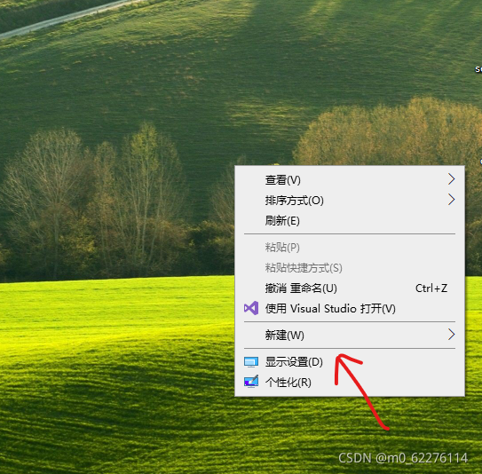
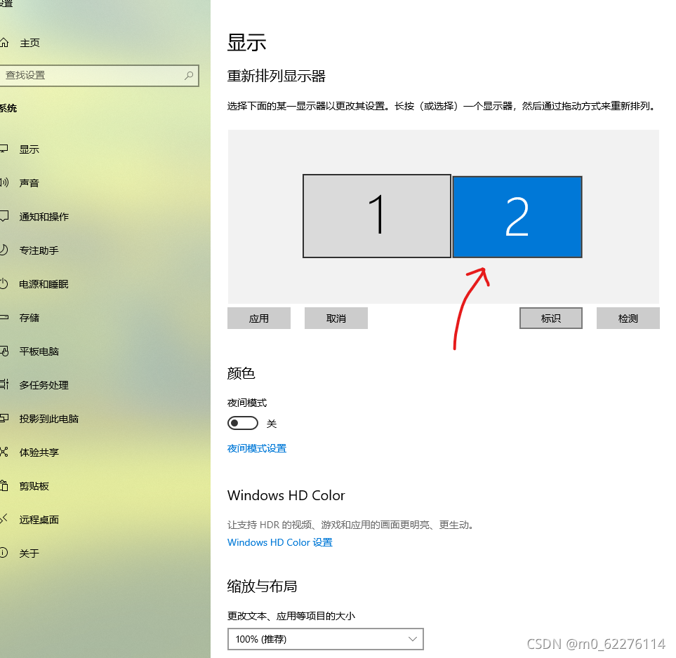
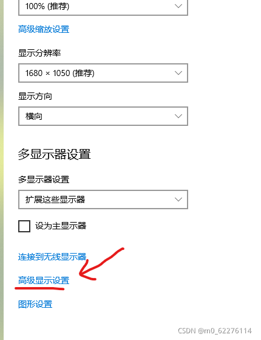
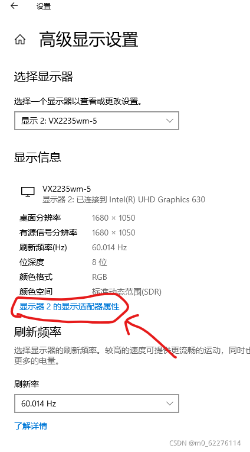
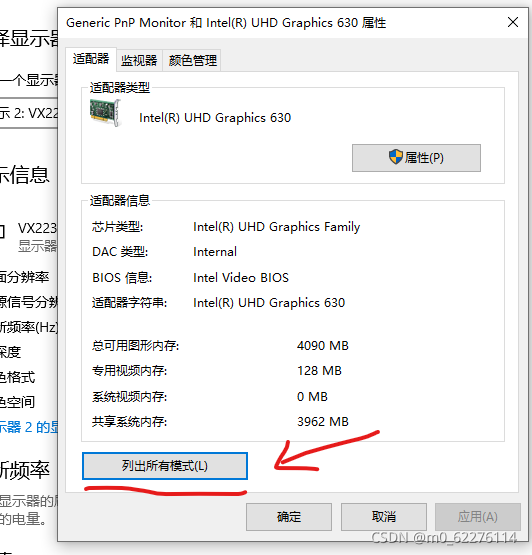
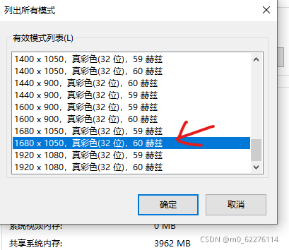
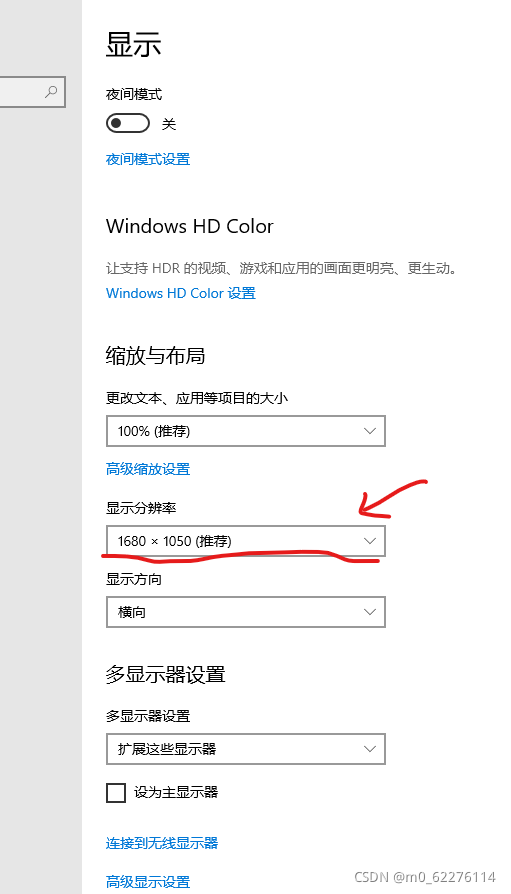

# win10下，扩展屏不清晰模糊。

https://blog.csdn.net/m0_62276114/article/details/121115105

 

      在搜索网上一圈后，有改正显示分辨率，改正缩放比例，两个屏幕的分辨率相同的。我都试了一遍，没有效果。

**直接上解决方法：**

**1，在屏幕上右键，单击“显示设置”。**

 2，**单击屏幕2，在屏幕2下进行设置。翻到页面底部，点击高级显示设置**

 

 **3，点击“显示器2的显示适配器属性”**

**4，点击“列出所有模式(L)”**

**5，我电脑选择的是“1680\*1050真彩色（32位）60赫兹”。屏幕瞬间清晰。**（你的电脑如果到此不清系可以多试一下其他“有效模式列表（L）"里的选项）。

6，回到步骤2的界面，将”显示分辨率“调整为你设置的分辨率。

NOTE:

建议你可以试试其他方法之后，用我的这个方法。