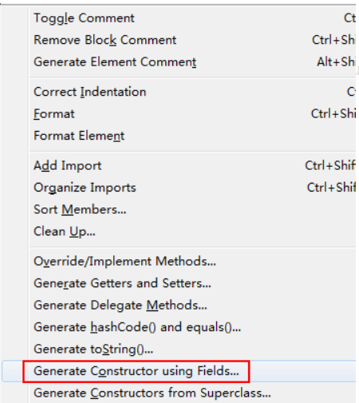

快捷键
2022年1月22日
0:46

new自动补齐 Ctrl+1

按住Ctrl 光标指向类可以看原码

Alt+/可以查看补齐方法

新建类对象方法的重载如下
鼠标左键—\>Sources—\>Override/Implement Methods

找到接口的所有实现类
1、找到要打开的接口类
2、双击接口名选中
3、按Ctrl+T打开接口实现类
或者选中该接口后+F4

自动注释：
选中后 Ctrl+/

Ctrl+Shift+\<-
可以快速选中一个单词

最右边的两个叉是切换不同的程序作用

==eclipse构造器==
在[eclipse](https://so.csdn.net/so/search?q=eclipse&spm=1001.2101.3001.7020)中按快捷键 [alt](https://www.baidu.com/s?wd=alt&tn=44039180_cpr&fenlei=mv6quAkxTZn0IZRqIHckPjm4nH00T1YvrjbsPj0vm1whuj-bPjNb0ZwV5Hcvrjm3rH6sPfKWUMw85HfYnjn4nH6sgvPsT6KdThsqpZwYTjCEQLGCpyw9Uz4Bmy-bIi4WUvYETgN-TLwGUv3EnHTznjf4rjmk)+ shift + s 或

**
“source---------generate constructor using fields”

在eclipse的左边是函数名或者说构？

