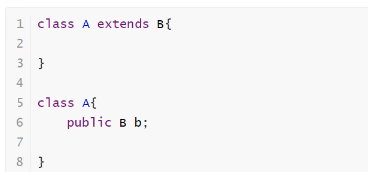
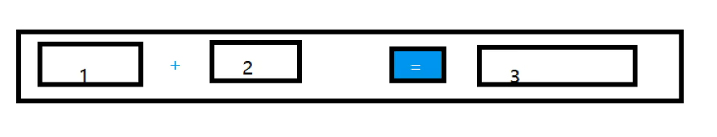
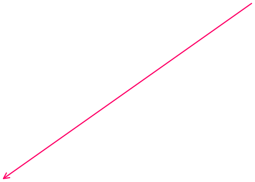
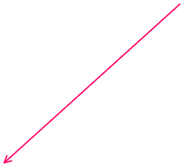

OOP原则：组合，大于继承
减少耦合性事件

优先使用组合

lable：标签
具有提示作用的符号

TextField：文本框
输入内容使用

button：按钮

Calcuator目前代码：
全程在写过程 面向过程

package com.gui.leason02;

import java.awt.Button;
import java.awt.FlowLayout;
import java.awt.Frame;
import java.awt.HeadlessException;
import java.awt.Label;
import java.awt.TextField;
import java.awt.event.ActionEvent;
import java.awt.event.ActionListener;

//简易计算器
public class TestCalc {
public static void main(String\[\] args) {

//在man方法里new一个具体的类

new Calculator();

}
}

//计算器类
class Calculator extends Frame{
public Calculator(){

//3个文本框

TextField num1 = new TextField(10);//最大可以填写多少个字符

TextField num2 = new TextField(10);

TextField num3 = new TextField(20);

//1个按钮

Button button = new Button("=");//下一行通过传参的方式很好用

button.addActionListener(new MyCalculatorListener(num1,num2,num3));

//1个标签

Label label = new Label("+");

//布局

setLayout(new FlowLayout());

add(num1);

add(label);

add(num2);

add(button);

add(num3);

pack();

setVisible(true);

}

}

//监听器类,给上述的等号绑定一个事件
class MyCalculatorListener implements ActionListener{

//获取3个变量,直接将TextField输入的内容当作参数传入

//本类操作

private TextField num1,num2,num3;

public MyCalculatorListener(TextField num1,TextField num2,TextField num3) {

this.num1 = num1;

this.num2 = num2;

this.num3 = num3;

}

@Override

public void actionPerformed(ActionEvent e) {

//1、获得加数与被加数

int n1 = Integer.parseInt(num1.getText());//将输入的字符串转换为int型

int n2 = Integer.parseInt(num2.getText());

//1、将加法运算后的值放入第三个框

num3.setText(""+(n1+n2));//直接将n1与n2相加，并转换成字符串型输出，不加括号直接是两个字符

//3、清除前两个值

num1.setText("");

num2.setText("");

}

}

Calcuator优化代码：
完全改造为面向对象

思想：
不建议使用三大特性；
继承：继承增加了耦合性
多态：让代码更麻烦
//组合写法

package com.gui.leason02;

import java.awt.Button;
import java.awt.FlowLayout;
import java.awt.Frame;
import java.awt.HeadlessException;
import java.awt.Label;
import java.awt.TextField;
import java.awt.event.ActionEvent;
import java.awt.event.ActionListener;

//简易计算器
public class TestCalc2 {
public static void main(String\[\] args) {

//在man方法里new一个具体的类

new Calculator1().loadFrame(); ==//对象加方法 面向对象编程==

}
}

//计算器类
class Calculator1 extends Frame{

//属性

TextField num1,num2,num3;

//方法

public void loadFrame() {

//3个文本框
//TextField num1 = new TextField(10);//最大可以填写多少个字符
//TextField num2 = new TextField(10);
//TextField num3 = new TextField(20);
num1 = new TextField(10);

num2 = new TextField(10);

num3 = new TextField(20);

Button button = new Button("=");//按钮

Label label = new Label("+");//1个标签

button.addActionListener(new MyCalculatorListener1(this));//this就是类自己
//button.addActionListener(new MyCalculatorListener(num1,num2,num3));

//布局

setLayout(new FlowLayout());

add(num1);

add(label);

add(num2);

add(button);

add(num3);

pack();

setVisible(true);

}

//public Calculator(){
//
//}//优化代码不使用构造器

}

//监听器类,给上述的等号绑定一个事件
class MyCalculatorListener1 implements ActionListener{

//在一个类中组合另外一个类

Calculator1 calculator =null;

public MyCalculatorListener1(Calculator1 calculator) {
//this.num1 = num1;
//this.num2 = num2;
//this.num3 = num3;
this.calculator = calculator;

}

@Override

public void actionPerformed(ActionEvent e) {

//1、获得加数与被加数

//2、将加法运算后的值放入第三个框

//3、清除前两个值

int n1 = Integer.parseInt(calculator.num1.getText());

int n2 = Integer.parseInt(calculator.num2.getText());

calculator.num3.setText(""+(n1+n2));

calculator.num1.setText("");

calculator.num2.setText("");

}

}

最最优化
内部类：将计算提到主类里面
//使用内部类之后想要获得一个属性直接就可以拿到
//内部类最大的好处就是可以畅通无阻的访问外部类的属性和方法

package com.gui.leason02;

import java.awt.Button;
import java.awt.FlowLayout;
import java.awt.Frame;
import java.awt.HeadlessException;
import java.awt.Label;
import java.awt.TextField;
import java.awt.event.ActionEvent;
import java.awt.event.ActionListener;

//简易计算器
public class TestCalc3 {
public static void main(String\[\] args) {

//在man方法里new一个具体的类

new Calculator2().loadFrame(); //对象加方法 面向对象编程

}
}

//计算器类
class Calculator2 extends Frame{

//属性

TextField num1,num2,num3;

//方法

public void loadFrame() {

//3个文本框

num1 = new TextField(10);

num2 = new TextField(10);

num3 = new TextField(20);

Button button = new Button("=");//按钮

Label label = new Label("+");//1个标签

button.addActionListener(new MyCalculatorListener2());//this就是类自己

//布局

setLayout(new FlowLayout());

add(num1);

add(label);

add(num2);

add(button);

add(num3);

pack();

setVisible(true);

}

//监听器类

//使用内部类之后想要获得一个属性直接就可以拿到

//内部类最大的好处就是可以畅通无阻的访问外部类的属性和方法

private class MyCalculatorListener2 implements ActionListener{

@Override

public void actionPerformed(ActionEvent e) {

//1、获得加数与被加数

//2、将加法运算后的值放入第三个框

//3、清除前两个值

int n1 = Integer.parseInt(num1.getText());

int n2 = Integer.parseInt(num2.getText());

num3.setText(""+(n1+n2));

num1.setText("");

num2.setText("");

}

}

}
