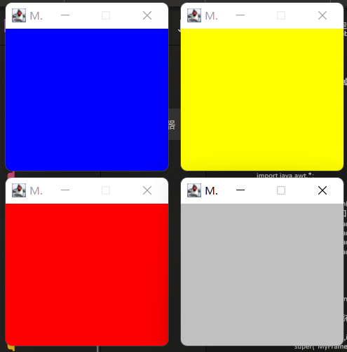

Frame

package com.gui.leason01;

import java.awt.\*;
import java.nio.file.FileSystems;

public class TeatFrame {
public static void main(String\[\] args) {

//Frame，JDK， 看源码！

Frame frame = new Frame("我的第一个java图形界面窗口");

//需要设置可见性 wigth higth

frame.setVisible(true);

//设置窗口大小

frame.setSize(400, 400);

//设置背景颜色 Color

frame.setBackground(new Color(1,1,1));

//弹出的初始位置

frame.setLocation(200, 200);

//设置大小固定

frame.setResizable(false);

}
}

问题：发现窗口关闭不掉，停止java运行
尝试回顾封装

package com.gui.leason01;

import java.awt.\*;

public class TestFrame2 {
public static void main(String\[\] args) {

//展示多个窗口 new

MyFrame myFrame1 = new MyFrame(100,100,200,200,Color.blue);

MyFrame myFrame2 = new MyFrame(300,100,200,200,Color.yellow);

MyFrame myFrame3 = new MyFrame(100,300,200,200,Color.red);

MyFrame myFrame4 = new MyFrame(300,300,200,200,Color.lightGray);

}
}

class MyFrame extends Frame{

static int id = 0;//可能存在多个窗口，需要一个计数器

public MyFrame(int x ,int y ,int w,int h, Color color) throws HeadlessException {

super("MyFrame" + (++id));

// TODO Auto-generated constructor stub

setBackground(color);

setVisible(true);

setBounds(x,y,w,h);

setResizable(false);

}

