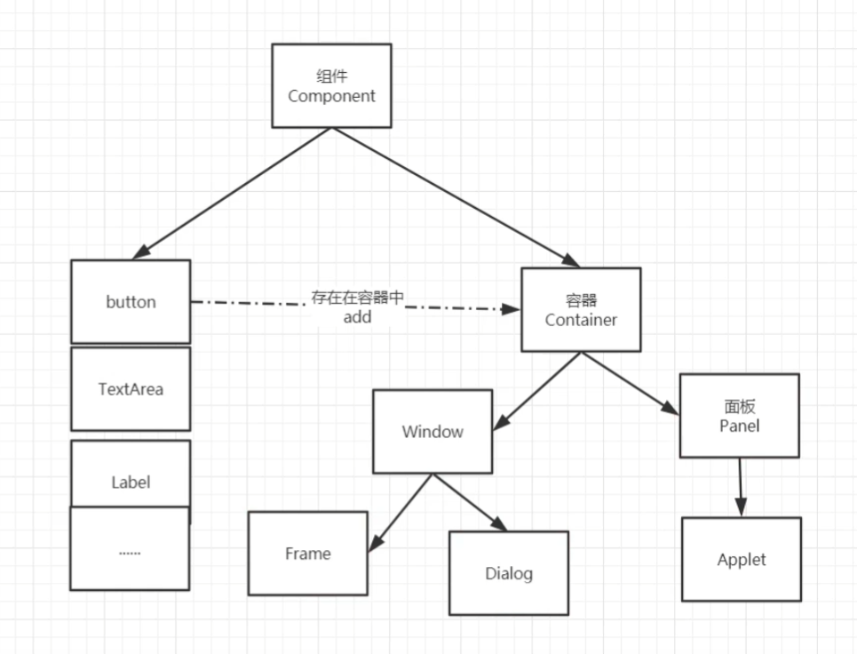
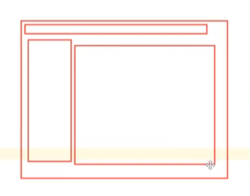
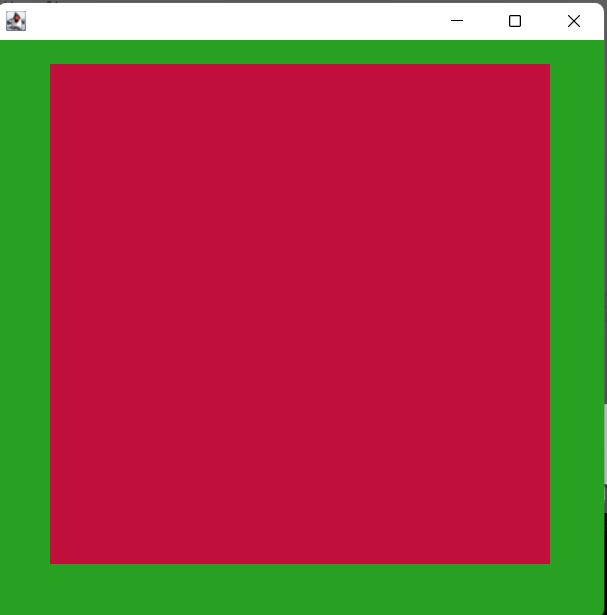

Panel面板也可以放一些组件
但是Panel不可以单独存在

最大的是Frame窗口，是唯一的
其他的都可以是Panel面板
之后就可以把一些其他的组件放在面板里

解决了关闭事件

package com.gui.leason01;

import java.awt.\*;
import java.awt.event.WindowAdapter;
import java.awt.event.WindowEvent;

//Panel 可以看成是一个空间，但是不能单独存在，需要放在Frame里面
public class TestPanel {
public static void main(String\[\] args) {

//总窗口

Frame frame = new Frame();

//布局的概念

//panel面板

Panel panel = new Panel();

//设置布局，如果不设置，那么会默认置顶

frame.setLayout(null);

//窗口坐标

frame.setBounds(300, 300, 500, 500);

frame.setBackground(new Color(40,161,35));

//Panel设置坐标，相对于Frame，即相对坐标

panel.setBounds(50, 50, 400, 400);

panel.setBackground(new Color(193,15,60));

//面板放进窗口里。就是Frame添加一个Panel

//frame.add(panel)

frame.add(panel);

frame.setVisible(true);

//监听事件，监听窗口关闭事件 System.exit(0);

//适配器模式：实现了监听接口

frame.addWindowListener(new WindowAdapter() {

@Override

public void windowClosing(WindowEvent e) {

//窗口点击关闭的时候要做的事情

System.exit(0);

}

});

}
}

