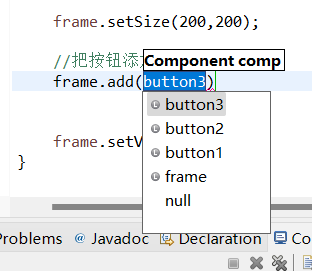
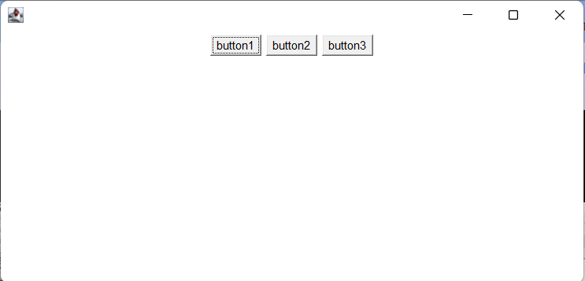
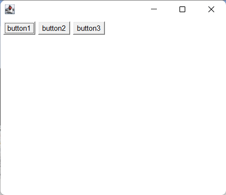
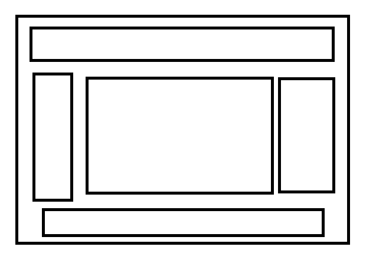
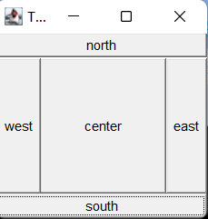
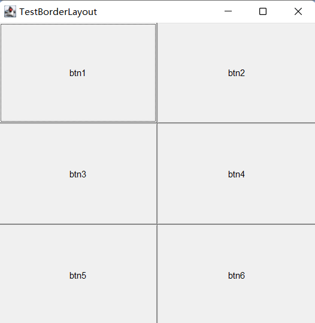

3中布局管理器
2022年1月22日
0:14

1、流式布局
2、东南西北中
3、表格布局

流式布局

frame中add按钮显示component
所以button 也是component

//设置为流式布局
//frame.setLayout(new FlowLayout());
//默认按钮在方框的最上面出现，且居中
//frame.setLayout(new FlowLayout());

frame.setLayout(newFlowLayout(FlowLut.LEFT));

东西南北中Border

package com.gui.leason01;

import java.awt.BorderLayout;
import java.awt.Button;
import java.util.concurrent.ConcurrentHashMap.KeySetView;
import java.awt.\*;

public class TestBorderLayout {
public static void main(String\[\] args) {

Frame frame = new Frame("TestBorderLayout");

Button east = new Button("east");

Button west = new Button("west");

Button south = new Button("south");

Button north = new Button("north");

Button center = new Button("center");

//按钮位置

//frame.add(new Button("east"),BorderLayout.EAST);

//与下一行作用相同

frame.add(east,BorderLayout.EAST);

frame.add(west,BorderLayout.WEST);

frame.add(south,BorderLayout.SOUTH);

frame.add(north,BorderLayout.NORTH);

frame.add(center,BorderLayout.CENTER);

//初始大小

frame.setSize(200, 200);

//可见

frame.setVisible(true);

//布局欣赏性差，是所以可以嵌套使用

}

}

表格布局 Grid
(就是几行几列)

package com.gui.leason01;

import java.awt.Button;
import java.awt.Frame;
import java.awt.GridBagLayout;
import java.awt.GridLayout;

public class TestGridLayout {
public static void main(String\[\] args) {

Frame frame = new Frame("TestBorderLayout");

Button btn1 = new Button("btn1");

Button btn2 = new Button("btn2");

Button btn3 = new Button("btn3");

Button btn4 = new Button("btn4");

Button btn5 = new Button("btn5");

Button btn6 = new Button("btn6");

frame.setLayout(new GridLayout(3,2));

frame.add(btn1);

frame.add(btn2);

frame.add(btn3);

frame.add(btn4);

frame.add(btn5);

frame.add(btn6);

frame.pack();

//java函数，自动最优布局并填充，不用再设置按钮相对大小

frame.setVisible(true);

}
}

