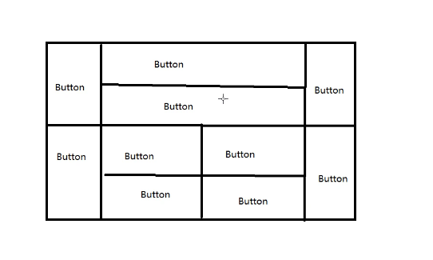
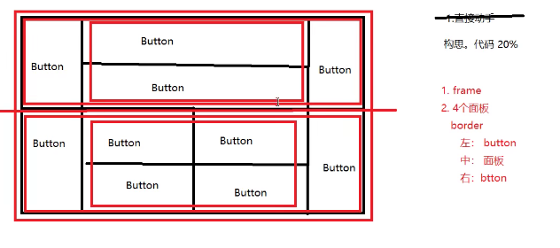
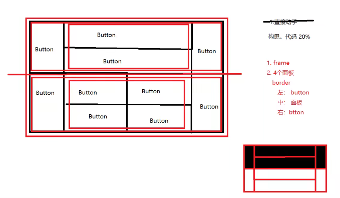
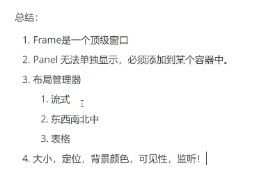

实现上面的面板

两个大的panel将frame分为上下两部分
再有两个小panel放在上下两个panel的中间
然后再在panel上填充button、

分析过程

代码实现
package com.gui.leason01;

import java.awt.\*;

//练习的demo讲解
public class ExDemo {
public static void main(String\[\] args) {

==//总的Frame==

Frame frame = new Frame();

frame.setSize(400, 300);

frame.setLocation(300, 400);

frame.setBackground(Color.black);

frame.setVisible(true);

==//将窗口一分为2，是为了放入两个面板==

frame.setLayout(new GridLayout(2,1));

//4个panel

Panel p1 = new Panel(new BorderLayout());

Panel p2 = new Panel(new GridLayout(2,1));

Panel p3 = new Panel(new BorderLayout());

Panel p4 = new Panel(new GridLayout(2,2));

==//上半部分==

==//大的面板采用东南西北中Border==

==//然后在其东西放入两个Button==

==//再建立一个采用表格布局的小面板Grid==

==//用按钮按照Grid布局的面板设定将其填充==

==//再将Grid小面板放入Border大面板==

p1.add(new Button("East-1"),BorderLayout.EAST);

p1.add(new Button("West-1"),BorderLayout.WEST);

p2.add(new Button("p2-btn-1"));

p2.add(new Button("p2-btn-2"));

==//p2 放在 p1里,因为没有填充南北，所以center会自动把north与south的位置填充==

p1.add(p2,BorderLayout.CENTER);

==//下半部分==

p3.add(new Button("East-1"),BorderLayout.EAST);

p3.add(new Button("West-1"),BorderLayout.WEST);

==//中间4个，使用for循环将Button依次放入Grid小面板==

for(int i = 0; i\<4; i++) {

p4.add(new Button("for-"+i));

}

==//把p4装入p3==

p3.add(p4,BorderLayout.CENTER);

==//将panels放入frame==

frame.add(p1);

frame.add(p3);

==//监听事件==

frame.addWindowListener(new WindowAdapter() {

@Override

public void windowClosing(WindowEvent e) {

// TODO Auto-generated method stub

System.exit(0);

}

});

}
}

因为使用WindowListener之后发现是一个接口，所以使用WindowAdapter
然后Override其一个方法，进行对System.exit(0);的监听。

