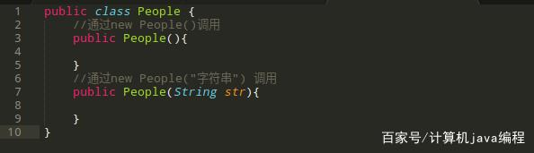
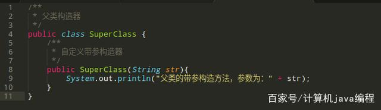
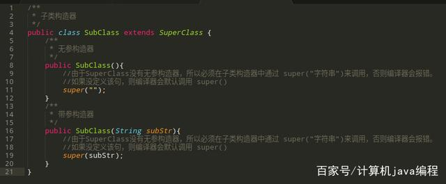
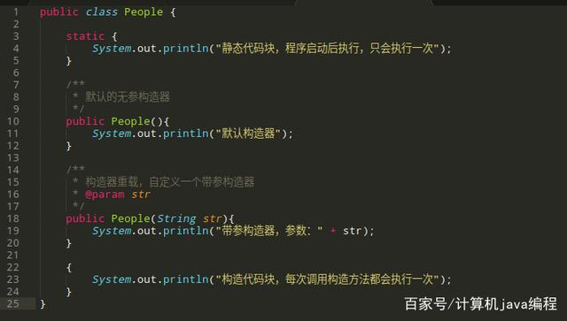
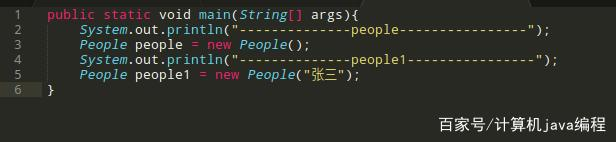
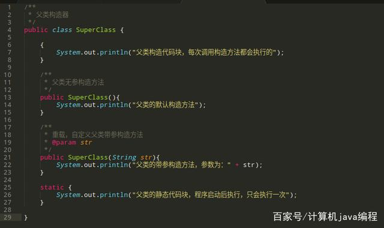
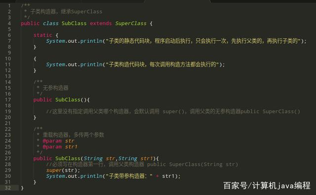
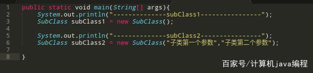

构造器

**知识点**
- **什么是构造器**构造器通常也叫构造方法、构造函数，构造器在每个项目中几乎无处不在。当你new一个对象时，就会调用构造器。构造器格式如下：\[修饰符，比如public\] 类名 (参数列表，可以没有参数){//这里不能有return}
- **默认构造器**如果没有定义构造器，则会默认一个无参构造器，这就是为什么你定义了一个对象，比如 People，没有定义任何构造器却可以new这个对象,比如 new People() 。如果自定义了构造器，则会覆盖默认构造器。
- **如何禁止对象被外部创建**一些特殊需求，不希望定义的对象被外部创建（典型的就是单例了），那直接将构造器的修饰符改为 private 即可。这样就不能在外部通过new来创建这个对象了。
- **构造器重载**与普通方法一样，构造器也支持重载。一个对象中是可以支持同时定义多个构造器，通过不同的参数列表来实现重载。经常看到代码中new一个对象时，有时传入参数，有时又可以不用传。比如：new People()跟new People("张三")，这里就是重载了。
- 构造器的继承子类构造器会默认调用父类无参构造器，如果父类没有无参构造器，则必须在子类构造器的第一行通过 super关键字指定调用父类的哪个构造器，具体看下文例子。final类是不允许被继承的，编译器会报错。很好理解，由于final修饰符指的是不允许被修改，而继承中，子类是可以修改父类的，这里就产生冲突了，所以final类是不允许被继承的。
- 构造器、静态代码块、构造代码块的执行顺序，
- 详见下文实例无继承的情况下的执行顺序静态代码块：只在程序启动后执行一次，优先级最高构造代码块：任何一个构造器被调用的时候，都会先执行构造代码块，优先级低于静态代码块构造器：优先级低于构造代码块总结一下优先级：静态代码块 \> 构造代码块 \> 构造器
- 
- 有继承的情况下的执行顺序：父类静态代码块：只在程序启动后执行一次，优先级最高子类静态代码块：只在程序启动后执行一次，优先级低于父类静态代码块父类构造代码块：父类任何一个构造器被调用的时候，都会执行一次，优先级低于子类静态代码块父类构造器：优先级低于父类构造代码子类构造代码块：子类任何一个构造器被调用的时候，都会执行一次，优先级低于父类构造器子类构造器：优先级低于子类构造代码块总结一下优先级：父类静态代码块 \> 子类静态代码块 \> 父类构造代码块 \> 父类构造器 \> 子类构造代码块 \> 子类构造器实例
**1.默认构造器**

新建一个类，不提供任何构造器，编译器会默认提供一个无参构造器，这就是为什么没定义任何构造器，却可以new 某个对象()

public class People {}

以上这个People类，可以直接通过 new People()来实例化。

**2. 禁止对象被外部创建**

如果不希望People在外部通过new People()来实例化，只需要将构造器定义为private

public class People {private People(){ }}

**3.构造器重载**

重载可以简单理解为：同个方法名，不同的参数列表。如果希望People能在外部通过new People() 或 new People("字符串") 来实例化，则通过以下代码即可

**4.构造器的继承**

定义父类构造器，由于该构造器自定义了一个带参构造器，覆盖了默认的无参构造器，所以不能直接 new SuperClass() 调用了，除非再定义一个无参构造器

定义子类构造器，继承SuperClass，由于SuperClass没有无参构造器，所以必须在子类构造器中通过 super("字符串")来调用，否则编译器会报错

**5. 构造器、静态代码块、构造代码块的执行顺序**

**5.1 无继承的情况**

实例化People

执行以上代码，输出：

--------------people----------------静态代码块，程序启动后执行，只会执行一次构造代码块，每次调用构造方法都会执行一次默认构造器--------------people1----------------构造代码块，每次调用构造方法都会执行一次带参构造器，参数：张三

**5.2 有继承的情况**

定义父类SuperClass

定义子类SubClass，继承SuperClass

实例化SubClass

执行以上代码，输出：

--------------subClass1----------------父类的静态代码块，程序启动后执行，只会执行一次子类的静态代码块，程序启动后执行，只会执行一次，先执行父类的，再执行子类的父类构造代码块，每次调用构造方法都会执行的父类的默认构造方法子类构造代码块，每次调用构造方法都会执行的--------------subClass2----------------父类构造代码块，每次调用构造方法都会执行的父类的带参构造方法，参数为：子类第一个参数子类构造代码块，每次调用构造方法都会执行的子类带参构造器：子类第二个参数

*来自 \<<https://baijiahao.baidu.com/s?id=1660565391219190318&wfr=spider&for=pc>\>*

在Java中,任何变量在被使用前都必须先设置初值.

Java提供了为类的成员变量赋初值的专门功能:构造方法(constructor)

构造方法是一种特殊的成员方法,它的特殊性反映在如下几个方面: 　

==1.构造方法的名字必须与定义他的类名完全相同，没有返回类型，甚至连void也没有。 　==

==2.构造方法的调用是在创建一个对象时使用new操作进行的。构造方法的作用是初始化对象。 　==

==3.每个类可以有零个或多个构造方法. 　==

==4.不能被static、final、synchronized、abstract和native修饰。构造方法不能被子类继承。 　==

==5.构造方法在创建对象时自动执行,一般不能显式地直接调用. 　　构造方法可以被重载。没有参数的构造方法称为默认构造方法，与一般的方法一样，构造方法可以进行任何活动，但是经常将他设计为进行各种初始化活动，比如初始化对象的属性。==

==具体使用：分别计算长、宽为20、10和6、3的两个长方形的面积。== 　　

class RectConstructor{ 　

double length; 　　

double width; 　　

double area(){ 　　

return length\*width; 　　} 　　

RectConstructor(double width,double length){//带参数的构造方法 　　

this.length=length; 　　this.width=width;

} 　　

} 　　

public class RectDemo{ 　　

public static void main(String args\[\])

{ 　　RectConstructor rect1=new RectConstructor(10,20); 　　

RectConstructor rect2=new RectConstructor(3,6);

double ar; 　　ar=rect1.area();

System.out.println("第一个长方形的面积是"+ar);

ar=rect2.area(); 　　System.out.println("第二个长方形的面积是"+ar);

} 　　

}

