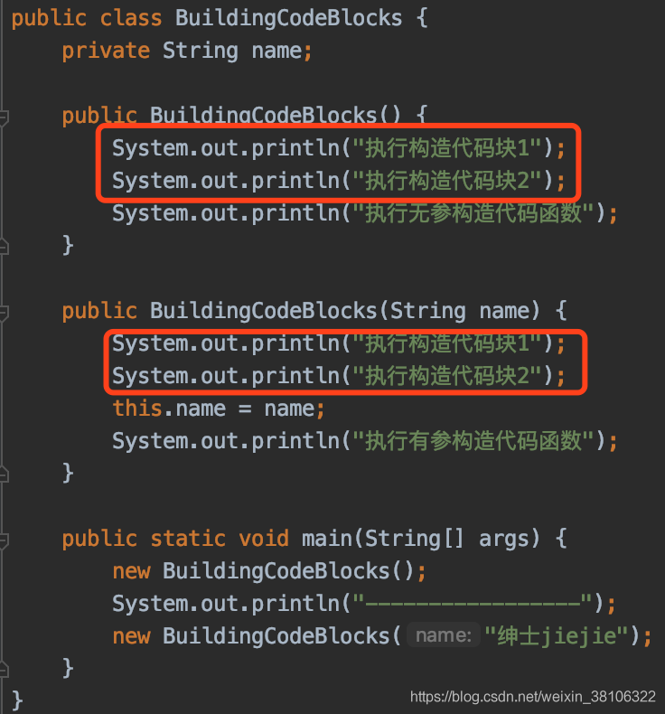

直接在类中定义，没有任何的关键字修饰，使用“{}”括起来的代码片段，就是构造代码块。

了解下构造代码块的执行顺序

测试demo：

/\*\*
\* 了解一下构造代码块
\*/
public class BuildingCodeBlocks {

private String name;

{
System.out.println("执行构造代码块1");
}

{
System.out.println("执行构造代码块2");
}

public BuildingCodeBlocks() {
System.out.println("执行无参构造代码函数");
}

public BuildingCodeBlocks(String name) {
this.name = name;
System.out.println("执行有参构造代码函数");
}

public static void main(String\[\] args) {
new BuildingCodeBlocks();
System.out.println("-----------------");
new BuildingCodeBlocks("绅士jiejie");
}
}
1
2
3
4
5
6
7
8
9
10
11
12
13
14
15
16
17
18
19
20
21
22
23
24
25
26
27
28
29
30
运行结果如下：

从运行结果可以发现，先执行的是构造代码块，然后再执行构造函数，同时构造代码块之间是按照在类中定义的顺序来执行逻辑的。

那么为什么每个构造函数执行前都会先执行下构造代码块的内容呢？

看下编译后的class文件，如下：

从class文件的可以看出，经过编译，编译器已经把构造代码块插入到每个构造函数的最前端了。所以才导致有参和无参的构造方法都会先执行构造代码块中的内容。但是这里要注意的是，构造代码块依托于构造函数，如果不执行构造函数，那么构造代码块也不会执行。

构造代码块怎么用？

可以将构造代码块想象成对构造函数中共有逻辑的抽象，把有参无参的构造函数共有的逻辑抽出来，放到构造代码块中，避免了在每个构造函数都写相同的代码逻辑，当然了，最后经过编译，结果还是一样的，不过至少实现了代码的精简，同时如果共有的逻辑很复杂，还可以把逻辑拆分到多个代码块中，按业务顺序定义在类中的位置，代码也能变得更具有可读性和可维护性
————————————————
版权声明：本文为CSDN博主「绅士jiejie」的原创文章，遵循CC 4.0 BY-SA版权协议，转载请附上原文出处链接及本声明。
原文链接：https://blog.csdn.net/weixin_38106322/article/details/108329131

