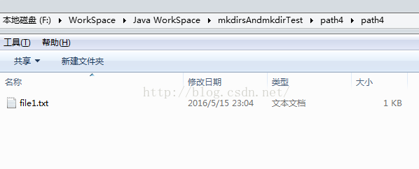

3 篇文章0 订阅

订阅专栏

ref：https://blog.csdn.net/a_woxinfeiyang_a/article/details/51419980

在Java中对文件进行操作时常常用到java.io.File.mkdir()和java.io.File.mkdirs()两个方法来创建一个目录(文件夹)，这两个方法非常相似，都是无参数且返回值都为boolean类型的方法，都是用于创建指定路径名称对应的目录，但二者主要区别如下：

java.io.File.mkdir()：只能创建一级目录，且父目录必须存在，否则无法成功创建一个目录。

java.io.File.mkdirs()：可以创建多级目录，父目录不一定存在。

下面给出一个例程可以深刻体会二者的区别：

1.  ==\importjava.io.BufferedWriter;==
2.  ==importjava.io.File;==
3.  ==importjava.io.FileWriter;==
4.  ==importjava.io.IOException;==
5.  ==importjava.io.PrintWriter;==
6.  ==importjava.text.SimpleDateFormat;==
7.  ==importjava.util.Date;==
8.  *==/\*\*==*
9.  *==\* mkdir与mkdirs测试例程==*
10. *==\* 时间：2016-5-15 22:34==*
11. *==\* 说明：1、java.io.File.mkdir()和java.io.File.mkdirs()都用于创建指定路径名称对应的目录。==*
12. *==\* 但java.io.File.mkdir()只能创建一级目录且父目录必须存在，否则将无法正确创建一个目录；==*
13. *==\* java.io.File.mkdir()可以创建多级目录，父目录不一定存在。==*
14. *==\* \*/==*
15. ==publicclassmkdirsAndmkdirTestMain{==
16. ==privatestaticfinalString path1="path1";==
17. ==privatestaticfinalString path2="path2/path2/";==
18. ==privatestaticfinalString path3="path3";==
19. ==privatestaticfinalString path4="path4/path4/";==
20. ==privatestaticfinalString filePath1="file1.txt";==
21. *==/\*\*==*
22. *==\* @paramargs==*
23. *==\*/==*
24. ==publicstaticvoidmain(String\[\] args){==
25. ==File file1=newFile(path1);==
26. ==if(!file1.exists()){==
27. ==file1.mkdir();==
28. ==}==
29. ==System.out.println(file1.getPath());==
30. ==File file2=newFile(path2);==
31. ==if(!file2.exists()){==
32. ==file2.mkdir();==
33. ==}==
34. ==System.out.println(file2.getPath());==
35. ==File file3=newFile(path3);==
36. ==if(!file3.exists()){==
37. ==file3.mkdirs();==
38. ==}==
39. ==System.out.println(file3.getPath());==
40. ==File file4=newFile(path4);==
41. ==if(!file4.exists()){==
42. ==file4.mkdirs();==
43. ==}==
44. ==System.out.println(file4.getPath());==
45. ==File file4_1=newFile(path4+filePath1);==
46. ==if(!file4_1.exists()){==
47. ==try{==
48. ==file4_1.createNewFile();==
49. ==} catch(IOException e) {==
50. *==// TODO Auto-generated catch block==*
51. ==e.printStackTrace();==
52. ==}==
53. ==}==
54. ==System.out.println(file4_1.getPath());==
55. ==try{==
56. ==PrintWriter pw=newPrintWriter(newBufferedWriter(newFileWriter(file4_1)));==
57. ==longcurrent=System.currentTimeMillis();==
58. ==String time=newSimpleDateFormat("yyyy-MM-dd HH:mm:ss").format(newDate(current));==
59. ==pw.write("时间:"+time);==
60. ==pw.println();==
61. ==pw.println("当前文件绝对路径:"+file4_1.getAbsolutePath());==
62. ==pw.write("当前文件相对路径:"+file4_1.getPath());==
63. ==pw.close();==
64. ==} catch(IOException e) {==
65. *==// TODO Auto-generated catch block==*
66. ==e.printStackTrace();==
67. ==}==
68. ==}==
69. ==}==
70. ==\</span\>==
编译运行，可以在该例程工程目录(文件夹)下看到如下结果：

path1是一个一级路径，使用java.io.File.mkdir()可以成功创建对应的目录；

而path2是一个二级路径，使用java.io.File.mkdir()却不能创建对应的目录；

path3是一个一级路径，path4是一个二级路径，分别使用java.io.File.mkdirs()均可以成功创建各自对应的目录。

[测试例程源代码(github)](https://github.com/WoXinfeiyang/mkdirsAndmkdirTest)

*来自 \< <https://blog.csdn.net/z583636762/article/details/80107598>\>*
