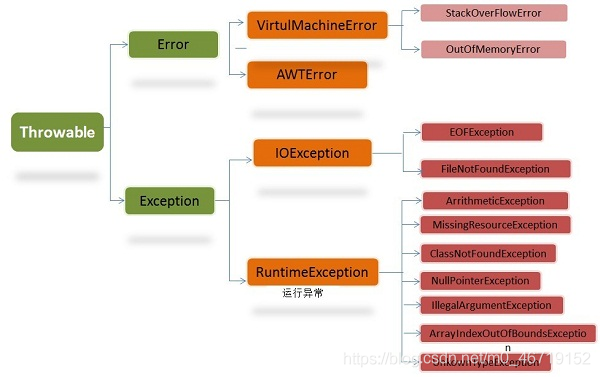

第1关：Java 中的异常处理机制

1、在Java中，源文件Test.java中包含如下代码段，则程序编译运行结果是（ B ）

\> public class HelloWorld{
\> public static void main(String\[\] args){
\> System.out.print(“HelloWorld!”);
\> } }
1
2
3
4
A、输出：HelloWorld!
B、编译出错，提示“公有类HelloWorld必须在HelloWorld.java文件中定义”
C、运行正常，但没有输出内容
D、运行时出现异常

2、下列关于检测性异常和非检测性异常正确的是（ACE）
A、IOException及其子类（FileNotFoundException等），都属于检测型异常
B、检测型异常不需要程序员来处理
C、运行时异常可以处理，也可以不处理，是可选的
D、错误也属于异常的一种
E、所有的异常类是从 java.lang.Exception 类继承的子类

3、关于下列代码，说法正确的是（D）

public static void main(String\[\] args){
int num1 = 10;
int num2 = 0;
System.out.println(num1/num2);
}
1
2
3
4
5
A、输出0
B、编译报错，提示除数不能为0
C、输出无穷大
D、运行时报错，提示除数不能为0

解析：
第一题：此题出现的问题是文件名与类名不一致
在Java中：

1\. Java保存的文件名必须和类名一致 一个Java文件中只能有一个
2\. public类，且文件名与public类名一致
3\. Java文件中没有public类，可与任一类名一致

第二题：
要理解Java中的异常是如何工作的，你需要掌握以下三种类型的异常：

检查性异常 运行时异常 错误

检查性异常
例如我们要打开一个文件时，这段代码就可能存在异常，因为这个文件很有可能并不存在。

File f = new File(“G://test.java”);
FileInputStream fs = new
FileInputStream(f);

这里G盘下的test.java文件就可能不存在，这个时候运行这段代码就可能会出异常，所以在我们编写代码的时候IDE会提示我们要处理这段代码可能出现的异常。
如果我们不处理的话，程序是不能被编译的。

运行时异常
运行时异常程序员可以不去处理，当异常出现时，虚拟机会处理。常见的运行时异常有空指针异常。（说明的是运行时异常程序员可以不处理或者去处理）

常见的运行时异常：

ClassCastException(类转换异常)
IndexOutOfBoundsException(数组越界)
NullPointerException(空指针)
ArrayStoreException(数据存储异常，操作数组时类型不一致)

错误
错误不是异常，而是脱离程序员控制的问题。错误在代码中通常被忽略。例如，当栈溢出时，一个错误就发生了，它们在编译也检查不到的。

异常的分类：

所有的异常都是从Throwable继承而来的，是所有异常的共同祖先

Throwable有两个子类Error（错误）和Exception（异常）

Exception（异常）包括IOEexption（检查性异常）和RuntimeException（运行时异常）

第三题：该题目中出现了被0除的错误，该错误为ArithmeticException（被0除的算术运行异常）

此异常属于RuntimeException异常，该类中全部为运行异常，但是Exception下其他子类异常都为编译异常，比如检查性异常属于编译错误
————————————————
版权声明：本文为CSDN博主「陈陈不会敲代码」的原创文章，遵循CC 4.0 BY-SA版权协议，转载请附上原文出处链接及本声明。
原文链接：https://blog.csdn.net/m0_46719152/article/details/109635563

描述
ArithmeticException当出现异常的运算条件时，抛出此异常。例如，一个整数"除以零"时，抛出此类的一个实例。
ArrayIndexOutOfBoundsException用非法索引访问数组时抛出的异常。如果索引为负或大于等于数组大小，则该索引为非法索引。
ClassCastException当试图将对象强制转换为不是实例的子类时，抛出该异常。
IllegalArgumentException抛出的异常表明向方法传递了一个不合法或不正确的参数。
IllegalMonitorStateException抛出的异常表明某一线程已经试图等待对象的监视器，或者试图通知其他正在等待对象的监视器而本身没有指定监视器的线程。
IllegalStateException在非法或不适当的时间调用方法时产生的信号。换句话说，即 Java 环境或 Java 应用程序没有处于请求操作所要求的适当状态下。
IllegalThreadStateException线程没有处于请求操作所要求的适当状态时抛出的异常。
IndexOutOfBoundsException指示某排序索引（例如对数组、字符串或向量的排序）超出范围时抛出。
NegativeArraySizeException如果应用程序试图创建大小为负的数组，则抛出该异常。
NullPointerException当应用程序试图在需要对象的地方使用 null 时，抛出该异常
NumberFormatException当应用程序试图将字符串转换成一种数值类型，但该字符串不能转换为适当格式时，抛出该异常。
StringIndexOutOfBoundsException此异常由 String 方法抛出，指示索引或者为负，或者超出字符串的大小。
......
检测性异常：

异常描述
ClassNotFoundException应用程序试图加载类时，找不到相应的类，抛出该异常。
CloneNotSupportedException当调用 Object 类中的 clone 方法克隆对象，但该对象的类无法实现 Cloneable 接口时，抛出该异常。
IllegalAccessException拒绝访问一个类的时候，抛出该异常。
InstantiationException当试图使用 Class 类中的 newInstance 方法创建一个类的实例，而指定的类对象因为是一个接口或是一个抽象类而无法实例化时，抛出该异常。
InterruptedException一个线程被另一个线程中断，抛出该异常。
NoSuchFieldException请求的变量不存在
NoSuchMethodException请求的方法不存在
IOException及其子类对文件或流的操作有误时，抛出异常
......

