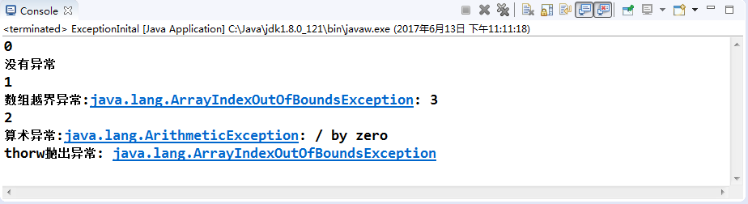
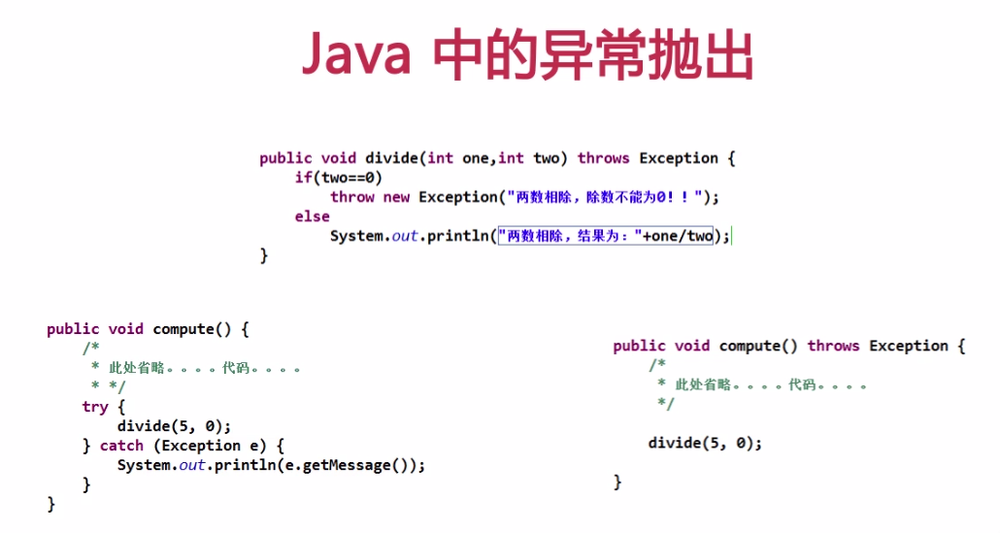

一、异常的抛出

1、定义 ： 一个方法不处理这个异常，而是调用层次向上传递，谁调用这个方法，这个异常就由谁来处理。

2、throw : 将产生的异常抛出(强调的是动作)，抛出的既可以是异常的引用，也可以是异常对象。（位置: 方法体内）

3、throws : 如果一个方法可能会出现异常，但没有能力处理这种异常，可以在方法声明处用throws子句来声明抛出异常。用它修饰的方法向调用者表明该方法可能会抛出异常（可以是一种类型，也可以是多种类型，用逗号隔开）（位置: 写在方法名 或方法名列表之后 ，在方法体之前。）

注意 ： 调用可能会抛出异常的方法，必须添加try-catch代码块尝试去捕获异常 或者 添加throws 声明 来将异常 抛出给更上一层的调用者进行处理,这里需要注意一个细节:新的异常包含原始异常的所有信息，根据这个我们可以去追溯最初异常发生的位置，

如下图所示

4、简单使用

// 定义一个方法,抛出 数组越界和算术异常（多个异常 用 "," 隔开）
public void Test1(int x) throws ArrayIndexOutOfBoundsException,ArithmeticException{

System.out.println(x);

if(x == 0){

System.out.println("没有异常");

return;

}

//数据越界异常

else if (x == 1){

int\[\] a = new int\[3\];

a\[3\] = 5;

}

//算术异常

else if (x == 2){

int i = 0;

int j = 5/0;

}

}

在main方法中调用

public static void main(String\[\] args) {

//创建对象

ExceptionInital object = new ExceptionInital();

// 调用会抛出异常的方法，用try-catch块

try{

object.Test1(0);

}catch(Exception e){

==System.out.println(e);==

}

// 数组越界异常

try{

object.Test1(1);

}catch (ArrayIndexOutOfBoundsException e) {

==System.out.println("数组越界异常:"+e);==

}

// 算术异常

try{

object.Test1(2);

}catch(ArithmeticException e){

==System.out.println("算术异常:"+e);==

}

//使用 throw 抛出异常(可以抛出异常对象，也可以抛出异常对象的引用)

try{

ArrayIndexOutOfBoundsException exception = new ArrayIndexOutOfBoundsException();

throw exception;//new ArrayIndexOutOfBoundsException();

}catch(ArrayIndexOutOfBoundsException e){

System.out.println("thorw抛出异常:"+e);

}

}
1运行结果

总结下 throw 和throws 关
键字的区别

1、写法上 : throw 在方法体内使用，throws 函数名后或者参数列表后方法体前
2、意义 ： throw 强调动作，而throws 表示一种倾向、可能但不一定实际发生
3、throws 后面跟的是异常类，可以一个，可以多个，多个用逗号隔开。throw 后跟的是异常对象，或者异常对象的引用。
4、throw 用户抛出异常，当在当前方法中抛出异常后，当前方法执行结束（throw 后，如果有finally语句的话，会执行到finally语句后再结束。）。可以理解成return

