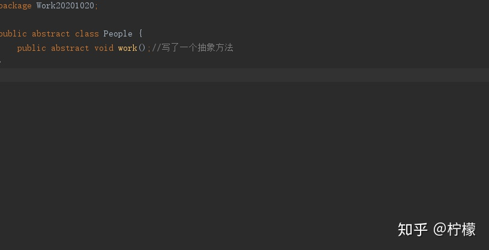
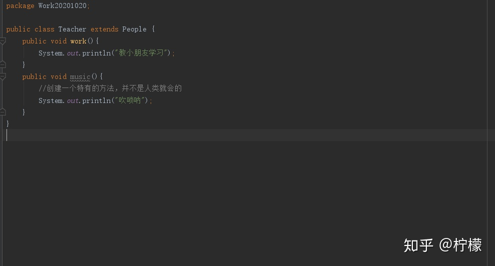
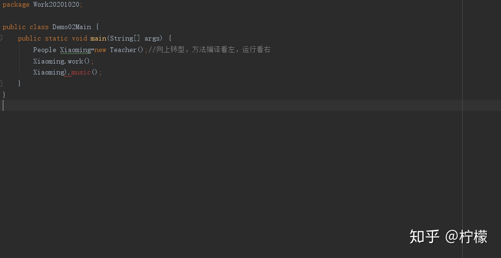
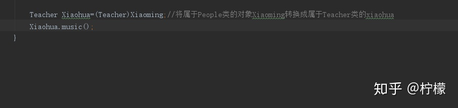

Java_向下转型

[柠檬](https://www.zhihu.com/people/ning-meng-50-15-97)
2 人赞同了该文章
对象一旦向上转型为父类就无法调用子类的特有方法
解决方法就是用对象的向下转型
先了解一下向上转型[柠檬：Java \_对象的向上转型](https://zhuanlan.zhihu.com/p/267132515)
向上转型过程已经把Teacher当做父类People使用所以如果在Teacher类里面写一个特有方法我们是无法用[http://Xiaoming.XXX](https://link.zhihu.com/?target=http%3A//Xiaoming.XXX)（）；进行调用

所以向下转型为原型：
对象向下转型是一个【还原】的动作
格式：子类名称 对象名 =（子类名称）父亲对象；
含义：将父类对象还原成本来的子类对象
例子如下
父类：

子类：

我们无法用Xiaoming.music（）；调用Teacher的特有方法

向下转型

如果把父类换成Animal 子类换成Cat更好理解
父类中有abstract方法eat；
子类有重写的abstract方法eat（）；和特有方法catchMouse（）
向上转型为
Animal animal = new Cat（）；
Animal.eat（）可以成功调用而Animal.catchMouse（）不能调用
这时候就需要向下转型
Cat cat=（Cat）animal，将创建的属于Animal类的对象animal转为Cat类的cat对象
就可以用cat.catchMouse（）；调用法法catchMouse了

向下转型是有危险的，向下转型为什么说是还原呢？其实就是你是由什么转过来的你就应该转回什么，比如cat→animal，那么你就应该由对象animal→cat，假如还有一个animal的子类叫dog，你如果由animal→dog那么就是错误转型，就像我给了你亿元美金，你给回我的是一RMB那么就不是还原了。
编辑于 2020-10-

*来自 \<<https://zhuanlan.zhihu.com/p/267135167>\>*

