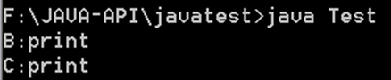

父子对象之间的转换分为了**向上转型**和**向下转型**,它们区别如下:
- **向上转型**: 通过子类对象(小范围)实例化父类对象(大范围),这种属于自动转换
- **向下转型**: 通过父类对象(大范围)实例化子类对象(小范围),这种属于强制转换
**==1. 向上转型==**
**示例1-向上转型**

class A {  
publicvoid print() {  
System.out.println("A:print");  
}  
}
classB extends A {  
publicvoid print() {  
System.out.println("B:print");  
}  
}
publicclass Test{  
publicstaticvoid main(String args\[\])  
{  
A a = newB(); //通过子类去实例化父类 a.print();  
}  
}

运行打印:

如上图所示,可以看到打印的是**class B的print**,这是因为我们通过**子类B去实例化**的,所以父类A的print方法**已经被**子类B的print**方法覆盖**了.从而打印classB的print.
类似于C++的virtual虚函数。
**这样做的意义在于:**
- 当我们需要多个同父的对象调用某个方法时,通过向上转换后,则可以确定参数的统一.方便程序设计**(参考下面示例)**

**示例2-向上转型的作用分析**

class A {  
publicvoid print() {  
System.out.println("A:print");  
}  
}
classB extends A {  
publicvoid print() {  
System.out.println("B:print");  
}  
}
classC extends B {  
publicvoid print() {  
System.out.println("C:print");  
}  
}
publicclass Test{  
publicstaticvoid func(A a)  
{  
a.print();  
}
publicstaticvoid main(String args\[\])  
{  
func(newB()); //等价于 A a =new B();  
func(newC()); //等价于 A a =new C();  
}  
}

运行打印:

**PS:**向上转型时,父类只能调用父类方法或者子类覆写后的方法,而子类中的单独方法则是无法调用的.

**==2. 向下转型==**
在java中,向下转型则是为了,通过父类强制转换为子类,从而来调用子类**独有的方法**(向下转型,在工程中很少用到).
为了保证向下转型的顺利完成,在java中提供了一个关键字:**instanceof**,通过**instanceof**可以判断某对象是否是某类的实例,如果是则返回**true**,否则为**false**,instanceof使用如下:
A a = newB(); //向上转型 (B类是A的子类)  
a instanceofA; //返回true.  
a instanceofB; //返回true  
a instanceofC; //返回false
接下来,我们便来分析向下转型的意义.

**示例-向下转型的作用分析**

class A {  
publicvoid print() {  
System.out.println("A:print");  
}  
}
classB extends A {  
publicvoid print() {  
System.out.println("B:print");  
}  
publicvoid funcB(){  
System.out.println("funcB");  
}  
}
classC extends A {  
publicvoid print() {  
System.out.println("C:print");  
}  
publicvoid funcC(){  
System.out.println("funcC");  
}  
}
publicclass Test{  
publicstaticvoid func(A a)  
{  
a.print();  
if(a instanceof B)  
{  
B b = (B)a; //向下转型,通过父类实例化子类  
b.funcB(); //调用B类独有的方法  
}  
elseif(a instanceof C)  
{  
C c = (C)a; //向下转型,通过父类实例化子类  
c.funcC(); //调用C类独有的方法  
}  
}
publicstaticvoid main(String args\[\])  
{  
func(new A());  
func(new B());  
func(new C());  
}  
}

运行打印:

*来自 \< <https://www.cnblogs.com/lifexy/p/10812841.html>\>*

