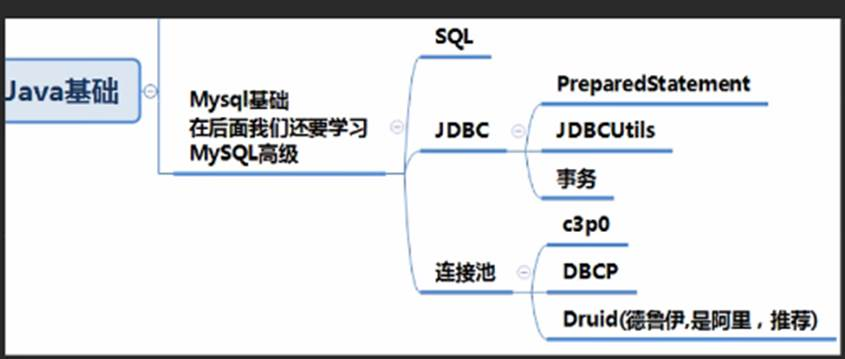

java后端技术学习路线

2022年3月4日

8:43

 

第一部分

java基础

 

 

 

 

第二部分

高级部分

 

 

设计模式利于代码的规范 拓展与维护

 

 

 

 

第三部分

Java web

 

 

 

 

 

 

第四部分

主流框架与项目管理

 

第五部分

分布式 微服务 并行架构

 

 

 

第六部分

开发运维一体化技术

或自动化部署管理项目

 

 

第七部分 

大数据

 

第八部分

项目 

 

 

第九第十

 