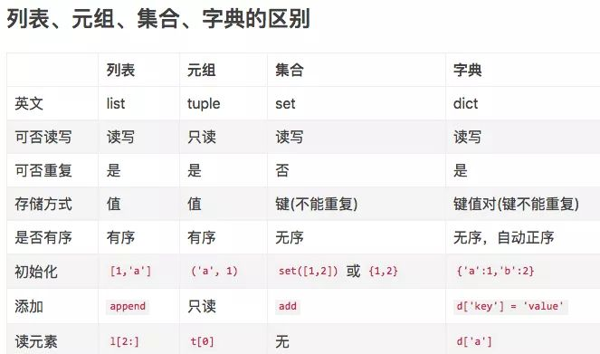

本文主要介绍列表，元组，字典，集合以及和字符串之间的相互转换。
1\. 列表与元组的互换
\# 将列表转化为元组  
li = \[1, 2, 3\]  
t = tuple(li)  
print(t, type(t))  
\# 打印结果:(1, 2, 3) \<class 'tuple'\>
\# 将元组转换成列表  
tu = (1, 2, 3)  
li = list(tu)  
print(li, type(li))  
\# 打印结果:\[1, 2, 3\] \<class 'list'\>
2\. 列表与字符串的互换
\# 列表转换成字符串  
li = \['人', '生', '苦', '短'\]  
str1 = ''.join(li)  
print(str1, type(str1))  
\# 输出结果：人生苦短 \<class 'str'\>
\# 字符串转换成列表  
str2 = 'hello python'  
li1 = str2.split(' ')  
print(li1, type(li1))  
\# 输出结果：\['hello', 'python'\] \<class 'list'\>
3\. 列表与字典转换
\# 列表转字典方式一  
list1 = \['name', 'age', 'sex'\]  
list2 = \['张三', 18, '男'\]  
dict = {}  
for i in range(len(list1)):  
dict\[list1\[i\]\] = list2\[i\]  
print(dict, type(dict))  
\# 输出结果：{'name': '张三', 'age': 18, 'sex': '男'} \<class 'dict'\>
\# 列表转字典方式二：使用内置函数zip  
list1 = \['name', 'age', 'sex'\]  
list2 = \['张三', 18, '男'\]  
d = dict(zip(list1, list2))  
print(d)
\# 字典转换成列表  
dict = {'name': '张三', 'age': 18, 'sex': '男'}  
keys = list(dict.keys())  
values = list(dict.values())  
print(keys, type(keys))  
print(values, type(values))
4.嵌套列表转字典
list3 = \[\['key1','value1'\],\['key2','value2'\],\['key3','value3'\]\]  
print(dict(list3))
5\. 列表与集合转换
\# 列表转集合  
list1 = \[1, 3, 4, 3, 2, 1\]  
s1 = set(list1)  
print(s1, type(s1))  
\# 输出结果：{1, 2, 3, 4} \<class 'set'\>
\# 集合转列表  
list2 = list(s1.intersection(s1))  
print(list2, type(list2))  
\# 输出结果：\[1, 2, 3, 4\] \<class 'list'\>
6\. 元组和字符串转换
==\# 元组转换成字符串和列表方法一样==
\# 字符串转换成元组，需要将字符串转换成列表，在利用列表转成元组  
list = \[\]  
a = '人生苦短'  
list.append(a)  
print(list)  
b = tuple(list)  
print(b, type(b))  
\# 输出结果：('人生苦短',) \<class 'tuple'\>
7.元组和字典转换
\# 字典转元组  
dict = {'name': 'xiaoming', 'age': 18}  
tup = tuple(dict)  
print(tup) \# 只转换了key
tup2 = tuple(dict.values())  
print(tup2)
==\# 元组不能转成字典==
8.字典和字符串转换
\# 字典转换为字符串  
dic1 = {'a': 1, 'b': 2}  
str1 = str(dic1)  
\# 输出结果：{'a': 1, 'b': 2} \<class 'str'\>
\# 字符串转字典  
dic2 = eval("{'name':'xiaoming', 'age':18}")  
print(dic2, type(dic2))
9.字符串和集合转换
\# 字符串转集合  
str1 = 'hello'  
s1 = set(str1)  
print(s1, type(s1))  
\# 输出结果：{'e', 'o', 'h', 'l'} \<class 'set'\>
10.字典key和value值转换
dic1 = {'a': 1, 'b': 2, 'c': 3}  
dic2 = {value: key for key, value in dic1.items()}  
print(dic2)

*来自 \< <https://zhuanlan.zhihu.com/p/82703713>\>*
