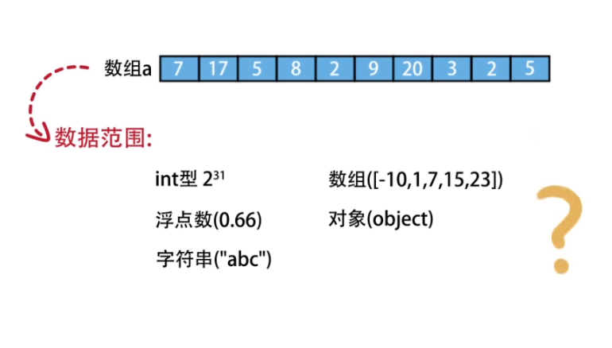

简单的哈希思想：在查找数组中是否存在某数字时，各个数字作为另一个数组的下标，如果出现该元素依次那么下标所对应的数值加一

还可以用这种方法排序

先将啊a数组种的元素按照哈希表将其取出，然后在另一个表中以该数字为下标，并将其出现的次数记录在新的数组中，然后再按照新的数组将数字按照下标的顺序和数组中的个数想a数组中进行输入，就可以对数组进行排序

？？？？？？？？？？？？

将待储存的数据准换为表长范围内的整数，然后再使用数组的下标进行访问
例如：
整数可以取余表长

字符串可以设计专门的哈希函数

但是有可能会出现冲突
