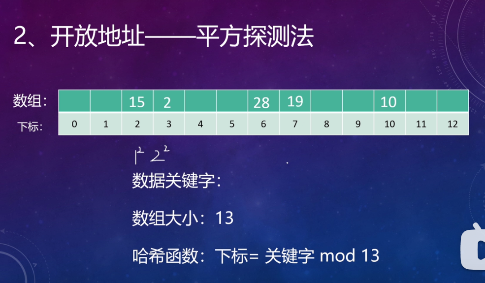

数组中存储的是指针，指针指向的是数据值
而下表是由哈希函数计算得出的

数组大小一般选取质数，防止出现整除的现象

链表解决法就是在冲突时，将原先已经存入的指针作为头节点然后用next指向后一个节点，如果后一个位置依然有指针，那么就以此类推（好吧我理解错了，正解如下）

把数组中的地址都开放出来，不用next还是用下标的方法来解决

i是查找的次数

缺点：很容易将数据聚集在一个位置，浪费电脑的性能

每次都是加一个数的平方，解决了线性探测法数据扎堆的问题

同一个位置的话，就依次按照顺序进行平方，不同的位置就从1开始

如果出现冲突那么就使用第二个哈希函数再一次计算值，但是第二个函数的模数一定要小于数组的长度，由第二个哈希函数计算出来的值就是每一次向后移动的位数，例如是5那么从当前数开始向后移动5个位数，如果该位置有元素那就再移动5个位数
而且第二个哈希函数的值不能为零，因为为零后就无法向后移位。

哈希函数是根据不同的情况设计出来的函数

原来的表满了，就新建一个表，长度是原来的表的2倍，然后再将原来的表的数据放入到新的表中

新表的模数也要进行相应的质数延长

哈希表发挥稳定可以达到O(1)

哈希表的缺点：
函数的选择

表越满越容易发生冲突，性能可鞥会变差
所以设计表的时候，一定要往大了设计，况且指针占用内存也不大
