# 基于深度学习算法 YOLO 的行人车辆检测

# 摘要

行人、车辆检测是自动驾驶中的一项重要技术，对于行人、车辆检测往往需要较高的精确度和实时性。YOLOv5 是一种通用的目标检测算法，但将其使用到行人、车辆的目标检测时，由于行人、车辆数据集存在着样本不均衡和小目标过多的问题，YOLOv5 算法往往难以达到预计效果。

本文提出了一种基于 YOLOv5 的改进模型。本文的主要工作如下：

(1) 针对数据集样本不均衡问题采用数据增强对输入的图像进行预处理。

(2) 针对 YOLOv5 对大目标分类效果不理想问题，对 YOLOv5 的网络骨架进行调整。

(3) 针对数据集中小目标较多的问题，对 YOLOv5 的特征融合部分进行调整。

研究结果表明，改进后的模型保持实时性 (150 FPS) 的情况下，均值平均精确度相比原始 YOLOv5 模型从原来的 62% 提升到了 64.5%，精确率从 74.4% 上升到了 75.8%，召回率从 55.4% 上升到 56.6%。

相较于原先的模型，改进后的 YOLOv5 模型在小目标检测上优势明显，能在保持 YOLOv5 检测实时性的同时，提高其小型行人车辆的检测和分辨效果。

**关键词：** YOLOv5；目标检测；行人车辆检测

# Abstract

Pedestrian and vehicle detection is an important technology in automatic driving, which often requires high precision and real-time performance. YOLOV5 is a general object detection algorithm, but when it is applied to pedestrian and vehicle target detection, it is often difficult to achieve the expected results due to the problems of unbalanced samples and too many small targets in pedestrian and vehicle datasets.

This paper proposes an improved model based on YOLOV5. Followings are the main work in this paper:

(1) Data augmentation is used to preprocess the input image for the problem of unbalanced dataset samples.

(2) To solve the problem that YOLOV5’s classification effect on large targets is not ideal, the network skeleton of YOLOV5 is adjusted.

(3) Adjust the feature fusion part of YOLOV5 for the problem that there are many small targets in the data set.

The results show that when the improved model maintains real time (150 FPS), the mean average precision is improved from 62% to 64.5% compared with the original YOLOV5 model, the precision rate is increased from 74.4% to 75.8%, and the recall rate is increased from 55.4% to 56.6%.

Compared with the original model, the improved YOLOV5 model has obvious advantages in small target detection, which can improve the detection and resolution effect of small pedestrians and vehicles while maintaining the real-time detection of YOLOV5.

**Key words:** yolov5; object detection; Pedestrian and vehicle detection

# 绪论

近年来，国内外大量厂商宣布要制造自动驾驶汽车，而自动驾驶中一项关乎生命安全的重要技术就是行人和车辆检测。本章将首先介绍行人、车辆检测的研究背景和意义，随后介绍目标检测的国内外发展现状，本章最后部分将会讲述全文结构。

## 研究背景与意义

目标检测 (Object Detection) 是计算机视觉和图像处理的一项分支技术，其主要任务是在一幅数字图像中正确识别出目标物体的位置并判断类别。如图 1.1 所示，目标检测算法需要框选出图片中的物体，并判断出框选出的物体是人还是棒球棒。

[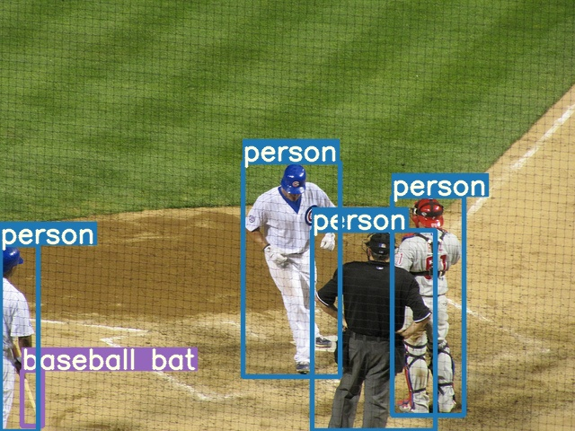](https://cdn-js.moeworld.top/gh/qxdn/qxdn-assert@0.2.3/paper-image1.jpg)

图 1.1 目标检测算法实例

随着我国人民生活水平的日渐提高，越来越多的家庭拥有机动车，随之而来的便是城市内的交通环境越来越复杂。尽管现在的车辆配备了日渐完善的安全设备和防撞技术，近两年的交通事故的死亡人数依然很高 <a href="https://qianxu.run/2021/07/02/YOLO-paper/index.html#fn1" id="fnref1" data-pjax-state="">[1]</a><a href="https://qianxu.run/2021/07/02/YOLO-paper/index.html#fn2" id="fnref2" data-pjax-state="">[2]</a>。此外，国内外不少公司也开始陆续推出自动驾驶汽车，如果自动驾驶技术广泛运用车辆系统上，将会避免许多本可以避免的交通事故。

在自动驾驶系统中对行人和车辆的检测极为关键，如果检测速度慢或者检测效果差就容易导致人身安全事故。行人车辆检测难点在于行人在图像中像素较小，难以保持高准确率，同时还难以快速对其进行检测 <a href="https://qianxu.run/2021/07/02/YOLO-paper/index.html#fn3" id="fnref3" data-pjax-state="">[3]</a>。传统的对行人车辆检测方法往往是使用人工提取特征的目标检测算法，这种方法往往计算量较大且精度较低，无法运用在需要高精度和高实时性要求的自动驾驶领域。得益于近年来 GPU 加速技术和深度学习技术的发展，使得如今基于深度学习的行人车辆检测能够达到高精度和较好的实时性，有效的改善传统方法的效率低下问题，能够更好的避免交通事故的发生。

## 国内外研究现状

在过去 20 多年里，目标检测经历了两个时期，一个是 2014 年前的传统目标检测探索时期，而另一个是 2014 年后的基于深度学习的目标检测时期 <a href="https://qianxu.run/2021/07/02/YOLO-paper/index.html#fn3" id="fnref3:1" data-pjax-state="">[3:1]</a>。

### 传统目标检测算法

在 2014 年前，目标检测算法使用的都是传统目标检测算法。传统的目标检测算法大多可以分为以下 3 步。首先通过滑动窗口等方法穷举可能含有目标物体的图像区域；然后使用方向梯度直方图 (Histograms of Oriented Gradients，HOG)<a href="https://qianxu.run/2021/07/02/YOLO-paper/index.html#fn4" id="fnref4" data-pjax-state="">[4]</a> 和尺度不变特征变换 (Scale-invariant feature transform，SIFT)<a href="https://qianxu.run/2021/07/02/YOLO-paper/index.html#fn5" id="fnref5" data-pjax-state="">[5]</a> 等特征提取算法对图像区域进行特征提取运算，得到目标的特征；最后将提取到的特征送入支持向量机 (Support Vector Machine，SVM)<a href="https://qianxu.run/2021/07/02/YOLO-paper/index.html#fn6" id="fnref6" data-pjax-state="">[6]</a>、adaboost<a href="https://qianxu.run/2021/07/02/YOLO-paper/index.html#fn7" id="fnref7" data-pjax-state="">[7]</a> 等分类算法中计算得到分类结果 <a href="https://qianxu.run/2021/07/02/YOLO-paper/index.html#fn3" id="fnref3:2" data-pjax-state="">[3:2]</a>。

这些传统目标检测方法通常都是需要手工设计特征提取，而且要求调试者有熟练的调试经验，相比于后面出现的基于深度学习的目标检测算法，传统算法特征提取相对复杂，且检测的准确率不如后者。尽管如此，传统目标检测算法中的滑动窗口、困难样本挖掘和边界框回归等思想依然影响了后续的目标检测算法 <a href="https://qianxu.run/2021/07/02/YOLO-paper/index.html#fn3" id="fnref3:3" data-pjax-state="">[3:3]</a>。

### 基于深度学习的目标检测算法

在 2012 年的 ImageNet 竞赛上，Hinton 等人使用基于卷积神经网络 (convolutional neural network，CNN) 结构的 AlexNet<a href="https://qianxu.run/2021/07/02/YOLO-paper/index.html#fn8" id="fnref8" data-pjax-state="">[8]</a> 获得了冠军，其错误率比第二名低了 10.8%，分类效果远超第二名。这使得学者们重新对卷积神经网络产生了兴趣，并考虑将卷积神经网络的分类结果运用到目标检测上面。

在 2014 年 Ross Girshick 提出的 R-CNN (Regions with CNN features)<a href="https://qianxu.run/2021/07/02/YOLO-paper/index.html#fn9" id="fnref9" data-pjax-state="">[9]</a> 是第一个基于卷积神经网络的目标检测算法。其将传统算法中的人工提取特征部分换成了使用 CNN 提取，提高了检测精度。由于 R-CNN 中传统候选框搜索算法穷举候选区域较慢，Girshick 等人随后便提出了 Fast R-CNN<a href="https://qianxu.run/2021/07/02/YOLO-paper/index.html#fn10" id="fnref10" data-pjax-state="">[10]</a> 和 Faster R-CNN<a href="https://qianxu.run/2021/07/02/YOLO-paper/index.html#fn11" id="fnref11" data-pjax-state="">[11]</a>。在 Faster R-CNN<a href="https://qianxu.run/2021/07/02/YOLO-paper/index.html#fn11" id="fnref11:1" data-pjax-state="">[11:1]</a> 中使用候选区域生成网络 (Region Proposal Network，RPN) 替代了原先的选择性搜索算法，再使用卷积神经网络对生成的候选框中的物体进行分类识别。

这类算法因为将目标检测分为候选框提取和目标分类两个模块，因此也被称为 two-stage 算法，其代表的网络有 R-CNN 系列、SPP Net 和 Pyramid Network 等。two-stage 方法虽然精度较高，但是检测速度比较慢。以 Faster R-CNN 为例，虽然其能够在 PASCAL VOC 2012 上取得 70.4% 的均值平均精确度，但是其在 GPU 上推理速度为 5 FPS<a href="https://qianxu.run/2021/07/02/YOLO-paper/index.html#fn11" id="fnref11:2" data-pjax-state="">[11:2]</a>。除了 two-stage 算法，还有一些算法将候选框坐标回归和分类和为一步预测，这种算法也被称为 one-stage 算法。

在 2016 年，Redmon 提出的 YOLO (You Only Look Once)<a href="https://qianxu.run/2021/07/02/YOLO-paper/index.html#fn12" id="fnref12" data-pjax-state="">[12]</a> 算法是第一种 one-stage 算法。其特点是将只是用一个网络完成目标检测，在保证检测精度的同时运算速度非常快，在 PASCAL VOC 2012 检测任务上 YOLO 的 FPS 达到 45 FPS，而且均值平均精确度达到 63.4%，精度略微低于 Faster R-CNN<a href="https://qianxu.run/2021/07/02/YOLO-paper/index.html#fn12" id="fnref12:1" data-pjax-state="">[12:1]</a>。其主要思想是将图像分为多个网格，每个网格预测含有边界框坐标信息、置信度和每个类别的条件概率的向量，将目标检测问题转换为回归问题。在 2017 年，Redmon 提出了 YOLOv2<a href="https://qianxu.run/2021/07/02/YOLO-paper/index.html#fn13" id="fnref13" data-pjax-state="">[13]</a> 网络，将 Faster R-CNN 中的先验锚框机制和网中网 (Network in Network，NIN)<a href="https://qianxu.run/2021/07/02/YOLO-paper/index.html#fn14" id="fnref14" data-pjax-state="">[14]</a> 中的全局平局池化等结构加入 YOLOv1 网络。使其不再直接预测目标坐标而是预测目标与锚框之间的偏差，降低了训练难度，提高了网络的召回率。在 2018 年提出的 YOLOv3<a href="https://qianxu.run/2021/07/02/YOLO-paper/index.html#fn15" id="fnref15" data-pjax-state="">[15]</a> 中加入了特征金字塔和残差块结构，增加了对小目标的检测效果。在 YOLOv3 发布后，YOLO 系列一代到三代的原作者 Redmon 宣布因为无法忽视自己研究带来的负面影响，决定退出计算机视觉领域。幸运的是，在 2020 年 YOLO 社区的参与者 Alexey Bochkovskiy 接手了 YOLO 项目并发表了 YOLOv4<a href="https://qianxu.run/2021/07/02/YOLO-paper/index.html#fn16" id="fnref16" data-pjax-state="">[16]</a>。在 YOLOv4 中作者引入了大量训练技巧和结构改进，如 CSP 结构、CIoU loss、Mish 激活函数等等，极大的提升了网络的性能。YOLOv4 诞生后不久，Ultralytics 公司发布了自己的 YOLO 版本并命名为 YOLOv5。该版本在社区中有一定的争议，在本文中不会对此进行讨论。YOLOv5 相较 YOLOv4 而言还是有少许改进，其新增了马赛克数据增加、Focus 模块、自动锚框计算等。YOLOv5 保证了模型精度的同时，运算速度更快，模型权重的大小相对于 YOLOv4 而言更小。

### 研究现状小结

根据上述目标检测算法的分析，可以根据使用的方法将目标检测算法大致划分为 3 类，结果如图 1.2 所示。

[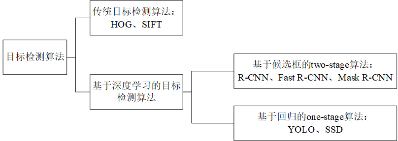](https://cdn-js.moeworld.top/gh/qxdn/qxdn-assert@0.2.3/paper-image2.png)

图 1.2 目标检测算法总结

## 本文研究内容和组织结构

如前文所述，传统方法的精度较差，而 R-CNN 系列算法虽然有较高精度，但是速度无法满足要求。因此本文将使用 YOLOv5 算法对行人和车辆数据集进行训练，得到行人车辆检测模型。该模型可以对行人 (person)、自行车 (bike)、机动车 (car)、摩托车 (motor)、公交车 (bus) 和卡车 (truck) 共六个类别进行检测。

同时针对数据集和模型分析，对 YOLOv5 的模型提出了改进思路，并对改进思路进行实验，以均值平均精确度为指标评价网络的改进结果。具体改进内容如下：

(1)、基于对 YOLOv5 网络的理解和实际结果，对 YOLOv5 的骨架提出改进思路

(2)、基于上述对 YOLOv5 的理解，对 YOLOv5 的颈部部分的路径聚合网络提出了改进思路。

本文各章节具体内容安排如下：

第一章 绪论。介绍了行人车辆检测的研究背景和重要性，引出了目标检测的发展。简要的介绍了传统方法和基于深度学习的方法。

第二章 YOLO 算法原理简介。主要介绍了卷积神经网络的相关基础知识、YOLOv5 网络的结构和算法流程以及对算法的评判指标。

第三章 YOLO 算法分析及改进。对行人车辆检测数据集和 YOLOv5 模型的分析。并针对数据集的特点和 YOLOv5 在该数据集上的缺陷提出改进措施。

第四章 实验分析。这一部分主要讲述了本次实验的运行结果以及针对行人车辆数据集的改进方案和原本 YOLOv5 之间的检测效果对比。

第五章 总结与展望。总结了 YOLOv5 改进模型的优缺点，阐述未来的改进方向。

# YOLO 算法原理

YOLO 是一种卷积神经网络，相较于传统神经网络，卷积神经网络能够更好的提取特征，同时还能减少模型参数。本章首先介绍了卷积神经网络的组成部分和原理。然后对 YOLOv5 网络结构进行分析，并介绍了其检测流程。最后介绍了模型的评价指标。

## 卷积神经网络概述

传统全连接神经网络虽然在一些任务上有很好的表现，但是其使用的全连接层会导致参数过大，在图像处理上这项缺点极为明显。以本文后续使用的模型为例，输入的图像尺寸会缩放到 640×640×3，如果将其作为全连接神经网络的输入，仅仅输入层中的一个神经元的权重就有 640×640×3=1228800 个，以 float 形式保存就有约 4.9 MB 的大小，这显然是一项巨大的开销。以 VGG 网络的输入 3 通道输出 96 通道，卷积核大小为 3×3 的卷积层为例，其权重个数为 3×3×3×96=2592 个，明显少于全连接网络。得益于卷积计算的权重共享和局部感受野的特点，卷积神经网络参数的数量远少于传统全连接网络。

1962 年生物学家 HuBel 和 Wiesel 基于对猫的视觉皮层神经元的研究提出了感受野的概念 <a href="https://qianxu.run/2021/07/02/YOLO-paper/index.html#fn17" id="fnref17" data-pjax-state="">[17]</a>。1980 年日本学者 Fukushima 基于 HuBel 的研究提出了卷积层、池化层结构 <a href="https://qianxu.run/2021/07/02/YOLO-paper/index.html#fn18" id="fnref18" data-pjax-state="">[18]</a>。随后在 1998 年 LeCun 基于前人的研究设计了第一个卷积神经网络 LeNet-5 并运用在了识别支票上的手写数字 <a href="https://qianxu.run/2021/07/02/YOLO-paper/index.html#fn19" id="fnref19" data-pjax-state="">[19]</a>。但是受限于当年有限的计算机资源和 SVM 算法的兴起，卷积神经网络慢慢淡出了人们的视野。直到 2012 年的 ImageNet 比赛上 AlexNet<a href="https://qianxu.run/2021/07/02/YOLO-paper/index.html#fn8" id="fnref8:1" data-pjax-state="">[8:1]</a> 的以极大的优势击败了其他传统算法，卷积神经网络才重新活跃在人们的眼前。

卷积神经网络通常由输入层、卷积层、激活函数、池化层、全连接层和输出层构成 <a href="https://qianxu.run/2021/07/02/YOLO-paper/index.html#fn20" id="fnref20" data-pjax-state="">[20]</a>。这几个部分会在后续小节中进行讲解。

### 卷积层

卷积层的名字来源于数字信号处理中的卷积操作，二维卷积的公式如式 2.1 所示：

$$
y(m,n)\=x(m,n)∗h(m,n)\=∑i∞∑j∞x(i,j)h(m−i,n−j)(2.1)y(m,n)=x(m,n)\*h(m,n)=\\sum\_{i}^{\\infty}\\sum\_{j}^{\\infty}x(i,j)h(m-i,n-j) \\tag{2.1} y(m,n)\=x(m,n)∗h(m,n)\=i∑∞j∑∞x(i,j)h(m−i,n−j)(2.1)
$$
卷积层是卷积神经网络中的基础模块，主要的功能就是对输入进行特征提取。卷积层是由多个特征图组成的，与全连接不同的是，特征图中的每一个神经元通过卷积核上一层是局部连接的。卷积核就是一个大小为 _N_ 的权值方阵，其权值在训练过程中自行学习，为了确保卷积核有一个中心点，同时方便对特征图进行填充，_N_ 通常取奇数。卷积操作就是使用一个滑动窗口以一定步长在图像上滑动，并对窗口内的特征进行加权求和操作，从而得到一个新的输出。一般认为 CNN 结构中越接近输出的卷积层输出的是一些更为抽象的高级特征，因此能比人为设计的滤波器有更好的提取特征能力。

[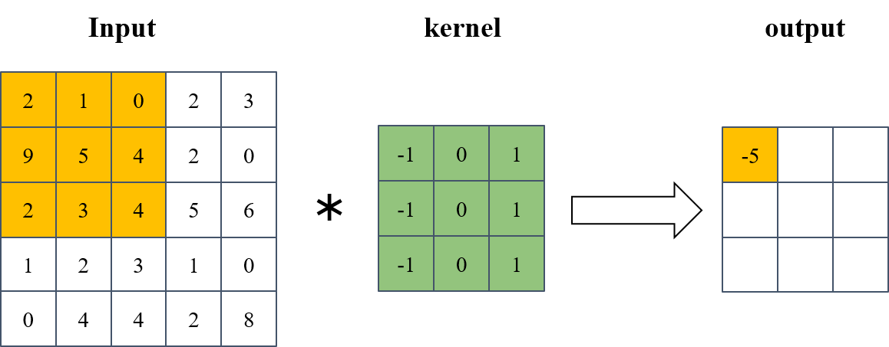](https://cdn-js.moeworld.top/gh/qxdn/qxdn-assert@0.2.3/paper-image3.png)

图 2.1 卷积的操作过程

图 2.1 为卷积核的运算过程，_Input_ 表示输入的特征图，数字为像素点的值，其中黄色的部分表示卷积核的关注区域。图中的 _kernel_ 表示了一个尺寸为 3×3 的卷积核，其中绿色部分表示卷积核的权重。图中右侧的 _output_ 表示经过卷积运算后的输出，其黄色区域表示的就是卷积的运算结构。图 2.1 中的卷积的输出如式 2.2 所示：

output\=2∗−1+1∗0+0∗1+9∗−1+5∗0+4∗1+2∗−1+3∗0+4∗1\=−5(2.2)output = 2\*-1+1\*0+0\*1+9\*-1+5\*0+4\*1+2\*-1+3\*0+4\*1=-5 \\tag{2.2} output\=2∗−1+1∗0+0∗1+9∗−1+5∗0+4∗1+2∗−1+3∗0+4∗1\=−5(2.2)

特征图在通过卷积操作后，输出的尺寸与输入不匹配，如果需要两者匹配，则需要对输入特征图的周围填充零。经过卷积操作后的输入和输出的长宽关系如式 2.3 所示：

w′\=w−n+2ps+1(2.3)w'=\\frac{w-n+2p}{s}+1 \\tag{2.3} w′\=sw−n+2p+1(2.3)

w′w'w′为输出特征图的宽度，www 为输入特征图的宽度，nnn 为卷积核的尺寸，ppp 为填充 _padding_ 即对输入进行零填充的大小，sss 为卷积窗口滑动的步长。

神经网络中使用了卷积层的优点如下

(1)、减少网络参数。卷积核在对一个输入的不同区域进行卷积运算的时候，卷积核内参数是固定的。因此可以看作是共享了权重和偏置，从而减少了网络的参数量。

(2)、更强的抽象能力。相较于人工设计的卷积滤波器，基于深度学习的卷积滤波器可以在训练中自己学习权重，能够提取到更抽象的特征。

### 激活函数

卷积层，池化层和全连接层都可以看作是对输入的线性加权求和。当多个卷积层、池化层、全连接层连接时，都可以将其视为对输入的线性组合，这样无论网络有多深，都与单层线性组合没有区别。因此网络中需要加入非线性的激活函数，避免网络只是单纯的线性组合。目前常见的激活函数有 sigmoid、ReLU、Mish 等，下文将对这几种激活函数进行介绍 <a href="https://qianxu.run/2021/07/02/YOLO-paper/index.html#fn20" id="fnref20:1" data-pjax-state="">[20:1]</a>。

(1)、sigmoid，其公式如式 2.4 所示：

f(x)\=11+e−x(2.4)f(x)=\\frac{1}{1+e^{-x}} \\tag{2.4} f(x)\=1+e−x1(2.4)

sigmoid 的优点是可以将输出转换为 0 到 1 之间的实数，缺点是输出的均值不为 0，使得网络收敛速度慢，特定情况下还会有梯度消失和梯度爆炸的问题。

(2)、tanh，其公式如式 2.5 所示：

f(x)\=ex−e−xex+e−x(2.5)f(x)=\\frac{e^x-e^{-x}}{e^x+e^{-x}} \\tag{2.5} f(x)\=ex+e−xex−e−x(2.5)

tanh 的优点是解决了 sigmoid 的输出均值偏移的问题，然而存在梯度消失问题 <a href="https://qianxu.run/2021/07/02/YOLO-paper/index.html#fn21" id="fnref21" data-pjax-state="">[21]</a>。

(3)、ReLU，其公式如式 2.6 所示：

f(x)\=max(0,x)(2.6)f(x)=max(0,x) \\tag{2.6} f(x)\=max(0,x)(2.6)

ReLU 的优点是正区间内解决了梯度消失问题。但是输出的均值依然不为 0。此外 ReLU 激活函数还存在死区，即当输入在负区间时，神经元输出为 0，导致反向传播时上一层的神经元权重参数无法更新 <a href="https://qianxu.run/2021/07/02/YOLO-paper/index.html#fn21" id="fnref21:1" data-pjax-state="">[21:1]</a>。

(4)、Leaky ReLU，其公式如式 2.7 所示：

f(x)\=max(ax,x)(2.7)f(x)=max(ax,x) \\tag{2.7} f(x)\=max(ax,x)(2.7)

式中 a 可以根据实际数据调整，通常情况下 a 取 0.01。Leaky ReLU 的优点是负区间内仍然有少量的输出，使得输入在负区间内时，上一层的神经元权重依然可以更新。

(5)、Mish：其公式如式 2.8 所示：

f(x)\=x∗tanh(ln(1+ex))(2.8)f(x)=x\*tanh(ln(1+e^x)) \\tag{2.8} f(x)\=x∗tanh(ln(1+ex))(2.8)

Mish 是新提出的激活函数，Mish 优点是比较平滑有较好的泛化能力和总结能力，缺点是计算相对 ReLU 较为复杂。

### 池化层

池化层也被称为下采样层，通常跟在卷积层后面，主要功能是降维。卷积输出的特征图中相邻像素是几乎一样的，只有在目标的边缘部分像素变化明显，如果可以去除这些冗余部分，就可以明显的减少网络参数量。池化层的作用就是降低输出特征图的维度从而达到减少网络参数，同时还能够保留特征图中最重要的信息。池化按照计算方式大致可以分为最大池化和均值池化。池化的计算方法与卷积的计算方法比较相似。以最大池化为例，池化层会使用一个滑动窗口以一定步长在特征图上滑动，并对每个窗口中的像素求最大值作为输出。与卷积不同的是，池化层不包含任何参数，因此不会影响模型大小。

图 2.2 表示了一个最大池化的操作过程，我们定义了一个窗口大小为 2×2，步长为 2 的最大池化层，同时在左侧定义最大池化层的输入，黄色、蓝色、红色和绿色部分表示的是池化窗口覆盖的区域，右侧为最大池化层的输出，不同颜色区域代表不同窗口的输出，可以看到最大池化层选择了不同窗口的最大像素值。

[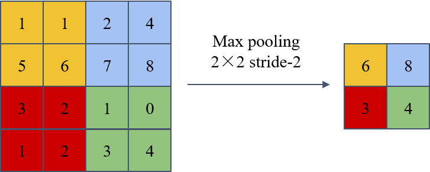](https://cdn-js.moeworld.top/gh/qxdn/qxdn-assert@0.2.3/paper-image4.png)

图 2.2 最大池化层的操作过程

神经网络中使用池化层的优点有：

(1)、去除特征图中的冗余信息，保留其中关键信息，减少网络的参数和计算量。

(2)、增加网络的鲁棒性，当相邻像素发生微小的改变的时候并不影响网络的最终输出。

### 全连接层

在卷积神经网络结构的最后部分，通常连接着一个或者多个全连接层以达到一个 "分类器" 的效果。全连接层的结构与传统的多层感知器类似，每一个神经元都与上一层的所有神经元连接，因此也可以看作是对卷积层提取到的局部信息进行整合。为了增强全连接层的拟合能力，通常会在每个神经元后面都会添加一个非线性的激活函数，避免网络只是单纯的线性拟合 <a href="https://qianxu.run/2021/07/02/YOLO-paper/index.html#fn20" id="fnref20:2" data-pjax-state="">[20:2]</a>。

虽然全连接层有着很好的拟合效果，但是在神经网络训练时期，全连接层容易产生过拟合问题，即训练完成的模型无法在其他的场合下泛用化。为了解决这一问题通常需要在训练时期加上 dropout 层，使其在训练时随机隐藏一些神经元节点，从而达到防止过拟合的效果。此外全连接层因为每个神经元都要与前后两层的神经元完全连接，因此需要的参数较多，也是导致模型大的原因之一。在 NIN 中为了解决这一问题，提出了全局平均池化层来替代全连接层，即对最后一个卷积层输出的每一个特征图求平均值，得到的向量就是输出，因为池化层没有参数需要优化，所以大大的减少了网络的参数，同时也避免了全连接层容易出现模型过拟合的问题 <a href="https://qianxu.run/2021/07/02/YOLO-paper/index.html#fn14" id="fnref14:1" data-pjax-state="">[14:1]</a>。

## YOLO 网络概述

以 R-CNN 系列算法为代表的 two-stage 算法将目标检测分多个步骤来实现，先是寻找出可能含有物体的候选框，然后再对候选框进行坐标回归和目标分类。two-stage 算法的每个步骤中所使用的模块都需要单独训练，而且寻找可能含有物体的候选框一步因为需要大量寻找而耗费了大量时间。因此，虽然 R-CNN 系列算法的精度很高，但是其检测速度很慢。YOLO 系列算法则是采取了端到端的思路，直接将候选框预测和分类合在一步完成，将目标检测问题转化成了回归问题，这样做虽然使得检测结果的均值平均精确度略微有所下降，但是检测速度有了很大的提升。

### YOLOv5 网络结构

图 2.3 为 YOLOv5s 模型的网络结构，图中左上角的红绿蓝三色方块代表图像输入，在 YOLOv5 中图像的输入大小为固定的 640×640×3。左侧第一列为 YOLOv5 网络的骨架，其主要作用是对图像进行特征提取，最右侧的三个红色模块为 YOLO 的输出部分，也被称为 YOLO 算法的头，其主要作用是计算网络的输出。中间的两列是近几年来目标检测算法添加在网络骨架和头之间的颈部部分，其作用是将不同尺度的特征进行融合，通常由特征金字塔或者路径聚合网络 (Path Aggregation Network，PAN) 组成，在 YOLOv5 中使用的是路径聚合网络，即在原本自下向上的特征金字塔上再加上一层自上向下的特征融合路径 <a href="https://qianxu.run/2021/07/02/YOLO-paper/index.html#fn22" id="fnref22" data-pjax-state="">[22]</a>。在图中，640×640×3 表示输入图片长宽为 640×640 的 RGB 彩图。四个参数的模块如 Focus、CBL、YOLO 中，各个参数分别代了输入通道数、输出通道数、内核大小和步长。含有双参数的模块如 C3，各个参数分别代表了输入通道数和输出通道数。单个参数的模块如 SPP、Concat、Upsample 等，其参数则代表了输出的通道数。

[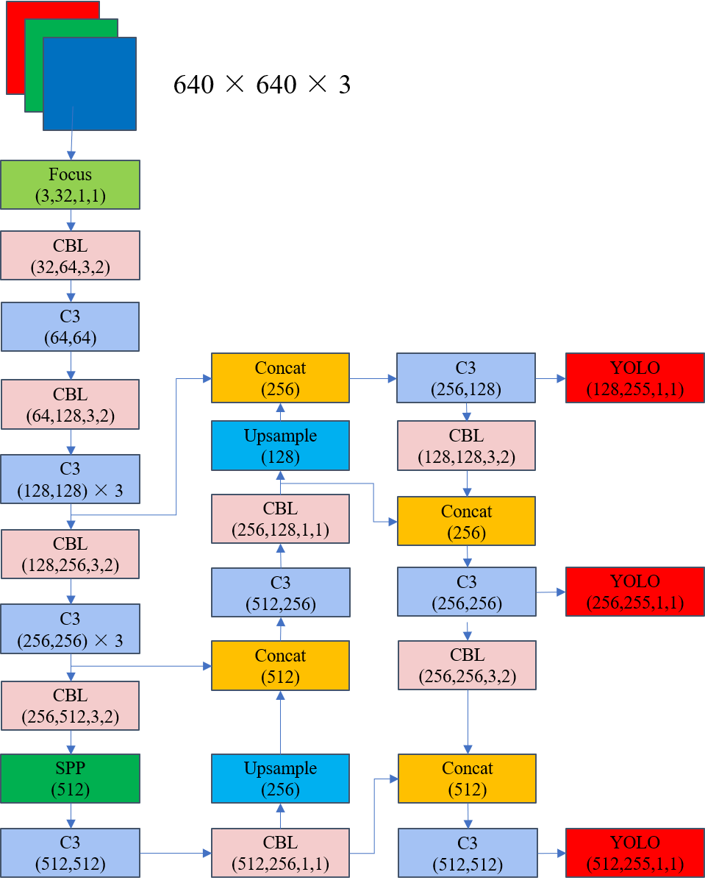](https://cdn-js.moeworld.top/gh/qxdn/qxdn-assert@0.2.3/paper-image5.png)

图 2.3 YOLOv5s 模型结构

图 2.3 中的粉色模块为 YOLOv5 中的卷积层基本单元 CBL，其结构如图 2.4 所示。C 指代的是卷积层，其计算如上一节所述。B 代表批次归一化 (Batch Normalization，BN)，其作用是将一个批次内的卷积层的输出归一化到均值为零，方差为一的范围内，将网络正则化，这使得网络能够避免过拟合，同时还能帮助网络更快的达到效果最好的点，减少网络训练时间。L 代表 Leaky ReLU 激活函数，作用是引入非线性函数，以增强网络的表征能力。在 YOLOv5 网络中单独使用 CBL 模块主要是为了完成对网络的下采样操作。

[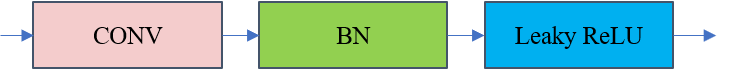](https://cdn-js.moeworld.top/gh/qxdn/qxdn-assert@0.2.3/paper-image6.png)

图 2.4 CBL 模块结构

图 2.3 中的浅绿色的模块为 Focus 模块，其结构如图 2.5 所示。Focus 层的做法是将输入的图片每隔一个像素取一个值，做到将输入图片切片成四份，然后在通道维度上将四张图拼接起来。这等价于在没有任何信息损失的情况下对图像下采样处理，同时减少了网络的参数量。

[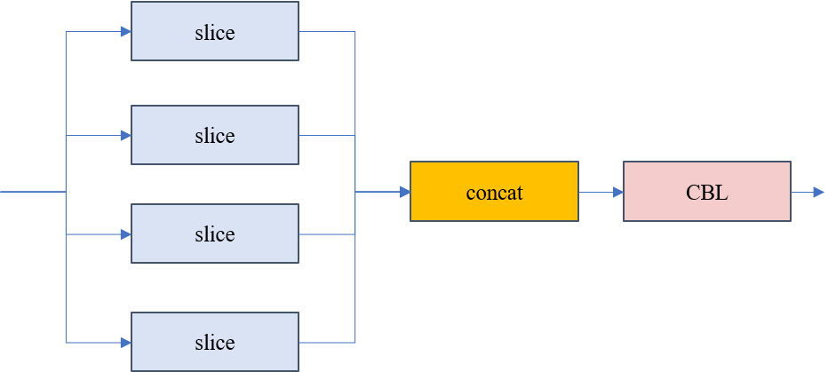](https://cdn-js.moeworld.top/gh/qxdn/qxdn-assert@0.2.3/paper-image7.png)

图 2.5 Focus 模块结构

图 2.3 中淡蓝色模块为 C3 模块，其结构如图 2.6 所示。其中红色的残差单元 (Res Unit) 结构如图 2.7 所示。残差块结构是在残差网络中提出的，其结构就是将网络的输入添加到网络的输出部分，解决了传统卷积神经网络随着网络深度的增加网络能力退化的问题，此外使用残差结构也有助于解决深层神经网络中的梯度消失和梯度爆炸等问题。在图 2.3 中，C3 中的参数 (128，128)×3，其表示的意思是 C3 结构的输入通道数为 128，输出通道数为 128，C3 模块中含有 3 个残差单元，而 (64，64) 代表输入和输出模块的通道的个数都为 64，C3 模块中只有 1 个残差单元。C3 模块是 YOLOv5 对于跨阶级局部连接 (Cross-stage partial connections，CSP) 结构的一种改进，CSP 模块将输入的特征图分为两部分计算，使得梯度能够通过不同的路径传播，从而获得更多的梯度组合。此外，因为 CSP 结构中只有一半的特征图进入了残差单元进行计算，所以网络的计算量明显减少。C3 模块比 YOLOv4 中的 CSP 模块少了一个卷积层，使其计算量更小。

[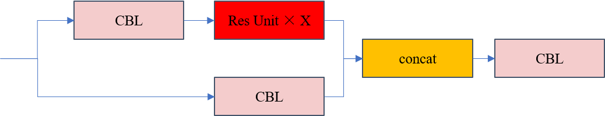](https://cdn-js.moeworld.top/gh/qxdn/qxdn-assert@0.2.3/paper-image8.png)

图 2.6 C3 模块结构

[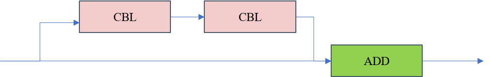](https://cdn-js.moeworld.top/gh/qxdn/qxdn-assert@0.2.3/paper-image9.png)

图 2.7 残差块结构

图 2.3 中的深绿色模块为空间金字塔池化层 (Spatial Pyramid Pooling，SPP)。其结构如图 2.8 所示，其中绿色的为最大池化层。SPP 层使用不同尺寸和步长最大池化的层，将图像进行压缩，并拼接通道数，提高了网络的感受野。

[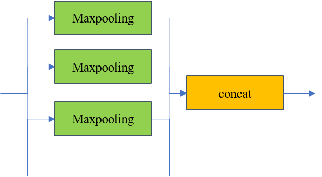](https://cdn-js.moeworld.top/gh/qxdn/qxdn-assert@0.2.3/paper-image10.png)

图 2.8 SPP 结构

图 2.3 中深蓝色模块为 upsample 层，上采样使得特征图的维度得以增加。在 YOLOv5 中上采样使用相邻值填充的方法使特征图的维度放大一倍，使其能够与需要拼接的特征图在维度上匹配。图 2.3 中的橙色模块为 concat 层，在 YOLOv5 其作用是将特征图按照通道数拼接起来，因此需要其输入的特征图的维度要一致。图 2.3 中的红色模块为 YOLO 层，其作用是负责对输入的特征图进行预测。在 YOLOv5 中一共由三张特征图负责输出预测结果，其中大尺度特征图的尺寸为 80×80，主要用于预测小目标。中等尺度的特征图尺寸为 40×40，主要用于预测中等目标。小尺度特征图尺寸 20×20，主要用于预测大目标。

### YOLO 检测流程

YOLO 算法在事先就对数据集标签中的所有边界框进行 k-means 聚类运算，获取聚类的质心作为锚框 (anchor)。其核心思想是将图像划分成 S×S 个网格，反映到实际中就是输出特征图的大小。每个网格负责预测中心落在其中的物体。每个网格预测 B 个边界框，每个边界框包含了目标相对于网格中心坐标的偏差以及边界框和锚框长宽之间的偏差和边界框的置信度。置信度的计算公式如式 2.8 所示：

confidence\=Pr(Object)∗IoUpredtruth(2.8)confidence=P\_r(Object)\*IoU\_{pred}^{truth} \\tag{2.8} confidence\=Pr(Object)∗IoUpredtruth(2.8)

其反应了边界框含有物体的概率以及其和真实值之间的重合程度。此外每个边界框还附带了以 one-hot 形式编码的该物体属于 C 个类别的条件概率。因此 YOLO 最后输出的张量形状如式 2.9 所示：

filters\=S×S×(B∗5+C)(2.9)filters=S\\times S\\times (B\*5+C) \\tag{2.9} filters\=S×S×(B∗5+C)(2.9)

以 MS COCO 数据集的 80 个类目标检测为例，图 2.3 中 YOLO 层输出通道数为 255 表示：在 YOLOv5 中 B 为 3 个边界框，C 为 80 个类别。因此代入式 2.9 可以得到 255=3×(5+80)。

在 YOLOv5 模型中为了解决其对小目标的检测性能不佳，便借鉴了特征金字塔结构和路径聚合网络结构，将不同尺度的特征进行融合。相较于 YOLO 的以往版本只使用一个特征图进行预测，YOLOv5 中使用了大中小三个特征图分辨预测小中大尺度的目标，极大的提升了小目标检测性能。

由于 YOLOv5 输出的坐标部分是关于锚框的偏移量，因此需要对这部分数据进行解码。计算过程如图 2.9 所示。cxc\_xcx和 cyc\_ycy指网格的中心坐标，pwp\_wpw和 php\_hph分别指锚框的长宽，txt\_xtx和 tyt\_yty表示预测相对网格中心的偏差，twt\_wtw和 tht\_hth分别表示预测相对于锚框的偏差。σ\\sigmaσ 指 _sigmoid_ 函数，bxb\_xbx、byb\_yby、bwb\_wbw、bhb\_hbh是指实际预测框的中心坐标和长宽。

[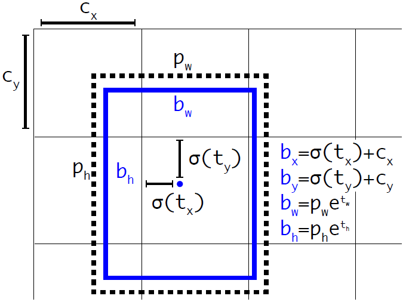](https://cdn-js.moeworld.top/gh/qxdn/qxdn-assert@0.2.3/paper-image11.png)

图 2.9 锚框解码

YOLO 算法的预测结果会有多个冗余的检测框，为此 YOLOv5 使用非极大值抑制 (Non-Maximum Suppression，NMS) 选择与实际目标最接近的边接框并去除与其冗余的框。其计算过程如下

(1)、根据置信度对边界框进行排序，并设置一个 IoU 阈值和 NMS 阈值。

(2)、删除所有置信度小于 NMS 阈值的框，置信度越低代表检测错误的可能性越大。

(3)、取置信度最高的预测框，并删除与该预测框的 IoU 大于阈值的预测框。IoU 越大就表明重叠部分越多，在图像中就重叠度较高的预测框可能预测的是同一个物体，所以要删去多余的框。

(4)、对剩下未处理的框重复上述操作，直到所有框都被处理。

[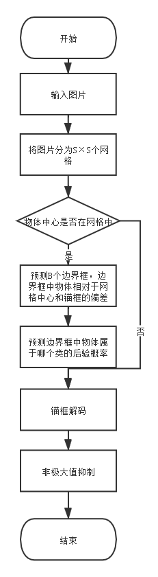](https://cdn-js.moeworld.top/gh/qxdn/qxdn-assert@0.2.3/paper-image12.png)

图 2.10 YOLO 算法的检测流程

YOLO 算法的整体检测流程如图 2.10 所示。图片输入后先预测出偏差，再对锚框进行解码，最后进行 NMS 处理。其结果就是最后的检测结果。

## 评判指标概述

评价一个模型检测效果的好坏往往需要使用同一种评价指标。在目标检测算法中，通常使用以下指标：

交并集 (Intersection over Union，IoU)。其计算结果如图 2.11 所示，即预测边界框和实际边界框之间的交集面积和并集面积之比。是一种衡量预测框和标签框重合程度的指标，越接近 1 代表预测结果越好。

图 2.11 IoU 计算过程

混淆矩阵。计算如表 2.1 所示。其为评估模型性能的一项重要指标，也是后续多项衍生指标的基础。

<table style="text-align: center;"><tbody><tr><td colspan="2" rowspan="2"></td><td colspan="2">预测值</td></tr><tr><td>Positive</td><td>Negative</td></tr><tr><td rowspan="2">真实</td><td>Positive</td><td>TP(True Positive)</td><td>FN(False Negative)</td></tr><tr><td>Negative</td><td>FP(False Positive)</td><td>TN(True Negative)</td></tr></tbody></table>

精确率 (Precision)。其计算公式如式 2.10 所示：

Precision\=TPTP+FP(2.10)Precision=\\frac{TP}{TP+FP} \\tag{2.10} Precision\=TP+FPTP(2.10)

对于目标检测算法来说，通常使用一个置信度阈值来判断 TP 和 FP。如果置信度大于阈值就是 TP 否则就是 FP。其表示在所有正样本中被预测正确的比例。

召回率 (Recall)。其计算公式如式 2.11 所示：

Recall\=TPTP+FN(2.11)Recall=\\frac{TP}{TP+FN} \\tag{2.11} Recall\=TP+FNTP(2.11)

对于目标检测算法来说，FN 就是模型没有检测到的标签。其表示在所有分类正确的样本中正样本的比例。

平均精确度 (Average Precision，AP)。通常来说我们希望检测结果的精确率和召回率都越高越好，然而两者往往是以相反方向变化的。为了更好的描述算法检测效果，PASCAL VOC 比赛方提出了一个新的指标 AP<a href="https://qianxu.run/2021/07/02/YOLO-paper/index.html#fn3" id="fnref3:4" data-pjax-state="">[3:4]</a>。AP 的计算过程如下，通过设置不同的置信度阈值，我们可以得到不同的精确度和召回率，最后可以绘制成一条横坐标为召回率，纵坐标为精确率的 P-R 曲线。曲线与坐标轴之间的面积就是 AP。AP 的计算公式如式 2.12 所示：

AP\=∫01p(r)dr(2.12)AP=\\int\_{0}^{1}p(r)dr \\tag{2.12} AP\=∫01p(r)dr(2.12)

p(r)p\\left( r \\right)p(r) 为召回率 r 所对应的精确度。由于 AP 能够很好的描述检测效果，因此在目标检测领域中被广泛使用。

均值平均精确度 (mean Average Precision，mAP)。AP 是针对某一个特定的类别所计算的，mAP 就是将每个类别的 AP 求和后取一波平均值。mAP 的计算公式如 2.13 所示：

mAP\=1N∑iNAPi(2.13)mAP=\\frac{1}{N}\\sum\_{i}^{N}AP\_i \\tag{2.13} mAP\=N1i∑NAPi(2.13)

式中 _N_ 为检测类别的个数。mAP 还可以根据单独的 IoU 来计算，通常情况下选择 IoU 为 50% 或者 75%，记作 mAP50mAP\_{50}mAP50，mAP75mAP\_{75}mAP75。mAP50mAP\_{50}mAP50是指只考虑 IoU 分数大于 0.5 的样本的均值平均精确度。

## 本章小结

本章首先主要讲述了卷积神经网络的主要组成部分的原理和优点。介绍几种常见的激活函数的优点以及各自所存在的问题，还介绍了全连接网络的优缺点以及常见的改进措施。本章随后还重点介绍了 YOLOv5 网络的结构与检测流程，并对其中的每一个模块都进行了详细讲解。本章最后介绍了目标检测算法的相关评价指标，作为后文 YOLOv5 改进前后模型的对比指标。

# YOLO 算法分析及改进

虽然 YOLO 是一种检测效果较好的通用算法，但是其对于特定数据集需要做一定的调整。本章首先对数据集和 YOLOv5 模型进行分析，随后针对其中的问题提出几项改进措施。

## 数据集分析

在正式开始神经网络训练之前，首先需要对数据集进行探索性分析，观察数据集中数据的特点。对数据集有充分的认识之后，才能确定后续对模型的改进方向。

本次行人车辆检测数据集由 MS COCO 大型目标检测数据集和 BDD100K 自动驾驶数据集中各自提取的一部分包含行人和车辆的数据集合并而成。COCO 和 BDD100K 数据集的标签格式如图 3.1 和图 3.2 所示。COCO 标签集边界框为左上角坐标和长宽，BDD100K 则为边框的左上角和右下角坐标。因此需要训练之前需要将其转化为 YOLO 的中心坐标、长宽的格式

[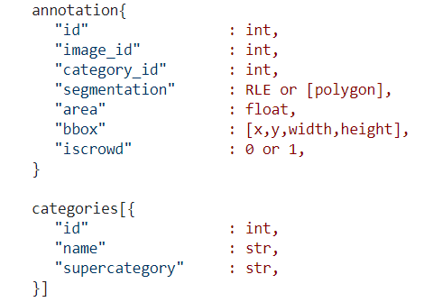](https://cdn-js.moeworld.top/gh/qxdn/qxdn-assert@0.2.3/paper-image14.png)

图 3.1 COCO 标签格式

合并后数据集一共有 17524 张图片用于训练，2262 张图片用于验证。其中检测的类别含有行人、机动车、自行车、摩托车、公交车和卡车六类。每个类别的实例数量如图 3.3 所示。其中行人类共有 51651 个，自行车类共有 5835 个，普通机动车 90234 个，摩托类 6108 个，公交车类 4957 个，卡车类 7999 个。可以明显发现机动车和行人两类实例较多，而其他类型的车实例较少，明显存在检测样本不均衡的问题，对此有一种改进方法就是在训练之前对其做数据增强处理。此外经过统计，数据集中一共有 166784 个检测实例，如果将输入图像缩放到 640×640 的大小计算，标签像素长宽小于 8 的 16560 个，而标签像素长宽小于 4 的有 1200 个，小目标占比约为 9.92%。

[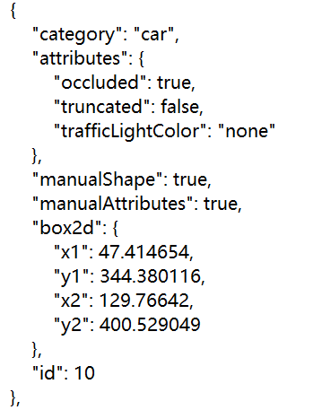](https://cdn-js.moeworld.top/gh/qxdn/qxdn-assert@0.2.3/paper-image15.png)

图 3.2 BDD100k 标签格式

[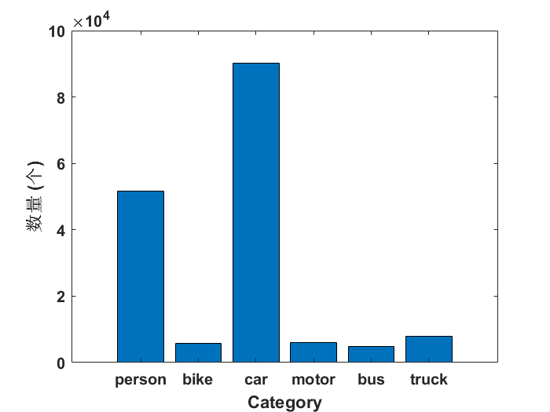](https://cdn-js.moeworld.top/gh/qxdn/qxdn-assert@0.2.3/paper-image16.png)

图 3.3 数据集实例分布

## 对 YOLOv5 模型的分析

YOLOv5 使用路径聚合网络和改进的网络骨架后，相较于以往版本对于小物体的检测效果有了较大的提升，但是 YOLOv5 对于大尺寸的物体检测性能并不理想，算法难以区分卡车和公交车两类，这可能是因为算法提取的特征不够，难以根据现有特征来区分卡车和公交车。

YOLOv5 模型在检测一些密集小物体时，存在定位不精确的问题，即出现一些定位上的失误，还会出现将背景错误的判别为物体或者多个物体被判别成一个物体的问题。

## 对 YOLOv5 模型的改进方案

### 数据增强

针对图 3.1 中的数据不均衡问题，有两个种改进方法，一是在训练的损失函数中加入一些高级损失函数如 Focal loss，另外一种是在训练时期对训练数据使用数据增强。因为修改损失函数较为复杂，因此本文选用使用数据增强的方法。数据增强是指在图片送入网络前的预处理阶段，通过对输入图片进行一些微小的改变操作如随机擦除、调整饱和度等，使得神经网络认为这是一张全新的图片达到增加数据量的效果。在本次实验中将使用马赛克数据增强，其原理是将四张图片随机缩放、翻转、调整色域、随机分布然后拼接起来。这样做不仅可以增大目标检测的数据量，还能够丰富数据集中检测目标的背景，减少背景被误判为检测目标的概率。

### 针对网络结构改进

YOLOv5 对于物体分类以及对大尺寸物体检测性能不理想，可能是因为 YOLOv5 对于目标的特征提取的不够。对此有一条改进思路，就是对 YOLOv5 的骨架进行改进，再用一层卷积进行下采样，让卷积层能够提取到更多的特征。这样做的缺点是网络的参数变多，网络的运算速度会有所下降。但是运算速度并不是越快越好，更重要的是较快的速度和较高精确度的权衡。

[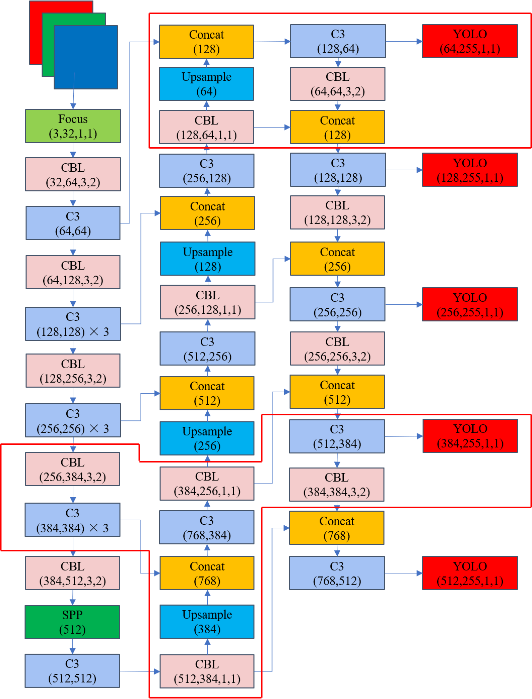](https://cdn-js.moeworld.top/gh/qxdn/qxdn-assert@0.2.3/paper-image17.png)

图 3.4 改进后的 YOLOv5 模型结构

YOLOv5 模型对 8 倍下采样输出的特征图负责对小目标进行检测，这意味着如果实例的像素大小小于 8×8 将会很难被检测到 <a href="https://qianxu.run/2021/07/02/YOLO-paper/index.html#fn23" id="fnref23" data-pjax-state="">[23]</a>。而数据集中小于 8×8 的实例一共有 16560 个，而像素尺寸小于 4×4 的实例只有 1200 个，显然采用 4 倍下采样的特征图负责小目标的检测能够包含几乎整个数据集。此外 YOLOv5 对于密集的小目标物体的定位性能不是很理想。对此提出一种针对特征融合改进方案，调整 YOLOv5 中的路径聚合网络，取其中 4、8、16、32、64 倍下采样的五张特征图，经过特征融合人后分别负责检测巨大物体、大物体、中等大小物体、小物体和特别小的物体。这种改进同样是以牺牲速度来换取一定的精度。

总体的改进方法如图 3.4 所示，其中红色框框起来的部分就是本文新增改进的结构。下方的红色框为新增的下采样部分，输出通道数取 256 和 512 的中值。并在特征融合过程中新增了一张特征图负责较大物体的检测。上方的红色框为对特征融合部分的改进，对原先的 8 倍下采样输出特征图再加一层上采样，与 4 倍下采样的特征图进行融合，以提高对小目标的检测效果。基于这些改进，负责预测输出的特征图从原先的三张扩展到了五张。

## 本章小结

在本章首先分析了行人车辆数据集，讲述了数据集的来源和需要检测的类别。介绍了其中样本不均衡的和其中含有一部分小型目标的问题，还介绍了 YOLOv5 模型在当前数据上的缺陷。本章后续针对本章前面提到的问题，提出了数据预处理和网络结构两方面的改进。第四章将会基于这些改进对其进行实验。

# 实验与分析

Pytorch 是一个 facebook 研发的开源 AI 框架，其优点有 (1)、与 python 编程类似，上手容易，可读性高 (2)、使用动态计算图，更方便编写和调试，(3)、容易使用 GPU 进行加速运算。本文将使用 pytorch 框架来实现 YOLOv5 改进后的模型。

本章将介绍本次实验的硬件平台，随后对改进前后模型的性能和实际图片效果进行对比分析。

## 实验硬件平台

本次实验中的所有数据皆在以下硬件平台上运行所得。

(1)、CPU：Intel ® Xeon ® Platinum 8163 CPU @ 2.50GHz

(2)、内存：64GB

(3)、GPU：NVIDIA Tesla P100，16GB 显存，浮点计算速度为 5.18 TFLOPS

(4)、操作系统：Ubuntu 18.04 LTS

## 实验结果分析

本次实验基于上节提到的实验硬件设备对改进前后模型训练 150 轮，使用精确率、召回率和 mAP50mAP\_{50}mAP50作为模型的评价指标，相关评价指标的计算过程可见本文第二章中的评价指标介绍。

### 训练时期效果对比

图 4.1 为训练时期 IoU 阈值为 50% 的均值平均精确度变化图，纵坐标为只考虑 IoU 大于 50% 边界框预测值的均值平均精确度，横坐标为训练的轮数 epoch，一个 epoch 指完成一次数据集里面的全部数据的训练。蓝色的曲线为改进前模型在训练时期的 mAP50mAP\_{50}mAP50的变化曲线，红色的曲线为改进后模型在训练时期的 mAP50mAP\_{50}mAP50的变化曲线。从图中可以明显的看出改进后的模型的 mAP50mAP\_{50}mAP50在训练期间一直比改进前模型高。

[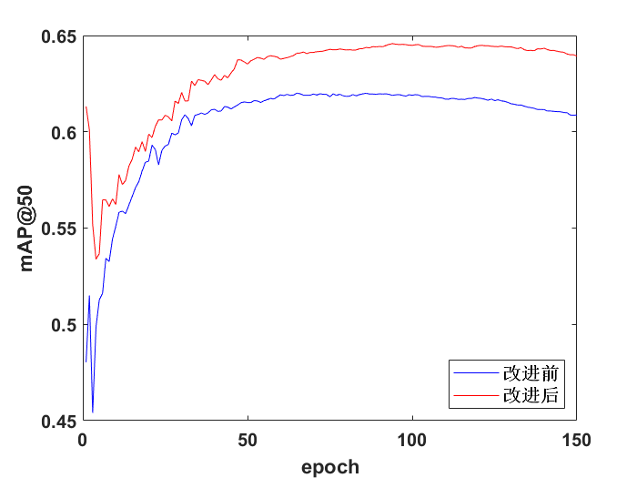](https://cdn-js.moeworld.top/gh/qxdn/qxdn-assert@0.2.3/paper-image18.png)

图 4.1 改进前后模型在训练时期的 mAP50 变化曲线

图 4.2、图 4.3 和图 4.4 为训练时期改进前模型和改进后模型在验证集上的 loss 对比图，横坐标都为训练时的轮次，纵坐标为 loss 的大小。蓝色的曲线为改进前的模型，红色的曲线为改进后的模型。图 4.2 为验证集 cls\_loss 变化图，表示的是模型分辨类别的误差，越低表示模型分类越精准，在 YOLOv5 中使用二元交叉熵来计算分类损失。可以看到训练后期改进后模型的 cls\_loss 要比改进前的低，因此改进后模型的分类效果要更好。图 4.3 为 box\_loss 变化图，表示的是模型的边界框坐标定位方面的误差，越低表示模型的边界框定位越准。在 YOLOv5 中使用了 C-IoU loss 来计算 box\_loss，C-IoU loss 比原本的损失函数多考虑了边界框的中心点距离和长宽比，能更好的反应预测框和真实框的接近程度，可以看到训练时期改进后模型比改进前的 box\_loss 低，这表明改进后的模型在定位方面更精确。图 4.4 为 obj\_loss 变化图，表示的是边界框是物体的置信度方面误差，越低表示模型对边界框内是否存在物体的判别能力越强。改进后模型的 obj\_loss 一直比改进前低，这表明改进后模型判别是否存在物体的能力更强，能够减少风景被误判概率。还可以发现随着训练批次的上升，验证集的 loss 出现了先下降后上升的趋势，这是因为出现了过拟合的现象。为了选取泛化能力最强的模型权重，应该选择 loss 曲线中最低的点所对应的模型权重作为最佳的模型权重。

[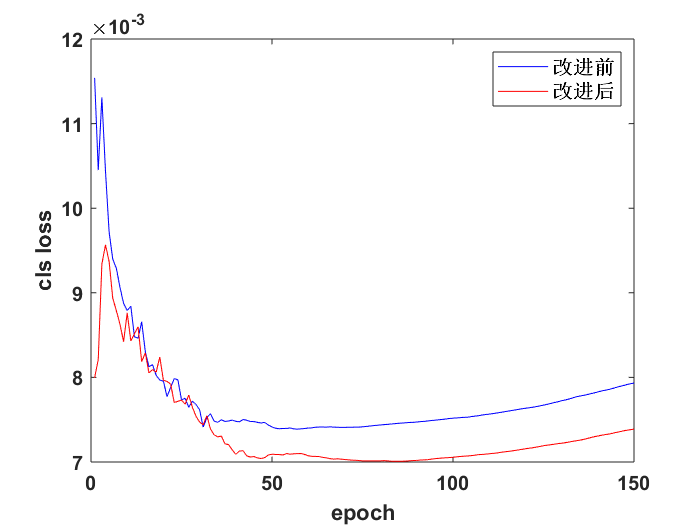](https://cdn-js.moeworld.top/gh/qxdn/qxdn-assert@0.2.3/paper-image19.png)

图 4.2 改进前后模型的验证集分类误差在训练时期的变化曲线

[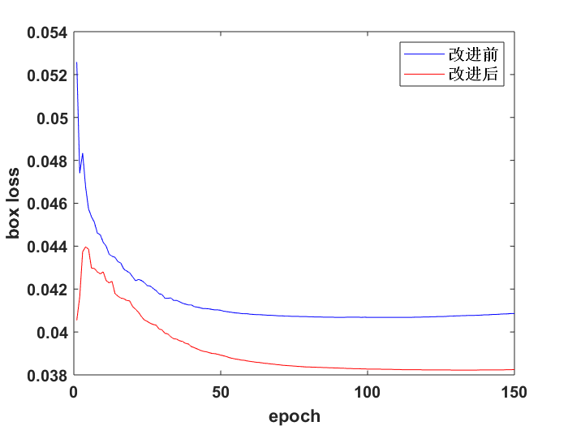](https://cdn-js.moeworld.top/gh/qxdn/qxdn-assert@0.2.3/paper-image20.png)

图 4.3 改进前后模型的验证集边界框误差在训练时期的变化曲线

[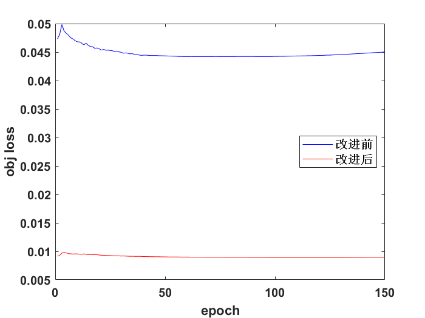](https://cdn-js.moeworld.top/gh/qxdn/qxdn-assert@0.2.3/paper-image21.png)

图 4.4 改进前后模型的验证集物体性误差在训练时期的变化曲线

### 训练完成效果对比

图 4.5 为 YOLOv5 模型改进前后的 mAP50mAP\_{50}mAP50的效果对比，图中蓝色代表的是改进前的模型表现效果，红色的是改进后的模型表现效果。横坐标表示各个类别，一共有行人、自行车、摩托车、公交车和卡车共六类，此外图中还有一个所有类的汇总。纵坐标表示的是只考虑 IoU 大于 50% 的边界框的均值平均精确率，以百分比的形式表示。表格第一列为全部类别的均值平均精确率，改进之前为 62%，改进之后为 64.5%，总体提升了 2.5% 的均值平均精确度。行人类从 66.2% 提升到了 68.3%，自行车类从 47.3% 上升到了 50%，机动车类从 71% 上升到了 75.1%，摩托车类从 65.7% 上升到 68.6%，公交车类从 69.3% 上升到了 70.4，卡车类从 52.3% 上升到了 54.2%。

[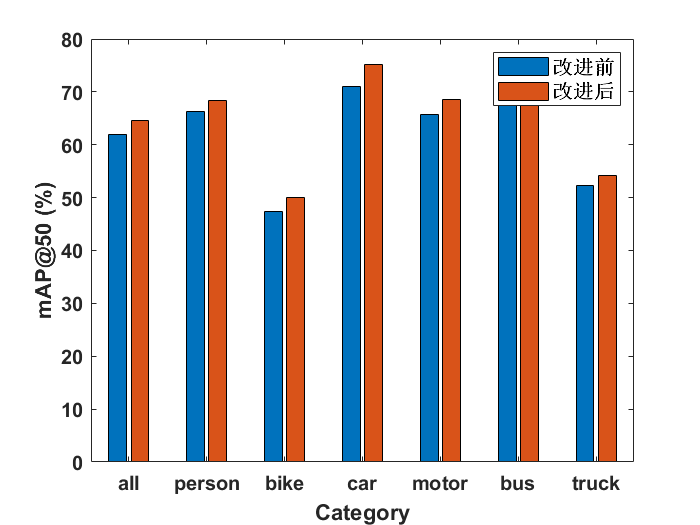](https://cdn-js.moeworld.top/gh/qxdn/qxdn-assert@0.2.3/paper-image22.png)

图 4.5 改进前后模型的 mAP50 对比

图 4.6 是 YOLOv5 模型改进前和改进后的精确度对比。蓝色柱形图表示的是改进前模型的表现，红色的是改进后的模型表现。横坐标代表检测的类别，纵坐标代表了各个类别的精确度。可以看到全部类的精确度在改进之前是 74.4%，在改进之后为 75.8%，整体提高了 1.4%。行人类提升了 2.3%，自行车类提升了 2%，机动车类提升了 1.5%，摩托车类下降了 2.9%，较难分类的公交车类和卡车类分别提升了 2.8% 和 1.8%。

[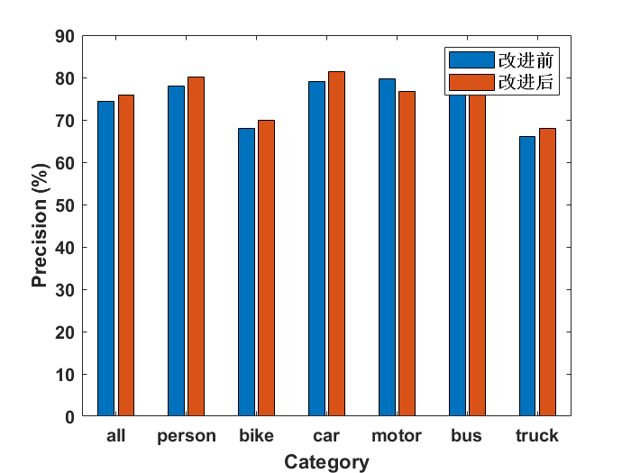](https://cdn-js.moeworld.top/gh/qxdn/qxdn-assert@0.2.3/paper-image23.png)

图 4.6 改进前后模型的精确度对比

图 4.7 为 YOLOv5 模型改进前后的召回率对比，横坐标是分类的各个类别，纵坐标为模型的召回率，以百分比的形式显示，蓝色柱形图表示的是改进前的模型召回率，红色柱形图表示的是改进后的模型召回率。可以看到所有类别的召回率从原来的 55.4% 上升到了 56.6%，但是行人类从 58.6% 下降到了 57.4%，自行车类从 44.9% 上升到了 45.4，机动车类从 63% 上升到了 64.9%，摩托车类从 58.8% 上升到了 60.8%，公交车类从 61.8% 上升到了 63.7%，卡车类从 45.4% 上升到了 47.5%。

[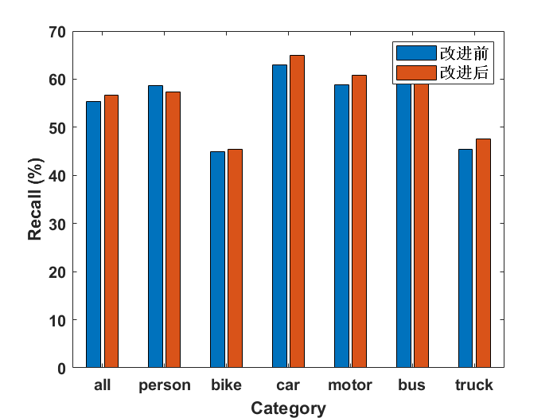](https://cdn-js.moeworld.top/gh/qxdn/qxdn-assert@0.2.3/paper-image24.png)

图 4.7 改进前后模型的召回率对比

图 4.8 和图 4.9 为模型改进前后对一辆黄色卡车的检测效果对比图，图 4.8 为改进前的卡车检测效果图，图中棕色框表示的是卡车类，0.49 表示模型认为该棕色框有 49% 的可能性为卡车，紫色框表示的是公交车类，0.45 表示模型认为该框有 45% 的可能性为公交车。图 4.9 为改进后的模型对同一张图片的检测效果图，图中棕色框表示卡车类，0.91 表示改进后的模型有高达 91% 的置信度认为该框为一辆卡车。比较改进前后的检测效果图可以明显的看出改进后的模型相较于改进前模型在卡车的分类上有了很大的提升。

[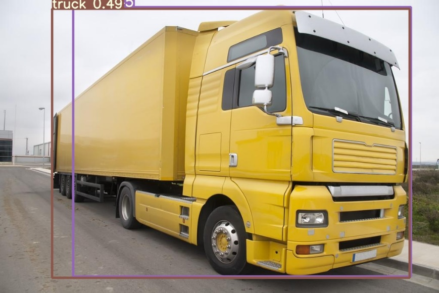](https://cdn-js.moeworld.top/gh/qxdn/qxdn-assert@0.2.3/paper-image25.jpeg)

图 4.8 改进前模型对卡车的预测结果

[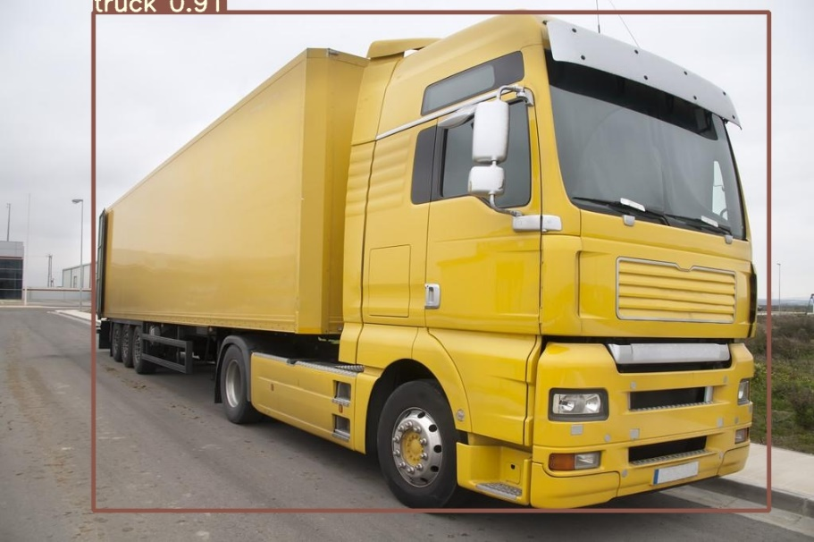](https://cdn-js.moeworld.top/gh/qxdn/qxdn-assert@0.2.3/paper-image26.jpeg)

图 4.9 改进后模型对卡车的预测结果

图 4.10 为含有小目标带有标签的原始图片图，绿色框代表的车辆类，通过计数可以发现图片中一共有 8 个车辆框。图 4.11 为改进前的模型对该图片的检测效果，绿色框代表车辆，数字代表着置信度的大小，数字越高代表越可信，仔细观察可以发现一共预测了 9 个车辆框，在中间偏左一点的位置多以较高的概率多预测了一个框。图 4.12 为改进后的模型对于小目标的检测效果，仔细观察可以发现改进后的模型对图片预测了 8 个车辆框，虽然图中改进后的模型的置信度相对于改进前模型下降了 1%，但是改进后的模型对于目标的定位更为精准。

[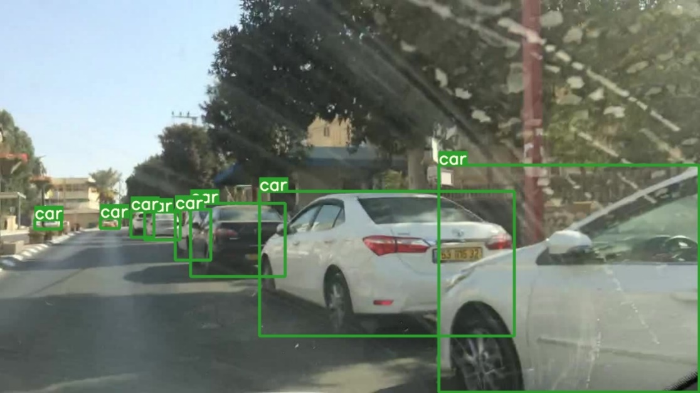](https://cdn-js.moeworld.top/gh/qxdn/qxdn-assert@0.2.3/paper-image27.jpeg)

图 4.10 小目标检测测试图片

[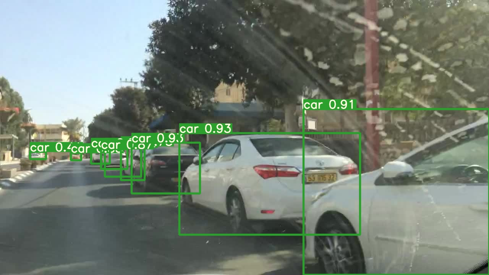](https://cdn-js.moeworld.top/gh/qxdn/qxdn-assert@0.2.3/paper-image28.jpg)

图 4.11 改进前模型对小目标的检测效果

[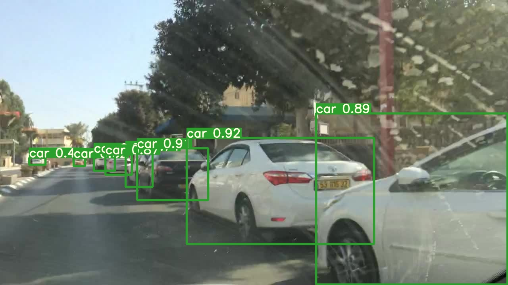](https://cdn-js.moeworld.top/gh/qxdn/qxdn-assert@0.2.3/paper-image29.jpg)

图 4.12 改进后模型对小目标的检测效果

图 4.13 为改进后模型的各个模块的计算速度图，横坐标为各个模块，纵坐标为消耗的时间。可以看到改进后的模型在推理部分耗时为 1.8  
ms，而对推理结果做非极大值抑制耗时 4.5 ms，总体耗时 6.3  
ms。可以估算得到改进后模型的速度约为 159 FPS，可以满足实时性的要求。

[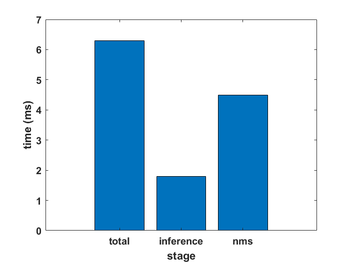](https://cdn-js.moeworld.top/gh/qxdn/qxdn-assert@0.2.3/paper-image30.png)

图 4.13 改进后模型的计算速度

## 本章小结

本章针对 YOLOv5 改进前后的模型进行了实验对比，对比了训练时期的 loss 变化和完成训练后的精确度、召回率和均值平均精确度等。此外还对比了两个模型对于实际图片的检测效果。

# 总结与展望

## 总结

本文首先讲述了车辆行人检测的研究背景及其意义，简要的阐述了目标检测算法的研究现状。随后在第二章中介绍了卷积神经网络的卷积的原理和结构，分析了其中的优缺点。重点讲述了 YOLOv5 的模型结构和其中各个模块的作用和 YOLOv5 的检测流程。

对于行人车辆检测优化方面，本文分析了行人车辆数据集中数据不均衡和小目标较多的问题，此外还分析了 YOLOv5 模型在当前数据集上存在的一些小问题。针对这些问题本文三点改进方案：

(1)、提出了使用马赛克数据增强来解决数据集中各个类别样本分布不均衡的问题。

(2)、针对 YOLOv5 对大型车辆的检测效果不理想的问题，本文提出了新增一层下采样层以获取更多的特征。

(3)、针对数据集中小目标较多的问题和小目标定位不理想的问题，本文提出了对 YOLOv5 模型的特征融合部分进行调整。使用 4 倍下采样的特征图检测小目标。

本文最后对改进方案进行了实验验证，结果表明相较于原本的 YOLOv5 模型，改进后的模型在卡车和公交车等大物体分辨的效果上有了很大的提升。此外改进后模型对小物体的定位效果也比原来的更好了。虽然模型仍然保持着实时检测的效果，但是模型的大小有变大了。

## 展望

经过改进后的 YOLOv5 模型还可以做出更多的改善，首先改进后的 YOLOv5 模型虽然在均值平均精确率、精确率和召回率等指标上有所提升，但是因为其新增加了一个下采样层，同时还与大尺寸的特征图进行特征融合，模型的参数量也因此增大，不利于嵌入式等资源紧缺的设备部署。因此希望能够在保持现有精度的情况下降低模型的大小。其次改进后的 YOLOv5 模型对于大量物体和远处的小目标识别效果依然不佳。

后续的工作有三个方向，第一个是对行人车辆数据集做处理，对其中比较少的实例类做上采样处理或者是人为的增加这部分数据，使得类别的分布比较均衡。第二个是可以参考 MobileNet 中的深度可分离卷积，尝试将深度可分离卷积运用到改进后 YOLOv5 的网络结构中，将网络模型轻量化。第三个是尝试将最近比较火的视觉 Transformer 应用到 YOLOv5 网络结构中改善网络的检测效果。

# 参考文献

---

1. 中国统计年鉴 \[Z\]. 中国统计出版社. 2019. [↩︎](https://qianxu.run/2021/07/02/YOLO-paper/index.html#fnref1)
   
2. 中国统计年鉴 \[Z\]. 中国统计出版社. 2020. [↩︎](https://qianxu.run/2021/07/02/YOLO-paper/index.html#fnref2)
   
3. Zou Z, Shi Z, Guo Y, et al. Object detection in 20 years: A survey\[J\]. arXiv preprint arXiv:1905.05055, 2019. [↩︎](https://qianxu.run/2021/07/02/YOLO-paper/index.html#fnref3) [↩︎](https://qianxu.run/2021/07/02/YOLO-paper/index.html#fnref3:1) [↩︎](https://qianxu.run/2021/07/02/YOLO-paper/index.html#fnref3:2) [↩︎](https://qianxu.run/2021/07/02/YOLO-paper/index.html#fnref3:3) [↩︎](https://qianxu.run/2021/07/02/YOLO-paper/index.html#fnref3:4)
   
4. Dalal N, Triggs B. Histograms of oriented gradients for human detection\[C\]//2005 IEEE computer society conference on computer vision and pattern recognition (CVPR’05). Ieee, 2005, 1: 886-893. [↩︎](https://qianxu.run/2021/07/02/YOLO-paper/index.html#fnref4)
   
5. Lowe D G. Object recognition from local scale-invariant features\[C\]//Proceedings of the seventh IEEE international conference on computer vision. Ieee, 1999, 2: 1150-1157. [↩︎](https://qianxu.run/2021/07/02/YOLO-paper/index.html#fnref5)
   
6. Cortes C, Vapnik V. Support-vector networks\[J\]. Machine learning, 1995, 20(3): 273-297. [↩︎](https://qianxu.run/2021/07/02/YOLO-paper/index.html#fnref6)
   
7. Freund Y, Schapire R E. A decision-theoretic generalization of on-line learning and an application to boosting\[J\]. Journal of computer and system sciences, 1997, 55(1): 119-139. [↩︎](https://qianxu.run/2021/07/02/YOLO-paper/index.html#fnref7)
   
8. Krizhevsky A, Sutskever I, Hinton G E. Imagenet classification with deep convolutional neural networks\[J\]. Advances in neural information processing systems, 2012, 25: 1097-1105. [↩︎](https://qianxu.run/2021/07/02/YOLO-paper/index.html#fnref8) [↩︎](https://qianxu.run/2021/07/02/YOLO-paper/index.html#fnref8:1)
   
9. Girshick R, Donahue J, Darrell T, et al. Rich feature hierarchies for accurate object detection and semantic segmentation\[C\]//Proceedings of the IEEE conference on computer vision and pattern recognition. 2014: 580-587. [↩︎](https://qianxu.run/2021/07/02/YOLO-paper/index.html#fnref9)
   
10. Girshick R. Fast r-cnn\[C\]//Proceedings of the IEEE international conference on computer vision. 2015: 1440-1448. [↩︎](https://qianxu.run/2021/07/02/YOLO-paper/index.html#fnref10)
    
11. Ren S, He K, Girshick R, et al. Faster r-cnn: Towards real-time object detection with region proposal networks\[J\]. arXiv preprint arXiv:1506.01497, 2015. [↩︎](https://qianxu.run/2021/07/02/YOLO-paper/index.html#fnref11) [↩︎](https://qianxu.run/2021/07/02/YOLO-paper/index.html#fnref11:1) [↩︎](https://qianxu.run/2021/07/02/YOLO-paper/index.html#fnref11:2)
    
12. Redmon J, Divvala S, Girshick R, et al. You only look once: Unified, real-time object detection\[C\]//Proceedings of the IEEE conference on computer vision and pattern recognition. 2016: 779-788. [↩︎](https://qianxu.run/2021/07/02/YOLO-paper/index.html#fnref12) [↩︎](https://qianxu.run/2021/07/02/YOLO-paper/index.html#fnref12:1)
    
13. Redmon J, Farhadi A. YOLO9000: better, faster, stronger\[C\]//Proceedings of the IEEE conference on computer vision and pattern recognition. 2017: 7263-7271. [↩︎](https://qianxu.run/2021/07/02/YOLO-paper/index.html#fnref13)
    
14. Lin M, Chen Q, Yan S. Network in network\[J\]. arXiv preprint arXiv:1312.4400, 2013. [↩︎](https://qianxu.run/2021/07/02/YOLO-paper/index.html#fnref14) [↩︎](https://qianxu.run/2021/07/02/YOLO-paper/index.html#fnref14:1)
    
15. Redmon J, Farhadi A. Yolov3: An incremental improvement\[J\]. arXiv preprint arXiv:1804.02767, 2018. [↩︎](https://qianxu.run/2021/07/02/YOLO-paper/index.html#fnref15)
    
16. Bochkovskiy A, Wang C Y, Liao H Y M. Yolov4: Optimal speed and accuracy of object detection\[J\]. arXiv preprint arXiv:2004.10934, 2020. [↩︎](https://qianxu.run/2021/07/02/YOLO-paper/index.html#fnref16)
    
17. Hubel D H, Wiesel T N. Receptive fields of single neurones in the cat’s striate cortex\[J\]. The Journal of physiology, 1959, 148(3): 574-591. [↩︎](https://qianxu.run/2021/07/02/YOLO-paper/index.html#fnref17)
    
18. Fukushima K, Miyake S. Neocognitron: A self-organizing neural network model for a mechanism of visual pattern recognition\[M\]//Competition and cooperation in neural nets. Springer, Berlin, Heidelberg, 1982: 267-285. [↩︎](https://qianxu.run/2021/07/02/YOLO-paper/index.html#fnref18)
    
19. LeCun Y, Bottou L, Bengio Y, et al. Gradient\-based learning applied to document recognition\[J\]. Proceedings of the IEEE, 1998, 86(11): 2278-2324. [↩︎](https://qianxu.run/2021/07/02/YOLO-paper/index.html#fnref19)
    
20. 周飞燕，金林鹏，董军。卷积神经网络研究综述 \[J\]. 计算机学报，2017,40 (06):1229-1251. [↩︎](https://qianxu.run/2021/07/02/YOLO-paper/index.html#fnref20) [↩︎](https://qianxu.run/2021/07/02/YOLO-paper/index.html#fnref20:1) [↩︎](https://qianxu.run/2021/07/02/YOLO-paper/index.html#fnref20:2)
    
21. 蒋昂波，王维维.ReLU 激活函数优化研究 \[J\]. 传感器与微系统，2018,37 (02):50-52. [↩︎](https://qianxu.run/2021/07/02/YOLO-paper/index.html#fnref21) [↩︎](https://qianxu.run/2021/07/02/YOLO-paper/index.html#fnref21:1)
    
22. Liu S, Qi L, Qin H, et al. Path aggregation network for instance segmentation\[C\]//Proceedings of the IEEE conference on computer vision and pattern recognition. 2018: 8759-8768. [↩︎](https://qianxu.run/2021/07/02/YOLO-paper/index.html#fnref22)
    
23. 鞠默然，罗海波，王仲博，何淼，常铮，惠斌。改进的 YOLO V3 算法及其在小目标检测中的应用 \[J\]. 光学学报，2019,39 (07):253-260. [↩︎](https://qianxu.run/2021/07/02/YOLO-paper/index.html#fnref23)