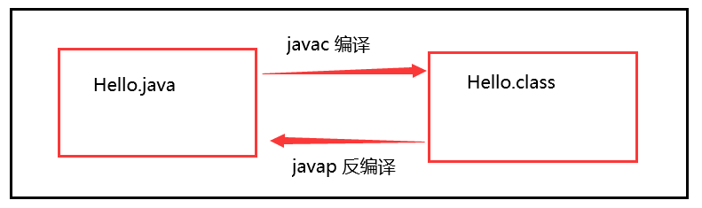
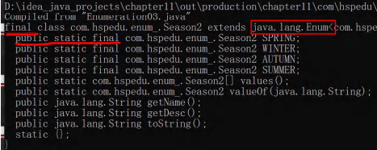
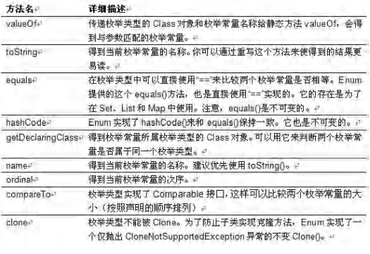
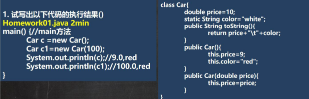
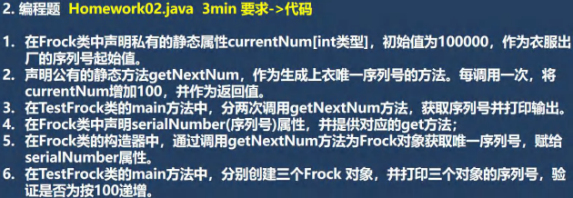
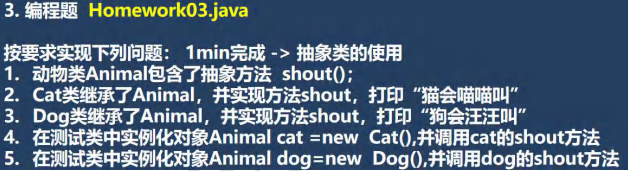
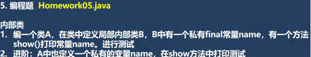
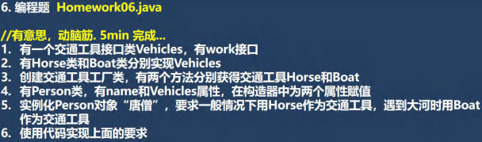
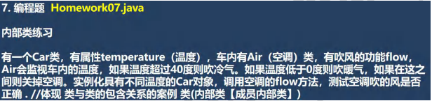
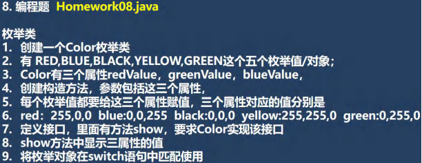

# 枚举和注解


## 枚举


### 缺陷实例

```apl
要求创建季节(Season) 对象，请设计并完成
```

```java
package com.Novice.enum_;

public class Enumeration01 {

    public static void main(String[] args) {

        Season spring = new Season("春天", "温暖");
        Season winter = new Season("冬天", "寒冷");
        Season summer = new Season("夏天", "炎热");
        Season autumn = new Season("秋天", "凉爽");

        //autumn.setName("XXX");
        //autumn.setDesc("非常的热..");

    }
}

class Season{

    private String name;
    private String desc;

    public Season(String name, String desc) {
        this.name = name;
        this.desc = desc;
    }

    public String getName() {
        return name;
    }

    public void setName(String name) {
        this.name = name;
    }

    public String getDesc() {
        return desc;
    }

    public void setDesc(String desc) {
        this.desc = desc;
    }
}
//以上代码有很大的不足
```

#### 反思

```apl
//因为对于季节而已，他的对象(具体值)，是固定的四个，不会有更多
//按这个设计类的思路，不能体现季节是固定的四个对象
//因此，这样的设计不好 <--
//那么，枚举类[把具体的对象一个一个例举出来的类,就称为枚举类]
```


#### 分析枚举类应有特点

```apl
创建 Season 对象有如下特点 

1）季节的值是有限的几个值(spring, summer, autumn, winter)
2）只读，不需要修改。
```


####  解决方案-枚举

```apl
1）枚举对应英文(enumeration, 简写 enum),是一组常量的集合。
3）可以这里理解：枚举属于一种特殊的类，里面只包含一组有限的特定的对象。 
```

 

### 枚举的两种实现方式 

```apl
1）自定义类实现枚举 
2）使用 enum 关键字实现枚举
```


#### 1.自定义类实现枚举

```java
package com.Novice.enum_;

public class Enumeration02 {
    public static void main(String[] args) {

        System.out.println(season_.SUMMER);

    }
}


// 演示字定义枚举实现
class season_ {


    private String name;
    private String desc;

    public static final season_ SPRING = new season_("春天", "温暖");
    public static final season_ WINTER = new season_("冬天", "寒冷");
    public static final season_ SUMMER = new season_("夏天", "炎热");
    public static final season_ AUTUMN = new season_("秋天", "凉爽");


    // 1. 将构造器私有化,目的防止 直接 new
    // 2. 去掉 setXxx 方法, 防止属性被修改
    // 3. 在 Season 内部，直接创建固定的对象
    // 4. 优化，可以加入 final 修饰符
    private season_(String name, String desc) {
        this.name = name;
        this.desc = desc;
    }

    public String getName() {
        return name;
    }


    public String getDesc() {
        return desc;
    }


    @Override
    public String toString() {
        return "season_{" + "name='" + name + '\'' + ", desc='" + desc + '\'' + '}';
    }
}
```

##### 小结

```apl
1) 构造器私有化
2) 本类内部创建一组对象[四个 春夏秋冬] 
3) 对外暴露对象（通过为对象添加 public final static 修饰符）
4) 可以提供 get 方法，但是不要提供 set
```


#### 2.enum 关键字实现枚举


##### 演示实例

```java
package com.Novice.enum_;

public class Enumeration03 {

    public static void main(String[] args) {

        System.out.println(season02.AUTUMN);

    }
}

enum season02{

    //定义了四个对象, 固定.
        // public static final Season SPRING = new Season("春天", "温暖");
        // public static final Season WINTER = new Season("冬天", "寒冷");
        // public static final Season AUTUMN = new Season("秋天", "凉爽");
        // public static final Season SUMMER = new Season("夏天", "炎热");

    //如果使用了 enum 来实现枚举类
        //1. 使用关键字 enum 替代 class
        //2. public static final Season SPRING = new Season("春天", "温暖") 直接使用
        // SPRING("春天", "温暖") 解读 常量名(实参列表)
        //3. 如果有多个常量(对象)， 使用 ,号间隔即可
        //4. 如果使用 enum 来实现枚举，要求将定义的对象写在属性的前面
        //5. 如果我们使用的是无参构造器，创建常量对象，则可以省略 ()

    SPRING("春天", "温暖"),
    WINTER("冬天", "寒冷"),
    SUMMER("夏天", "炎热"),
    AUTUMN("秋天", "凉爽");


    private String name;
    private String desc;


    private season02(String name, String desc) {
        this.name = name;
        this.desc = desc;
    }

    @Override
    public String toString() {
        return "season02{" +
                "name='" + name + '\'' +
                ", desc='" + desc + '\'' +
                '}';
    }
}
```

##### 注意事项

```apl
1) 当我们使用 enum 关键字开发一个枚举类时，默认会继承 Enum 类, 
   而且是一个 final 类[如何证明],老师使用'javap'工具来演示

2) 传统的 public static final Season2 SPRING = new Season2("春天", "温暖"); 
   简化成 SPRING("春天", "温暖")，这里必须知道，'它调用的是哪个构造器'. 

3) 如果使用无参构造器 创建 枚举对象，则实参列表和小括号都可以省略

4) 当有多个枚举对象时，使用','间隔，最后用一个分号结尾

5) 枚举对象必须放在枚举类的行首.
```








##### 课堂练习


###### 问答

```apl
下面代码是否正确, 并说明表示的含义?

enum Gender{ //1min
	BOY , GIRL; 
	//这里其实就是调用 Gender 类的无参构造器
}

1) 上面语法 ok
2) 有一个枚举类 Gender， 没有属性。
3) 有两个枚举对象 BOY, GIRL, 使用的无参构造器创建
```


###### 实例

```java
package com.Novice.enum_;

public class EnumExercise01 {
    public static void main(String[] args) {

        System.out.println(Gender.BOY);
        System.out.println(Gender.GIRL);


        //究竟会输出的是枚举类对象的名字，还是枚举类对象里面的内容取决于重写的toString方法
        
        //如果是调用父类enum的toString方法，那么结果是按照父类格式直接输出对象的名字
            /*
                public String toString0{
                  return name;
                 }
             */
            //如果自己重写了就按照自己重写的内容格式输出


        Gender boy1 = Gender.BOY;
        Gender boy2 = Gender.BOY;
        System.out.println(boy1==boy2);//T


    }
}

enum Gender{

    BOY,//调用无参构造器
    GIRL("BOB");//调用有参构造器

    String name;

    Gender(String name) {//有参构造器
        this.name = name;
    }

    Gender() {}//无参构造器

    @Override
    public String toString() {
        return "Gender{" +
                "name='" + name + '\'' +
                '}';
    }
}
```


### enum 常用方法


#### 说明

```apl
使用关键字 enum 时，会隐式继承 Enum 类, 这样我们就可以使用 Enum 类相关的方法。

源码:
public abstract class Enum<E extends Enum<E>>
		implements Comparable<E>, Serializable {
	
	}
```




#### 实例

```apl
1.toString	Enum 类已经重写过了，返回的是当前对象名,
		   子类可以重写该方法，用于返回对象的属性信息   
2.name	返回当前对象名（常量名），子类中不能重写
3.ordinal	返回当前对象的位置号，默认从 0 开始
4.values	返回当前枚举类中所有的常量
5.valueOf	将字符串转换成枚举对象，要求字符串必须为已有的常量名，否则报异常！
6.compareTo	比较两个枚举常量，比较的就是编号！
```

```java
package com.Novice.enum_;


//枚举类的主要方法如下
//看不明白就运行一下

public class EnumMethod {
    public static void main(String[] args) {

        
        //使用 season03 枚举类对象，来演示各种方法
         //输出枚举对象的名字和序号
        season03 s = season03.SPRING;
        System.out.print("季节名"+s.name());
        System.out.print("季节序号"+s.ordinal());

        
       //compareTo：比较两个枚举常量，比较的就是编号
        int num = s.compareTo(season03.WINTER);
        System.out.println("春季序号 与 夏季序号 的差值 "+num);


        //从反编译可以看出 values 方法，返回 Season03[]，含有定义的所有枚举对象
        season03[] s1 = season03.values();
        for (season03 season : s1) {
            System.out.println("季节名"+season.name() +" 序号"+ season.ordinal());

        }


        //valueOf：将字符串转换成枚举对象，要求字符串必须为已有的常量名，否则报异常
        //执行流程
            //1. 根据你输入的 "AUTUMN" 到 Season2 的枚举对象去查找
            //2. 如果找到了，就返回，如果没有找到，就报错
        season03 s2 = season03.valueOf("AUTUMN");
        System.out.println();
        System.out.println("季节名"+s2.name() +" 序号"+ s2.ordinal());


        System.out.println(s == s2);


    }
}

enum season03 {


    SPRING("春天", "温暖"),
    SUMMER("夏天", "炎热"),
    AUTUMN("秋天", "凉爽"),
    WINTER("冬天", "寒冷");


    private String name;
    private String desc;


    private season03(String name, String desc) {
        this.name = name;
        this.desc = desc;
    }

    @Override
    public String toString() {
        return "season02{" +
                "name='" + name + '\'' +
                ", desc='" + desc + '\'' +
                '}';
    }
}
```


#### week实例

```java
package com.Novice.enum_;

public class EnumExercise02 {
    public static void main(String[] args) {

        for (Week w : Week.values()) {
            System.out.println(w);
        }


    }
}

enum Week {

    MONDAY("星期一"),
    TUESDAY("星期二"),
    WEDNESDAY("星期三"),
    THURSDAY("星期四"),
    FRIDAY("星期五"),
    SATURDAY("星期六"),
    SUNDAY("星期天");

    String name;

    private Week(String name) {
        this.name = name;
    }

    @Override
    public String toString() {
        return name ;
    }
}
```


### enum 实现接口

```apl
1) 使用 enum 关键字后，就不能再继承其它类了，因为 enum 会隐式继承 Enum，而 Java 是单继承机制。
2) 枚举类和普通类一样，可以实现接口，如下形式。

enum 类名 implements 接口 1，接口 2{}
```

#### 实例

```java
package com.Novice.enum_;


//枚举类因为java的单继承机制所以不能再继承其他类
//但是枚举类可以实现接口

public class EnumDetail {
    public static void main(String[] args) {

        test t = test.BOY;
        System.out.print(t.name());
        t.playing();

        System.out.println(t);


    }
}

interface play{

    public void playing();
}

enum test implements play{


    BOY("bob"),GIRL;

    String name;


    test() {
    }

    test(String name) {
        this.name = name;
    }

    @Override
    public void playing() {
        System.out.println("正在演奏音乐");
    }


    @Override
    public String toString() {
        return "test{" +
                "name='" + name + '\'' +
                '}';
    }
}
```


***


***

## 注解


### 概念

```apl
1) 注解(Annotation)也被称为元数据(Metadata)，用于修饰解释 包、类、方法、属性、构造器、局部变量等数据信息。

2) 和注释一样，注解不影响程序逻辑，但注解可以被编译或运行，相当于嵌入在代码中的补充信息。

3) 在 JavaSE 中，注解的使用目的比较简单，例如标记过时的功能，忽略警告等。在 JavaEE 中注解占据了更重要的角色，例如用来配置应用程序的任何切面，代替 java EE 旧版中所遗留的繁冗代码和 XML 配置等。
```

```apl
使用 Annotation 时

1.要在其前面增加 @ 符号 
2.把该 Annotation 当成一个修饰符使用,用于修饰它支持的程序元素
```


### 基本的 Annotation

```apl
三个基本的 Annotation:

1) @Override: 限定某个方法，是重写父类方法, 该注解只能用于方法
2) @Deprecated: 用于表示某个程序元素(类, 方法等)已过时
3) @SuppressWarnings: 抑制编译器警告
```


### Annotation 应用案例


#### @Override 注解

```java
package com.Novice.annotation;

public class Override_ {
    public static void main(String[] args) {


    }
}


class Father {// 父类

    public void fly() {
        System.out.println("Father fly...");
    }

    public void say() {
    }
}

class Son extends Father {// 子类

    // 解读
        // 1. @Override 注解放在 fly 方法上，表示子类的 fly 方法时重写了父类的 fly
        // 2. 这里如果没有写 @Override 重父类 fly没有改变，只是没有了@Override的提示
        // 3. 如果你写了@Override 注解，编译器就会去检查该方法是否真的重写了父类的
        //    方法，如果的确重写了，则编译通过，如果没有构成重写，则编译错误

        // 4. 看看 @Override 的定义
        // 解读： 如果发现 @interface 表示一个 注解类
            /*
                @Target(ElementType.METHOD)
                @Retention(RetentionPolicy.SOURCE)

                    public @interface Override {

                    }
             */

    @Override
    public void fly() {
        System.out.println("Son fly....");
    }

    @Override
    public void say() {
    }
}
```

```apl
补充说明:
@interface不是interface，是注解类是jdk5.0之后加入的,用于定义注解

public '@interface' Override {
    
    }
```

```apl
@verride 使用说明

1.@Override表示指定重写父类的方法（从编译层面验证)，如果父类没有fly方法，则会报错
2.如果不写@Override注解,而父类仍有public void fly00，仍然构成重写

3.@Override只能修饰方法,不能修饰其它类，包，属性等等
4.查看@Override注解源码为@Target(ElementType.METHOD),说明只能修饰方法

5.@Target是修饰注解的注解，称为元注解,记住这个概念.
```


#### @Deprecated 注解

```apl
@Deprecated: 用于表示某个程序元素(类, 方法等)已过时
```

```java
package com.Novice.annotation;

public class Deprecated_ {
    public static void main(String[] args) {

        A a = new A();
        a.hi();
        System.out.println(a.n1);

    }
}


        //解读
            // 1. @Deprecated 修饰某个元素, 表示该元素已经过时
            // 2. 即不在推荐使用，但是仍然可以使用

            // 3. 查看 @Deprecated 注解类的源码，可以修饰方法，类，字段, 包, 参数 等等
            // 4. @Deprecated 可以做版本升级过渡使用

                   /*
                    @Documented
                    @Retention(RetentionPolicy.RUNTIME)
                    @Target(value={CONSTRUCTOR, FIELD, LOCAL_VARIABLE, 
                    				METHOD, PACKAGE, PARAMETER, TYPE})

                        public @interface Deprecated {

                        }
                     */
@Deprecated
class A {
    @Deprecated
    public int n1 = 10;

    @Deprecated
    public void hi() {
    }
}
```

```apl
@Deprecated的说明

1.用于表示某个程序元素(类,方法等)已过时

2可以修饰方法，类,字段,包,参数等等
3.@Target(value={CONSTRUCTOR, FIELD, LOCAL_VARIABLE,METHOD,
PACKAGE,PARAMETER,TYPE))

4.@Deprecated的作用可以做到新旧版本的兼容和过渡
```


#### @SuppressWarnings 注解

```apl
@SuppressWarnings: 抑制编译器警告
```

```java
package com.Novice.annotation;

import java.util.ArrayList;
import java.util.List;

public class SuppressWarnings_ {

    //解读
        //1. 当我们不希望看到这些警告的时候，可以使用 SuppressWarnings 注解来抑制警告信息
        //2. 在{""} 中，可以写入你希望抑制(不显示)警告信息

    //3. 可以指定的警告类型有
        // all，抑制所有警告
        // boxing，抑制与封装/拆装作业相关的警告
        // //cast，抑制与强制转型作业相关的警告
        // //dep-ann，抑制与淘汰注释相关的警告
        // //deprecation，抑制与淘汰的相关警告
        // //fallthrough，抑制与 switch 陈述式中遗漏 break 相关的警告
        // //finally，抑制与未传回 finally 区块相关的警告
        // //hiding，抑制与隐藏变数的区域变数相关的警告
        // //incomplete-switch，抑制与 switch 陈述式(enum case)中遗漏项目相关的警告
        // //javadoc，抑制与 javadoc 相关的警告
        // //nls，抑制与非 nls 字串文字相关的警告
        // //null，抑制与空值分析相关的警告
        // //rawtypes，抑制与使用 raw 类型相关的警告
        // //resource，抑制与使用 Closeable 类型的资源相关的警告
        // //restriction，抑制与使用不建议或禁止参照相关的警告
        // //serial，抑制与可序列化的类别遗漏 serialVersionUID 栏位相关的警告
        // //static-access，抑制与静态存取不正确相关的警告
        // //static-method，抑制与可能宣告为 static 的方法相关的警告
        // //super，抑制与置换方法相关但不含 super 呼叫的警告
        // //synthetic-access，抑制与内部类别的存取未最佳化相关的警告
        // //sync-override，抑制因为置换同步方法而遗漏同步化的警告
        // //unchecked，抑制与未检查的作业相关的警告
        // //unqualified-field-access，抑制与栏位存取不合格相关的警告
        // //unused，抑制与未用的程式码及停用的程式码相关的警告

    //4. 关于 SuppressWarnings 作用范围是和你放置的位置相关
        // 比如 @SuppressWarnings 放置在 main 方法，那么抑制警告的范围就是 main
        // 通常我们可以放置具体的语句, 方法, 类.

    // 5. 看看 @SuppressWarnings 源码
        //(1) 放置的位置就是 TYPE, FIELD, METHOD, PARAMETER, CONSTRUCTOR, LOCAL_VARIABLE

        //(2) 该注解类有数组 String[] values() 设置一个数组比如 {"rawtypes", "unchecked", "unused"}
            /*
            @Target({TYPE, FIELD, METHOD, PARAMETER, CONSTRUCTOR, LOCAL_VARIABLE})
            @Retention(RetentionPolicy.SOURCE)
                public @interface SuppressWarnings {

                String[] value();
                }
            */

    @SuppressWarnings("all")
    public static void main(String[] args) {
        List list = new ArrayList();
        list.add("jack");
        list.add("tom");
        list.add("mary");
        int i;
        System.out.println(list.get(1));
    }
    public void f1() {
        // @SuppressWarnings({"rawtypes"})
        List list = new ArrayList();
        list.add("jack");
        list.add("tom");
        list.add("mary");
        // @SuppressWarnings({"unused"})
        int i;
        System.out.println(list.get(1));
    }
}
```

```apl
@SuppressWarnings 注解说明

1) unchecked是忽略没有检查的警告
2) rawtypes是忽略没有指定泛型的警告(传参时没有指定泛型的警告错误)
3) unused是忽略没有使用某个变量的警告错误

4) @SuppressWarnings可以修饰的程序元素为,查看@Target
5) 生成@SupperssWarnings时,不用背，直接点击左侧的黄色提示，就可以选择
   (但注意可以指定生成的位置)
```

### 元 Annotation(元注解)

#### 概念

```apl
1) Retention //指定注解的作用代码编译范围，三种 SOURCE,CLASS,RUNTIME
2) Target // 指定注解可以在哪些地方使用
3) Documented //指定该注解是否会在 javadoc 体现
4) Inherited //子类会继承父类使用的注解
```


#### @Retention 注解

```apl
说明
只能用于修饰一个 Annotation 定义, 用于指定该 Annotation 可以保留到编译的哪个阶段, @Rentention 包含一个RetentionPolicy类型的成员变量, 使用 @Rentention 时必须为该 value 成员变量指定值:

@Retention 的三种值:
1) RetentionPolicy.SOURCE: 编译器使用后，直接丢弃这种策略的注释
2) RetentionPolicy.CLASS: 编译器将把注解记录在 class 文件中. 当运行 Java 程序时, JVM 不会保留注解。这是默认值
3) RetentionPolicy.RUNTIME:编译器将把注解记录在 class 文件中. 当运行 Java 程序时, JVM会保留注解. 程序可以通过反射获取该注解 
```

```apl
@Retention的案例
    Target(ElementType.METHOD)
    @Retention(RetentionPolicy.soURCE)	//这个就是@retention的取值
    public @interface Override {
    
    }
    
说明:
	Override的作用域在SOURCE,当编译器编译时生效，不会写入到.class文件，也不会再runtime(运行时)生效
```


#### @Target

```apl
基本说明
用于修饰Annotation定义，用于指定被修饰的 Annotation能用于修饰哪些程序元素.
@Target也包含一个名为value的成员变量。

看一个案例

//Deprecated.class

@Documented
@Retention(RetentionPolicy.RUNTIME)
@Target(value={CONSTRUCTOR, FELD,LOCAL_VARIABLE,METHoD,PACKAGE,PARAMETER,TYPE)
    public @interface Deprecated {

    }
```

```apl
@Target的源码说明
@Documented
@Retention(RetentionPolicy.RUNTIME)//它的作用范围是 RUNTIME
@Target(ElementType.ANNOTATION TYPE)/这里的'ANNOTATION_TYPE'说明@Target 只能修饰注解public @interface Target {//说明它是注解
    /*
    * Returns an array of the kinds of elements an annotation type
    * can be applied to.
    * @return an array of the kinds of elements an annotation 
    * type can be applied to
    */
    ElementType value();
    //可以简单看一下ElementType的取值	//通过Enum 比如:TYPE等
}
```


#### @Documented

```apl
基本说明

@Documented:
用于指定被该元 Annotation修饰的Annotation类将被javadoc工具提取成文档,
即在生成文档时，可以看到该注解。

说明:
定义为Documented的注解'必须设置Retention值为RUNTIME'。

案例
@Documented'<--'
@Retention(RetentionPolicy.RUNTIME)
@Target(value={CONSTRUCTOR, FlELD, LOCAL_VARIABLE,METHOD, PACKAGE,PARAMETER,TYPE)
    public @interface Deprecated {
    //一个Deprecated 注解@Documented，则javadoc会看到Deprecated
```

```apl
@Document源码

@Documented
@Retention(RetentionPolicy.RUNTIME)
@Target(ElementType.ANNOTATION_ TYPE)
    public @interface Documented {
    }
```


#### @Inherited 注解

```apl
被它修饰的Annotation将具有继承性.

如果某个类使用了被@Inherited修饰的Annotation,则其子类将自动具有该注解

说明: 实际应用中，使用较少，了解即可。
元注解: 本身作用不大，讲这个原因希望同学们，看源码时，可以知道他是干什么.
```

***


***

## 第 10 章作业


### homework01



```java

```


### homework02



```java
package com.Novice.homeWork;

public class homeWork02 {
}
        /*
        1.在Frock类中声明私有的静态属性currentNum[int类型]，初始值为100000，作为衣服出厂的序列号起始值。
        2.声明公有的静态方法getNextNum，作为生成上衣唯一序列号的方法。每调用一次，将currentNum增加100，并作为返回值。
        3.在TestFrock类的main方法中，分两次调用getNextNum方法，获取序列号并打印输出。
        4.在Frock类中声明serialNumber(序列号)属性，并提供对应的get方法;
        5.在Frock类的构造器中，通过调用getNextNum方法为Frock对象获取唯一序列号，赋给serialNumber属性。
        6.在TestFrock类的main方法中，分别创建三个Frock对象，并打印三个对象的序列号，验证是否为按100递增
         */


class Frock {

    private static int currentNum = 100000;//定义静态变量
    int serialNumber;//定义普通变量

    public Frock() {
        //无参构造函数，此处将getNextNum()方法的返回值赋值给普通变量serialNumber
        this.serialNumber = Frock.getNextNum();
    }

    public int getSerialNumber() {//定义普通变量的get方法
        return serialNumber;
    }

    public static int getNextNum() {//定义计算静态变量currentNum的方法
        return currentNum += 100;//将currentNum加100后再赋值给currentNum
    }

}


class TestFrock{

    public static void main(String[] args) {


        // System.out.println(Frock.getNextNum());//100100
        // System.out.println(Frock.getNextNum());//100200

        Frock frock = new Frock();
        Frock frock1 = new Frock();
        Frock frock2 = new Frock();

        System.out.println(frock.serialNumber);
        System.out.println(frock1.serialNumber);
        System.out.println(frock2.serialNumber);

    }
}
```


### homework03



```java
package com.Novice.homeWork;

public class homeWork03 {
    public static void main(String[] args) {

        Animal cat = new cat();
        cat.shout();
    }
}

abstract class Animal {// 当一个类中有抽象方法时，该类也需要修改为抽象类
    public abstract void shout();// 抽象方法
}


class cat extends Animal {
    @Override
    public void shout() {// 不可以用静态形式(static)重写方法
        System.out.println("小猫喵喵叫");
    }
}
```


### homework04


```java
package com.Novice.homeWork;

public class homeWork04 {
    public static void main(String[] args) {

        Cellphone cellphone = new Cellphone();


        // 1．匿名内部类是  （这个匿名内部类的编译类型是接口ICalculate类型，但是其运行类型是匿名内部类类型）
        /*
            new ICalculate() {
                Override
                public double work(double n1,double n2) {
                    return n1 + n2;
                }
            }，     //同时也是一个对象
         */


        cellphone.testWork(new ICalculate() {
            @Override
            public double work(double n1, double n2) {
                return n1 + n2;
            }
        }, 2, 3);// 5.0  //匿名内部类的目的就是为了让类像变量一样当作参数传入


        cellphone.testWork(new ICalculate() {
            //定义的内部类充当接口的对象，
            //然后由testWork()方法里的double work = icalculate.work(n1, n2);调用
            @Override
            public double work(double n1, double n2) {
                return n1 * n2;
            }
        }, 2, 3);// 6.0     //此处使用匿名内部类，可以很灵活的实现不同的计算方式


    }
}
// 1.计算器接口具有work方法，功能是运算，有一个手机类Cellphone.
// 2.定义方法testWork测试计算功能，调用计算接口的work方法，
// 3.要求调用CellPhone对象的testWork方法，使用上匿名内部类

interface ICalculate {

    // work方法的目的是完成计算，具体完成什么样的计算，在匿名内部类里面实现
    public double work(double n1, double n2);
}


class Cellphone {

    // 当我们调用testWork方法时，直接传入一个实现了ICalculate接口的匿名内部类即可
    // 该匿名内部类,可以灵活的实现work,完成不同的计算任务
    
    public void testWork(ICalculate icalculate, double n1, double n2) {
        double work = icalculate.work(n1, n2);// 实现接口的对象调用了work()方法
        System.out.println(work);

    }
}
```


### homework05



```java
package com.Novice.homeWork;

public class homeWork05 {
    public static void main(String[] args) {
        A a = new A();
        a.f1();
    }
}

// 内部类
// 1．编一个类A，在类中定义局部内部类B，B中有一个私有final常量name，有一个方法show()打印常量name。进行测试
// 2。进阶:A中也定义一个私有的变量name，在show方法中打印测试

class A {
    private String name = "girl";
    private String NAME = "boy";

    public void f1() {
        
        class B { // 该类在方法体中，称作局部内部类
            private final String NAME = "bob";
            public void show() {
                System.out.println(NAME + name);
            // 内部类可以直接调用内部类的属性
                System.out.println(A.this.NAME);
            // 外部类与内部类属性重名，可以使用  外部类.this.属性 的方式调用外部类属性
            }
        }
        B b = new B();// 可以在方法中直接创建内部类的对象
        b.show();
    }// 无法在方法外创建内部类的对象


    
    // 失败用法
        //  class B1{
        //
        //      public  void printlll(){
        //          System.out.println("nihao");
        //      }
        //
        //  }
        //
        // B1 b1 =  new B1();
        //
        // b1.printlll();
}
```


### homework06



#### Boat

```java
package com.Novice.homeWork06;


class Boat implements Vehicles {


    @Override
    public void work() {
        System.out.println("划船");
    }
}
```


#### Fly

```java
package com.Novice.homeWork06;

public class Fly implements Vehicles {


    @Override
    public void work(){
        System.out.println("飞过火焰山");
    }
}

```

#### Horse

```java
package com.Novice.homeWork06;


class Horse implements Vehicles {


    @Override
    public void work() {
        System.out.println("骑马");
    }

}
```

#### Person

```java
package com.Novice.homeWork06;

class Person {

    private String name;
    private static Vehicles vehicles;
    public Person(String name, Vehicles vehicles) {
        this.name = name;
        this.vehicles = vehicles;
    }


    public void BigRiver(){

        // if(vehicles != null){
        if(!(vehicles instanceof Horse)){
            vehicles = (Vehicles) new VehiclesFactory().getBoat();

        }
        vehicles.work();


        // Boat boat = new VehiclesFactory().getBoat();
        // boat.work();
    }

    public static void Normal(){

        // if(vehicles == null){
        if(!(vehicles instanceof Horse)){
            vehicles = new VehiclesFactory().getHorse();

        }
        vehicles.work();


        // Horse horse = new VehiclesFactory().getHorse();
        // horse.work();
    }


    public static void fly(){

        // if(vehicles == null){
        if(!(vehicles instanceof Fly)){
            vehicles = new VehiclesFactory().getfly();

        }
        vehicles.work();

    }

}
```

#### Test

```java
package com.Novice.homeWork06;

public class Test {
    public static void main(String[] args) {

        Person person = new Person("唐僧", new Boat());
        person.BigRiver();
        Person.Normal();
        Person.fly();


    }
}


// 1.有一个交通工具接口类Vehicles，有work接口
// 2.有Horse类和Boat类分别实现Vehicles
// 3.创建交通工具工厂类，有两个方法分别获得交通工具Horse和Boat
// 4.有Person类，有name和Vehicles属性，在构造器中为两个属性赋值
// 5.实例化Person对象"唐僧"，要求一般情况下用Horse作为交通工具，遇到大河时用Boat作为交通工具
// 6.增加一个情况，如果唐僧过火焰山，使用飞机=>程序扩展性，我们前面的程序结构就非常好扩展

// 使用代码实现上面的要求
//  编程需求-—-->理解-——->代码-->优化

```

#### Vehicles

```java
package com.Novice.homeWork06;

// 1.有一个交通工具接口类Vehicles,有work接口
public interface Vehicles {

    public void work();
}
```

#### VehiclesFactory

```java
package com.Novice.homeWork06;

public class VehiclesFactory {

    private static Horse horse =  new Horse();//饿汉式


    VehiclesFactory(){}//防止创建VehiclesFactory对象

    //类中的静态方法可以直接由类名调用
    public static Horse getHorse(){//马儿一直没有换
        //return new Horse();
        return horse;
    }

    public static Boat getBoat(){
        return new Boat();
    }

    public static Fly getfly(){
        return new Fly();
    }

}

```


### homework07(内部类)



#### homework07_1

```java
package com.Novice.homeWork07;

public class homeWork07_1 {

    public static void main(String[] args) {

        car car = new car(-3);
        car car1 = new car(5);
        car car2 = new car(46);

        car.air();
        car1.air();
        car2.air();

    }
}


// 有一个Car类，有属性temperature（温度)，车内有Air（空调）类，有吹风的功能flow,
// Air会监视车内的温度，如果温度超过40度则吹冷气。如果温度低于0度则吹暖气，如果在这之间则关掉空调。
// 实例化具有不同温度的Car对象，调用空调的flow方法，
// 测试空调吹的风是否正确﹒
// 体现类与类的包含关系的案例类(内部类【成员内部类】)


class car {

    private int temperature;


    public car(int temperature) {
        this.temperature = temperature;
    }

    public void air() {

        class Air {


            public void flow() {

                if (temperature < 0) {
                    System.out.println("吹暖风");
                } else if (temperature > 40) {
                    System.out.println("吹冷风");
                } else {
                    System.out.println("空调关闭中");
                }


            }


        }

        Air air_ = new Air();
        air_.flow();

    }
}
```

#### homework07_2

```java
package com.Novice.homeWork07;

public class homeWork07_2 {
    public static void main(String[] args) {

        Tcar tcar = new Tcar(5,new Tcar.T_air());
        tcar.t_air.flow();

    }
}


// 有一个Car类，有属性temperature（温度)，车内有Air（空调）类，有吹风的功能flow,
// Air会监视车内的温度，如果温度超过40度则吹冷气。如果温度低于0度则吹暖气，如果在这之间则关掉空调。
// 实例化具有不同温度的Car对象，调用空调的flow方法，
// 测试空调吹的风是否正确﹒
// 体现类与类的包含关系的案例类(内部类【成员内部类】)

class Tcar{


    private static int temperature;
    T_air t_air ;

    public Tcar(int temperature, T_air t_air) {
        this.temperature = temperature;
        this.t_air = t_air;
    }

    static class T_air {


        public void flow() {

            if (temperature < 0) {
                System.out.println("吹暖风");
            } else if (temperature > 40) {
                System.out.println("吹冷风");
            } else {
                System.out.println("空调关闭中");
            }


        }


    }
}
```

#### homework07_3

```java
package com.Novice.homeWork07;

public class homeWork07_3 {
    public static void main(String[] args) {

        plane plane = new plane(65);
        plane.getpAir().flow();

    }
}

// 有一个Car类，有属性temperature（温度)，车内有Air（空调）类，有吹风的功能flow,
// Air会监视车内的温度，如果温度超过40度则吹冷气。如果温度低于0度则吹暖气，如果在这之间则关掉空调。
// 实例化具有不同温度的Car对象，调用空调的flow方法，
// 测试空调吹的风是否正确﹒
// 体现类与类的包含关系的案例类(内部类【成员内部类】)


class plane{

    private int temperature;

    public plane(int temperature) {
        this.temperature = temperature;
    }


    class pAir {


        public void flow() {

            if (temperature < 0) {
                System.out.println("吹暖风");
            } else if (temperature > 40) {
                System.out.println("吹冷风");
            } else {
                System.out.println("空调关闭中");
            }

        }

    }

 public pAir getpAir(){
        return new pAir();
 }

}
```

***


***

## 第十一章


### homework08(枚举类)



```java
package com.Novice.homeWork;

public class homeWork08 {
    public static void main(String[] args) {

        color green = color.GREEN;
        System.out.println(green.ordinal());
        green.show();

        //switch ()中，放入枚举对象
        //在每个case后，直接写上在枚举类中，定义的枚举对象即可
        //匹配过程是按照枚举类的顺序进行的
        switch (green) {

            case RED:
                System.out.println("red");
                break;
            case BLUE:
                System.out.println("blue");
                break;
            case BLACK:
                System.out.println("black");
                break;
            case GREEN:
                System.out.println("green");
                break;
            case YELLOW:
                System.out.println("yellow");
                break;
            default:
                System.out.println("未匹配到颜色");
        }

    }

}


// 枚举类
//  1.创建一个Color枚举类
//  2.有RED,BLUE,BLACK,YELLOW,GREEN这个五个枚举值/对象;
//  3.Color有三个属性 redValue , greenValue ,blueValue,
//  4、创建构造方法，参数包括这三个属性，
//  5.每个枚举值都要给这三个属性赋值，三个属性对应的值分别是
//  6. red: 255,0,0 blue:0,0,255 black:0,0,0 yellow:255,255,0 green:0,255,0
//  7．定义接口，里面有方法show，要求Color实现该接口
//  8. show方法中显示三属性的值
//  9．将枚举对象在switch语句中匹配使用


interface Show {
    public void show();
}

enum color implements Show {

    RED(255, 0, 0),
    BLUE(0, 0, 255),
    BLACK(0, 0, 0),
    YELLOW(255, 255, 0),
    GREEN(0, 255, 0);

    int redValue;
    int greenValue;
    int blueValue;

    color(int redValue, int greenValue, int blueValue) {
        this.redValue = redValue;
        this.greenValue = greenValue;
        this.blueValue = blueValue;
    }

    @Override
    public void show() {

        System.out.println("redValue：" + redValue + "   greenValue：" + greenValue + "   blueValue：" + blueValue);
    }


}
```