# 引出反射

## 需求

```apl
1．根据配置文件re.properties指定信息,创建Cat对象并调用方法
    classFullPath = com.Novice.cat
    method = hi

思考:使用现有技术，你能做的吗?

2．这样的需求在学习框架时特别多，即通过外部文件配置，在不修改源码情况下.来控制程序，
   也符合设计模式的ocp原则(开闭原则:不修改源码，扩容功能)
```


## 实例

### 配置文件

```apl
classFullPath = com.Novice.cat
method = hi
```

### cat类

```java
public class cat {
    String name = "招财猫";

    public void hi() {
        System.out.println("hi" + this.name);
    }
}
```

### 测试类

```java
package com.Novice.reflection.question;

import java.io.FileReader;
import java.io.IOException;
import java.lang.reflect.InvocationTargetException;
import java.lang.reflect.Method;
import java.util.Properties;

public class ReflectionQuestion {
    public static void main(String[] args) throws IOException, ClassNotFoundException, InstantiationException, IllegalAccessException, NoSuchMethodException, InvocationTargetException {

        // 根据配置文件 re.properties 指定信息, 创建 Cat 对象并调用方法 hi

        // 1. 传统方法:
        // com.Novice.cat cat = new com.Novice.cat();
        // cat.hi();


        // 2. 使用 Properties 类, 可以读写配置文件
        Properties properties = new Properties();
        properties.load(new FileReader("src\\re.properties"));
        //properties加载的是文件内容而不是地址
        String classPath = properties.getProperty("classFullPath");
        String method = properties.getProperty("method");

        System.out.println(classPath);//此时classPath只是一个字符串，而不是一个路径
        // com.Novice.cat cat = new com.Novice.cat();//ok
        // cat cat = new classPath();//wrong

        // 3. 使用反射来解决
        Class<?> cls = Class.forName(classPath);// 加载类，返回class类型的对象cls
        
        Object o = cls.newInstance();// 用该类对象实例化列对象
        System.out.println(o.getClass());// 该对象的运行类型是
        Method method1 = cls.getMethod(method);// 利用类对象创建方法对象
        method1.invoke(o);// 用方法对象执行o类中与该方法对象对应的方法


    }
}
```

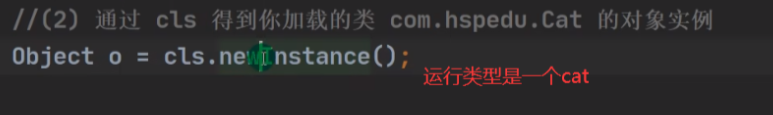

# 反射机制

## Java Reflection的API

```apl
1. 反射机制允许程序在执行期借助于Reflection的API
   取得任何类的内部信息(比如成员变量，构造器，成员方法等等),并能操作对象的属性及方法。
   反射在设计模式和框架底层都会用到

2. 加载完类之后,在堆中就产生了一个Class类型的对象(一个类只有一个Class对象)，
   这个对象包含了类的完整结构信息。通过这个对象得到类的结构。
   这个Class对象就像一面镜子，透过这个镜子看到类的结构，所以，形象的称之为:反射
   
   # 类类型的对象
```

```apl
p对象 -->类型: Person类
Class对象 cls --->类型: Class类
```

## Java 反射机制原理图

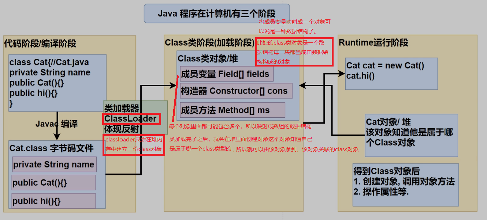


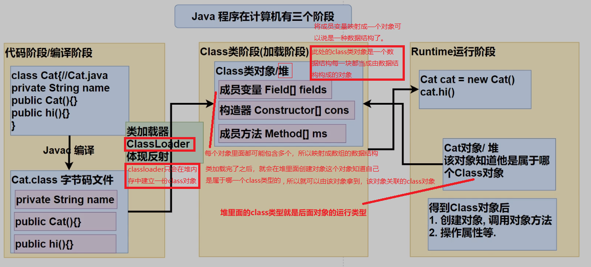

## 反射机制作用

```apl
1.在运行时判断任意一个对象所属的类
2.在运行时构造任意一个类的对象
3.在运行时得到任意一个类所具有的成员变量和方法
4.在运行时调用任意一个对象的成员变量和方法5.生成动态代理
```

## 反射相关的主要类

### 概念

```apl
1. java.lang.Class:
   代表一个类，Class对象表示某个类加载后在堆中的对象
   
2. java.lang.reflect.Method: 
   代表类的方法,Method对象表示某个类的方法
   
3. java.lang.reflect.Field:
   代表类的成员变量,Field对象表示某个类的成员变量
   
4. java.lang.reflect.Constructor:
   代表类的构造方法,Constructor对象表示构造器
   
这些类在java.lang.reflection
```

### 实例

```java
package com.Novice.reflection;

import java.io.FileNotFoundException;
import java.io.FileReader;
import java.io.IOException;
import java.lang.reflect.Constructor;
import java.lang.reflect.Field;
import java.lang.reflect.InvocationTargetException;
import java.lang.reflect.Method;
import java.util.Properties;

import static java.lang.Class.forName;

public class reflection01 {
    public static void main(String[] args) throws ClassNotFoundException, IOException, InstantiationException, IllegalAccessException, NoSuchMethodException, InvocationTargetException, NoSuchFieldException {

        Properties properties = new Properties();
        properties.load(new FileReader("src\\re.properties"));
        String classPath = properties.getProperty("classFullPath");
        String method = properties.getProperty("method");


        Class<?> cls = forName(classPath);
        Object o = cls.newInstance();
        Method hi = cls.getMethod(method);
        hi.invoke(o);

        // java.lang.reflect.Field: 代表类的成员变量, Field 对象表示某个类的成员变量
        // 得到 age 字段
        // getField 不能得到私有的属性
        Field field = cls.getField("age");
        // 传统写法 对象.成员变量 , 反射 : 成员变量对象.get(对象)
        System.out.println(field.get(o));// 10


        // java.lang.reflect.Constructor: 代表类的构造方法, Constructor 对象表示构造器
        Constructor<?> constructor = cls.getConstructor();
        System.out.println(constructor);// public com.Novice.cat()

        Constructor<?> constructor1 = cls.getConstructor(String.class);
        System.out.println(constructor1);// public com.Novice.cat(java.lang.String)


    }
}
```

## 反射优点和缺点

### 概念

```apl
1．优点:
 可以动态的创建和使用对象(也是框架底层核心),使用灵活,没有反射机制,框架技术就失去底层支撑。
2.缺点:
 使用反射基本是解释执行,对执行速度有影响.
```

### 实例

```java
package com.Novice.reflection;

import com.Novice.cat;

import java.lang.reflect.InvocationTargetException;
import java.lang.reflect.Method;

import static java.lang.Class.forName;

public class reflection02 {
    public static void main(String[] args) throws ClassNotFoundException, InvocationTargetException, NoSuchMethodException, IllegalAccessException, InstantiationException {


      
        m1();// 传统
        m2();// 反射
        m3();// 反射优化


    }


    // 传统方法来调用 hi
    public static void m1() {
        cat cat = new cat();
        long l = System.currentTimeMillis();
        for (int i = 0; i < 100000000; i++) {
            cat.hello();
        }

        long l1 = System.currentTimeMillis();
        System.out.println(l1 - l);
    }

    // 反射机制调用方法 hi
    public static void m2() throws ClassNotFoundException, NoSuchMethodException, InvocationTargetException, IllegalAccessException, InstantiationException {

        Class<?> cls = Class.forName("com.Novice.cat");
        Object o = cls.newInstance();
        Method hello = cls.getMethod("hello");

        long l = System.currentTimeMillis();
        for (int i = 0; i < 100000000; i++) {
            hello.invoke(o);// 反射调用方法
        }

        long l1 = System.currentTimeMillis();
        System.out.println(l1 - l);

    }


    // 反射调用优化 + 关闭访问检查
    public static void m3() throws ClassNotFoundException, NoSuchMethodException, InvocationTargetException, IllegalAccessException, InstantiationException {

        Class<?> cls = Class.forName("com.Novice.cat");
        Object o = cls.newInstance();
        Method hello = cls.getMethod("hello");

        hello.setAccessible(true);// 在反射调用方法时，取消访问检查
        long l = System.currentTimeMillis();
        for (int i = 0; i < 100000000; i++) {
            hello.invoke(o);// 反射调用方法
        }

        long l1 = System.currentTimeMillis();
        System.out.println(l1 - l);

    }


}
```

## 反射调用优化


### 关闭访问检查

```apl
1. Method和Field、Constructor对象都有setAccessible()方法
2. setAccessible作用是启动和禁用访问安全检查的开关
3. 参数值为true表示反射的对象在使用时取消访问检查，提高反射的效率。
   参数值为false则表示反射的对象执行访问检查
```

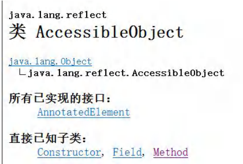

# Class 类

## 基本介绍

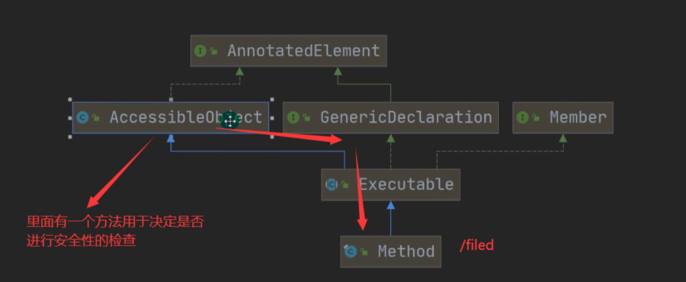

**class就是一个类，只是这个类的使用啊方法与完成的功能有些特殊**

```apl
1. Class也是类,因此也继承Object类[类图]
2. Class类对象不是new出来的，而是系统创建的[演示]
3. 对于某个类的Class类对象，在内存中只有一份，因为类只加载一次[演示
4. 每个类的实例都会记得自己是由哪个Class 实例所生成
5. 通过Class对象可以完整地得到一个类的完整结构,通过一系列API
6. Class对象是存放在堆的
7. 类的字节码二进制数据，是放在方法区的，有的地方称为类的元数据
   (包变量名，方法名，访问权限等等)https://www.zhihu.com/question/【示意图】
```

```java
package com.Novice.reflection.class_;
import com.Novice.*;

import javax.crypto.spec.PSource;

public class class01 {
    public static void main(String[] args) throws ClassNotFoundException, InstantiationException, IllegalAccessException {

        //1. Class 类对象不是 new 出来的，而是系统创建的
        //(1) 传统 new 对象
        /*ClassLoader 类
        public Class<?> loadClass(String name) throws ClassNotFoundException {
            return loadClass(name, false);
        }
        */
         cat cat = new cat();

        //(2) 反射方式, 刚才老师没有 debug 到 ClassLoader 类的 loadClass,
        // 原因是，我没有注销Cat cat =newCat();


        /*ClassLoader 类, 仍然是通过 ClassLoader 类加载 Cat 类的 Class 对象
        public Class<?> loadClass(String name) throws ClassNotFoundException {
            return loadClass(name, false);
        }
        */
        Class<?> cls = Class.forName("com.Novice.cat");
        Object o = cls.newInstance();


        //2. 对于某个类的 Class 类对象，在内存中只有一份，因为类只加载一次

        Class<?> cls1 = Class.forName("com.Novice.cat");
        System.out.println(cls.hashCode());
        System.out.println(cls1.hashCode());

        Class<?> cls3 = Class.forName("com.Novice.Dog");
        System.out.println(cls3.hashCode());
    }
}
```

```apl
//outPut
/*
460141958
460141958
1163157884
 */
```

## Class 类的常用方法

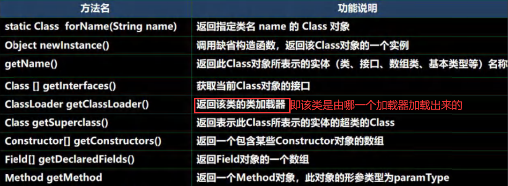

```java
package com.Novice.reflection.class_;

import com.Novice.Car;

import java.lang.reflect.Field;

public class class02 {
    public static void main(String[] args) throws Exception {

        //1 . 获取到 Car 类 对应的 Class 对象
        // <?> 表示不确定的 Java 类型
        Class<?> cls = Class.forName("com.Novice.Car");

        //2. 输出 cls
        System.out.println(cls);//输出所在位置
        System.out.println(cls.getClass());//输出运行类型

        //3. 得到包名
        System.out.println(cls.getPackage().getName());

        // 4. 得到全类名
        System.out.println(cls.getName());

        // 5. 通过 cls 创建对象实例
        Car car = (Car)cls.newInstance();

        // 6. 通过反射获取属性 brand
        Field brand = cls.getField("Brand");
        System.out.println(brand.get(car));

        // 7. 通过反射给属性赋值
        brand.set(car,"宝马");
        System.out.println(brand.get(car));

        // 8 我希望大家可以得到所有的属性(字段)
        Field[] fields = cls.getFields();

        for(Field filed : fields){
            System.out.println(filed.get(car));

        }
    }
}
```

## 获取 Class 类对象

### 条件

```apl
1．前提:
   #已知一个类的全类名，且该类在类路径下，可通过Class类的静态方法forName()获取，
   可能抛出ClassNotFoundException.
   实例:
   Class cls1 =Class.forName( "java.lang.Cat”);
   应用场景:
   多用于配置文件,读取类全路径，加载类.
   
2．前提:
   #若已知具体的类，通过类的class获取，该方式最为安全可靠，程序性能最高
   实例:
   Class cls2 = Cat.class;
   应用场景:
   多用于参数传递，比如通过反射得到对应构造器对象.

3．前提:
   #已知某个类的实例，调用该实例的getClass()方法获取Class对象，
   实例:
   Class clazz=对象.getClass();//运行类型
   应用场景:
   通过创建好的对象，获取Class对象.

4、其他方式
   ClassLoader cl =对象.getClass().getClassLoader();
   Class clazz4 = cl.loadClass(“类的全类名”);

5．基本数据(int, char,boolean,float,double,byte,long,short)
   按如下方式得到Class类对象:
   Class cls =基本数据类型.class
```

### 实例

```java
package com.Novice.reflection.class_;

import com.Novice.*;

import javax.crypto.spec.PSource;

public class GetClass_ {
    public static void main(String[] args) throws Exception {

            String classAllPath = "com.Novice.Car";
        // 1. Class.forName
            Class<?> cls = Class.forName(classAllPath);
        // 2. 类名.class , 应用场景: 用于参数传递
            Class<Car> cls1 = Car.class;
        // 3. 对象.getClass(), 应用场景，有对象实例
            Car car = new Car();
            Class<? extends Car> cls2 = car.getClass();

        // 4. 通过类加载器【4 种】来获取到类的 Class 对象
            // (1)先得到类加载器 car
            ClassLoader classLoader = Car.class.getClassLoader();
            //只是借用他调一下类加载器而已，也可以直接用系统的
            // (2)通过类加载器得到 Class 对象
            Class<?> cls3 = classLoader.loadClass(classAllPath);
            // cls1 , cls2 , cls3 , cls4 其实是同一个对象
            System.out.println(cls);
            System.out.println(cls1);
            System.out.println(cls2);
            System.out.println(cls3);

        // 5. 基本数据(int, char,boolean,float,double,byte,long,short)
            // 按如下方式得到 Class 类对象
            Class<Integer> integerClass = int.class;
            Class<Double> doubleClass = double.class;
            Class<Character> characterClass = char.class;
            Class<String> stringClass = String.class;

        // 6. 基本数据类型对应的包装类，可以通过 .TYPE 得到 Class 类对象
            Class<Integer> type = Integer.TYPE;
            Class<Double> type1 = Double.TYPE;
            System.out.println(integerClass.hashCode());
            System.out.println(type.hashCode());
            System.out.println(doubleClass.hashCode());
            System.out.println(type1.hashCode());

            System.out.println(integerClass.getName());


    }
}
```

## 哪些类型有 Class 对象

### 类型

```apl
1．外部类,成员内部类，静态内部类，局部内部类，匿名内部类
2. interface:接口
3．数组
4. enum:枚举
5. annotation:注解
6.基本数据类型
7. void
```

### 实例

```java
package com.Novice.reflection.class_;

import java.io.Serializable;

public class AllTypeCass {
    public static void main(String[] args) {

        // 外部类
        Class<String> cls1 = String.class;
        // 接口
        Class<Serializable> cls2 = Serializable.class;
        // 数组
        Class<Integer[]> cls3 = Integer[].class;
        // 二维数组
        Class<double[][]> cls4 = double[][].class;
        // 注解  //Deprecated:过时的
        Class<Deprecated> cls5 = Deprecated.class;
        // 枚举  //线程的State是枚举类
        Class<Thread.State> cls6 = Thread.State.class;

        // 基本数据类型
        Class<Long> cls7 = long.class;
        // void 数据类型
        Class<Void> cls8 = void.class;
        //
        Class<Class> cls9 = Class.class;

        System.out.println(cls1.getPackage().getName());
        System.out.println(cls2.getClass().getSimpleName());
        System.out.println(cls3);
        System.out.println(cls4);
        System.out.println(cls5);
        System.out.println(cls6);
        System.out.println(cls7);
        System.out.println(cls8);
        System.out.println(cls9);


    }
}
```


# 类加载


## 动静态加载

### 说明

```apl
反射机制是java实现动态语言的关键，也就是通过反射实现类动态加载
1. 静态加载:
   编译时加载相关的类，如果没有则报错,依赖性太强
   
2. 动态加载:
   运行时加载需要的类,如果运行时不用该类，即使不存在该错，降低了依赖性
   
3. 举例说明
```

### 静态加载

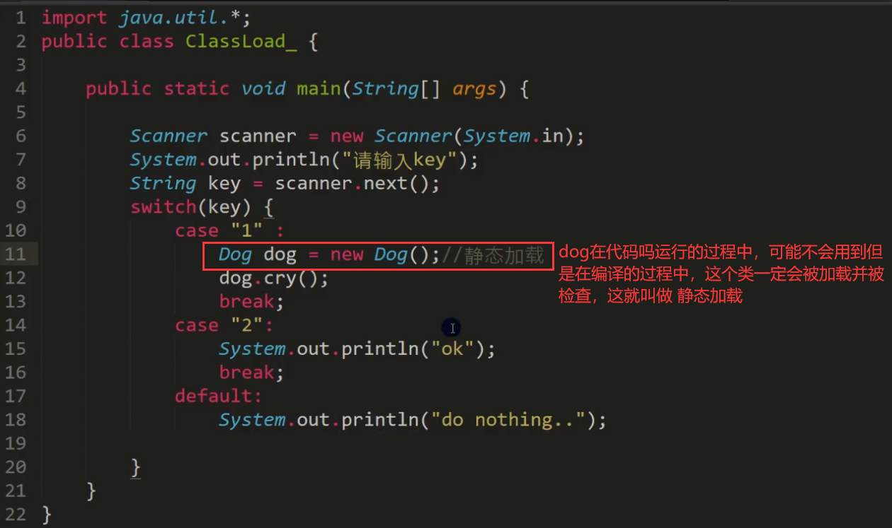

### 动态加载

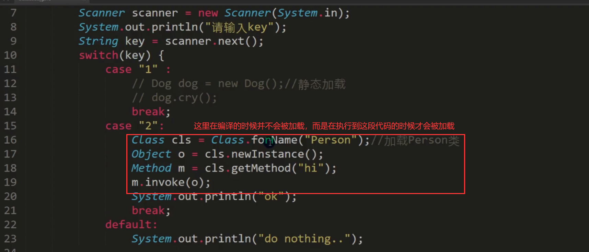


## 类加载时机

```apl
1.当创建对象时(new) # 静态加载
2.当子类被加载时,父类也加载 # 静态加载
3.调用类中的静态成员时 # 静态加载
4.通过反射 # 动态加载
```


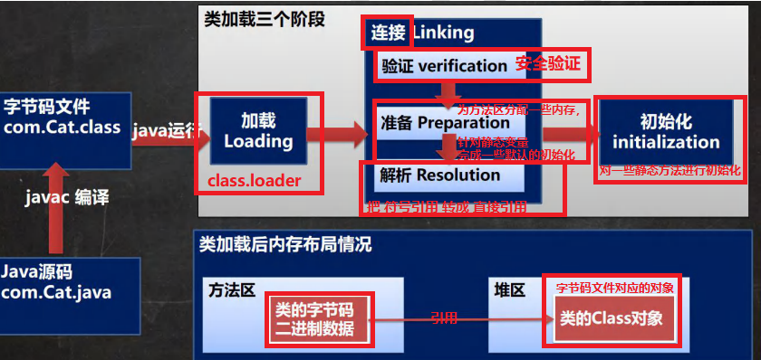


## 各阶段任务


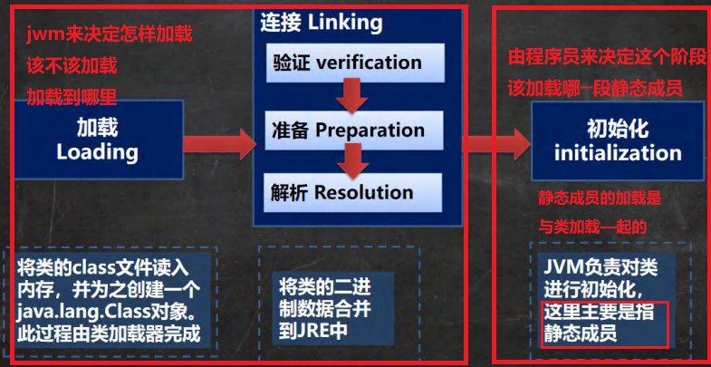


## 各阶段详解

### 1. 加载阶段


```apl
JVM在该阶段的主要目的是将字节码从不同的数据源（可能是class文件、也可能jar包，甚至网络)
'转化为二进制字节流加载到内存中'，并生成一个代表该类的java.lang.Class对象
```

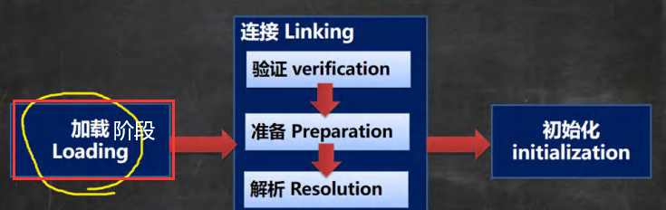

### 2. 连接阶段

#### 验证

```apl
1．目的:
   为了确保 Class文件的字节流中包含的信息符合当前虚拟机的要求，
   并且不会危害虚拟机自身的安全。

2. 包括:
   文件格式验证(是否以魔数oxcafebabe开头)、元数据验证、
   字节码验证 和 符号引用验证[举例说明]
   
3．可以考虑使用-Xverify:none 参数来关闭大部分的类验证措施，缩短虚拟机类加载的时间。
```

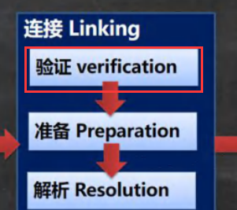

#### 准备

##### 概念

```apl
1. JVM会在该阶段对 静态变量，分配内存 并默认初始化
   (对应数据类型的默认初始值，如0、OL、null、false等)。
   # 这些变量所使用的内存都将在方法区中进行分配
```

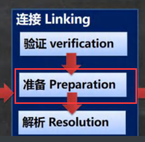

##### 实例

```java
package com.Novice.reflection.classload_;

public class classLoad02 {
    public static void main(String[] args) {


    }
}

class A {

    // 1. n1 是实例属性, 不是静态变量，因此在准备阶段，是不会分配内
    // 2. n2 是静态变量，分配内存 n2 是默认初始化 0 ,而不是 20.
    //    在初始化阶段会变成20.
    // 3. n3 是 static final 是常量, 他和静态变量不一样, 因为一旦赋值就不变 n3 = 30

    public int n1 = 10;
    public static int n2 = 20;
    public static final int n3 = 30;

}
```

#### 解析


```apl
1．虚拟机将 常量池内 的 符号引用 替换为 直接引用 的过程。

    两个人在没有参照物的时候，使用的是相对距离
    当将两个人放在地球(内存)上的时候，使用的就是经纬度，来表示两者举例
    
    直接引用：在内存中要靠内存中的地址来相互的引用 # 汇编中的基础地址+偏移地址
    
    '整个过程由JVM机来控制的'
```

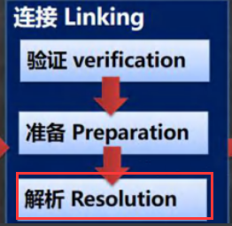


### 3. Initialization（初始化)

#### 概念

```apl
1．到初始化阶段，才真正开始执行'类中定义的Java程序代码'，
   此阶段是执行<clinit>()方法的过程。# 此阶段程序员可控

2. <clinit>()方法是由编译器按语句在源文件中出现的顺序，
   '依次自动收集类中的所有 静态变量的赋值动作 和 静态代码块中的语句,并进行合并。
   [举例说明ClassLoad03.java]
   
3．虚拟机会保证一个类的<clinit>()方法在多线程环境中被正确地加锁、同步，
   如果多个线程同时去初始化一个类，那么只会有一个线程去执行这个类的<clinit>()方法，
   其他线程都需要阻塞等待，直到活动线程执行<clinit>()方法完毕
   [debug源码]
```

#### 实例

```java
package com.Novice.reflection.classload_;

import org.w3c.dom.ls.LSOutput;

public class classLoad03 {
    public static void main(String[] args) {

        // 1. 加载 B 类，并生成 B 的 class 对象
        // 2. 链接 num = 0

        // 3. 初始化阶段
        // (1)依次自动收集类中的  所有静态变量的赋值动作和静态代码块 中的语句, 并合并
        /*
                clinit() {
                    System.out.println("B 静态代码块被执行");
                    num = 300;
                    num = 100;
                }
                合并: num = 100
                        */

        // new B();//类加载
        // System.out.println(B.num); //100, 如果直接使用类的静态属性，也会导致类的加载

        // (2)看看加载类的时候，是有同步机制控制
        /*
        protected Class<?> loadClass(String name, boolean resolve) throws ClassNotFoundException
        {
        //正因为有这个机制，才能保证某个类在内存中, 只有一份 Class 对象
            synchronized (getClassLoadingLock(name)) {
            //.... }
        }
        */


        new B();
        B.getNum();
    }
}


class B {
    // 因为在链接阶段的正准备阶段，会为静态变量分配内存，并且默认初始，即num此时值为
// 而初始化阶段，会显示初始化(按照顺序)为静态变量依次初始化并合并
    static int num = 300;

    static {// 前面的准备阶段已经为静态代码块分配内存空间了

        System.out.println("B的静态代码块被执行");
        num = 100;
    }


    public B() {
        System.out.println("B的构造器被执行");
    }


    public static int getNum() {
        System.out.println(num);
        return num;
    }
}
```


# 反射实践


## 获取类的结构信息

### 第一组: java.lang.Class 类

```apl
1. getName:获取全类名
2. getSimpleName:获取简单类名
3. getFields:获取所有public修饰的属性，包含本类以及父类的
4. getDeclaredFields:获取本类中所有属性
5. getMethods:获取所有public修饰的方法，包含本类以及父类的
6. getDeclaredMethods:获取本类中所有方法
7. getConstructors: 获取本类所有public修饰的构造器
8. getDeclaredConstructors:获取本类中所有构造器
9. getPackage:以Package形式返回包信息
10. getSuperClass:以Class形式返回父类信息
11. getlnterfaces:以Class[形式返回接口信息
12 .getAnnotations:以Annotation[形式返回注解信息
```

### 第二组: java.lang.reflect.Field 类

```apl
1. getModifiers: # 以int形式返回修饰符
    [说明:
    默认修饰符是0，
    public 是1，
    private是2，
    protected是4,
    static是8，
    final是16] , 
    public(1) + static (8) = 9

2. 'getType': # 以Class形式返回类型

3. getName: # 返回属性名
```

### 第三组: java.lang.reflect.Method 类

```apl
1. getModifiers: # 以int形式返回修饰符
    [说明:
    默认修饰符是0，
    public 是1，
    private是2，
    protected是4，
    static是8，
    final是16]

2. 'getReturnType': # 以Class形式获取返回类型
3. getName: # 返回方法名
4. getParameterTypes: # 以Class[]返回参数类型数组
```

### 第四组: java.lang.reflect.Constructor 类

```apl
1. getModifiers: # 以int形式返回修饰符
2. getName: # 返回构造器名(全类名)
3. getParameterTypes: # 以Class[]返回参数类型数组
```

### 实例

```java
package com.Novice.reflection;

import org.testng.annotations.Test;

import javax.crypto.spec.PSource;
import java.lang.annotation.Annotation;
import java.lang.reflect.Constructor;
import java.lang.reflect.Field;
import java.lang.reflect.Method;
import java.time.Period;

public class ReflectionUtils {
    public static void main(String[] args) {

    }

    
    //第二三四组API
    @Test
    public void api02() {
        // 得到 Class 对象
        Class<?> cls = Person.class;
        //1. getDeclaredFields:获取本类中所有属性
        Field[] fields = cls.getDeclaredFields();
        // 规定 说明:
        // 默认修饰符 是 0 ， public 是 1 ，private 是 2 ，protected 是4 , static 是8 ，final 是16
        for (Field field : fields) {
            System.out.println(field.getModifiers());
            System.out.println(field.getType());
            System.out.println(field.getType());
        }

        //2. getDeclaredMethods:获取本类中所有方法
        Method[] methods = cls.getDeclaredMethods();
        for (Method method : methods) {
            System.out.println(method.getModifiers());
            System.out.println(method.getReturnType());
            System.out.println(method.getName());


            // 输出当前这个方法的形参数组情况
            Class<?>[] parameterTypes = method.getParameterTypes();
            for (Class<?> parameeterType : parameterTypes) {
                System.out.println(parameeterType);
            }
        }


        //3. getDeclaredConstructors:获取本类中所有构造器
        Constructor<?>[] declaredConstructors = cls.getDeclaredConstructors();
        for (Constructor constructor : declaredConstructors) {
            System.out.println(constructor.getModifiers());
            System.out.println(constructor.getParameterTypes());
        }


    }

    
    
    //第一组APT
    @Test
    public void api01() throws Exception {

        // 0. 得到class对象
        Class<?> cls = Person.class;
        // 1. getName:获取全类名
        String name = cls.getName();
        // 2. getSimpleName:获取简单类名
        String simpleName = cls.getSimpleName();
        // 3. getFields:获取所有public修饰的属性，包含本类以及父类的
        Field[] fields = cls.getFields();
        for (Field filed : fields) {
            System.out.println(filed.getName());
        }
        // 4.getDeclaredFields:获取本类中所有属性
        Field[] declaredFields = cls.getDeclaredFields();
        for (Field field : declaredFields) {
            System.out.println(field.getName());
        }
        // 5.getMethods:获取所有public修饰的方法，包含本类以及父类的
        Method[] methods = cls.getMethods();
        for (Method method : methods) {
            System.out.println(method.getName());
        }
        // 6. getDeclaredMethods:获取本类中所有方法
        Method[] methods1 = cls.getMethods();
        for (Method method : methods1) {
            System.out.println(method.getName());
        }
        // 7.getConstructors: 获取所有public修饰的构造器，包含本类以及父类
        Constructor<?>[] classes = cls.getConstructors();
        for (Constructor constructor : classes) {
            System.out.println(constructor.getName());
        }
        // 8. getDeclaredConstructors:获取本类中所有构造器
        Constructor<?>[] declaredConstructors = cls.getDeclaredConstructors();
        for (Constructor constructor : declaredConstructors) {
            System.out.println(constructor.getName());
        }
        // 9. getPackage:以Package形式返回包信息
        Package aPackage = cls.getPackage();
        System.out.println(aPackage);
        // 10.getSuperClass:以Class形式返回父类信息
        System.out.println(cls.getClass());
        // 11.getlnterfaces:以Class[形式返回接口信息
        Class<?>[] interfaces = cls.getInterfaces();
        for (Class<?> interfacess : interfaces) {
            System.out.println(interfacess.getName());
        }
        // 12.getAnnotations:以Annotation[]形式返回注解信息
        Annotation[] annotations = cls.getAnnotations();
        for (Annotation annotation : annotations) {
            System.out.println(annotation);
        }

    }
}


class A {
    public String hobby;

    public void hi() {

    }

    public A() {

    }

    public A(String name) {

    }
}
```

```java
interface IA {

}

interface IB {

}

@Deprecated
class Person implements IA, IB {
    // 属性
    public String name;
    public static int age;
    String job;
    private double sal;

    // 构造器
    public Person() {

    }

    public Person(String namae) {

    }

    // 私有的
    private Person(String name, int age) {

    }

    // 方法
    public void m1(String name, int age, double sal) {

    }

    public String m2() {
        return null;
    }

    void m3() {
    }

    private void m4() {

    }


}
```


## 通过反射创建对象

### 方法

```apl
1. 方式一:
   调用类中的public修饰的无参构造器
2. 方式二:
   调用类中的指定构造器
   
3. Class类相关方法
   newlnstance:
   调用类中的无参构造器,获取对应类的对象
   
   getConstructor(Class..clazz):
   根据参数列表，获取对应的public构造器对象
   
   getDecalaredConstructor(Class...clazz):
   根据参数列表，获取对应的所有构造器对象
   
4. Constructor类相关方法setAccessible:
   '暴破'newlnstance(Object...obj):调用构造器
```

### 实例

```apl
测试 1：通过反射创建某类的对象，要求该类中必须有 public 的无参构造
测试 2：通过调用某个特定构造器的方式，实现创建某类的对象
```

```java
package com.Novice.reflection;

import javax.crypto.spec.PSource;
import java.lang.reflect.Constructor;

public class ReflecCreateInstacne {
    public static void main(String[] args) throws Exception, IllegalAccessException {


        // 1. 先获取到 User 类的 Class 对象
        Class<User> userClass = User.class;

        //(1). 通过 public 的无参构造器创建实例
        User user = userClass.newInstance();
        System.out.println(user);

        //(2). 通过 public 的有参构造器创建实例
            /*
            constructor 对象就是
            public User(String name) {//public 的有参构造器
                this.name = name;
            }
            */

            //(2.1) 先得到对应构造器
            Constructor<User> constructor = userClass.getConstructor(String.class);
            //(2.2) 创建实例，并传入实参
            User abc = constructor.newInstance("ab");
            System.out.println(abc);

        //(3). 通过非 public 的有参构造器创建实例

            //(3.1) 得到 private 的构造器对象
            Constructor<User> declaredConstructor = userClass.getDeclaredConstructor(int.class, String.class);
            //(3.2) 创建实例
            // 暴破【暴力破解】 , 使用反射可以访问 private 构造器/方法/属性, 反射面前，都是纸老虎
            declaredConstructor.setAccessible(true);
            User abc1 = declaredConstructor.newInstance(10, "abc");
            System.out.println(abc1);


    }
}


class User {
    private int age = 0;
    private String name = "a";

    public User() {

    }

    public User(String name) {
        this.name = name;
    }

    private User(int age, String name) {
        this.age = age;
        this.name = name;
    }

    @Override
    public String toString() {
        return "User{" +
                "age=" + age +
                ", name='" + name + '\'' +
                '}';
    }
}
```


## 访问类中的字段

### 方法

```apl
1.根据属性名获取Field对象
   Field f = class对象.getDeclaredField(属性名);

2.暴破:f.setAccessible(true);//f 是Field

3.访问
    f.set(o,值);// o表示对象
    syso(f.get(o))://o表示对象

4.注意:如果是静态属性,则set和get中的参数o，可以写成null
```

### 实例

```java
package com.Novice.reflection;

import javax.crypto.spec.PSource;
import java.lang.reflect.Field;

public class ReflecAccessProperty {

    public static void main(String[] args) throws Exception, IllegalAccessException {

        // 1. 得到 Student 类对应的 Class 对象
        Class<Student> studentClass = Student.class;
        // 2. 创建对象
        Student student = studentClass.newInstance();
        

        // 3. 使用反射得到 age 属性对象
        Field age = studentClass.getField("age");
        age.set(student, 15); // 通过反射来操作属性
        System.out.println(student);

        System.out.println(age.get(student));// 返回 age 属性的值


        // 4. 使用反射操作 name 属性
        Field name = studentClass.getDeclaredField("name");
        name.setAccessible(true);// 对 name 进行暴破, 可以操作 private 属性
        name.set(student, "abc");
        name.set(null, "abcd"); // 因为 name 是 static 属性，因此 o 也可以写出 null
        System.out.println(student);

        System.out.println(name.get(student));// 获取属性值
        System.out.println(name.get(null));// 获取属性值, 要求 name 是 static


    }
}
```

```java
class Student {
    public int age = 10;
    private static String name;

    public Student() {

    }

    @Override
    public String toString() {
        return "Student{" +
                "age=" + age +
                '}';
    }
}
```


## 访问类中的方法

### 方法

```apl
1．根据方法名和参数列表获取Method方法对象:
   Method m =class.getDeclaredMethod(方法名，XX.class);
   //得到本类的所有方法

2．获取对象:
   Object o=class.newlnstance();

3．暴破:
   m.setAccessible(true);
   
4、访问:Object returnValue = m.invoke(o,实参列表);
   //o就是对象

5．注意:如果是静态方法，则invoke的参数o，可以写成null
```

### 实例

```java
package com.Novice.reflection;

import javax.crypto.spec.PSource;
import java.lang.reflect.Method;

public class ReflectAccessMethod {
    public static void main(String[] args) throws Exception, IllegalAccessException {

        // 1. 得到 Boss 类对应的 Class 对象
        Class<Boss> bossClass = Boss.class;

        // 2. 创建对象
        Boss boss = bossClass.newInstance();

        // 3. 调用 public 的 hi 方法
        // 3.1 得到 hi 方法对象
        Method hi = bossClass.getMethod("hi", String.class);
        // 3.2 调用
        hi.invoke(boss);


        // 4. 调用 private static 方法
        Method say = bossClass.getDeclaredMethod("say", int.class, String.class, char.class);
        // 4.2 因为 say 方法是 private, 所以需要暴破，原理和前面讲的构造器和属性一样
        say.setAccessible(true);
        // 4.3 因为 say 方法是 static 的，还可以这样调用 ，可以传入 null
        System.out.println(say.invoke(null, 100, "张三", "男"));


        // 5. 在反射中，如果方法有返回值，统一返回 Object , 但是他运行类型和方法定义的返回类型一致
        Object reVal = say.invoke(null, 16, "李四", "女");
        System.out.println(reVal.getClass());

    }
}


class Monster {
}

class Boss {// 类
    public int age;
    private static String name;

    public Boss() {// 构造器

    }

    public Monster m1() {
        return new Monster();
    }

    private static String say(int n, String s, char c) {// 静态方法
        return n + " " + s + " " + c;
    }

    public void hi(String s) {// 普通public方法
        System.out.println("hi" + s);
    }
}
```

# 10本章作业

### homeWork01

```apl
练习1:
通过反射修改私有成员变量
1.定义PrivateTest类，有私有name属性，并且属性值为hellokitty
2.提供getName的公有方法
3．创建PrivateTest的类,利用Class类得到私有的name属性，
   修改私有的name属性值,并调用getName()的方法打印name属性值
```

```java
package com.Novice.homeWork;

import javax.crypto.spec.PSource;
import java.lang.reflect.Field;
import java.lang.reflect.Method;

public class homeWork01 {
    public static void main(String[] args) throws Exception {

        // 练习1:
        // 通过反射修改私有成员变量
        // 创建类对象
        Class<PrivateTest> privateTestClass = PrivateTest.class;
        // 实例化对象
        PrivateTest privateTest = privateTestClass.newInstance();
        // 获取私有属性类
        Field name = privateTestClass.getDeclaredField("name");
        name.setAccessible(true);
        // 修改私有属性
        name.set(privateTest, "abc");

        // 获取公有方法
        Method getName = privateTestClass.getMethod("getName");
        // 执行该方法
        getName.invoke(privateTest);


    }
}


class PrivateTest {
    private String name = "hellokitty";

    public String getName() {
        return name;
    }
}
```


### homeWork02

```apl
练习2: 利用反射和File完成以下功能 
    1. 利用Class类的forName方法得到File类的class 对象
    2. 在控制台打印File类的所有构造器
    3. 通过newlnstance的方法创建File对象，并创建E:\mynew.txt文件

提示: 创建文件的正常写法如下:
    File file = new File("d:llaa.txt");//内存
    file.createNewFile0;//方法才能真正的创建文件
```

```java
package com.Novice.homeWork;

import java.io.File;
import java.lang.reflect.Constructor;
import java.net.URI;

public class homeWork02 {
    public static void main(String[] args) throws Exception {

        // 练习2: 利用反射和File完成以下功能
        // File file = new File("d:llaa.txt");//内存
        // file.createNewFile();//方法才能真正的创建文件
        // 1. 利用Class类的forName方法得到File类的class 对象
        Class<?> aClass = Class.forName("java.io.File");

        // 2. 在控制台打印File类的所有构造器
        Constructor<?>[] constructors = aClass.getDeclaredConstructors();
        for (Constructor<?> constructor : constructors) {
            System.out.print(constructor.getName() + " ");
            System.out.print(constructor.getModifiers() + " ");
            System.out.println(constructor.getParameterTypes());
        }
        // 3. 通过newlnstance的方法创建File对象，并创建E:\mynew.txt文件
        Constructor<?> constructor = aClass.getConstructor(String.class);
        Object o = constructor.newInstance("D:\\a.txt");
        // System.out.println(o+" "+o.getClass);
        File o1 = (File) o;
        o1.createNewFile();


    }
}
```

```apl
final不能被修改指 的是不能修改地址,不是不能修改内容

final修饰的是基本类型,如果修饰的引用类型的话是可以改值的，也就是说final修饰的是内存地址值,而不是赋的值
```

