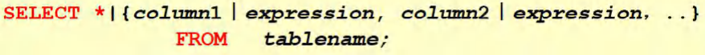

# MySql入门准备


##  MySql安装配置

1. 下载Mysql5.7

2. 解压到D:/.... (路径不要出现中文和空格)

3. 将MySql的路径添加到用户环境变量下

4. MySql的指令全部都在bin目录下

5. 在 D:\ . . . . . .\mysql-5.7.19-winx64目录下下创建 my.int文件

   文件内容如下

   ```apl
   [client]
   port=3306
   default-character-set=utf8
   [mysqld]
   #设置为自己 MYSQL的安装目录
   basedir=D:\. . .\mysql-5.7.19-winx64
   #设置为MYSQL的数据目录
   datadir=D:\. . .\mysql-5.7.19-winx64\data\
   port=3306
   character_set_server=utf8
   #跳过安全检查,注销后,需要输入正确的用户名和密码
   skip-grant-tables
   ```

   

6. 使用==管理员身份==打开cmd，并切换到D:\ . . . \ysqImysql-5.7.19-winx64\bin目录下

   ```apl
   执行: mysqld -install
   ```

   

7. 初始化数据库:

    

   ```apl
   执行: mysqld --initialize-insecure --user=mysql
   
   // 如果执行成功，会生成 data目录:(data里面会有3个文件夹，以后安装的数据库都会安装在data里面)
   ```

   

8. 进入MySql管理终端:

   ```apl
   执行: mysql -u root -p
   // 【当前root 用户密码为空/root】
   ```

   

9. 修改root 用户密码并退出服务

   ```apl
   执行: use mysql;
   执行: update user set authentication_string=password('密码') where user='root' and Host='localhost';
   // 注意:在后面需要带分号，回车即可执行该指令;
   // 且该命令重启之后会执行
   
   执行: flush privileges;
   // 刷新权限
   
   执行: quit; 
   // 退出mysql命令行
   
   执行: net stop mysql 
   // 退出MySql服务
   ```

   

10. 修改my.ini

    ```apl
    在该文件中
    skip-grant-tables 前面 + #
    
    //再次进入就会进行权限验证了
    ```

11. 启动MySql服务并使用密码登录

    ```apl
    执行: net start mysql
    //启动MySql服务
    
    执行: mysql -u root -p
    //输入密码登录
    ```

12. ```apl
    如果配置失败，需要
    执行: sc delete mysql
    //删除已经安装好的mysql,如果数据库有重要数据，备份后再删除
    
    重新安装
    ```

    

## 使用端口连接MySql

1. 管理员身份进入命令行

2. 启动MySql服务

3. 连接数据库

   ```apl
   执行: mysql -h主机名 -P端口 -u用户名 -p密码
   
   //只要是一个服务往往都要监听一个端口
   ```

4. 


## 理解数据库三层结构

```apl
1. 所谓安装Mysql数据库，就是在主机安装一个数据库管理系统(DBMS)，
   这个管理程序可以管理多个数据库。DBMS(database manage system)
   
2. 个数据库中可以创建多个表,以保存数据(信息)。

3. 数据库管理系统(DBMS)、数据库和表的关系如图所示:示意图
```


## 数据库中数据存储方式


## SQL 语句分类

```apl
# 1. DDL: 数据定义语句[create表，库...]

# 2. DML: 数据操作语句[增加insert,修改update，删除 delete]

# 3. DQL: 数据查询语句[select ]

# 4. DCL: 数据控制语句[管理数据库: 比如用户权限grant revoke ]
```

# 操作数据库-入门

## 创建数据库

### 方法


```apl
1. CHARACTER SET: 
   指定数据库采用的字符集，如果不指定字符集，默认utf8
2. COLLATE:
   指定数据库字符集的校对规则
   (常用的utf8_bin[区分大小写]、utf8 general_ci[不区分大小写])
   ('注意:'默认是utf8_general_ci)
```


### 实例

```apl
练习;
    1. 创建一个名称为Novice_db01的数据库。[图形化和指令演示]
    2. 创建一个使用utf8字符集的Novice_db02数据库
    3. 创建一个使用utf8字符集，并带校对规则的Novice_db03数据库
```


```mysql
#创建一个名称为 Novice_db01 的数据库。[图形化和指令 演示]

#使用指令创建数据库
    CREATE DATABASE Novice_db01
    
#删除数据库指令
    DROP DATABASE Novice_db01
```


```mysql
# 校对规则 utf8_bin 区分大小 默认 utf8_general_ci 不区分大小写
# 创建一个使用 utf8 字符集的 Novice_db02 数据库，默认校对规则 utf8_general_ci
    CREATE DATABASE Novice_db02 CHARACTER SET utf8

# 下面是一条查询的 sql , select 查询 * 表示所有字段 FROM 从哪个表
# WHERE 从哪个字段 NAME = 'tom' 查询名字是 tom
    SELECT * FROM t1 WHERE NAME = 'tom'
```


```mysql
# 校对规则 utf8_bin 区分大小 默认 utf8_general_ci 不区分大小写
# 创建一个使用 utf8 字符集，并带校对规则的 hsp_db03 数据库
	CREATE DATABASE Novice_db03 CHARACTER SET utf8 COLLATE utf8_bin

	SELECT * FROM t1 WHERE NAME = 'tom'
```


## 查看、删除数据库

### 方法


### 实例

```apl
1.查看当前数据库服务器中的所有数据库
2.查看前面创建的hsp db01数据库的定义信息
3.删除前面创建的hsp_db01数据库
```

```mysql
#演示删除和查询数据库

#查看当前数据库服务器中的所有数据库
SHOW DATABASES 
#查看前面创建的Novice_db01数据库的定义信息
SHOW CREATE DATABASE Novice_db01

#老师说明在创建数据库，表的时候，为了规避关键字，可以使用反引号解决
CREATE DATABASE `Novice_db01`
#删除前面创建的Novice_db02数据库
DROP DATABASE Novice_db01
```

## 备份恢复数据库

### 方法

```apl
1. 备份数据库(注意:在DOS执行)'命令行'
#  mysqldump -u 用户名 -p -B 数据库1 数据库2 数据库n >文件名.sql

2. 恢复数据库(注意:进入'Mysql命令行'再执行)
   Source文件名.sql
```

### 实例

```apl
练习: database03.sql备份xxx1和xxx2库中的数据，并恢复
```

```mysql
#再将 xxx 整个数据库备份到你的 d:\\xxx.sql 到 dos 下 :
mysqldump -u root -p -B xxx1 xxx2 > d:\\xxx.sql
```

```mysql
#将 mysql 的 xxx 数据库删除, 并通过备份的 d:\\xxx.sql 恢复
DROP DATABASE xxx
#进入 mysql 命令行
source d:\\xxx.sql

# 或者是在GUI软件中进行复制并执行
```

## Mysql表-入门

### 方法


### 实例

```mysql
#注意:  db02创建表时，要根据需保存的数据创建相应的列，并根据数据的类型定义相应的列类型。
#id		    整形
#name		字符串
#password	字符串
#birthday	日期

CREATE TABLE `user`(
	id INT,
	`name` VARCHAR(255),
	passward VARCHAR(32),
	birthday DATE)
	CHARACTER SET utf8 COLLATE utf8_bin ENGINE INNODB 
```


# Mysql 常用数据类型

## 图示

(列类型)


## 数值型(整数)

### 图示


### 实例

```mysql
#演示整型的是一个
#使用tinyint 来演示范围有符号-128 ~127如果没有符号 0-255
#说明:表的字符集，校验规则，存储引擎，老师使用默认
#1．如果没有指定unsinged ,则TINYINT就是有符号
#2．如果指定unsinged ,则TINYINT就是无符号0-255
CREATE TABLE t3(	# table是表的意思
    id TINYINT);
    
CREATE TABLE t4(
    id TINYINT UNSIGNED);
    
INSERT t3 VALUES(-129); # wrong
INSERT t3 VALUES(-128); # ok
INSERT t3 VALUES(128);  # weong
INSERT t3 VALUES(127);  # ok

INSERT t4 VALUES(-1);  # wrong
INSERT t4 VALUES(0);   # ok
INSERT t4 VALUES(256); # wrong
INSERT t4 VALUES(255); # ok

SELECT * FROM t3;
SELECT * FROM t4;
DELETE FROM t4 WHERE id = 255;
```


## 数值型(bit)

### 方法

```apl
1. bit字段显示时,按照二进制'位'的方式显示.

2. 查询的时候仍然可以用使用添加的数值

3. 如果一个值只有 0,1 可以考虑使用bit(1),可以节约空间位类型。

4. M指定位数，默认值1，范围1-64

5. 使用不多.
```

### 实例

```mysql
#演示bit类型使用
#说明
#1. bit(m) m在1-64
#2．添加数据范围按照你给的位数来确定，比如m = 8表示一个字节0~255
#3．显示按照bit
#4．查询时,仍然可以按照数来查询
CREATE TABLE t5
	(
        num BIT(8)
     );

INSERT INTO t5 VALUES(1);   # ok
INSERT INTO t5 VALUES(5);   # ok 
INSERT INTO t5 VALUES(255); # ok
INSERT INTO t5 VALUES(256); # wrong

SELECT * FROM t5; # 显示按照bit
SELECT * FROM t5 WHERE num = 255;
```

## 数值型(小数)

### 方法

```apl
1. FLOAT [UNSIGNED] Float单精度

2. DOUBLE [UNSIGNED]  Double双精度
  
2. DECIMAL[M,D] [UNSIGNED]	  # 可以支持更加精确的小数位。
	# M是小数位数(精度)的总数，D是小数点(标度)后面的位数。
    # 如果D是0，则值没有小数点或分数部分。
    # M最大65。D最大是30。
    # 如果D被省略，默认是0。
    # 如果M被省略,默认是10。
    # 且D <= M
    # 建议:如果希望小数的精度高，推荐使用decimal
```

### 实例


```mysql
#演示decimal类型、f1oat、 double使用
#创建表
CREATE TABLE t6(
	num1 FLOAT,
	num2 DOUBLE,
	num3 DECIMAL(35,30));
#添加数据
INSERT INTO t6 VALUES(12.49898897,125.1646784316797979
		,12.5887787897797978946466464558);
		
INSERT INTO t6 VALUES(12.49898897,125.1646784316797979
		,12.588778789779);
SELECT * FROM t6;		
```


```mysql
#创建表
CREATE TABLE t7(
	num4 DECIMAL(65)); #D=65 M=0
#添加数据
INSERT INTO t7 VALUES(46468618864131335487974615315484864);# ok	
SELECT * FROM t7;
```


```mysql
#创建表
CREATE TABLE t8(
	num5 BIGINT )); # BIGINT
#添加数据
INSERT INTO t8 VALUES(46468618864131335487974615315484864);# worng
SELECT * FROM t8;
# BIGINT是8个字节 此处超出范围
```


## 字符串


### 前置知识

#### 1.bit（比特）

```apl
bit也就是我们不一定听说过的比特，大名鼎鼎的比特币就是以此命名的。它的简写为小写字母 “b” 。

作为信息技术的最基本存储单元，因为比特实在太小了，所以大家生活中并不是经常听到。那么 bit 是什么呢？

电脑是以二进制存储以及发送接收数据的。二进制的一位，就叫做 1 bit。也就是说 bit 的含义就是二进制数中的一个数位，即 “0” 或者 "1"。
```


#### 2.Byte（字节）

```apl
Byte 是字节的英文写法。它的简写为大写字母 “B"。

既然名字叫字节，那肯定跟字符有关系。是的。英文字符通常是一个字节，也就是 1B，中文字符通常是两个字节，也就是 2B。

字节 Byte 和比特 bit 的换算关系是 1 Byte = 8 bit 。
```

### 方法

```apl
1. CHAR(size)
  固定长度字符串最大255字符
  # 固定长度指的是，长度一旦确定就不能再改变

2. VARCHAR(size) 0~65535 # 这里显示的大小是字节，但是编写代码时，填入的是字符的个数
   可变长度字符串最大65532字节【utf8编码最大21844字符1-3个字节用于记录大小】
```

### 实例

```mysql
#演示字符串类型使用char varchar
#注释的快捷键shift+ctrl+c ，注销注释 shift+ctrl+r--CHAR(size)
-- 固定长度字符串最大255字符   
-- 固定长度指的是，长度一旦确定就不能再改变

-- VARCHAR(size)0~65535字节    
-- 这里显示的大小是字节，但是编写代码时，填入的是字符的个数
-- 根据使用的编码规则的不同，可以填入的最大字符的个数经过计算也不相同

-- 可变长度字符串最大65532字节【utf8编码最大21844字符1-3个字节用于记录大小】
-- 如果表的编码是utf8 varchar(size) size =(65535-3)/ 3 = 21844
-- 如果表的编码是 gbk varchar(size) size =(65535-3)/ 2= 32766


CREATE TABLE t9(
	`name` CHAR(256))# wrong
	
CREATE TABLE t9(
	`name` CHAR(255))# ok


CREATE TABLE t10(
	`name` VARCHAR(21845))# wrong
	
CREATE TABLE t10(
	`name` VARCHAR(12844))# ok
	
	
	
CREATE TABLE t11(
	`name` VARCHAR(32766)) CHARSET gbk# ok
```

### 使用细节

#### 细节1

```apl
char(4)	
//这个4表示字符数(char最大255)，不是字节数,不管是中文还是字母都是放四个,按字符计算。

varchar(4)
//这个4表示字符数，不管是字母还是中文都以定义好的表的编码来存放数据不管是中文还是英文字母，都是最多存放4个，是按照字符来存放的.
```

#### 细节2

```apl
char(4)
//是定长(固定的大小)
//就是说，即使你插入'aa'，也会占用分配的4个字符的空间.

varchar(4)
//是变长(变化的大小)
//就是说，如果你插入了'aa',实际占用空间大小并不是4个字符，而是按照实际占用空间来分配
(说明: varchar本身还需要占用1-3个字节来记录存放内容长度)
```

#### 细节3

```apl
# 什么时候使用char,什么时候使用varchar?
  1.如果数据是定长，推荐使用char,比如md5的密码,邮编，手机号，身份证号码等. char(32)
  2.如果一个字段的长度是不确定，我们使用varchar,比如留言,文章
  
  数据长度大致相同时 查询速度: char > varchar
```

#### 细节4

```apl
在存放文本时，也可以使用Text数据类型.可以将TEXT列视为VARCHAR列,

注意:Text不能有默认值,大小 O~2416 字节

如果希望存放更多字符:
可以选择'MEDIUMTEXT' O-2^24 或者 'LONGTEXT' 0~2432
```

#### 实例

```mysql
#演示字符串类型的使用细节
#char(4) 和 varchar(4) 这个 4 表示的是字符，而不是字节, 不区分字符是汉字还是字母
CREATE TABLE t12(
	name1 CHAR(4),
	name2 VARCHAR(4));

INSERT INTO t12 VALUES('你好呀呀','你好呀呀');# ok
INSERT INTO t12 VALUES('你好呀呀a','你好呀呀');# wrong
SELECT * FROM t12;
```


```mysql
# 如果 varchar 不够用，可以考试使用 mediumtext 或者 longtext
# 如果想简单点，可以使用直接使用 text
CREATE TABLE t13(
	content TEXT,	# 都没有加上括号
	content1 MEDIUMTEXT,
	content2 LONGTEXT); 

INSERT INTO t13 VALUES('abcdefg','hijklmn','pqrst');
SELECT * FROM t13
```


## 日期类型

### 方法

```mysql
CREATE TABLE birthday6(
	t1 DATE, 
	t2 DATETIME,
	t3 TIMESTAMP --时间戳
    	NOT NULL DEFAULT CURRENT TIMESTAMP 
    		ON UPDATE CURRENT_TIMESTAMP ) ; timestamp时间戳
			
mysqI> INSERT INTO birthday (t1,t2) VALUES('2022-11-11',2022-11-11 10:10:10');
```

```apl
日期类型的细节说明
TimeStamp在Insert和update时，自动更新
```

### 实例

```mysql
#演示时间相关的类型
#创建一张表, date , datetime , timestamp

CREATE TABLE t14(
	t1 DATE,
	t2 DATETIME,
	t3 TIMESTAMP
	   NOT NULL DEFAULT CURRENT_TIMESTAMP
	      ON UPDATE CURRENT_TIMESTAMP);
	      -- 登录时间, 如果希望 login_time 列自动更新, 需要配置

SELECT * FROM t14;
INSERT INTO t14(t1,t2) VALUES('2022-1-1','2011-1-1 06:15:12');
```


# MySql表-入门实例

## 创建表


### 实例

```mysql
CREATE TABLE t15(
	id INT,
	NAME VARCHAR(255),
	sex CHAR(1),
	birthday DATE,
	entry_date DATE,
	job VARCHAR(255),
	Salary DOUBLE,
	`resume` TEXT);
	
INSERT INTO t15 VALUES(100, '小妖怪', '男', '2000-11-11',
'2010-11-10 11:11:11', '巡山的', 3000, '大王叫我来巡山');	

SELECT * FROM t15;
```


## 修改表

### 方法

#### 1. 添加列

#### 2. 修改列

#### 3. 删除列


### 实例

```apl
1. 员工表emp的上增加一个image列,varchar类型(要求在resume后面)
2. 修改job列，使其长度为60。
3. 删除sex列。
4. 表名改为employee。
5. 修改表的字符集为utf8
6. 列名name修改为user_name
	# alter table user change column name username varchar(20);
```

```mysql
CREATE TABLE t15(
	id INT,
	NAME VARCHAR(255),
	sex CHAR(1),
	birthday DATE,
	entry_date DATE,
	job VARCHAR(255),
	Salary DOUBLE,
	`resume` TEXT);
	
INSERT INTO t15 VALUES(100, '小妖怪', '男', '2000-11-11',
'2010-11-10 11:11:11', '巡山的', 3000, '大王叫我来巡山');	

SELECT * FROM t15;

	
-- 员工表id的上增加一个image列，varchar类型(要求在resume后面)
ALTER TABLE t15 
	ADD image VARCHAR(32) NOT NULL DEFAULT '' 
	AFTER id

-- 查看表的所有列	
DESC t15 

-- 修改job列,使其长度为60
ALTER TABLE t15
	MODIFY job VARCHAR(60) NOT NULL DEFAULT ''
	
-- 删除sex列
ALTER TABLE t15
	DROP sex
	
-- 表名改为employee
RENAME TABLE  employee TO t15

-- 修改表的字符集为utf8
ALTER TABLE t15
	CHARACTER SET utf8
	
-- 列名name修改为user name
ALTER TABLE t15
	CHANGE `name` `user_name` VARCHAR(32) NOT NULL DEFAULT ''

DESC t15
```


# 数据库C,R,U,D语句

C [ create ]

R [ read ] - select

U [ update ]

D [ delete ]

```apl
1. Insert语句	(添加数据)
2. Update语句	(更新数据)
3. Delete语句	(删除数据)
4. Select语句	(查找数据)
```

## Insert 语句

### 方法


### 实例

```apl
快速入门案例:

1．创建一张商品表
	goods (id int , goods_namevarchar(10), price double );
2.  添加2条记录
```

```mysql
#练习 insert 语句
-- 创建一张商品表 
-- goods (id int , goods_name varchar(10), price double ); 

-- 添加 2 条记录

CREATE TABLE t16(
	id INT,
	goods_name VARCHAR(10),
	price DOUBLE);
	
-- 添加数据
INSERT INTO t16 (id,goods_name,price) 
	VALUES(10, '华为手机', 2000);
INSERT INTO t16 (id,goods_name,price) 
	VALUES(20, '苹果手机', 3000);
	
SELECT * FROM t16


CREATE TABLE t_16(
	id INT,
	goods_name VARCHAR(10),
	price DOUBLE NOT NULL DEFAULT 100);

SELECT * FROM t_16
DESC t_16
```


### 使用细节

```mysql
#说明insert语句的细节

-- 1.插入的数据应与字段的数据类型相同。
--   比如把'abc’添加到INT类型会错误
INSERT INTO t16(id,goods_name,price)
	VALUES(12, '华为手机', 2000);# ok
INSERT INTO t16(id,goods_name,price)
	VALUES('12', '华为手机', 2000);# ok mysql底层会尝试着把字符串转化成整型
INSERT INTO t16(id,goods_name,price)
	VALUES('abc', '华为手机', 2000);# wrong 前提是可以转换成整型
	
-- 2.数据的长度应在列的规定范围内，
--   例如:不能将一个长度为8O的字符串加入到长度为40的列中。
INSERT INTO t16(id,goods_name,price) -- goods_name的长度是10，下面的字段插入是错误的
	VALUES(12, '华为手机华为手机华为手机', 2000);

-- 3.在values中列出的数据位置必须与被加入的列的排列位置相对应。
INSERT INTO t16(id,goods_name,price)
	VALUES('华为手机',12, 2000);# wrong
INSERT INTO t16(goods_name,id,price)# ok,字段换了位置，那么填充内容也要更换位置
	VALUES('华为手机',12, 2000);	

-- 4.字符和日期型数据应包含在单引号中。
INSERT INTO t16(id,goods_name,price)
	VALUES(12, 华为手机, 2000); # wrong

-- 5.列可以插入空值[前提是该字段允许为空]，insert INTO TABLE VALUE(NULL)
INSERT INTO t16(id,goods_name,price)
	VALUES(12, '华为手机', NULL);
	# 如果之前没有设定不可以插入空值，那么是可以成功的

-- 6.INSERT INTO tab_name(列名..)VALUES ()，()，)形式添加多条记录
INSERT INTO t16(id,goods_name,price)
	VALUES
		(12, '华为手机', 2000),
		(12, '华为手机', 2000);

-- 7.如果是给表中的所有字段添加数据，可以不写前面的字段名称
INSERT INTO t16 VALUES
		(13, '华为手机', 2000),
		(13, '华为手机', 2000);
		
-- 8.默认值的使用，当不给某个字段值时，如果有默认值就会添加，否则报错
	-- 如果某个列没有指定not null,那么当添加数据时，没有给定值，则会默认给null
	-- 如果我们希望指定某个列的默认值，可以在创建表时指定，例如not null default 100
INSERT INTO t16(id,goods_name) # price 没有写not null 所以此处会为其添加null
	VALUES(12, '华为手机')
	
SELECT * FROM t16
```


## update语句

### 方法


### 实例

```apl
要求:
在上面创建的employee表中修改表中的纪录

1. 将所有员工薪水修改为5000元。
2. 将姓名为小妖怪的员工薪水修改为3000元。3.将老妖怪的薪水在原有基础上增加1000元。
```

```mysql
-- 演示update语句
RENAME TABLE t15 TO employee
-- 要求:在上面创建的employee表中修改表中的纪录

-- 1.将所有员工薪水修改为5000元。
UPDATE  employee  # 此处不加TABLE
	SET Salary = 5000 # 因为此处没有写where，相当于对所有的员工进行修改
	
-- 2.将姓名为小妖怪的员工薪水修改为3000元。
UPDATE  employee 
	SET Salary = 3000 WHERE user_name = '小妖怪'
	
-- 3.将老妖怪的薪水在原有基础上增加1000元。
INSERT INTO employee 
	VALUES(11,'d:\a.gpg','老妖怪','2000-8-7','2000-8-7','大王',3000,'我叫小妖怪取去巡山')
	
UPDATE employee 
	SET Salary = Salary+1000 
	WHERE user_name = '老妖怪'

-- 可以一次性修改多个字段
UPDATE employee 
	SET Salary = Salary+1000 ,job = '出主意的'
	WHERE image = 'd:\a.gpg'

SELECT * FROM employee
```

### 使用细节

```apl
1. UPDATE语法可以用新值更新原有表行中的各列。
2. SET子句指示要修改哪些列和要给予哪些值。
3. WHERE子句指定应更新哪些行。如没有WHERE子句，则更新所有的行(记录),因此老师提醒一定小心。
4. 如果需要修改多个字段,可以通过set字段1=值1，字段2=值2.….
```


## delete语句

### 方法


### 实例

```apl
1. 删除表中名称为'老妖怪'的记录。
2. 删除表中所有记录。
```

```mysql
INSERT INTO employee
	VALUES(4,'','小妖怪','2000-10-6','2000-11-2','巡山',3000,'来巡山'),
	(5,'','老妖怪','2000-10-6','2000-11-2','巡山',3000,'来巡山')

-- delete语句演示

-- 1. 删除表中id= 3 并且 名称为'老软怪'的记录。
DELETE FROM employee
	WHERE id = 3 AND user_name = '老妖怪';
-- 2. 删除表中所有记录，一定要小心
DELETE FROM employee
	
-- Delete 语句不能删除某一列的值（可使用 update 设为 null 或者 ''）
UPDATE employee 
	SET job = NULL 
	WHERE id = 4 
	AND user_name = '小妖怪'
		
SELECT * FROM employee


-- 之前只是删除的一些记录，如果要删除这个表，使用drop table
DROP TABLE employee 
```

### 使用细节

```apl
1. 如果不使用where子句，将删除表中所有数据。
2. Delete语句不能删除某一列的值(可使用update 设为null或者'')
3. 使用delete语句仅删除记录,不删除表本身。如要删除表，使用droptable语句。
   # drop table表名;
```

# 入门-单表查询

## select语句 查询


### 方法


### 注意事项

```apl
1. Select 指定查询哪些列的数据。
2. column指定列名。
3. * 号代表查询所有列。
4. From指定查询哪张表。
5. DISTINCT可选，指显示结果时，是否去掉重复数据
```

### 实例

```apl
1. 查询表中所有学生的信息。
2. 查询表中所有学生的姓名和对应的英语成绩。
3. 过滤表中重复数据 distinct .
4. 要查询的记录,，每个字段都相同，才会去重
```

```mysql
CREATE TABLE student(
	id INT NOT NULL DEFAULT 1,
	`name` VARCHAR(20) NOT NULL DEFAULT '',
	chinese FLOAT NOT NULL DEFAULT 0.0,
	english FLOAT NOT NULL DEFAULT 0.0,
	math FLOAT NOT NULL DEFAULT 0.0)

INSERT INTO student VALUES
	(1,'小明',89,78,90),
	(2,'小红',67,98,56),
	(3,'小华',87,78,77),
	(4,'小李',88,98,90),
	(5,'小张',82,84,67),
	(6,'小王',55,85,45),
	(7,'小徐',75,65,30)
SELECT * FROM student

-- 1. 查询表中所有学生的信息。
SELECT * FROM student

-- 2. 查询表中所有学生的姓名和对应的英语成绩。
SELECT `name`,english FROM student
SELECT `name` english FROM student

-- 3. 过滤表中重复数据distinct 。
SELECT english FROM student
SELECT DISTINCT english FROM student

-- 4. 要查询的记录,每个字段都相同,才会去重
SELECT DISTINCT `name`, english FROM student
```


## 简单表达式 查询

### 方法



###  as 语句


### 实例

```apl
1．统计每个学生的总分
2、在所有学生总分加10分的情况
3．使用别名表示学生分数。
```

```mysql
-- select 语句的使用

-- 1. 统计每个学生的总分
SELECT `name`,(chinese+english+math) FROM student

-- 2. 在所有学生总分加10分的情况
SELECT `name`,(chinese+english+math+10) FROM student
-- 3. 使用别名表示学生分数。
SELECT `name`,(chinese+english+math)AS total_sorce FROM student
```


## where 过滤 查询


### 常用运算符


<>也是不等于的意思


### 入门的实例

```mysql
-- select 语句

-- 查询姓名为赵云的学生成绩
SELECT id,`name` ,chinese,english,math FROM student 
	WHERE `name` = '小李'
	
SELECT * FROM student 
	WHERE `name` = '小李'
	
-- 查询英语成绩大于90分的同学
SELECT * FROM student 
	WHERE english > 80
	
-- 查询总分大于200分的所有同学
SELECT * FROM student 
	WHERE (chinese+english+math) > 200
	
```

### 练习实例1

```apl
1. 查询math大于 60 并且(and) id大于 4 的学生成绩
2. 查询英语成绩大于语文成绩的同学
3. 查询总分大于200分并且数学成绩小于语文成绩,名字以红结尾的学生..
```

```mysql
-- 查询math大于60 并且(and) id大于4的学生成绩
SELECT * FROM student 
	WHERE math>60 AND id>4
	
-- 查询英语成绩大于语文成绩的同学
SELECT * FROM student 
	WHERE english>chinese
	
-- 查询总分大于200分并且数学成绩小于语文成绩,名字以红结尾的学生.
-- %红，表示名字以红结尾的就可以
SELECT * FROM student 
	WHERE (chinese+english+math) > 200 
	AND math<chinese AND `name` LIKE '%红'
```


### 练习实例2

```apl
1. 查询英语分数在80-90之间的同学。
2. 查询数学分数为89,90,91的同学。
3. 查询所有名字以李结尾的学生成绩。
4. 查询数学分>80，语文分>80的同学。
```

```mysql
-- 1. 查询英语分数在80—90之间的同学。
SELECT * FROM student 
	WHERE english >=80 AND english =< 90

SELECT * FROM student 
	WHERE english BETWEEN 80 AND 90  # between .. and ..是闭区间

	
-- 2. 查询数学分数为89,90,91的同学。
SELECT * FROM student 
	WHERE math = 89 OR math = 90 OR math =91
	
SELECT * FROM student 
	WHERE math IN (89,90,91) # IN(100,200)
	
-- 3. 查询所有名字以李结尾的学生成绩。
SELECT * FROM student 
	WHERE `name` LIKE '%李'
	
-- 4. 查询数学分>80，语文分>80的同学
SELECT * FROM student 
	WHERE math >80 AND chinese >80
```

## order by 排序 查询

### 方法


```apl
1. Order by 指定排序的列，排序的列既可以是表中的列名，也可以是select语句后指定的列名(别名)。
2. Asc升序[默认]、Desc降序
3. ORDER BY子句应位于SELECT语句的结尾。
```

### 实例

```apl
1. 对数学成绩排序后输出【升序】。ESC
2. 对总分按从高到低的顺序输出【降序】DESC
3. 对以'小'字开头的学生成绩排序输出【升序】
```

```mysql
-- 演示order by使用
-- 1. 对数学成绩排序后输出【升序】 ASC
SELECT `name` AS `名字`,math AS `数学` FROM student
	ORDER BY `数学` 

-- 2. 对总分按从高到低的顺序输出【降序】 DESC
SELECT `name` ,(chinese+english+math) AS total FROM student
	ORDER BY total DESC
	
-- 3. 对姓李的学生成绩排序输出(升序)
SELECT * ,(chinese+english+math) AS total FROM student
	WHERE `name` LIKE '小%'
	ORDER BY (chinese+english+math)
```

# 函数合集

## 合计/统计函数

### count

#### 方法


需要统计多列，那么要用 | 将count()给隔离开

#### 实例

```apl
1. 统计一个班级共有多少学生?
2. 统计数学成绩大于90的学生有多少个?
3. 统计总分大于250的人数有多少?
4. count(*)和count(列)的区别
```

```mysql
-- 演示mysql的统计函数的使用

-- 1. 统计一个班级共有多少学生?
SELECT COUNT(*) FROM student

-- 2.  统计数学成绩大于90的学生有多少个?
SELECT COUNT(*) FROM student
	WHERE math>80
	
-- 3. 统计总分大于250的人数有多少?
SELECT COUNT(*) FROM student
	WHERE (chinese+english+math) >250
-- select count(*)|(chinese+english+math) as total from student
-- where total > 150
-- order by total desc  -- wrong


-- 4. count(*)和count(列)的区别
-- 解释:count(*)返回满足条件的记录的行数
-- cout(列):统计满足条件的某列有多少个，但是会排除为null

CREATE TABLE t17(
	`name` VARCHAR(255))
INSERT INTO t17 VALUES
	('tom'),('jack'),('marry'),(NULL)
	
SELECT * FROM t17
SELECT COUNT(*) FROM t17 -- 4
SELECT COUNT(`name`) FROM t17 -- 3
# 如果传入的是count(*),那么有多少行就返回多少行
# 如果传入的是count(id),那么就返回非空的多少行
```


### sum

#### 方法


```apl
Sum函数返回满足where条件的行的和，一般使用在数值列

注意: sum仅对数值起作用。
注意: 对多列求和，","号不能少。
```


#### 实例

```apl
1. 统计一个班级数学总成绩?
2. 统计一个班级语文、英语、数学各科的总成绩
3. 统计一个班级语文、英语、数学的成绩总和
4. 统计一个班级语文成绩平均分
```

```mysql
-- 演示sum函数的使用
-- 1. 统计一个班级数学总成绩?
SELECT SUM(math) FROM student

-- 2. 统计一个班级语文、英语、数学各科的总成绩
SELECT SUM(chinese),SUM(english),SUM(math)FROM student

-- 3. 统计一个班级语文、英语、数学的成绩总和
SELECT SUM(chinese+english+math)AS Ttotal FROM student

-- 4. 统计一个班级语文成绩平均分
SELECT SUM(chinese)/COUNT(chinese) AS `avg`FROM student
```


### avg

#### 方法


```apl
AVG函数返回满足where条件的一列的平均值
```

#### 实例

```apl
1. 求一个班级数学平均分?
2. 求一个班级总分平均
```

```mysql
-- 演示avg的使用--练习:

-- 1. 求一个班级数学平均分?
SELECT AVG(math) FROM student

-- 2. 求一个班级总分平均分
SELECT AVG(math),AVG(chinese),AVG(english),
	AVG(math+chinese+english) AS total FROM student
```


### max/min

#### 方法


```apl
Max/min函数返回满足where条件的一列的最大/最小值
```

#### 实例

```apl
1. 求班级最高分和最低分（数值范围在统计中特别有用)
```

```mysql
-- 演示max和min的使用
-- 1. 求班级最高分和最低分（数值范围在统计中特别有用)
 SELECT MAX(math)AS high,MIN(math)AS low FROM student 
```

## 分组过滤函数


### group by 子句对列分组


### having 子句对分组后过滤


```apl
# 演示group by + having
# GROUP by用于对查询的结果分组统计，(示意图)
# having子句用于限制分组显示结果．
-- 1. 如何显示每个部门的平均工资和最高工资？
-- 2. 显示每个部门的每种岗位的平均工资和最低工资？
-- 3. 显示平均工资低于2000的部门号和它的平均工资？//别名
```

```apl
group by : 对数据进行分组
group by ... having ... : 分组并对分组进行过滤
```

### 实例

#### 创建部门表dept

```mysql
CREATE TABLE dept
(
deptno MEDIUMINT  UNSIGNED NOT NULL DEFAULT 0,
dname VARCHAR(20) NOT NULL DEFAULT '',
loc VARCHAR(13) NOT NULL DEFAULT ''
)；

INSERT INTO dept VALUES
(10,'ACCOUNTNG','NEW YORK'),
(20,'RESEARCH','DALLAS'),
(30,'SALES','CHICAGO'),
(40,'OPERAATIONS','BOSTON')

SELECT * FROM dept
```


#### 创建员工表emp

```mysql
-- 员工表
CREATE TABLE emp(
empon MEDIUMINT UNSIGNED NOT NULL DEFAULT 0,#编号
ename VARCHAR(20) NOT NULL DEFAULT '',#名字
job VARCHAR(9) NOT NULL DEFAULT '',#工作
mgr MEDIUMINT UNSIGNED ,#上级编号
hiredate DATE NOT NULL,#入职时间
sal DECIMAL (7,2) NOT NULL,#薪水
comm DECIMAL(7,2),#红利
deptno MEDIUMINT UNSIGNED NOT NULL DEFAULT 0);#部门编号
-- 插入信息
INSERT INTO emp VALUES
#(7369,'SMITH','CLERK',7902,'1990-12-17',800.00,NULL,20),
#(7499,'ALLEN','SALESMAN',7698,'1991-2-20',1600.00,300.00,30),
(7521,'WARD','SALESMAN',7698,'1991-2-22 ',1250.00,500.00,30),
(7566,'JONES','MANAGER',7839,'1991-4-2',2975.00,NULL,20),
(7654,'MARTIN','SALESMAN',7698,'1991-9-28',1250.00,1400.00,30),
(7698,'BLAKE','MANAGER',7839,'1991-5-1',2850.00,NULL,30),
(7782,'CLARK','MANAGER',7839,'1991-6-9',2450.00,NULL,10),
(7788,'SCOTT ','ANALYST',7566,'1997-4-19',3000.00,NULL,20),
(7839,'KING','PRESIDENT',NULL,'1991-11-17',5000.00,NULL,10),
(7844,'TURNER','SALESMAN',7698,'1991-9-8',1500.00,NULL,30),
(7900,'JAMES ','CLERK',7698,'1991-12-3',950.00,NULL,30),
(7902,'FORD','ANALYST ',7566,'1991-12-3',3000.00,NULL,20),
(7934,'MILLER','CLERK',7782,'1992-1-23',1300.00,NULL,10)

SELECT * FROM emp
```


#### 创建工资级别表sal_grade

```mysql
-- 工资级别
#工资级别表
CREATE TABLE sal_grade
(
grade MEDIUMINT NOT NULL DEFAULT 0,#工资级别
losal DECIMAL(17,2) NOT NULL,#该级别的最低工资
hisal DECIMAL(17,2) NOT NULL#该级别的最高工资
);
INSERT INTO sal_grade VALUES
(1,700,1200),(2,1201,1400),
(3,1401,2000),(4,2001,3000),(5,3001,9999)

SELECT * FROM sal_grade
```


#### 最终Test

```mysql
# 演示group by + having
# GROUP by用于对查询的结果分组统计，(示意图)
# having子句用于限制分组显示结果．
```

```mysql
-- 1. 如何显示每个部门的平均工资和最高工资？
-- 分析: avg(sal) max(sal)
-- 按照部分来分组查询
SELECT AVG(sal) , MAX(sal), MIN(sal) FROM emp
    GROUP BY deptno
-- 使用数学方法，对小数点进行处理
SELECT FORMAT(AVG(sal),2) , MAX(sal), MIN(sal) FROM emp
    GROUP BY deptno
```


```mysql
-- 2. 显示每个部门的每种岗位的平均工资和最低工资？
-- 分析 
-- 1. 显示每个部门的平均工资和最低工资
-- 2. 显示每个部门的每种岗位的平均工资和最低工资
SELECT AVG(sal), MAX(sal) , deptno ,job FROM emp
    GROUP BY deptno,job
```


```mysql
-- 3. 显示平均工资低于2000的部门号和它的平均工资？//别名
-- 分析 
-- [写 sql 语句的思路是化繁为简,各个击破]
-- 1. 显示各个部门的平均工资和部门号
-- 2. 在 1 的结果基础上，进行过滤，保留 AVG(sal) < 2000
-- 3. 使用别名进行过滤
SELECT AVG(sal) AS Asal, deptno FROM emp
    GROUP BY deptno
    	HAVING Asal < 2000
```


## 字符串相关函数

### 方法

```apl
1. CHARSET(str)		   # 返回字串字符集
2. CONCAT (string2 [,… ])	# 连接字串,将多个列拼接成一列
3. INSTR (string ,substring )	# 返回substring在string中出现的位置,没有返回O
4. UCASE (string2 )	# 转换成大写
5. LCASE (string2 )	# 转换成小写
6. LEFT (string2 ,length)  # 从string2中的左边起取length个字符
7. LENGTH (string )	    # string长度[按照字节]
8. REPLACE(str ,search_str,replace_str )	# 在str中用replace_str替换search_str
9. STRCMP (string1 ,string2 )			   # 逐字符比较两字串大小,
10. SUBSTRING (str , position [,length])	# 从str的position开始【从1开始计算】,取length])个字符
11. LTRIM(string2)	RTRIM (string2)	TRIM(string3)	# 去除左端空格 或 右端空格 或 左右两端
```

### 实例

```mysql
-- 1. CHARSET(str)		       # 返回字串字符集
    SELECT CHARSET(ename) FROM emp

-- 2. CONCAT (string2 [,… ])   # 连接字串
    SELECT * FROM emp
    SELECT CONCAT(ename,'job is: ',job, ' 每月工资: ',sal) 
                        AS '员工情况' FROM emp 
					
-- 3. INSTR (string ,substring )	      # 返回substring在string中出现的位置,没有返回O
    SELECT INSTR('你好呀','好') FROM DUAL  # DUAL是系统的亚元表(系统表)，没有表的时候可以用来做测试

-- 4. UCASE (string2 )	# 转换成大写
    SELECT UCASE(ename) FROM emp

-- 5. LCASE (string2 )	# 转换成小写
    SELECT LCASE(ename) FROM emp

-- 6. LEFT (string2 ,length)   # 从string2中的左边起取length个字符
    SELECT LCASE(LEFT(ename,2)) FROM emp
    SELECT UCASE(RIGHT(ename,2) )FROM emp

-- 7. LENGTH (string )	       # string长度[按照--字节]
    SELECT  LENGTH(ename) FROM emp

-- 8. REPLACE(str ,search_str,replace_str )	       # 在str中用replace_str替换search_str
-- 如果是manager就替换成经理
    SELECT REPLACE(job,'MANAGER','经理') FROM emp  # 出现的只是一个视图，并不会修改原来的表

-- 9. STRCMP (string1 ,string2 )		   # 逐字符比较两字串大小,
    SELECT STRCMP(ename,job) FROM emp
    SELECT STRCMP('abc','ABC') FROM DUAL    # 因为这个表设定的规则是不区分大小写

-- 10. SUBSTRING (str , position [,length])	# 从str的position开始【从1开始计算】,取length])个字符
    SELECT SUBSTRING(ename,2,3) FROM emp

-- 11. LTRIM(string2)	RTRIM (string2)	TRIM(string3)	# 去除左端空格 或 右端空格 或 左右两端
    SELECT LTRIM('   你好    ') FROM DUAL
    SELECT RTRIM('   你好    ') FROM DUAL
    SELECT TRIM('   你好    ') FROM DUAL
```

```mysql
-- 练习: 以首字母小写的方式显示所有员工emp表的姓名
SELECT CONCAT(UCASE(SUBSTRING(ename,1,1)) ,LCASE(SUBSTRING(ename,2)) )AS '名字'FROM emp
SELECT CONCAT(UCASE(LEFT(ename,1)),LCASE(SUBSTRING(ename,2))) AS '名字' FROM emp
```

## 数学相关函数

### 方法

```apl
-- 1. ABS (num)	# 绝对值
-- 2. BIN(decimal number)   # 十进制转二进制
-- 3. HEX(DecimalNumber )	# 十进制转十六进制
-- 4. CONV (number2,from base,to base)进制转换
-- 5. CEILING (number2)    # 向上取整，得到比num2大的最小整数
-- 6. FLOOR (number2 )     # 向下取整,得到比num2小的最大整数
-- 7. FORMAT (NUMBER,decimal _places )	# 保留小数位数(四舍五入)
-- 8. MOD(numerator ,denominator )      # 求余
-- 9. LEAST (number1 , number2,......)	# 求最小值
-- 10. RAND( ) RAND ( [seed])	# 返回随机数   其范围为0 s v ≤ 1.0
```

### 实例

```mysql
    SELECT 10 FROM DUAL -- 10

-- 1. ABS (num)	# 绝对值
    SELECT ABS(-10) FROM DUAL -- 10
```

```mysql
-- 2. BIN(decimal number)  # 十进制转二进制
    SELECT BIN(10) FROM DUAL -- 1010

-- 3. HEX(DecimalNumber )	# 十进制转十六进制
    SELECT HEX(111) FROM DUAL

-- 4. CONV (number2,from base,to base) 进制转换
    SELECT CONV(10,10,2) FROM DUAL
    SELECT CONV(16,16,10) FROM DUAL
```

```mysql
-- 5. CEILING (number2)    # 向上取整，得到比num2大的最小整数
	SELECT CEILING(2.1) FROM DUAL -- 3

-- 6. FLOOR (number2 )     # 向下取整,得到比num2小的最大整数
    SELECT FLOOR(-1.1) FROM DUAL
```

```mysql
-- 7. FORMAT (NUMBER,decimal _places )	# 保留小数位数(四舍五入)
    SELECT FORMAT(1.5562,2) FROM DUAL 

-- 8. MOD(numerator ,denominator ) # 求余
    SELECT MOD(3,2) FROM DUAL  -- (被除数，除数)
```

```mysql
-- 9. LEAST (number1 , number2,......)	# 求最小值
    SELECT LEAST(-1,5,3,2) FROM DUAL

-- 10. RAND( ) RAND ( [seed])	# 返回随机数   其范围为0 s v ≤ 1.0
-- 1.如果使用rand()每次返回不同的随机数，在0≤ v≤ 1.0
-- 2．如果使用rand(seed)返回随机数，范斯o< v S 1.0，如果seed不变，该随机数也不变
    SELECT RAND()FROM DUAL 
    SELECT RAND(6) FROM DUAL 
```

## 时间日期相关函数

### 方法

```apl
-- 1. CURRENT DATE()       # 当前日期 (年月日)
-- 2. CURRENT_TIME()       # 当前时间（时分秒）
-- 3. CURRENT_TIMESTAMP()  # 当前时间戳（年月日+时分秒）

-- 1. DATE (datetime )	# 返回datetime的日期(年月日)部分
-- 2. DATE_ADD (date2,INTERVAL d_value d_type )     # 在date2中加上日期或时间
-- 3. DATE_SUB (date2,INTERVAL d_value d_ type )	# 在date2上减去一个时间
-- 4. Now( )	# 当前时间

-- 1. DATEDIFF (date1 ,date2 )	# 两个日期差(结果是天)
-- 2. TIMEDIFF(date1,date2)	    # 两个时间差(多少小时多少分钟多少秒)

-- 1. YEAR |Month |DAY| DATE(datetime)	# 按指定格式显示

-- 1. UNIX_TIMESTAMP()	# 返回的是1970-1-1 到现在的秒数
-- 2. FROM_UNIXTIME(指定秒数,指定格式)	# 以指定格式返回1970-1-1 到到指定秒数的日期
```


### 第一部分

```apl
-- 1. CURRENT DATE()	# 当前日期(年月日)
-- 2. CURRENT_TIME()	# 当前时间（时分秒）
-- 3. CURRENT_TIMESTAMP()  # 当前时间戳（年月日+时分秒）
```

```mysql
-- 日期时间相关函数
-- 1. CURRENT_DATE()	当前日期(年月日)
    SELECT CURRENT_DATE FROM DUAL
    
-- 2. CURRENT_TIME()	当前时间（时分秒）
    SELECT CURRENT_TIME FROM DUAL
    
-- 3. CURRENT_TIMESTAMP()  当前时间戳（年月日+时分秒）
    SELECT CURRENT_TIMESTAMP FROM DUAL
    
-- 4. NOW()	当前时间戳（年月日+时分秒）
    SELECT NOW() FROM DUAL

    # 以上4种不属于日期类型 
    # time DATETIME -- ok
    # time CURRENT_TIME --wrong
```

### 第二部分

```apl
-- 1. DATE (datetime )	# 返回datetime的日期部分
-- 2. DATE_ADD (date2,INTERVAL d_value d_type )	# 在date2中加上日期或时间
-- 3. DATE_SUB (date2,INTERVAL d_value d_ type )	# 在date2上减去一个时间
-- 4. Now( )	# 当前时间
```

```mysql
-- 创建测试表信息表
    CREATE TABLE mes(
        id INT,
        content VARCHAR(30),
        sendtime DATETIME); 
	
-- 添加一条记录
    INSERT INTO mes VALUES(1,'早间新闻',CURRENT_TIME)
    INSERT INTO mes VALUES(2,'早间新闻',CURRENT_DATE)
    INSERT INTO mes VALUES(3,'早间新闻',CURRENT_TIMESTAMP)
    INSERT INTO mes VALUES(4,'早间新闻',NOW())
    INSERT INTO mes VALUES(4,'早间新闻','2020-1-11')

    SELECT * FROM mes
```

```mysql
-- 应用实例
-- 1. 显示所有留言信息，发布日期只显示日期，不用显示时间.
    SELECT id,content ,DATE(sendtime) FROM mes
    
-- 2. 请查询在10分钟内发布的帖子
    SELECT * FROM mes 
        WHERE DATE_ADD(sendtime,INTERVAL 10 MINUTE) >= NOW();
    SELECT * FROM mes 
        WHERE DATE_SUB(NOW(),INTERVAL 10 MINUTE) <= sendtime;
```

### 第三部分

```apl
-- 1. DATEDIFF (date1 ,date2 )	# 两个日期差(结果是天)
-- 2. TIMEDIFF(date1,date2)	# 两个时间差(多少小时多少分钟多少秒)
```

```mysql
-- 1. 请在mysql 的sql语句中求出 2011-11-11和 1990-1-1相差多少天
    SELECT DATEDIFF('2011-11-11','1990-1-1')/365 FROM DUAL
    
-- 2. 请用mysgl 的sgl语句求出你活了多少天?[练习] 1995-11-11
    SELECT DATEDIFF(NOW(),'1995-11-11')/365 FROM DUAL

-- 3. 如果你能活80岁,求出你还能活多少天.[练习]
  -- 1. 先求出活80岁时，是什么日期x
  -- 2. 然后在使用datediff(x, now() );
    SELECT FORMAT(
        DATEDIFF(DATE_ADD('1995-11-11',INTERVAL 80 YEAR),NOW())/365,2) 
            FROM DUAL 

-- 细节：
    -- INTERVAL 80 YEAR ： YEAR 可以是 年月日，时分秒
    -- '1986-11-11' 可以 date,datetime timestamp

    -- date -> datetime
    -- 1986-11-11 -> 1986-11-11 02:28:50


-- 4. 求时间差
    SELECT TIMEDIFF('10:11:02','05:12:03') FROM DUAL
```

### 第四部分

```apl
-- 1. YEAR |Month |DAY| DATE(datetime)	# 年月日
```

```mysql
-- 1. YEAR |Month |DAY| DATE(datetime)  # 按指定格式显示
    SELECT NOW() FROM DUAL
    SELECT YEAR(NOW()) FROM DUAL
    SELECT MONTH(NOW()) FROM DUAL
    SELECT DAY(NOW()) FROM DUAL
    SELECT YEAR('2021-10-11 02:15:06') FROM DUAL
    SELECT HOUR('2021-10-11 02:15:06') FROM DUAL
    SELECT MINUTE('2021-10-11 02:15:06') FROM DUAL
    SELECT SECOND('2021-10-11 02:15:06') FROM DUAL
```

### 第五部分

```apl
-- 1. UNIX_TIMESTAMP()	# 返回的是1970-1-1 到现在的秒数
-- 2. FROM_UNIXTIME(指定秒数,指定格式)	# 以指定格式返回1970-1-1 到到指定秒数的日期
```

```mysql
-- 1. unix_timestamp ();	# 返回的是1970-1-1 到现在的秒数
    SELECT UNIX_TIMESTAMP() FROM DUAL
    
-- 2. FROM_UNIXTIME();	# 以指定格式返回1970-1-1 到到指定秒数的日期
  -- 可以把一个unix_timestamp秒数，转成指定格式的日期
  -- 意义:在开发中，可以存放一个整数，然后表示时间，通过FROM_UNIXTIME转换
    SELECT FROM_UNIXTIME(UNIX_TIMESTAMP(),'%Y-%m-%d %H:%i:%s') FROM DUAL
    SELECT FROM_UNIXTIME(1212,'%Y-%m-%d %H:%i:%s') FROM DUAL
```

### 总结

```apl
在实际开发中，我们也经常使用int来保存一个unix时间戳，
然后使用from_unixtime()进行转换,还是非常有实用价值的
```


## 加密和系统函数


### 方法

```apl
-- 1. USER()	查询用户
-- 2. DATABASE()	数据库名称
-- 3. MD5(str)	为字符串算出一个MD5 32位的字符串,(用户密码)加密

-- 1. 演示用户表，存放密码时，是 MD5()

-- 1. PASSWORD (str)
-- 2. select * from mysql.user \\从原文密码str计算并返回密码字符串
```

### 实例1

```mysql
-- 1. USER()	查询用户
    SELECT USER()
    SELECT USER() FROM DUAL
-- 2. DATABASE()	数据库名称
    SELECT DATABASE() FROM DUAL
-- 3. MD5(str)	为字符串算出一个MD5 32位的字符串,(用户密码)加密
    SELECT MD5('L') FROM DUAL
```

### 实例2

```mysql
-- 1. 演示用户表，存放密码时，是 MD5()
    CREATE TABLE t18(
        id INT,
        `name` VARCHAR(32) NOT NULL DEFAULT '',
        pwd CHAR(32) NOT NULL DEFAULT '');
-- 2. 设置密码
    INSERT INTO t18 VALUES(10,'小红',MD5('L'))# 'a'是以32位的加密形式存进去的

-- 3. 输入密码
    SELECT * FROM t18 
        WHERE id = 10 AND `name` ='小红'AND pwd = 'L' # wrong
        
    SELECT * FROM t18 
        WHERE id = 10 AND `name` ='小红' AND
            pwd = MD5('L') # ok WHERE处的连接用AND
            
    SELECT * FROM t18
```

### 实例3

```mysql
-- 1. PASSWORD (str)
    SELECT PASSWORD('L') FROM DUAL 

-- 2. select * from mysql.user \G从原文密码str计算并返回密码字符串
  -- 通常用于对mysgl数据库的用户密码加密
  -- mysql.user表示数据库.表
    SELECT * FROM mysql.user
```


# 流程控制语句


## 方法

```apl
# 1. IF(expr1,expr2,expr3) 如果 expr1 为 True ,则返回 expr2 否则返回 expr3
# 2. IFNULL(expr1,expr2) 如果 expr1 不为空 NULL,则返回 expr1,否则返回 expr2

# 3，
-- (SELECT CASE 
-- WHEN expr1 THEN expr2 
-- WHEN expr3 THEN expr4 
-- ELSE expr5 END);  [类似多重分支.]
# 如果 expr1 为 TRUE,则返回 expr2,如果 expr2 为 t, 返回 expr4, 否则返回 expr5
```


## 实例1

```mysql
# 1. IF(expr1,expr2,expr3) 如果 expr1 为 True ,则返回 expr2 否则返回 expr3
    SELECT IF(TRUE,'jack','tom');
    SELECT IF(FALSE,'jack','tom');
# 2. IFNULL(expr1,expr2) 如果 expr1 不为空 NULL,则返回 expr1,否则返回 expr2
    SELECT IFNULL(NULL,'jack');
    SELECT IFNULL('tom','jack');
```

## 实例2

```mysql
-- (SELECT CASE 
-- WHEN expr1 THEN expr2 
-- WHEN expr3 THEN expr4 
-- ELSE expr5 END);  [类似多重分支.]
# 如果 expr1 为 TRUE,则返回 expr2,如果 expr2 为 t, 返回 expr4, 否则返回 expr5
    SELECT
        (SELECT CASE
            WHEN TRUE THEN 'jack'
            WHEN FALSE THEN 'tom'
            ELSE 'marry' END) -- jack
        FROM DUAL
```

## 本节test

```mysql
-- 1. 查询 emp 表, 如果 comm 是 null , 则显示 0.0
-- 说明，判断是否为 null 要使用 is null, 判断不为空 使用 is not
    SELECT ename,
    	IF(comm IS NOT NULL,comm,0.0)AS comm
        	FROM emp
        	
    SELECT ename,
    	IFNULL(comm ,0.0)AS comm 
    		FROM emp
    
-- 2. 如果 emp 表的 job 是 CLERK 则显示 职员， 如果是 MANAGER 则显示经理
-- 如果是 SALESMAN 则显示 销售人员，其它正常显示
    SELECT ename,(SELECT CASE 
            WHEN job = 'CLERK' THEN '职员'
            WHEN job = 'MANAGER' THEN '经理'
            WHEN job = 'SALESMAN' THEN '销售人员'
            ELSE job END)AS '工作'
        FROM emp;
```


# 初级-单表查询

## 常用方法

```apl
-- 1. 使用where子句

-- 2. 如何使用1ike操作符(模糊查询)

-- 3. 使用order by子句

-- 4. 查询表结构
```


```apl
# emp -- 员工表
# -- 部门表
# -- 薪水表
```

### 实例1

```mysql
-- 使用where子句
	-- ?如何查找1992.1.1后入职的员工
	-- 说明:在mysql中，日期类型可以直接比较，需要注意格式
	SELECT * FROM emp
		WHERE hiredate > '1992-01-01'
```

### 实例2

```mysql
-- 如何使用1ike操作符(模糊查询)
	-- '%' 表示0到多个任意字符
	-- '_'表示任意单个字符
	
	-- 1. 如何显示首字符为S的员工姓名和工资
	SELECT ename,sal FROM emp
		WHERE ename LIKE 'S%'
	-- 2. 如何显示第三个字符为大写o的所有员工的姓名和工资
	SELECT ename , sal FROM emp
		WHERE ename LIKE '__O%'
		
    -- 3. 如何显示没有上级的雇员的情况
        SELECT * FROM emp
            WHERE mgr IS NULL
```

### 实例3

```mysql
-- 使用order by子句
	-- 1. 如何按照工资的从低到高的顺序，显示雇员的信息
	SELECT * FROM emp
		ORDER BY sal ASC -- DESC 降序
	-- 2. 按照 部门号升序 而 雇员的工资降序 排列，显示雇员信息
	SELECT * FROM emp
		ORDER BY deptno ASC,sal DESC
```

### 实例4

```mysql
-- 查询表结构
	DESC emp
```


## 分页查询

### 方法

```apl
基本语法: 
    select.... FROM ...
        ... ...
        limit start, rows
	
表示: 
	从start+1行开始取,取出rows行, start 从0开始计算
```

### 实例

```mysql
-- 分页查询
-- 按雇员的 id 号升序取出， 每页显示 3 条记录，
-- 请分别显示 第 1 页，第 2 页，第 3 页
    -- 第 1 页
    SELECT * FROM emp
        ORDER BY empon
        LIMIT 0,3;
    -- 第 2 页
    SELECT * FROM emp
        ORDER BY empon
        LIMIT 4,3;

LIMIT 每页显示的页数*之前的页数，每页显示的页数
```

## 分组加强

### 题目

```apl
-- 增强group by 的使用
    -- (1)显示每种岗位的雇员总数、平均工资。
    -- (2)显示雇员总数,以及获得补助的雇员数。
    -- (3)显示管理者的总人数。
    -- (4)显示雇员工资的最大差额。
```

### 实例

```mysql
SELECT * FROM emp

-- 增强group by 的使用
-- (1)显示每种岗位的雇员总数、平均工资。
	SELECT COUNT(*) ,AVG(sal),job 
		FROM emp
		GROUP BY job
		
-- (2)显示雇员总数,以及获得补助的雇员数。
-- 思路:获得补助的雇员数就是 comm列为非null，就是count(列)，如果该列的值为null，是--不会统计
	SELECT COUNT(*),COUNT(comm)
		FROM emp
		
-- 扩展要求:统计没有获得补助的雇员数
	SELECT COUNT(*),COUNT(IF(comm IS NULL,1,NULL))
		FROM emp
	SELECT COUNT(*),COUNT(*)-COUNT(comm)
		FROM emp

-- (3)显示管理者的总人数。
	SELECT COUNT(DISTINCT mgr)
		FROM emp

-- (4)显示雇员工资的最大差额。
	SELECT MAX(sal) - MIN(sal)
		FROM emp
```


## 语法顺序


### 实例

```mysql
SELECT * FROM emp

-- 应用案例:
-- 请统计各个部门的平均工资，并且是大于1000的，
-- 并且按照平均工资从高到低排序，取出前两行记录
SELECT AVG(sal) AS avg_sal FROM emp
	GROUP BY deptno 
	HAVING avg_sal > 1000	-- 对分组的结果进行过滤
	ORDER BY avg_sal DESC
	LIMIT 0,2
```


