# 中级-多表查询


## 消除-笛卡尔集

### 实例1

```mysql
-- 多表查询
-- ?显示雇员名，雇员工资及所在部门的名字【笛卡尔集】
/*
	分析
	1．雇员名，雇员工资来自emp表
	2．部门的名字来自dept表
	3．需求对emp和dept查询
*/
	SELECT COUNT(*) FROM emp -- 13条记录
	SELECT COUNT(*) FROM dept -- 4条记录
	SELECT COUNT(*) FROM emp,dept -- 4*13 = 52条记录
	SELECT * FROM emp 
	SELECT * FROM dept
	SELECT * FROM emp,dept
	-- 以上计算结果的方式是笛卡尔积，需要通过过滤消除笛卡尔积

	# 解决多表的关键，就是写出过滤条件 WHERE 
	SELECT * FROM emp,dept
		WHERE emp.deptno = dept.deptno
	SELECT COUNT(*) FROM emp,dept -- 13
		WHERE emp.deptno = dept.deptno
	SELECT ename,sal,dname,emp.deptno -- 此处如果直接写deptno会报错
		FROM emp,dept
		WHERE emp.deptno = dept.deptno
-- 小技巧:多表查询的条件不能少于表的个数-1，否则会出现笛卡尔集
```

### 实例2

```mysql
-- ?如何显示部门号为10的部门名、员工名和工资
	SELECT dname,ename,sal,emp.deptno
		FROM emp,dept
		WHERE emp.deptno = dept.deptno AND  emp.deptno = 10
```

### 实例3

```mysql
-- ?显示各个员工的姓名，工资，及其工资的级别
    -- 思路姓名，工资来自emp 13
    -- 工资级别salgrade 5m
    -- 写sql ，先写一个简单，然后加入过滤条件...|

	SELECT ename,sal,grade
		FROM emp,sal_grade
		WHERE sal BETWEEN losal AND hisal
		
	SELECT COUNT(*)
		FROM emp,sal_grade
		WHERE sal BETWEEN losal AND hisal
```

## 自连接

### 概念

```apl
将同一张表看作两张表
```

### 实例

```mysql
-- 多表查询的自连接
-- 思考题:显示公司员工名字和他的上级的名字
-- 分析:
-- 员工名字在emp，上级的名字的名字emp员工和上级是通过emp表的mgr列关联

SELECT * FROM emp

SELECT  worker.ename AS '员工的名字', boss.ename AS'上级的名字'
	FROM emp worker,emp boss
	WHERE worker.mgr = boss.empon
	-- 上级名字为null的直接被过滤掉了


-- 自连接的特点 
	-- 1. 把同一张表当做两张表使用
	-- 2. 需要给表取别名 表名 表别名
	-- 3. 列名不明确，可以指定列的别名 列名 as 列的别名
```

## 子查询

### 概念

```apl
将其他的查询，作为查询结果传入新的查询种
```


### 单行子查询

```mysql
-- 子查询的演示

# 单行子查询案例
-- 请思考：如何显示与 SMITH 同一部门的所有员工?
/*
	1. 先查询到 SMITH 的部门号得到
	2. 把上面的 select 语句当做一个子查询来使用
*/
SELECT * FROM emp

SELECT * FROM emp
	WHERE deptno 
		= (SELECT deptno 
			FROM emp
			WHERE ename = 'SMITH')
```

### 多行子查询

```mysql
# 多行子查询案例

-- 如何查询和部门 10 的工作相同的雇员的
-- 名字、岗位、工资、部门号, 但是不含 10 号部门自己的雇员.
/*
	1. 查询到 10 号部门有哪些工作
	2. 把上面查询的结果当做子查询使用
*/

SELECT ename,job,sal,deptno 
	FROM emp
	WHERE job 
		IN (SELECT job 
			FROM emp
			WHERE deptno = 10
		) AND deptno <> 10
```

### 临时表子查询

```mysql
-- 查询ecshop中各个类别中，价格最高的商品
-- 查询商品表
-- 1. 先得到各个类别中，价格最高的商品max + group by cat id，当做临时表
-- 2. 把子查询当做一张临时表可以解决很多很多复杂的查询


SELECT goods_id,temp.cat_id,goods_name,shop_price
	FROM(SELECT cat_id,MAX(shop_price) AS max_p
			FROM ecs_goods
			GROUP BY cat_id) temp , ecs_goods
	WHERE temp.cat_id = ecs_goods.cat_id AND max_p = ecs_goods.shop_price
```

## 多行子查询 all与any子句

### all的使用

```mysql
-- 请思考:显示工资比部门 30 的所有员工的工资高的员工的姓名、
-- 工资和部门号
    SELECT ename,sal,deptno 
        FROM emp
        WHERE sal > ALL(SELECT sal -- 所查出来的是比较对象 
                    FROM emp 
                    WHERE deptno =30)


    SELECT ename,sal,deptno 
        FROM emp
        WHERE sal > (SELECT MAX(sal) -- 所查出来的是比较对象 
                    FROM emp 
                    WHERE deptno =30)
```

### any的使用

```mysql
-- 请思考:如何显示工资比部门 30 的其中一个员工的工资高的员工的姓名、工资和部门号
    SELECT ename,sal,deptno 
        FROM emp
        WHERE sal > ANY(SELECT sal -- 所查出来的是比较对象 
                    FROM emp 
                    WHERE deptno =30)


    SELECT ename,sal,deptno 
        FROM emp
        WHERE sal > (SELECT MIN(sal) -- 所查出来的是比较对象 
                    FROM emp 
                    WHERE deptno =30)
```

## 多列比较子查询

```apl
-- (字段1，字段2...) = (select字段1，字段2 )from 。 。 。。
```

```mysql
-- 多列子查询
-- 请思考如何查询与smith的部门和岗位完全相同的所有雇员(并且不含smith本人)

    SELECT *  FROM emp

    SELECT deptno , job FROM emp
    WHERE ename = 'SMITH'

    SELECT * FROM emp
    WHERE (deptno,job) = 
        (SELECT deptno , job FROM emp
            WHERE ename = 'SMITH') 
            AND ename <> 'SMITH'
```

## test

### 例1

```mysql
-- 请思考:查找每个部门工资高于本部门平均工资的人的资料
-- 这里要用到数据查询的小技巧，把一个子查询当作一个临时表使用

-- 1．先得到每个部门的部门号和对应的平均工资

SELECT ename,emp.sal,emp.deptno FROM 
	(SELECT deptno,AVG(sal) AS A_sal
		FROM emp
		GROUP BY deptno) temp,emp
	WHERE emp.sal > A_sal  AND temp.deptno = emp.deptno
	-- group by deptno # wrong 但是上面的构思很巧妙
	-- 使用 表名.字段 来消除重复
```

### 例2

```mysql
-- 请思考:查找每个部门工资最高的人的详细资料
SELECT * FROM emp

SELECT ename , emp.sal , job,emp.deptno 
	FROM (SELECT deptno,MAX(sal) AS sal
		FROM emp
		GROUP BY(deptno)) demp,emp
	WHERE emp.deptno = demp.deptno AND emp.sal = demp.sal 
```

### 例3

```mysql
-- 查询每个部门的信息(包括:部门名,编号,地址)和人员数量,我们一起完成。
-- 1．部门名来自dept表
-- 2．各个部门的人员数量->构建一个临时表
SELECT * FROM emp
SELECT * FROM dept

SELECT dname,dept.deptno,loc ,num 
	FROM
	(SELECT deptno ,COUNT(*) AS num 
		FROM emp
		GROUP BY deptno) demp ,dept
	WHERE demp.deptno = dept.deptno
```

```mysql
-- 还有一种写法表.*表示将该表所有列都显示出来
-- 在多表查询中，当多个表的列不重复时，才可以直接写列名
SELECT dept.* ,num 
	FROM
	(SELECT deptno ,COUNT(*) AS num 
		FROM emp
		GROUP BY deptno) demp ,dept
	WHERE demp.deptno = dept.deptno
```

# 表复制

自我数据复制(蠕虫复制)

## 方法

```apl
# 先把 emp 表的记录复制到 my_table01
    INSERT INTO 
        my_table01(id,`name`,sal,job,deptno)
        SELECT empon,ename,sal,job,deptno FROM emp

# 先创建一张临时表 my_tmp , 该表的结构和 my_table01 一样
	CREATE TABLE my_tmp LIKE my_table01
```

## 实例

```mysql
-- 表的复制
-- 为了对某个 sql 语句进行效率测试，我们需要海量数据时，可以使用此法为表创建海量数据CREATE TABLE my_tab01

-- 创建表my_table01
    CREATE TABLE my_table01
        ( id INT,
          `name` VARCHAR(32),
          sal DOUBLE,
          job VARCHAR(32),
          deptno INT);

-- 查看表的结构
    DESC my_table01 

-- 演示如何自我复制
    SELECT * FROM my_tab01; 

-- 1. 先把 emp 表的记录复制到 my_table01
    INSERT INTO 
        my_table01(id,`name`,sal,job,deptno)
        SELECT empon,ename,sal,job,deptno FROM emp
-- 2. 重复上面的操作

    SELECT COUNT(*) FROM my_table01
    
    

```


```mysql
-- 如何删除掉一张表重复记录
	-- 1. 先创建一张表 my_table01, 
	-- 2. 让 my_table01 有重复的记录
	INSERT INTO my_table01 
		SELECT * FROM my_table01
	 -- 这个语句 把 emp 表的结构(列)，复制到 my_table01
	-- 3. 考虑去重 my_table01 的记录
	
/*
     去重思路:
	(1) 先创建一张临时表 my_tmp , 该表的结构和 my_tab02 一样
	(2) 把 my_tmp 的记录 通过 distinct 关键字 处理后 把记录复制到 my_tmp
	(3) 清除掉 my_tab02 记录
	(4) 把 my_tmp 表的记录复制到 my_tab02
	(5) drop 掉 临时表 my_tmp
*/ 

-- (1) 先创建一张临时表 my_tmp , 该表的结构和 my_table01 一样
	CREATE TABLE my_tmp LIKE my_table01
-- (2) 把 my_tmp 的记录 通过 distinct 关键字 处理后 把记录复制到 my_tmp
	INSERT INTO my_tmp 
		SELECT DISTINCT * FROM my_table01
-- (3) 清除掉 my_table01 记录
	DELETE FROM my_table01
	
-- (4) 把 my_tmp 表的记录复制到 my_table01
	INSERT INTO my_table01
		SELECT * FROM my_tmp
-- (5) drop 掉 临时表 my_tmp
	DROP TABLE my_tmp

SELECT * FROM my_table01
```


# 合并查询

## 方法

```apl
# 1. union all 就是将两个查询结果合并，不会去重
# 2. union 就是将两个查询结果合并，会去重
```

## 实例

```mysql
SELECT ename,sal,job FROM emp WHERE sal>2500 -- 5
SELECT ename,sal,job FROM emp WHERE job='MANAGER' -- 3
```

### union all

```mysql
-- union all 就是将两个查询结果合并，不会去重
SELECT ename,sal,job FROM emp WHERE sal>2500 -- 5
UNION ALL
SELECT ename,sal,job FROM emp WHERE job='MANAGER' -- 3
```

### union

```mysql
-- union 就是将两个查询结果合并，会去重
SELECT ename,sal,job FROM emp WHERE sal>2500 -- 5
UNION 
SELECT ename,sal,job FROM emp WHERE job='MANAGER' -- 3
```


# 左 右外连接

## 问题

```apl
-- 列出部门名称和这些部门的员工名称和工作，
   同时要求 显示出那些没有员工的部门。
   因为deptno = 40 的部门没有出现的员工表里面，所以被自动屏蔽了
```

## 方法

```apl
1. 左外连接(如果左侧的表完全显示我们就说是左外连接)
2. 右外连接(如果右侧的表完全显示我们就说是右外连接)
```


## 实例

### 引入问题

```mysql
-- 外连接

-- 比如：
-- 列出部门名称和这些部门的员工名称和工作，
-- 同时要求 显示出那些没有员工的部门。

-- 使用我们学习过的多表查询的 SQL， 看看效果如何?
	SELECT dname,ename ,job 
		FROM emp ,dept
		WHERE emp.deptno = dept.deptno
		ORDER BY dname
-- 因为deptno = 40 的部门没有出现的员工表里面，所以被自动屏蔽了
```

### 解决问题

```mysql
-- 使用了右外连接
-- 列出部门名称和这些部门的员工信息(名字和工作)，
-- 同时列出那些没有员工的部门名。

SELECT dname,ename ,job 
		FROM emp RIGHT JOIN dept
		ON emp.deptno = dept.deptno
		ORDER BY dname
```

## 本节test

```mysql
-- 创建 stu
/*
	id name
	1 Jack
	2 Tom
	3 Kity
	4 nono
*/
	CREATE TABLE stu 
		(id INT, `name` VARCHAR(32));
		
	INSERT INTO stu 
		VALUES(1, 'jack'),(2,'tom'),(3, 'kity'),(4, 'nono');

	SELECT * FROM stu; -- 创建 exam
/*
	id grade
	1   56
	2   76
	11   8

*/
	CREATE TABLE exam
		(id INT, grade INT);

	INSERT INTO exam 
		VALUES(1, 56),(2,76),(11, 8);

	SELECT * FROM exam; 

-- 1. 使用左外连接
-- （显示所有人的成绩，如果没有成绩，也要显示该人的姓名和 id 号,成绩显示为空）

SELECT `name`,stu.id,grade
	FROM stu LEFT JOIN exam
	ON stu.id = exam.id


-- 2. 使用右外连接
-- （显示所有成绩，如果没有名字匹配，显示空)
-- 即：右边的表(exam) 和左表没有匹配的记录，也会把右表的记录显示出来

SELECT `name`,stu.id,grade
	FROM stu RIGHT JOIN exam
	ON stu.id = exam.id
```

# 约束

## 基本概念

```apl
约束用于确保数据库的数据满足特定的商业规则。
在mysql中，约束包括: 
        primary key、
        not null、
        uniqu、
        foreign key、
        check
    五种.
```


## 主键约束

### 概念

```apl
-- 1. 主键的指定方式 有两种
	-- 1. 直接在字段名后指定：字段名 primakry key
	-- 2. 在表定义最后写 primary key(列名);

-- 2. primary key 不能重复而且不能为 null。

-- 3. 一张表最多只能有一个主键, 但可以是'复合主键'(比如 id+name)

-- 4. 使用desc表名，可以看到primary key的情况

-- 5. '开发中一般每一个表都会有一个主键'
```

### 实例

```mysql
-- 主键使用

-- id name email
    CREATE TABLE t20
        (id INT PRIMARY KEY, -- 表示 id 列是主键
        `name` VARCHAR(32),
        email VARCHAR(32)); 
-- CREATE TABLE t20
-- 	(id INT , 
-- 	`name` VARCHAR(32),
-- 	email VARCHAR(32),
-- 	PRIMARY KEY(id) -- 表示 id 列是主键
-- 	); 
    DESC t20

-- 主键列的值是不可以重复
    INSERT INTO t20
        VALUES(1, 'jack', 'jack@sohu.com');
    INSERT INTO t20
        VALUES(2, 'tom', 'tom@sohu.com');
    INSERT INTO t20
        VALUES(1, 'jack', 'jack@sohu.com'); # wrong
	
	
    SELECT * FROM t20
```

### 细节

```mysql
-- 主键使用的细节讨论
-- 1. 主键的指定方式 有两种
	-- 1. 直接在字段名后指定：字段名 primakry key
	-- 2. 在表定义最后写 primary key(列名);

-- 2. primary key 不能重复而且不能为 null。
INSERT INTO t20
	VALUES(NULL, 'jack', 'jack@sohu.com'); # wrong
	
-- 3. 一张表最多只能有一个主键, 但可以是复合主键(比如 id+name)

	-- CREATE TABLE t21
	-- 	(id INT PRIMARY KEY, 
	-- 	`name` VARCHAR(32)  PRIMARY KEY,
	-- 	email VARCHAR(32));  # wrong
	
	CREATE TABLE t21
		(id INT , 
		`name` VARCHAR(32),
		email VARCHAR(32),
		PRIMARY KEY(id , `name`) -- 这里就是复合主键
		); 	
	
	#只有id+`name` 同时不相同才会报错
	
	INSERT INTO t21
		VALUES(1, 'tom', 'tom@sohu.com');
	INSERT INTO t21
		VALUES(1, 'jack', 'jack@sohu.com');
	INSERT INTO t21
		VALUES(1, 'tom', 'xx@sohu.com'); -- 这里就违反了复合主键
	SELECT * FROM t21;
```

## not null约束

(非空约束)

```apl
如果在列上定义了not null,那么当插入数据时，必须为列提供数据。
```


## unique 约束

(唯一约束)

### 细节

```apl
-- 1. 如果没有指定 not null , 则 unique 字段可以有多个 null
-- 2. 如果一个列(字段)， 是 unique not null 使用效果类似 primary key
-- 3. 一张表可以有多个 unique 字段
```

### 实例

```mysql
-- unique 的使用

	CREATE TABLE t22
		(id INT UNIQUE,	-- 表示 id 列是不可以重复的.
		 `name` VARCHAR(32),
		 email VARCHAR(32)
		);

	INSERT INTO t22
		VALUES(1, 'jack', 'jack@sohu.com');
	INSERT INTO t22
		VALUES(1, 'tom', 'tom@sohu.com'); # wrong
		
	SELECT * FROM t22


-- unqiue 使用细节
-- 1. 如果没有指定 not null , 则 unique 字段可以有多个 null
-- 如果一个列(字段)， 是 unique not null 使用效果类似 primary key
	INSERT INTO t22
		VALUES(NULL, 'tom', 'tom@sohu.com');
		
	SELECT * FROM t22;
-- 2. 一张表可以有多个 unique 字段
	CREATE TABLE t23
		(id INT UNIQUE,
		 `name` VARCHAR(32) UNIQUE,
		 email VARCHAR(32)
		 );
	DESC t23
```


## 外键约束

### 细节

```apl
# FOREIGN KEY (本表字段名) REFERENCES 主表名(主键名或unique字段名)
```

```apl
1. 外键指向的表的字段，要求是primary key或者是unique
2. 表的类型是innodb,这样的表才支持外键
3. 外键字段的类型要和主键字段的类型一致(长度可以不同)
4. 外键字段的值，必须在主键字段中出现过，或者为null[前提是外键字段允许为null]
5. —旦建立主外键的关系，数据不能随意删除了.[除非外表中没有使用到某一个外键字段]
```

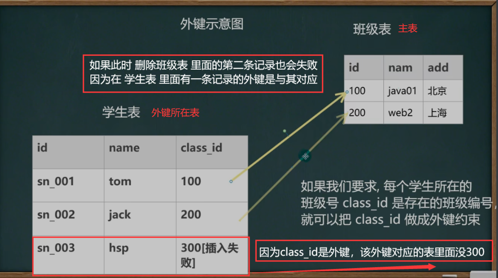

### 实例

```mysql
-- 1. 外键演示
-- 创建 主表 my_class
CREATE TABLE my_class
	(id INT PRIMARY KEY,
	 `name` VARCHAR(32) NOT NULL DEFAULT'')
DESC my_class

-- 2. 创建 从表 my_stu
CREATE TABLE my_stu
	(id INT PRIMARY KEY,
	 `name` VARCHAR(32) NOT NULL DEFAULT '',
	 class_id INT,
	 FOREIGN KEY (class_id) REFERENCES my_class(id));
DESC my_stu
```

```mysql

-- 测试数据
	# 向my_class中插入数据
    INSERT INTO my_class
        VALUES(100, 'java'), 
              (200, 'web'),
              (300, 'php');
    SELECT * FROM my_class;

	# 向my_stu中插入数据
    INSERT INTO my_stu
        VALUES(1, 'tom', 100),
              (2, 'jack', 200),
              (3, 'hsp', 300);
        
    INSERT INTO my_stu
        VALUES(4, 'mary', 400); -- 这里会失败...因为 400 班级不存在
    INSERT INTO my_stu
        VALUES(5, 'king', NULL); -- 可以, 外键 没有写 not null

	# 删除数据测试
    DELETE * FROM my_class; -- 一旦建立主外键的关系，数据不能随意删除了

    DELETE FROM my_class
        WHERE id = 100;-- 一旦建立主外键的关系，数据不能随意删除了
```


## check 约束

### 方法

```apl
作用:
	用于强制行数据必须满足的条件,
例如:
	在sal列上定义了check约束,并要求sal列值在1000 ~2000之间
	如果不再1000 ~2000之间就会提示出错。
提示:
	oracle和 sql server均支持check ,但是mysql5.7目前还不支持check ,只做语法校验，但不会生效。check.sql
	
# 基本语法:
#	 列名 类型 check (check条件)
```

### 实例

```mysql
-- check约束
-- mysql5.7 目前还不支持 check ,只做语法校验，但不会生效

-- 学习 oracle, sql server, 这两个数据库是真的生效. 
-- 测试

CREATE TABLE t25
	(id INT PRIMARY KEY,
	 `name` VARCHAR(32) NOT NULL DEFAULT '',
	 sex VARCHAR(6) CHECK(sex IN('男''女')),
	 sal DOUBLE CHECK(sal BETWEEN 2000 AND 3000)
	 );
	

-- 添加数据
INSERT INTO t23
	VALUES(1, 'jack', 'mid', 1); # 因为数据只进行校验，所以可以添加超出条件的数据
	
SELECT * FROM t23;
```

## 本节Test

```mysql
-- 现有一个商店的数据库 shop_db，记录客户及其购物情况，由下面三个表组成：

# 1. 商品 goods
-- (商品号 goods_id，商品名 goods_name，单价 unitprice，商品类别 category，供应商 provider); 

# 2. 客户 customer
-- (客户号 customer_id,姓名 name,住址 address,电邮 email 性别 sex,身份证card_Id);

# 3. 购买 purchase
-- (购买订单号 order_id，客户号 customer_id,商品号 goods_id,购买数量nums); 

-- 建表，在定义中要求声明 [进行合理设计]：
    -- (1)每个表的主外键；
    -- (2)客户的姓名不能为空值；
    -- (3)电邮不能够重复; 
    -- (4)客户的性别[男|女] check 枚举.. 
    -- (5)单价 unitprice 在 1.0 - 9999.99 之间 check


    CREATE TABLE shop # 主表
        (goods_id INT PRIMARY KEY,
         goods_name VARCHAR(32) NOT NULL DEFAULT '',
         unitprice DECIMAL(10,2)NOT NULL DEFAULT 0 CHECK(unitprice BETWEEN 1.0 AND 9999.99 ),
         category INT NOT NULL DEFAULT 0,
         provider VARCHAR(32) NOT NULL DEFAULT ''
         );
    DESC shop

    CREATE TABLE customer # 主表
        (customer_id CHAR(8) PRIMARY KEY, -- 程序员自己决定
         `name` VARCHAR(32) NOT NULL DEFAULT '',
         address VARCHAR(32)  NOT NULL DEFAULT '',
         email VARCHAR(32) UNIQUE  NOT NULL DEFAULT '',
    -- 	 sex varchar(6) check(sex in('man','woman'))
         sex ENUM('man','woman') NOT NULL,
         card_id CHAR(18) NOT NULL DEFAULT ''
         );
    DROP TABLE customer # wrong 因为有外键，所以无法删除
    DESC customer


    CREATE TABLE purchase # 购买表 外表
        (order_id INT PRIMARY KEY,
         customer_id CHAR(8) NOT NULL DEFAULT '',-- 因为是外键，所以数据类型要与对应表一致
         goods_id INT NOT NULL DEFAULT 0, -- 外键约束在后面
         nums INT,
         FOREIGN KEY (customer_id) REFERENCES customer(customer_id),
         FOREIGN KEY (goods_id) REFERENCES shop(goods_id)
         );
    DESC purchase
```


# 自增长


## 细节

```apl
1. 一般来说自增长是和primary key配合使用的
2. 自增长也可以单独使用[但是需要配合一个unique]
3. 自增长修饰的字段为整数型的(虽然小数也可以但是非常非常少这样使用)
4. 自增长默认从1开始，你也可以通过如下命令修改:
	ALTER TABLE 表名 auto_increment = 新的开始值;
5. 如果你添加数据时，给自增长字段(列)指定的有值，则以指定的值为准,
   如果指定了自增长，一般来说，就按照自增长的规则来添加数据
   
# 详细细节 见下述实例
```

## 实例

```mysql
-- 演示自增长的使用
-- 创建表
    CREATE TABLE t26
        (id INT PRIMARY KEY AUTO_INCREMENT,
         email VARCHAR(32)NOT NULL DEFAULT '',
         `name` VARCHAR(32) NOT NULL DEFAULT ''
         );

    DESC t26
    
-- 测试自增长的使用
# 插入方法一
    INSERT INTO t26
        VALUES(NULL,'abscask','jack')
	

# 插入方法二
    INSERT INTO t26(email,`name`)
        VALUES('aveafaef','tom')

    SELECT * FROM t26


-- 修改插入的起始位置，只有当指明的位置大于最大id才可以，否则依然是从最大id算起
    ALTER TABLE t26 AUTO_INCREMENT = 300

-- 如果指定插入较大数字，那么之后如果不可以修改，就以最大的id为起始，向后加
    INSERT INTO t26
        VALUES(200,'afbafoiah','marry')

-- 如果插入的值是比id最大值小，且表中此时没有该id所在字段，那么该字段就会按照顺序放入
    INSERT INTO t26
        VALUES(20,'afbafoiah','marry') 
```


# 索引


## 索引的原理


```apl
1. 没有索引为什么会慢?
	因为全表扫描.  # 如果查找id = 1的字段，依然也是全盘扫描，因为确定后面是否还有id = 1 的字段
2. 使用索引为什么会快?
	形成一个索引的数据结构，比如二叉树索引的代价

缺点:
	磁盘占用
	对dml(update delete insert)语句的效率影响

但是在我们项目中，
	1. select[90%]操作多
	2. update,delete,insert[10%]操作相对少
```

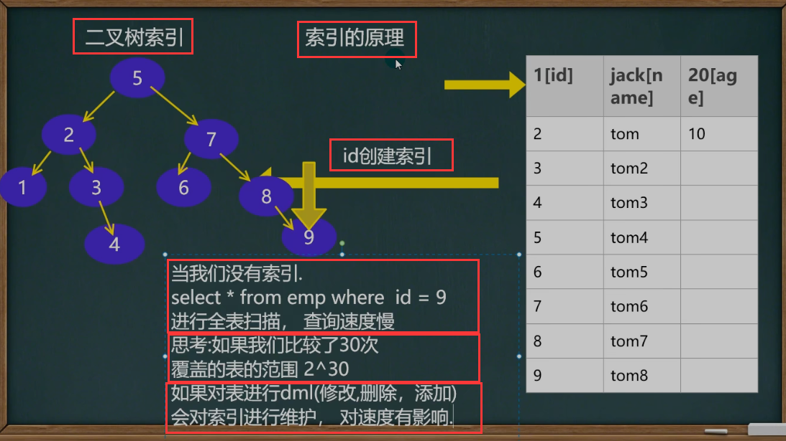

## 索引的4种类型

```apl
1. 主健索引：
	主键自动的为主索引(类型Primary key)
2. 唯一索引(UNIQUE)
3. 普通索引 (INDEX)
4. 全文索引(FULLTEXT)[适用于MyISAM]
	一般开发,不使用mysql自带的全文索引,而是使用:全文搜索Solr和 ElasticSearch (ES)

create table t1 
	(id int primary key, # 主键,同时也是索引，称为主键索引.
	 name varchar(32));

create table t2
	(id int unique,     # id是唯一的，同时也是索引，称为unique索引.
     name varchar(32));
    
# 如果在创建表时，创建了主键 或 unique，那么mysql自动为其创建索引 --> 真命天子
# 同样如果设置成为了unique索引，或者主键索引，那么这个字段就一定变成了unique 或者 主键
```

## 索引使用


### 添加索引

```apl
1．添加索引(建小表测试id , name ) index use.sql
    1. create [UNIQUE] index index_name 
            on tbl_name (列名);
    2. alter table table_name 
            ADD INDEX index name (列名)

2添加主键(索引) 
    1. ALTER TABLE 表名 
           ADD PRIMARY KEY(列名);
```

#### 实例

```mysql
DROP TABLE t29
-- 创建索引表
CREATE TABLE t29
	(id INT,id1 INT,id2 INT,id3 INT,
	 `name` VARCHAR(32)
	 );
	 
-- 查询表是否有索引
SHOW INDEX FROM t29

-- 添加索引
-- 1. 添加'唯一'索引
    CREATE UNIQUE INDEX id_index ON  t29(id)
  
-- 2. 添加普通索引
	-- 方式1
    CREATE INDEX id1_index ON t29(id1)
    -- 方式 2
    ALTER TABLE t29 ADD INDEX id2_index (id2)


-- 3. 添加主键索引
ALTER TABLE t29 ADD PRIMARY KEY(id3)

-- 如何选择
-- 如果某列的值，是不会重复的，则优先考虑使用 unique 索引, 否则使用普通索引
# Non_unique 0表示每种索引值只能存在一个，1表示可以存在多个
```

### 删除索引

```apl
3.删除索引
    1. DROP INDEX index name 
            ON tbl_ name.

    2. alter table table name 
            drop index index_name;

4.删除主键索引比较特别:
    1. alter table table name
              drop primary key;
```

#### 实例

```mysql
-- 删除索引
	DROP INDEX id_index ON t29
-- 删除主键索引
	ALTER TABLE t29 DROP PRIMARY KEY
	
-- 修改索引 ， 先删除，在添加新的索引
```

### 查询索引

```apl
5.查询索引(三种方式)
    1. show index(es) from table_name;

    2. show keys from table_name;

    3. DESC table_Name;
```

#### 实例

```mysql
-- 查询索引
    -- 方式1
      SHOW INDEX FROM t29
    -- 方式2
      SHOW INDEXES FROM t29
    -- 方式3
      SHOW KEYS FROM t29
    -- 方式4
      DESC t29
```


## 规则

```apl
# 1．较频繁的作为查询条件字段应该创建索引
	select * from emp where empno =1
	
# 2. 唯一性太差的字段不适合单独创建索引,即使频繁作为查询条件
	select * from emp where sex ='男‘
	
# 3. 更新非常频繁的字段不适合创建索引
	select * from emp where logincount =1
	
# 4. 不会出现在WHERE子句中字段不该创建索引(即不会作为查询条件的字段)
```

# 事务


将一组sql语句当成一个整体，要么都成功，要么都失败

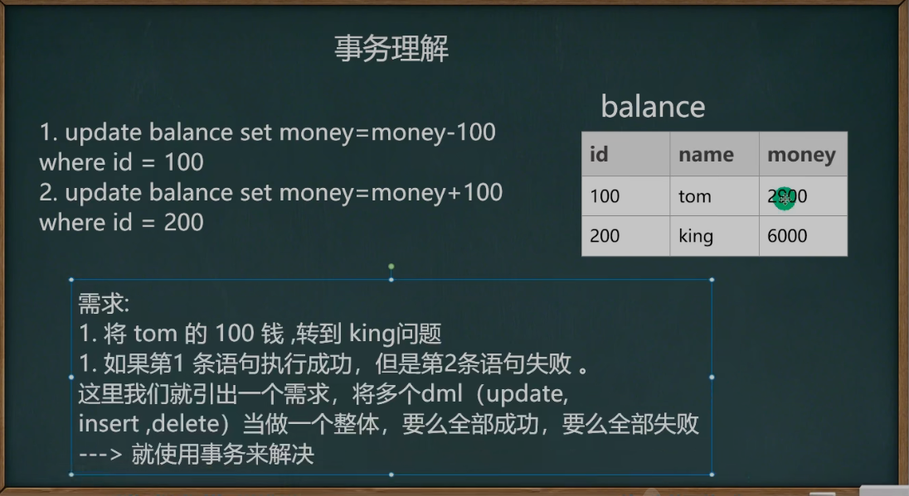

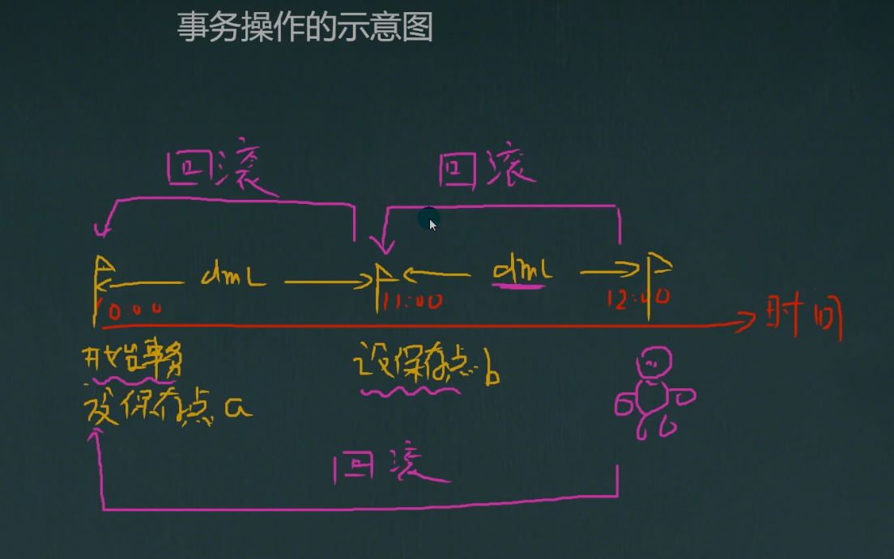

前提

1. 开启一个事务
2. 并且设置保存点

## 事务和锁

### 概念

```apl
# 当执行事务操作时(dml语句),mysql会在表上加锁,防止其它用户改表的数据.这对用户来讲是非常重要的

# mysql数据库控制台事务的几个重要操作(基本操作transaction.sql)
    1. start transaction --开始一个事务
    2. savepoint保存点名--设置保存点3. rollback to保存点名--回退事务
    4. rollback --回退全部事务
    5. commit --提交事务,所有的操作生效,不能回退
```

### 实例

```mysql
-- 事务的一个重要的概念和具体操作
-- 看一个图[看示意图]
-- 演示
-- 1. 创建一张测试表
    CREATE TABLE t30
        (id INT,
         `name` VARCHAR(32)
         );
         
-- 2. 开始事务
    START TRANSACTION
    
-- 3. 设置保存点
        SAVEPOINT a
    -- 执行 dml 操作
        INSERT INTO t30
            VALUES(1,'abc')

    -- 再设置保存点
        SAVEPOINT b
    -- 执行 dml 操作
        INSERT INTO t30
            VALUES(2,'cde')
            
-- 4. 回退到 b
        ROLLBACK TO b
    -- 继续回退到a
        ROLLBACK TO a

	-- 如果执行下面这句将全部回退
        ROLLBACK

-- 5. 提交
		COMMIT

SELECT * FROM t30
```


## 回退事务

```apl
在介绍回退事务前，先介绍一下保存点(savepoint).保存点是事务中的点.用于取消部分事务，
当结束事务时(commit),会自动的删除该事务所定义的所有保存点，
当执行回退事务时，通过指定保存点可以回退到指定的点。

```

## 提交事务

```apl
使用commit语句可以提交事务.当执行了commit语句子后,
会确认事务的变化、结束事务、删除保存点、释放锁，数据生效。
当使用commit语句结束事务子后，其它会话[其他连接]将可以查看到事务变化后的新数据[所有数据就正式生效.]
# 否则其他用户连接到数据库之后无法看到更新的数据
```

## 事务细节讨论

### 概念

```apl
1．如果不开始事务，默认情况下，dml操作是自动提交的，不能回滚

2．如果开始一个事务，你没有创建保存点.你可以执行rollback,默认就是回退到你事务开始的状态.

3．你也可以在这个事务中(还没有提交时),创建多个保存点.
       比如: 
           savepoint  aaa;
           执行dml , 
           savepoint bbb;
           ......
           commit
       
4. 你可以在事务没有提交前，选择回退到哪个保存点.
5. mysql的事务机制需要innodb的存储引擎才可以使用,myisam不好使.
6. 开始一个事务start transaction, set autocommit=off; 
```

### 实例

```mysql
-- 1. 如果不开始事务，默认情况下，dml 操作是自动提交的，不能回滚
        INSERT INTO t30
            VALUES(200,'abc')

        ROLLBACK

        SELECT * FROM t30
    
-- 2. 如果开始一个事务，你没有创建保存点. 你可以执行 rollback，默认就是回退到你事务开始的状态
        START TRANSACTION
        INSERT INTO t30
            VALUES(300,'cde')

        ROLLBACK -- 表示直接回退到事务开始的的状态
        COMMIT

-- 3. 你也可以在这个事务中(还没有提交时), 创建多个保存点.
-- 比如: savepoint aaa;  
-- 执行 dml 
-- savepoint bbb

-- 4. 你可以在事务没有提交前，选择回退到哪个保存点

-- 5. InnoDB 存储引擎支持事务 , MyISAM 不支持

-- 6. 开始一个事务 start transaction, set autocommit=off;
```

# 事务隔离级别

## 引入隔离级别

```apl
1. 多个连接开启各自事务操作数据库中数据时，
   数据库系统要负责'隔离'操作,以保证各个连接在获取数据时的准确性。(通俗解释)
   
2．如果不考虑隔离性,可能会引发如下问题:
    脏读
    不可重复读
    幻读	
# 这里的概念是。用户1与用户2同时登录了同一个数据库，此时用户1开启事务对数据进行操作，
# 1. 如果用户2 在用户1 没有commit的情况下就看到了用户1 对数据的操作结果 -> 脏读
# 2. 如果用户2 在用户1 commit后就看到了用户1 对数据的操作结果 -> 不可重复读/幻读
# 3. 如果用户2 在用户1 commit后依然看不到到了用户1 对数据的操作结果 -> 可重复读
# 4. 如果用户2 在用户1 修改时无法select该表，但在用户1 commit后就可以操作该表，并且看到了用户1 对数据的操作结果 ->可串行化 
```

## 引发的问题

```apl
1. 脏读(dirty read):
	当一个事务读取另一个事务尚未提交的改变(update,insert,delete)时，产生脏读
	
2. 不可重复读(nonrepeatable read):
	同一查询在同一事务中多次进行，由于其他提交事务所做的修改或删除，每次返回不同的结果集，此时发生不可重复读。
	
3. 幻读(phantom read):
	同一查询在同一事务中多次进行，由于其他提交事务所做的插入操作，每次返回不同的结果集，此时发生幻读。
```

## 4种隔离级别

```apl
概念:Mysql隔离级别定义了事务与事务之间的隔离程度。
```

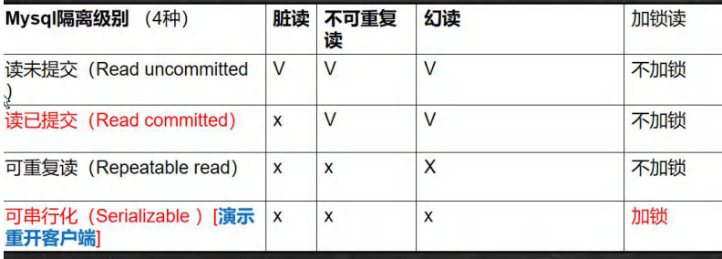

## 事务隔离级别--案例

**观看video**

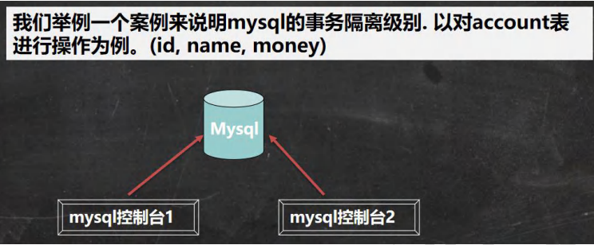

```mysql
-- 演示mysql事务级别
-- 1. 开了两个 mysql 的控制台

-- 2. 查看当前 mysql 的隔离级别
    SELECT @@tx_isolation

-- 在终端的显示结果
-- mysql> SELECT @@tx_isolation; 
-- +-----------------+
-- | @@tx_isolation | 
-- +-----------------+
-- | REPEATABLE-READ | 
-- +-----------------+

-- 3.把其中一个控制台的隔离级别设置 Read uncommitted
    SET SESSION TRANSACTION ISOLATION LEVEL REPEATABLE READ
   
    SELECT @@tx_isolation
```


## 操作事务隔离级别

### 查看隔离级别

```apl
1. 查看当前会话隔离级别
	select @@tx isolation;
2. 查看系统当前隔离级别
	select @@global.tx _isolation;
```

### 设置隔离级别

```apl
3. 设置当前会话隔离级别
	set session transaction isolation level repeatable read;
4. 设置系统当前隔离级别
	set global transaction isolation level repeatable read;
	
5. mysql 默认的事务隔离级别是repeatable read ，一般情况下，没有特殊要求,没有必要修改(因为该级别可以满足绝大部分项目需求)
```

### 全局修改


### 实例

```mysql
-- 查看隔离级别
    -- 1. 查看当前会话隔离级别
    SELECT @@tx_isolation
    -- 2. 查看系统当前隔离级别
    SELECT @@global.tx_isolation

-- 设置隔离级别
    -- 1. 设置当前会话隔离级别
    SET SESSION TRANSACTION ISOLATION LEVEL [想要设定的级别]
    -- 2. 设置系统当前隔离级别
    SET GLOBAL TRANSACTION ISOLATION LEVEL [想要设定的级别]
```


## 事务[ACID]特性 


```apl
# 1．原子性(Atomicity)
   原子性是指事务是一个不可分割的工作单位，事务中的操作要么都发生，要么都不发生。
   
# 2. 一致性(Consistency)
   事务必须使数据库从一个一致性状态变换到另外一个一致性状态
   
# 3. 隔离性(lsolation)
   事务的隔离性是多个用户并发访问数据库时，数据库为每一个用户开启的事务，不能被其他事务的操作数据所干扰，多个并发事务之间要相互隔离。
   
# 4. 持久性(Durability)
   持久性是指一个事务一旦被提交，它对数据库中数据的改变就是永久性的，接下来即使数据库发生故障也不应该对其有任何影响
```

## 本节Test

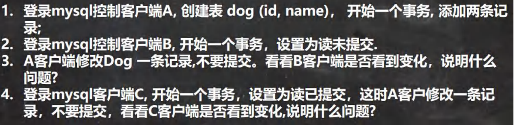


# 表类型和存储引擎


## 基本介绍

```apl
1. MySQL的'表类型由存储引擎(Storage Engines)决定'，主要包括MyISAM.innoDB、Memory等。

2. MySQL 数据表主要支持六种类型，分别是:
   CSV、Memory、ARCHIVE、MRG_MYISAM、MYISAM、InnoBDB.

3. 这六种又分为两类，
   # 一类是'事务安全型'(transaction-safe)，比如:InnoDB;
   # 其余都属于第二类，称为'非事务安全型'(non-transaction-safe)[mysiam和memory].
```


## 存储引擎/表类型特点

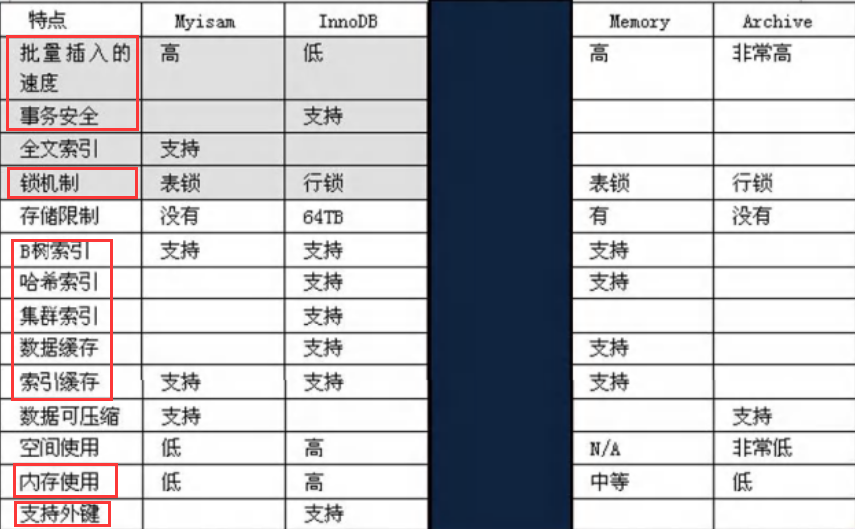


## 常用的引擎

### 细节说明

```apl
# 重点介绍三种: 
    # 1. MyISAM
    # 2. InnoDB
    # 3. MEMORY
```

```apl
1. MyISAM 存储引擎
   不支持事务、也不支持外键，但其访问速度快，对事务完整性没有要求
   
2. lnnoDB 存储引擎
   提供了具有提交、回滚和崩溃恢复能力的事务安全。
   但是比起MylSAM存储引擎，InnoDB写的处理效率差一些并且会占用更多的磁盘空间以保留数据和索引。
   
3. MEMORY 存储引擎
   使用存在内存中的内容来创建表。
   每个MEMORY表只实际对应上个磁盘文件。
   MEMORY类型的表访问非常得快，因为它的数据是放在内存中的，并且默认使用HASH索引。
   但是一旦MySQL服务关闭，表中的数据就会丢失掉,但是表的结构还在。
```


### 使用案例

#### 查看引擎

```mysql
-- 查看所有的存储引擎
    SHOW ENGINES
```

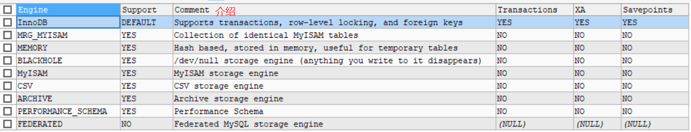

#### INNODB

```mysql
-- innodb 存储引擎，是前面使用过. 
-- 1. 支持事务 2. 支持外键 3. 支持行级锁
```

#### MYISAM

```mysql
-- myisam 存储引擎
-- 1. 添加速度快 2. 不支持外键和事务 3. 支持表级锁
    CREATE TABLE t31
        (id INT,
         `name` VARCHAR(32))
          ENGINE MYISAM
    
    DESC t31
    START TRANSACTION
    SAVEPOINT t1
    
    INSERT INTO t31 VALUES(1,'呕吼')
    ROLLBACK TO t1

    SELECT * FROM t31
```

#### MEMORY

```mysql
-- memory 存储引擎
    -- 1. 数据存储在内存中[关闭了 Mysql 服务，数据丢失, 但是表结构还在]
    -- 2. 执行速度很快(没有 IO 读写) 3. 默认支持索引(hash 表)
        CREATE TABLE t32
        (id INT,
         `name` VARCHAR(32))
          ENGINE MEMORY
    INSERT INTO t32 VALUES(1,'呕吼')
    INSERT INTO t32 VALUES(2,'呕吼')	  
    SELECT * FROM t32

    -- 终端
    net STOP mysql
    net START mysql

    SELECT * FROM t32 -- 只剩下框架，字段全部消失
```

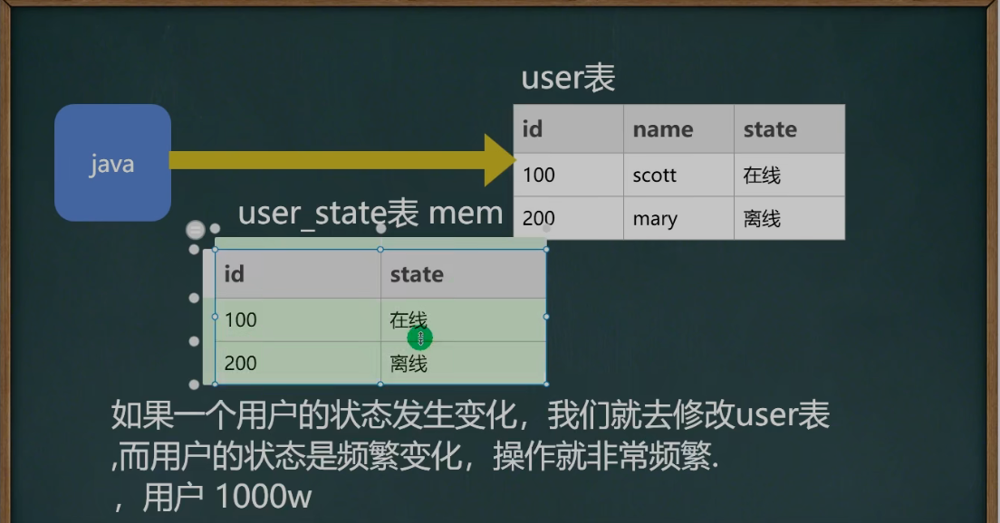

```mysql
-- 指令修改存储引擎
	ALTER TABLE `t29` ENGINE = INNODB
```


# 视图

## 引入需求

```apl
emp表的列信息很多：
    有些信息是个人重要信息(比如sal, comm,mgr, hiredate)，
    如果我们希望某个用户只能查询emp表的(empno.ename, job 和deptno)信息，有什么办法?
 	
 	答案：==>视图
```

## 基本概念

```apl
1．视图是一个虚拟表，其内容由查询定义。
   同真实的表一样，视图包含列,其数据来自对应的真实表(基表)
   
2. 视图和基表关系的示意图
```


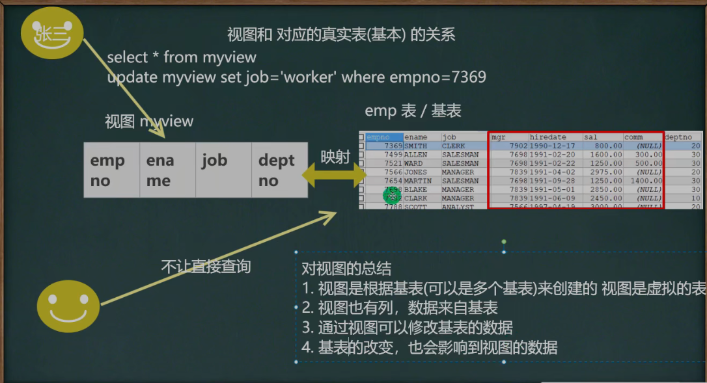

在data文件中，只有 .frm -> 结构文件，没有 .ibd -> 数据文件


## 基本使用

### 方法

```apl
1. create view 视图名 
		as select 语句
		
2. alter view 视图名 
		as select语句   # 更新成新的视图
3. SHOW CREATE VIEW 视图名

4. drop view 视图名1 视图名2
```

### 实例

```apl
创建一个视图emp_viewo1，只能查询emp表的(empno、ename, job和deptno)信息
```

```mysql
-- 视图的使用
-- 创建一个视图 emp_view01，只能查询 emp 表的
-- (empon、ename, job 和 deptno ) 信息

-- 创建视图
CREATE VIEW emp_view01
	AS
	SELECT empon,ename, job , deptno 
		FROM emp
-- 查看视图
DESC emp_view01

SELECT * FROM emp_view01
SELECT empon,job FROM emp_view01

-- 查看创建视图的指令
SHOW CREATE VIEW emp_view01

-- 删除视图
DROP VIEW emp_view01
```

## 视图细节

```apl
-- 视图的细节
-- 1. 创建视图后，到数据库去看，对应视图只有一个视图结构文件(形式: 视图名.frm)
-- 2. 视图的数据变化会影响到基表，基表的数据变化也会影响到视图[insert update delete ]
-- 3. 视图中可以再使用视图 , 比如从 emp_view01 视图中，选出 empno,和 ename 做出新视图
```

### 实例

```mysql
-- 视图的细节
-- 1. 创建视图后，到数据库去看，对应视图只有一个视图结构文件(形式: 视图名.frm)
-- 2. 视图的数据变化会影响到基表，基表的数据变化也会影响到视图[insert update delete ]

-- 修改视图 会影响到基表
UPDATE emp_view01
	SET job = 'abc'
	WHERE empon = 7369
	
SELECT * FROM emp_view01
SELECT job,empon FROM emp -- 查询基表


-- 修改基本表， 会影响到视图
UPDATE emp 
	SET job = 'SALEMAN'
	WHERE empon = 7369

SELECT * FROM emp_view01
SELECT job,empon FROM emp -- 查询基表

-- 3. 视图中可以再使用视图 , 比如从 emp_view01 视图中，选出 empno,和 ename 做出新视图
CREATE VIEW emp_view02
	AS
	SELECT empon FROM emp_view01

SELECT * FROM emp_view02
```

## 视图优点

```apl
# 1．安全。
   一些数据表有着重要的信息。有些字段是保密的，不能让用户直接看到。
   这时就可以创建一个视图，在这张视图中只保留一部分字段。
   这样，用户就可以查询自己需要的字段，不能查看保密的字段。

# 2. 性能。
   关系数据库的数据常常会分表存储，使用外键建立这些表的之间关系。
   这时,数据库查询通常会用到连接(JOIN)。
   这样做不但麻烦，效率相对也比较低。
   如果建立一个视图，将相关的表和字段组合在一起，就可以避免使用JOIN查询数据。

# 3. 灵活。
   如果系统中有一张旧的表，这张表由于设计的问题，即将被废弃。
   然而，很多应用都是基于这张表，不易修改。
   这时就可以建立一张视图，视图中的数据直接映射到新建的表。
   这样，就可以少做很多改动，也达到了升级数据表的目的。
```

## 本节test(多表)

```apl
针对emp , dept ,和salgrade张三表.创建一个视图emp_view03。
可以显示雇员编号,雇员名，雇员部门名称和薪水级别。

[即使用三张表，构建一个视图] 
```

```mysql
CREATE VIEW new_view01
	AS
	SELECT empon,ename,dname,grade
        FROM emp,dept,salgrade
        WHERE emp.deptno = dept.deptno AND
        		(sal BETWEEN losal AND hisal)

SELECT * FROM new_view01
```

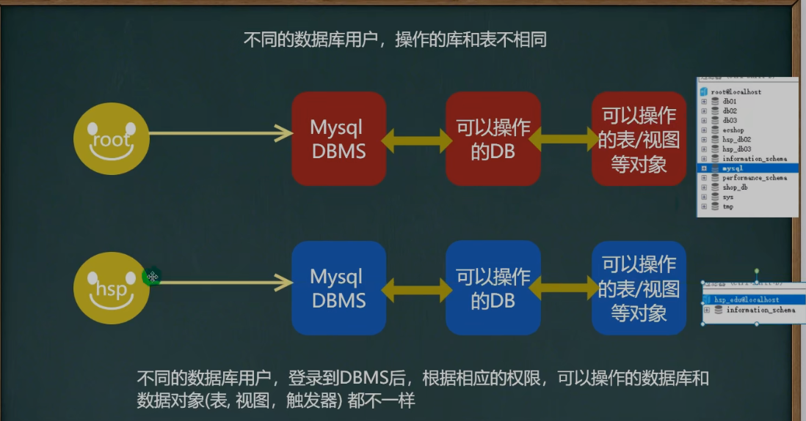

# Mysql 管理

## Mysql 用户

### 基本概念

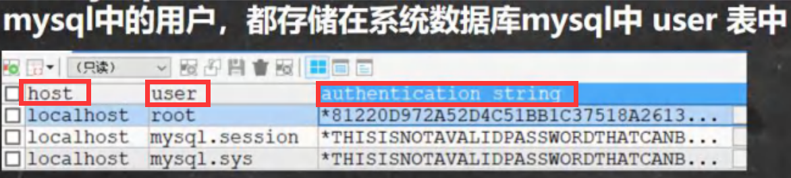

```apl
# user表的重要字段说明:
1. host 
   允许登录的“位置”，localhost表示该用户只允许本机登录，也可以指定ip地址，比如:    192.168.1.100
   
2. user
   用户名
   
3. authentication_ string
   密码，是通过mysql的password()函数加密之后的密码。
```

### 创建用户

```apl
create user '用户名' @ '允许登录的ip' identified by'密码'
说明:创建用户，同时指定密码
```

### 删除用户

```apl
drop user '用户名' @ '允许登录位置';
```

### 用户修改密码

```apl
# 1. 修改自己的密码:
	set password = password('密码');

# 2. 修改他人的密码（需要有修改用户密码权限):
	set password for '用户名'@'登录位置'=password('密码');
```

## mysql 中的权限

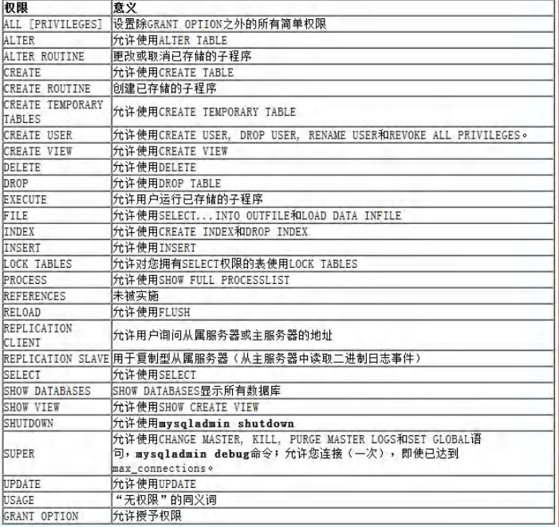

## 给用户授权

### 基本语法:

```apl
grant 权限列表 on 库.对象名  to '用户名' @ '登录位置'【identified by'密码'】
```

```apl
说明:
1. 权限列表，多个权限用逗号分开
   grant select on .......
   grant select,delete,create on ......
   grant all 【privileges】on ..... # 表示赋予该用户在该对象上的所有权限

2. 特别说明
   (1) *.* : 
       代表本系统中的所有数据库的所有对象(表，视图，存储过程)
   (2) 库.* :
       表示某个数据库中的所有数据对象(表，视图，存储过程等)

3. identified by可以省略，也可以写出.
   (1)如果用户存在，就是修改该用户的密码。
   (2)如果该用户不存在，就是创建该用户!
```

## 回收用户授权

### 基本语法:

```apl
revoke权限列表on库.对象名from '用户名"@"登录位置';
```

## 权限生效指令

```apl
如果权限没有生效，可以执行下面命令.
基本语法:
	FLUSH PRIVILEGES;
```

## 本节Test

### 题目

```apl
1. 创建一个新用户(用户名)，密码123，并且只可以从本地登录，不让远程登录mysql
2. 使用root用户创建 testdb库 下的 news表
3．给用新户分配 查看news表 和 添加数据 的权限
4．测试看看新用户是否只有这几个权限
5. 使用root用户修改 新用户的登录密码为abc
6. 新用户重新登录
7. 演示回收权限
8. 使用root用户删除你的用户
```

### 实例

#### root

```mysql
CREATE USER 'abc'@'localhost' IDENTIFIED  BY '123'
 
-- 1. 使用 root 用户创建 testdb ,表 news
    CREATE DATABASE testdb
    CREATE TABLE news
        (id INT,
         comtect VARCHAR(32));
-- 2. 添加一条测试数据
    INSERT INTO news VALUES(100, '北京新闻');
    SELECT * FROM news;

-- 4. 给 abc 分配查看 news 表和 添加 news 的权限
    GRANT SELECT,INSERT ON testdb.news
        TO 'abc'@'localhost'

-- 5. 增加 update 权限
    GRANT UPDATE ON testdb.news 
        TO 'abc'@'localhost'
	
-- 6. 修改 abc 的密码为 abc
    SET PASSWORD 
    	FOR 'abc'@'localhost' = PASSWORD('abc')

-- 7. 回收 shunping 用户在 testdb.news 表的所有权限
    REVOKE SELECT,UPDATE,INSERT ON testdb.news 
        FROM 'abc'@'localhost'	
	
    REVOKE ALL ON testdb.news 
        FROM 'abc'@'localhost'

-- 8. 删除 abc
    DROP USER 'abc'@'localhost'SELECT * FROM news	
```

#### 用户abc

```mysql
SELECT * FROM news

INSERT INTO news
	VALUES(200,'晚间新闻')

UPDATE news
	SET id = 300 
	WHERE comtect = '晚间新闻'
```


## 细节说明

```apl
1. 在创建用户的时候，如果不指定Host,则为%，%表示表示所有IP都有连接权限
   create user XXX;
   
2．也可以这样指定,用户在 192.168.1.* 的ip可以登录mysql
   create user 'xxx'@'192.168.1.%’表示 xxx
   
3．在删除用户的时候，如果host不是% , 需要明确指定'用户'@'host值'
```

### 实例

```mysql
-- 说明 用户管理的细节
-- 1。 在创建用户的时候，如果不指定 Host, 则为% , %表示表示所有 IP 都有连接权限
-- create user xxx;
    CREATE USER 'abc'

-- 2. 也可以这样指定
-- create user 'xxx'@'192.168.1.%' 表示 xxx 用户在 192.168.1.*的 ip 可以登录 mysql
    CREATE USER 'abcd'@'192.168.1.%'


-- 3. 在删除用户的时候，如果 host 不是 %, 需要明确指定 '用户'@'host 值'
    DROP USER jack

    DROP USER 'abcd'@'192.168.1.%'

-- 4. 查看mysql.user表的`Host`与`User`
    SELECT `Host`,`User` FROM mysql.user
```

# 本章作业

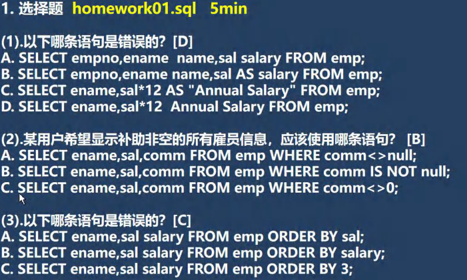

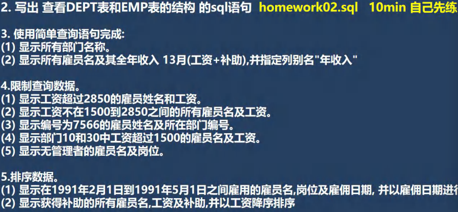

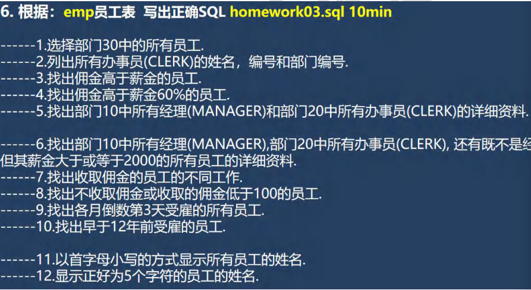

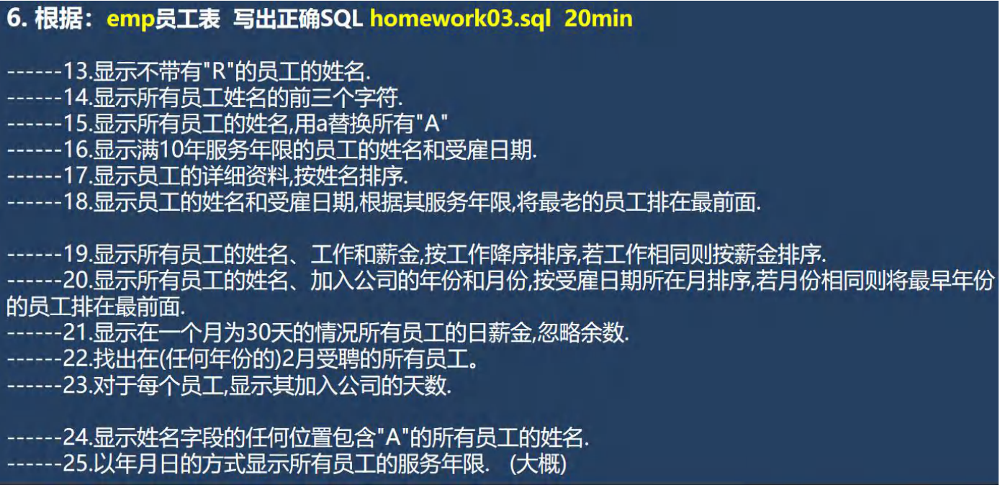

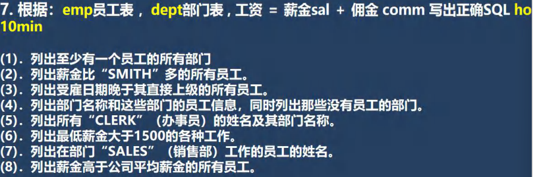

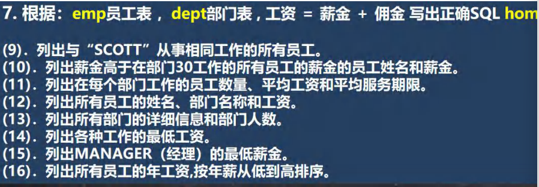

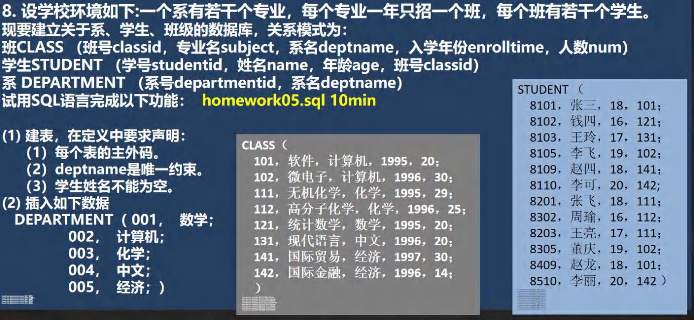


