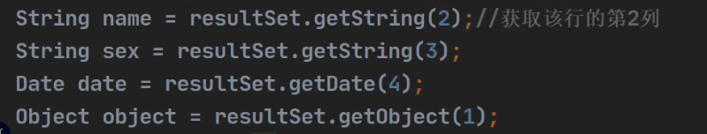

编译时异常与运行时异常的区别

# JDBC 概述

## 基本介绍

```apl
1. JDBC为访问不同的数据库提供了统一的接口，为使用者屏蔽了细节问题。
2. Java程序员使用JDBC,可以连接任何提供了JDBC驱动程序的数据库系统，从而完成对数据库的各种操作。
```


## 模拟 JDBC

**我们规定的JDBC接口**

```java
package com.Novice.jdbc.myjdbc;

//我们规定的JDBC接口
public interface jdbcInterface {

    //连接
    public Object getConnection();

    //crud
    public void crud();

    //关闭连接
    public void close();
}
```

**MySql厂商实现接口**

```java
package com.Novice.jdbc.myjdbc;


//模拟MySql厂商实现java的数据库接口
//实现了JDBC接口
public class MySqlJdbcImpl implements jdbcInterface{
    //假如数据库升级，直接更换jar包即可
    @Override
    public Object getConnection() {
        System.out.println("得到MySql的连接 升级");
        return null;
    }

    @Override
    public void crud() {
        System.out.println("执行增删改查");

    }

    @Override
    public void close() {
        System.out.println("关闭MySql的连接");

    }
}
```

**Oracle厂商实现接口**

```java
package com.Novice.jdbc.myjdbc;

public class OracleJdbcImpl implements jdbcInterface{

    @Override
    public Object getConnection() {
        System.out.println("得到Oracle的连接");
        return null;
    }

    @Override
    public void crud() {
        System.out.println("执行增删改查");

    }

    @Override
    public void close() {
        System.out.println("关闭Oreale的连接");
    }
}
```

**测试上述厂商类**

```java
package com.Novice.jdbc.myjdbc;

public class TestJDBC {
    public static void main(String[] args) {

        //完成对Mysql的操作
        jdbcInterface jdbcInterface = new MySqlJdbcImpl();

        jdbcInterface.getConnection();//通过接口来调用实现类【动态绑定】
        jdbcInterface.crud();
        jdbcInterface.close();


        System.out.println("");

        //完成对Oracle的操作
        jdbcInterface = new OracleJdbcImpl();

        jdbcInterface.getConnection();//通过接口来调用实现类【动态绑定】
        jdbcInterface.crud();
        jdbcInterface.close();


    }
}
```

# JDBC 带来的好处

```apl
说明:
1. JDBC是Java提供一套用于数据库操作的接口APl。
2. Java程序员只需要面向这套接口编程即可。
3. 不同的数据库厂商,需要针对这套接口,提供不同实现。
```

**不建议直接访问数据库**


**建议使用API访问数据库**


## JDBC API


# JDBC 快速入门

## JDBC 程序编写步骤

```apl
1. 注册驱动-加载Driver类
2. 获取连接-得到Connection
3. 执行增删改查-发送SQL给mysql执行
4. 释放资源-关闭相关连接
```

## JDBC 第一个程序

```mysql
CREATE TABLE actor -- 演员表
(
	id INT PRIMARY KEY AUTO_INCREMENT,
	`name` VARCHAR(32)NOT NULL DEFAULT '',
	sex CHAR(1)NOT NULL DEFAULT'女',
	borndate DATETIME,
	phone VARCHAR (12)
);

SELECT * FROM actor
```

```java
package com.Novice.jdbc;

import java.sql.Connection;
import java.sql.Driver;
import java.sql.SQLException;
import java.sql.Statement;
import java.util.Properties;

public class jdbc01 {
    public static void main(String[] args) throws SQLException {

        //前置工作： 在项目下创建一个文件夹比如 libs
        // 将 mysql.jar 拷贝到该目录下，点击 add to project ..加入到项目中

        //1. 注册驱动
        Driver driver = new com.mysql.jdbc.Driver();

        //2. 得到连接
        //解读
        //(1) jdbc:mysql:// 规定好表示协议，通过 jdbc 的方式连接 mysql
        //(2) localhost 主机，可以是 ip 地址
        //(3) 3306 表示 mysql 监听的端口
        //(4) hsp_db02 连接到 mysql dbms 的哪个数据库
        //(5) mysql 的连接本质就是前面学过的 socket 连接
        String url = "jdbc:mysql://localhost:3306/Novice_db02";

        Properties properties = new Properties();
        //将 用户名和密码放入到 Properties 对象
        //说明
        //user 和 password 是规定好，后面的值根据实际情况写
        properties.setProperty("user","root"); //用户
        properties.setProperty("password","abcd"); //密码

        Connection connect = driver.connect(url, properties);

        //3. 执行 sql
        // String sql ="insert into actor values(null,'刘德华','男','1970-11-11','110')";
        // String sql = "update actor set `name` = '周星驰' where id = 1";
        String sql = "delete from actor";
        //statement 用于执行静态 SQL 语句并返回其生成的结果的对象
        Statement statement = connect.createStatement();
        int rows = statement.executeUpdate(sql); ; // 如果是 dml 语句，返回的就是影响行数
        System.out.println(rows>0?"成功":"失败");

        //4. 关闭连接资源
        statement.close();
        connect.close();
        

    }
}
```

# 获取数据库连接 5 种方式

## 方式1

```java
//方式1
    @Test
    public void connect01() throws SQLException {
        Driver driver = new Driver(); //创建 driver 对象
        String url = "jdbc:mysql://localhost:3306/Novice_db02";

        //将 用户名和密码放入到 Properties 对象
        Properties properties = new Properties();
        //说明 user 和 password 是规定好，后面的值根据实际情况写
        properties.setProperty("user","root");//用户
        properties.setProperty("password","abcd");//密码
        
        Connection connect = driver.connect(url, properties);
        System.out.println(connect);


    }
```

## 方式2

```java
//方式2
    @Test
    public void connect02() throws ClassNotFoundException, InstantiationException, IllegalAccessException, SQLException {
        //使用反射加载 Driver 类 , 动态加载，更加的灵活，减少依赖性
        Class<?> Driver = Class.forName("com.mysql.jdbc.Driver");
        Driver driver = (Driver)Driver.newInstance();

        String url = "jdbc:mysql://localhost:3306/Novice_db02";

        Properties properties = new Properties();
        properties.setProperty("user","root");//用户
        properties.setProperty("password","abcd");//密码

        Connection connect = driver.connect(url, properties);
        System.out.println(connect);


    }
```

## 方式3

```java
//方式3 使用 DriverManager 替代 driver 进行统一管理
    @Test
    public void connect03() throws ClassNotFoundException, InstantiationException, IllegalAccessException, SQLException {
        //使用反射加载 Driver 类 , 动态加载，更加的灵活，减少依赖性
        Class<?> Driver = Class.forName("com.mysql.jdbc.Driver");
        Driver driver = (Driver)Driver.newInstance();

        //创建 url 和 user 和 password
        String url = "jdbc:mysql://localhost:3306/Novice_db02";
        String user = "root";
        String password = "abcd";

        // Properties properties = new Properties();
        // properties.setProperty("user","root");//用户
        // properties.setProperty("password","abcd");//密码
        DriverManager.registerDriver(driver);//注册驱动
        // Connection connection1 = DriverManager.getConnection(url, properties);
        Connection connection = DriverManager.getConnection(url, user, password);

        System.out.println("第三种方式= "+connection);


    }
```

## 方式4

### 方式4.0

```java
//方式4
    // 使用 Class.forName 自动完成注册驱动，简化代码
    // 这种方式获取连接是使用的最多，推荐使用
    @Test
    public void connect04() throws ClassNotFoundException, SQLException {
        //使用反射加载了 Driver 类
        //在加载 Driver 类时，完成注册

        /*
            查看Driver源码
            com.mysql.jdbc.Driver

                源码:
                1. 静态代码块，在类加载时，会执行一次.
                2. DriverManager.registerDriver(new Driver());
                3. 因此注册 driver 的工作已经完成
                static {
                try {
                    DriverManager.registerDriver(new Driver());
                } catch (SQLException var1) {
                    throw new RuntimeException("Can't register driver!");
                }
            }
         */

        Class.forName("com.mysql.jdbc.Driver");
        String url = "jdbc:mysql://localhost:3306/Novice_db02";
        String user = "root";
        String password = "abcd";
        
        Connection connection = DriverManager.getConnection(url, user, password);
        System.out.println("第四种方式= "+connection);

    }
```

### 方式4.1

```apl
// 从jdk1.5以后使用了jdbc4,不再需要显示调用class.forName()注册驱动
// 而是自动调用驱动jar包下META-INF\services\java .sql.Driver文本中的类名称去注册
```

```java
 //方式4.1
    // 使用 Class.forName 自动完成注册驱动，简化代码
    // 这种方式获取连接是使用的最多，推荐使用
    @Test
    public void connect04_1() throws ClassNotFoundException, SQLException {
        //使用反射加载了 Driver 类
        //在加载 Driver 类时，完成注册

        // Class.forName("com.mysql.jdbc.Driver");   <- 此处注释掉代码依然运行成功
        // 从jdk1.5以后使用了jdbc4,不再需要显示调用class.forName()注册驱动
        // 而是自动调用驱动jar包下META-INF\services\java .sql.Driver文本中的类名称去注册
        String url = "jdbc:mysql://localhost:3306/Novice_db02";
        String user = "root";
        String password = "abcd";
        Connection connection = DriverManager.getConnection(url, user, password);
        System.out.println("第4.1种方式= "+connection);

    }
```

## 方式5

```java
// 方式5
    @Test
    // 在方式 4 的基础上改进，增加配置文件，让连接 mysql 更加灵活
    // 改变上述的硬编码方式
    public void connect05() throws IOException, ClassNotFoundException, SQLException {

        Properties properties = new Properties();
        properties.load(new FileInputStream("src\\mysql.properties"));
        String user = properties.getProperty("user");
        String password = properties.getProperty("password");
        String driver = properties.getProperty("driver");
        String url = properties.getProperty("url");


        Class.forName(driver);//建议写上
        Connection connection = DriverManager.getConnection(url, user, password);
        System.out.println("方式5= "+connection);


    }
```

## 课堂练习

```apl
参考老师代码，使用方式5完成
1. 创建news表
2. 使用jdbc添加5条数据
3. 修改id =1的记录,将content改成一个新的消息
4. 删除id =3的记录
```

```java

```


# ResultSet[结果集]


## 基本介绍

```apl
1. 表示数据库结果集的'数据表'，通常通过执行查询数据库的语句生成,底层是收集sql数据后，存储在java程序里面的数据表
2. ResultSet对象 保持一个光标指向其当前的数据行。最初，光标位于第一行之前
3. next方法 将光标移动到下一行，并且由于在ResultSet对象中没有更多行时返回false ，因此可以在while循环中使用循环来遍历结果集
```


```java
package com.Novice.jdbc.resultSet;


import com.mysql.jdbc.Driver;

import javax.crypto.spec.PSource;
import java.io.FileInputStream;
import java.io.FileNotFoundException;
import java.io.IOException;
import java.sql.*;
import java.util.Properties;

//演示select语句返回 ResultSet ，并取出结果
public class ResultSet_ {
    public static void main(String[] args) throws IOException, ClassNotFoundException, SQLException {

        //通过 Properties 对象获取配置文件的信息
        Properties properties = new Properties();
        properties.load(new FileInputStream("src\\mysql.properties"));

        //获取相关的值
        String url = properties.getProperty("url");
        String user = properties.getProperty("user");
        String password = properties.getProperty("password");
        String driver = properties.getProperty("driver");

        //1. 注册驱动
        Class.forName(driver);
        //2. 得到连接
        Connection connection = DriverManager.getConnection(url, user, password);

        /*
        +----+--------+-----+---------------------+-------+
        | id | name   | sex | borndate            | phone |
        +----+--------+-----+---------------------+-------+
        |  2 | jack   | 男  | 1922-02-01 00:00:00 | 134    |
        |  3 | 刘德    | 男  | 1966-07-08 00:00:00 | 256    |
        +----+--------+-----+---------------------+-------+

         */

        //3. 得到 Statement
        Statement statement = connection.createStatement();
        //4. 组织 SqL
        String sql = "select id,name,sex,borndate from actor";
        //执行给定的 SQL 语句，该语句返回单个 ResultSet 对象
        ResultSet resultSet = statement.executeQuery(sql);

        //5. 使用 while 取出数据
        while (resultSet.next()){// 让光标向后移动，如果没有更多行，则返回 false
            int id = resultSet.getInt(1);//获取该行的第 1 列
            //int id1 = resultSet.getInt("id"); 通过列名来获取值, 推荐
            String name = resultSet.getString(2);//获取该行的第 2 列
            String sex = resultSet.getString(3);
            Date borndate = resultSet.getDate(4);
            System.out.println(id+"\t"+name+"\t"+sex+"\t"+borndate);
        }

        //6. 关闭连接
        resultSet.close();
        statement.close();
        connection.close();

    }
}
```


# Statement

## 基本介绍

```apl
1. Statement对象 用于执行静态SQL语句并返回其生成的结果的对象

2. 在连接建立后，需要对数据库进行访问，执行命名或是SQL语句，可以通过
   Statement[存在SQL注入]
   PreparedStatement[预处理]
   CallableStatement[存储过程]
   
3. Statement对象执行SQL语句，存在SQL注入风险
   SQL注入:
       是利用某些系统没有对用户输入的数据进行充分的检查，而在用户输入数据中注入非法的SQL语句段或命令，恶意攻击数据库。
       
5. 要防范SQL注入，只要用PreparedStatement(从Statement扩展而来)取代Statement就可以了.
```


## SQL注入

```sql
-- 演示 sql 注入
-- 创建一张表
CREATE TABLE admin
	(`name` VARCHAR(32) NOT NULL UNIQUE,
	 pwd VARCHAR(32) NOT NULL DEFAULT'')
	 CHARSET utf8;
	
-- 添加数据
INSERT INTO admin VALUES ('abc','123')
	
-- 查找某个管理是否存在
SELECT * FROM admin
	WHERE `name` = 'abc' AND pwd = '123'
	
-- SQL
-- 输入用户名 为 1' or
-- 输入万能密码 为 or '1'= '1
SELECT * FROM admin
	WHERE `name` = '1' OR 'and puw = ' OR '1' = '1'
```

## 应用实例

java实现SQL注入，使用的是上面SQL注入中的MySql创建的表

```java
package com.Novice.jdbc.statement;

import com.google.inject.spi.ProviderWithDependencies;

import javax.crypto.spec.PSource;
import javax.naming.Name;
import java.io.FileInputStream;
import java.io.FileNotFoundException;
import java.io.IOException;
import java.sql.*;
import java.util.Properties;
import java.util.Scanner;

public class statement_ {
    public static void main(String[] args) throws ClassNotFoundException, SQLException, IOException {

        Scanner scanner = new Scanner(System.in);
        //让用户输入管理员名和密码
        System.out.println("请输入姓名:");//.next(): 当接收到 空格或者 '就是表示结束
        String name = scanner.nextLine();// 若希望看到 SQL 注入，这里需要用nextLine
        System.out.println("请输入密码:");
        String pwd = scanner.nextLine();


        Properties properties = new Properties();
        properties.load(new FileInputStream("src\\mysql.properties"));

        String url = properties.getProperty("url");
        String user = properties.getProperty("user");
        String password = properties.getProperty("password");
        String driver = properties.getProperty("driver");

        Class.forName(driver);//建议写上
        Connection connection = DriverManager.getConnection(url, user, password);

        Statement statement = connection.createStatement();
        String sql = "select name,pwd from admin where name = '" + name
                + "' and pwd = '" + pwd + "'"; // 字符串拼接
        ResultSet resultSet = statement.executeQuery(sql);

        if (resultSet.next()) { //如果查询到一条记录，则说明该管理存在
            System.out.println("登录成功");
        }else {
            System.out.println("登录失败");
        }
        
        
        //关闭连接
        resultSet.close();
        statement.close();
        connection.close();

    }
}
```


# PreparedStatement

## 基本介绍

```apl
1. PreparedStatement 接口
       执行的 SQL语句中的 参数用问号(?)来表示，
       调用PreparedStatement对象的 setXxx()方法 来设置这些参数. 
       setXxx()方法 有两个参数:
           第一个参数是要设置的SQL语句中的参数的索引(从1开始)
           第二个是设置的SQL语句中的参数的值
       
2. 调用executeQuery()，返回ResultSet对象 即select

3. 调用executeUpdate():执行更新,包括增、删、修改
```

## 预处理好处

```apl
1. 不再使用+拼接sql语句，减少语法错误
2. 有效的解决了sql注入问题!
3. 大大减少了编译次数，效率较高 (预处理，在编译时刻，预处理的是编译，以后就不需要反复的编译了)
```

## 应用案例

### SELECT

```java
package com.Novice.jdbc.prepareStatement;

import java.io.FileInputStream;
import java.io.IOException;
import java.sql.*;
import java.util.Properties;
import java.util.Scanner;
@SuppressWarnings({"all"})
public class prepareStatement_ {
    public static void main(String[] args) throws ClassNotFoundException, SQLException, IOException {

        Scanner scanner = new Scanner(System.in);
        System.out.println("请输入姓名:");
        String name = scanner.nextLine();
        System.out.println("请输入密码:");
        String pwd = scanner.nextLine();


        Properties properties = new Properties();
        properties.load(new FileInputStream("src\\mysql.properties"));

        String url = properties.getProperty("url");
        String user = properties.getProperty("user");
        String password = properties.getProperty("password");
        String driver = properties.getProperty("driver");

        Class.forName(driver);
        Connection connection = DriverManager.getConnection(url, user, password);

		//3.1 组织 SqL , Sql 语句的 ? 就相当于占位符
        String sql = "select name,pwd from admin where name = ? and pwd = ?"; 
        //3.2 preparedStatement 对象实现了 PreparedStatement 接口的实现类的对象
        PreparedStatement preparedStatement = connection.prepareStatement(sql);
        //prepareStatement只是一个接口，这里真正返回的对象是，实现prepareStatement接口的一个类的对象实例，由数据库厂商实现

        //3.3 给 ? 赋值
        preparedStatement.setString(1,name);
        preparedStatement.setString(2,pwd);

        //4. 执行 select 语句使用 executeQuery
        // 如果执行的是 dml(update, insert ,delete) executeUpdate()
        // 这里执行 executeQuery ,不要在写 sql，否则传入的依然是原始的sql
        ResultSet resultSet = preparedStatement.executeQuery();


        if (resultSet.next()) {
            System.out.println("登录成功");
        }else {
            System.out.println("登录失败");
        }

        //关闭连接
        resultSet.close();
        preparedStatement.close();
        connection.close();

    }
}
```


## DML

```java
package com.Novice.jdbc.prepareStatement;

import java.io.FileInputStream;
import java.io.IOException;
import java.sql.*;
import java.util.Properties;
import java.util.Scanner;

@SuppressWarnings({"all"})
public class prepareStatement_DML {
    public static void main(String[] args) throws ClassNotFoundException, SQLException, IOException {

        Scanner scanner = new Scanner(System.in);
        System.out.println("请输入姓名:");
        String name = scanner.nextLine();
        System.out.println("请输入密码:");
        String pwd = scanner.nextLine();


        Properties properties = new Properties();
        properties.load(new FileInputStream("src\\mysql.properties"));

        String url = properties.getProperty("url");
        String user = properties.getProperty("user");
        String password = properties.getProperty("password");
        String driver = properties.getProperty("driver");

        Class.forName(driver);
        Connection connection = DriverManager.getConnection(url, user, password);

//-------------------------------------------------------------------------------
        // String sql = "insert into admin values(?,?)";
        String sql = "update admin set pwd = ? where name = ?";
        // String sql = "delete from admin where name = ?";
        
        PreparedStatement preparedStatement = connection.prepareStatement(sql);
	    //preparedStatement 对象实现了 PreparedStatement 接口的实现类的对象
        
         //给 ? 赋值
        preparedStatement.setString(1, name);
        preparedStatement.setString(2, pwd);

        int rows = preparedStatement.executeUpdate();
        System.out.println(rows > 0 ? "执行成功" : "执行失败");

//-------------------------------------------------------------------------------
        String sql1 = "select * from admin ";
        // preparedStatement.clearParameters();
        // PreparedStatement preparedStatement1 = connection.prepareStatement(sql1);
        ResultSet resultSet = preparedStatement.executeQuery(sql1);

        while (resultSet.next()){
             name = resultSet.getString(1);
             pwd = resultSet.getString(2);
            System.out.println(name+"\t"+pwd);
        }
//-------------------------------------------------------------------------------


        // 关闭连接
        resultSet.close();
        preparedStatement.close();
        connection.close();

    }
}
```


## 课堂练习

```apl
参考老师代码
1. 创建admin表
2. 使用PreparedStatement 添加5条数据
3. 修改tom的记录，将name改成 king
4. 删除一条的记录
5. 查询全部记录，并显示在控制台
```

# JDBC小结


## Jdbc APl 

### DriverManager驱动管理类

#### 	getConnection(url, user, pwd) 获取到连接


### Connection接口

#### 	createStatement  创建Statement对象

#### 	preparedStatement(sql) 生成预处理对象


### Statement接口

#### 	executeUpdate(sql) 执行dml语句,返回影响的行数

#### 	executeQuery(sql) 执行查询，返回ResultSet对象

#### 	execute(sql) 执行任意的sql，返回布尔值


### PreparedStatement接口

#### 	executeUpdate( )  执行dml,返回影响的行数

#### 	executeQuery( ) 执行查询，返回ResultSet对象

#### 	execute( ) 执行任意sql ,返回布尔值

#### 	setXxx ( 占位符索引, 占位符的值 )，解决SQL注入

#### 	setObject (占位符索引, 占位符的值)，以对象形式赋值


### ResultSet(结果集)

#### 	next( ) 向下移动一行,同时如果没有下一行，返回false

#### 	previous( ）向上移动一行，如果没有上一行，返回false

#### 	getXxx(列的索引 or 列名) 返回对应列的值，接收类型是Xxx

#### 	getObject (列的索引 or 引列名) 返回对应列的值，接收类型为Object



# 封装 JDBCUtils

**封装工具类**

## 说明

```apl
# 在jdbc 操作中，获取连接 和 释放资源 是经常使用到,可以将其封装进JDBC连接的工具类JDBCUtils
```


## 代码实现


### JDBCUtils工具类

```java
package com.Novice.jdbc.utils;


import com.Novice.jdbc.resultSet.ResultSet_;

import java.io.FileInputStream;
import java.io.IOException;
import java.sql.*;
import java.util.Properties;

//这是一个工具类，完成 mysql 的连接和关闭资源
public class JDBCUtils {


        //定义相关的属性(4 个), 因为只需要一份，因此，我们做出 static
        private static String url;
        private static String user;
        private static String password;
        private static String driver;


        //在 static 代码块去初始化
    static {

            try {
                Properties properties = new Properties();
                properties.load(new FileInputStream("src\\MySql.properties"));
                  //src后面不加冒号
                url = properties.getProperty("url");
                user = properties.getProperty("user");
                password = properties.getProperty("password");
                driver = properties.getProperty("driver");
            } catch (IOException e) {
                //在实际开发中，我们可以这样处理
                //1. 将编译异常转成 运行异常
                //2. 调用者，可以选择捕获该异常，也可以选择默认处理该异常，比较方便.
                throw new RuntimeException(e);
            }

        }


        

        //连接数据库, 返回 Connection

    public static Connection getConnection(){

        try {
            return DriverManager.getConnection(url,user,password);
        } catch (SQLException e) {
            throw new RuntimeException(e);
        }
    }


        //关闭相关资源
            /*
            1. ResultSet 结果集
            2. Statement 或者 PreparedStatement  //Statement 是 PreparedStatement 的父接口
            3. Connection
            4. 如果需要关闭资源，就传入对象，否则传入 null
            */

    public static void close(ResultSet set , Statement statement,Connection connection){

        try {
            if (set!=null){//因为=null，就不需要关闭了，类似于不存在了
                set.close();
            }
            if (statement!=null){
                statement.close();
            }
            if (connection!=null){
                connection.close();
            }
        } catch (SQLException e) {
            throw new RuntimeException(e);
        }
    }
    


}
```

### 使用Utils工具类

#### DML语句

```java
//该类演示如何使用JDBCUtils工具类，完成DML语句
@Test
public  void test(){


    //1. 得到连接
    Connection connection = null;
    PreparedStatement preparedStatement = null;

    //2. 组织一个 sql
    String sql = "update actor set name = ? where id = ?";

    try {

        //3. 创建 PreparedStatement 对象
        connection = JDBCUtils.getConnection();

        preparedStatement = connection.prepareStatement(sql);
        //给占位符赋值
        preparedStatement.setString(1,"周星驰");
        preparedStatement.setInt(2,3);
        //执行
        preparedStatement.executeUpdate();

    } catch (SQLException e) {
        e.printStackTrace();
    } finally {

        //关闭资源
        JDBCUtils.close(null, preparedStatement,connection );

    }

}
```

#### SELECT语句

```java
//该类演示如何使用JDBCUtils工具类，完成SELECT语句
@Test
    public  void test_SELECT(){

        //1. 得到连接
        Connection connection = null;
        PreparedStatement preparedStatement = null;
        ResultSet resultSet = null;

        //2. 组织一个 sql
        String sql = "select id,name from actor where id = ?";


        try {
            connection = JDBCUtils.getConnection();
            //3. 创建 PreparedStatement 对象
            preparedStatement = connection.prepareStatement(sql);

            preparedStatement.setInt(1,3);//给?号赋值
            //执行, 得到结果集
            resultSet = preparedStatement.executeQuery();
            //遍历该结果集
            while (resultSet.next()){
                Integer id = resultSet.getInt("id");
                String name = resultSet.getString("name");
                System.out.println(id+"\t"+name);
            }
        } catch (SQLException e) {
            e.printStackTrace();
        } finally {
            //关闭资源
            JDBCUtils.close(resultSet,preparedStatement,connection);
        }

    }
```


# 事务


## 基本介绍

```apl
1. JDBC程序中当一个Connection对象创建时，默认情况下是自动提交事务:
   每次执行一个SQL语句时，如果执行成功，就会向数据库自动提交，而不能回滚。
2. JDBC程序中为了让多个SQL语句作为一个整体执行，需要使用事务
3. 调用Connection 的 'setAutoCommit(false)'可以取消自动提交事务
4. 在所有的SQL语句都成功执行后，调用'Connection的 commit()'方法提交事务
5. 在其中某个操作失败或出现异常时，调用'Connection的 rollback()'方法回滚事务
```

## 应用实例

**模拟经典的转账业务**

### 建表

```mysql
CREATE TABLE ACCOUNT
	(id INT PRIMARY KEY AUTO_INCREMENT,
	 `name` VARCHAR(32) NOT NULL DEFAULT'',
	 balance DOUBLE NOT NULL DEFAULT 0) CHARACTER SET utf8;

INSERT INTO ACCOUNT VALUES
	(NULL,'马云' ,3000),
	(NULL,'马化腾',10000)
	
SELECT * FROM ACCOUNT
```

### 不使用事务

```java
    @Test
    public  void noTracscation(){
        //没有使用事务,该过程中，本应该具有原子性质的一个任务，却只是执行了一半

        //操作转账的业务

        //1. 得到连接
        Connection connection = null;
        PreparedStatement preparedStatement = null;

        //2. 组织sql
        String sql = "update account set balance = balance - 100  where id = 1";
        String sql1 = "update account set balance = balance + 100  where id = 2";

        try {

            // 在默认情况下，connection 是默认自动提交
            connection = JDBCUtils.getConnection();

            preparedStatement = connection.prepareStatement(sql);
            preparedStatement.executeUpdate();

            int a = 1/0; //抛出异常
            preparedStatement = connection.prepareStatement(sql1);
            preparedStatement.executeUpdate();


        } catch (SQLException e) {
            e.printStackTrace();
        } finally {

            //关闭资源
            JDBCUtils.close(null, preparedStatement,connection );

        }

    }
```

### 使用事务

```java
    @Test
    public  void noTracscation_02(){
        //事务来解决


        Connection connection = null;
        PreparedStatement preparedStatement = null;

        String sql = "update account set balance = balance - 100  where id = 1";
        String sql1 = "update account set balance = balance + 100  where id = 2";

        try {

            // 在默认情况下，connection 是默认自动提交
            connection = JDBCUtils.getConnection();
            //将 connection 设置为不自动提交
            connection.setAutoCommit(false);//开启了事务

            preparedStatement = connection.prepareStatement(sql);
            preparedStatement.executeUpdate();

            // int a = 1/0;
            preparedStatement = connection.prepareStatement(sql1);
            preparedStatement.executeUpdate();


            //这里提交事务
            connection.commit();


        } catch (SQLException e) {

            //这里我们可以进行回滚，即撤销执行的 SQL
            //默认回滚到事务开始的状态.
            System.out.println("出现错误，执行回退");
            try {
                connection.rollback();
            } catch (SQLException ex) {
                ex.printStackTrace();
            }

            e.printStackTrace();
        } finally {

            JDBCUtils.close(null, preparedStatement,connection );

        }

    }
```


```java
    @Test
    public  void useTracscation_01(){


        Connection connection = null;
        PreparedStatement preparedStatement = null;

        String sql = "select * from account";
        String sql1 = "update account set balance = balance - 100  where id = 1";
        // String sql1 = "update account set balance = balance + 100  where id = 2";

        try {

            connection = JDBCUtils.getConnection();
            connection.setAutoCommit(false);

            preparedStatement = connection.prepareStatement(sql1);
            preparedStatement.executeUpdate();

            preparedStatement = connection.prepareStatement(sql);
            ResultSet resultSet = preparedStatement.executeQuery();
            while (resultSet.next()){
                Double balance = resultSet.getDouble("balance");
                System.out.println(balance);
            }

            connection.commit();

        } catch (SQLException e) {
            e.printStackTrace();
        } finally {

            JDBCUtils.close(null, preparedStatement,connection );

        }

    }
```


## 课后练习

```apl
参考老师代码
    1. 创建account表
    2. 在表中先添加两条记录tom余额100,king余额200
    3. 使用事务完成,tom给king转10元钱。
```


# 批处理


## 基本介绍

```apl
1. 当需要成批插入或者更新记录时。可以采用Java的批量更新机制，
   这一机制允许多条语句一次性提交给数据库批量处理。
   通常情况下比单独提交处理更有效率。

2. JDBC的批量处理语句包括下面方法:
     1. addBatch(): 添加需要批量处理的SQL语句或参数
     2. executeBatch(): 执行批量处理语句;
     3. clearBatch(): 清空批处理包的语句
    
3. JDBC连接MySQL时，如果要使用批处理功能，
   请在原本的 url 后添加参数 '?rewriteBatchedStatements=true'

4. 批处理往往和PreparedStatement一起搭配使用，可以既减少编译次数，
   又减少运行次数，效率大大提高
```

## 应用实例

```apl
Batch .java
演示向admin2表中添加5000条数据,看着使用批处理耗时多久

注意:
	需要修改配置文件 
	jdbc.propertiesurl-jdbc:
	mysql://localhost:3306/数据库 ?rewriteBatchedStatements=true
```

### 不使用批处理

```java
    @Test
    public void noBanch() throws Exception {

        Connection connection = JDBCUtils.getConnection();

        String sql = "insert into admin2 values(null,?,?)";

        PreparedStatement preparedStatement = connection.prepareStatement(sql);

        long start = System.currentTimeMillis();//开始时间
        for (int i = 0; i < 1000; i++) {
            preparedStatement.setString(1, "jack" + i);
            preparedStatement.setString(2, "666");

            preparedStatement.executeUpdate();
        }
        long end = System.currentTimeMillis();//结束时间

        System.out.println("传统方式耗时=" + (end - start)); //传统方式耗时=665
    }
```

### 使用批处理

```java
 @Test
    public void useBanch() throws Exception {

        Connection connection = JDBCUtils.getConnection();

        String sql = "insert into admin2 values(null,?,?)";

        PreparedStatement preparedStatement = connection.prepareStatement(sql);

        long start = System.currentTimeMillis();
        for (int i = 1; i <= 1000; i++) {
            preparedStatement.setString(1, "jack" + i);
            preparedStatement.setString(2, "666");

            //将 sql 语句加入到批处理包中 -> 看源码
            /*
                    1. //第一就创建 ArrayList - elementData => Object[]
                    2. elementData => Object[] 就会存放我们预处理的 sql 语句
                    3. 当 elementData 满后,就按照 1.5 扩容
                    4. 当添加到指定的值后，就 executeBatch
                    5. 批量处理会减少我们发送 sql 语句的网络开销，而且减少编译次数，因此效率提高
                
            // public void addBatch() throws SQLException {
            //     synchronized(this.checkClosed().getConnectionMutex()) {
            //         if (this.batchedArgs == null) { //如果对象数组是null，就先创建一个
            //             this.batchedArgs = new ArrayList();
            //         }
            //
            //         for(int i = 0; i < this.parameterValues.length; ++i) {
            //             this.checkAllParametersSet(this.parameterValues[i], this.parameterStreams[i], i);
            //         }
            //
            //         this.batchedArgs.add(new com.mysql.jdbc. 
            //                 PreparedStatement.BatchParams(this.parameterValues, 
            //                 this.parameterStreams, this.isStream, this.streamLengths, this.isNull));
            //     }
            // }  
              
             */

            preparedStatement.addBatch();  // <----

            if (i % 500 == 0) {
                preparedStatement.executeBatch();
                preparedStatement.clearBatch();
            }
            // preparedStatement.executeUpdate();
        }
        long end = System.currentTimeMillis();

        System.out.println("批处理方式耗时=" + (end - start));
        //批处理方式耗时=23
        //不要忘记在原本的 url 后添加参数 ' ?rewriteBatchedStatements=true '
    }
```


# 数据库连接池


## 1k 次连接数据库的问题分析

### 不断开连接

```java
@Test
    public void method1(){//传统方法，连接1000次数据库，不断开连接

        for (int i = 0; i < 1000; i++) { //Too many connections

            //使用传统的 jdbc 方式，得到连接
            Connection connection = JDBCUtils.getConnection();
            //做一些工作，比如得到 PreparedStatement ，发送 sql
            //..........
        }

    }
```

### 断开连接

```java
    @Test
    public void mathod2() throws SQLException {//传统方法，连接1000次数据库，断开连接

        long start = System.currentTimeMillis();

        for (int i = 0; i < 1000; i++) {
            Connection connection = JDBCUtils.getConnection();
            //做一些工作，比如得到 PreparedStatement ，发送 sql
            //..........
            //关闭
            connection.close();
        }

        long end = System.currentTimeMillis();

        System.out.println("总共耗时"+(end-start)); //传统方式1000次，总共耗时2320ms

    }
```


### 小结

```apl
其实参考地铁站，如果人流量过大，可以设置缓冲层，例如每一次只是接待10人，然后挡住其他的人防止出现问题
```


## 传统获取 Connection 问题分析

```apl
1. 传统的JDBC数据库连接使用 DriverManager 来获取，
   每次向数据库建立连接的时候都要将 Connection 加载到内存中，再验证IP地址，用户名和密码(0.05s ~1s时间)。 
   需要数据库连接的时候，就向数据库要求一个，频繁的进行数据库连接操作将占用很多的系统资源，容易造成服务器崩溃。

2. 每一次数据库连接，使用完后都得断开，如果程序出现异常而未能关闭，将导致数据库内存泄漏，最终将导致重启数据库。
3. 传统获取连接的方式,不能控制创建的连接数量，如连接过多，也可能导致内存泄漏,MySQL崩溃。
4. 解决传统开发中的数据库连接问题,可以采用数据库连接池技术(connection pool)。
```


## 数据库连接池基本介绍

```apl
预先在缓冲池中放入一定数量的连接,当需要建立数据库连接时，
只需从'缓冲池'中取出一个，使用完毕之后再放回去(即取消引用)。

数据库连接池负责分配、管理和释放数据库连接，它允许应用程序重复使用一个'现有'的数据库连接，而不是重新建立一个。

当应用程序向连接池请求的连接数超过最大连接数量时，这些请求将被加入到'等待队列'中
```


## 数据库连接池种类

```apl
1. JDBC的数据库连接池使用javax.sqLl.DataSource 来表示，
   DataSource只是一个接口,该接口通常由第三方提供实现[提供.jar]，
   不同的数据库公司的实现方式就不一样
   ('连接池是一个缓冲，但是其的具体体现是一个 对象 ')
   
2. C3PO数据库连接池，速度相对较慢,稳定性不错(hibernate, spring)
3. DBCP数据库连接池，速度相对c3p0较快，但不稳定
4. Proxool数据库连接池，有监控连接池状态的功能，稳定性较c3p0差一点
5. BoneCP数据库连接池，速度快
6. Druid(德鲁伊)是阿里提供的数据库连接池，集DBCP、C3PO、 Proxool优点于一身的数据库连接池
```

### C3P0实例

```java
package com.Novice.jdbc.dataSource;

//演示C3P0的使用

import com.mchange.v2.c3p0.ComboPooledDataSource;
import org.testng.annotations.Test;

import java.io.FileInputStream;
import java.io.FileNotFoundException;
import java.sql.Connection;
import java.sql.SQLException;
import java.util.Properties;

public class C3P0_ {

    //方式 1： 相关参数，在程序中指定 user, url , password 等
    @Test
    public void TestC3P0_01() throws Exception {

        //1. 创建一个数据源缓冲对象
        ComboPooledDataSource comboPooledDataSource = new ComboPooledDataSource();


        //2. 通过配置文件 mysql.properties 获取相关连接的信息
        Properties properties = new Properties();
        properties.load(new FileInputStream("src\\mysql.properties"));
        String url = properties.getProperty("url");
        String user = properties.getProperty("user");
        String password = properties.getProperty("password");
        String driver = properties.getProperty("driver");

        //读取相关的属性值

        //给数据源 comboPooledDataSource 设置相关的参数
        //注意：连接管理是由 comboPooledDataSource 来管理
        comboPooledDataSource.setDriverClass(driver);
        comboPooledDataSource.setUser(user);
        comboPooledDataSource.setPassword(password);
        comboPooledDataSource.setJdbcUrl(url);

        //设置初始化连接数
        comboPooledDataSource.setInitialPoolSize(10);
        //最大连接数
        comboPooledDataSource.setMaxPoolSize(50);

        long start = System.currentTimeMillis();
        //测试连接池的效率, 测试对 mysql 1000 次操作
        for (int i = 0; i < 1000; i++) {
            Connection connection = comboPooledDataSource.getConnection();
            //这个方法就是从DataSource接口实现的 <---

            // System.out.println("连接ok");

            connection.close();
        }

        long end = System.currentTimeMillis();

        System.out.println("cp30 1000次连接mysql耗时"+(end-start));
        //cp30 1000次连接mysql耗时240ms


    }


    //第二种方式 使用配置文件模板来完成

    //1. 将 c3p0 提供的 c3p0.config.xml 拷贝到 src 目录下
    //2. 该文件指定了连接数据库和连接池的相关参数

    @Test
    public void testC3P0_02() throws SQLException {

        ComboPooledDataSource comboPooledDataSource = new ComboPooledDataSource("Novice");


        long start = System.currentTimeMillis();
        //测试 1000 次连接 mysql
        for (int i = 0; i < 1000; i++) {
            Connection connection = comboPooledDataSource.getConnection();
            // System.out.println("连接成功");
            connection.close();
        }

        long end = System.currentTimeMillis();

        System.out.println("cp30 1000次连接mysql耗时"+(end-start));
        //cp30 1000次连接mysql耗时261ms
    }

}
```


### Druid实例


```java
package com.Novice.jdbc.dataSource;

import com.alibaba.druid.pool.DruidDataSourceFactory;
import org.testng.annotations.Test;

import javax.sql.DataSource;
import java.io.FileInputStream;
import java.io.FileNotFoundException;
import java.io.IOException;
import java.sql.Connection;
import java.util.Properties;

//测试 Druid 的使用
public class Druid_ {

    //1. 加入 Druid jar 包
    //2. 加入 配置文件 druid.properties , 将该文件拷贝项目的 src 目录
    //3. 创建 Properties 对象, 读取配置文件

    @Test
    public void testDruid() throws Exception {

        Properties properties = new Properties();
        properties.load(new FileInputStream("src\\druid.properties"));

        //4. 创建一个指定参数的数据库连接池, Druid 连接池
        DataSource datasource  //直接使用类名调用createDataSource()方法
                = DruidDataSourceFactory.createDataSource(properties);

        long start = System.currentTimeMillis();
        for (int i = 0; i < 1000; i++) {
            Connection connection = datasource.getConnection();
            // System.out.println("连接成功");
            connection.close();
        }
        long end = System.currentTimeMillis();

        System.out.println("执行的时间是"+(end-start));
        //执行的时间是263ms
    }
}
```


###  JDBCUtils 工具类由 Druid 实现

#### 修改实例

```java
package com.Novice.jdbc.dataSource;

import com.alibaba.druid.pool.DruidDataSourceFactory;

import javax.sql.DataSource;
import java.io.FileInputStream;
import java.io.IOException;
import java.sql.Connection;
import java.sql.ResultSet;
import java.sql.SQLException;
import java.sql.Statement;
import java.util.Properties;

//基于Druid连接池的工具类
public class JDBCUtilsByDruid {

    private static DataSource ds;//设置数据源的静态变量

    static {

        Properties properties = new Properties();
        try {

            //在静态代码块完成 ds 初始化
            properties.load(new FileInputStream("src\\druid.properties"));
            ds = DruidDataSourceFactory.createDataSource(properties);

        } catch (Exception e) {
            e.printStackTrace();
        }

    }

    //编写 getConnection 方法
    public static Connection getConnection() throws SQLException {
        return ds.getConnection();
    }

    //关闭连接
    //强调：
    //在数据库连接池技术中，close 不是真的断掉连接
    //而是把使用的 Connection 对象放回连接池
    public static void close(ResultSet resultSet, Statement statement, Connection connection){

        try {
            if (resultSet!=null){
                resultSet.close();
            }
            if (statement!=null){
                statement.close();
            }
            if (connection!=null){
                connection.close();
            }
        } catch (SQLException e) {
            throw new RuntimeException(e);
        }
    }
}
```

#### 使用实例

```java
package com.Novice.jdbc.dataSource;

import org.testng.annotations.Test;

import java.sql.Connection;
import java.sql.PreparedStatement;
import java.sql.SQLException;

public class JDBCUtilsByDruid_use {

    @Test
    public void testDML() throws SQLException {

        Connection connection = null;
        PreparedStatement preparedStatement = null;
        String sql = "update actor set name = ? where id = ?";

        try {
            connection = JDBCUtilsByDruid.getConnection();
            //运行类型 com.alibaba.druid.pool.DruidPooledConnection
            
            preparedStatement = connection.prepareStatement(sql);

            preparedStatement.setString(1,"周星驰");
            preparedStatement.setInt(2,2);

            preparedStatement.executeUpdate();

        } catch (SQLException e) {
            throw new RuntimeException(e);
        }finally {

            JDBCUtilsByDruid.close(null,preparedStatement,connection);
        }

    }
```


```java
@Test
    public void testSelectToArryList() throws SQLException {

        Connection connection = null;
        PreparedStatement preparedStatement = null;
        String sql = "update actor set name = ? where id = ?";

        try {
            connection = JDBCUtilsByDruid.getConnection();
            //运行类型 com.alibaba.druid.pool.DruidPooledConnection
            
            preparedStatement = connection.prepareStatement(sql);

            preparedStatement.setString(1,"周星驰");
            preparedStatement.setInt(2,2);

            preparedStatement.executeUpdate();

        } catch (SQLException e) {
            throw new RuntimeException(e);
        }finally {

            JDBCUtilsByDruid.close(null,preparedStatement,connection);
        }

    }

}
```


# Apache—DBUtils


## 分析问题

```apl
1. 关闭connection后, resultSet结果集无法使用
2. resultSet不利于数据的管理
3. 示意图
```


## 用土方法解决


```java
@Test
    public void testSelectToArryList() throws SQLException {

        Connection connection = null;
        PreparedStatement preparedStatement = null;
        String sql = "select * from actor";

        ArrayList<actor> actors = new ArrayList<>();
        //创建 ArrayList 对象,存放 actor 对象

        try {
            connection = JDBCUtilsByDruid.getConnection();//运行类型 com.alibaba.druid.pool.DruidPooledConnection
            preparedStatement = connection.prepareStatement(sql);

            ResultSet resultSet = preparedStatement.executeQuery();

            //遍历该结果集
            while (resultSet.next()){
                Integer id = resultSet.getInt("id");
                String name = resultSet.getString("name");
                String sex = resultSet.getString("sex");
                Date borndate = resultSet.getDate("borndate");
                String phone = resultSet.getString("phone");

                //把得到的 resultset 的记录，封装到 Actor 对象，放入到 list 集合
                actors.add(new actor(id,name,sex,borndate,phone));

            }

            System.out.println(actors);

        } catch (SQLException e) {
            throw new RuntimeException(e);
        }finally {

            //关闭资源
            JDBCUtilsByDruid.close(null,preparedStatement,connection);
        }


    }
```


```java
package com.Novice.jdbc.dataSource;

import java.util.Date;

public class actor {
    private Integer id;
    private String name;
    private String sex;
    private Date borndate;
    private  String phone;

    public actor() {
    }

    public actor(int id, String name, String sex, Date borndate, String phone) {
        this.id = id;
        this.name = name;
        this.sex = sex;
        this.borndate = borndate;
        this.phone = phone;
    }


    public int getId() {
        return id;
    }

    public void setId(int id) {
        this.id = id;
    }

    public String getName() {
        return name;
    }

    public void setName(String name) {
        this.name = name;
    }

    public String getSex() {
        return sex;
    }

    public void setSex(String sex) {
        this.sex = sex;
    }

    public Date getBorndate() {
        return borndate;
    }

    public void setBorndate(Date borndate) {
        this.borndate = borndate;
    }

    public String getPhone() {
        return phone;
    }

    public void setPhone(String phone) {
        this.phone = phone;
    }


    @Override
    public String toString() {
        return "\n"+"actor{" +
                "id=" + id +
                ", name='" + name + '\'' +
                ", sex='" + sex + '\'' +
                ", borndate=" + borndate +
                ", phone='" + phone + '\'' +
                '}';
    }
}
```


## 基本介绍

```apl
1. commons-dbutils 是 Apache组织提供的一个开源JDBC工具类库，
   它是对JDBC的封装，使用dbutils能极大简化jdbc编码的工作量。
   
DbUtils类
    1. QueryRunner类:
       该类封装了SQL的执行，是线程安全的。可以实现增、删、改、查、批处理使用QueryRunner类实现查询

    2. ResultSetHandler接口:
       该接口用于处理java.sqI.ResultSet，将数据按要求转换为另一种形式
```


## 应用实例

```apl
使用DBUtils+数据连接池(德鲁伊)方式，完成对表actor的crud
```


```java
package com.Novice.jdbc.dataSource;

import org.apache.commons.dbutils.QueryRunner;
import org.apache.commons.dbutils.handlers.ArrayListHandler;
import org.apache.commons.dbutils.handlers.BeanHandler;
import org.apache.commons.dbutils.handlers.BeanListHandler;
import org.apache.commons.dbutils.handlers.ScalarHandler;
import org.testng.annotations.Test;

import javax.management.Query;
import java.sql.*;
import java.util.List;

//使用 apache-DBUtils 工具类 + druid 完成对表的 crud 操作

public class DBUtils_use {

    @Test
    public void testQueryMany() throws SQLException {

        //1. 得到 连接 (druid)
        Connection connection = JDBCUtilsByDruid.getConnection();

        //2. 使用 DBUtils 类和接口 , 先引入 DBUtils 相关的 jar , 加入到本 Project
        //3. 创建 QueryRunner
        QueryRunner queryRunner = new QueryRunner();

        //4. 就可以执行相关的方法，返回 ArrayList 结果集
        // String sql = "select * from actor where id >= ?";
        // 注意: sql 语句也可以查询部分列
        String sql = "select id, name from actor where id >= ?";

        // 解读
        //(1) query 方法就是执行 sql 语句，得到 resultset ---封装到 --> ArrayList 集合中
        //(2) 返回集合
        //(3) connection: 连接
        //(4) sql : 执行的 sql 语句
        //(5) new BeanListHandler<>(Actor.class): 在将 resultset -> Actor 对象 -> 封装到ArrayList
        // 底层使用反射机制 去获取 Actor 类的属性，然后进行封装
        //(6) 1 就是给 sql 语句中的? 赋值，可以有多个值，因为是可变参数 Object... params
        //(7) 底层得到的 resultset ,会在 query 关闭, 关闭 PreparedStatment
        List<actor> query =
                queryRunner.query(connection, sql, new BeanListHandler<>(actor.class), 1);


        /*
        分析 queryRunner.query 方法:

            public <T> T query(Connection conn, String sql, ResultSetHandler<T> rsh, Object... params) throws SQLException {
                PreparedStatement stmt = null; //定义 PreparedStatement
                ResultSet rs = null; //接收返回的 ResultSet
                T result = null; //返回 ArrayLis

                try {
                    stmt = this.prepareStatement(conn, sql); //创建 PreparedStatement
                    this.fillStatement(stmt, params); //对 sql 进行 ? 赋值
                    rs = this.wrap(stmt.executeQuery()); //执行 sql,返回 resultset
                    result = rsh.handle(rs); //返回的 resultset --> arrayList[result] [使用到反射，对传入class 对象处理]
                } catch (SQLException var33) {
                    this.rethrow(var33, sql, params);
                } finally {
                    try {
                        this.close(rs); //关闭 resultset
                    } finally {
                        this.close((Statement)stmt); //关闭 preparedstatement 对象
                    }
                }

                return result;
            }

         */


        for (actor ac: query ) {
            System.out.println(ac);
        }

        //释放资源
        JDBCUtilsByDruid.close(null,null,connection);

    }

}
```

```java
 //演示 apache-dbutils + druid 完成 返回的结果是单行记录(单个对象)
    @Test

    public void testQuerySingle() throws SQLException {

        Connection connection = JDBCUtilsByDruid.getConnection();

        QueryRunner queryRunner = new QueryRunner();
        String sql = "select * from actor where id = ?";


        // 解读
        // 因为我们返回的单行记录<--->单个对象 , 使用的 Hander 是 BeanHandler
        actor query =
                queryRunner.query(connection, sql, new BeanHandler<>(actor.class), 3);

        System.out.println(query);

        // 释放资源
        JDBCUtilsByDruid.close(null,null,connection);


    }
```

```java
//演示 apache-dbutils + druid 完成查询结果是单行单列-返回的就是 object
    @Test
    public void testScalar() throws SQLException {

        Connection connection = JDBCUtilsByDruid.getConnection();

        QueryRunner queryRunner = new QueryRunner();
        String sql = "select name from actor where id = ?";

        //解读：
        // 因为返回的是一个对象, 使用的 handler 就是 ScalarHandler
        Object obj =
                queryRunner.query(connection, sql, new ScalarHandler(), 3);

        System.out.println(obj);


        //关闭资源
        JDBCUtilsByDruid.close(null,null,connection);
    }
```

```java
 //演示 apache-dbutils + druid 完成 dml (update, insert ,delete)
    @Test
    public void testDML() throws SQLException {

        Connection connection = JDBCUtilsByDruid.getConnection();

        QueryRunner queryRunner = new QueryRunner();

        //执行UPDATE语句
        // String sql = "update  actor set name = ? where id = ?";
        // int affectedrow = queryRunner.update(connection, sql, "张三丰", 3);

        //执行DELETE语句
        // String sql = "delete from  actor where id = ?";
        // int affectedrow = queryRunner.update(connection, sql, 3);

        //执行INSERT语句
        String sql = "insert into actor values(null,?,?,?,?)";
        int affectedrow = queryRunner.update(connection, sql, "张三丰", "男", "1989-10-12", "123");

        System.out.println(affectedrow > 0 ? "执行完毕" : "未找到目标表");


        //关闭资源
        JDBCUtilsByDruid.close(null,null,connection);
    }
```

## 表和 JavaBean 的类型映射关系


# DAO 和增删改查通用方法

## 分析问题

```apl
apache-dbutils+ Druid简化了JDBC开发,但还有不足:
1. SQL语句是固定，不能直接通过参数传入。
   通用性不好，需要进行改进，更方便执行增删改查
   
2. 对于select 操作，如果有返回值，返回类型不能固定，需要使用泛型

3. 将来的表很多，业务需求复杂,不可能只靠一个Java类完成

4. 引出 => 'BasicDAO' 画出示意图，看看在实际开发中，应该如何处理
```


## 基本说明

```apl
1. DAO: data access object数据访问对象
2. 这样的通用类，称为BasicDao，是专门和数据库交互的，即完成对数据库(表)的crud操作。
3. 在BaiscDao的基础上，实现一张表对应一个Dao，更好的完成功能，
   比如 Customer表-Customer.java类 (javabean)-CustomerDao.java
```

## BasicDAO 应用实例

```apl
完成一个简单设计.dao_包
1. .dao_.utils //工具类
2. .dao_.domain // javabean
3. .dao_.dao//存放XxxDAO 和BasicDAO
4. .dao_.test //写测试类
```

### domain

```java
package com.Novice.dao_.domain_javabean;

import java.util.Date;

public class actor {
    private Integer id;
    private String name;
    private String sex;
    private Date borndate;
    private  String phone;

    public actor() {
    }

    public actor(int id, String name, String sex, Date borndate, String phone) {
        this.id = id;
        this.name = name;
        this.sex = sex;
        this.borndate = borndate;
        this.phone = phone;
    }


    public int getId() {
        return id;
    }

    public void setId(int id) {
        this.id = id;
    }

    public String getName() {
        return name;
    }

    public void setName(String name) {
        this.name = name;
    }

    public String getSex() {
        return sex;
    }

    public void setSex(String sex) {
        this.sex = sex;
    }

    public Date getBorndate() {
        return borndate;
    }

    public void setBorndate(Date borndate) {
        this.borndate = borndate;
    }

    public String getPhone() {
        return phone;
    }

    public void setPhone(String phone) {
        this.phone = phone;
    }


    @Override
    public String toString() {
        return "\n"+"actor{" +
                "id=" + id +
                ", name='" + name + '\'' +
                ", sex='" + sex + '\'' +
                ", borndate=" + borndate +
                ", phone='" + phone + '\'' +
                '}';
    }
}
```

### utils

```java
package com.Novice.dao_.utils_工具类;

import com.alibaba.druid.pool.DruidDataSourceFactory;

import javax.sql.DataSource;
import java.io.FileInputStream;
import java.sql.Connection;
import java.sql.ResultSet;
import java.sql.SQLException;
import java.sql.Statement;
import java.util.Properties;

//基于Druid连接池的工具类
public class JDBCUtilsByDruid {

    private static DataSource ds;//设置数据源的静态变量

    static {

        Properties properties = new Properties();
        try {

            //在静态代码块完成 ds 初始化
            properties.load(new FileInputStream("src\\druid.properties"));
            ds = DruidDataSourceFactory.createDataSource(properties);

        } catch (Exception e) {
            e.printStackTrace();
        }

    }

    //编写 getConnection 方法
    public static Connection getConnection() throws SQLException {
        return ds.getConnection();
    }

    //关闭连接
    //强调：
    //在数据库连接池技术中，close 不是真的断掉连接
    //而是把使用的 Connection 对象放回连接池
    public static void close(ResultSet resultSet, Statement statement, Connection connection){

        try {
            if (resultSet!=null){
                resultSet.close();
            }
            if (statement!=null){
                statement.close();
            }
            if (connection!=null){
                connection.close();
            }
        } catch (SQLException e) {
            throw new RuntimeException(e);
        }
    }
}
```

### BasicDao

```java
package com.Novice.dao_.dao_XxxDao_BasicDao;


import com.Novice.dao_.utils_工具类.JDBCUtilsByDruid;
import org.apache.commons.dbutils.QueryRunner;
import org.apache.commons.dbutils.handlers.BeanHandler;
import org.apache.commons.dbutils.handlers.BeanListHandler;
import org.apache.commons.dbutils.handlers.ScalarHandler;

import java.sql.Connection;
import java.sql.SQLException;
import java.util.Arrays;
import java.util.List;

//开发BasicDao是其他Dao的父类
public class BasicDao<T> {//泛型指定具体类型


    private QueryRunner qr =  new QueryRunner();


    //开发通用的 dml 方法, 针对任意的表
    public int update(String sql,Object... parameters){

        Connection connection = null;

        try {
            connection = JDBCUtilsByDruid.getConnection();
            int update = qr.update(connection,sql,parameters);

            return update;
        } catch (SQLException e) {
            throw new RuntimeException(e);//将编译异常->运行异常 ,抛出

        } finally {

            JDBCUtilsByDruid.close(null,null,connection);

        }


    }


    //返回多个对象(即查询的结果是多行), 针对任意表
    /**
     *
     * @param sql sql 语句，可以有 ?
     * @param clazz 传入一个类的 Class 对象 比如 Actor.class
     * @param parameters 传入 ? 的具体的值，可以是多个
     * @return 根据 Actor.class 返回对应的 ArrayList 集合
     */

    public List<T> queryMulti(String sql,Class<T> clazz,Object... parameters){

        Connection connection = null;

        try {
            connection = JDBCUtilsByDruid.getConnection();
            List<T> query =
                    qr.query(connection, sql, new BeanListHandler<>(clazz), parameters);

            return query;
        } catch (SQLException e) {
            throw new RuntimeException(e);//将编译异常->运行异常 ,抛出

        } finally {


            JDBCUtilsByDruid.close(null,null,connection);

        }

    }


    //查询单行结果 的通用方法
    public T querySingle(String sql,Class<T> clazz,Object... parameters){

        Connection connection = null;

        try {
            connection = JDBCUtilsByDruid.getConnection();
            T query1 = qr.query(connection, sql, new BeanHandler<>(clazz), parameters);

            return query1;
        } catch (SQLException e) {
            throw new RuntimeException(e);//将编译异常->运行异常 ,抛出

        } finally {


            JDBCUtilsByDruid.close(null,null,connection);

        }
    }


    //查询单行单列的方法,即返回单值的方法
    public Object queryScalar(String sql,Object... parameters){

        Connection connection = null;

        try {
            connection = JDBCUtilsByDruid.getConnection();
            Object obj = qr.query(connection, sql, new ScalarHandler(), parameters);

            return obj;
        } catch (SQLException e) {
            throw new RuntimeException(e);//将编译异常->运行异常 ,抛出

        } finally {


            JDBCUtilsByDruid.close(null,null,connection);

        }
    }
}
```

### ActorDao

```java
package com.Novice.dao_.dao_XxxDao_BasicDao;

import com.Novice.jdbc.dataSource.actor;

public class ActorDao extends BasicDao<actor>{
}
```

### test

```java
package com.Novice.dao_.test;

import com.Novice.dao_.dao_XxxDao_BasicDao.ActorDao;
import com.Novice.jdbc.dataSource.actor;
import org.testng.annotations.Test;

import java.util.List;

public class TestDao {


    @Test
    public void testActorDao(){

        ActorDao actorDao = new ActorDao();

        System.out.println("查询多行数据");
        List<actor> actors =
                actorDao.queryMulti("select * from actor", actor.class,null);
        // List<actor> actors =
        //         actorDao.queryMulti("select * from actor where id = ?", actor.class,1);
        for (actor a: actors) {
            System.out.println(a);
        }


        System.out.println("\n查询单行");
        actor actor =
                actorDao.querySingle("select * from actor where id = ?", actor.class, 4);
        System.out.println(actor);


        System.out.println("\n查询单行单列");
        Object o =
                actorDao.queryScalar("select name from actor where id = ?", 4);
        System.out.println(o);


        System.out.println("\n修改属性");
        int row = actorDao.update("update actor set name = ?", "abc");
        System.out.println(row>0? "修改成功":"修改失败");


    }
}
```

