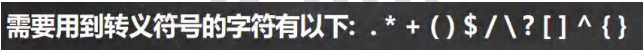
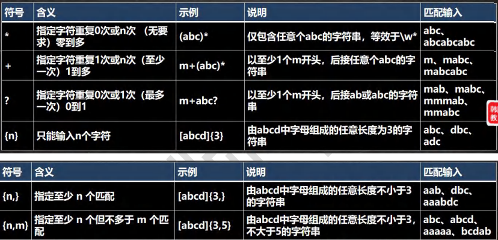

# 为什么要学习正则表达式


## 体验正则表达式

### 题目

```apl
1. 提取文章中所有的英文单词
2. 提取文章中所有的数字
3. 提取文章中所有的英文单词和数字
4. 提取百度热榜标题
```

### 案例

```java
//1. 先创建一个 Pattern 对象 ， 模式对象, 可以理解成就是一个正则表达式的规则对象
//Pattern pattern = Pattern.compile("[a-zA-Z]+");
//Pattern pattern = Pattern.compile("[0-9]+");
//Pattern pattern = Pattern.compile("([0-9]+)|([a-zA-Z]+)");
//Pattern pattern = Pattern.compile("<a target=\"_blank\" title=\"(\\S*)\"");
```

### 实例

```java
package com.Novice.regExp;


import java.util.regex.Matcher;
import java.util.regex.Pattern;

//体验正则表达式
public class regExp_ {
    public static void main(String[] args) {


        String content = "ava是一种广泛使用的计算机编程语言，拥有跨平台、面向对象、泛型编程的特性，广泛应用于企业级Web应用开发和移动应用开发。\n" +
                "\n" +
                "任职于Sun微系统的詹姆斯·高斯林等人于1990年代初开发Java语言的雏形，最初被命名为Oak，目标设置在家用电器等小型系统的编程语言，应用在电视机、电话、闹钟、烤面包机等家用电器的控制和通信。由于这些智能化家电的市场需求没有预期的高，Sun微系统放弃了该项计划。随着1990年代互联网的发展，Sun微系统看见Oak在互联网上应用的前景，于是改造了Oak，于1995年5月以Java的名称正式发布。Java伴随着互联网的迅猛发展而发展，逐渐成为重要的网络编程语言。\n" +
                "\n" +
                "Java编程语言的风格十分接近C++语言。继承了C++语言面向对象技术的核心，舍弃了容易引起错误的指针，以引用取代；移除了C++中的运算符重载和多重继承特性，用接口取代；增加垃圾回收器功能。在Java SE 1.5版本中引入了泛型编程、类型安全的枚举、不定长参数和自动装/拆箱特性。Sun微系统对Java语言的解释是：“Java编程语言是个简单、面向对象、分布式、解释性、健壮、安全、与系统无关、可移植、高性能、多线程和动态的语言”。\n" +
                "\n" +
                "Java不同于一般的编译语言或解释型语言。它首先将源代码编译成字节码，再依赖各种不同平台上的虚拟机来解释执行字节码，从而具有“一次编写，到处运行”的跨平台特性。在早期JVM中，这在一定程度上降低了Java程序的运行效率。但在J2SE1.4.2发布后，Java的执行速度有了大幅提升。\n" +
                "\n" +
                "与传统类型不同，Sun微系统在推出Java时就将其作为开放的技术。全球的Java开发公司被要求所设计的Java软件必须兼容。“Java语言靠群体的力量而非公司的力量”是Sun微系统的口号之一，并获得了广大软件开发商的认同。这与微软公司所倡导的注重精英和封闭式的模式完全不同，此外，微软公司后来推出了与之竞争的.NET平台以及模仿Java的C#语言。后来Sun微系统被甲骨文公司并购[14]，Java也随之成为甲骨文公司的产品。\n" +
                "\n" +
                "目前，移动操作系统Android大部分的代码采用Java编程语言编程。";

        //提取文章中所有的英文单词

        //1. 先创建一个Pattern模式对象，可以理解为一个正则表达式的规则对象
            Pattern compile = Pattern.compile("[a-zA-Z]+");
            //2. 创建一个匹配器对象，将数据位置匹配进group[]
            Matcher matches = compile.matcher(content);
            //3. 可以开始循环匹配
            while (matches.find()){//group[]不为空
                //匹配内容,文本，放到m.group(0)
                System.out.println("找到字母："+matches.group(0));
            }


        //提取文章中所有的数字
            //1. 先创建一个Pattern模式对象，可以理解为一个正则表达式对象
            Pattern compile1 = Pattern.compile("[0-9]+");
            //2. 创建一个匹配器对象
            Matcher matches1 = compile1.matcher(content);
            //3. 可以开始循环匹配
            while (matches1.find()){
                //匹配内容,文本，放到m.group(0)
                System.out.println("找到数字："+matches1.group(0));
            }


        //提取文章中所有的英文单词和数字
            //1. 先创建一个Pattern模式对象，可以理解为一个正则表达式对象
            Pattern compile2 = Pattern.compile("([0-9]+)|([a-zA-Z]+)");
            //2. 创建一个匹配器对象
            Matcher matches2 = compile2.matcher(content);
            //3. 可以开始循环匹配
            while (matches2.find()){
                //匹配内容,文本，放到m.group(0)
                System.out.println("找到英文字母和数字："+matches2.group(0));
            }

        //提取网页标题
            //1. 先创建一个Pattern模式对象，可以理解为一个正则表达式对象
            Pattern compile3 = Pattern.compile ("<a target=\"_blank\" title=\"(\\S*)\"");

            //2. 创建一个匹配器对象
            Matcher matches3 = compile3.matcher(content);
            //3. 可以开始循环匹配
            while (matches3.find()){
                //匹配内容,文本，放到m.group(1)
                System.out.println("标题："+matches3.group(1));
            }


        //提取IP地址

            Pattern pattern = Pattern.compile("\\d+\\.\\d+\\.\\d+ll.\\d+");

            Matcher matcher = pattern.matcher(content);

            while (matcher.find()){

                System.out.println("IP地址："+matches3.group(0));
            }
        
    }
}
```

## 再提出几个问题?

```apl
1. 给你一个字符串(或文章),请你找出所有四个数字连在一起的子串?
2. 给你一个字符串(或文章),请你找出所有四个数字连在一起的子串，
   并且这四个数字要满足:第一位与第四位相同,第二位与第三位相同，比如1221 ,5775
   
3. 请验证输入的邮件，是否符合电子邮件格式.
4. 请验证输入的手机号，是否符合手机号格式.
```

## 解决之道-正则表达式

```apl
1. 为了解决上述问题，Java提供了正则表达式技术，专门用于处理类似文本问题
2. 简单的说:正则表达式是对字符串执行模式匹配的技术。
3. 正则表达式:regular expression => RegExp
```


## 正则表达式基本概念

```apl
1. 一个正则表达式，就是用某种模式去匹配字符串的一个公式。
   可以把数小时辛苦而且易错的文本处理工作缩短在几分钟(甚至几秒钟)内完成

2. 强调,正则表达式不是只有java才有，
   实际上很多编程语言都支持正则表达式进行字符串操作
```

# 正则表达式底层实现

## 题目

```apl
有一段字符串(文本),请找出所有四个数字连在一起的子串， 

比如: 应该找到 1998 1999 3443 9889 ===> 分析底层实现
```

## 实例

```java
package com.Novice.regExp;


//分析java正则表达式的底层实现
import java.util.regex.Matcher;
import java.util.regex.Pattern;

public class regTheory {
    public static void main(String[] args) {


        String content = "1998年12月8日，第二代Java平台的企业版J2EE发布。1999年6月，Sun公司发布了"+
                "第二代Java平台（简称为Java2)的3个版本:J2WE(Java2 Micro Edition，Java2平台的微型"+
                "版)，应用于移动、无线及有限资源的环境;J2SE (Java 2 Standard Edition Java2平台的"+
                "标准版)，应用于桌面环境;J2EE (Java 2Enterprise Edition，Java 2平台的企业版)，应"+
                "用3443于基于Java的应用服务器。Java 2平台的发布，是Java发展过程中最重要的一个"+
                "里程碑，标志着Java的应用开始普及9889";

        //目标：匹配所有的4位数

        //1. \\d 表示任意一个数字
            String regStr = "(\\d\\d)(\\d\\d)";

        //2. 创建模式对象 【即正则表达式对象】，将规则引入 pattern
            Pattern pattern = Pattern.compile(regStr);

        //3. 创建匹配器
        //说明：创建匹配器master，按照正则表达式的规则，去匹配content字符串
            Matcher matcher = pattern.matcher(content);


        /*
          matcher.find() 完成的任务 （考虑分组）
            什么是分组，比如 (\d\d)(\d\d) ,正则表达式中有() 表示分组,第 1 个()表示第1 组,第2 个()表示第2组...
            * 1. 根据指定的规则 ,定位满足规则的子字符串(比如(19)(98))

            * 2. 找到后，将子字符串的开始的索引记录到 matcher 对象的属性 int[] groups;
                 2.1 groups[0] = 0 , 把该子字符串的结束的索引+1 的值记录到 groups[1] = 4
                 2.2 记录 1 组()匹配到的字符串 groups[2] = 0 groups[3] = 2
                 2.3 记录 2 组()匹配到的字符串 groups[4] = 2 groups[5] = 4
                 2.4.如果有更多的分组.....

            * 3. 同时记录 oldLast 的值为 子字符串的结束的 索引+1 的值即 35, 即下次执行find时，就从35开始匹配

            * matcher.group(0) 分析
            * 源码:
             public String group(int group) {
                 if (first < 0)
                    throw new IllegalStateException("No match found");
                 if (group < 0 || group > groupCount())
                    throw new IndexOutOfBoundsException("No group " + group);
                 if ((groups[group*2] == -1) || (groups[group*2+1] == -1))
                    return null;

                 return getSubSequence(groups[group * 2], groups[group * 2 + 1]).toString();
             }

            * 1. 根据 groups[0]=31 和 groups[1]=35 的记录的位置，从 content 开始截取子字符串返回
            * 就是 [31,35) 包含 31 但是不包含索引为 35 的位置
            *
            * 如果再次指向 find 方法.仍然安上面分析来执行
         */


        //4. 开始匹配
            while (matcher.find()){
                //小结
                //1. 如果正则表达式有() 即分组
                //2. 取出匹配的字符串规则如下
                //3. group(0) 表示匹配到的字符串
                //4. group(1) 表示匹配到的子字符串的第一组字串
                //5. group(2) 表示匹配到的子字符串的第 2 组字串
                //6. ... 但是分组的数不能越界
                System.out.println("找到4位数字: "+matcher.group(0));
                System.out.println("找到2位数字: "+matcher.group(1));
                System.out.println("找到2位数字: "+matcher.group(2));
            }


    }
}
```

## 底层图解


# 正则表达式语法


## 分组

### 说明


### 实例

```java
package com.Novice.regExp;

import java.lang.reflect.Parameter;
import java.util.regex.Matcher;
import java.util.regex.Pattern;

public class regExp07 {
    public static void main(String[] args) {

        String content = "asj2323 bsab1234 sad4552";
        String regStr = "(\\d\\d)(?<g2>\\d\\d)";

        Pattern pattern = Pattern.compile(regStr);
        Matcher matcher = pattern.matcher(content);

        while (matcher.find()){
            System.out.println("找到："+matcher.group(0));
            System.out.println("找到："+matcher.group(1));
            System.out.println("[按照组名]找到："+matcher.group("g2"));
        }
    }
}

```

```java
package com.Novice.regExp;

import java.util.regex.Matcher;
import java.util.regex.Pattern;

public class regExp08 {
    public static void main(String[] args) {

        String content = "你好abc 你好bcd 你好def你好fgh";
        //1. 输出对应的你好，以及你好在()中对应的字符串
        // String regStr = "你好(?:abc|bcd|def|fgh)"; 
        
        //2. 只会输出正则表达式中()前面的内容，
        // String regStr = "你好(?=abc|bcd|def)"; 
        
        //3. 只会输出正则表达式中()前面的内容，且只输出不包含()里面的内容的
        String regStr = "你好(?! abc|bcd|fgh)"; 
        

        Pattern pattern = Pattern.compile(regStr);
        Matcher matcher = pattern.matcher(content);

        while (matcher.find()){
            System.out.println("找到："+matcher.group(0));
            // System.out.println("找到："+matcher.group(1)); 
            //不捕获匹配的子表达式，所以只可以使用group(0)
        }


    }
}
```


## 元字符

### 基本介绍

```apl
如果要想灵活的运用正则表达式，必须了解其中各种元字符的功能，

元字符从功能上大致分为:
    1. 限定符
    2. 选择匹配符
    3. 分组组合和反向引用符
    4. 特殊字符
    5. 字符匹配符6．定位符
```

### 转义号 \\\

#### 说明

```apl
\\符号说明:
    在我们使用正则表达式去检索某些特殊字符的时候，需要用到转义符号，
    否则检索不到结果，甚至会报错的。

案例:
	用$去匹配'abc$('会怎样?
	用(去匹配'abc$('会怎样?
	
提示∶
	在Java的正则表达式中，\\代表其他语言中的一个\
```



#### 实例

```java
package com.Novice.regExp;

import java.util.regex.Matcher;
import java.util.regex.Pattern;

public class regExp02 {
    public static void main(String[] args) {

        String content = "abc$(abc(abc(123(";

        // String regStr = "."; //wrong 只是写一个小点代表匹配所有的字符
        // String regStr = "\\.";

        // String regStr = "("; //wrong
        String regStr = "\\(";

        Pattern pattern = Pattern.compile(regStr);

        Matcher matcher = pattern.matcher(content);

        while (matcher.find()){
            System.out.println("找到："+ matcher.group(0));
        }

    }
}
```


### 字符匹配符

#### 说明


#### 实例

```java
package com.Novice.regExp;

import java.util.regex.Matcher;
import java.util.regex.Pattern;

//演示字符匹配符的使用
public class regExp03 {
    public static void main(String[] args) {


        String content = "abc1 1#1d c8A BC";

        // String regStr = "[a-z]";//匹配a-z之间任意一个字符
        // String regStr = "[a-z]";//匹配A-Z之间任意一个字符
        // String regStr = "abc";//匹配abc字符串[默认区分大小写]
        // String regStr = "(?i)abc";//匹配abc字符串[不区分大小写]
        // String regStr = "a(?i)bc";//匹配abc字符串[a区分大小写bc不区分大小写]
        // String regStr = "a((?i)b)c";//匹配abc字符串[只有b不区分大小写]
        // String regStr = "[^a-z]{2}";//匹配不在a-z之间的两个连续字符
        // String regStr = "[abcd]{2}";//匹配abcd中任意两个任意顺的字符
        // String regStr = "\\D";//匹配[^0-9],即\\d的取反
        // String regStr = "\\w";//匹配[a-zA-z0-9]
        // String regStr = "\\s";//匹配任何空白字符，空格，制表符

        //．匹配出 \n 之外的所有字符,如果要匹配.本身则需要使用 \\.
        String regStr = ".";


        Pattern pattern = Pattern.compile(regStr);
        // Pattern pattern = Pattern.compile(regStr, Pattern.CASE_INSENSITIVE);
        //加入了Pattern.CASE_INSENSITIVE之后，同样不区分大小写
        Matcher matcher = pattern.matcher(content);
        while (matcher.find()){
            System.out.println("找到："+matcher.group(0));
        }
    }
}
```


### 选择匹配符

#### 说明

```apl
在匹配某个字符串的时候是选择性的，
即:既可以匹配这个，又可以匹配那个，
这时你需要用到选择匹配符号 |
```


#### 实例

```java
package com.Novice.regExp;

//选择匹配符

import java.util.regex.Matcher;
import java.util.regex.Pattern;

public class regExp04 {
    public static void main(String[] args) {

        String content = "nihao 你好 hello Hello";

        String regStr = "nihao|你好|hello";

        Pattern pattern = Pattern.compile(regStr);
        Matcher matcher = pattern.matcher(content);

        while (matcher.find()){
            System.out.println("找到："+matcher.group(0));
        }


    }
}
```


### 限定符

#### 说明

```apl
用于指定其前面的字符和组合项连续出现多少次
```



#### 实例

```java
package com.Novice.regExp;

import java.util.regex.Matcher;
import java.util.regex.Pattern;

public class regExp05 {
    public static void main(String[] args) {

        String content = "a2a111111aaaaaahello";

        //a{3},1{4},\\d{2}
        //String regStr = "a{3}";// 表示匹配 aaa
        //String regStr = "1{4}";// 表示匹配 1111
        //String regStr = "\\d{2}";// 表示匹配 两位的任意数字字符


        //a{3,4},1{4,5},\\d{2,5}
        //细节：java 匹配默认贪婪匹配 <-，即尽可能匹配多的
        //String regStr = "a{3,4}"; //表示匹配 aaa 或者 aaaa
        //String regStr = "1{4,5}"; //表示匹配 1111 或者 11111
        //String regStr = "\\d{2,5}"; //匹配 2 位数或者 3,4,5


        //1+
        //String regStr = "1+"; //匹配一个 1 或者多个 1
        //String regStr = "\\d+"; //匹配一个数字或者多个数字

        //1*
        //String regStr = "1*"; //匹配 0 个 1 或者多个 1

        //演示?的使用, 遵守贪婪匹配
        String regStr = "a1?"; //匹配 a 或者 a1


        Pattern pattern = Pattern.compile(regStr);
        Matcher matcher = pattern.matcher(content);

        while (matcher.find()){
            System.out.println(matcher.group(0));
        }


    }
}
```

### 定位符

#### 说明

```apl
定位符, 规定要匹配的字符串出现的位置，比如在字符串的开始还是在结束的位置，这个也是相当有用的，必须掌握 
```


#### 实例

```java
package com.Novice.regExp;

//演示 定位符 的使用

import java.util.regex.Matcher;
import java.util.regex.Pattern;

public class regExp06 {
    public static void main(String[] args) {

        String content = "1123-abc liupi haoliu liuliu";
              //就是规定整体文本开头和结尾.String字符串的开头与结尾
        // 一开始我以为是匹配到的串开头和结尾，tm原来是被匹配的整串.
        //加了定位符，应该加强了是对文本的校验需求，而非匹配搜寻,一般用来检验邮箱账号等
        // String regStr = "^[0-9]+[a-z]*"; //以至少一个数字开头，任意一个字母结尾

        // String regStr = "^[0-9]+[a-z]+$"; //以至少 1 个数字开头, 必须以至少一个小写字母结束

        // String regStr = "^[0-9]+\\-+[a-z]+$"; //中间必须有一个\\-

        //表示匹配边界的 han[这里的边界是指：被匹配的字符串最后,
        // 也可以是空格的子字符串的后面]
        // String regStr = "liu\\b";
        String regStr = "liu\\B";


        Pattern pattern = Pattern.compile(regStr);

        Matcher matcher = pattern.matcher(content);

        while (matcher.find()){
            System.out.println("找到："+matcher.group(0));
        }


    }
}
```


## 贪心与非贪心

### 概念


#### 实例

```java
package com.Novice.regExp;

//模型情况下是贪心匹配
//非贪婪匹配

import java.util.regex.Matcher;
import java.util.regex.Pattern;

public class regExp09 {
    public static void main(String[] args) {

        String content = "1111111(abc(123(";

        // String regStr = "\\d+"; //贪心匹配
        String regStr = "\\d+?"; //非贪心匹配


        Pattern pattern = Pattern.compile(regStr);

        Matcher matcher = pattern.matcher(content);

        while (matcher.find()){
            System.out.println("找到："+ matcher.group(0));
        }


    }
}
```


## 字符串验证

### 验证一

#### 题目

```apl
1. 汉字
2. 邮政编码_要求:
	是1-9开头的一个六位数.比如:123890
	
3. QQ号码_要求:
	是1-9开头的一个(5位数-10位数)比如:12389，1345687，187698765

4.手机号码_要求:
	必须以13,14,15,18开头的11位数，比如13588889999
```

#### 实例

```java
package com.Novice.应用实例;

import java.util.regex.Matcher;
import java.util.regex.Pattern;

public class regExp010 {
    public static void main(String[] args) {


    // 汉字
        String content = "你好中华";

        String regStr = "^[\u0391-\uffe5]+$";

        Pattern pattern = Pattern.compile(regStr);
        Matcher matcher = pattern.matcher(content);
        if (matcher.find()){
            System.out.println("格式正常");
        }else {
            System.out.println("格式有误");
        }

    // 邮政编码
        // 要求：
        // 1.是 1-9 开头的一个六位数. 比如：123890
        String content1 = "135456";

        String regStr1 = "^[1-9]+\\d{5}$";
        //要求开头的是数字，而且要以5个数字结尾，不包含开头的数字

        Pattern pattern1 = Pattern.compile(regStr1);
        Matcher matcher1 = pattern1.matcher(content1);
        if (matcher1.find()){
            System.out.println("格式正常");
        }else {
            System.out.println("格式有误");
        }


    // QQ 号码
        // 要求: 是 1-9 开头的一个(5 位数-10 位数)
        // 比如: 12389 , 1345687 , 18769876

        String content2 = "135456";

        String regStr2 = "^[1-9]+\\d{4,9}$";
        //要求开头的是数字，而且要以4到9个数字结尾，不包含开头的数字

        Pattern pattern2 = Pattern.compile(regStr2);
        Matcher matcher2 = pattern2.matcher(content2);
        if (matcher2.find()){
            System.out.println("格式正常");
        }else {
            System.out.println("格式有误");
        }

    // 手机号码
        // 要求: 必须以 13,14,15,18 开头的 11 位数 , 比如 13588889999
        String content3 = "1188889999";

        String regStr3 = "^1[3|4|5|8]+\\d{9}$";
        //要求开头的是数字，而且要以4到9个数字结尾，不包含开头的数字

        Pattern pattern3 = Pattern.compile(regStr3);
        Matcher matcher3 = pattern3.matcher(content3);
        if (matcher3.find()){
            System.out.println("格式正常");
        }else {
            System.out.println("格式有误");
        }


    }
}
```

### URL验证

#### 题目

```apl
5. URL: 
	https:/www.bilibili.com/video/BV1fh411y7R8from=search&seid=1831060912083761326
```

#### 实例

```java
package com.Novice.应用实例;

//演示正则表达式的使用

import java.util.regex.Matcher;
import java.util.regex.Pattern;

public class regExp011 {
    public static void main(String[] args) {


        String content ="https://manga.bilibili.com/?from=bill_top_mnav&spm_id_from=333.999.b_696e7465726e617#4696f6e616c486561646572.6";
        /*
          思路
          1. 先确定 url 的开始部分 https:// | http://
          2. 然后通过 ([\w-]+\.)+[\w-]+ 匹配 www.bilibili.com
          3. 通过(\/[\w-?=&/%.#]*)? 匹配/video/BV1fh411y7R8?from=sear
         */

        String regStr = "^((http|https)://)([\\w-]+\\.)+[\\w]+([\\/][\\w?=&#-._]*)?$";
        
        Pattern pattern = Pattern.compile(regStr);
        Matcher matcher = pattern.matcher(content);

        if (matcher.find()){
            System.out.println("满足格式");
        }else {
            System.out.println("不满足格式");
        }

    }
}

```


# 正则表达式三个常用类

## 概念

```apl
java.util.regex 包主要包括以下三个类 
Pattern类、Matcher类 和 PatternSyntaxException
```

```apl
Pattern类 ->传入规则
    pattern对象是一个正则表达式对象。
    Pattern类没有公共构造方法。
    要创建一个Pattern对象，调用其公共静态方法，它返回一个Pattern对象。
    该方法接受一个正则表达式作为它的第一个参数:
    比如:Pattern r=Pattern.compile(pattern);
```

```apl
Matcher类 ->传入文本
    Matcher对象是对输入字符串进行解释和匹配的引擎。
    与Pattern类一样，Matcher也没有公共构造方法。
    需要调用Pattern对象的matcher 方法来获得一个 Matcher对象
```

```apl
PatternSyntaxException
    PatternSyntaxException是一个非强制异常类，
    它表示一个正则表达式模式中的语法错误。
```

## 实例

```java
package com.Novice.应用实例;

//演示matches方法，验证输入的字符串，是否满足条件，而且该操作是对整体进行验证
//boolean matches = Pattern.matches(regStr, content);

import java.util.regex.Pattern;

public class PatternMethod {
    public static void main(String[] args) {

        String content = "你好 地球人 你好";
        
        String regStr = "你好";
        boolean matches = Pattern.matches(regStr, content);
         System.out.println(matches);//false
        
        //不使用定位符，就可以进行整体验证
        String regStr1 = ".*";
        boolean matches1 = Pattern.matches(regStr1, content);
        System.out.println(matches1);//true

    }
}
```

```java
package com.Novice.应用实例;

import java.util.regex.Matcher;
import java.util.regex.Pattern;


//matcher.start()
//matcher.end()
//matcher1.replaceAll("ABC")
//原始的content并不会发生改变

public class MatcherMethhod {
    public static void main(String[] args) {

        String content = "hello jack hello 笑话 hello 夏利 hello 兄案";
        String regStr = "hello";

        Pattern pattern = Pattern.compile(regStr);
        Matcher matcher = pattern.matcher(content);

        while (matcher.find()){
            System.out.println(matcher.start());
            System.out.println(matcher.end());
            System.out.println(content.substring(matcher.start(),matcher.end()));
        }


        String content1 = "hello jack hello 笑话 hello 夏利 hello 兄案";
        String regStr1 = "hello";

        Pattern pattern1 = Pattern.compile(regStr1);
        Matcher matcher1 = pattern1.matcher(content1);

        while (matcher1.find()){
            System.out.println("\n将所有的hello替换成ABC");
            System.out.println(matcher1.replaceAll("ABC"));

            System.out.println("\n原始的content并不会发生改变");
            System.out.println(content1);

        }
    }
}
```


# 分组、捕获、反向引用


## 需求

```apl
请看下面问题:
给你一段文本.请你找出所有四个数字连在一起的子串。
四个数字要满足：
    1. 第1位与第4位相同
    2. 第2位与第3位相同，比如 1221 , 5775 ,...
```

## 介绍

```apl
(\\d\\d)(\\d\\d)
要解决前面的问题,我们需要了解正则表达式的几个概念:
1．分组
我们可以用圆括号组成一个比较复杂的匹配模式，那么一个圆括号的部分我们可以看作是一个子表达式/一个分组。

2. 捕获
把正则表达式中子表达式/分组匹配的内容，保存到内存中以数字编号或显式命名的组里，
方便后面引用，从左向右，以分组的左括号为标志,
第一个出现的分组的组号为1，第二个为2，以此类推。组0代表的是整个正则式.

3. 反向引用
圆括号的内容被捕获后，可以在这个括号后被使用，从而写出一个比较实用的匹配模式，这个我们称为反向引用.

这种引用既可以是在正则表达式内部，也可以是在正则表达式外部.
    内部反向引用 '\\分组号'
    外部反向引用 '$分组号'
```


## 测试一

### 题目

```apl
1．要匹配两个连续的相同数字:(\\d)\\1
2. 要匹配五个连续的相同数字:(\\d)\\{4}
3. 要匹配个位与千位相同，十位与百位相同的数5225,1551 (\\d)(\\d)\\2\\1
```

### 实例

```java
package com.Novice.应用实例;


import java.util.regex.Matcher;
import java.util.regex.Pattern;

//反向引用
public class regExp012 {
    public static void main(String[] args) {


        String content = "hel55555lo 111111ja1234ck  tom1221 marry3223 12321-333999111";
        //1. String regStr = "(\\d)(\\d)\\2\\1";  //加上括号是因为,必须要捕获才可以使用反向引用

        //2.
        String regStr = "(\\d)\\1{4}";//匹配5个连续相同的数字


        Pattern pattern = Pattern.compile(regStr);
        Matcher matcher = pattern.matcher(content);

        while (matcher.find()){
            System.out.println("找到："+matcher.group(0));
        }


        //3.
        /*
        请在字符串中检索商品编号，形式如:12321-333999111 这样的号码，

        要求
            满足前面是一个五位数，然后一个-号，然后是一个九位数，连续的每三位要相同
         */

        // String regStr = "(\\d{5})\\-(\\d)\\2{2}(\\d)\\3{2}(\\d)\\4{2}";
    }
}
```


```apl
思考题:
	请在字符串中检索商品编号,形式如:12321-333999111这样的号码,
	要求满足前面是一个五位数,然后一个-号,然后是一个九位数,连续的每三位要相同
```


## 测试二

### 经典的结巴程序

```apl
把 类似 : "我....我要....学学学学....编程 java!";
通过正则表达式 修改成 "我要学编程 java" 
```

### 实例

```java
package com.Novice.应用实例;

import java.util.regex.Matcher;
import java.util.regex.Pattern;

public class regExp013 {
    public static void main(String[] args) {


        String content = "我...我要...学学学...编程java";

        ////1. 去掉所有的 \\.
        Pattern pattern = Pattern.compile("\\.");

        Matcher matcher = pattern.matcher(content);
        content = matcher.replaceAll("");

        //2. 去掉重复的字 我我要学学学学编程 java!
        // 思路
        //(1) 使用 (.)\\1+
        //(2) 使用 反向引用$1 来替换匹配到的内容
        // 注意：因为正则表达式变化，所以需要重置 matcher

    // pattern = pattern.compile("(.)\\1+");//分组的捕获内容记录到$1
    // matcher = pattern.matcher(content);
    //
    // //使用反向引用$1 来替换匹配到的内容
    // content = matcher.replaceAll("$1");


        //3. 使用一条语句去掉重复的字我我要学学学学编程java !
        content = pattern.compile("(.)\\1+").matcher(content).replaceAll("$1");
        System.out.println(content);


    }
}
```


# String 类中使用正则表达式

### 替换功能

```java
StringReg.java
String 类 public String replaceAll(String regex,String replacement)
```

### 判断功能

```java
String 类 public boolean matches(String regex){} 
//使用 Pattern 和 Matcher 类
```

### 分割功能

```java
String 类 public String[] split(String regex)
```

### 实例

```java
package com.Novice.应用实例;

import jdk.nashorn.internal.runtime.regexp.JdkRegExp;

public class StringReg {
    public static void main(String[] args) {

        String content = "2000年5月，JDK1.3、JDK1.4和J2SE1.3相继发布，几周后其"+
                "获得了Apple公司Mac OS X的工业标准的支持。2001年9月24日，J2EE1.3发" +"布。" +
                "2002年2月26日，J2SE1.4发布。自此Java的计算能力有了大幅提升";

        // content = content.replaceAll("JDK(?:1.3|1.4)","ABC");
        content = content.replaceAll("JDK1\\.3|JDK1\\.4","ABC");
        System.out.println(content);


        //要求验证一个手机号，要求必须是以138 139开头的
        content = "13834666571";
        boolean matches = content.matches("1(38|39)\\d{8}");//这里面填写的必须是在""里面的
        //此处填入的正则规则不用加入^,因为matches是整体匹配

        System.out.println(matches);


        //要求按照#或者–或者～或者数字来分割
        content = "hello#abc-jack12smith~北京";
        String[] a = content.split("#|-|~|\\d+");//split返回的是一个数组
        for (int i = 0; i < a.length; i++) {
            System.out.println(a[i]);
        }

    }
}
```


# 本章作业

## homeWork_01

```apl
验证电子邮件格式是否合法 
    规定电子邮件规则为
    1. 只能有一个@
    2. @前面是用户名,可以是a-z A-Z0-9_-字符
    3. @后面是域名,并且域名只能是英文字母，比如sohu.com或者tsinghua.org.cn4.
       写出对应的正则表达式,验证输入的字符串是否为满足规则
```

```java
package com.Novice.honeWork;

import java.util.regex.Matcher;
import java.util.regex.Pattern;

public class homeWork_01 {

    public static void main(String[] args) {

        //规定电子邮件规则为
        // 只能有一个@
        //@前面是用户名,可以是a-z A-Z 0-9_-字符
        //@后面是域名,并且域名只能是英文字母，比如 sohu.com或者 tsinghua.org.cnl
        //写出对应的正则表达式，验证输入的字符串是否为满足规则


        String content = "abc@jj.com";
        String regStr = "^[\\w-]+@([a-zA-Z]+\\.)+[a-zA-Z]+$";

        /*
        String 的 matches()
             public boolean matches(String regex) {
                return Pattern.matches(regex, this);
            }

      Pattern 的 mathes()
              public static boolean matches(String regex, CharSequence input) {
                Pattern p = Pattern.compile(regex);
                Matcher m = p.matcher(input);
                 return m.matches();
            }


         */
        boolean matches = content.matches(regStr);

    }
}
```

## homeWork_02

```apl
要求验证是不是整数或者小数
    提示: 这个题要考虑正数和负数
    比如: 123 -345 34.89-87.9 -0.01 0.45等
```

```java
package com.Novice.honeWork;

public class homeWork_02 {
    public static void main(String[] args) {

        String content = "0.78886";
        String regStr = "^[-+]?([[1-9]\\d+?]|[0])(\\.\\d+)?$";

        System.out.println(content.matches(regStr));

    }
}
```

## homeWork_03

```apl
对一个url进行解析 

http://www.sohu.com:8080/abc/index.htm
    a)要求得到协议是什么?	http
    b)域名是什么?		   www.sohu.com
    c)端口是什么?		   8080
    d)文件名是什么?		  index.htm
```

```java
package com.Novice.honeWork;

import java.util.regex.Matcher;
import java.util.regex.Pattern;

public class homeWork_03 {
    public static void main(String[] args) {

        String content = "http://www.sohu.com:8080/abc/xxx/yyy/index.htm";
        String regStr = "(http|https)://([a-zA-Z.]+):(\\d+)[\\w-/]+/([a-zA-Z.]+)";

        System.out.println(content.matches(regStr));
        Pattern pattern = Pattern.compile(regStr);
        Matcher matcher = pattern.matcher(content);

        if (matcher.matches()){
            System.out.println(matcher.group(0));
            System.out.println(matcher.group(1));
            System.out.println(matcher.group(2));
            System.out.println(matcher.group(3));
            System.out.println(matcher.group(4));
        }else {
            System.out.println("连接失败");
        }


    }
}
```

## Test

```java
package com.Novice.regExp;

public class Test {
    public static void main(String[] args) {


        String str = "abcdef";
        System.out.println(str.substring(0,4));//0,1,2,3 -> abcd

    }
}
```

