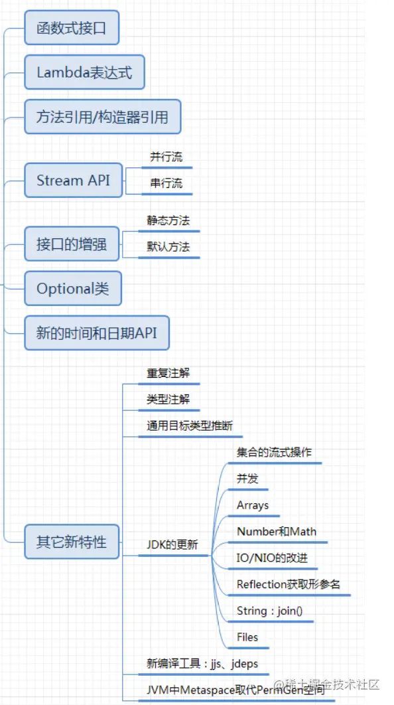
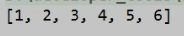

# Java 8新特性汇总



**Java 8的改进**

```apl
1. （增加了新的语法：Lambda表达式）速度更快,代码更少
2. 引入强大的 `Stream APl`,便于并行
3. 最大化减少空指针异常：`Optional`
```

```apl
- `Nashorn` 引擎，允许在JVM上运行 `JS` 应用
- 并行流就是把一个内容分成多个数据块，并用不同的线程分别处理每个数据块的流。
- 相比较串行的流，并行的流可以很大程度上提高程序的执行效率。
- Java 8中将并行进行了优化，我们可以很容易的对数据进行并行操作。
- `Stream API` 可以声明性地通过 `parallel()` 与 `sequential()` 在并行流与顺序流之间进行切换
```


# Lambda 表达式

##  概述

```apl
Lambda 是一个匿名函数，可以把 Lambda 表达式理解为是一段可以传递的代码（将代码像数据一样进行传递）。
使用它可以写出更简洁、更灵活的代码。
作为一种更紧凑的代码风格，使 Java 的语言表达能力得到了提升。
```


##  前后使用对比

### 示例一

调用 Runable 接口

```java
@Test
public void test1(){
    
    //未使用Lambda表达式的写法
        Runnable r1 = new Runnable() {
            @Override
            public void run() {
                System.out.println("hello Lambda!");
            }
        };
        r1.run();

  
    //Lamdba表达式写法
        Runnable r2 = () -> System.out.println("hi Lambda!");
        r2.run();
}
```

### 示例二

使用Comparator接口

```java
@Test
public void compare(){
    //1. 未使用Lambda表达式的写法
        Comparator<Integer> com1 = new Comparator<Integer>() {
            @Override
            public int compare(Integer o1, Integer o2) {
                return Integer.compare(o1,o2);
            }
        };

        int compare1 = com1.compare(12, 32);
        System.out.println(compare1);//-1

    

    //2. Lambda表达式的写法
        Comparator<Integer> com2 = (o1,o2) -> Integer.compare(o1,o2);

        int compare2 = com2.compare(54, 21);
        System.out.println(compare2);//1

    

    //3. 方法引用
        Comparator<Integer> cpm3 = Integer::compareTo;
        int compare3 = cpm3.compare(12, 12);
        System.out.println(compare3);//0
}
```

## 使用方法

###  基本语法

```apl
1.举例： (o1,o2) -> Integer.compare(o1,o2);

2.格式：
    '->' lambda 操作符 或 箭头操作符
    '->' 左边：lambda 形参列表 （其实就是接口中的抽象方法的形参列表）
    '->' 右边：lambda 体（其实就是重写的抽象方法的方法体）
```


### 6种使用情况


#### 1. 无参，无返回值

```java
Runnable r1 = () -> {
    System.out.println(“hello Lamdba!”)
}
```


#### 2. 有参，无返回值

```java
Consumer<String> con = (String str) -> {
    System.out.println(str)
}
```


#### 3. 数据类型省略

因为可由编译器推断得出，称为类型推断

```java
Consumer<String> con = (str) -> {
    System.out.println(str)
}
```


#### 4. 小括号省略

Lamdba若只需要一个参数时

```java
Consumer<String> con = str -> {
    System.out.println(str)
}
```


#### 5. 多参，多执行语句，有返回值

Lamdba需要两个以上的参数，多条执行语句，并且可以有返回值

```java
Comparator<Integer>com = (o1,o1) -> {
	Syste.out.println("Lamdba表达式使用");
    return Integer.compare(o1,o2);
}
```


#### 6. return 与 大括号 的省略

 Lamdba体只有一条语句时，return和大括号若有

```java
Comparator<Integer>com = (o1,o1) ->	Integer.compare(o1,o2);
```


#### 应用实例

```java
public class LamdbaTest2 {
```

```java
 //语法格式一：无参，无返回值
    @Test
    public void test1() {
        //1. 未使用Lambda表达式
            Runnable r1 = new Runnable() {
                @Override
                public void run() {
                    System.out.println("Hello Lamdba");
                }
            };
            r1.run();
       
        
        //2. 使用Lambda表达式
            Runnable r2 = () -> {
                System.out.println("Hi Lamdba");
            };
            r2.run();
    }
```

```java
 //语法格式二：Lambda 需要一个参数，但是没有返回值。
    @Test
    public void test2() {
       //1. 未使用Lambda表达式
            Consumer<String> con = new Consumer<String>() {
                @Override
                public void accept(String s) {
                    System.out.println(s);
                }
            };
            con.accept("你好啊Lambda！");
       
        
        
        //2. 使用Lambda表达式
            Consumer<String> con1 = (String s) -> {
                System.out.println(s);
            };
            con1.accept("我是Lambda");

    }
```

```java
    //语法格式三：数据类型可以省略，因为可由编译器推断得出，称为“类型推断”
    @Test
    public void test3() {
        //1. 未使用Lambda表达式
            Consumer<String> con = new Consumer<String>() {
                @Override
                public void accept(String s) {
                    System.out.println(s);
                }
            };
            con.accept("你好啊Lambda！");
       
        
        
        //2. 使用Lambda表达式
            Consumer<String> con1 = (s) -> {
                System.out.println(s);
            };
            con1.accept("我是Lambda");
    }
```

```java
 @Test
	//类型推断
    public void test(){
        ArrayList<String> list = new ArrayList<>();//类型推断，用左边推断右边
        int[] arr = {1,2,3,4};//类型推断，用左边推断右边
    }
```

```java
 //语法格式四：Lambda 若只需要一个参数时，参数的小括号可以省略
    @Test
    public void test4() {
      	//1. 未使用Lambda表达式
            Consumer<String> con = new Consumer<String>() {
                @Override
                public void accept(String s) {
                    System.out.println(s);
                }
            };
            con.accept("你好啊Lambda！");
        
        
        
         //2. 使用Lambda表达式
            Consumer<String> con1 = s -> {
                	System.out.println(s);
            };
            con1.accept("我是Lambda");
    }
```

```java
//语法格式五：Lambda 需要两个或以上的参数，多条执行语句，并且可以有返回值
    @Test
    public void test5() {
       //1. 未使用Lambda表达式
            Comparator<Integer> com1 = new Comparator<Integer>() {
                @Override
                public int compare(Integer o1, Integer o2) {
                    System.out.println(o1);
                    System.out.println(o2);
                    return Integer.compare(o1, o2);
                }
            };
            System.out.println(com1.compare(23, 45));
        
        
        
        
         //2. 使用Lambda表达式
            Comparator<Integer> com2 = (o1, o2) -> {
                System.out.println(o1);
                System.out.println(o2);
                return o1.compareTo(o2);
            };
            System.out.println(com2.compare(23, 12));
    }
```

```java
  //语法格式六：当 Lambda 体只有一条语句时，return 与大括号若有，都可以省略
    @Test
    public void test6() {
       //1. 未使用Lambda表达式
            Comparator<Integer> com1 = new Comparator<Integer>() {
                @Override
                public int compare(Integer o1, Integer o2) {
                    return Integer.compare(o1, o2);
                }
            };
            System.out.println(com1.compare(23, 45));
        
        
        
        //2. 使用Lambda表达式
        Comparator<Integer> com2 = (o1, o2) -> o1.compareTo(o2);

        System.out.println(com2.compare(23, 12));
    }
```

```java
    @Test
    public void test7(){
        //1. 未使用Lambda表达式
            Consumer<String> con1 = new Consumer<String>() {
                @Override
                public void accept(String s) {
                    System.out.println(s);
                }
            };
        	con1.accept("hi!");
       
        
        
        //使用Lambda表达式
            Consumer<String> con2 = s -> System.out.println(s);
            con2.accept("hello");
    }
```

```java
}
```

## 总结

- `->` 左边：

  - lambda 形参列表的参数类型可以省略(类型推断)；
  - 如果 lambda 形参列表只有一个参数，其一对 `()` 也可以省略。
  - 如果没有参数或者有两个以上的的参数，那么就不要省略

  

- `->` 右边：lambda 体

  - 应该使用一对 `{}` 包裹；
  - 如果 lambda 体只有一条执行语句（可能是 `return` 语句），省略这一对 `{}` 和 `return` 关键字
  - (大括号可以省可不省，但是省略大括号一定要省略return)

### 使用条件

- Lambda 表达式的本质：作为==函数式接口==的实例对象
- **如果一个接口中，只声明了一个抽象方法，则此接口就称为函数式接口**。
- 我们可以在一个接口上使用 ==`@FunctionalInterface`== 注解，这样做可以检查它是否是一个函数式接口。
- 因此以前用匿名实现类表示的现在都可以用 Lambda 表达式来写。


```apl
lambaba表达式针对的都是接口，相当于堆接口提供实现类的对象时，使用到了lambaba表达式
该接口只能有一个抽象方法，因为只有一个抽象方法，所以在提供实例的时候，
就们没有必要知道方法的名字是什么，只需要保留必要的额部分就可以了

形参列表的变量名(变量类型可以由左部决定所以也可以不写)

要向使用lambda表达式就需要函数式接口
```


# 函数式接口

## 概述

- 只包含一个抽象方法的接口，称为函数式接口。
- 可以通过 Lambda 表达式来创建该接口的对象。（若 Lambda 表达式抛出一个受检异常（即：非运行时异常），那么该异常需要在目标接口的抽象方法上进行声明）。
- 可以在一个接口上使用 `@FunctionalInterface` 注解，这样做可以检查它是否是一个函数式接口。同时 `javadoc` 也会包含一条声明，说明这个接口是一个函数式接口。
- Lambda 表达式的本质：作为函数式接口的实例
- 在 `java.util.function` 包下定义了Java 8的丰富的函数式接口

## 自定义函数式接口

```java
@FunctionalInterface
public interface MyInterface {
    void method1();
}
```


## Java内置函数式接口

### 四大核心函数式接口


#### 应用实例

```java
import org.junit.Test;

import java.util.ArrayList;
import java.util.Arrays;
import java.util.List;
import java.util.function.Consumer;
import java.util.function.Predicate;

/**
 * java内置的4大核心函数式接口
 *
 * 消费型接口 Consumer<T>     void accept(T t)
 * 供给型接口 Supplier<T>     T get()
 * 函数型接口 Function<T,R>   R apply(T t)
 * 断定型接口 Predicate<T>    boolean test(T t)
 */
public class LambdaTest2 {

    public void happyTime(double money, Consumer<Double> con) {
        con.accept(money);
    }

    @Test
    public void test(){
        happyTime(30, new Consumer<Double>() {
            @Override
            public void accept(Double aDouble) {
                System.out.println("熬夜太累了，点个外卖，价格为：" + aDouble);
            }
        });
        System.out.println("+++++++++++++++++++++++++");

        //Lambda表达式写法
        happyTime(20,money -> System.out.println("熬夜太累了，吃口麻辣烫，价格为：" + money));
    }

    
    
    
    //根据给定的规则，过滤集合中的字符串。此规则由Predicate的方法决定
    public List<String> filterString(List<String> list, Predicate<String> pre){

        ArrayList<String> filterList = new ArrayList<>();
        
        for(String s : list){
            if(pre.test(s)){
                filterList.add(s);
            }
        }
        return filterList;

    }

    @Test
    public void test2(){
        List<String> list = Arrays.asList("长安","上京","江南","渝州","凉州","兖州");

        List<String> filterStrs = filterString(list, new Predicate<String>() {
            @Override
            public boolean test(String s) {
                return s.contains("州");
            }
        });

        System.out.println(filterStrs);

        List<String> filterStrs1 = filterString(list,s -> s.contains("州"));
        System.out.println(filterStrs1);
    }
}
```


```java
public class LambdaTest3 {
    //    消费型接口 Consumer<T>     void accept(T t)
    @Test
    public void test1() {
        //未使用Lambda表达式
        Learn("java", new Consumer<String>() {
            @Override
            public void accept(String s) {
                System.out.println("学习什么？ " + s);
            }
        });
        
        System.out.println("====================");
        
        //使用Lambda表达
        Learn("html", s -> System.out.println("学习什么？ " + s));

    }

    private void Learn(String s, Consumer<String> stringConsumer) {
        stringConsumer.accept(s);
    }

    
    
    
    
    //    供给型接口 Supplier<T>     T get()
    @Test
    public void test2() {
        //未使用Lambdabiaodas
        Supplier<String> sp = new Supplier<String>() {
            @Override
            public String get() {
                return new String("我能提供东西");
            }
        };
        System.out.println(sp.get());
        
        System.out.println("====================");
        
        //使用Lambda表达
        Supplier<String> sp1 = () -> new String("我能通过lambda提供东西");
        System.out.println(sp1.get());
    }

    
    
    
    
    //函数型接口 Function<T,R>   R apply(T t)
    @Test
    public void test3() {
        //使用Lambda表达式
        Employee employee = new Employee(1001, "Tom", 45, 10000);

        Function<Employee, String> func1 =e->e.getName();
        System.out.println(func1.apply(employee));
        System.out.println("====================");

        //使用方法引用
        Function<Employee,String>func2 = Employee::getName;
        System.out.println(func2.apply(employee));

    }
    
    
    
    

    //断定型接口 Predicate<T>    boolean test(T t)
    @Test
    public void test4() {
        //使用匿名内部类
        Function<Double, Long> func = new Function<Double, Long>() {
            @Override
            public Long apply(Double aDouble) {
                return Math.round(aDouble);
            }
        };
        System.out.println(func.apply(10.5));
        
        System.out.println("====================");

        //使用Lambda表达式
        Function<Double, Long> func1 = d -> Math.round(d);
        System.out.println(func1.apply(12.3));
        
        System.out.println("====================");

        //使用方法引用
        Function<Double,Long>func2 = Math::round;
        System.out.println(func2.apply(12.6));

    }
}
```

### 其他函数式接口


## 总结

### lambda表达式使用时机？

```apl
当需要对一个'函数式接口实例化'的时候，使用 lambda 表达式。
```


### 函数式接口使用时机？

```apl
如果我们开发中需要定义一个函数式接口，
首先看看在已有的jdk提供的函数式接口是否提供了能满足需求的函数式接口
如果有，则直接调用即可，不需要自己再自定义了。
```


# 方法的引用

## 概述

```APL
当要传递给Lambda体的操作，已经有实现的方法了，可以使用方法引用
```

```apl
方法引用可以看做是 Lambda 表达式深层次的表达。

换句话说，方法引用就是 Lambda 表达式，也就是函数式接口的一个实例，通过方法的名字来指向一个方法。
```


## 使用条件与建议

```apl
当要传递给 Lambda 体的操作，已经有实现的方法了，可以使用方法引用！
```

```apl
如果给函数式接口提供实例，恰好满足方法引用的使用情境，就可以考虑使用方法引用给函数式接口提供实例。
如果不熟悉方法引用，那么还可以使用 lambda 表达式。
```


## 3种使用情况


```apl
 '对象 :: 非静态方法 -> 实例方法'
   '类 :: 静态方法'
   '类 :: 非静态方法'
```


###  情况1 

#### 格式

```apl
'对象 :: 非静态方法'

(非静态方法-> 实例方法)
```

#### 使用要求

```apl
要求接口中的抽象方法的 形参列表 和 返回值类型 与 方法引用的 方法的形参列表和返回值类型相同
```

#### 应用实例

```java
// 情况一：对象 :: 实例方法
    //Consumer中的void accept(T t)
    //PrintStream中的void println(T t) ->非静态方法(实例方法)
    
    //方法引用，本质上就是Lambda表达式，而Lambda表达式作为函数式接口的实例。所以方法引用,也是函数式接口的实例。
    @Test
    public void test1() {
        //1. 使用Lambda表达
            Consumer<String> con1 = str -> System.out.println(str);
            con1.accept("中国");
        
       

        //2. 使用方法引用
            //对象调用非静态方法
                PrintStream ps = System.out;
            //::左边的是类/(对象) 相当于调用者
            //println()需要调用者，
            //这里就是使用的system.out.返回的一个打印流的对象作为调用者
            //::右边直接写被调用的方法的方法名，参数列表也不用写
                Consumer<String> con2 = ps::println;
                con2.accept("China");//因为参数保持一致，所以参数就不在写，直接在调用对象的时候直接传入实参

    }

    
    
    
    
    //Supplier中的T get() ->无参有返回值
    //Employee中的String getName() 与上面的抽象类方法相似
    @Test
    public void test2() {
        
        Employee emp = new Employee(1001, "Bruce", 34, 600);
        
        //1. 使用Lambda表达
            Supplier<String> sup1 = () -> emp.getName();
            System.out.println(sup1.get());

       

        //2. 使用方法引用
            Supplier<String> sup2 = emp::getName;
            System.out.println(sup2.get());

    }
```


###  情况2

#### 格式

```apl
'类 :: 静态方法'
```


#### 使用要求

```apl
要求接口中的抽象方法的 形参列表 和 返回值类型 与 方法引用的 方法的形参列表和返回值类型相同
```

#### 应用实例

```java
// 情况二：类 :: 静态方法
    //Comparator中的int compare(T t1,T t2)
    //Integer中的int compare(T t1,T t2)
    
    //接口的comppar方法与Integer的compare方法的形参列表相同
    //所以在使用方法引用时，不用使用形参引用
    @Test
    public void test3() {
        //1. 使用Lambda表达
            Comparator<Integer> com1 = (t1, t2) -> Integer.compare(t1, t2);
            System.out.println(com1.compare(32, 45));
        
        
        

        //2. 使用方法引用
            Comparator<Integer> com2 = Integer::compareTo;
            System.out.println(com2.compare(43, 34));
    }
    
    
    
    
    

    //Function中的R apply(T t)
    //Math中的Long round(Double d)
    @Test
    public void test4() {
        
        //使用匿名内部类
            Function<Double, Long> func = new Function<Double, Long>() {//传入一个类型返回一个类型
                @Override
                public Long apply(Double aDouble) {
                    return Math.round(aDouble);//返回的是long类型
                }
            };
            System.out.println(func.apply(10.5));
        
       
        

        //1. 使用Lambda表达
            Function<Double, Long> func1 = d -> Math.round(d);
            System.out.println(func1.apply(12.3));//调用接口的方法，用该方法调用Math.round()静态方法
        
        
        

        //2. 使用方法引用
            Function<Double, Long> func2 = Math::round;
            System.out.println(func2.apply(12.6));

    }
```


### 情况3 

#### 格式

```apl
'类 :: 非静态方法'
```

#### 使用要求

```apl
当函数式接口方法的第一个参数是 '需要引用方法的调用者'，
并且第二个参数是 '需要引用方法的参数(或无参数)'时：`ClassName::methodName`
```

#### 应用实例

```java
// 情况三：类 :: 实例方法
    // Comparator中的int comapre(T t1,T t2)
    // String中的int t1.compareTo(t2)
    @Test
    public void test5() {
        
        //1. 使用Lambda表达
            Comparator<String> com1 = (s1, s2) -> s1.compareTo(s2);
            System.out.println(com1.compare("abd", "aba"));
        
        

        //2. 使用方法引用
            Comparator<String> com2 = String::compareTo;
            System.out.println(com2.compare("abd", "abc"));
    }

    
    
    
    
    
    //BiPredicate中的boolean test(T t1, T t2);
    //String中的boolean t1.equals(t2)
    @Test
    public void test6() {
        
        //1. 使用Lambda表达式
            BiPredicate<String, String> pre1 = (s1, s2) -> s1.equals(s2);
            System.out.println(pre1.test("abc", "abc"));
        
        
        

        //2. 使用方法引用
            BiPredicate<String, String> pre2 = String::equals;
            System.out.println(pre2.test("abc", "abd"));

    }
    
    
    
    
    
    

    // Function中的R apply(T t)
    // Employee中的String getName();
    @Test
    public void test7() {
        
        
        Employee emp = new Employee(1001, "Tom", 45, 10000);

        //1. 使用Lambda表达
            Function<Employee, String> func1 = e -> e.getName();
            System.out.println(func1.apply(emp));
        
        

        //2. 使用方法引用
            Function<Employee,String> func2 = Employee :: getName;
            System.out.println(func2.apply(emp));
    }
```


# 构造器和数组的引用

## 构造器引用

### 格式

```apl
类名 :: new
```


### 使用要求

```apl
和方法引用类似，函数式接口的 抽象方法的 形参列表 和 构造器的 形参列表一致。
抽象方法的 返回值类型 即为 构造器所属的 类的 类型
```


### 应用实例

```java
//构造器引用
//Supplier中的T get()
//employeede 空参构造器：Employee()
@Test
public void test1() {//供给型接口，返回一个对象
    //1. 使用匿名内部类
        Supplier<Employee> sup = new Supplier<Employee>() {
            @Override
            public Employee get() {
                return new Employee();
            }
        };
        System.out.println(sup.get());
    
   
    
    
     //2. 使用Lambda表达式
        Supplier<Employee> sup1 = () -> new Employee(1001, "Tom", 43, 13333);
        System.out.println(sup1.get());


    
    //3. 构造器方法引用，调用无参构造
        Supplier<Employee> sup2 = Employee::new;
        System.out.println(sup2.get());

}
```

```java
//Function中的R apply(T t)
@Test
public void test2() {
    
    //1. 使用Lambda表达式
        Function<Integer, Employee> func1 = id -> new Employee(id);
        Employee employee = func1.apply(1001);
        System.out.println(employee);

   

    //2. 使用方法引用
        Function<Integer, Employee> func2 = Employee::new;
        Employee employee1 = func2.apply(1002);
        System.out.println(employee1);

}
```

```java
//BiFunction中的R apply(T t,U u)
@Test
public void test3() {
    //1. 使用Lambda表达式
        BiFunction<Integer, String, Employee> func1 = (id, name) -> new Employee(id, name);
        System.out.println(func1.apply(1001, "Tom"));
    
    

    //2. 使用方法引用
        BiFunction<Integer, String, Employee> func2 = Employee::new;
        System.out.println(func2.apply(1002, "Jarry"));
}
```


## 数组的引用

### 格式

```apl
数组类型 [] :: new
```


### 使用要求

```apl
可以把数组看做是一个特殊的类，则写法与构造器引用一致。
```

### 应用实例

```java
//数组引用
//Function中的R apply(T t)
@Test
public void test4() {
    
    //1. 使用Lambda表达式
        Function<Integer, String[]> func1 = length -> new String[length];
        String[] arr1 = func1.apply(5);
        System.out.println(Arrays.toString(arr1));

    

    //2. 使用方法引用
        Function<Integer,String[]> func2 = String[] :: new;
        String[] arr2 = func2.apply(10);  //如果可以传入参数，那一定是因为接口里面有相关定义
        System.out.println(Arrays.toString(arr2));
}
```

# StreamAPI

##  概述

```apl
Stream 关注的是对数据的运算，与 CPU 打交道;集合关注的是数据的存储，与内存打交道;
Java 8 提供了一套 api ，使用这套 api 可以对内存中的数据进行过滤、排序、映射、归约等操作。
类似于 sql 对数据库中表的相关操作。
Stream 是数据渠道，用于操作数据源（集合、数组等）所生成的元素序列。集合讲的是数据， Stream讲的是计算！
Stream API对集合数据进行操作，就类似于使用 SQ执行的数据库查询。
```

```apl
实际开发中，项目中多数数据源都来自于Mysql，Oracle等。
但现在数据源可以更多了，有MongDB，Radis等，而这些NoSQL的数据就需要Java层面去处理。

Stream和 Collection集合的区别:
Collection是一种静态的内存数据结构(容器)，而 Stream是有关计算的。
前者是主要面向内存，存储在内存中,(集合的作用主要是操作数据)
后者主要是面向CPU，通过CPU 实现计算。(Stream讲的是计算)
```

```apl
# Stream就是用来操作容器的
```


##  使用流程

① Stream 的实例化   (创建Stream对象)

② 一系列的中间操作（过滤、映射、...)

③ 终止操作


## 注意事项

① `Stream` 自己不会存储元素。

② `Stream` 不会改变源对象。相反，他们会返回一个持有结果的新 `Stream`。

③ `Stream` 操作是延迟执行的。这意味着他们会等到需要结果的时候才执行。

```apl
只要不调用终止操作，终止操作就不会执行

一旦调用了终止操作，就不能在使用该对象调前面的中间操作了
```


## 3个流程操作

###  Stream四种创建方式

#### 1. 通过 集合

Java 8的 `Collection` 接口被扩展，提供了两个获取流的方法：

- `default Stream\<E> stream()` : 返回一个顺序流
- `default Stream\<E> parallelStream()` : 返回一个并行流

```java
 //创建 Stream方式一：通过集合(集合是一种容器)
    @Test
    public void test1() {
        //employees是一个list集合
        List<Employee> employees =EmployeeData.getEmployees();
        
        //1. 返回一个 "顺序流"
        	//default Stream<E> stream();
            Stream<Employee> stream = employees.stream();  //非并行取数据时，按照集合的顺序来

        //2. 返回一个"并行流"
        	//default Stream<E> parallelStream();
            Stream<Employee> employeeStream = employees.parallelStream();  //由于并行取出数据，顺序可能就不一致了
    }
```

#### 2. 通过 数组

Java 8中的 `Arrays` 的静态方法 `stream()` 可以获取数组流

- 调用 `Arrays` 类的 `static\<T> Stream\<T> stream(T[] array)`: 返回一个流
- 重载形式，能够处理对应基本类型的数组：
  - `public static IntStream stream（int[] array）`
  - `public static LongStream stream（long[] array）`
  - `public static DoubleStream stream（double[] array）`

```java
//创建 Stream方式二：通过数组(数组是一种容器)
    @Test
    public void test2() {
        
        //1. 基本类型数组
        	int[] arrs = {1, 2, 3, 6, 2};
        //调用Arrays类的static <T> Stream<T> stream(T[] array): 返回一个流
            IntStream stream = Arrays.stream(arrs);  //IntStream <-
        
        
        //2. Employee类型数组
            Employee[] employees = 
                    {new Employee(1001, "Tom"), new Employee(1002, "Jerry")};//静态初始化       
        	Stream<Employee> stream1 = Arrays.stream(employees);  //Stream<Employee> <-
    }
```

#### 3. 通过Stream的of()方法

现造一个

可以调用Stream类静态方法 of( ) ，通过显示值创建一个流。可以用于接收任意数量的参数

- `public static \<T>Stream\<T> of(T...values)`:返回一个流

```java
 //创建 Stream方式三：通过Stream的of()
    @Test
    public void test3() {
        Stream<Integer> integerStream = Stream.of(12, 34, 45, 65, 76);
    }
```

#### 4. 创建无限流

特殊情况造数据

- 迭代: `public static\<T> Stream\<T> iterate(final T seed, final UnaryOperator\<T> f)`
- 生成: `public static\<T> Stream\<T> generate(Supplier\<T> s)`

```java
    //创建 Stream方式四：创建无限流
    @Test
    public void test4() {

        //1. 迭代
            //public static<T> Stream<T> iterate(final T seed(种子), final UnaryOperator<T>(函数式接口) f)

            //遍历前10个偶数
                //无限迭代
                	Stream.iterate(0, t -> t + 2);
                //无限制迭代输出，(使用了方法引用）
                	Stream.iterate(0, t -> t + 2).forEach(System.out::println);
                //有限制迭代输出(限制10个)
                	Stream.iterate(0, t -> t + 2).limit(10).forEach(System.out::println);

        
        //2. 生成
            //public static<T> Stream<T> generate(Supplier<T> s)
            Stream.generate(Math::random).limit(10).forEach(System.out::println);
    }
}
```


### 中间操作

```apl
多个中间操作可以连接起来形成一个流水线，除非流水线上触发终止操作，否则中间操作不会执行任何的处理！
而在终止操作时一次性全部处理，称为'惰性求值'。
```


#### 筛选与切片


##### 代码示例:

```java
//1-筛选与切片,注意执行终止操作后，Stream流就被关闭了，使用时需要再次创建Stream流
@Test
public void test1(){
    //获取集合
    	List<Employee> employees = EmployeeData.getEmployees();
    
    //获取流对象
    	Stream<Employee> employeeStream = employees.stream();
    
    //1. filter(Predicate p)——筛选 ，接收Lambda并从流中筛选某些元素。
   	 //练习：查询员工表中薪资大于7000的员工信息
    	employeeStream.filter(e -> e.getSalary() > 7000).forEach(System.out::println);//forEach就是终止操作

    
    //2. limit(n)——截断流，使其元素不超过给定数量。 	
    	//employeeStream.limit(3).forEach(System.out::println);  // -> wrong
    	//因为上面执行了终止操作，所以下面的语句要执行就需要建立新的流
        employees.stream().forEach(System.out::println);
        System.out.println();

    
    //3. skip(n) —— 跳过元素，返回一个扔掉了前 n 个元素的流。若流中元素不足 n 个，则返回一个空流。
        //employeeStream.skip(3).forEach(System.out::println);
        employees.stream().skip(3).forEach(System.out::println);
    
    
    //4. distinct()——去重，通过流所生成元素的 hashCode() 和 equals() 去除重复元素
        employees.add(new Employee(1010,"刘庆东",56,8000));
        employees.add(new Employee(1010,"刘庆东",56,8000));
        employees.add(new Employee(1010,"刘庆东",56,8000));
        employees.add(new Employee(1010,"刘庆东",56,8000));
        //employeeStream.distinct().forEach(System.out::println);
        employees.stream().distinct().forEach(System.out::println);
}
```


 

#### 映射


##### 代码示例:

```java
//映射

@Test
public void test2(){
    List<String> list = Arrays.asList("aa", "bb", "cc", "dd");
    
    //1. map(Function f)——接收一个函数作为参数，将元素转换成其他形式或提取信息，该函数会被应用到每个元素上，并将其映射成一个新的元素。
    list.stream().map(str -> str.toUpperCase()).forEach(System.out::println);

    //练习1：获取员工姓名长度大于3的员工的姓名。
    List<Employee> employees = EmployeeData.getEmployees();
    //通过映射获取姓名流
    Stream<String> nameStream = employees.stream().map(Employee::getName);
    //通过筛选获取姓名长度>3的姓名流
    nameStream.filter(name -> name.length() >3).forEach(System.out::println);
```

##### map()和flatMap()对比

```java
 //练习2：使用map()中间操作实现flatMap()中间操作方法
        Stream<Stream<Character>> streamStream = 
            list.stream().map(StreamAPITest2(类名)::fromStringToStream);
	//下面的操作类似于for循环嵌套，让所有的元素按照平等地位输出
        streamStream.forEach(s ->{
            s.forEach(System.out::println);
        });
        System.out.println();

    //flatMap(Function f)——接收一个函数作为参数，将流中的每个值都换成另一个流，然后把所有流连接成一个流。
        Stream<Character> characterStream = 
            list.stream().flatMap(StreamAPITest2::fromStringToStream);
        characterStream.forEach(System.out::println);

}

	//将字符串中的多个字符构成的集合转换为对应的Stream的实例
        public static Stream<Character>fromStringToStream(String str){
            ArrayList<Character> list = new ArrayList<>();
            for (Character c :
                 str.toCharArray()) {//字符串转化成数组
                list.add(c);
            }
            return list.stream();//直接转化成流并返回
}
```


```java
//map()和flatMap()方法类似于List中的add()和addAll()方法
//如果map()的元素中还有流，那么map()就会将新加入的流当作一个元素
//而flatMap()如果添加了一个流，那么就会将该流与原始流合并，具有同等地位
@Test
public void test(){
    ArrayList<Object> list1 = new ArrayList<>();
    list1.add(1);
    list1.add(2);
    list1.add(3);
    list1.add(4);

    ArrayList<Object> list2 = new ArrayList<>();
    list2.add(5);
    list2.add(6);
    list2.add(7);
    list2.add(8);

    list1.add(list2);
    System.out.println(list1);//[1, 2, 3, 4, [5, 6, 7, 8]]
    list1.addAll(list2);
    System.out.println(list1);//[1, 2, 3, 4, [5, 6, 7, 8], 5, 6, 7, 8]

}
```





#### 排序


##### 代码示例:

```java
//3-排序
@Test
public void test3(){
```

```java
    //sorted()——自然排序
    List<Integer> list = Arrays.asList(12, 34, 54, 65, 32);

    list.stream().sorted().forEach(System.out::println);
```

```java
   //抛异常，原因:Employee没有实现Comparable接口
    List<Employee> employees = EmployeeData.getEmployees();

    employees.stream().sorted().forEach(System.out::println);
```

```java
    //sorted(Comparator com)——定制排序
    	List<Employee> employees1 = EmployeeData.getEmployees();
	
	//1. 简化版
	//只比较年龄
    	employees1.stream().sorted((e1,e2)->
                               Integer.compare(o1.getAge(),o2.getAge())).forEach(System.out::println);

	//2. 复杂版
	//如果age相同，那么就比较Salary();
        employees1.stream().sorted((e1,e2)->{
            int ageValue = Integer.compare(e1.getAge(), e2.getAge());
            if (ageValue != 0){
                return ageValue;
            }else {
                return Double.compare(e1.getSalary(),e2.getSalary());
            }

        }).forEach(System.out::println);
}
```


###  终止操作

```apl
终端操作会从流的流水线生成结果。
其结果可以是任何不是流的值，例如：`List`、 `Integer`，甚至是 `void`
流进行了终止操作后，不能再次使用。
```


#### 匹配与查找


##### 代码示例：

```java
//1-匹配与查找
@Test
public void test1(){
    List<Employee> employees = EmployeeData.getEmployees();

    //allMatch(Predicate p)——检查是否匹配所有元素。
    //练习：是否所有的员工的年龄都大于18
    boolean allMatch = employees.stream().allMatch(e -> e.getAge() > 18);
    System.out.println(allMatch);
    
    //anyMatch(Predicate p)——检查是否至少匹配一个元素。
    //练习：是否存在员工的工资大于 5000
    boolean anyMatch = employees.stream().anyMatch(e -> e.getSalary() > 5000);
    System.out.println(anyMatch);

    //noneMatch(Predicate p)——检查是否没有匹配的元素。
    //练习：是否存在员工姓“雷”
    boolean noneMatch = employees.stream().noneMatch(e -> e.getName().startsWith("雷"));
    System.out.println(noneMatch);

    
    
    
    //findFirst——返回第一个元素
    Optional<Employee> first = employees.stream().findFirst();
    System.out.println(first);

    //findAny——返回当前流中的任意元素
    //串行流获取
    ptional<Employee> employee = employees.Stream().findAny();
    //并行流获取
    Optional<Employee> employee = employees.parallelStream().findAny();
    System.out.println(employee);


}


@Test
public void test2(){
    List<Employee> employees = EmployeeData.getEmployees();
    // count——返回流中元素的总个数，先filter进行过滤，再求数量
    //返回的数据量的类型式long
    long count = employees.stream().filter(e -> e.getSalary()>5000).count();
    System.out.println(count);

    //max(Comparator c)——返回流中最大值
    //练习：返回最高的工资，就先映射出工资
    Stream<Double> salaryStream = employees.stream().map(e -> e.getSalary());
    //再进行比较，Double本身实现了compareTO
    Optional<Double> maxSalary = salaryStream.max(Double::compareTo);//方法引用
    System.out.println(maxSalary);

    //min(Comparator c)——返回流中最小值
    //练习：返回最低工资的员工
    Optional<Double> minSalary = employees.stream().min((e1,e2) -> Double compare(e1.getSalary(),e2.getSalary()));//方法引用
    System.out.println(minSalary);

    
    
    
    
    //forEach(Consumer c)——内部迭代
    employees.stream().forEach(System.out::println);
    System.out.println();
    
    //使用集合的遍历操作
    employees.forEach(System.out::println);

}


复制代码
```

#### 归约

求和。。。。。。


```apl
备注：`map` 和 `reduce` 的连接通常称为 `map-reduce` 模式，因 Google 用它来进行网络搜索而出名
```


##### 代码示例：

```java
//2-归约
@Test
public void test3(){
    //reduce(T identity, BinaryOperator)——可以将流中元素反复结合起来，得到一个值。返回 T
    //练习1：计算1-10的自然数的和
    List<Integer> list = Arrays.asList(1, 2, 3, 4, 5, 6, 7, 8, 9, 10);
    Integer sum = list.stream().reduce(0, Integer::sum);
    //Tnteger中的sun()与reduce的第二个参数所继承的接口的参数与运算规则类似
    System.out.println(sum);

    
    
    
    
    //reduce(BinaryOperator) ——可以将流中元素反复结合起来，得到一个值。返回 Optional<T>
    //练习2：计算公司所有员工工资的总和
    List<Employee> emp = EmployeeData.getEmployees();
    
    Optional<Double> sumSalary = employees.stream().map(e -> e.getSalary()).reduce(Double::sum);
    
     Optional<Double> sumSalary = employees.stream().map(emp :: getSalary()).reduce((d1,d2)->d1+d2);
    
    System.out.println(sumSalary);

}


复制代码
```


#### 收集


```apl
Collector` 接口中方法的实现决定了如何对流执行收集的操作（如收集到 `List`、`Set`、`Map`）

`Collectors` 实用类提供了很多静态方法，可以方便地创建常见收集器实例具体方法与实例如下表：
```


##### 代码示例：

```java
//3-收集
@Test
public void test4(){
    //collect(Collector c)——将流转换为其他形式。接收一个 Collector接口的实现，用于给Stream中元素做汇总的方法
    
    //练习1：查找工资大于6000的员工，结果返回为一个List或Set
    List<Employee> employees = EmployeeData.getEmployees();
    
    //Collectors.toList()，输出结果按照输出的顺序进行
    List<Employee> employeeList = employees.stream().filter(e -> e.getSalary() > 6000).collect(Collectors.toList());
    employeeList.forEach(System.out::println);
    
    
    //Collectors.toSet()
    Set<Employee> employeeSet = employees.stream().filter(e -> e.getSalary() > 6000).collect(Collectors.toSet());
    employeeSet.forEach(System.out::println);
    
    //Collections.toCollection()
    //用该方法返回的是一个集合，具体类型由前面的接口类型决定
}
```

# Optional 类

## 概述

```apl
Optional类为了解决 java 中的空指针问题而生！

`Optional<T> 类(java.util.Optional)` 是一个容器类，它可以保存类型 `T` 的值，代表这个值存在。
或者仅仅保存 `null`，表示这个值不存在。

原来用 `null` 表示一个值不存在，现在 `Optional` 可以更好的表达这个概念。并且可以避免空指针异常。
```


```apl
虽然是容器，但是里面装的数据有限，就像Integer一样

凡是对Optional中封装的值的操作，都可以归结为对Optional对象的操作
就像凡是对一个int数值的操作，都可以归为对其对应的Integer的操作
```


## Optional 类提供的方法

`Optional` 类提供了很多方法，可以不用再现实的进行空值检验。

### 创建 Optional 类对象3种方式

```apl
1. Optional.of(T t) : 创建一个 `Optional` 实例，`t` 必须非空；

2. Optional.empty() : 创建一个空的 `Optional` 实例

3. Optional.ofNullable(T t) : t 可以为 null
```

#### 应用实例

```java
public class Boy {
    private Girl girl;

    public Boy() {
    }

    public Boy(Girl girl) {
        this.girl = girl;
    }

    public Girl getGirl() {
        return girl;
    }

    public void setGirl(Girl girl) {
        this.girl = girl;
    }

    @Override
    public String toString() {
        return "Boy{" +
                "girl=" + girl +
                '}';
    }
}
```

```java
public class Girl {
    private String name;

    public Girl() {
    }

    public Girl(String name) {
        this.name = name;
    }

    public String getName() {
        return name;
    }

    public void setName(String name) {
        this.name = name;
    }

    @Override
    public String toString() {
        return "Girl{" +
                "name='" + name + '\'' +
                '}';
    }
}
```

```java
import org.junit.Test;
import java.util.Optional;

/**
 * Optional类：为了在程序中避免出现空指针异常而创建的。
 *
 * 常用的方法：ofNullable(T t)
 *            orElse(T t)
 */
public class OptionalTest {
    /**
     * Optional.of(T t) : 创建一个 Optional 实例，t必须非空；
     * Optional.empty() : 创建一个空的 Optional 实例
     * Optional.ofNullable(T t)：t可以为null
     */
    
    @Test
    public void test(){
        Girl girl = new Girl();
		//girl = null;
        //1. of(T t):保证t是非空的
        Optional<Girl> optionalGirl = Optional.of(girl);
    }

    
    @Test
    public void test2(){
        
        
        //2. ofNullable(T t)：t可以为null
            Girl girl = new Girl();
           //girl = null;
        
            Optional<Girl> optionalGirl = Optional.ofNullable(girl);
            System.out.println(optionalGirl);
        
        
        //orElse(T t1):如果当前的Optional内部封装的t是非空的，则返回内部的t.
        //如果内部的t是空的，则返回orElse()方法中的参数t1.
        Girl girl1 = optionalGirl.orElse(new Girl(""));
        System.out.println(girl1);
    }
}
```

```java
import org.junit.Test;
import java.util.Optional;

/**
 * Optional类：为了在程序中避免出现空指针异常而创建的。
 *
 * 常用的方法：ofNullable(T t)
 *           orElse(T t)
 */
public class OptionalTest {
```

```java
@Test
    //会出现空指针异常
        private String getGirlName(Boy boy) { //此处的boy是null
            return boy.getGirl().getName();
        }
    //会出现空指针
        public void test3(){
            Boy boy = new Boy();
            boy = null;
            String girlName = getGirlName(boy);
            System.out.println(girlName);
        }


    
    @Test    
	//手动优化
        public String getGirlName1(Boy boy){
            if(boy != null){
                Girl girl = boy.getGirl();
                if(girl != null){
                    return girl.getName();
                }
            }
            return null;
        }
    
        public void test4(){
            Boy boy = new Boy();
            boy = null;
            String girlName = getGirlName1(boy);
            System.out.println(girlName);
        }
```

```java
//使用Optional类的getGirlName():
    public String getGirlName2(Boy boy){

        //Optional.ofNullable()
        	Optional<Boy> boyOptional = Optional.ofNullable(boy);
        //boyOptional.orElse(),如果这里面boy()不为null，就使用传入的boy，如果为null，就使用新new的数据
        	Boy boy1 = boyOptional.orElse(new Boy(new Girl("小笛")))；
                
            Girl girl = boy1.getGirl();
        
            Optional<Girl> girlOptional = Optional.ofNullable(girl);
        //girl1一定非空
        	Girl girl1 = girlOptional.orElse(new Girl("阿青"));

        	return girl1.getName();
    }


    @Test
    public void test5(){
        Boy boy = null;//小笛
        boy = new Boy();//阿青
        boy = new Boy(new Girl("李清照"));//李清照
        String girlName = getGirlName2(boy);
        System.out.println(girlName);
    }
}
```


### 判断Optional容器是否包含对象

```apl
1. boolean isPresent()
   判断是否包含对象
   
2. void ifPresent(Consumer<? super T> consumer)
   如果有值，就执行 `Consumer` 接口的实现代码，并且该值会作为参数传给它。
```

```java
  @Test
    public void test1() {
        //empty():创建的Optional对象内部的value = null
            Optional<Object> op1 = Optional.empty();
        
            if (op1.isPresent()){  //Optional封装的数据是否包含数据
                System.out.println("数据不为空");
            }
        
            System.out.println(op1);
            System.out.println(op1.isPresent());

        //如果Optional封装的数据value为空，则get()报错。否则，value不为空时，返回value.
        	System.out.println(op1.get());
    }
```


###  获取 Optional 容器的对象

#### 会抛出异常

```apl
1. T get()
   如果调用对象包含值，返回该值，否则抛异常

2. T orElseThrow(Supplier<? extends X> exceptionSupplier)
   如果有值则将其返回，否则抛出由 `Supplier` 接口实现提供的异常
```


#### 不会抛出异常

```apl
1. T orElse(T other) 
   如果有值则将其返回，否则返回指定的 `other` 对象

2. T orElseGet(Supplier<? extends t> other)
   如果有值则将其返回，否则返回由 `Supplier` 接口实现提供的对象。
```


## 常用组合

```apl
of() 和 get() 方法搭配使用，明确对象非空
```

```java
 @Test
    public void test2(){
        String str = "hello";
		//str = null;
        
        //1. of(T t):封装数据t生成Optional对象。要求t非空，否则报错。
        	Optional<String> op1 = Optional.of(str);
        
        //2. get()通常与of()方法搭配使用。用于获取内部的封装的数据value
            String str1 = op1.get();
            System.out.println(str1);
    }
```


```apl
ofNullable() 和 orElse() 搭配使用，不确定对象非空
```

```java
 @Test
    public void test3(){
        String str ="Beijing";
        str = null;
        
        //1. ofNullable(T t) ：封装数据t赋给Optional内部的value。不要求t非空
            Optional<String> op1 = Optional.ofNullable(str);
            System.out.println(op1);
        
        //2. orElse(T t1):如果Optional内部的value非空，则返回此value值。如果
        	//value为空，则返回t1.
            String str2 = op1.orElse("shanghai");
            System.out.println(str2);
    }
```


## 


# 对反射的支持增强

提高了创建对象、对象赋值和反射创建对象的时间

**代码示例：**

```java
public class testReflection {
    // 循环次数10亿次
    private static final int loopCnt = 1000 * 1000 * 1000;

    public static void main(String[] args) throws InvocationTargetException, NoSuchMethodException, InstantiationException, IllegalAccessException {
        // 输出jdk版本
        System.out.println("java version is" + System.getProperty("java.version"));
        creatNewObject();
        optionObject();
        reflectCreatObject();
    }

    // person对象
    static class Person {
        private Integer age = 20;

        public Integer getAge() {
            return age;
        }

        public void setAge(Integer age) {
            this.age = age;
        }
    }

    // 每次创建新对象
    public static void creatNewObject() {
        long startTime = System.currentTimeMillis();
        for (int i = 0; i < loopCnt; i++) {
            Person person = new Person();
            person.setAge(30);
        }
        long endTime = System.currentTimeMillis();
        System.out.println("循环十亿次创建对象所需的时间：" + (endTime - startTime));
    }

    // 为同一个对象赋值
    public static void optionObject() {
        long startTime = System.currentTimeMillis();
        Person p = new Person();
        for (int i = 0; i < loopCnt; i++) {
            p.setAge(10);
        }
        long endTime = System.currentTimeMillis();
        System.out.println("循环十亿次为同一对象赋值所需的时间：" + (endTime - startTime));
    }

    // 通过反射创建对象
    public static void reflectCreatObject() throws IllegalAccessException, InstantiationException, NoSuchMethodException, InvocationTargetException {
        long startTime = System.currentTimeMillis();
        Class<Person> personClass = Person.class;
        Person person = personClass.newInstance();
        Method setAge = personClass.getMethod("setAge", Integer.class);
        for (int i = 0; i < loopCnt; i++) {
            setAge.invoke(person, 90);
        }
        long endTime = System.currentTimeMillis();
        System.out.println("循环十亿次反射创建对象所需的时间：" + (endTime - startTime));
    }
}


复制代码
```

**编译级别为JDK8时**

```txt
java version is 1.8.0_201
循环十亿次创建对象所需的时间：9
循环十亿次为同一对象赋值所需的时间：59
循环十亿次反射创建对象所需的时间：2622
复制代码
```

**编译级别为JDK7时**

```txt
java version is 1.7
循环十亿次创建对象所需的时间：6737
循环十亿次为同一对象赋值所需的时间：3394
循环十亿次反射创建对象所需的时间：293603
```