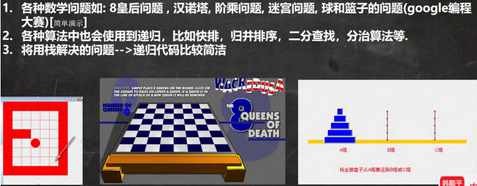
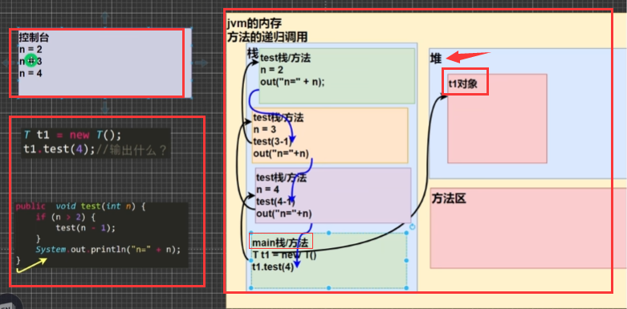
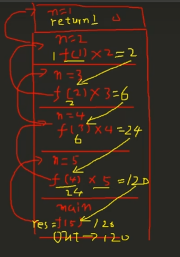
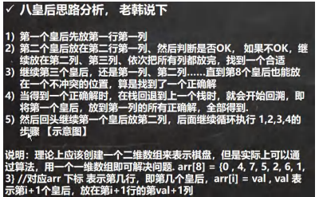
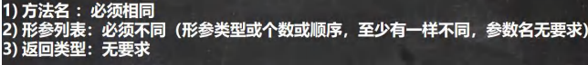
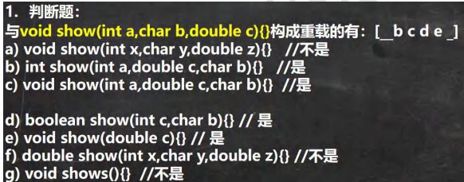
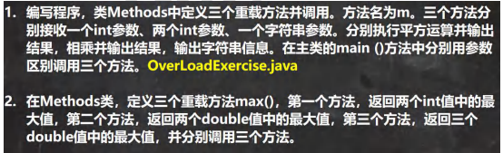

# 递归


## 基本介绍 

递归就是==方法自己调用自己==,每次调用时传入不同的变量.递归有助于编程者解决复杂问题,同时可以让代码变得简洁

## 递归能解决什么问题?



## 递归举例

### 打印问题 

```java
public class Recursion01 {
    // 编写一个 main 方法
    public static void main(String[] args) {
        T t1 = new T();
        t1.test(4);// 输出什么？ n=2 n=3 n=4
    }
}

class T {
    // 分析
    public void test(int n) {
        if (n > 2) {
            test(n - 1);
        }
        System.out.println("n=" + n);
    }

}
```



- main方法在栈区开辟了一个空间
  - 在main栈使用引用的方法在堆区开辟一个空间用于存储t1对象
  - 然后再main栈区调用t1对象的test方法
    - 该方法再栈区再开辟一个属于自己的栈空间，然后以此类推


### 阶乘问题

```java
public class Recursion01 {
    // 编写一个 main 方法
    public static void main(String[] args) {
        int res = t1.factorial(5);
        System.out.println("5 的阶乘 res =" + res);
    }
}

class T {
   // factorial 阶乘
    public int factorial(int n) {
        if (n == 1) {
            return 1;
        } else {
            return factorial(n - 1) * n;
        }
    }
}
```



## 递归==重要规则==

```apl
1. 执行一个方法时，就创建一个新的受保护的独立空间(栈空间)
2. 方法的局部变量是独立的，不会相互影响,比如n变量
3. 如果方法中使用的是引用类型变量(比如数组，对象)，就会共享该引用类型的数据.
4. 递归必须向退出递归的条件逼近，否则就是无限递归,出现StackOverflowError_栈溢出（死归了）:)
5. 当一个方法执行完毕，或者遇到return，就会返回，遵守谁调用，就将结果返回给谁
6. 同时当方法执行完毕或者返回时，该方法也就执行完毕。
```


## 课堂练习

### 1. 斐波那契数列

```apl
请使用递归的方式求出斐波那契数 1,1,2.3.5,8,13...求出第n个数是多少
```

```java
public class 斐波那契数列 {
    public static void main(String[] args) {
        int a = test(10);
        System.out.println(a);
    }

    // 求出斐波那契额数列的第n个值是多少
    public static int test(int n) {
        
        while (n>1) {
            return   test(n-1) + test(n - 2);
        }
        return n;
    }

    // 反思：在方法中设置了某一个变量，如果再使用递归调用该方法，那么每一次递归，该变量的值都是初始值

}
```

### 2. 猴子吃桃子问题:

```apl
有一堆桃子，猴子第一天吃了其中的一半，并再多吃了一个!
以后每天猴子都吃其中的一半，然后再多吃一个。
当到第10天时，想再吃时(即还没吃),发现只有1个桃子了。
问题:最初共多少个桃子?
```

```java
package com.Novice.递归;

public class 猴子吃桃问题 {
    // 2．猴子吃桃子问题:
    // 有一堆桃子，猴子第一天吃了其中的一半，并再多吃了一个!
    // 以后每天猴子都吃其中的一半，然后再多吃一个。
    // 当到第10天时，想再吃时(即还没吃),发现只有1个桃子了。
    // 问题:最初共多少个桃子?

    public static void main(String[] args) {
        int a1 = peach(1);
        int a = test(10);
        int b = 对数器(1534);
        System.out.println(a1 + "," + a + ",总共吃了" + b + "天");


    }

```

```java
    public static int peach(int day) {
        if (day == 10) {// 第 10 天，只有 1 个桃
            return 1;
        } else if (day >= 1 && day <= 9) {
            return (peach(day + 1) + 1) * 2;// 规则，自己要想
        } else {
            System.out.println("day 在 1-10");
            return -1;
        }
    }

    public static int test(int n) {// 第n天，只剩下一个桃子，那么第一天有几个桃子

        if (n == 1) {
            return 1;
        } else {
            return (test(n - 1) + 1) * 2;
        }

    }
```

```java
    public static int 对数器(int n) {
        int i = 0;

        while (n > 1) {
            n = n / 2 - 1;
            i++;
        }

        if (n == 1) {
            System.out.println(i);
            return i;
        }

        return 0;
    }
}

```


# 递归调用应用实例

## 迷宫问题

```java

```


## 汉诺塔

```java

```

## 八皇后问题

八皇后问题说明 八皇后问题，是一个古老而著名的问题，是回溯算法的典型案例。该问题是国际西洋棋棋手马克斯·贝瑟尔于1848年提出：在 8×8 格的国际象棋上摆放八个皇后，使其不能互相攻击，即：任意两个皇后都不能处于同一行、同一列或同一斜线上，问有多少种摆法。

```java

```



# 方法重载(OverLoad)

## 基本介绍 

java 中允许同一个类中，多个同名方法的存在，但要求 形参列表不一致！

 比如：System.out.println(); out 是 PrintStream 类型 OverLoad01.java 

## 重载的好处 

1) 减轻了起名的麻烦 
2) 减轻了记名的麻烦

## 快速入门案例

 OverLoad01.java 案例：

类：MyCalculator 

方法：calculate 

1) calculate(int n1, int n2) //两个整数的和 
2)  calculate(int n1, double n2) //一个整数，一个 double 的和 
3)  calculate(double n2, int n1)//一个 double ,一个 Int 和
4)  calculate(int n1, int n2,int n3)//三个 int 的和

```java

```

## 注意事项和使用细节



## 课堂练习题





