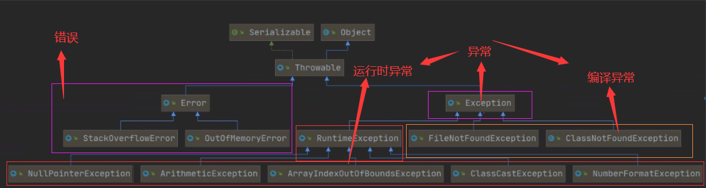
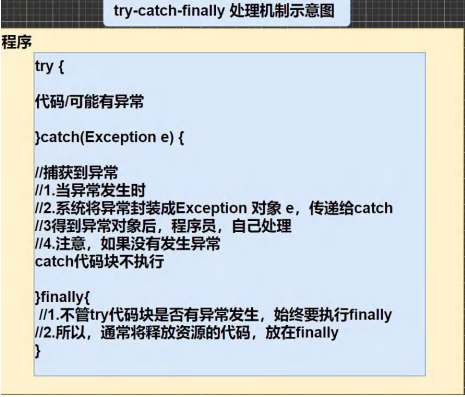
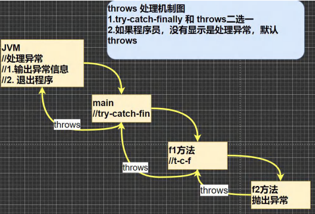
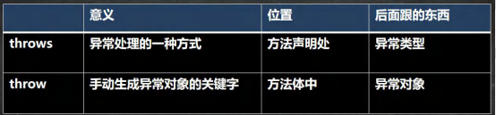

# Exception

​                                                                                                                             

## 引入异常


### 出问题代码

```java
public static void main(String[] args) {
    int num1 = 10;
    int num2 = 0;
    int res = num1 / num2;//此处分母为0，会抛出异常
    System.out.println("程序继续运行....");
}
```

### 解决方案-异常捕获

```java
package com.Novice.exception_;

public class Exception01 {

    public static void main(String[] args) {
        //1. num1 / num2 => 10 / 0
        //2. 当执行到 num1 / num2 因为 num2 = 0, 程序就会出现(抛出)异常 ArithmeticException

        //3. 当抛出异常后，程序就退出，崩溃了 , 下面的代码就不在执行
        //4. 大家想想这样的程序好吗? 不好，不应该出现了一个不算致命的问题，就导致整个系统崩溃

        //5. java 设计者，提供了一个叫 异常处理机制来解决该问题
        //如果程序员，认为一段代码可能出现异常问题，可以使用 try-catch 异常处理机制来解决,从而保证程序的健壮性
        //将该代码块->选中->快捷键 ctrl + alt + t -> 选中 try-catch

        //6. 如果进行异常处理，那么即使出现了异常，程序可以继续执行

        try {

            int num1 = 10;
            int num2 = 0;
            int res = num1 / num2;
            System.out.println("程序继续运行....");

        } catch (Exception e) {
            System.out.println(e.getMessage());//输出异常信息
        }


    }
}


// 问题代码
// public static void main(String[] args) {
//     int num1 = 10;
//     int num2 = 0;
//     int res = num1 / num2;
//     System.out.println("程序继续运行....");
// }
```


## 异常概念

```apl
Java语言中，将程序执行中发生的不正常情况称为“异常”。
(但是开发过程中的语法错误和逻辑错误不是异常)
```


### error与异常:


#### Error(错误):

```apl
概念:
Java虚拟机无法解决的严重问题。
例如:
如:JVM系统内部错误、资源耗尽等严重情况。
比如: StackOverflowError[栈溢出]和OOM(out of memory).Error是严重错误,程序会崩溃。
```

#### Exception:(两类)

```apl
概念:
因编程错误或偶然的外在因素导致的一般性问题，可以使用针对性的代码进行处理。
例如空指针访问，试图读取不存在的文件，网络连接中断等等，

Exception 分为两大类:
1.运行时异常[程序运行时，发生的异常]
2.编译时异常[编程时，编译器检查出的异常]
```

### 异常体系图



### 小结

```apl
异常分为两大类,'运行时异常'和'编译时异常'.

   运行时异常:
    java.lang.RuntimeException类及它的子类都是运行时异常
	编译器检查不出来。一般是指编程时的逻辑错误，是程序员应该避免其出现的异常。	   
	(对于运行时异常，可以不作处理，因为这类异常很普遍，若全处理可能会对程序的可读性和运行效率产生影响)

   编译时异常:
	是编译器要求必须处置的异常。
```


## ————————————

## 运行时异常


### 常见分类

```apl
1.NullPointerException		空指针异常
2.ArithmeticException		数学运算异常
3.ArrayIndexOutOfBoundsException	数组下标越界异常
4.ClassCastException		类型转换异常
5.NumberFormatException	 数字格式不正确异常[]
```


#### NullPointerException

**空指针异常**

```java
package com.Novice.exception_.runtimeExceptions_;

public class NullPointerException_ {
    public static void main(String[] args) {
        String str = null;
        System.out.println(str.length());//抛出 NullPointerException

    }
}
```

#### ArithmeticException 

**数学运算异常**

```java
package com.Novice.exception_.runtimeExceptions_;

public class ArithmeticException {
    public static void main(String[] args) {
        int y = 3;
        A1 a1 = new A1();
        int z = y / a1.x;
    }
}

class A1 {
    int x;
}
```

#### ArrayIndexOutOfBoundsException 

**数组下标越界异常**

```java
package com.Novice.exception_.runtimeExceptions_;

public class ArrayIndexOut0fBoundsException_ {
    public static void main(String[] args) {
        int[] arr = {1, 2, 3};
        for (int i = 0; i <= arr.length; i++) {
            System.out.println(arr[i]);     //抛出ArrayIndexOutOfBoundsException
        }

    }
}
```

#### ClassCastException 

**类型转换异常**

```java
package com.Novice.exception_.runtimeExceptions_;

//类型转换异常
public class ClassCastException_ {
    public static void main(String[] args) {
        A b = new B();//向上转型
        B b1 = (B) b;//向下转型，这里是 OK
        C c = (C) b;//这里抛出 ClassCastException

        //C c1 = (B) b;强制转化为B类型无法赋值给C类型变量
    }
}

class A{}
class B extends A{}
class C extends A{}
```

#### NumberFormatException 

**数字格式不正确异常**

```java
package com.Novice.exception_.runtimeExceptions_;

public class NumberFormatException_ {
    public static void main(String[] args) {
        String str = "cdksc";
        // 将 String 转成 int
        int i = Integer.parseInt(str);// 抛出 NumberFormatException
        System.out.println(i);

    }
}
```


## 编译异常

### 介绍

```apl
编译异常是指在编译期间，就必须处理的异常，否则代码不能通过编译。
```

### 常见分类

```apl
1.SQLException		//操作数据库时，查询表可能发生异常

2.IOException		//操作文件时，发生的异常

3.FileNotFoundException 	//当操作一个不存在的文件时，发生异常

4.ClassNotFoundException	//加载类,而该类不存在时，异常

5.EOFException		//操作文件，到文件未尾，发生异常

6.lllegalArguementException	 //参数异常
```

### 实例

```java
package com.Novice.exception_;

import java.io.FileInputStream;
import java.io.IOException;

public class Exception02 {		
    public static void main(String[] args) throws IOException {
        			   //main方法throws的是file.close();处的异常
        
        FileInputStream file = null;

        try {
            file = new FileInputStream("D:\\a.jpj");
            int len;
            
            while ((len = file.read()) != -1) {
                System.out.println(len);
            }

        } catch (IOException e) {
            throw new RuntimeException(e);

        } finally {
            file.close();
        }


    }
}
```

## ————————————

## 异常处理

### 基本介绍

```apl
异常处理就是当异常发生时，对异常处理的方式。
```

### 异常处理方式(两种)

```apl
1) try-catch-finally
   程序员在代码中捕获发生的异常，自行处理
   
2) throws
   将发生的异常抛出,交给调用者(方法)来处理，最顶级的处理者就是JVM
```

### 示意图






## try-catch 异常处理

### 说明

```apl
1) Java提供try和catch块来处理异常。
   try块用于包含可能出错的代码。
   catch块用于处理try块中发生的异常。
   可以根据需要在程序中有多个try...catch块。

2)基本语法
try {
    //可疑代码
    //将异常生成对应的异常对象,传递给catch块
}catch(异常){
    //对异常的处理
}
    //如果没有finally，语法是可以通过
```

### 实例

```java
public static void main(String[] args) {
    int num1 = 10;
    int num2 = 0;
    try {
        int res = num1 / num2;
    } catch (Exception e) {
        System.out.println(e.getMessage());
    }
}
```

### 注意事项

```apl
1) 如果异常发生了，则异常发生后面的代码不会执行,直接进入到catch块.
2) 如果异常没有发生，则顺序执行try的代码块，不会进入到catch.
3) 如果希望不管是否发生异常，都执行某段代码(比如关闭连接，释放资源等)

   则使用如下代码- finally ()
      try{
      	// 可疑代码
      }catch(异常){
      	//....
      }finally{
      	// 释放资源等..

      try {
            int a = lnteger.parselnt(str);
            System.out.println("数字:" + a)
        } catch (Exception e) {
            e.printstackTrace();
        } finally {
            System.out.printIn("不管是否发生异常，始终执行的代码~");
        }
```

#### 实例

```java
package com.Novice.Try_Catch;

public class TryCatchDetail {
    public static void main(String[] args) {

        // 1. 如果异常发生了，则异常发生后面的代码不会执行，直接进入到 catch 块
        // 2. 如果异常没有发生，则顺序执行 try 的代码块，不会进入到 catch
        // 3. 如果希望不管是否发生异常，都执行某段代码(比如关闭连接，释放资源等)则使用如下代码- finally

        try {
            String str = "ank";
            int i = Integer.parseInt(str);
            System.out.println(i);
        } catch (NumberFormatException e) {
            System.out.println(e.getMessage());
        } finally {
            System.out.println("finally代码块被执行完毕！");
        }

        System.out.println("程序继续执行");

    }
}
```

### 多catch语句

```apl
可以有多个catch语句，捕获不同的异常(进行不同的业务处理)，

要求:
父类异常在后,子类异常在前，比如(Exception在后，NullPointerException在前)，
如果发生异常，只会匹配一个catch

//如果前面的异常被捕获了，因为后面的代码块不会被执行，所以即便后面的代码块会发生异常，该异常也不会被捕获
```

#### 实例

```java
package com.Novice.Try_Catch;

public class TryCatchDetail02 {
    public static void main(String[] args) {

        // 1.如果 try 代码块有可能有多个异常
        // 2.可以使用多个 catch 分别捕获不同的异常，相应处理
        // 3.要求子类异常写在前面，父类异常写在后面

        // 如果前面的异常被捕获了，因为后面的代码块不会被执行，所以即便后面的代码块会发生异常，该异常也不会被捕获

        try {
            Person person = new Person();
            System.out.println(person.getName().length());

            int a = 0;
            int b = 3;
            System.out.println(b / a);
        } catch (NullPointerException e) {
            System.out.println(e.getMessage());
        } catch (ArithmeticException e) {
            System.out.println(e.getMessage());
        } finally {
            System.out.println("finally代码执行完毕 ");
        }


    }
}

class Person {
    private String name = null;

    public String getName() {
        return name;
    }
}
```

### try-finally配合使用

```apl
try-finally 配合使用,相当于没有捕获异常，因此程序会直接崩掉/退出。

应用场景:
执行一段代码，不管是否发生异常，都必须执行另外某个业务逻辑
```

#### 实例

```java
package com.Novice.Try_Catch;

public class TryCatchDetail03 {
    public static void main(String[] args) {

        /*
            可以进行 try-finally 配合使用, 这种用法相当于没有捕获异常，
            因此程序会直接崩掉/退出。应用场景，就是执行一段代码，
            不管是否发生异常，都必须执行某个业务逻辑
         */

        try {
            int a = 0;
            int b  = 3;
            int c  = b/a;
            System.out.println(c);
        } finally {
            System.out.println("不论是否发生异常都执行finally");
        }


    }
}
```

## 异常处理课堂练习

### 实例(return巧用)一

```java
package com.Novice.Try_Catch;

public class TryCatchExercise01 {
    public static void main(String[] args) {

        System.out.println(method());

    }

    public static int method() {//一个方法里面只能return一个数

        String[] str = new String[3];// 此时数组中的字符串都是空
        try {
            if (str[0].equals("abc")) {
                System.out.println("str[0]=abc");
            } else {
                str[4] = "def";
            }
            return 1;

        } catch (ArrayIndexOutOfBoundsException e) {
            return 2;

        } catch (NullPointerException e) {
            return 3;

        } finally {
            return 4;
        }
    }
}
```

### 实例(return巧用)二

```java
package com.Novice.Try_Catch;

public class TryCatchExercise02 {
    public static void main(String[] args) {

        System.out.println(method1());

    }


    public static int method1() {

        int i = 0;

        try {
            String[] str = new String[3];
            if (str[0].equals("abc")) {
                System.out.println(str[0]);
            } else {
                str[5] = "def";
            }
            return ++i;// 此处不执行

        } catch (ArrayIndexOutOfBoundsException e) {
            return ++i;// 此处不执行

        } catch (NullPointerException e) {
            return ++i;// i+1

        } finally {
            return ++i;// i+1并返回

        }


    }
}
```

### 实例(return巧用)三

```java
package com.Novice.Try_Catch;

public class TryCatchExercise03 {
    public static void main(String[] args) {

        System.out.println(method2());

    }


    public static int method2() {

        int i = 0;

        try {
            String[] str = new String[3];
            if (str[0].equals("abc")) {
                System.out.println(str[0]);
            } else {
                str[5] = "def";
            }
            return ++i;// 此处不执行

        } catch (ArrayIndexOutOfBoundsException e) {
            return ++i;// 此处不执行

        } catch (NullPointerException e) {
            return ++i;
            // i=1 => 保存临时变量temp = 3;
            // 虽然finally最终加1了，但是返回的是此时保存在临时变量里面的值


        } finally {
            ++i;// i+1 并且不返回

        }


    }
}
```

### 小结

```apl
1) 如果没有出现异常，则执行try块中所有语句，不执行catch块中语句，
   如果有finally，最后还需要执行finally里面的语句
   
2) 如果出现异常，则try块中异常发生后，try块剩下的语句不再执行。
   将执行catch块中的语句。
   如果有finally,最后还需要执行finally里面的语句!
```

### 课后练习题

```java
package com.Novice.Try_Catch;

import java.util.Scanner;

public class TryCatchExercise04 {
    public static void main(String[] args) {


        // 如果用户输入的不是一个整数，就提示他反复输入，直到输入一个整数为止

        // 思路
        // 1. 创建 Scanner 对象
        // 2. 使用无限循环，去接收一个输入
        // 3. 然后将该输入的值，转成一个 int
        // 4. 如果在转换时，抛出异常，说明输入的内容不是一个可以转成 int 的内容
        // 5. 如果没有抛出异常，则 break 该循环

        boolean loop = true;

        int i = 0;
        System.out.println("请输入数字");
        Scanner scanner = new Scanner(System.in);


        while (loop) {

            String str = scanner.next();// 此处很重要，如果放在外面的话，while()就会一直循环

            try {
                i = Integer.parseInt(str);
                System.out.println("结果为 i=" + i);
                break;
                // loop = false;
            } catch (NumberFormatException e) {

                System.out.println("你输入的值为" + str);
                System.out.println("请输入正确的数字");

            }

        }


    }
}
```

## throws 异常处理

### 概念

```apl
1) 如果一个方法(中的语句执行时)可能生成某种异常，但是并不能确定如何处理这种异常，
   则此方法应显示地声明抛出异常，
     表明该方法将不对这些异常进行处理，而由该方法的调用者负责处理。

2) 在方法声明中用throws语句可以声明抛出异常的列表,
   throws后面的异常类型可以是方法中产生的异常类型，也可以是它的父类。
```

### 实例

```apl
1) 对于编译异常，程序中必须处理，比如try-catch或者throws

2) 对于运行时异常，程序中如果没有处理，默认就是throws的方式处理[举例]

3) 子类重写父类的方法时，对抛出异常的规定:
   子类重写的方法，所抛出的异常类型要么和父类抛出的异常一致，
   要么为父类抛出的异常的类型的子类型[举例]
   
4) 在throws 过程中，如果有方法try-catch，就相当于处理异常，就可以不必throws
```


```java
package com.Novice.Throws_;

import java.io.IOException;

public class ThrowsDetail {
    public static void main(String[] args) {

        f1();

    }

//例子一
    public static void f1() /*throws ArithmeticException*/ {
        // 1.对于编译异常，程序中必须处理，比如 try-catch 或者 throws
        // 2.对于运行时异常，程序中如果没有处理，默认就是 throws 的方式处理
        int n1 = 10;
        int n2 = 0;
        double res = n1 / n2;
    }


    
//例子二    
    public static void a() throws IOException {
        // java中，编译异常并要求程序员显示处理
        a1();
        //调用了a1();,同时a1抛出的是编译异常，所以a()也要抛出编译异常
    }
    public static void a1() throws IOException {

    }

    
    
//例子三
    public static void b() {
        // java中，运行异常并不要求程序员显示处理
        b1();//调用了b1();,同时b1抛出的是运行异常，所以b()也要抛出编译异常
    }
    public static void b1() throws ArithmeticException {

    }
}


//例子四
class Father {
    public static void f() throws RuntimeException {

    }

}


class Son extends Father {// 子类

    // 3. 子类重写父类的方法时，对抛出异常的规定:子类重写的方法,所抛出的异常类型要么和父类抛出的异常一致，要么为父类抛出的异常类型的子类型
    
    // 4. 在 throws 过程中，如果有方法 try-catch , 就相当于处理异常，就可以不必 throws

    public static void f() throws NullPointerException {

    }


}
```

## ————————————

## 自定义异常

### 概念

```apl
当程序中出现了某些“错误”，但该错误信息并没有在Throwable子类中描述处理，
这时可以自己设计异常类,用于描述该错误信息。
```

### 步骤

```apl
1) 定义类:
   自定义异常类名(程序员自己写)继承Exception或RuntimeException
   
2) 如果继承Exception，属于编译异常

3) 如果继承RuntimeException，属于运行异常(一般来说，继承RuntimeException)
```

### 实例 

```apl
接收Person对象年龄时,要求范围在18-120之间，
否则抛出一个自定义异常(要求继承RuntimeException)，并给出提示信息。
```

```java
package com.Novice.customException_;

public class ThrowException {
    public static void main(String[] args) {

        int age = 8;
        //要求范围在 18 – 120 之间，否则抛出一个自定义异常
        if(!(age>18&&age<30)){
            throw new AgeException("请输入正确范围的年龄");
        }
        System.out.println("年龄范围正确");


    }
}

        //1. 一般情况下，我们自定义异常是继承 RuntimeException

        //2. 即把自定义异常做成 运行时异常，好处时，我们可以使用默认的处理机制
        //3. 即比较方便
class AgeException extends RuntimeException{
    public AgeException(String message){//构造器
        super(message);
    }
}

/*
    源码
    public Throwable(String message) {
        fillInStackTrace();
        detailMessage = message;
    }

 */
```

## throw 和 throws 的区别



### 实例

```java
package com.Novice.customException_;

public class customException01 {
    public static void main(String[] args) {

        try {
            RuntimeExceptionDemo.methodA();
        } catch (Exception e) {
            System.out.println(e.getMessage());
        } finally {
        }
        RuntimeExceptionDemo.methodB();

    }
}


class RuntimeExceptionDemo {

    static void methodA() {

        try {
            System.out.println("进入方法A");
            throw new RuntimeException("制造运行异常");
        } finally {
            System.out.println("使用方法A的finally");
        }
    }

    static void methodB() {
        try {
            System.out.println("进入方法B");
            return;
        } finally {
            System.out.println("使用方法B的finally");
        }
    }
}

// 输出内容1.进入方法A
//         2.用A方法的finally3.制造异常
//         4.进入方法B
//         5.调用B方法的finally

```


## Test

### 实例一

```apl
a)编写应用程序，接收命令行的两个参数(整数)，计算两数相除。

b)计算两个数相除,要求使用方法cal(int n1, int n2)

c)对数据格式不正确(NumberformatException)、缺少命令行参数
(ArrayIndexOutOfBoundsException)、除0进行异常处理(ArithmeticException).
```

```java
package com.Novice.Test;

public class Homework01 {
    public static void main(String[] args) {


        try {

            // 先验证输入的参数的个数是否正确两个参数
            if (args.length != 2) {
                throw new ArrayIndexOutOfBoundsException("参数个数不正确");
            }

            // 先把接收到的参数，转成整数
            int a = Integer.parseInt(args[0]);
            int b = Integer.parseInt(args[1]);

            // 先把接收到的参数，转成整数
            double cal = cal(a, b);// 该方法可能抛出ArithmeticExceptionl,运行异常不处理也不会报错
            System.out.println("计算结果是=" + cal);

        } catch (ArrayIndexOutOfBoundsException e) {
            System.out.println(e.getMessage());
        } catch (NumberFormatException e) {
            System.out.println("参数格式不正确");
        } catch (ArithmeticException e) {
            System.out.println(e.getMessage());
        } finally {
        }


    }


    public static double cal(int a, int b) {
        return a / b;
    }
}

```

### 实例二

```java
package com.Novice.Test;

public class Homework02 {
    public static void main(String[] args) {


        if (args[0].equals("abc")) { // 可能发生NullPointerException
            System.out.println("abc");
        } else {
            System.out.println("cde");
        }


        Object o = args[2]; // 向上转型
        Integer o1 = (Integer) o;  // 类型转换异常，ClassCastException

    }
}

```

### 实例三

```java
package com.Novice.Test;

public class Homework03 {
    public static void main(String[] args) {

        try {
            fun();
            System.out.println("A");
        } catch (Exception e) {
            System.out.println("C");
        }

        System.out.println("D");


    }

    public static void fun() {

        try {
            throw new RuntimeException();
        } finally {
            System.out.println("B");

        }
    }
}

```

```apl
outPut:
B C D
```


### 实例四

```java
package com.Novice.Test;

public class Homework04 {
    public static void main(String[] args) {

        try {
            fun();
            System.out.println("A");
        } catch (Exception e) {
            System.out.println("B");
        } finally {
            System.out.println("C");
        }
        System.out.println("D");


    }

    public static void fun() throws Exception {
        throw new Exception();
    }
}

```

```apl
outPut:
B C D
```
