# 常用类


## 包装类


### 分类

```apl
1) 针对八种基本数据类型相应的引用类型—包装类
2) 有了类的特点，就可以调用类中的方法。
```


==**下面黄色标出的，其父类都是number**==

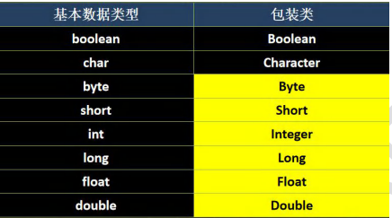

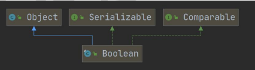

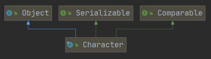

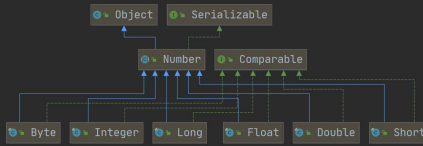

==包装类都实现了Comparable接口，所以都可以重写compareTo方法==


### 包装类和基本数据的转换

```apl
演示包装类和基本数据类型的相互转换('这里以int 和 Integer演示')

1) jdk5前的手动装箱和拆箱方式，装箱:基本类型->包装类型,反之，拆箱
2) jdk5以后(含jdk5)的自动装箱和拆箱方式
3)自动装箱底层调用的是valueOf方法，比如'lnteger.valueof'
4)其它包装类的用法类似，不一一举例
```


#### 实例一

```java
public class Integer01 {
    public static void main(String[] args) {
        
        String s = "3";
        int i2 = Integer.valueOf(s);
        int i3 = new Integer(s);
        //使用包装类里面的方法，将数字字符串转化为Integer
        //然后再自动拆箱


        //演示 int <--> Integer 的装箱和拆箱
            //jdk5 前是手动装箱和拆箱
        
            //手动装箱 int->Integer
        int n1 = 100;
        Integer integer = new Integer(n1);
        Integer integer1 = Integer.valueOf(n1);
        
            //手动拆箱 Integer -> int
        int i = integer.intValue();

        
        
        //jdk5 后，就可以自动装箱和自动拆箱
        int n2 = 200;
            //自动装箱 int->Integer
        Integer integer2 = n2; //底层使用的是 Integer.valueOf(n2)
        
            //自动拆箱 Integer->int
        int n3 = integer2; //底层仍然使用的是 intValue()方法


    }
}

```


#### 题目一

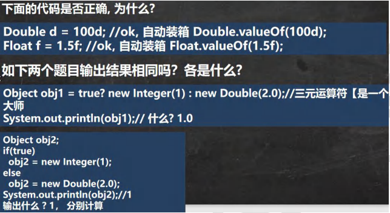


```java
public class WqpperExercise01 {
    public static void main(String[] args) {

        Double d = 100d;
        Float f = 1.5f;

        Object object = true ? new Integer(1) : new Double(2.0);
        System.out.println(object);//输出1.0
        //new Integer(1) : new Double(2.0);看作一个整体
        //这里面精度最高的是double，所以输出的结果按照最高精度来算


        Object object1;
        if(true){
            object1 = new Integer(1);
        }else {
            object1 = new Double(2.0);

        }
        System.out.println(object1);//输出1

    }
}

```


### 包装类型 和 String 类型 转换

#### 实例一

```java
public class Wapper_VS_String {
    public static void main(String[] args) {

        
        //包装类(Integer)->String
        Integer i = 100;//自动装箱

        //1
        String str1 = i +"";
        //2
        String str2 = i.toString();
        //3
        String str3 = String.valueOf(i);

        System.out.println(str1);
        System.out.println(str2);
        System.out.println(str3);


        //String -> 包装类(Integer)
        String str = "1234";
        //1
        Integer i1 = new Integer(str);//构造器
        //2
        Integer i2 = Integer.valueOf(str);
        //3
        Integer i3 = Integer.parseInt(str);//使用到自动装箱
        
        System.out.println(i1);
        System.out.println(i2);
        System.out.println(i3);

    }
}
```


### Integer 类测试一

````java
public class WqpperExercise02 {
    public static void main(String[] args) {


        Integer i = new Integer(1);
        Integer j = new Integer(1);
        System.out.println(i ==j); // False,因为new了两个不同的对象


        /*

        //1.如果i在 IntegerCache.low(-128)~IntegerCache.high(127),就直接从数组返回
        //2.如果不在 -128~127,就直接new Integer(i)

            public static Integer valueOf(int i) {

                if (i >= IntegerCache.low && i <= IntegerCache.high)
                    return IntegerCache.cache[i + (-IntegerCache.low)];

                return new Integer(i);
            }
         */


        Integer m = 1;//底层 Integer.valueOf(1);->阅读源码
        Integer n = 1;//底层Integer.valueOf(1);
        System.out.println(m == n); //True,所以，这里主要是看范围-128~127就是直接返回true


        //所以，这里主要是看范围-128~127就是直接返回，
        //否则，就new Integer(x);
        Integer x = 128;//底层Integer.valueOf(1);
        Integer y = 128;//底层Integer.valueOf(1);
        System.out.println(x == y);//False


        //示例六
        Integer i1=127;
        int i2=127;
        //有基本数据类型，"=="判断的是数值是否相同
        System.out.println(i1==i2);//True

        // 示例七
        Integer i3=128;
        int i4=128;
        //有基本数据类型，"=="判断的是数值是否相同
        System.out.println(i3==i4);//True


    }


}
````

### Integer 代码总结

```java
public class WrapperExercise03 {
    public static void main(String[] args) {

        Integer i1 = new Integer(127);
        Integer i2 = new Integer(127);
        System.out.println(i1==i2);//F 因为此处比较的是两个对象


        Integer i3 = 127;//底层是 Integer.valueOf();
        Integer i4 = 127;//-128~127
        System.out.println(i3==i4);//T 存入的对象落入该范围，因此结果为真


        Integer i5 = 128;
        Integer i6 = 128;
        System.out.println(i5==i6);//F 因为存入的对象超出了底层调用函数的范围


        Integer i7 = 127;
        Integer i8 = new Integer(127);
        System.out.println(i7 == i8);
        //F 因为127不超出Integer.valueOf();的范围，
        //所以该方法直接从已经储存好的字符串中去除该数值并返回
        //而i8则是返回了一个对象


        Integer i9 = 127;
        int i10 = 127;
        System.out.println(i9 == i10);//T 因为只要有基本数据类型，那么“==”判断的就是值是否相等

        //下面同理
        Integer i11 = 128;
        Integer i12 = 128;
        System.out.println(i11 == i12);//T


    }

}
```


## String 类


### String 类的理解和创建对象

```apl
1) String对象用于保存字符串，也就是一组字符序列
2)字符串常量对象是用双引号括起的字符序列。例如:"你好"、"12.97"."boy"等
3)字符串的字符使用Unicode字符编码，一个字符(不区分字母还是汉字)占两个字节。

4)String类较常用构造器(其它看手册):;
    String s1 = new String():
    String s2 = new String(String original);
    String s3 = new String(char[] a);
    String s4 = new String(char[] a,int startlndex,int count)
```

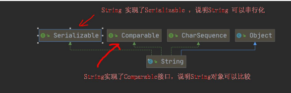

### 实例一(基础总结)

```java
package com.Novice.String;

public class String01 {

    public static void main(String[] args) {

        //1.String对象用于保存字符串，也就是一组字符序列
        //2."jack”字符串常量，双引号括起的字符序列
        //3.字符串的字符使用Unicode字符编码，一个字符(不区分字母还是汉字)占两个字节
        //4.String 类有很多构造器，构造器的重载

        //常用的有
        // String s1 = new String();
        // String s2 = new String(String original);
        // String s3 = new string(char[l a);
        // String s4 =new String(char[] a,int startIndex,int count)
        // String s5 = new String(byte[] b)

        //5.String 类实现了
        //		   接口 Serializable [String 可以串行化:可以在网络传输]
        //          接口Comparable [String对象可以比较大小]
        
        //6.String是final 类，不能被其他的类继承

        //7.String有属性 private final char value[];
        // 		   是真正用于存放字符串内容

        //8，一定要注意:value是一个final类型，不可以修改(需要功力)
        //此处的不可修改指的是，value变量的指向不可修改，但是被指向的内存空间保存的值是可以修改的


        String name = "jack";
        name = "tom";

        final char[] value = {'a','b', 'c'};
        char[] v2 = {'t', 'o', 'm'};

        value[0] = 'H';//可以改变内存空间里的值

        //value = V2;//不可以改变指向


    }
}

```


### 创建 String 对象


#### 两种创建方式

```apl
1)万式一:直接赋值 String s = "hspedu";
2)方式二:调用构造器String s= new String("hspedu");:
```


#### 两种创建 String 对象的区别

```apl
1.方式一:
先从常量池查看是否有"hsp”数据空间,如果有，直接指向;
如果没有则重新创建,然后指向。S最终指向的是常量池的空间地址

2.方式二:
先在堆中创建空间，里面维护了value属性，指向常量池的hsp空间。
如果常量池没有"hsp"，重新创建,如果有，直接通过value指向。
最终指向的是堆中的空间地址。
```


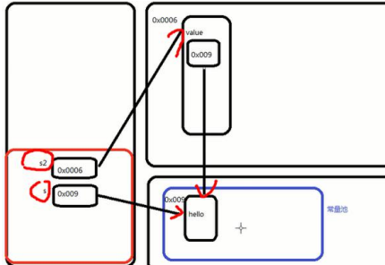


### String对象指向的理解

#### 实例一

```apl
String a = "abc";
String b ="abc";
System.out.println(a.equals(b));  //T
System.out.println(a==b);  //T

```


```java
public class StringExercise01 {
    public static void main(String[] args) {

        String a = "abc";
        String b = "abc";

        System.out.println(a.equals(b));//True

        System.out.println(a == b);//True


    }
}
```


#### 实例二

```apl
String a = new String("abc");
String b =new String( abc");
System.out.println(a.equals(b)): //T 因为equals最终比较的是值的大小
System.out.println(a==b); //F

```


#### 实例三


```java
public class StringExercise03 {

    public static void main(String[] args) {


        //b.intern()就是判断b的字符串内容是否已经存在于常量池中
            // 存在就返回该字符串
            // 不存在就在常量池中创建一个对象保存该字符串，返回这个对象的地址

        // 返回不了学符串的，引用类型比较地址不比较值
        
        //引用类型_比较地址   
        //基本类型_比较_值的大小
        
        //返回的是b对象中的属性地址


        //string类的hashcode方法重写了，只要equals等,hashcode一定相等。看源码就知道了


        String a = "Novice";
        String b = new String("Novice");

        System.out.println(a.equals(b));//True
        //String中的equals方法的比较是将两个String的value数组中的值依次比较

        System.out.println(a==b);//False
        //a对象指向的是常量池，b对象指向的是堆，所以a与b两个对象的不相等
        //引用比较的是指向的地址，基本类型才是比较值

        System.out.println(a==b.intern());//True
        //b.intern()判断b的字符串内容是否存在在常量池里，如果有就将该字符串在常量池的存储的地址返回
        //如果没有在常量池中，就在常量池中创建之后，返回新创建的地址

        System.out.println(b==b.intern());//False
        //b对象对应的是堆中的地址
        //b.intern对应的是常量池中字符串对应的地址


      //打印 b 与 b.intern() 的 hashcode 会发现两者虽然不是同一个对象，但是两者的hashcode是相等的


    }
}
```


#### 实例四

```apl
String s1 ="hspedu"; //指向常量池"hspedu"
String s2 ="java";   //指向常量池"java"
String s4 = "java":  //指向常量池"java"
String s3 = new String("java");//指向堆中对象

System.out.println(s2 == s3);//F
System.out.println(s2 == s4);//T
System.out.println(s2.equals(s3));//T
System.out.println(s1 == s2); //F
```


#### 实例五

```apl
Person p1 = new Person();
p1.name = "hspedu";

Person p2 = new Person();
p2.name = "hspedu";

System.out.println(p1.name.equals(p2.name));//比较内容 //True
System.out.println(p1.name == p2.name)://T
System.out.println(p1.name == "hspedu");//T

String s1 = new String("bcde");
String s2 = new String("bcde");
System.out.println(s1==s2);//False
```

```java
package com.Novice.String;

public class StringExercise05 {

    public static void main(String[] args) {

        //？？l创建的变量保存在栈
        //？？变量对应的对象保存在堆
        //？？堆中对象对应的常量保存在常量池
        //？？有的部分变量直接由栈指向常量池 //如: String str = "abc";


        Person p1 = new Person();p1.name = "hspedu";
        Person p2 = new Person();p2.name = "hspedu";

        System.out.println(p1.name.equals(p2.name));//比较内容是否相等:True

        System.out.println(p1.name == p2.name);//True
        //p1与p2指向堆区的不同地址，但是这两个在堆区的对象，指向的都是常量池的同一个地址
        System.out.println("cbkzbck");
        System.out.println(p1.name =="hspedu");
        //"hespdu"常量返回的就是在常量池里的地址，与p1.name所指向的地址是同一个


        String s1 = new String("bcde");
        String s2 = new String("bcde");

        System.out.println(s1==s2);//False
        //s1与s2指向的是堆区不同的地址


    }
}


class Person{

    public String name;
}
```


#### 字符串的特性

```apl
1) String是一个final类，代表不可变的字符序列
2)字符串是不可变的。一个字符串对象一旦被分配，其内容是不可变的.

1.以下语句创建了几个对象?
String s1 = "hello";
s1="haha"; 

//创建了2个对象.

```


### String面试题


#### 题目一

```apl
1)题1
String a = "hello" +"abc";

创建了几个对象?
只有1个对象.

//解读:
String a = "hello"+"abc"; ==> 优化等价String a = "helloabc";
//分析
1. 编译器不傻,做一个优化，判断创建的常量池对象，是否有引用指向
2. String a = "hello" +"abc"; ==> String a = "helloabc";

```


#### 题目二

```apl
2)题2 
思考String a = "hello"; //创建a对象
String b ="abc";	   //创建b对象
String c=a+b;创建了几个对象?
一共有3对象

分析
String c = a + b;到底是如何执行的


小结:

底层是 StringBuilder sb = new StringBuilder();
       sb.append(a);sb.append(b);
sb是在堆中，并且append是在原来字符串的基础上追加的.

重要规则,String c1 = "ab" + "cd";常量相加，看的是池。
String c1 = a+ b;变量相加,是在堆中


学习思路:一定尽量看源码学习。

```


```java
package com.Novice.String;

public class StringExercise08 {
    public static void main(String[] args) {

        String a = "hello";
        String b = "abc";

        //1.先创建一个StringBuilder sb = StringBuilder
        //2.执行sb.append("hello");
        //3.sb.append("abc ");
        //4.String c= sb.toString()
        //最后其实是c指向堆中的对象(String) value[]->常量池中"helloabc " 
        //因为底层调用了new方法创建了一个Builder
        String c = a+b;


        String d = "helloabc";
        System.out.println(c == d);//F 、
        //因为c指向的是堆中的对象，而d则是指向常量池中的值

        //重要规则,String c1 = "ab" +"cd";常量相加,看的是池。
        // String c1 =a+b;变量相加,是在堆中


    }
}
```


#### 题目三

```apl
题3
下面代码输出什么，并说明原因.

String s1 = "hspedu";    //s1指向池中的"hspedu"
String s2 = "java";      //s2指向池中的"java"
String s5 = "hspedujava";//s5指向池中的"hspedujava"

String s6 =(s1 + s2).intern()://s6指向池中的"hspedujava"

System.out.println(s5 == s6);1/T
System.out.println(s5.equals(s6))://T

```

```java
package com.Novice.String;

public class StringExercise09 {

    public static void main(String[] args) {


        Test1 ex = new Test1();

        ex.change(ex.str, ex.ch);

        System.out.print(ex.str + " and ");
        System.out.println(ex.ch);


    }
}


class Test1 {
    String str = new String("hsp");
    final char[] ch = {'j', 'a', 'v', 'a'};


    public void change(String str, char ch[]) {
        str = "java";
        ch[0] = 'h';
    }

}
```


#### 实例

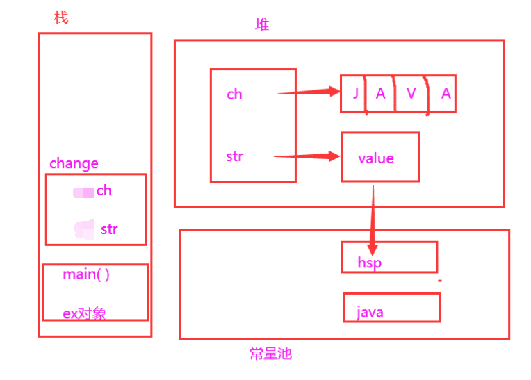


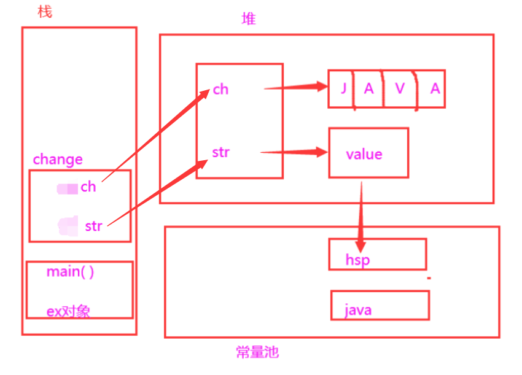


执行了change中的方法后


change方法执行完毕退出栈

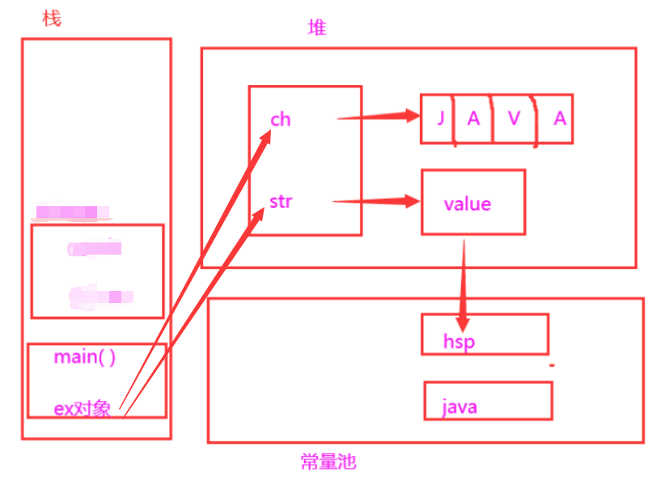

```java
package com.Novice.String;

public class StringExercise09 {

    public static void main(String[] args) {


        Test1 ex = new Test1();

        ex.change(ex.str, ex.ch);
        
        System.out.print(ex.str + " and ");
        System.out.println(ex.ch);


    }
}


class Test1 {
    String str = new String("hsp");
    final char[] ch = {'j', 'a', 'v', 'a'};


    public void change(String str, char ch[]) {
        str = "java";
        ch[0] = 'h';
    }

}

```


### String 类的常见方法


#### 说明

```apl
String类是保存字符串常量的，每次更新都需要重新开辟空间，效率较低。
因此java设计者还提供了 StringBuilder 和 StringBuffer来增强String的功能，并提高效率。[后面我们还会详细介绍StringBuilder 和 StringBuffer]

看以下代码

String s = new String("");
for( int i = o; i< 80000; i++){
	s += "hello";
}
```

#### String 类的常见方法


##### 第一组

```apl
1.equals 		 //区分大小写，判断内容是否相等
2.equalslgnoreCase//忽略大小写的判断内容是否相等length/获取字符的个数,字符串的长度
3.indexOf		 //获取字符在字符串中第1次出现的索引,索引从0开始,如果找不到,返回-1
4.lastIndexOf	 //获取字符在字符串中最后1次出现的索引,索引从0开始,如找不到,返回-1
5.substring 	 //截取指定范围的子串
6.trim 		     //去前后空格
7.charAt		 //获取某索引处的字符,注意不能使用Str[index]这种方式.
```

```java
package com.Novice.String;

public class StringMethod01 {

    public static void main(String[] args) {
        //1. equals 比较内容是否相同，区分大小写
        String str1 = "hello";
        String str2 = "Hello";
        System.out.println(str1.equals(str2));


        //2.equalsIgnoreCase 忽略大小写的判断内容是否相等
        String username = "johN";
        if ("john".equalsIgnoreCase(username)) {
            System.out.println("Success!");
        } else {
            System.out.println("Failure!");
        }


        //3.length 获取字符的个数，字符串的长度
        System.out.println("韩顺平".length());


        //4.indexOf 获取字符在字符串对象中第一次出现的索引，索引从 0 开始，如果找不到，返回-1
        String s1 = "wer@terwe@g";
        int index = s1.indexOf('@');
        System.out.println(index);// 3
        System.out.println("weIndex=" + s1.indexOf("we"));//0


        //5.lastIndexOf 获取字符在字符串中最后一次出现的索引，索引从 0 开始，如果找不到，返回-1
        s1 = "wer@terwe@g@";
        index = s1.lastIndexOf('@');
        System.out.println(index);//11
        System.out.println("ter 的位置=" + s1.lastIndexOf("ter"));//4


        // 6.substring 截取指定范围的子串
        String name = "hello,张三";

        //下面 name.substring(6) 从索引 6 开始截取后面所有的内容
        System.out.println(name.substring(6));//截取后面的字符


        //name.substring(0,5)表示从索引 0 开始截取，截取到索引 5-1=4 位置
        System.out.println(name.substring(2, 5));//llo


    }
}
```


##### 第二组

```apl
1.toUpperCase
2.toLowerCase
3.concat
4.replace		//替换字符串中的字符
5.split		    //分割字符串,对于某些分割字符，我们需要转义比如|\\等
案例: 
6.String poem="锄禾日当午,汗滴禾下土,谁知盘中餐,粒粒皆辛苦";和文件路径.

7.compareTo   //比较两个字符串的大小
8.toCharArray //转换成字符数组
9.format 	    //格式字符串,%s字符串 %c字符 %d整型 %.2f 浮点型
```

```java
package com.Novice.String;

public class StringMethod02 {

    public static void main(String[] args) {


        // 1.toUpperCase 转换成大写
        String s = "heLLo";
        System.out.println(s.toUpperCase());//HELLO


        // 2.toLowerCase
        System.out.println(s.toLowerCase());//hello


        // 3.concat 拼接字符串
        String s1 = "宝玉";
        s1 = s1.concat("林黛玉").concat("薛宝钗").concat("together");
        System.out.println(s1);//宝玉林黛玉薛宝钗 together


        // 4.replace 替换字符串中的字符
        s1 = "宝玉 and 林黛玉 林黛玉 林黛玉";
        //在 s1 中，将 所有的 林黛玉 替换成薛宝钗

        // 解读: s1.replace() 方法执行后，返回的结果才是替换过的. // 注意对 s1 没有任何影响
        String s11 = s1.replace("宝玉", "jack");
        System.out.println(s1);//宝玉 and 林黛玉 林黛玉 林黛玉
        System.out.println(s11);//jack and 林黛玉 林黛玉 林黛玉


        // 5.split 分割字符串, 对于某些分割字符，我们需要 转义比如 | \\等
        String poem = "锄禾日当午,汗滴禾下土,谁知盘中餐,粒粒皆辛苦";
        String[] split = poem.split(",");
        //解读：
        // 1. 以 , 为标准对 poem 进行分割 , 返回一个数组
        // 2. 在对字符串进行分割时，如果有特殊字符，需要加入 转义符 \

        poem = "E:\\aaa\\bbb";
        split = poem.split("\\\\");
        System.out.println("==分割后内容===");
        for (int i = 0; i < split.length; i++) {
            System.out.println(split[i]);
        }


        // 6.toCharArray 转换成字符数组
        s = "happy";
        char[] chs = s.toCharArray();
        for (int i = 0; i < chs.length; i++) {
            System.out.println(chs[i]);
        }


        // 7.compareTo 比较两个字符串的大小，如果前者大，
        // 则返回正数，后者大，则返回负数，如果相等，返回 0

        // 解读
        // (1) 如果长度相同，并且每个字符也相同，就返回 0

        // (2) 如果长度相同或者不相同，但是在进行比较时，可以区分大小
        // 就返回 if (c1 != c2) {
        // return c1 - c2;
        // }

        // (3) 如果前面的部分都相同，就返回 str1.len - str2.len
        String a = "jcck";// len = 3
        String b = "jack";// len = 4
        System.out.println(a.compareTo(b)); // 返回值是 'c' - 'a' = 2 的值


        // 8.format 格式字符串
        /* 占位符有:
         * %s 字符串 %c 字符 %d 整型 %.2f 浮点型
         *
         */
        String name = "john";
        int age = 10;
        double score = 56.857;
        char gender = '男';


        //将所有的信息都拼接在一个字符串.
        String info = "我的姓名是" + name + "年龄是" + age + ",成绩是" + score + "性别是" + gender + "。希望大家喜欢我！";
        System.out.println(info);

        //解读
        //1. %s , %d , %.2f %c 称为占位符
        //2. 这些占位符由后面变量来替换
        //3. %s 表示后面由 字符串来替换
        //4. %d 是整数来替换
        //5. %.2f 表示使用小数来替换，替换后，只会保留小数点两位, 并且进行四舍五入的处理//6. %c 使用 char 类型来替换
        String formatStr = "我的姓名是%s 年龄是%d，成绩是%.2f 性别是%c.希望大家喜欢我！";
        String info2 = String.format(formatStr, name, age, score, gender);
        System.out.println("info2=" + info2);
    }
}
```

## StringBuffer 类

### 基本介绍

```apl
java.lang.StringBuffer代表可变的字符序列，可以对字符串内容进行增删。
很多方法与String相同，但StringBuffer是可变长度的。
StringBuffer是一个容器。

1.stringBuffer 是final类
2.实现了 Serializable 接口，可以保存到文件,或网络传输
3.继承了抽象类AbstractStringBuilder属性
4.AbastractStingBuilder 属性 char[] value，存放字符序列
```

```java
package com.Novice.StringBuffer_;

public class StringBuffer01 {


    public static void main(String[] args) {


        //1. StringBuffer 的直接父类 是 AbstractStringBuilder

        //2. StringBuffer 实现了 Serializable, 即 StringBuffer 的对象可以串行化

        //3. 在父类中 AbstractStringBuilder 有属性 char[] value,不是 final
            // 该 value 数组存放 字符串内容，引出存放在堆中的

        //4. StringBuffer 是一个 final 类，不能被继承

        //5. 因为 StringBuffer 字符内容是存在 char[] value, 所有在变化(增加/删除)
            // 不用每次都更换地址(即不是每次创建新对象)， 所以效率高于 String

        StringBuffer stringBuffer = new StringBuffer("123");


    }
}
```


### String VS StringBuffer

```apl
1) String保存的是字符串常量，里面的值不能更改，每次String类的更新实际上就是更改地址，
   效率较低		//private final char valuel[];
   
2) StringBuffer保存的是字符串变量，里面的值可以更改，每次
   StringBuffer的更新实际上可以更新内容，不用每次更新地址，效率较高
   //char[] value;//这个放在堆.
```

### String 和 StringBuffer 相互转换

```java
package com.Novice.StringBuffer_;

public class StringeAndStringBuffer {
    public static void main(String[] args) {

        //看 String——>StringBuffer
        String str = "hello tom";
        
        //方式 1 使用构造器
        	//注意： 返回的才是 StringBuffer 对象，对 str 本身没有影响
        StringBuffer stringBuffer = new StringBuffer(str);
        
        //方式 2 使用的是 append 方法
        StringBuffer stringBuffer1 = new StringBuffer();
        stringBuffer1 = stringBuffer1.append(str);


        //StringBuffer ->String
        StringBuffer stringBuffer3 = new StringBuffer("韩顺平教育");

        //方式 1 使用 StringBuffer 提供的 toString 方法
        String s = stringBuffer3.toString();

        //方式 2: 使用构造器来搞定
        String s1 = new String(stringBuffer3);


    }
}
```

### StringBuffer 类常见方法

```java
package com.Novice.StringBuffer_;

import javax.crypto.spec.PSource;

public class stringbufferMethod {

    public static void main(String[] args) {


        StringBuffer s = new StringBuffer("hello");


        //增
        s.append(',');// "hello,"
        s.append("张三丰");//"hello,张三丰"
        s.append("赵敏").append(100).append(true).append(10.5);//"hello,张三丰赵敏 100true10.5"
        System.out.println(s);//"hello,张三丰赵敏 100true10.5"


        //删
        /*
         * 删除索引为>=start && <end 处的字符
         * 解读: 删除 11~14 的字符 [11, 14)
         */
        s.delete(11, 14);
        System.out.println(s);//"hello,张三丰赵敏 true10.5"


        //改
        //使用 周芷若 替换 索引 9-11 的字符 [9,11)
        s.replace(9, 11, "周芷若");
        System.out.println(s);//"hello,张三丰周芷若 true10.5"


        //查
        //查找指定的子串在字符串第一次出现的索引，如果找不到返回-1
        int indexOf = s.indexOf("张三丰");
        System.out.println(indexOf);//6


        //插
        //在索引为 9 的位置插入 "赵敏",原来索引为 9 的内容自动后移
        s.insert(9, "赵敏");
        System.out.println(s);//"hello,张三丰赵敏周芷若 true10.5"
        
        
        
        //长度
        System.out.println(s.length());//22
        System.out.println(s);


//        public void printLn( @Nullable Object x) {
//            String s = String.value0f(x);
//            synchronized (this) {
//                print(s);
//                newLine();
//            }
//        }
        
    }
}
```

### StringBuffer 类测试一

```java
package com.Novice.StringBuffer_;

public class StringBufferExercise01 {
    public static void main(String[] args) {

        String str = null;// ok
        StringBuffer sb = new StringBuffer(); //ok

        sb.append(str);
        //需要看源码 , 底层调用的是 AbstractStringBuilder 的 appendNull

        System.out.println(sb.length());//4
        System.out.println(sb);//null


        //下面的构造器，会抛出 NullpointerException

        StringBuffer sb1 = new StringBuffer(str);
        //看底层源码 super(str.length() + 16);
        
//        public StringBuffer(String str) {
//            super(str.length() + 16);	//会抛出空指针异常
//            append(str);
//        }             //null.length()
        
        System.out.println(sb1);

    }
}
```

### StringBuffer 类测试二

```apl
输入商品名称和商品价格，要求打印效果示例,使用前面学习的方法完成:
商品名				商品价格
手机 123,564.59 	//比如价格3,456,789.88

要求:价格的小数点前面每三位用逗号隔开,在输出。
```

```java
package com.Novice.StringBuffer_;

import java.util.Scanner;

public class StringBufferExercise02 {
    public static void main(String[] args) {


        System.out.println("请输入价格");

        Scanner sc = new Scanner(System.in);
        String str = sc.next();


        StringBuffer s = new StringBuffer(str);
        for (int i = s.indexOf(".") - 3; i > 0; i -= 3) {
            s.insert(i, ",");

        }
        System.out.println(s);


    }
}


    //输入商品名称和商品价格，要求打印效果示例, 使用前面学习的方法完成：
        /*
        比如: 价格 3,456,789.88 => 价格 3,456,789.88
                要求：价格的小数点前面每三位用逗号隔开, 在输出。
                思路分析
                1. 定义一个 Scanner 对象，接收用户输入的 价格(String)
                2. 希望使用到 StringBuffer 的 insert ，需要将 String 转成 StringBuffer
                3. 然后使用相关方法进行字符串的处理
                代码实现
                */

//    String price = "8123564.59";
//    StringBuffer sb = new StringBuffer(price);
//            //先完成一个最简单的实现 123,564.59
//            //找到小数点的索引，然后在该位置的前 3 位，插入,即可
//            // int i = sb.lastIndexOf(".");
//            // sb = sb.insert(i - 3, ",");
//            //上面的两步需要做一个循环处理,才是正确的
//        for(int i=sb.lastIndexOf(".")-3;i>0;i-=3){
//                sb=sb.insert(i,",");
//                }
//                System.out.println(sb);//8,123,564.59

```


## StringBuilder 类


### 基本介绍

```apl
1) 一个可变的字符序列。此类提供一个与StringBuffer兼容的API，但不保证同步
   (StringBuilder不是线程安全)。
   
   该类被设计用作 StringBuffer的一个简易替换，用在字符串缓冲区被单个线程使用的时候。如果    可能，建议优先采用该类因为在大多数实现中，它比 StringBuffer要快[后面测]。
   
2) 在StringBuilder上的主要操作是append和insert方法，
   可重载这些方法,以接受任意类型的数据。
```

```java
package com.Novice.StringBuilder_;

public class StringBuilder01 {
    public static void main(String[] args) {


        //1. StringBuilder 继承 AbstractStringBuilder 类

        //2. 实现了 Serializable ,说明 StringBuilder 对象是可以串行化(对象可以网络传输,可以保存到文件)

        //3. StringBuilder 是 final 类, 不能被继承

        //4. StringBuilder 对象字符序列仍然是存放在其父类 AbstractStringBuilder 的 char[] value;
            // 因此，字符序列是堆中

        //5. StringBuilder 的方法，没有做互斥的处理,即没有 synchronized 关键字,因此在单线程的情况下使用// StringBuilder


        StringBuilder stringBuilder = new StringBuilder("hello");


    }
}
```


### StringBuilder 常用方法

```apl
StringBuilder 和 StringBuffer均代表可变的字符序列，方法是一样的

1. StringBuilder是final
2. 继承了AbstractStringBuilder,属性char[] value，内容存到value
3. 实现了Serializable接口,序列化
```

```apl
1) StringBuilder和 StringBuffer非常类似，均代表可变的字符序列，而且方法
也一样
2) String:不可变字符序列,效率低,但是复用率高。

3) StringBuffer:可变字符序列、效率较高(增删)、线程安全,看源码

4) StringBuilder:可变字符序列、效率最高、线程不安全

5) String使用注意说明:
   
   String S = "a";  //创建了一个字符串
   S += "b";        //实际上原来的"a"字符串对象已经丢弃了，现在又产生了一个字符串s+"b"
     (也就是"ab")。如果多次执行这些改变串内容的操作，会导致大量副本字符串对象存留在内存      中，降低效率。如果这样的操作放到循环中，会极大影响程序的性能。
     
     结论:如果我们对String 做大量修改,不要使用String
```

```java
package com.Novice.StringBuilder_;

import java.sql.Time;

public class StringVsStringBufferVsStringBuilder {
    public static void main(String[] args) {

//        String text = "";
//        StringBuffer stringBuffer = new StringBuffer("");
//        StringBuilder stringBuilder = new StringBuilder("");
        long stratTime = 0L;
        long endTime = 0L;


        StringBuffer stringBuffer = new StringBuffer("");

        stratTime = System.currentTimeMillis();
        for (int i = 0; i < 100000; i++) {
            stringBuffer.append(i);//StringBuffer 拼接
        }
        endTime = System.currentTimeMillis();
        System.out.println( "StirngBuffer的执行时间"+ (endTime - stratTime));


        StringBuilder stringBuilder = new StringBuilder("");

        stratTime = System.currentTimeMillis();
        for (int i = 0; i < 100000; i++) {
            stringBuilder.append(i);//StringBuilder 拼接
        }
        endTime = System.currentTimeMillis();
        System.out.println("StirngBuilder的执行时间" + (endTime - stratTime));


        String text = "";

        stratTime = System.currentTimeMillis();
        for (int i = 0; i < 100000; i++) {
            text = text + i;//String 拼接
        }
        endTime = System.currentTimeMillis();
        System.out.println("String的执行时间" + (endTime - stratTime));


    }
}
```

### String、StringBuffer 和 StringBuilder 的选择

```apl
使用原则:
1．如果字符串存在大量的修改操作，一般使用StringBuffer 或StringBuilder

2．如果字符串存在大量的修改操作，并在单线程的情况，使用StringBuilder
3．如果字符串存在大量的修改操作，并在多线程的情况,使用StringBuffer

4．如果我们字符串很少修改，被多个对象引用,使用String,比如配置信息等

StringBuilder的方法使用和StringBuffer一样，不再说.
```


## Math 类


### 基本介绍

```apl
Math类包含用于执行基本数学运算的方法，如初等指数、对数、平方根和三角函数。
```


### 方法一览(均为静态方法)

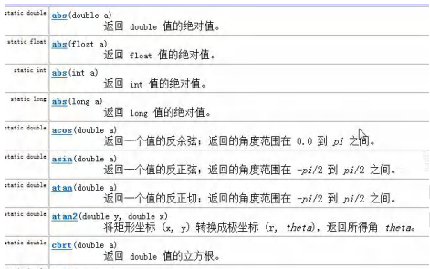

### 常见方法实例

```java
package com.Novice.Math;

public class MathMethod_ {

    public static void main(String[] args) {

        //看看 Math 常用的方法(静态方法)
        //1.abs 绝对值
        int abs = Math.abs(-9);
        System.out.println(abs);//9


        //2.pow 求幂
        double pow = Math.pow(2, 4);//2 的 4 次方
        System.out.println(pow);//16

        //3.ceil 向上取整,返回>=该参数的最小整数(转成 double);
        double ceil = Math.ceil(3.9);
        System.out.println(ceil);//4.0

        //4.floor 向下取整，返回<=该参数的最大整数(转成 double)
        double floor = Math.floor(4.001);
        System.out.println(floor);//4.0

        //5.round 四舍五入 Math.floor(该参数+0.5)
        long round = Math.round(5.51);
        System.out.println(round);//6

        //6.sqrt 求开方
        double sqrt = Math.sqrt(9.0);
        System.out.println(sqrt);//3.0


        //7.random 求随机数
            // random 返回的是 0 <= x < 1 之间的一个随机小数
            // 思考：请写出获取 a-b 之间的一个随机整数,a,b 均为整数 ，比如 a = 2, b=7
            // 即返回一个数 x 2 <= x <= 7
            // 老韩解读 Math.random() * (b-a) 返回的就是 0 <= 数 <= b-a

        // (1) (int)(a) <= x <= (int)(a + Math.random() * (b-a +1) )

        // (2) 使用具体的数给小伙伴介绍 a = 2 b = 7
        // (int)(a + Math.random() * (b-a +1) ) = (int)( 2 + Math.random()*6)
        // Math.random()*6 返回的是 0 <= x < 6 小数
        // 2 + Math.random()*6 返回的就是 2<= x < 8 小数
        // (int)(2 + Math.random()*6) = 2 <= x <= 7

        // (3) 公式就是 (int)(a + Math.random() * (b-a +1) )

        for(int i = 0; i < 100; i++) {
            System.out.println((int)(2 + Math.random() * (7 - 2 + 1)));
        }


        //8.max , min 返回最大值和最小值
        int min = Math.min(1, 9);
        int max = Math.max(45, 90);
        System.out.println("min=" + min);
        System.out.println("max=" + max);


        //返回20个10~21的整数
        for (int i = 0; i < 20; i++) {
            System.out.println((int) (10+Math.random()*(12)));
        }


    }
}
```


## Arrays 类 

### Arrays 类常见方法

```apl
Arrays里面包含了一系列静态方法，用于'管理或操作数组'(比如排序和搜索)

1) toString 返回数组的字符串形式   
    Arrays.toString(arr)

2) sort 排序(自然排序和定制排序)
    Integer arr[] = {1,-1,7,0,89};

3) binarySearch通过二分搜索法进行查找,要求必须排好序
    int index = Arrays.binarySearch(arr, 3);

4) copyOf 数组元素的复制
    Integer[] newArr = Arrays.copyOf(arr, arr.length);
   
5) fil数组元素的填充
    Integer[] num = new Integer[{9.3.23;Arrays.fill(num,99);

6) equals 比较两个数组元素内容是否完全一致
    boolean equals = Arrays.equals(arr, arr2);

7) asList将一组值，转换成list
    List<lnteger> asList = Arrays.asList(2.3,4.5.6,1);
    System.out.printIn("asList=" + asList);
```


### Arrays 类常见方法实例

```java
package com.Novice.Arrays;

import java.util.Arrays;
import java.util.Comparator;

public class ArraysMethod01 {

    public static void main(String[] args) {

        Integer[] i1 = {1, 2, 3};


        //遍历数组
        for (int i = 0; i < i1.length; i++) {
            System.out.println(i1[i]);
        }
        System.out.println(Arrays.toString(i1));


        //数组普通排序
        Integer[] arr = {1, -4, 6, 4, 7, -8, 9};
        System.out.println(Arrays.toString(arr));
        //1.可以直接使用冒泡排序，也可以直接使用Arrays提供的sort方法排序
        //2．因为数组是引用类型，所以通过sort排序后，会直接影响到实参arr
        Arrays.sort(arr);
        System.out.println(Arrays.toString(arr));


        //数组定制排序
        //3.sort重载的，也可以通过传入一个接口Comparator实现定制排序
        //4.调用定制排序时，传入两个参数
        //(1)排序的数组 arr
        //(2)实现了Comparator接口的匿名内部类

        //5.源码分析
        //(1) Arrays.sort(arr, new Comparator()

        //(2) 最终到 TimSort 类的
        //private static <T> void binarySort(T[] a, int lo, int hi, int start, // Comparator<? super T> c)()

        //(3) 执行到 binarySort 方法的代码, 会根据动态绑定机制 c.compare()执行我们传入的// 匿名内部类的 compare ()
        //        while (left < right) {
        //            int mid = (left + right) >>> 1;
        //            if (c.compare(pivot, a[mid]) < 0)
        //                right = mid;
        //            else
        //                left = mid + 1;
        //        }

        //(4) new Comparator() {
        //        @Override
        //        public int compare(Object o1, Object o2) {
        //            Integer i1 = (Integer) o1;
        //            Integer i2 = (Integer) o2;
        //            return i2 - i1;
        //        }
        //    }

        //(5) public int compare(Object o1, Object o2) 返回的值>0 还是 <0
        // 会影响整个排序结果, 这就充分体现了 接口编程+动态绑定+匿名内部类的综合使用// 将来的底层框架和源码的使用方式，会非常常见


        //定制排序

        Integer[] i2 = {99, -32, 355, 8, 54, 85, -43};

        Arrays.sort(i2, new Comparator() {
            @Override
            public int compare(Object o1, Object o2) {
                Integer o11 = (Integer) o1;
                Integer o22 = (Integer) o2;
                //return o11 - o22;
                return o22-o11;
            }
        });

        System.out.println("i2排序后"+Arrays.toString(i2));


    }
}
```

```java
package com.Novice.Arrays;

import java.util.Arrays;
import java.util.Comparator;

public class ArraysSortCustom {
    public static void main(String[] args) {


        int[] arr = {1, -1, 8, 0, 20};

        sort01(arr);
        System.out.println(Arrays.toString(arr));


        sort02(arr, new Comparator() {  //这里使用了内部类，所以需要new一个新对象
            @Override
            public int compare(Object o1, Object o2) {
                Integer o11 = (Integer) o1;
                Integer o22 = (Integer) o2;
//                return o11-o22;
                return o22-o11;
            }
        });

        System.out.println(Arrays.toString(arr));


    }


    //普通冒泡排序
    public static void sort01(int[] arr){   //为什么一定是static方法才可以在main中被直接调用？

        for (int i = 0; i < arr.length-1; i++) {
            for (int j = 0; j < arr.length-1-i; j++) {

                if(arr[j]>arr[j+1]){
                    int temp = arr[j];
                    arr[j]=arr[j+1];
                    arr[j+1]=temp;

                }
            }
        }


    }


    //使用Comparator(o1,o2)的冒泡排序
    public static void sort02(int[] arr, Comparator c){

        for (int i = 0; i < arr.length-1; i++) {
            for (int j = 0; j < arr.length-1-i; j++) {

                if(c.compare(arr[j],arr[j+1])>0){
                    int temp = arr[j];
                    arr[j]=arr[j+1];
                    arr[j+1]=temp;

                }
            }
        }


    }
}
```

```java
package com.Novice.Arrays;

import java.util.Arrays;
import java.util.List;

public class ArraysMethod02 {
    public static void main(String[] args) {


        Integer[] arr = {1, 2, 90, 123, 567};


        // binarySearch 通过二分搜索法进行查找
            //1. 使用 binarySearch 二叉查找
            //2. 要求该数组是有序的. 如果该数组是无序的，不能使用 binarySearch
            //3. 如果数组中不存在该元素，就返回 return -(low + 1); // key not found.

        int index = Arrays.binarySearch(arr, 567);
        System.out.println("index=" + index);


        //copyOf 数组元素的复制
            //1. 从 arr 数组中，拷贝 arr.length 个元素到 newArr 数组中
            //2. 如果拷贝的长度 > arr.length 就在新数组的后面 增加 null
            //3. 如果拷贝长度 < 0 就抛出异常 NegativeArraySizeException
            //4. 该方法的底层使用的是 System.arraycopy()
        Integer[] newArr = Arrays.copyOf(arr, arr.length);
        System.out.println("==拷贝执行完毕后==");
        System.out.println(Arrays.toString(newArr));


        //数组元素的填充
        Integer[] num = new Integer[]{9,3,2};
            //1. 使用 99 去填充 num 数组，可以理解成是替换原理的元素
        Arrays.fill(num, 99);
        System.out.println("==num 数组填充后==");
        System.out.println(Arrays.toString(num));


        //equals 比较两个数组元素内容是否完全一致
        Integer[] arr2 = {1, 2, 90, 123};
            //1. 如果 arr 和 arr2 数组的元素一样，则方法 true;
            //2. 如果不是完全一样，就返回 false
        boolean equals = Arrays.equals(arr, arr2);
        System.out.println("equals=" + equals);


        //asList 将一组值，转换成 list
            //1. asList 方法，会将 (2,3,4,5,6,1)数据转成一个 List 集合
            //2. 返回的 asList 编译类型 List(接口)
            //3. asList 运行类型 java.util.Arrays#ArrayList, 是 Arrays 类的
            // 静态内部类 private static class ArrayList<E> extends AbstractList<E>
            // implements RandomAccess, java.io.Serializable
        List asList = Arrays.asList(2,3,4,5,6,1);
        System.out.println("asList=" + asList);
        System.out.println("asList 的运行类型" + asList.getClass());


    }


}


//    public static void main(String[] args) {
//
//        Integer[] i1 = {1,334,434,4343,-344};
//
//        //二叉查找
//        int i2 = Arrays.binarySearch(i1,434);
//        System.out.println(i2);
//
//        //数组元素的复制
//
//        Integer[] i3 = Arrays.copyOf(i1,4);
//        System.out.println(Arrays.toString(i3));
//
//        //数组元素的填充
//        Arrays.fill(i3,99);
//        System.out.println(Arrays.toString(i3));
//
//
//        //比较两个数组元素内容是否完全一致
//        boolean b = Arrays.equals(i1,i3);
//        System.out.println(b);
//
//        //将一组值，转换成 list
//
//        List i4 = Arrays.asList(i1);
//        System.out.println(i4);
//        System.out.println(i4.getClass());
//
//    }
```

### Arrays类Test

```apl
案例:
自定义Book类，里面包含name和price，按price排序(从大到小)，要求使用两种方式排序。

使用前面学习过的传递实现Comparator接口匿名内部类，也称为定制排序。
```


```java
package com.Novice.Arrays;

import java.util.Arrays;
import java.util.Comparator;

public class ArrayExercise {
    public static void main(String[] args) {

        Book[] books = new Book[4];
        books[0] = new Book("红楼梦", 100);
        books[1] = new Book("金瓶梅新", 90);
        books[2] = new Book("青年文摘 20 年", 5);
        books[3] = new Book("java 从入门到放弃~", 300);


        //按照价格排序
        Arrays.sort(books, new Comparator<Book>() { //调用并重写了常用类Arrays的排序方法
            @Override
            public int compare(Book o1, Book o2) {
                Integer o11 = (Integer) o1.getPrice();
                Integer o22 = (Integer) o2.getPrice();
                double o3 = o11 - o22;

                if (o3 > 0) {
                    return -1;
                } else if (o3 < 0) {
                    return 1;

                } else {
                    return 0;
                }


            }
        });
        System.out.println(Arrays.toString(books));


        //按照书名长度排序
        Arrays.sort(books, new Comparator<Book>() {
            @Override
            public int compare(Book o1, Book o2) {
                return (o1.getName().length()-o2.getName().length());
            }
        });

        System.out.println(Arrays.toString(books));


    }
}


class Book {

    private String name;
    private int price;


    public Book(String name, int price) {
        this.name = name;
        this.price = price;
    }


    public String getName() {
        return name;
    }

    public void setName(String name) {
        this.name = name;
    }

    public int getPrice() {
        return price;
    }

    public void setPrice(int price) {
        this.price = price;
    }


    @Override
    public String toString() {
        return "Book{" +
                "name='" + name + '\'' +
                ", price=" + price +
                '}';
    }
}
```


## System 类

### System 类常见方法

```apl
1) exit 退出当前程序

2) arraycopy:复制数组元素，比较适合底层调用，一般使用Arrays.copyOf完成复制数组.
    int[] src={1,2,3];
    int[] dest = new int[3];
    System.arraycopy(src，0 ，dest ，0 ，3);
    
3) currentTimeMillens: 返回当前时间距离1970-1-1的毫秒数

4)gc:运行垃圾回收机制System.gc();
```


### System常见方法实例

```java
package com.Novice.system_;

import java.util.Arrays;

public class System_ {
    public static void main(String[] args) {


        //exit 退出当前程序
        System.out.println("ok1");
            //1. exit(0) 表示程序退出
            //2. 0 表示一个状态 , 正常的状态
        System.exit(0);
        System.out.println("ok2");


        //arraycopy ：复制数组元素，比较适合底层调用，
        // 一般使用 Arrays.copyOf 完成复制数组
        int[] src = {1, 2, 3};
        int[] dest = new int[3];// dest 当前是 {0,0,0}
        System.arraycopy(src, 0, dest, 0, 3);

        //1. 主要是搞清楚这五个参数的含义
        //2.   源数组
            // * @param src the source array. // srcPos： 从源数组的哪个索引位置开始拷贝
            // * @param srcPos starting position in the source array. // dest : 目标数组，即把源数组的数据拷贝到哪个数组
            // * @param dest the destination array. // destPos: 把源数组的数据拷贝到 目标数组的哪个索引
            // * @param destPos starting position in the destination data. // length: 从源数组拷贝多少个数据到目标数组
            // * @param length the number of array elements to be copied. System.arraycopy(src, 0, dest, 0, src.length);
            // int[] src={1,2,3};
        System.out.println("dest=" + Arrays.toString(dest));//[1, 2, 3]


        //currentTimeMillens:返回当前时间距离 1970-1-1 的毫秒数
        System.out.println(System.currentTimeMillis());

    }
}
```


## BigInteger 和 BigDecimal 类

### 应用场景:

```apl
1)Biglnteger适合保存比较大的整型

2) BigDecimal适合保存精度更高的浮点型(小数)
```


### 常见方法

```apl
1) add 加

2) subtract减

3) multiply乘

4) divide除
```


#### BigInteger实例

```java
package com.Novice.bigNum;

import java.math.BigInteger;

public class BigInteger_ {

    public static void main(String[] args) {


        BigInteger bigInteger = new BigInteger("45643456435443483435464684346846848");
        BigInteger bigInteger1 = new BigInteger("5453434346434343464464343464");
        System.out.println(bigInteger.add(bigInteger1));//加
        System.out.println(bigInteger.subtract(bigInteger1));//减
        System.out.println(bigInteger.multiply(bigInteger1));//乘
        System.out.println(bigInteger.divide(bigInteger1));//除


    }
}
```


#### BigDecimal实例

```java
package com.Novice.bigNum;

import java.math.BigDecimal;

public class BigDecimal_ {

    public static void main(String[] args) {

        BigDecimal bigDecimal = new BigDecimal("48.484848484524878678346867/79979797+979767");
        BigDecimal bigDecimal1 = new BigDecimal("12.13876874546843546468468346879767646464");
        System.out.println(bigDecimal.add(bigDecimal1));//加
        System.out.println(bigDecimal.subtract(bigDecimal1));//减
        System.out.println(bigDecimal.multiply(bigDecimal1));//乘

        System.out.println(bigDecimal.divide(bigDecimal1));//除  //可能抛出异常 ArithmeticException
        //在调用 divide 方法时，指定精度即可. BigDecimal.ROUND_CEILING
        //如果有无限循环小数，就会保留 分子 的精度
        bigDecimal = bigDecimal.divide(bigDecimal,BigDecimal.ROUND_CEILING);
        System.out.println(bigDecimal);


    }
}

```


## 日期类


### 第一代日期类


```apl
1) Date:精确到毫秒，代表特定的瞬间

2) SimpleDateFormat:格式和解析日期的类
   
   SimpleDateFormat格式化和解析日期的具体类。
   它允许进行格式化(日期->文本)、解析(文本->日期)和规范化.

```

```java
package com.Novice.date_;

import java.text.ParseException;
import java.text.SimpleDateFormat;
import java.util.Date;
import java.util.logging.SimpleFormatter;

public class Date01 {

    public static void main(String[] args) throws ParseException {

        //1. 获取当前系统时间
        //2. 这里的 Date 类是在 java.util 包
        //3. 默认输出的日期格式是国外的方式, 因此通常需要对格式进行转换
        Date d1 = new Date();//获取当前系统时间
        System.out.println("d1 = " + d1);

        Date d2 = new Date(955151);//获取某个时间对应的毫秒数
        System.out.println("d2" + d2);


        //1. 创建 SimpleDateFormat 对象，可以指定相应的格式
        //2. 这里的格式使用的字母是规定好，不能乱写
        SimpleDateFormat sdf = new SimpleDateFormat("YYYY年MM月dd日 hh:mm:ss E");

        String formate = sdf.format(d1);// format:将日期转换成指定格式的字符串
        System.out.println(formate);


        //1. 可以把一个格式化的 String 转成对应的 Date
        //2. 得到 Date 仍然在输出时，还是按照国外的形式，如果希望指定格式输出，需要转换
        //3. 在把 String -> Date ， 使用的 sdf 格式需要和你给的 String 的格式一样，否则会抛出转换异常
        String parse = String.valueOf(sdf.parse(formate));
        System.out.println(parse);

        System.out.println(sdf.parse(formate));
        //就是将已经格式化的时间，再利用对象sdf调用SimpleDateFormat的方法parse，将格式化的时间转化为非格式化形式


    }
}

```

### 第二代日期类

```apl
1) 第二代日期类，主要就是Calendar类(日历)。
   public abstract class Calendar extends object implements  Serializable,Cloneable,Comparable<Calendar>
   
2) Calendar类是一个抽象类，
   它为特定瞬间与一组诸如 YEAR、MONTH、DAY_OF_MONTH、HOUR等日历宝段之间的转换
   提供了一些方法。
   
   并为操作日历字段（例如获得下星期的日期)提供了一些方法。
```

```java
package com.Novice.date_;

import java.util.Calendar;

public class Calendar_ {
    public static void main(String[] args) {

//1. Calendar 是一个抽象类， 并且构造器是 private
//2. 可以通过 getInstance() 来获取实例
//3. 提供大量的方法和字段提供给程序员
//4. Calendar 没有提供对应的格式化的类，因此需要程序员自己组合来输出(灵活)
//5. 如果我们需要按照 24 小时进制来获取时间，Calendar.HOUR ==改成=> Calendar.HOUR_OF_DAY


        Calendar c = Calendar.getInstance(); //通过 getInstance()创建日历类对象
        System.out.println("c=" + c);

        //2.获取日历对象的某个日历字段
        System.out.println("年：" + c.get(Calendar.YEAR));

        System.out.println("月：" + (c.get(Calendar.MONTH) + 1));// 这里为什么要 + 1, 因为 Calendar 返回月时候，是按照 0 开始编号

        System.out.println("日：" + c.get(Calendar.DAY_OF_MONTH));

        System.out.println("小时：" + c.get(Calendar.HOUR));

        System.out.println("分钟：" + c.get(Calendar.MINUTE));

        System.out.println("秒：" + c.get(Calendar.SECOND));

        //Calender 没有专门的格式化方法，所以需要程序员自己来组合显示
        System.out.println(c.get(Calendar.YEAR) + "-" + (c.get(Calendar.MONTH) + 1) + "-" + c.get(Calendar.DAY_OF_MONTH) +
                " " + c.get(Calendar.HOUR_OF_DAY) + ":" + c.get(Calendar.MINUTE) + ":" + c.get(Calendar.SECOND));
    }
}
```

### 第三代日期类

```apl
前面两代日期类的不足分析

JDK 1.0中包含了一个java.util.Date类，
但是它的大多数方法已经在JDK 1.1引入Calendar类之后被弃用了。

而Calendar也存在问题是:
1)可变性:
  像日期和时间这样的类应该是不可变的。
2)偏移性:
   Date中的年份是从1900开始的，而月份都从0开始。
3)格式化:
  格式化只对Date有用，Calendar则不行。
4)此外，它们也不是线程安全的;
  不能处理闰秒等(每隔2天，多出1s)。
```

```apl
1) LocalDate(日期/年月日)、
   LocalTime(时间/时分秒)、
   LocalDateTime(日期时间/年月日时分秒)

JDK8加入
   LocalDate只包含日期，可以获取日期字段
   
   LocalTime只包含时间，可以获取时间字段
   
   LocalDateTime包含日期+时间，可以获取日期和时间字段
   
   案例演示[后ppt]:LocalDate_.java
LocalDateTime ldt = LocalDateTime.now();
//LocalDate.now();
//LocalTime.now();
//System.out.println(ldt);
```

```java
package com.Novice.date_;

import java.time.LocalDate;
import java.time.LocalDateTime;
import java.time.LocalTime;
import java.time.format.DateTimeFormatter;

public class localDateTime_ {
    public static void main(String[] args) {


        //1. 使用 now() 返回表示当前日期时间的 对象
        LocalDateTime ldt = LocalDateTime.now();
        System.out.println(ldt);


        //2. 使用 DateTimeFormatter 对象来进行格式化
        // 创建 DateTimeFormatter 对象
        DateTimeFormatter dateTimeFormatter = DateTimeFormatter.ofPattern("YYYY-MM-dd HH:mm:ss");
        String formate = dateTimeFormatter.format(ldt);
        System.out.println("格式化的日期是"+formate);


        System.out.println("年=" + ldt.getYear());
        System.out.println("月=" + ldt.getMonth());
        System.out.println("月=" + ldt.getMonthValue());
        System.out.println("日=" + ldt.getDayOfMonth());
        System.out.println("时=" + ldt.getHour());
        System.out.println("分=" + ldt.getMinute());
        System.out.println("秒=" + ldt.getSecond());

        LocalDate now = LocalDate.now(); //可以获取年月日
        LocalTime now2 = LocalTime.now();//获取到时分秒


        //+99天
        LocalDateTime ldt1 = ldt.plusDays(99);
        System.out.println("99天后是="+dateTimeFormatter.format(ldt1));

        //-99999999秒
        LocalDateTime ldt2 = ldt.minusSeconds(99999999);
        System.out.println("999999999秒之前的日期是:" + dateTimeFormatter.format(ldt2));
    }
}
```

###  DateTimeFormatter 格式日期类

```apl
类似于SimpleDateFormat
DateTimeFormat dtf = DateTimeFormatter.ofPattern(格式);
String str = dtf.format(日期对象);
```

### Instant 时间戳

```apl
类似于Date
提供了一系列和Date类转换的方式lnstant—>Date:

Date date= Date.from(instant);

Date—>Instant:
Instant instant = date.tolnstant();

案例演示:
Instant now = Instant.now();
Syetem.out.println(now);

Date date = Date.from(now);
Instant instant = date.tolnstant();
```

```java
package com.Novice.date_;

import java.time.Instant;
import java.util.Date;

public class Instant_ {

    public static void main(String[] args) {


        //1.通过 静态方法 now() 获取表示当前时间戳的对象
        Instant instant = Instant.now();
        System.out.println(instant);

        //2. 通过 from 可以把 Instant 转成 Date
        Date date = Date.from(instant);
        System.out.println(date);

        //3. 通过 date 的 toInstant() 可以把 date 转成 Instant 对象
        Instant instant1 = date.toInstant();
        System.out.println(instant1);
    }


}
```

```apl
outPut
2022-06-22T15:07:59.395456Z
Wed Jun 22 23:07:59 CST 2022
2022-06-22T15:07:59.395Z
```

```apl
时间戳是指格林威治时间1970年01月01日00时00分00秒(北京时间1970年01月01日08时00分00秒)起至现在的总秒数。
```


### 第三代日期类更多方法

```apl
LocalDateTime类

MonthDay类:检查重复事件

是否是闰年

增加日期的某个部分

使用plus方法测试增加时间的某个部分

使用minus方法测试查看一年前和一年后的日期

其他的方法，老师就不说，使用的时候，自己查看API使用即可
```


## 本章编程题

### 题目一


```apl
(1)将字符串中指定部分进行反转。比如将"abcdef"反转为"aedcbf"

(2)编写方法 public static String reverse(String str, int start , int end)搞定
```


```java
package com.Novice.本章Test;

public class Homework01 {


    public static void main(String[] args) {


        String str = "ckjaskcjbkj";
        String str2 = reverse(str, 0, str.length() - 1);
        System.out.println(str2);

        String str3;//在外面创建对象的用法很巧妙
        try {
            str3 = reverse(str2, 0, str.length());
        } catch (Exception e) {
            System.out.println(e.getMessage());//与reverse()方法里的throw巧妙配合
            return;
        }
        System.out.println(str3);

    }


    public static String reverse(String str, int start, int end) {


        if (!(str != null && start >= 0 && end > start && end < str.length())) {
            throw new RuntimeException("参数不正确");
        }

        char[] c = str.toCharArray();//String转char[]的方法
        
        for (int i = start, j = end; j > i; i++, j--) {//这里有两个变量

            char temp = c[i];
            c[i] = c[j];
            c[j] = temp;

        }


        return new String(c);//char[]转String的方法
    }

}


//    public static void main(String[] args) {
//
//
//        String a = "safahsfl";
//        StringBuffer s1 = reverse(a, 2, 5);
//        System.out.println(s1);
//    }
//
//    public static StringBuffer reverse(String str, int start, int end) {
//
//
//        StringBuffer s = new StringBuffer(str);
//        StringBuffer s1 = new StringBuffer(str.substring(start, end + 1));
//        s1.reverse();
//        s.replace(start, end + 1, String.valueOf(s1));
//
//
//        return s;
//
//
//    }


```


### 题目二

```apl
输入用户名、密码、邮箱，如果信息录入正确，则提示注册成功，否则生成异常对象
要求:
(1)用户名长度为2或3或4
(2)密码的长度为6，要求全是数字isDigital
(3）邮箱中包含和，并且@在.的前面

思路分析:
(1）先编写方法userRegister(String name,String pwd，String email){}
(2)针对输入的内容进行校核，如果发现有问题，就抛出异常，给出提示
(3)单独的写一个方法，判断密码是否全部是数字字符boolean
```

```java
package com.Novice.本章Test;

public class Homework02 {
    public static void main(String[] args) {
        String name = "abc";
        String pwd = "123456";
        String email = "jnc@qq.com";
        try {
            userReegister(name, pwd, email);
            System.out.println("账户注册完毕！");
        } catch (Exception e) {
            System.out.println(e.getMessage());
        }

    }


            /*
            输入用户名、密码、邮箱，如果信息录入正确，则提示注册成功，否则生成异常对象

                要求:
                (1)用户名长度为2或3或4
                (2)密码的长度为6，要求全是数字isDigital
                (3）邮箱中包含和，并且@在.的前面

                思路分析:
                (1）先编写方法userRegister(String name,String pwd,String email){}
                (2)针对输入的内容进行校核，如果发现有问题，就抛出异常，给出提示
                (3)单独的写一个方法，判断密码是否全部是数字字符boolean
             */


    public static void userReegister(String name, String pwd, String email) {

        //将if拆分开来，因为多个if()嵌套会导致代码可读性下降
        // 并且使用if(!(正确条件))的方式


        //0
        if (!(name==null||pwd==null||email==null)){
            throw new RuntimeException("输入不能为空");
        }


        //1
        int nameLength = name.length();
        if (!(nameLength == 2 || nameLength == 3 || nameLength == 4)) {
            throw new RuntimeException("用户名长度为2或3或4");
        }

        //2
        int pwdLength = pwd.length();
        if (!(pwdLength == 6 && isDigital(pwd))) {
            throw new RuntimeException("密码的长度为6，要求全是数字");
        }

        //3
        int i = email.indexOf('@');
        int j = email.indexOf('.');
        if (!(i > 0 && j > i)) {
            throw new RuntimeException("邮箱中包含和，并且@在.的前面");
        }


    }

    public static boolean isDigital(String pwd) {
        for (char c : pwd.toCharArray()) {
            if (c < '0' || c > '9') {
                return false;
            }
        }
        return true;

    }
}

```

 

### 题目三

```apl
```

```java
package com.Novice.本章Test;

import java.util.Locale;

public class Homework03 {


    public static void main(String[] args) {


        String str = "Com Novice Yon";
        PrintName(str);


    }


    //对输入的参数做一个验证
    
    //重要的编程技巧
        //(1)写出正确的情况
        //(2)然后取反即可
        //(3)这样写，你的思路就不乱

    public static void PrintName(String str) {

        if (str == null) {
            System.out.println("字符串不能为空");
            return;
        }

        String[] s = str.split(" ");
        if (s.length != 3) {
            System.out.println("请输入正确格式字符串，xxx xxx xxx");
            return;
        }

        String format = String.format("%s,%s .%c", s[2], s[0], s[1].toUpperCase().charAt(0));
        //此处使用了 输出的格式化
        //同时s[1].toUpperCase().charAt(0) 使用的非常巧妙(要弄明白0的含义)

        System.out.println(format);


    }

}


//    public static void main(String[] args) {
//
//        String a = "Com Novice Yon";
//        PrintName(a);
//
//    }
//
//
//    public static void PrintName(String str) {
//
//        String[] s = str.split(" ");
//        String c = String.valueOf(s[1].toCharArray()[0]);
//
//
//        System.out.println(s[2] + "," + s[0] + " ." + c.toUpperCase());
//
//    }
```


### 题目四

```apl
输入字符串，判断里面有多少个大写字母，多少个小写字母，多少个数字

思路分析
(1) 遍历字符串，如果 char在'0'~'9'就是一个数字
(2)如果char在'a'~'Z'就是一个小写字母
(3)如果char在 'A'~'Z'就是一个大写字母
(4)使用三个变量来记录统计结果
```

```java
package com.Novice.本章Test;

public class Homework04 {
    public static void main(String[] args) {

        String a = "casbkc113D54545cscS";
        count(a);

    }


    /*
            输入字符串，判断里面有多少个大写字母，多少个小写字母，多少个数字

                思路分析
                (1) 遍历字符串，如果 char在'0'~'9'就是一个数字
                (2)如果char在'a'~'Z'就是一个小写字母
                (3)如果char在 'A'~'Z'就是一个大写字母
                (4)使用三个变量来记录统计结果
     */


    public static void count(String str) {

        if (str == null) {
            System.out.println("输入不能为空");
            return;
        }


        int numCount = 0;
        int lowerCount = 0;
        int upperCount = 0;
        int otherCount = 0;


        //方法一:
        for (char c : str.toCharArray()) {
            if ((c >= '0' && c < '9')){
                numCount++;
            } else if ((c >= 'a' && c < 'z')) {
                lowerCount++;
            }else if ((c >= 'A' && c < 'Z')){
                upperCount++;
            }else{
                otherCount++;
            }
        }


        //方法二:
        //charAt(i)方法只可以取出某一位置的字符，但是无法修改。
        //源码里此处的value被定义为final类型
        int strLin = str.length();
        for (int i = 0; i < strLin; i++) {
            if ((str.charAt(i) >= '0' && str.charAt(i) < '9')){
                numCount++;
            } else if ((str.charAt(i) >= 'a' && str.charAt(i) < 'z')) {
                lowerCount++;
            }else if ((str.charAt(i) >= 'A' && str.charAt(i) < 'Z')){
                upperCount++;
            }else {
                otherCount++;
            }

        }

        System.out.println("数字个数:"+numCount);
        System.out.println("小写字母个数:"+lowerCount);
        System.out.println("大写字母个数:"+upperCount);
        System.out.println("其他字符个数:"+otherCount);

    }
}
```


### 对象指向理解测试

```apl

```

```java
package com.Novice.本章Test;

public class Homework05 {

    public static void main(String[] args) {

        String s1 = "hspedu";

        Animal a = new Animal(s1);
        Animal b = new Animal(s1);

        System.out.println(a == b);//F，是两个不同的对象
        System.out.println(a.equals(b));//F，因为Animal没有重写equals的方法，所以此处比较的依然是两个对象
        System.out.println(a.name == b.name);//T

        String s4 = new String("hspedu");
        String s5 = "hspedu";

        System.out.println(s1 == s4);//F，此s4是在堆中new了一个对象之后再指向"hspedu的"，s4指向的是一个对象
        System.out.println(s4 == s5);//F

        String t1 = "hello" + s1;
        //此处建立了一个StringBuffer对象，然后调用其append方法，分别添加，"hello"与s1
        //所以t1指向了堆中的一个value对象，该对象指向"hellohspedu"
        String t2 = "hellohspedu";
        System.out.println(t1.intern() == t2);//T
    }
}

//已知Animal类有属性name,可以通过有参构造为属性赋值
class Animal {
    String name;

    public Animal(String name) {
        this.name = name;
    }
}
```

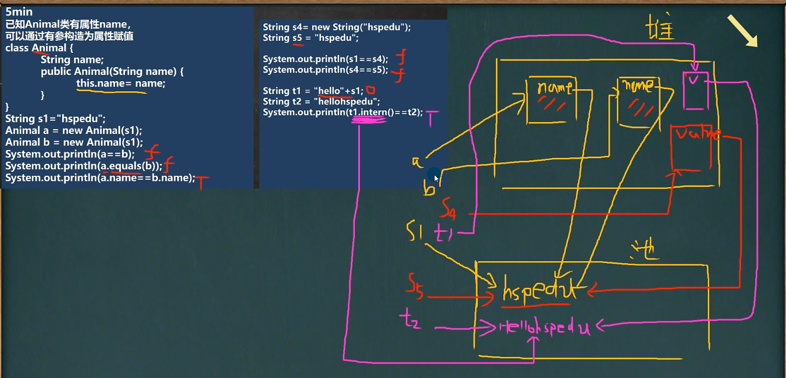

## 补充


### Java中无法访问的语句错误

由于多种原因导致无法编译代码时，发生无法访问的代码错误，其中包括：无限循环，无法访问的代码行之前的return语句。

让我们看一个例子-

#### 示例

```java
public class Demo{
   public static void main(String args[]){
      int val = 5;
      for (;;){
         if (val == 5){
            break;
            System.out.println("如果条件不成立，则将打印此行。");
         }
      }
   }
}
```

#### 输出结果

```java
/Demo.java:11: error: unreachable statement
System.out.println("如果条件不成立，则将打印此行。");
^
1 error
```

名为Demo的类包含主函数，并定义了一个值，并检查该值并运行空的“ for”循环。如果找到该值，则控件会跳出循环，否则将显示一条消息。由于这是一个无限循环，因此会产生无法访问的语句错误。


### 替换字符

ctrl + r: 当前文件内容替换，指的是在当前打开的文件中替换匹配的字符，只操作一个文件。

 

ctrl + shift + r: 在路径中替换，指的是在选定的目录下或者类包下，查找要被替换的字符，再在第二个输入框中输入要替换的字符，点击弹出框的右下角的replace或者replaceall即可。

当靠近极限的那一刻，就是突破极限，也是自己获得最多的时候


### java中如何将char数组转化为String？


1.直接在构造String时建立。 char data[] = {'s', 'g', 'k'}; String str = new String(data);
2.String有方法可以直接转换。 String.valueOf(char[] chr)就可以。 如： char[] cha = {'s','g','h'}; String n = String.valueOf(cha);


