单列集合


双列集合

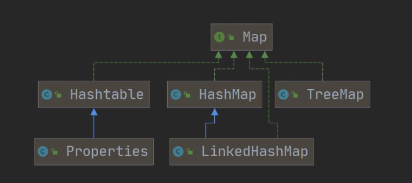

# 单列集合(Collection)


## 集合与数组对比 


### 数组

```apl
1)长度开始时必须指定，而且一旦指定，不能更改
2)保存的必须为同一类型的元素
3)使用数组进行增加/删除元素的示意代码-比较麻烦
```

```apl
1.增加新的Person对象:
    Person[] per1 = new Person[1];//大小是1
    per[O]=new Person();

2.写出Person数组扩容代码:
    Person[] pers2 = new Person[pers.length+1];	//新创建数组for{}
    pers2[pers2.length-1]=new Person();		   //拷贝per1数组的元素到pers2
```


### 集合

```apl
1)可以动态保存任意多个对象,使用比较方便!
2)提供了一系列方便的操作对象的方法:add、remove、set.get等
3)使用集合添加,删除新元素的示意代码-简洁了
```


## 两种集合类的框架


### 单列集合

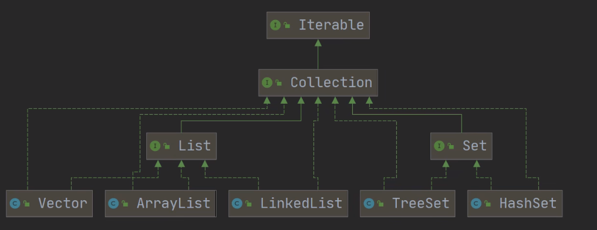

### 双列集合


```java
package com.Novice.collection_;

import java.util.ArrayList;
import java.util.Collection;
import java.util.HashMap;

public class Collection_ {
    public static void main(String[] args) {


        //集合主要是两组
        
        // 1.单列集合:
        // Collection接口有两个重要的子接口 List Set，他们的实现子类都是单列集合
        
        // 2.双列集合:
        // Map接口的实现子类是双列集合，存放的 K-V

        // Collection
        // Map

        @SuppressWarnings({"all"})
        ArrayList<Object> objects = new ArrayList<>(); // Collection
        objects.add("abc");
        objects.add("cde");


        @SuppressWarnings({"all"})
        HashMap<Object, Object> objectObjectHashMap = new HashMap<>();
        objectObjectHashMap.put("No1", "abc");     // Map
    }
}
```

## Collection 接口和常用方法


### Collection 接口实现类的特点

```apl
public interface Collection<E> extends lIterable<E>
```

```apl
1)collection实现子类可以存放多个元素，每个元素可以是Object

2)Collection的实现类，可以存放重复的元素(List)，有些不可以(Set)

3)Collection的实现类,有些是有序的(List)，有些不是有序(Set)

4)Collection接口没有直接的实现子类，是通过它的子接口 Set 和 List 来实现的
```


### Collection 接口常用方法

**子类 ArrayList演示**

```java
package com.Novice.collection_;

import java.util.ArrayList;
import java.util.List;

public class CollectionMethod {
    public static void main(String[] args) {


        // 说明:以ArrayList实现类来演示
            List list = new ArrayList();


        // 1.add:添加单个元素
            list.add("abc");
            list.add(10);// 此处会自动装箱为Integer  ——> 等价于 list.add(new Integer(10)）
            list.add(true);// 自动装箱
            System.out.println("list=" + list);


        // 2.contains:查找元素是否存在
            System.out.println(list.contains((Integer) 10));


        // 3.size:获取元素个数
            System.out.println(list.size());


        // 4.remove:删除指定元素
            list.remove(0);
            // 移除固定索引处的元素
            list.remove("abc");
            // 移除指定字符串
            list.remove((Boolean) true);
            // 移除包装类时需要强制转换类型
            list.remove((Integer) 10);
            // 无法删除数字？->当然可以，但是因为在list中存储的就是Integer，所以被romove的也一定是一个Integer对象
            System.out.println("list=" + list);


        // 5.isEmpty:判断是否为空
            System.out.println(list.isEmpty());


        // 6.clear:清空
            list.add("abc");
            list.add("bcd");
            System.out.println(list);

            list.clear();
            System.out.println(list);


        // 7.adldAll:添加多个元素
            ArrayList list1 = new ArrayList();
            list1.add("abc");
            list1.add("cde");

            list.addAll(list1);// addAlL(Collection c)
            System.out.println(list);


        // 8.containsAll:查找多个元素是否都存在
      	  System.out.println(list.containsAll(list1));// containsAll(Collection c)


        // 9.removeAll:删除多个元素
            list.removeAll(list1);// removeAll(Collection c)
            System.out.println(list);


    }
}
```


### Collection 接口遍历元素方式


#### 使用 Iterator(迭代器)

```apl
1) Iterator对象称为迭代器，主要用于遍历 Collection集合中的元素。

2) 所有实现了Collection接口的集合类都有一个iterator()方法，
   用以返回一个实现了Iterator接口的对象，即可以返回一个迭代器。
   
3) Iterator的结构.[看一张图]

4) Iterator仅用于遍历集合，Iterator本身并不存放对象。
```

#### 迭代器的执行原理

```apl
lterator iterator = collection.iterator();	//得到一个集合的迭代器

1.hasNext(): 判断是否还有下一个元素
while(iterator.hasNext()){

2.next(0):
    1.下移
    2.将下移以后集合位置上的元素返回
      System.out.printin(iterator.next(0));
```

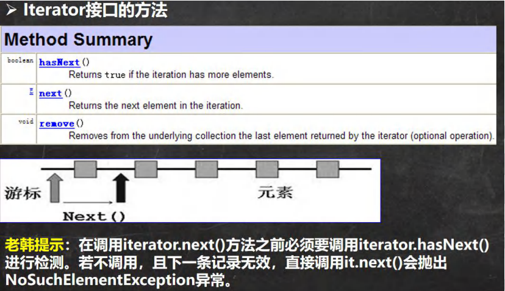

#### 迭代器的使用案例


```java
package com.Novice.collection_;

import java.util.ArrayList;
import java.util.Collection;
import java.util.Iterator;

public class CollectionIterator {
    public static void main(String[] args) {


        Collection collection = new ArrayList<>();


        collection.add(new Book(".国演义", "罗贯虫", 1.0));
        collection.add(new Book("小李飞刀", "古龙", 5.1));
        collection.add(new Book("红楼梦", "曹霜荒", 34.6));
        collection.add("abc");


        System.out.println("第一次遍历");
        Iterator iterator = collection.iterator();
        while (iterator.hasNext()) {
            Object next = iterator.next(); // 根据动态绑定机制
            // 编译类型是object，但是运行类型是实际的类型
            System.out.println("next=" + next);

        }


        System.out.println("第二次遍历");
        iterator = collection.iterator();// 要再次遍历需要重置迭代器  //itit快捷键

        while (iterator.hasNext()) {
            Object next = iterator.next();

        }
    }
}

class Book {
    String BookName;
    String Name;
    double age;

    public Book(String bookName, String name, double age) {
        BookName = bookName;
        Name = name;
        this.age = age;
    }

    public String getBookName() {
        return BookName;
    }

    public void setBookName(String bookName) {
        BookName = bookName;
    }

    public String getName() {
        return Name;
    }

    public void setName(String name) {
        Name = name;
    }

    public double getAge() {
        return age;
    }

    public void setAge(int age) {
        this.age = age;
    }

    @Override
    public String toString() {
        return "Book{" +
                "BookName='" + BookName + '\'' +
                ", Name='" + Name + '\'' +
                ", age=" + age +
                '}';
    }
}
```

#### 2-for 循环增强

```apl
增强for循环，可以代替iterator迭代器
```

```apl
特点:
 增强for就是简化版的iterator,本质一样。只能用于遍历集合或数组。

基本语法:
 for(元素类型元素名: 集合名或数组名){
	访问元素
}
```

##### 实例

```java
package com.Novice.collection_;

import java.util.ArrayList;
import java.util.Collection;

public class CollecctionFor_Each {
    public static void main(String[] args) {

        Collection collection = new ArrayList<>();


        collection.add(new Book(".国演义", "罗贯虫", 1.0));
        collection.add(new Book("小李飞刀", "古龙", 5.1));
        collection.add(new Book("红楼梦", "曹霜荒", 34.6));
        collection.add("abc");

        // 使用增强for
        // 增强for的底层依然是迭代器 itrator
        // 增强for可以说是简化版本的迭代器
        for (Object c : collection) {   // 快捷键 I
            System.out.println(c);
        }


        // 增强for也可以在数组使用
    }
}
```

### 课堂练习

```apl
1.创建3个 Dog {name, age}对象，放入到 ArrayList 中，赋给 List引用
2.用迭代器和增强for循环两种方式来遍历
3.重写Dog的toString方法,输出name和age
```

```java
package com.Novice.collection_;

import java.util.ArrayList;
import java.util.Iterator;
import java.util.List;

public class CollectionExercise {
    public static void main(String[] args) {


        List<Object> objects = new ArrayList<>();

        objects.add(new Dog("大黄", 6));
        objects.add(new Dog("小黄", 3));

        System.out.println("第一次迭代");
        for (Object o : objects) {
            System.out.println(o);
        }


        System.out.println("第二次迭代");
        Iterator<Object> iterator = objects.iterator();
        while (iterator.hasNext()) {
            Object next = iterator.next();
            System.out.println(next);

        }

    }
}


class Dog {

    String name;
    int age;

    public Dog(String name, int age) {
        this.name = name;
        this.age = age;
    }

    @Override
    public String toString() {
        return "Dog{" +
                "name='" + name + '\'' +
                ", age=" + age +
                '}';
    }
}
```

## ————————————

## List 接口和常用方法

### List 接口基本介绍

```apl
List接口是 collection接口的子接口 
```

```apl
1) List集合类中元素'有序'(即添加顺序和取出顺序一致)、且'可重复'

2) List集合中的每个元素都有其对应的顺序索引，即'支持索引'。

3) List容器中的'元素'都'对应'一个整'数型的序号'记载其在容器中的位置，
   可以根据序号存取容器中的元素。
   
常用的List是实现类:
	ArrayList
	LinkedList
	Vector
```

```java
package com.Novice.list_;

import java.util.ArrayList;
import java.util.List;

public class List_ {
    public static void main(String[] args) {


        // 1)List集合类中元素有序(即添加顺序和取出顺序一致)、且可重复[案例]

        List<Object> list = new ArrayList<>();

        list.add("abc");
        list.add("cde");

        list.add("def");
        list.add("def");

        System.out.println("顺序输出" + list);


        // 2)List集合中的每个元素都有其对应的顺序索引，即支持索引。[案例]
        System.out.println(list.get(0));


        // 3)JDK API中List接口的实现类常用的有:ArrayList、LinkedList和Vector。


    }
}
```

### List 接口的常用方法

```java
package com.Novice.list_;

import java.util.ArrayList;
import java.util.List;

public class ListMethod {
    public static void main(String[] args) {

        List list = new ArrayList<>();
        list.add("abc");
        list.add("cde");

        System.out.println(list);

        // 1.void add(int index, 0bject ele):在index位置插入ele元素
        list.add(1, "你好");
        System.out.println(list);


        // 2.boolean addAll(int index，Collection eles):从index位置开始将eles中的所有元素添加进来
        List list1 = new ArrayList<>();
        list1.add("abc");
        list1.add("cde");

        list.addAll(2, list1);
        System.out.println(list);


        // 3.Object set(int index，0bject ele):设置指定index位置的元素为ele ，相当于是替换。
        list.set(0, "hello");
        System.out.println(list);


        // 4.0bject get(int index):获取指定index位置的元素
        System.out.println(list.get(0));


        // 5.int indexOf(Object obj):返回obj在集合中首次出现的位置工int
        int a = list.indexOf("abc");
        System.out.println(a);


        // 6.lastIndexOf(Object obj):返回obj在当前集合中末次出现的位置0bject
        int b = list.lastIndexOf("abc");
        System.out.println(b);


        // 7.remove(int index):移除指定index位置的元素，并返回此元素
        list.remove(5);
        System.out.println(list);


        // 8.List subList(int fromIndex,int toIndex):返回从fromIndex到toIndex位置的子集合
        List list2 = list.subList(0, 4); // (0,4]
        System.out.println("list2=" + list2);

    }
}
```

### List 接口课堂练习

```apl
要求:使用List的实现类ArrayList完成:
    1.添加10个以上的元素
    2.在2号位插入一个元素
    3.获得第5个元素
    4.删除第6个元素
    5.修改第7个元素
    6.在使用迭代器遍历集合
```

```java
package com.Novice.list_;

import java.util.ArrayList;
import java.util.Iterator;
import java.util.List;

@SuppressWarnings({"all"})
public class ListExercise01 {
    public static void main(String[] args) {

        // 要求:使用List的实现类ArrayList完成:
        List list = new ArrayList<>();


        // 添加10个以上的元素(比如String "hello")
        for (int i = 0; i < 10; i++) {
            list.add("world" + i);
        }


        // 在2号位插入一个元素"你好"
        list.add(2, "你好");


        // 获得第5个元素
        list.get(4);


        // 删除第6个元素
        list.remove(5);


        // 修改第7个元素
        list.set(6, "nihao");


        // 在使用迭代器遍历集合
        Iterator iterator = list.iterator();

        while (iterator.hasNext()) {
            Object next = iterator.next();
            System.out.println(next);

        }


    }
}
```

### List 的三种遍历方式 

```apl
三种List
[ArrayList,，LinkedList，Vector]
```

#### 三种方式

```apl
方式一:
使用iterator
    lterator iter = col.iterator();
    while(iter.hasNext()){
        Object o = iter.next();
    }

方式二:
使用增强for
    for(Object o:col){}

方式三:
使用普通for
    fort(int i = 0; i < list.size(); i++){
    
        Object object = list.get(0);
        System.out.println(object);
    }

```

==说明: 使用LinkedList完成使用方式和ArrayList一样==

#### 实例

```java
package com.Novice.list_;

import java.util.*;

public class ListFor_Each {
    public static void main(String[] args) {


        List list = new ArrayList<>();

        // 下面的两个不同运行类型的实例，同样可以使用这三种遍历方法

        // List list = new Vector();
        // List list = new LinkedList();
        //《运行类型是new 后面的类型，编译类型是new前面的类型 》

        list.add("abc");
        list.add("cde");


        System.out.println("遍历方法一");
        Iterator iterator = list.iterator();
        while (iterator.hasNext()) {
            Object next = iterator.next();
            System.out.println(next);

        }


        System.out.println("遍历方法二");
        for (Object o : list) {
            System.out.println(o);
        }


        System.out.println("遍历方法三");
        for (int i = 0; i < list.size(); i++) {
            System.out.println(list.get(i));
        }

    }
}
```

### 课堂练习 

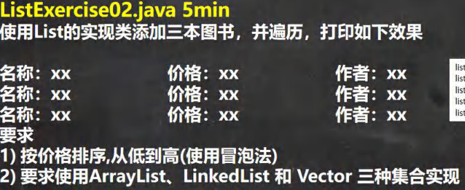

```java
package com.Novice.list_;

import java.util.ArrayList;
import java.util.List;

@SuppressWarnings({"all"})
public class ListExercise02 {
    public static void main(String[] args) {

        List list = new ArrayList<>();
        // List list = new Vector();
        // List list = new LinkedList();
        list.add(new Book("红楼梦", "曹雪芹", 100));
        list.add(new Book("西游记", "吴承恩", 10));
        list.add(new Book("水浒传", "施耐庵", 9));
        list.add(new Book("水浒传", "施耐庵", 88));
        list.add(new Book("水浒传", "施耐庵", 32));
        list.add(new Book("水浒传", "施耐庵", 65));
        list.add(new Book("西游记", "吴承恩", 80));

        sort(list);//调用静态方法

    }

    //静态方法，冒泡排序
	//价格要求是从小到大
    public static void sort(List list) {

        int size = list.size();

        for (int i = 0; i < size; i++) {
            for (int j = 0; j < size - 1; j++) {

                int a = ((Book) list.get(i)).price;// 向下转型
                int b = ((Book) list.get(j)).price;

                if (a < b) {
                    Book book = (Book) list.get(i);
                    list.set(i, list.get(j));
                    list.set(j, book);
                }

            }
        }
        for (Object o : list) {
            System.out.println(o);
        }

    }
}

@SuppressWarnings({"all"})
class Book {
    String BookName;
    String Name;
    int price;

    public Book(String bookName, String name, int price) {
        BookName = bookName;
        Name = name;
        this.price = price;
    }

    public String getBookName() {
        return BookName;
    }

    public void setBookName(String bookName) {
        BookName = bookName;
    }

    public String getName() {
        return Name;
    }

    public void setName(String name) {
        Name = name;
    }

    public double getPrice() {
        return price;
    }

    public void setPrice(int price) {
        this.price = price;
    }

    @Override
    public String toString() {
        return "Book{" +
                "BookName='" + BookName + '\'' +
                ", Name='" + Name + '\'' +
                ", age=" + price +
                '}';
    }
}
```

## ArrayList 底层结构和源码分析

### ArrayList 的注意事项

```apl
1) permits all elements, including null ,ArrayList可以加入null,并且多个

2) ArrayList是由'数组'来实现数据存储的

3) ArrayList 基本等同于Vector
   除了ArrayList是线程不安全(但执行效率高)
   如果在多线程情况下，不建议使用ArrayList
```

### ArrayList 的底层操作机制源码分析

```apl
ArrayList中维护了一个0bject类型的数组 elementData[]. 

    transient Object[] elementData; 
        //[debug看源码]
        //transient表示瞬间,短暂的,表示该属性不会被序列化列化
```

```apl
当创建ArrayList对象时:

 1) 无参构造器:
    则初始elementData容量为0次添加，则扩容elementData为10，
    如需要再次扩容，则扩容elementData为1.5
  
 2) 指定大小的构造器:
    则初始elementData容量为指定大小，如果需要则直接扩容elementData为1.5倍。

建议:自己去debug一把我们的ArrayList的创建和扩容的流程.
```

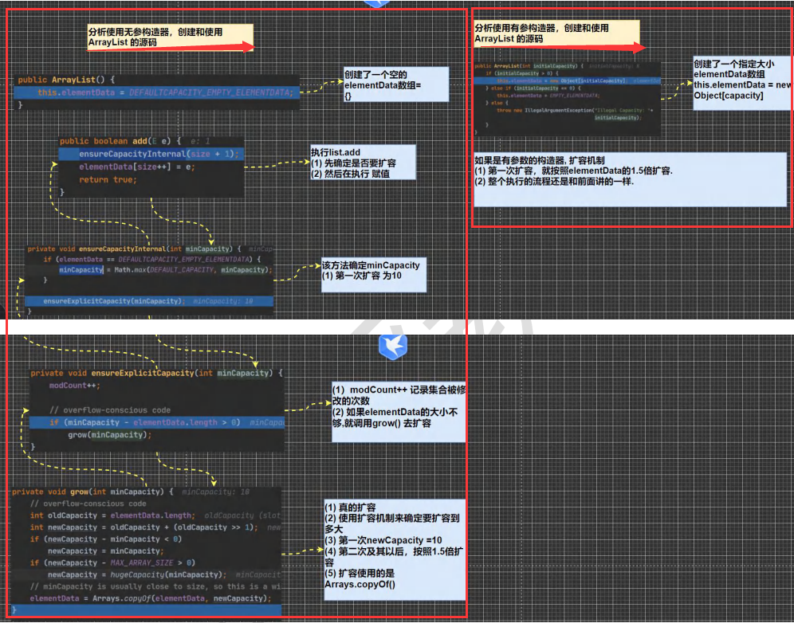

## Vector 底层结构和源码剖析

### Vector 基本介绍

```apl
Vector类的定义:
'public class vectorE>
'extends AbstractList<E>
'implements List<E>，RandomAccess，cloneable，Serializable
```

```apl
1) Vector底层也是一个对象数组，protected object[] -> elementData;

2) Vector是线程同步的，即'线程安全', Vector类的操作方法带有synchronized
   public synchronized E get(int index)f
		if (index >= elementCount)
			throw new ArraylndexOutOfBoundsException(index);
		return elementData(index);
}

3)在开发中，需要线程同步安全时，考虑使用Vector
```

### 实例(源码)

```java
package com.Novice.list_;

import java.util.Vector;

public class vector_ {
    public static void main(String[] args) {


        // 无参构造器
        // 有参数的构造
        Vector<Object> vector = new Vector<>();

        for (int i = 0; i < 10; i++) {
            vector.add(i);
        }
        vector.add(100);
        System.out.println("vector" + vector);

        /*
        //1. new Vector() 底层

            public Vector() {
                this(10);
            }
            补充：如果是 Vector vector = new Vector(8);
            走的方法:
            public Vector(int initialCapacity) {
                this(initialCapacity, 0);
            }


        2. vector.add(i)

            2.1 下面这个方法就添加数据到 vector 集合
                public synchronized boolean add(E e) {
                    modCount++;
                    ensureCapacityHelper(elementCount + 1);
                    elementData[elementCount++] = e;
                    return true;
                }
                
            2.2 确定是否需要扩容 -> ensureCapacityHelper(elementCount + 1);
            
                条件 ： minCapacity - elementData.length>0

                private void ensureCapacityHelper(int minCapacity) {
                  //overflow-conscious code
                    if (minCapacity - elementData.length > 0)
                        grow(minCapacity);
                     }
            
            2.3 如果 需要的数组太小 不够用，就扩容 , 扩容的算法
                newCapacity = oldCapacity + ((capacityIncrement > 0) ?
                                                capacityIncrement : oldCapacity);	//就是扩容两倍. 
                            
                private void grow(int minCapacity) {
                    // overflow-conscious code
                    int oldCapacity = elementData.length;
                    int newCapacity = oldCapacity + ((capacityIncrement > 0) ?
                                                 capacityIncrement : oldCapacity);
                    if (newCapacity - minCapacity < 0)
                        newCapacity = minCapacity;
                    if (newCapacity - MAX_ARRAY_SIZE > 0)
                        newCapacity = hugeCapacity(minCapacity);
                    elementData = Arrays.copyOf(elementData, newCapacity);
    }
*/

    }
}
```


## Vector 和 ArrayList 的比较

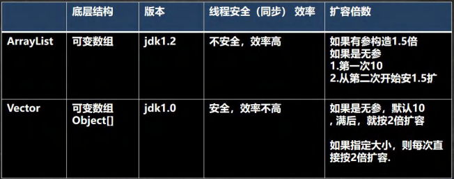

## LinkedList 底层结构

### LinkedList 的说明

```apl
1)LinkedList底层实现了'双向链表'和'双端队列'特点

2)可以添加任意元素(元素可以重复)，包括null

3)线程不安全,没有实现同步
```

### LinkedList 的底层算法机制

```apl
1) LinkedList底层维护了一个双向链表.

2) LinkedList中维护了两个属性first和last分别指向首节点和尾节点

3) 每个节点(Node对象)，里面又维护了prev、next、item三个属性，
   其中通过prev指向前一个，通过next指向后一个节点。最终实现双向链表
   
4)所以LinkedList的元素的添加和删除，不是通过数组完成的，相对来说效率较高。
```

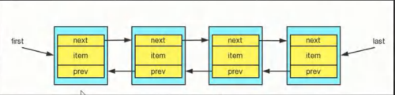

#### 实例

```java
package com.Novice.list_;

public class LinkedList01 {
    public static void main(String[] args) {

        // 模拟一个简单的双向链表
        Node node = new Node("node");
        Node node1 = new Node("node1");
        Node node2 = new Node("node2");

        // 连接三个结点，形成双向链表
        node.next = node1;
        node1.next = node2;
        node2.pre = node1;
        node1.pre = node;

        Node first = node;// 让 first 引用指向 node,就是双向链表的头结点
        Node last = node2;// 让 last 引用指向 node2,就是双向链表的尾结点


        System.out.println("从头到尾遍历双向链表");
        // 1.从头到尾遍历双向链表 ,//从尾到头遍历同理
        while (true) {
            if (first == null) {
                break;
            }

            System.out.println(first.obj);
            first = first.next;
        }


        System.out.println("演示链表的添加对象/数据");
        // 2.演示链表的添加对象/数据
        Node smith = new Node("smith(插入元素)");// 新建一个要被插入的节点

        node1.next = smith;
        node2.pre = smith;
        smith.next = node2;
        smith.pre = node1;

        first = node;
        while (true) {
            if (first == null) {
                break;
            }

            System.out.println(first.obj);
            first = first.next;
        }


    }
}


// 双向链表类
class Node {

    Object obj;
    Node pre;
    Node next;

    public Node(Object obj) {
        this.obj = obj;
    }

    @Override
    public String toString() {
        return "Node{" +
                "obj=" + obj +
                '}';
    }
}
```


### LinkedList 的增删改查案例(源码)

```java
package com.Novice.list_;

import java.util.Iterator;
import java.util.LinkedList;

@SuppressWarnings({"all"})
public class LinkedListCRUD {
    public static void main(String[] args) {


        LinkedList list = new LinkedList();
        list.add(1);
        list.add(2);
        list.add(3);

        // 演示一个删除结点的
        list.remove(1);// 这里默认删除的是第一个结点
        System.out.println("删除1号元素 list=" + list);


        // 修改某个结点对象
        list.set(1, 999);
        Integer o = (Integer) list.get(1);// 强制类型转换
        System.out.println("修改后 list.get(1)=" + o);


        // 因为 LinkedList 是 实现了 List 接口, 遍历方式
        System.out.println("===LinkeList 遍历迭代器====");
        Iterator iterator = list.iterator();
        while (iterator.hasNext()) {
            Object next = iterator.next();
            System.out.println(next);
        }

        System.out.println("===LinkeList 遍历增强 for====");
        for (Object o1 : list) {
            System.out.println(o1);
        }

        System.out.println("===LinkeList 遍历普通 for====");
        for (int i = 0; i < list.size(); i++) {
            System.out.println(list.get(i));
        }


    }
}
            /* 1. LinkedList linkedList = new LinkedList();
                  public LinkedList() {}    //无参构造
                  
               2. 这时 linkeList 的属性 
                  first = null 
                  last = null
               
               3. 执行 添加
                    public boolean add(E e) {
                        linkLast(e);
                        return true;
                    }
                    
               4.将新的结点，加入到双向链表的最后
                    void linkLast(E e) {
                        final Node<E> l = last;
                        final Node<E> newNode = new Node<>(l, e, null); //(pre, e, next)
                        last = newNode;
                        if (l == null){
                            first = newNode;
                        }else{
                            l.next = newNode;
                         }
                        size++;
                        modCount++;
                    }


             */


                /*
                     linkedList.remove(); // 这里默认删除的是第一个结点
                     
                    1. 执行 remove()
                        public E remove() {
                            return removeFirst();
                        }
                        
                    2. 执行removeFirst()
                        public E removeFirst() {
                            final Node<E> f = first;
                            if (f == null)
                                throw new NoSuchElementException();
                            return unlinkFirst(f);
                        }
                    
                    3. 执行 unlinkFirst, 将 f 指向的双向链表的第一个结点拿掉 //记住这段代码是建立在删除第一个元素的基础上的
                        private E unlinkFirst(Node<E> f) {
                          // assert f == first && f != null;
                            final E element = f.item;   //将f节点的值保存到element中，用于之后返回使用
                            f.item = null;  //将f节点的值置空
                            
                            final Node<E> next = f.next;
                            first = next;
                            f.next = null; // help GC
                            
                            if (next == null){
                                last = null;
                            }else{
                                next.prev = null;
                            }
                            
                            size--;
                            modCount++;
                            
                            return element;
                        }
```

### ArrayList 和 LinkedList 比较

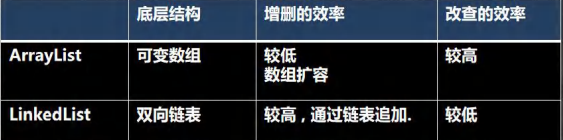

```apl
如何选择ArrayList和LinkedList:

1) '改查的操作多'，选择ArrayList

2) '增删的操作多'，选择LinkedList

3) 一般来说，在程序中，80%-90%都是查询，因此大部分情况下会选择ArrayList

4) 在一个项目中，根据业务灵活选择，也可能这样，
   一个模块使用的是ArrayList,另外一个模块是LinkedList,
   也就是说，要根据业务来进行选择
```

## ————————————

## Set 接口和常用方法

### Set 接口基本介绍

```apl
1) 无序(添加和取出的顺序不一致)，没有索引[后面演示]

2) 不允许重复元素，所以最多包含一个null

3) JDK API中Set接口的实现类有:
```

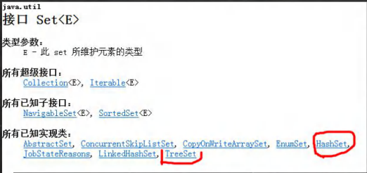

 

### Set 接口的常用方法 


```apl
和 List 接口一样, Set 接口也是 Collection 的子接口，
因此，常用方法和 Collection 接口一样.
```

#### 实例

```java
package com.Novice.set;

import java.util.HashSet;
import java.util.Iterator;
import java.util.Set;

@SuppressWarnings({"all"})
public class SetMethod {
    public static void main(String[] args) {

    //以Set接口的实现类HashSet来讲解Set接口的方法：
        //1. set 接口的实现类的对象(Set接口对象)，不能存放重复的元素,并且只可以添加一个null
        //2. set接口对象存放数据是无序(即添加的顺序和取出的顺序不一致)
        //3. 注意:取出的顺序的顺序虽然不是添加的顺序，但每次取出的顺序都一致。

        Set set = new HashSet<>();
        //此处使用set接口来指向HashSet,所以新建对象set只能调用Set中定义的方法
        set.add("abc");
        set.add("cde");
        set.add("abc");
        set.add(null);
        set.add(null);//再次添加null

        System.out.println("iterator遍历");
        Iterator iterator = set.iterator();
        while (iterator.hasNext()) {
            Object next =  iterator.next();
            System.out.println(next);
        }
        System.out.println(set);
        System.out.println();


        System.out.println("forEach遍历");
        for (Object o :set) {
            System.out.println(o);
        }
        System.out.println(set);


        System.out.println("使用普通的for循环遍历");//不可行
        for (int i = 0; i < set.size(); i++) {
            //System.out.println(set.); //set没有get()方法
        }

    }
}
```


## Set 接口实现类-HashSet

### HashSet 的全面说明


```apl
1) HashSet实现了Set接口
2) HashSet实际上是HashMap，看下源码.(图)

3) 可以存放null值，但是只能有一个null

4) HashSet不保证元素是有序的,取决于hash后，再确定索引的结果.
   (即，不保证存放元素的顺序和取出顺序一致)
   
5) 不能有重复元素/对象.在前面Set 接口使用已经讲过
```

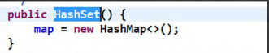

### 实例

```java
package com.Novice.set;

import java.util.HashSet;

public class HashSet_ {
    public static void main(String[] args) {


        HashSet<Object> hashset = new HashSet<>();
        //1.HashSet的底层是HashMap
        /*
           public HashSet() {
                map = new HashMap<>();
            }//HashSet的构造器使用的是HashMap
         */


        hashset.add(null);
        hashset.add(null);
        System.out.println(hashset);
        //2.HashSet可以存放null，但是只能有一个null,即元素不能重复

        //3.HashSet不保证元素是有序的,取决于hash后，再确定索引的结果.(即，不保证存放元素的顺序和取出顺序一致)
        //4.不能有重复元素/对象. 在前面Set 接口使用已经讲过


    }
}
```


### HashSet 案例说明

```java
package com.Novice.set;

import java.util.HashSet;

public class HashSet01 {
    public static void main(String[] args) {

        HashSet<Object> set = new HashSet<>();

        // 说明
        // 1. 在执行add方法后，会返回一个boolean值
        // 2．如果添加成功，返回true，否则返回false|
        System.out.println(set.add("abc"));
        System.out.println(set.add("cde"));
        System.out.println(set.add("def"));
        System.out.println(set.add("abc"));// false 因为之前已经添加过"abc"
        System.out.println(set.add(null));
        System.out.println(set.add(null));

        // 3.可以通过remove指定删除哪个对象
        set.remove("abc");

        System.out.println(set.add("abc"));// true
        System.out.println("set=" + set);


        System.out.println(set.add(new Dog("tom")));// true
        System.out.println(set.add(new Dog("tom")));// true 因为这是两个不同的对象
        System.out.println("set=" + set);


        // 在加深一下。非常经典的面试题。
        // 看源码，做分析，先给小伙伴留一个坑，以后讲完源码，你就了然
        // 去看他的源码，即 add 到底发生了什么? -> 底层机制。
        System.out.println(set.add(new String("123")));// true
        System.out.println(set.add(new String("123")));// false
        System.out.println(set.add(new Integer(456)));// true
        System.out.println(set.add(new Integer(456)));// false

        System.out.println("set=" + set);

    }
}


class Dog {

    String name;

    public Dog(String name) {
        this.name = name;
    }

    @Override
    public String toString() {
        return "Dog{" +
                "name='" + name + '\'' +
                '}';
    }
}
```


## HashSet 底层机制说明

```apl
分析HashSet底层是HashMap, 
HashMap底层是(数组+链表+红黑树)
```

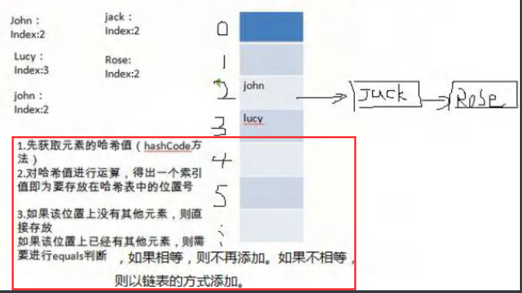


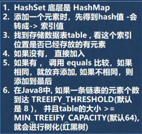


#### 源码分析

```java
package com.Novice.set;

import java.util.HashSet;

public class HashSetSource {

    public static void main(String[] args) {


        HashSet<Object> hashset = new HashSet<>();
        hashset.add("abc");
        hashset.add("cde");
        hashset.add("abc");
        System.out.println("set" + hashset);

        // 源码解读
        /*
            1.执行 构造器 HashSet()
                public HashSet() {
                    map = new HashMap<>();
                }


            2.执行 add()
                public boolean add(E e) { e = "java"
                    return map.put(e, PRESENT)==null;   
            //如果返回的是null，则表示插入成功，如果返回不是null，则表示插入的元素已经存在
                }


            3.执行 put()  该方法会执行 hash(key)得到key对应的hash值

                public V put(K key, V value) { key:"abc"  value:Object@808

                        //value来自于上一个方法里的PRESENT
                        //rivate static final Object PRESENT = new Object();
                        //为了让HashSet能够使用到HashMap，此处建立一个对象用于占位，且该用于占位的值始终不变

                    return putVal(hash(key), key, value, false, true);
                }


            4.执行 hash(key)
             static final int hash(Object key) {
                    int h;
                    return (key == null) ? 0 : (h = key.hashCode()) ^ (h >>> 16);
                    //此处如果key == null 则直接返回0
                    //如果不为null则返回 (h = key.hashCode()) ^ (h >>> 16)
                }


            5.执行 putVal()

             final V putVal(int hash, K key, V value, boolean onlyIfAbsent,
                               boolean evict) {
                    Node<K,V>[] tab; Node<K,V> p; int n, i;     //定义了辅助变量

                    //table就是HashMap的一个属性,类型是 Node[]
                        /if语句表示如果当前table是null，或者大小=0
                        //就是第一次扩容,到16个空间。
                    if ((tab = table) == null || (n = tab.length) == 0)
                        n = (tab = resize()).length;        //resizze()的作用就是给数组扩容


                        //(1)根据key，得到hash去计算该key应该存放到table表的哪个索引位置
                        //并把这个'位置'的'对象'，赋给p
                        //(2)判断p 是否为null
                        //(2.1)如果p 为null，表示还没有存放元素，
                        //     就创建一个Node -> (hash<用于以后比较元素>, key="abc" , value=PRESENT, null<表示node下一个节点为空>)
                    if ((p = tab[i = (n - 1) & hash]) == null)  //(n - 1) & hash表示n-1按位与hash
                        tab[i] = newNode(hash, key, value, null);
                    else {
                        //一个开发技巧提示： 在需要局部变量(辅助变量)时候，在创建
                        Node<K,V> e; K k;

                        //如果当前索引位置对应的链表的第一个元素和准备添加的 key 的 hash 值一样
                        //并且满足 下面两个条件之一:
                        //(1) 准备加入的 key 和 p 指向的 Node 结点的 key 是同一个对象
                        //(2) p 指向的 Node 结点的 key 的 equals() 和准备加入的 key 比较后相同，就不能加入
                        if (p.hash == hash &&
                            ((k = p.key) == key || (key != null && key.equals(k)))) //此处的equals方法由程序员决定
                            e = p;  //该e会被传入下面的代码中 -> if (e != null) {

                        //再判断 p 是不是一颗红黑树,
                        //如果是一颗红黑树，就调用 putTreeVal , 来进行添加
                        else if (p instanceof TreeNode)
                            e = ((TreeNode<K,V>)p).putTreeVal(this, tab, hash, key, value);

                        else {

                        //如果 table 对应索引位置，已经是一个链表, 且第一个位置的元素与传入元素不同，就使用 for 循环比较
                        //(1) 依次和该链表的每一个元素比较后，都不相同, 则加入到该链表的最后
                        //    注意在把元素添加到链表后，立即判断 该链表是否已经达到8 个结点
                        //    如果达到了, 就调用 treeifyBin() 对当前这个链表进行树化(转成红黑树)
                        //   注意，在转成红黑树时，要进行判断, 判断条件
                        //    if (tab == null || (n = tab.length) < MIN_TREEIFY_CAPACITY(64))
                        //    resize();    //即如table的长度<64就使用resize()对数组扩容
                        //    如果上面条件成立，先 table 扩容. // 只有上面条件不成立时，才进行转成红黑树

                        //(2) 依次和该链表的每一个元素比较过程中，如果有相同情况,就直接break

                            for (int binCount = 0; ; ++binCount) {
                                if ((e = p.next) == null) {
                                    p.next = newNode(hash, key, value, null);
                                    if (binCount >= TREEIFY_THRESHOLD - 1) // -1 for 1st
                                        treeifyBin(tab, hash);  //转成红黑树
                                    break;
                                }
                                if (e.hash == hash &&
                                    ((k = e.key) == key || (key != null && key.equals(k))))
                                    break;
                                p = e;
                            }
                        }
                        if (e != null) { // existing mapping for key
                            V oldValue = e.value;
                            if (!onlyIfAbsent || oldValue == null)
                                e.value = value;	//此处用于HashMap替换值
                            afterNodeAccess(e);
                            return oldValue;    //如果插入的元素不符合条件，就返回value(填充HashMap的固定值)，如果这个											     方法返回的不是null就表明插入失败
                        }
                    }
                    ++modCount; //记录操作的次数
                    if (++size > threshold)     //size就是我们每加入一个结点Node(k, v, h , next), size++
                        resize();   //resizze()的作用就是给数组扩容
                    afterNodeInsertion(evict); //用于LinkedHashSet？？
                    return null; //如果元素已经插入，就返回null
                }

         */
    }
}
```


### 分析HashSet的扩容和转成红黑树机制

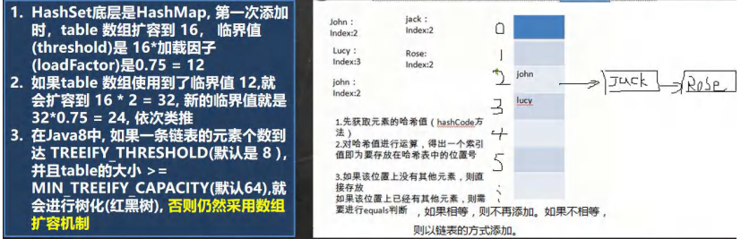

```java
package com.Novice.set;

import java.util.HashSet;

public class HashSetIncrement {


    public static void main(String[] args) {


        /*
        HashSet底层是HashMap，第一次添加时，table 数组扩容到16,
        临界值(threshold)是16*加载因子(LoadFactor)是0.75 = 12
        如果table 数组使用到了临界值12,就会扩容到16 * 2 = 32,
        新的临界值就是 32*0.75 =24，依次类推

         */


        HashSet<Object> hashset = new HashSet<>();
        // for (int i = 0; i < 100; i++) {
        //     hashset.add(i);
        // }


        /*
        在Java8中，如果一条链表的元素个数到达 TREEIFY_THRESHOLD(默认是8 )，
        并且table的大小>= MIN_TREEIFY_CAPACITY(默认64),
        就会进行树化(红黑树)，否则仍然采用数组扩容机制

         */


        for (int i = 0; i < 20; i++) {
            hashset.add(new num(i));
        }


        /*
        当我们向hashset增加一个元素，->Node -> 加入table，就算是增加了一个
        */

        HashSet<Object> hashset1 = new HashSet<>();
        for (int i = 0; i < 7; i++) {// 在第一个链表中加入了7个元素
            hashset1.add(new num(i));
        }

        for (int i = 0; i < 7; i++) {// 在第二个链表中加入7个元素，如果加入的总元素>12，就会resize();
            hashset1.add(new num1(i));
        }


    }
}


class num {

    int i;

    public num(int i) {
        this.i = i;
    }

    @Override
    public int hashCode() {
        return 100;
        // 因为hashset计算key的hashcode的值的时候，使用的是key.hashCode()
    }
}

class num1 {

    int i;

    public num1(int i) {
        this.i = i;
    }

    @Override
    public int hashCode() {
        return 200;
        // 因为hashset计算key的hashcode的值的时候，使用的是key.hashCode()
    }
}
```

###  HashSet 课堂练习 1

```apl
定义一个Employee类,该类包含:private成员属性name.age
要求:
1. 创建3个Employee对象放入HashSet中
2. 当name和age的值相同时，认为是相同员工,不能添加到HashSet集合中
   (重写hashcode与equals方法)
```

```java
package com.Novice.set;

import java.util.HashSet;
import java.util.Objects;

public class HashSetExercise01 {
    public static void main(String[] args) {

        /*
        定义一个Employee类，该类包含:private成员属性name ,
        age要求:创建3个Employee对象放入 HashSet中
        当name和age的值相同时，认为是相同员工，不能添加到HashSet集合中

         */

        HashSet<Object> hashset = new HashSet<>();
        hashset.add(new Emmployee("jhon", 12));// true
        hashset.add(new Emmployee("jack", 12));// true
        hashset.add(new Emmployee("jhon", 12));// false

        System.out.println("hashset" + hashset);


    }
}

class Emmployee {

    private String name;
    private int age;

    public Emmployee(String name, int age) {
        this.name = name;
        this.age = age;
    }

    public Emmployee(String join, String a, MyDate myDate) {
    }


    public void setName(String name) {
        this.name = name;
    }

    public void setAge(int age) {
        this.age = age;
    }


    @Override
    public String toString() {
        return "Emmployee{" +
                "name='" + name + '\'' +
                ", age=" + age +
                '}';
    }


    @Override
    public boolean equals(Object o) {
        if (this == o) return true;
        if (o == null || getClass() != o.getClass()) return false;
        Emmployee emmployee = (Emmployee) o;
        return age == emmployee.age && Objects.equals(name, emmployee.name);
    }

    @Override
    public int hashCode() {
        return Objects.hash(name, age);
    }
}
```

### HashSet 课后练习 2

```apl
定义一个Employee类
该类包含:
private成员属性name,sal,birthday(MyDate类型)，
其中birthday为MyDate类型(属性包括:year,month, day)。

要求:
1.创建3个Employee放入 HashSet中
2.当name和birthday的值相同时，认为是相同员工,不能添加到HashSet集合中
```

```java
package com.Novice.set;

import java.util.HashSet;
import java.util.Iterator;
import java.util.Objects;

@SuppressWarnings({"all"})
public class HashSetExercise02 {
    public static void main(String[] args) {


        // 定义一个Employee类，该类包含:
        // private成员属性name, sal, birthday(MyDate类.·型)，
        // 其中 birthday为MyDate类型 (属性包括:year, month, day)，

        // 要求:
        // 1. 创建3个Employee 放入 HashSet中
        // 2. 当name和birthday的值相同时，认为是相同员工, 不能添加到HashSet集合中


        HashSet<Object> hashset = new HashSet<>();

        hashset.add(new Employee("join", "a", new MyDate(2006, 8, 6)));// true
        hashset.add(new Employee("join", "b", new MyDate(2006, 8, 6)));// false
        hashset.add(new Employee("join", "c", new MyDate(2005, 6, 8)));// true

        Iterator<Object> iterator = hashset.iterator();
        while (iterator.hasNext()) {
            Object next = iterator.next();
            System.out.println(next);

        }


    }
}

@SuppressWarnings({"all"})
class Employee {
    private String name;
    private String sal;
    private MyDate birthday;// MyDate属性

    public Employee(String name, String sal, MyDate birthday) {// 构造器
        this.name = name;
        this.sal = sal;
        this.birthday = birthday;
    }


    @Override
    public boolean equals(Object o) {
        if (this == o) return true;
        if (o == null || getClass() != o.getClass()) return false;
        Employee employee = (Employee) o;
        return Objects.equals(name, employee.name) && Objects.equals(birthday, employee.birthday);
    }

    @Override
    public int hashCode() {
        return Objects.hash(name, birthday);
    }

    @Override
    public String toString() {
        return "Employee{" +
                "name='" + name + '\'' +
                ", sal='" + sal + '\'' +
                ", birthday=" + birthday +
                '}';
    }
}

@SuppressWarnings({"all"})
class MyDate {
    private int year;
    private int month;
    private int day;

    public MyDate(int year, int month, int day) {// 构造器
        this.year = year;
        this.month = month;
        this.day = day;
    }

    @Override
    public boolean equals(Object o) {
        if (this == o) return true;
        if (o == null || getClass() != o.getClass()) return false;
        MyDate myDate = (MyDate) o;
        return year == myDate.year && month == myDate.month && day == myDate.day;
    }

    @Override
    public int hashCode() {
        return Objects.hash(year, month, day);
    }

    @Override
    public String toString() {
        return "MyDate{" +
                "year=" + year +
                ", month=" + month +
                ", day=" + day +
                '}';
    }
}
```


### Set 接口实现类-LinkedHashSet

#### LinkedHashSet 的全面说明

```apl
1)LinkedHashSet是 HashSet的子类

2) LinkedHashSet底层是一个 LinkedHashMap，底层维护了一个 数组 + 双向链表

3) LinkedHashSet根据元素的hashCode值来决定元素的存储位置,同时使用链表维护元素的次序
   这使得元素看起来是以插入顺序保存的。
   
4)LinkedHashSet不允许添重复元素
```

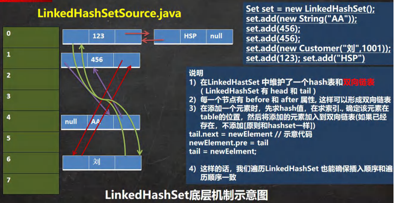

#### 实例

```apl
Car类(属性:name,price)，如果name和price一样，
则认为是相同元素，就不能添加。
```


```java
package com.Novice.set;

import java.util.LinkedHashSet;
import java.util.Objects;

public class LinkedHashSetExercise {
    public static void main(String[] args) {

        // Car类(属性:name , price)，如果name和 price一样，
        // 则认为是相同元素
        LinkedHashSet<Object> Lhashset = new LinkedHashSet<>();
        Lhashset.add(new Car("奥迪", 300000));// T
        Lhashset.add(new Car("法拉利", 1000000));// T
        Lhashset.add(new Car("奥迪", 300000));// F

        for (Object o : Lhashset) {
            System.out.println(o);
        }


    }
}


class Car {

    private String name;
    private int price;

    public Car(String name, int price) {
        this.name = name;
        this.price = price;
    }


    // 重写equals 方法和 hashCode
    // 两个对象相同的条件:
    // 1.当name 和 price 相同时，就返回相同的
    // 2.hashCode值，equals返回t

    @Override
    public boolean equals(Object o) {
        if (this == o) return true;
        if (o == null || getClass() != o.getClass()) return false;
        Car car = (Car) o;
        return price == car.price && Objects.equals(name, car.name);
    }

    @Override
    public int hashCode() {
        return Objects.hash(name, price);
    }

    @Override
    public String toString() {
        return "Car{" +
                "name='" + name + '\'' +
                ", price=" + price +
                '}';
    }
}
```


## ————————————

# 双列集合(Map)


##  Map 接口实现类的特点

```apl
注意:这里讲的是JDK8的Map接口特点

1)Map与Collection并列存在。用于保存具有映射关系的数据:Key-Value

2) Map 中的key和 value可以是任何引用类型的数据，会封装到 HashMap$Node 对象中

3) Map中的key不允许重复，原因和HashSet一样，前面分析过源码.

4)Map中的value可以重复

5) Map 的key 与 value都可以为null，注意key为null只能有一个，value为null,可以多个.

6)常用String类作为Map的key

7) key 和 value之间存在单向一对一关系，即通过指定的key 总能找到对应的value
```

```java
package com.Novice.map;

import java.util.HashMap;

public class Map_ {
    public static void main(String[] args) {


        // 1. Map 与 Collection 并列存在。用于保存具有映射关系的数据:Key-Value(双列元素)
        // 2. Map 中的 key 和 value 可以是任何引用类型的数据，会封装到 HashMap$Node 对象中
        // HashMap$Node就是hashMap的静态内部类

        // 3. Map 中的 key 不允许重复，原因和 HashSet 一样，前面分析过源码.
        // 4. Map 中的 value 可以重复
        // 5. Map 的 key 可以为 null, value 也可以为 null ，注意 key 为 null,
        // 只能有一个，value 为 null ,可以多个
        // 6. 常用 String 类作为 Map 的 key
        // 7. key 和 value 之间存在单向一对一关系，即通过指定的 key 总能找到对应的value


        HashMap<Object, Object> hashmap = new HashMap<>();
        hashmap.put("no1", "jhion");
        hashmap.put("no1", "lihua");//当有相同的 k , 就等价于替换.

        hashmap.put("no2", "jack");
        hashmap.put("no3", "jack");

        hashmap.put(null, null);
        hashmap.put(null, "null");//等价替换
        hashmap.put("fnull", null);

        hashmap.put(1, "nihao");
        hashmap.put(new Object(), "niaho");

        System.out.println("hashmap=" + hashmap);

        // 通过 get 方法，传入 key ,会返回对应的 value
        System.out.println(hashmap.get("fnull"));


    }

}

// Node 包含的属性字段
// static class Node<K, V> implements Map.Entry<K, V> {
//     final int hash;
//     final K key;
//     v value;
//     Node<K, V> next;
//
// }
```

## Map 接口常用方法

```java
package com.Novice.map;

import java.util.HashMap;
import java.util.Map;
import java.util.Map;

public class MapMethod {
    public static void main(String[] args) {

        // 1) put:添加
        Map map1 = new HashMap();
        map1.put("邓超", new Book("", 100));// ok
        map1.put("邓超", "孙俪");// 覆盖
        map1.put("王宝强", "马蓉");// ok
        map1.put("宋洁", "马蓉");// ok
        map1.put("刘令博", null);// ok
        map1.put(null, "刘亦菲");// ok
        map1.put("鹿晗", "关晓彤");// ok

        System.out.println("map1" + map1);


        // 2) remove:根据键删除映射关系
        Object remove = map1.remove(null);
        System.out.println(remove);
        System.out.println("map1=" + map1);


        // 3) get:根据键获取值
        Object luhan = map1.get("鹿晗");
        System.out.println(luhan);


        // 4) size:获取元素个数
        System.out.println(map1.size());


        // 5) isEmpty:判断个数是否为0
        System.out.println(map1.isEmpty());


        // 6) clear:清除
        map1.clear();
        System.out.println(map1.size());


        // 7) containsKey:查找键是否存在
        System.out.println(map1.containsKey(null));


    }
}


class Book {
    private String name;
    private int Price;

    public Book(String name, int price) {
        this.name = name;
        Price = price;
    }
}
```


## HashMap中Entry与Node

```apl
8) Map存放数据的key-value示意图,一对k-v是放在一个HashMap$Node中的，
   因为Node实现了Entry 接口，有些书上也说一对k-v就是一个Entry(如图)
```

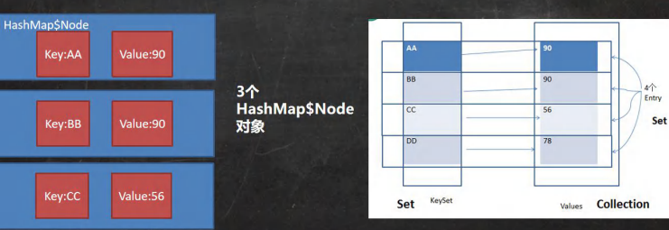

```java
package com.Novice.map;

import org.w3c.dom.Node;

import java.util.Collection;
import java.util.HashMap;
import java.util.Map;
import java.util.Set;

public class MapSource_ {
    public static void main(String[] args) {


        HashMap hashmap1 = new HashMap<>();
        hashmap1.put("no1", "jhion");
        hashmap1.put("no2", "lihua");
        hashmap1.put(new Car(), new Person());

        // 1.k-v最后是 HashMap$Node node =newNode(hash,key, value,null) ;
            //  即数据最终的存放位置是 HashMap$Node类型的 node对象中

        // 2.k-v为了方便程序员的遍历，还会创建 EntrySet 集合，该集合存放的元素的类型Entry，
            //  而一个Entry对象就有(k, v)两种元素, Entry是HashMap的静态内部类
            //  EntrySet<Entry<K, V>>  -> 即: transient Set<Map.Entry<K, V>> entrySet;

        // 3.entrySet 中，定义的类型是 Map.Entry，但是实际上存放的还是 HashMap$Node
            //   因为HashMap$Node实现了Entry内部类 -> HashMap$Node implements Map.Entry
            //   当一个类实现了一个接口，那么这个类的对象实例，就可以赋给这个接口
        Set set1 = hashmap1.entrySet();
        System.out.println(set1.getClass());// HashMap$EntrySet


        // Map和Collection是互不相关的两类集合，而Collection实现了Iterable接口，可以很方便使用增强for
        // 作为联通Collection和Map接口的桥梁，既能存储键值对，又能使用迭代器，岂不美哉
        // HashMap  -> Node
        /*
            static class Node<K, V> implements Map.Entry<K, V> {
                    final int hash;
                    final K key;
                    V value;
                    HashMap.Node<K, V> next;

                    public final K getKey() {  <-
                        return key;
                    }

                    public final V getValue() { <-
                        return value;
                    }

                }

         */


        for (Object node : set1) {
            // System.out.println(noade.getClass());//HashMap$Node

            // 为了从 HashMap$Node取出k-v

            Map.Entry entry = (Map.Entry) node;
            // 向下转型,因为给出的是object,强转Map,所以在编译阶段为了通过编泽才要向下转型


            System.out.println("entry.getClass()=" + entry.getClass());
            System.out.println(entry.getKey() + "-" + entry.getValue());
        }


        Set<Object> set = hashmap1.keySet();    // 此处集合里面的值，只是指向了Node里面的key
        Collection<Object> values = hashmap1.values();  ////此处集合里面的值，只是指向了Node里面的value

        for (Object o : hashmap1.keySet()) {}
        for (Object value : hashmap1.values()) {}

        System.out.println(set.getClass());
        System.out.println(set.getClass());


    }
}


class Car {


}

class Person {

}
```

## Map 接口遍历方法(6种)

```apl
Map遍历方式案例
1) containsKey:查找键是否存在
2) KeySet:获取所有的键
3) Values:获取所有的值
4) EntrySet:获取所有关系k-v
```

```java
package com.Novice.map;

import java.util.*;

public class MapFor {
    public static void main(String[] args) {

        Map map = new HashMap();
        map.put("邓超", new Book("", 100));// ok
        map.put("邓超", "孙俪");// 覆盖
        map.put("王宝强", "马蓉");// ok
        map.put("宋洁", "马蓉");// ok
        map.put("刘令博", null);// ok
        map.put(null, "刘亦菲");// ok
        map.put("鹿晗", "关晓彤");// ok


        // EntrySet是一个集合，集合放着内部类map.Entry，类型也就是Entry，里面有个getkey（）和getvalues（）方法

        // 为什么向下转型？
        // 1.编译器并不知道它是node对象，编译器现在只知道它是object类型的，
        //  object里面没有getkey方法，所以向下转型就是为了执行子类特有的方法。

        // 2.如果不向下转型，遍历时的编译类型就是Object，只有把编译类型转entry，这样才能访问getKey()方法

        // 3.运行类型一值没改变是Node，只是把编译类型从Object转成了Map.Entry

        // 不用向下转型也能成功遍历出来


        // 为什么不使用Node？
        // 1.默认访问修饰符在包外是不能访问的，这里是因为Node是默认的，不是public，所以只能转成Entry接口

        
        
// 第一组: 先取出 所有的 Key , 通过 Key 取出对应的 Value
        System.out.println("第一组: 先取出 所有的 Key , 通过 Key 取出对应的 Value");
        Set set = map.keySet();

        //(1) 增强 for
        System.out.println("方法一");
        for (Object key : set) {
            System.out.print(key + "-" + map.get(key) + " ");
        }

        //(2) 迭代器
        System.out.println("\n方法二");
        Iterator iterator = set.iterator();
        while (iterator.hasNext()) {
            Object key = iterator.next();
            System.out.print(key + "-" + map.get(key) + " ");

        }

        
        
 // 第二组: 把所有的 values 取出
        System.out.println("\n\n\n//第二组: 把所有的 values 取出");
        Collection values = map.values();
        
        //(1) 增强 for
        System.out.println("方法一");
        for (Object value : values) {
            System.out.print(value + " ");
        }


        //(2) 迭代器
        System.out.println("\n方法二");
        Iterator iterator1 = values.iterator();
        while (iterator1.hasNext()) {
            Object value = iterator1.next();
            System.out.print(value + " ");
        }

        
        
// 第三组: 通过 EntrySet 来获取 k-v
        System.out.println("\n\n\n //第三组: 通过 EntrySet 来获取 k-v");
        Set set1 = map.entrySet();

        //(1) 增强 for
        System.out.println("方法一");
        for (Object o : set1) {
            Map.Entry o1 = (Map.Entry) o;
            System.out.print(o1.getKey() + "-" + o1.getValue() + " ");
        }

        //(2) 迭代器
        System.out.println("\n方法二");
        Iterator iterator2 = set1.iterator();
        while (iterator2.hasNext()) {
            Object next = iterator2.next();
            Map.Entry next1 = (Map.Entry) next;
            System.out.print(next1.getKey() + "-" + next1.getValue() + " ");


        }


    }
}
```


## Map 接口课堂练习

```apl
使用HashMap添加3个员工对象

要求:
键:员工id
值:员工对象

并遍历显示工资 > 18000 的员工(遍历方式最少两种)
员工类:姓名、工资、员工id
```

```java
package com.Novice.map;

import java.util.HashMap;
import java.util.Map;
import java.util.Set;

public class MapExercise {
    public static void main(String[] args) {

        Map map = new HashMap();
        
        employee join = new employee("join", 12000, 1001);
        employee jack = new employee("jack", 18800, 1002);
        employee lihua = new employee("lihua", 18000, 1003);
        
        map.put(join.getId(), join);
        map.put(jack.getId(), jack);
        map.put(lihua.getId(), lihua);


        System.out.println("方法一");
        Collection values = map.values();
        for (Object value : values) {
            employee value1 = (employee) value;//向下转型，就可以调用子类的value1.getGongzi()方法了
            if (value1.getGongzi() > 18000) {
                System.out.println(value);
                System.out.println(value1);//因为Object也有toString方法，所以此处可以直接输出
            }
        }


        // HashMap,将收录的键值对存入Node，然后调用map.entrySet()方法建立一个以Entry<>类型对象为元素的数组
        // 然后实际存入的是Node(因为Node实现了Entry可以在运行过程中存入)。
        // 然后为了实现遍历方法，将Node对象以Object的编译？类型提出来，然后强制转换为Entry类型
        // 这相当于，建立了映射关系，然后通过Entry类型的指向，调用Node里面的内容
        
        System.out.println("方法二");
        Set set = map.entrySet();

        for (Object object : set) {

            Map.Entry entry = (Map.Entry) object;

            if (((employee) entry.getValue()).getGongzi() > 18000) {
                System.out.println(entry.getValue());
            }

        }


    }
}

class employee {
    private String name;
    private int gongzi;
    private int id;

    public employee(String name, int gongzi, int id) {
        this.name = name;
        this.gongzi = gongzi;
        this.id = id;
    }

    public String getName() {
        return name;
    }

    public int getGongzi() {
        return gongzi;
    }

    public int getId() {
        return id;
    }

    @Override
    public String toString() {
        return "employee{" +
                "name='" + name + '\'' +
                ", gongzi=" + gongzi +
                ", id=" + id +
                '}';
    }
}
```

## ————————————

## Map 接口实现类-HashMap

### HashMap 特点

```apl
1) Map接口的常用实现类:
   HashMap、Hashtable 和 Properties。

2) HashMap是 Map 接口使用频率最高的实现类。

3) HashMap 是以 key-val对的方式来存储数据(HashMap$Node类型)[案例Entry ]

4) key不能重复，但是值可以重复,允许使用null键和null值。

5) 如果添加相同的key，则会覆盖原来的key-val ,等同于修改.(key不会替换,val会替换)

6) 与HashSet一样，不保证映射的顺序，因为底层是以hash表的方式来存储的. 
   (jdk8的hashMap底层数组+链表+红黑树)
   
7) HashMap没有实现同步，因此是线程不安全的,方法没有做同步互斥的操作，没有synchronized
```

### HashMap 底层机制及源码剖析

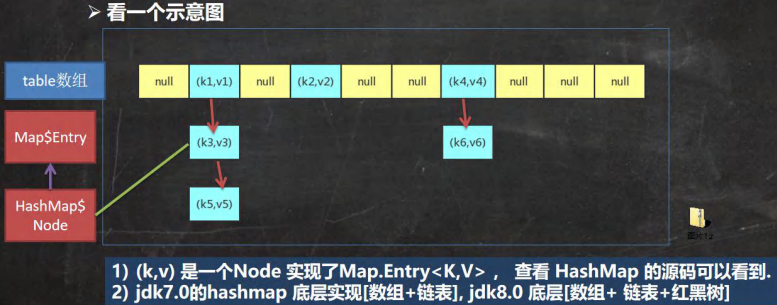


```apl
扩容机制【和HashSet相同]

1) HashMap底层维护了Node类型的数组table，默认为null

2) 当创建对象时，将加载因子(loadfactor)初始化为0.75.

3) 当添加key-val时，通过key的哈希值得到在table的索引。
   然后判断该索引处是否有元素,如果没有元素直接添加。
   如果该索引处有元素,继续判断该元素的key和准备加入的key相是否等，
   如果相等，则直接替换val;
   如果不相等需要判断是树结构还是链表结构，做出相应处理。
   如果添加时发现容量不够,则需要扩容。
   
4) 第1次添加，则需要扩容table容量为16，临界值(threshold)为12(16*0.75)

5) 以后再扩容，则需要扩容table容量为原来的2倍(32)，临界值为原来的2倍,即24,依次类推.

6) 在Java8中,如果一条链表的元素个数超过TREEIFY_THRESHOLD(默认是8)，
   并table的大小 >= MIN_TREEIFY_CAPACITY(默认64) , 就会进行树化(红黑树)
```

```java
package com.Novice.map;

import java.util.HashMap;
import java.util.Map;

@SuppressWarnings({"all"})
public class HashMapSource1 {
    public static void main(String[] args) {

        Map map = new HashMap<>();

        map.put("java", 20);// ok
        map.put("php", 10);// ok
        map.put("java", 20);// 替换

        System.out.println("map" + map);

    }

}
// 第一步：创建一个HashMap对象 // Map map = new HashMap();
    //步骤:
        //1.执行构造器   //new HashMap()
        //2.并在构造器中初始化加载因子   // this.loadFactor = DEFAULT_LOAD_FACTOR = 0.75
    //源码:
        /*  
               public HashMap() {
                     this.loadFactor = DEFAULT_LOAD_FACTOR; // all other fields defaulted
                 }
            */ 
    // 最终直接返回一个空的对象，只有loadFactor为0.75其余都为null


// 第二步执行Map.put();	//map.put("java",20);//ok

    //1.先对基本数据类型进行装箱
        //    public static Integer valueOf(int i) {
        //         if (i >= IntegerCache.low && i <= IntegerCache.high)
        //             return IntegerCache.cache[i + (-IntegerCache.low)];
        //         return new Integer(i);
        //     }

    //2.将key 与value 的值传入put()
        //    public V put(K key, V value) {
        //         return putVal(hash(key), key, value, false, true);
        //     }

    //3.hash(key),在该方法中通过hashcode()结合按位异或，计算哈希值
        //    static final int hash(Object key) {
        //         int h;
        //         return (key == null) ? 0 : (h = key.hashCode()) ^ (h >>> 16);
        //     }


    //4.核心putVal()方法
        // final V putVal(int hash, K key, V value, boolean onlyIfAbsent,
        //                    boolean evict) {
        //         Node<K,V>[] tab; Node<K,V> p; int n, i;      //辅助变量
        //         //如果底层的 table 数组为 null, 或者 length =0 , 就扩容到 16
        //         if ((tab = table) == null || (n = tab.length) == 0)
        //             n = (tab = resize()).length;

        //         //取出 hash 值对应的 table 的索引位置的 Node, 如果为 null, 就直接把加入的k-v
        //         //创建成一个 Node ,加入该位置即可
        //         if ((p = tab[i = (n - 1) & hash]) == null)
        //             tab[i] = newNode(hash, key, value, null);
        //         else {
        //             Node<K,V> e; K k;    //辅助变量
        //          // 如果 table 的索引位置的 key 的 hash 相同和新的 key 的 hash 值相同，
        //          // 并 满足(table 现有的结点的 key 和准备添加的 key 是同一个对象 || equals 返回真)
        //          // 就认为不能加入新的 k-v
        //             if (p.hash == hash &&
        //                 ((k = p.key) == key || (key != null && key.equals(k))))
        //                 e = p;
        //             else if (p instanceof TreeNode)
        //              //如果当前的 table 的已有的 Node 是红黑树，就按照红黑树的方式处理
        //                 e = ((TreeNode<K,V>)p).putTreeVal(this, tab, hash, key, value);
        //             else {
        //                  //如果找到的结点，后面是链表，就循环比较
        //                 for (int binCount = 0; ; ++binCount) {   //死循环,但是有循环条件
        //                     if ((e = p.next) == null) {  //如果整个链表，没有和他相同,就加到该链表的最后
        //                         p.next = newNode(hash, key, value, null);
        //                          //加入后，判断当前链表的个数，是否已经到 8 个，到8 个，后
        //                          //就调用 treeifyBin 方法进行红黑树的转换
        //                         if (binCount >= TREEIFY_THRESHOLD - 1) // -1 for 1st
        //                             treeifyBin(tab, hash);
        //                         break;
        //                     }
        //                     if (e.hash == hash &&//如果在循环比较过程中，发现有相同,就break,就只是替换value
        //                         ((k = e.key) == key || (key != null && key.equals(k))))
        //                         break;
        //                     p = e;
        //                 }
        //             }

        //             if (e != null) { // existing mapping for key
        //                 V oldValue = e.value;
        //                 if (!onlyIfAbsent || oldValue == null)
        //                     e.value = value; //替换，key 对应 value
        //                 afterNodeAccess(e);
        //                 return oldValue;
        //             }
        //         }
        //         ++modCount;  //每增加一个 Node ,就 size++
        //         if (++size > threshold)  //如 size > 临界值，就扩容
        //             resize();
        //         afterNodeInsertion(evict);
        //         return null;
        //     }


    // 5.关于树化(转成红黑树)
        // // 如果 table 为 null ,或者大小还没有到 64，暂时不树化，而是进行扩容. 
        // // 否则才会真正的树化 -> 剪枝
        // final void treeifyBin(Node<K, V>[]tab,int hash){
        //         int n,index;Node<K, V> e;
        //         if(tab==null||(n=tab.length)<MIN_TREEIFY_CAPACITY)
        //         resize();
        //         }
```


```apl
模拟HashMap触发扩容、树化情况,并Debug验证.
```

```java
package com.Novice.map;

import java.util.HashMap;
import java.util.Map;
import java.util.Objects;

public class HashMapSource2 {
    public static void main(String[] args) {


        Map map = new HashMap<>();
        for (int i = 0; i <= 12; i++) {
            map.put(new A(i), "hello");
        }


        System.out.println("hashmap" + map);

    }
}

class A {
    private int num;

    public A(int num) {
        this.num = num;
    }

    // @Override    //此处比较的是内容是否相同
    // public boolean equals(Object o) {
    //     if (this == o) return true;
    //     if (o == null || getClass() != o.getClass()) return false;
    //     A a = (A) o;
    //     return num == a.num;
    // }

    @Override   // 此处比较的是，hashcode的值是否相等
    public int hashCode() {
        return 100;
        // 令所有的A对象的返回值的hashcode都为100，那么在向hashMap中添加元素的时候，就都会添加到同一个链表中去
    }

    //按照上面的方式重写equals与hashCode，那么在添加比较时，
    //所有的hashCode都相等，但是添加的对象的值的比较都不同
    
    
    
    @Override
    public String toString() {
        return "\nA{" +
                "num=" + num +
                '}';
    }
}

```


## Map 接口实现类-Hashtable

### HashTable 的基本介绍

```apl
1) 存放的元素是键值对:即K-V

2) hashtable的键和值都不能为null，否则会抛出NullPointerException

3) hashTable使用方法基本上和HashMap一样

4) hashTable是线程安全的(synchronized)， hashMap是线程不安全的
```

```java
package com.Novice.map;

import java.util.Hashtable;

@SuppressWarnings({"all"})
public class HashTableExercise {

    public static void main(String[] args) {


        // 1)存放的元素是键值对:即K-V
        // 2) hashtable的键和值都不能为null，否则会抛出NullPointerException
    		/*
                public synchronized v put(K key,V value) {
                    // Make sure the value is not null
                    if (value == null) {
                        throw new NullPointerException();
                    }
              */

        // 3) hashTable使用方法基本上和HashMap一样
        // 4) hashTable是线程安全的(synchronized), hashMap是线程不安全的

        Hashtable table = new Hashtable<>();

        table.put("jhon",100);//ok
        // table.put(null,100);//异常
        // table.put("jhon",null);//异常

        table.put("lucy",100);//ok
        table.put("lic",100);//ok
        table.put("lic",200);//替换

        table.put("hello4",1);
        table.put("hello5",1);
        table.put("hello6",1);
        table.put("hello7",1);
        table.put("hello8",1);
        table.put("hello9",1);


        System.out.println("hashtable="+table);


    }
}


//小结
    //1. 底层有数组 Hashtable$Entry[] 初始化大小为11
		//(底层是一个存储Entry类型的table数组)
		//addEntry (hash, key, value, index)return null;
		//执行方法 addEntry(hash,，key,value,index);添加K-V封装到Entry

    //2. 临界值threshold 8 =11 *0.75

    //3. 扩容:按照自己的扩容机制来进行.
        //1．执行方法 addEntry(hash key,value，index);添加K-V封装到Entry

        //2.当if (count >= threshold）满足时，就进行扩容
            //按照int newCapacity = (oldCapacity <<1) +1;的大小扩容。


```


##  HashMap和 Hashtable 对比

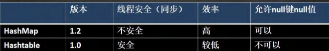


## Map 接口实现类-Properties

### 基本介绍

```apl
1. Properties类继承自Hashtable类并且实现了Map接口，也是使用一种键值对的形式来保存数据.

2. 他的使用特点和Hashtable类似

3. Properties还可以用于从 xxx.properties文件中，加载数据到Properties类对象,并进行读取和修改

4、说明:工作后 xxx.properties文件通常作为配置文件，这个知识点在IO流举例,有兴趣可先看文章
```

### 基本使用

```java
package com.Novice.map;

import java.util.Properties;

public class properties_ {
    public static void main(String[] args) {

        // 1. Properties 继承 Hashtable
        // 2. 可以通过 k-v 存放数据，当然 key 和 value 不能为 null

        // 增加
        Properties properties = new Properties();
        // properties.put(null,100); //抛出 空指针异常
        // properties.put("join",null);//抛出 空指针异常
        properties.put("join", 100);
        properties.put("lily", 100);
        properties.put("lic", 100);
        properties.put("lic", 200);// 替换

        System.out.println("\nproperties=" + properties);

        // 通过 k 获取对应值
        System.out.println("\n" + properties.get("lily"));
        System.out.println("\n" + properties.getProperty("100"));
        // 如果有这个value，就会输出这个value

        // 删除
        properties.remove("join");
        System.out.println("\nproperties=" + properties);

        // 修改
        properties.setProperty("lic", "niaho");
        System.out.println("\nproperties=" + properties);


    }
}
```

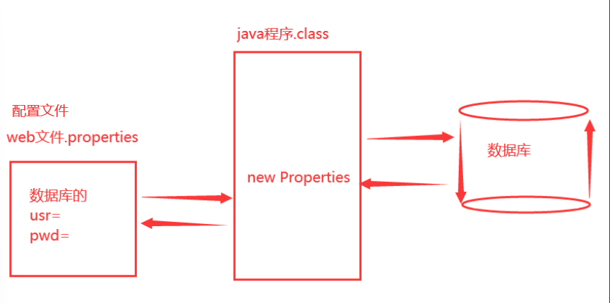


## TreeSet源码解读

```java
package com.Novice.set;

import java.util.Comparator;
import java.util.TreeSet;

public class TreeSet_ {
    public static void main(String[] args) {


        //1.当我们使用无参构造器，创建TreeSet时，仍然是无序的
        //2.老师希望添加的元素，按照字符串大小来排序
        //3 使用TreeSet提供的一个构造器，可以传入一个比较器(匿名内部类)
        //  并指定排序规则

        // TreeSet<Object> treeset = new TreeSet<>();
        TreeSet<Object> treeset = new TreeSet<>(new Comparator<Object>() {

            @Override
            public int compare(Object o1, Object o2) {
                return ((String)o2).compareTo(((String) o1));
            }
        });

        treeset.add("cde");
        treeset.add("abc");
        treeset.add("def");
        treeset.add("bcd");
        System.out.println("treeset"+treeset);


    }
}


// 简单看看源码

/*  
	构建TreeSet对象时 -> TreeSet底层调用了TreeMap的代码马，将比较器对象传给TreeMap
    调用了TreeMap，所以传入值的时候和HashMap一样传入
        public boolean add(E e) {
            return m.put(e,PRESENT)==null;
        }
*/

/*
1. 构造器把传入的比较器对象，赋给了 TreeSet 的底层的 TreeMap 的属性 this.comparator
        public TreeMap(Comparator<? super K> comparator) {
            this.comparator = comparator;
        }

2. 在 调用 treeSet.add("tom"), 在底层会执行到
        if (cpr != null) {  //cpr 就是我们的匿名内部类(对象)
            do {
                parent = t;  //动态绑定到我们的匿名内部类(对象)compare

                cmp = cpr.compare(key, t.key);  //通过我们重写的对象里的compare()方法的返回值，进行后面的判断
                if (cmp < 0)
                    t = t.left;  //这里使用的是树结构，这里面经过了很多的判断
                else if (cmp > 0)
                    t = t.right;
                else //如果相等，即cmp返回 0,这个 Key 就没有加入
                    return t.setValue(value);   //依然是原来的值
            } while (t != null);
        }


*/
```

## TreeMap源码解读

```java
package com.Novice.map;

import java.util.Comparator;
import java.util.TreeMap;

public class treeMap_ {
    public static void main(String[] args) {

        // TreeMap<Object, Object> treemap = new TreeMap<>();

        TreeMap treemap = new TreeMap<>(new Comparator() {
            @Override
            public int compare(Object o1, Object o2) {
                // return ((String)o1).compareTo((String) o2);
                return ((String)o1).length()-((String) o2).length();//按照长度大小比较排序，如果长度相同，那么就认为两个字符串相同
            }
        });

        treemap.put("jack","杰克");
        treemap.put("tom","汤姆");
        treemap.put("kristina","克瑞斯提诺");
        treemap.put("smith","史密斯");

        System.out.println("treemap="+treemap);


    }
}


/*
1. 构造器. 把传入的实现了 Comparator 接口的匿名内部类(对象)，传给给 TreeMap 的comparator字段
        public TreeMap(Comparator<? super K> comparator) {
                this.comparator = comparator;
        }

2. 调用 put 方法

    2.1 第一次添加, 把 k-v 封装到 Entry 对象，放入 root  -> Entry是TreeMap的内部类
        Entry<K,V> t = root;    //第一次进入时，没有初始化，t为null，所以走这一步
        if (t == null) {
            compare(key, key); // type (and possibly null) check
            //第一次添加就是自己和自己比较，因为结果必定为0，所以并没有值用来接收
            //此处比较的目的是检测是否为null，如果为null，就抛出异常
        
            root = new Entry<>(key, value, null);
            size = 1;
            modCount++;
            return null;
        }

    2.2 以后添加
        Comparator<? super K> cpr = comparator;

        if (cpr != null) {
            do { //在树结构中，遍历所有的 key , 给当前 key 找到适当位置
                parent = t;
                cmp = cpr.compare(key, t.key);//动态绑定到我们的匿名内部类的 compare

                if (cmp < 0)
                    t = t.left;
                else if (cmp > 0)
                    t = t.right;
                else //如果遍历过程中，发现准备添加 Key 和当前已有的 Key 相等，就不添加，直接从当前返回
                    return t.setValue(value);
            } while (t != null);
        }
        */
```


## ————————————

# Collections 工具类介绍


```apl
1) Collections是一个操作Set、List和 Map 等集合的工具类

2) Collections中提供了一系列静态的方法对集合元素进行 排序、查询 和 修改等操作
```


## 静态方法(1)

```apl
1.reverse(List):	反转 List中元素的顺序

2.shuffle(List):	对List集合元素进行随机排序

3.sort(List):	根据元素的自然顺序对指定List集合元素按升序排序

4.sort(List,Comparator):	根据指定的Comparator产生的顺序对List集合元素进行排序

5.swap(List,int,int):	将指定 list集合中的i处元素和j处元素进行交换
```

```java
package com.Novice.collections_;

import java.util.ArrayList;
import java.util.Collections;
import java.util.Comparator;


public class Collections_01 {
    public static void main(String[] args) {


        ArrayList list = new ArrayList<>();
        list.add("tom");
        list.add("jack");
        list.add("smith");
        list.add("king");
        list.add("milan");

        

        // 1) reverse(List):反转List中元素的顺序
        Collections.reverse(list);
        System.out.println("list="+list);

        
        
        // 2) shuffle(List):对List集合元素进行随机排序
        for (int i = 0; i < 5; i++) {
            Collections.shuffle(list);
            System.out.println("list="+list);
        }

        
        
        // 3) sort(List):根据元素的自然顺序对指定List集合元素按升序排序
        Collections.sort(list);
        System.out.println("list="+list);

        
        
        // 4) sort(List, Comparator): 根据指定的Comparator产生的顺序对List集合元素进行排序
        System.out.println();
        Collections.sort(list, new Comparator() {
            @Override
            public int compare(Object o1, Object o2) {
                return ((String)o2).length()-((String)o1).length();
            }
        });
        System.out.println("字符串长度排序="+list);

        

        // 5) swap(List, int, int): 将指定list集合中的i处元素和j处元素进行交换
        Collections.swap(list,0,1);
        System.out.println("list="+list);

    }
}
```


## 静态方法(2)


```apl
1) Object max(Collection):	根据元素的自然顺序，返回给定集合中的最大元素
2) object max(Collection, Comparator): 根据Comparator指定的顺序返回给定集合中的最大元素

3) Object min(Collection)
4) Object min(Collection,Comparator)

5) int frequency(Collection, Object):	返回指定集合中指定元素的出现次数

6) void copy(List dest,List src):	将src中的内容复制到dest中

7) boolean replaceAll(List list, Object oldVal, Object newVal):	  使用新值替换List 对象的所有旧值
```


```java
package com.Novice.collections_;

import java.util.ArrayList;
import java.util.Collections;
import java.util.Comparator;


public class Collections_02 {
    public static void main(String[] args) {

        ArrayList list = new ArrayList<>();
        list.add("tom");
        list.add("tom");
        list.add("jack");
        list.add("smith");
        list.add("king");
        list.add("milan");
        // 1) Object max(Collection):根据元素的自然顺序，返回给定集合中的最大元素
        System.out.println("自然排序的最大元素="+Collections.max(list));


        // 2) Object max(Collection, Comparator): 根据Comparator指定的顺序，返回给定集合中的最大元素
        Object max = Collections.max(list, new Comparator() {
            @Override
            public int compare(Object o1, Object o2) {

                return ((String)o1).length()-((String)o2).length();
            }
        });
        System.out.println("长度最大的元素="+max);


        // 3) Object min(Collection)
        // 4) Object min(Collection, Comparator)


        // 5) int frequency(Collection, Object): 返回指定集合中指定元素的出现次数
        System.out.print("tom出现的次数=");
        System.out.println(Collections.frequency(list,"tom"));


        // 6) void copy(List dest,List src):将src中的内容复制到dest中
        ArrayList list1 = new ArrayList<>();
        for (int i = 0; i < list.size(); i++) {
            list1.add("");
        }
        Collections.copy(list1,list);
        System.out.println("list="+list);
        System.out.println("list1="+list1);


        // 7) boolean replaceAll(List list, Object oldVal, Object newVal): 使用新值替换List对象的所有旧值
        Collections.replaceAll(list,"tom","nihao");
        System.out.println("替换后的list="+list);

    }
}

```


## ————————————

# HomeWork


只要是collection的子类就可以加进去


## HomeWork01

```java
package com.Novice.Homework;

import java.util.ArrayList;

// 按要求实现:
//         (1) 封装一个新闻类，包含标题和内容属性，提供get、set方法，重写toString方法，打印对象时只打印标题;
//         (2) 只提供一个带参数的构造器，实例化对象时，只初始化标题;并且实例化两个对象:
//             新闻一:新冠确诊病例超千万，数百万印度教信徒赴恒河“圣浴”引民众担忧
//             新闻二:男子突然想起2个月前钓的鱼还在网兜里，捞起一看赶紧放生
//         (3) 将新闻对象添加到ArrayList集合中，并且进行倒序遍历;
//         (4) 在遍历集合过程中，对新闻标题进行处理，超过15字的只保留前15个，然后在后边加". . ."
//         (5) 在控制台打印遍历出经过处理的新闻标题;


public class homework01 {
    public static void main(String[] args) {
        journalism journalism = new journalism("新冠确诊病例超千万，数百万印度教信徒赴恒河\"圣浴\"引民众担忧");

        journalism journalism1 = new journalism("男子突然想起2个月前钓的鱼还在网兜里，捞起一看赶紧放生");


        ArrayList<journalism> list = new ArrayList<>();
        list.add(journalism);
        list.add(journalism1);


        for (int i = list.size()-1; i >= 0; i--) {
            System.out.println(processTitle(list.get(i).getHeadline()));//静态方法可以直接被调用
        }

        // for (int i = list.size()-1; i >= 0; i--) {
        //     StringBuffer a = processTitle(list.get(i).getHeadline());
        //     System.out.println(a);
        // }


    }
    // public static StringBuffer processTitle(String str){
    //     if (str == null){
    //         return null;
    //     }
    //     StringBuffer a = new StringBuffer(str);
    //     if (a.length()>15){
    //         a.delete(15,a.length());
    //         a.append("...");
    //         return a;
    //     }else {
    //
    //         return a;
    //     }
    //
    // }


    public static String processTitle(String str){
            if (str == null){
                return null;
            }

            if (str.length()>15){
                return str.substring(0,15)+("...");
            }else {

                return null;
            }
    }

}

class   journalism{

    private String headline;
    private String content;


    public journalism(String headline) {
        this.headline = headline;
    }

    public String getHeadline() {
        return headline;
    }

    public void setHeadline(String headline) {
        this.headline = headline;
    }

    public String getContent() {
        return content;
    }

    public void setContent(String content) {
        this.content = content;
    }

    @Override
    public String toString() {
        return "journalism{" +
                "headline='" + headline + '\'' +
                '}';
    }
}
```

## HomeWork02

```java
package com.Novice.Homework;

import java.util.ArrayList;
import java.util.Iterator;

public class homework02 {
    public static void main(String[] args) {

        // 使用ArrayList完成对对象Car {name, price}的各种操作

        ArrayList<Car> list = new ArrayList<>();

        Car car = new Car("宝马", 400000);
        Car car2 = new Car("宾利", 5000000);

        // 1.add:添加单个元素
        list.add(car);

        // 2.remove:删除指定元素
        System.out.println("2=" + list.remove(car));

        // 3.contains:查找元素是否存在
        System.out.println("3=" + list.contains(list));

        // 4.size:获取元素个数
        System.out.println("4=" + list.size());

        // 5.isEmpty:判断是否为空
        System.out.println("5=" + list.isEmpty());

        // 6.clear:清空
        list.clear();
        System.out.println("6=" + list.isEmpty());

        // 7.addAll:添加多个元素
        ArrayList<Car> list1 = new ArrayList<>();
        list1.add(car);
        list1.add(car2);
        list.addAll(0, list1);// 将指定集合中的所有元素插入此列表，从指定位置开始
        System.out.println("7=" + list);

        // 8.containsAll:查找多个元素是否都存在
        System.out.println("8=" + list.containsAll(list1));   // 如果此集合包含指定集合中的所有元素

        // 9.removeAll:删除多个元素
        System.out.println("8=" + list1.removeAll(list));

        // 使用增强for和迭代器来遍历所有的car，需要重写Car的toString方法
        for (Car o : list) {
            System.out.println(o);
        }


        System.out.println();
        Iterator<Car> iterator = list.iterator();
        while (iterator.hasNext()) {
            Object next = iterator.next();
            System.out.println(next);

        }


    }
}


class Car {
    private String name;
    private int price;

    public Car(String name, int price) {
        this.name = name;
        this.price = price;
    }

    @Override
    public String toString() {
        return "car{" +
                "name='" + name + '\'' +
                ", price='" + price + '\'' +
                '}';
    }
}
```


## HomeWork03

```java
package com.Novice.Homework;

import java.util.*;

public class homework03 {
    public static void main(String[] args) {

        HashMap<String, Integer> map = new HashMap<>();
        map.put("jack", 650);
        map.put("tom", 1200);
        map.put("smith", 2900);

        System.out.println("jack的工资变成1200");
        map.put("jack", 2600);
        System.out.println("tom的工资=" + map.get("tom"));

        Set set = map.keySet();
        System.out.println("\n所有人的工资都加100");
        for (Object set1 : set) {
            map.put(set1.toString(), map.get(set1) + 100);
        }

        System.out.println("\n遍历所有员工");
        for (Object set1 : set) {
            System.out.println(set1);
        }

        System.out.println("\n遍历所有工资");
        Collection<Integer> values = map.values();
        Iterator<Integer> iterator = values.iterator();
        while (iterator.hasNext()) {
            Object next = iterator.next();
            System.out.println(next);

        }


        System.out.println("\n使用entrySet遍历");
        Set<Map.Entry<String, Integer>> entries = map.entrySet();
        Iterator<Map.Entry<String, Integer>> iterator1 = entries.iterator();
        while (iterator1.hasNext()) {
            Map.Entry iterator11 = (Map.Entry) iterator1.next();
            // 为啥一定要是 iterator.next()?,难道说是应为iterator1表示的是一个集合的内容
            System.out.println(iterator11.getKey() + "-" + iterator11.getValue());

        }


    }
}

class employee {

    private String name;
    private int salary;

    public employee(String name, int salary) {
        this.name = name;
        this.salary = salary;
    }

    @Override
    public String toString() {
        return "employee{" +
                "name='" + name + '\'' +
                ", salary=" + salary +
                '}';
    }
}
```


## HomeWork04

```java
package com.Novice.Homework;

public class homework04 {
    public static void main(String[] args) {

//
// 试分析HashSet和TreeSet分别如何实现去重的
//     (1) HashSet的去重机制:
//         hashCode() + equals() ->
//         底层先通过存入对象(key),进行运算得到一个hash值，通过hash值得到对应的索引，
//         如果发现table索引所在的位置,没有数据，就直接存放,
//         如果有数据，就进行equals比较[遍历比较]，如果比较后，不相同,就加入，否则就不加入.
//
//     (2)TreeSet的去重机制:
//         如果你传入了一个Comparator匿名对象，就使用实现的compare去重，
//         如果方法返回0,就认为是相同的元素/数据，就不添加.

//         如果你没有传入一个Comparator匿名对象,则以你添加的对象实现的Compareable接口的compareTo去重.
//         如果传入的对象没有重写Comparable，那么依然会调用Comparator，但是会出现类型转换错误ClassCastException
//
    }
}
```


## HomeWork05

```java
package com.Novice.Homework;

import java.util.TreeSet;

public class homework05 {
    public static void main(String[] args) {


        // 分析源码
        // add 方法，因为 TreeSet()构造器没有传入Comparator接口的匿名内部类
        // 所以在底层Comparable<? super K> k = (Comparable<? super K>) key;
        // 即把 Perosn转成 Comparable类型


        TreeSet<person> treeSet = new TreeSet<>();
        treeSet.add(new person());

        System.out.println(treeSet);


    }
}

// 错误实例
// class person{
//
// }

// 解决方法实现 Comparable
class person implements Comparable {
    @Override
    public int compareTo(Object o) {
        return 0;
        // 返回的是0，如果不做任何处理，那么treeset就只能添加一个person对象
        // 除非是自己重新定义规则
    }
}
```


## HomeWork06

```java
package com.Novice.Homework;


import java.util.HashSet;
import java.util.Objects;

public class homework06 {
    public static void main(String[] args) {

        // 已知:people类按照id和name重写了hashCode和equals方法,问下面代码输出什么?

        HashSet set = new HashSet();

        people p1 = new people(1001, "AA");
        people p2 = new people(1002, "BB");

        set.add(p1);
        set.add(p2);

        p1.name = "CC";// 因为people重写了id和name的hashcode与equals，所以此时里面存储的p1已经不是原来的p1
        System.out.println(set);

        System.out.println(set.remove(p1));// False  //原来的p1已经被修改过了
        System.out.println(set);

        set.add(new people(1001, "CC"));// True
        // 因为此时的(1001,"CC")存入在(1001,"AA")的位置，本来应该存放(1001,"CC")的位置，此时是空的
        System.out.println(set);

        set.add(new people(1001, "AA"));
        // 因为此时在(1001,"AA")存放的值是(1001,”CC“)<之前被修改过>，所以此时放入的(1001,"AA")是挂在(1001，"CC")后面
        System.out.println(set);


    }
}

class people {
    private int id;
    String name;


    public people(int id, String name) {
        this.id = id;
        this.name = name;
    }


    @Override
    public boolean equals(Object o) {
        if (this == o) return true;
        if (o == null || getClass() != o.getClass()) return false;
        people people = (people) o;
        return id == people.id && Objects.equals(name, people.name);
    }

    @Override
    public int hashCode() {
        return Objects.hash(name, id);
    }

    @Override
    public String toString() {
        return "people{" +
                "id=" + id +
                ", name='" + name + '\'' +
                '}';
    }
}
```


## ——————————

# 开发中如何选择集合实现类

```java
在开发中，选择什么集合实现类，主要取决于业务操作特点，然后根据集合实现类特性进行选择。
先判断存储的类型(一组对象[单列] / 一组K-V[双列])
    
   // 1.一组对象 [单列]: Collection 接口
    
   //         允许重复:List
   //             增删多:LinkedList [底层维护了一个双向链表]
   //             改查多:ArrayList  [底层维护Object类型的可变数组]
   //         不允许重复:Set
   //             无序:HashSet [底层是HashMap，维护了一个哈希表即(数组+链表+红黑树)]
   //             排序:TreeSet [老韩举例说明]
   //             插入和取出顺序一致:LinkedHashSet [维护数组+双向链表]
    
    
    
   // 2.一组K-V [双列]: Map 接口
    
   //             键无序:HashMap [底层是:哈希表 jdk7:数组+链表，jdk8:数组+链表+红黑树]
   //             键排序:TreeMap [老韩举例说明]
   //             键插入和取出顺序一致:LinkedHashMap
   //             读取文件 Properties
```


## 1.一组对象[单列]: Collection接口

### 允许重复:List

#### 使用增删多:

```apl
'LinkedList [底层维护了一个双向链表]
```


#### 使用改查多:

```apl
'ArrayList  [底层维护Object类型的可变数组]
```


### 不允许重复:Set

####  要求无序:

```apl
'HashSet [底层是HashMap，维护了一个哈希表即(数组+链表+红黑树)]
```


#### 要求 排序:

```apl
'TreeSet [老韩举例说明]
```


####  插入和取出顺序一致:

```apl
'LinkedHashSet [维护数组+双向链表]
```


## 2.一组K-V[双列]: Map

### 键无序:

```apl
'HashMap [底层是:哈希表 jdk7:数组+链表，jdk8:数组+链表+红黑树]
```


### 键排序:

```apl
'TreeMap [老韩举例说明]
```


### 键插入和取出顺序一致:

```apl
'LinkedHashMap
```


### 读取文件 

```apl
'Properties
```


## ————————————

# 补充

## 序列化

```apl
Java序列化是指把Java对象转换为字节序列的过程。
Java反序列化是指把字节序列恢复为Java对象的过程。 

序列化：
对象序列化的最主要的用处就是在传递和保存对象的时候，保证对象的完整性和可传递性。
序列化是把对象转换成有序字节流，以便在网络上传输或者保存在本地文件中。 
核心作用是对象状态的保存与重建
```


