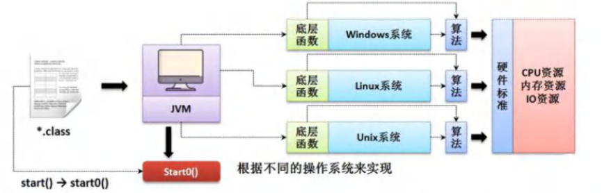
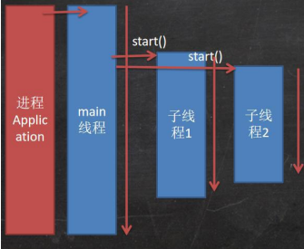
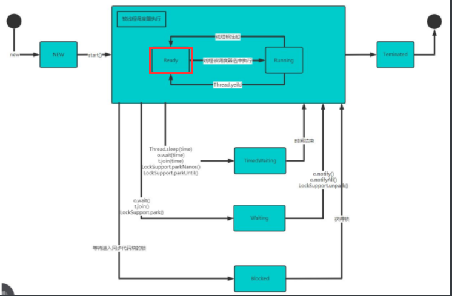
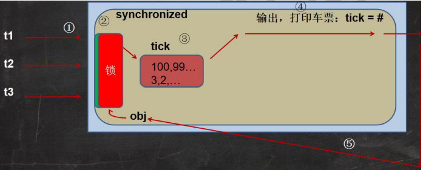

# 多线程(基础)


## 线程相关概念


### 程序(program)

```apl
是为完成特定任务、用某种语言编写的一组指令的集合。简单的说:就是我们写的代码
```


### 进程

```apl
1.进程是指运行中的程序，

比如我们使用QQ，就启动了一个进程，操作系统就会为， 该进程分配内存空间。

当我们使用迅雷，又启动了一个进程，操作系统将为迅雷分配新的内存空间。

2.进程是程序的一次执行过程，或是正在运行的一个程序。

是动态过程：有它自身的产生、存在和消亡的过程
```


### 线程

```apl
1.线程由进程创建的，是进程的一个实体

2.一个进程可以拥有多个线程,如下图
```


### 其它概念：

#### 1.单线程:

同一个时刻，只允许执行一个线程

#### 2.多线程:

同一个时刻，可以执行多个线程，

比如:

一个qq进程，可以同时打开多个聊天窗口,一个迅雷进程,可以同时下载多个文件

#### 3.并发:

同一个时刻，多个任务交替执行，造成一种“貌似同时”的错觉，简单的说,
单核cpu实现的多任务就是并发。

#### 4.并行:

同一个时刻，多个任务同时执行。多核cpu可以实现并行。并发和并行。


## 线程基本使用

### 创建线程的两种方式


1.继承Thread类,重写run方法

2.实现Runnable接口，重写run方法


### 继承Thread类实例

1-继承Thread类


```apl
Thread01.java com.hspedu.threaduse

1)请编写程序,开启一个线程，该线程每隔1秒。在控制台输出“哺瞄,我是小猫咪”

2)对上题改进:当输出80次瞄瞄,我是小猫咪，结束该线程

3)使用JConsole监控线程执行情况，并画出程序示意图!

```

```java
package com.Novice.threadUse;


//演示通过继承 Thread 类 创建线程

public class Thread01 {
    public static void main(String[] args) throws InterruptedException {

        //创建一个Cat对象，可以当作线程使用
        Cat cat = new Cat();
        //启动线程，由类的定义，会每隔一秒钟打印一句话


        //satr 源码
        /*
            (1)
            public synchronized void start() {
                start0();
            }

            (2)
                //satr0(); 是native方法，是JVM调用，底层是C/C++实现的
                //真正实现多线程效果，是start0(),而不是run
                private native void start0();

                start(方法调用startO()方法后，该线程并不一定会立马热行，只是将线程变成了可运行状态。
                具体什么时候执行，取决于CPu，由CPU统一调度。

             */


        cat.start();
        //启动线程—>最终会执行cat的run方法 ,调用start()的时候会调用run()
        //那么为什么不能用cat直接调用run方法呢，如果使用的直接调用，那么线程就变成了主线程
        


        cat.run();
        //run方法就是一个普通的方法，此时必须要将run方法执行完毕后，才会执行后面的方法，
        //此时只有一个线程在执行，就不是真正的多线程了
        
        //此时并没有启动一个新的线程，此处相当于一个串行化的的执行，必须是将run方法执行完毕才会继续执行，方法就会阻塞在这里.

        //当main线程启动了一个子线程 Thread -0，主线程不会阻塞，会继续执行，这时主线程和子线程是交替执行的

        System.out.println("主线程继续执行" + Thread.currentThread().getName());//主线程的名称 main
        for (int i = 0; i < 10; i++) {
            System.out.println("主线程 i= " + i);
            //让主线程休眠 1 秒
            Thread.sleep(1000);

        }


    }
}

//1.当一个类继承了 Thread类，该类就可以当作线程使用
//2.重写run方法，写上自己的业务代码
//3.Thread类 实现 Runnable 接口的run
/*
Override
public void run(){
        if(target!=null){
        target.run();
        }
        }
*/
class Cat extends Thread {


    @Override
    //重写run方法，写上自己的业务逻辑
    public void run() {


        int times = 0;
        while (true) {
            
            //该线程每隔1秒。在控制台输出“瞄瞄,我是小猫咪”
            System.out.println("瞄瞄,我是小猫咪" +(++times)+"线程名称"+Thread.currentThread().getName());
            //那么为什么不能用cat直接调用run方法呢，如果使用的直接调用，那么线程就变成了主线程

            //让该线程休眠1秒
            try {
                Thread.sleep(1000);//1000毫秒 == 1秒
            } catch (InterruptedException e) {
                e.printStackTrace();
            }
            if(times == 80){
                break;//当times 等于80 就退出
            }
        }


    }


}


```



start()方法调用start0()方法后，该线程并不一定会立马执行，只是将线程变成了可运行状态。

具体什么时候执行，取决于CPU，由CPU统一调度。


### 继承Runnable实例


//适合创建多线程实例

```apl
说明
1. java是单继承的，在某些情况下一个类可能已经继承了某个父类,这时在用继承Thread类方法来创建线程显然不可能了。

2. java设计者们提供了另外一个方式创建线程，就是通过实现Runnable接口来创建线程

```

```apl
应用案例
请编写程序,该程序可以每隔1秒。在控制台输出“hi!”,当输出10次后，自动退出。

请使用实现Runnable接口的方式实现。Thread02.java。

这里底层使用了设计模式[代理模式]=>代码模拟实现Runnable接口开发线程的机制

```


```java
package com.Novice.threadUse;

//通过实现 Runnable接口 来开发线程
//使用了静态代理模式
public class Thread02 {

    public static void main(String[] args) {

        Dog dog = new Dog();
        //dog.start();这里不能调用start

        //但是Thread是有start()方法的
        //创建了Thread对象，把 dog对象(实现Runnable),放入Thread
        Thread thread = new Thread(dog);//这里使用了静态代理模式
        thread.start();

    }
}


class Dog implements Runnable {  //通过实现Runable接口，开发线程类

    int count = 0;

    @Override
    public void run() {
        while (true) {
            System.out.println("小狗汪汪叫。。hi" + (++count) + Thread.currentThread().getName());


            //休眠1秒

            try {
                Thread.sleep(1000);
            } catch (InterruptedException e) {
                e.printStackTrace();
            }

            if (count == 10) {
                break;
            }

        }
    }
}
```


### 多线程执行实例

```apl
请编写一个程序,创建两个线程:

一个线程每隔1秒输出“hello,world”,输出10次,退出.
一个线程每隔1秒输出“hi”，输出5次退出.
Thread03.java

```

```java
package com.Novice.threadUse;


//在 main线程实现两个子线程
public class Thread03 {
    
    public static void main(String[] args) {

        T1 t1 = new T1();
        T2 t2 = new T2();
        
        Thread thread = new Thread(t1);
        Thread thread1 = new Thread(t2);
        
        thread.start();//启动第一个线程
        thread1.start();//启动第二个线程

    }
}


class T1 implements Runnable {

    int count = 0;

    @Override
    public void run() {

        while (true) {
            //每隔 1秒 输出一次 "hello world"，输出10次 就退出
            System.out.println("hello worlld" + (++count));

            try {
                Thread.sleep(1000);
            } catch (InterruptedException e) {
                e.printStackTrace();
            }
            if (count == 10) {
                break;
            }
        }

    }
}

class T2 implements Runnable {


    int count = 0;

    @Override
    public void run() {

        while (true) {
            //每隔 1秒 输出一次 "hello world"，输出5次 就退出
            System.out.println("hi" + (++count));

            try {
                Thread.sleep(1000);
            } catch (InterruptedException e) {
                e.printStackTrace();
            }
            if (count == 5) {
                break;
            }
        }
    }
}
```


## 线程的理解

### 图解



### 继承 Thread 与 Runnable 的区别

```apl
1.从java的设计来看，通过继承Thread或者实现Runnable接口来创建线程本质上没有区别.
从jdk帮助文档我们可以看到Thread类本身就实现了Runnable接口

2实现Runnable接口方式更加适合多个线程共享一个资源的情况，
并且避免了单继承的限制,建议使用Runnable

```


### 售票实例

**有同步问题**

```java
package com.Novice.ticket;


//使用多线程，模拟三个窗口同时售票100张
public class SellTicket {

    public static void main(String[] args) {

//        SellTicketA sellTicketA = new SellTicketA();
//        SellTicketA sellTicketA1 = new SellTicketA();
//        SellTicketA sellTicketA2 = new SellTicketA();
//
        //这里我们会出现超卖..
//        sellTicketA.start();//启动售票线程
//        sellTicketA1.start();//启动售票线程
//        sellTicketA2.start();//启动售票线程


        SellTicketB sellTicketB = new SellTicketB();
        new Thread(sellTicketB).start();
        //第 1 个线程-窗口
        new Thread(sellTicketB).start();
        //第 2 个线程-窗口
        new Thread(sellTicketB).start();
        //第 3 个线程-窗口

        //三个线程，都是在同一个对象的基础上开始运行的,但是同样会出现超卖现象

    }
}


//方式一:
//继承Thread接口
class SellTicketA extends Thread {

    private static int tickets = 100;//让多个线程共享 tickes

    @Override
    public void run() {
        
        while (true) {

            if (tickets <= 0) {
                System.out.println("车票已售罄");
                break;
            }
            

            try {
                Thread.sleep(50);//休眠50毫秒
            } catch (InterruptedException e) {
                e.printStackTrace();
            }


            System.out.println("窗口" + Thread.currentThread().getName() + "售出一张票,还剩" + (--tickets) + "张票");

        }


    }
}


//方式二:
//实现Runnable接口
class SellTicketB implements Runnable {


    public int tickets = 100;//让多个线程共享 tickets

    @Override
    public void run() {
        while (true) {

            if (tickets <= 0) {
                System.out.println("车票已售罄");
                break;
            }

            try {
                Thread.sleep(50);//当前线程休眠50毫米爱哦
            } catch (InterruptedException e) {
                e.printStackTrace();
            }


            System.out.println("窗口" + Thread.currentThread().getName() + "售出一张票,还剩" + (--tickets) + "张票");

        }


    }

}

//但是上面的代码会出现，多个线程同时进入循环，但是票数已经<3,此时会出现多售卖的问题
//需要用Synchronized来解决线程的同步和互斥
//还有break作用于循环中
```

## 线程终止


### 基本说明

```apl
1.当线程完成任务后，会自动退出。

2．还可以通过使用变量来控制run方法退出的方式停止线程，即通知方式

```


### 实例

```apl
需求:启动一个线程t，要求在main线程中去停止线程t,请编程实现.
//设置一个控制变量
```

```java
package com.Novice.exit_;

//设置一个控制变量的方式
public class ThreadExit_ {
    public static void main(String[] args) throws InterruptedException {


        T t = new T();
        t.start();


        //如果希望main线程去控制t1 线程的终止，必须可以修改loop
        // 让t1 退出run方法，从而终止t1线程->通知方式

        //让主线程休眠10秒，再通知t1线程退出
        System.out.println("主线程睡眠10s");
        Thread.sleep(10 * 1000);

        t.setLoop(false);

    }
}

class T extends Thread {


    private int count = 0;


    //设置一个控制变量
    private boolean loop = true;

    @Override
    public void run() {
        while (loop) {

            try {
                Thread.sleep(50);
            } catch (InterruptedException e) {
                e.printStackTrace();
            }

            System.out.println("子线程正在运行。。。" + (++count));


        }

    }

    public void setLoop(boolean loop) {
        this.loop = loop;
    }
}
```


## 线程常用方法


### 第一组(常见方法)

```apl
1.setName //设置线程名称，使之与参数name相同

2.getName //返回该线程的名称

3.start //使该线程开始执行;Java虚拟机底层调用该线程的start0方法

4.run //调用线程对象run方法;

5.setPriority //更改线程的优先级


6.getPriority //获取线程的优先级

7.sleep//在指定的毫秒数内让当前正在执行的线程休眠（暂停执行）

8.interrupt //中断线程

```

####  注意事项和细节

```apl
1. start底层会创建新的线程，调用run, run 就是一个简单的方法调用，不会启动新
线程

2线程优先级的范围

3.interrupt，中断线程，但并没有真正的结束线程。
->所以一般用于中断正在休眠线程

4.sleep:线程的静态方法,使当前线程休眠
```

#### 实例

```java
package com.Novice.method;

public class ThreadMethod01 {

    public static void main(String[] args) throws InterruptedException {

        //测试相关的方法

        T t = new T();
        t.setName("我");
        t.setPriority(Thread.MIN_PRIORITY);

        t.start();//启动子进程


        //主线程打印5 hi,然后我就中断子线程的休眠
        for (int i = 0; i < 5; i++) {
            Thread.sleep(1000);
            System.out.println("hi" + i);
        }


        System.out.println(t.getName() + "的优先级是" + t.getPriority());
        
        t.interrupt();//当执行到这里，就会中断t线程的休眠。


    }
}


class T extends Thread {//自定义的线程类


    private int count = 0;

    @Override
    public void run() {
        while (true) {

            for (int i = 0; i <= 20; i++) {

                //Thread.currentThread().getName()获取当前线程的名称
                System.out.println(Thread.currentThread().getName() + "吃了" + i + "个包子");

                try {
                    Thread.sleep(1000);
                } catch (InterruptedException e) {
                    e.printStackTrace();
                }
            }

            try {

                System.out.println(Thread.currentThread().getName() + "休眠中");
                Thread.sleep(2000);

            } catch (InterruptedException e) {

                //当该线程执行到一个interrupt方法时，就会catch一个异常，可以加入自己的业务代码

                //InterruptedException是捕获到一个中断异常。
                System.out.println("线程被唤醒了");
            }


        }

    }
}
```


### 第二组(线程插队)

```apl
1.yield: 线程的礼让。
让出cpu，让其他线程执行，如果资源不充足，会发生礼让，如果资源充足，则继续并发执行

2.join: 线程的插队。
插队的线程一旦插队成功，则肯定先执行完插入的线程所有的任务

案例:
main线程每隔1秒，输出hi，输出20次.
main线程创建一个子线程，每隔1s输出hello,输出20次,
要求:
两个线程同时执行，当主线程输出5次后，就让子线程运行完毕，主线程再继续,
```


#### 实例1

**线程插队**

```java
package com.Novice.method;

public class ThreadMethod02 {
    public static void main(String[] args) throws InterruptedException {

        T1 t1 = new T1();
        t1.start();

        for (int i = 0; i <= 20; i++) {
            Thread.sleep(100);

            System.out.println("主线程吃了" + i + "个包子");

            if (i == 5) {
                System.out.println("让子线程独自吃包子，直到吃完");

            //方法一: join，线程插队
                
                //t1.join();//这里相当于让t1线程先执行完毕,相当关于让所有的资源都服务于插队的线程，互斥？

                
            //方法二:
                Thread.yield();//礼让,不一定成功.。
            }
            
        }
        
        System.out.println("主线程吃完了包子");
    }
}

class T1 extends Thread {


    @Override
    public void run() {

        while (true) {

            for (int i = 0; i <= 20; i++) {

                try {
                    Thread.sleep(100);
                } catch (InterruptedException e) {
                    e.printStackTrace();
                }
                System.out.println("子线程吃了" + i + "个包子");

                if (i == 20) {
                    break;
                }
            }

            System.out.println("子线程吃完了包子");
            break;


        }
    }
}
```


#### 实例2(小作业)

```apl
1.主线程每隔1s，输出hi,一共10次.当输出到hi5时,
启动一个子线程(要求实现Runnable)，每隔1s输出hello,
等该线程输出10次hello后，退出

3.主线程继续输出hi，直到主线程退出.
```


```java
package com.Novice.method;

public class ThreadMethodExercise {
    public static void main(String[] args) throws InterruptedException {


        T2 t2 = new T2();
        Thread thread = new Thread(t2);

        for (int i = 1; i < 11; i++) {

            System.out.println("hi" + i);

            if (i == 5) {//说明主线程输出了5次 hi
                thread.start();//启动子线程输出 hello.. .
                thread.join();//立即将t3子线程，插入到main线程，让t3先执行

            }

        }

        System.out.println("主线程结束");


    }
}


class T2 implements Runnable {

    private int count = 1;

    @Override
    public void run() {
        while (true) {

            try {
                Thread.sleep(100);
            } catch (InterruptedException e) {
                e.printStackTrace();
            }

            System.out.println("hello" + (++count));

            if (count == 10) {
                System.out.println("子线程结束");
                break;
            }

        }

    }
}
```


## 用户线程和守护线程


### 概念

```apl
1.用户线程:
也叫工作线程，当线程的 任务执行完 或 通知方式 结束

2.守护线程:
一般是为工作线程服务的，当所有的用户线程结束，守护线程自动结束

3.常见的守护线程: 垃圾向收机制
```


### 守护线程实例

**子线程做主线程的守护线程**

```java
package com.Novice.method;

public class ThreadMethod03 {

    public static void main(String[] args) throws InterruptedException {

        MyDaemonThread myDaemonThread = new MyDaemonThread();

        //如果我们希望当main线程结束后，子线程自动结束,只需将子线程设为守护线程即可
        
        //置守护线程
        myDaemonThread.setDaemon(true);
      
        //启动该线程
        myDaemonThread.start();


        for (int i = 0; i < 10; i++) {//main线程


            System.out.println("宝强在辛苦的工作" + i);
            Thread.sleep(1000);
        }

    }
}


class MyDaemonThread extends Thread {
    public void run() {
        for (; ; ) {//无限循环

            try {
                Thread.sleep(1000);//休眠50毫秒
            } catch (InterruptedException e) {
                e.printStackTrace();
            }

            System.out.println("哈哈哈~~~");
        }
    }
}

```


## 线程的生命周期

### 6种状态定义

**JDK 中 Thread.State 枚举线程的6种状态**

```apl
public static enum Thread.stateextends Enum<Thread.state>

线程可以处于以下状态之一:

1.NEW 尚未启动的线程处于此状态。

2.RUNNABLE 在Java虚拟机中执行的线程处于此状态。

3.BLOCKED 被阻塞等待监视器锁定的线程处于此状态。

4.WAITING 正在等待另一个线程执行特定动作的线程处于此状态。

5.TIMED_WAITING 正在等待另一个线程执行动作达到指定等待时间的线程处于此状态。

6.TERMINATED 己退出的线程处于此状态。

```

### 线程状态转换图(7中)




### 查看线程状态的实例

```java
package com.Novice.state;

public class ThreadState_ {

    public static void main(String[] args) throws InterruptedException {

        T t = new T();
        System.out.println(t.getName() + "的状态是" + t.getState());
        
        
        t.start();
        while (Thread.State.TERMINATED != t.getState()) { //TERMINATED 己退出的线程处于此状态。

            System.out.println(t.getName() + "的状态是" + t.getState());

            Thread.sleep(500);

        }


        //子线程已经结束
        System.out.println(t.getName() + "的状态是" + t.getState());//TERMINATED


    }
}


class T extends Thread {

    @Override
    public void run() {

        while (true) {
            
            for (int i = 0; i < 10; i++) {

                System.out.println("hi" + i);

                try {
                    Thread.sleep(1000);
                } catch (InterruptedException e) {
                    e.printStackTrace();
                }

            }
            break;
        }


    }
}
```


## 线程的同步


### 先看一个问题

```apl
在之前的买票实例会出现 多售票的现象
```


### 引入Synchronized


#### 线程同步机制:red_car:

```apl
1．在多线程编程，一些敏感数据不允许被多个线程同时访问，
此时就使用同步访问技术，保证数据在任何同一时刻，
最多有一个线程访问，以保证数据的完整性。

2.也可以这里理解:

线程同步，即当有一个线程在对内存进行操作时，
其他线程都不可以对这个内存地址进行操作，
直到该线程完成操作,其他线程才能对该内存地址进行操作.

```


#### 同步具体方法-Synchronized


##### **两种使用方式**

```java
//1．同步代码块:
synchronized(对象){	//得到对象的锁，才能操作同步代码
   //需要被同步代码;
}


//2. synchronized还可以放在方法声明中，表示整个方法->为同步方法
public synchronized void m (String name){
//需要被同步的代码
}

```


##### 形象理解

```apl
3.如何理解:
就好像某小伙伴上厕所前先把门关上(上锁),
完事后再出来(解锁),那么其它小伙伴就可在使用厕所了.

```


#### 分析同步原理




## 互斥锁


### 主要概念

```apl
1.Java语言中，引入了对象互斥锁的概念，来保证共享数据操作的完整性。

2.每个对象都对应于一个可称为“互斥锁”的标记，这个标记用来保证在任一时刻，只能有一个线程访问该对象。

3.关键字'synchronized'来与对象的互斥锁联系。当某个对象用synchronized修饰时,表明该对象在任一时刻只能由一个线程访问

4.同步的局限性:导致程序的执行效率要降低

5.'同步方法(非静态的)的锁可以是this,也可以是其他对象(要求是同一个对象)'

6.'同步方法(静态的)的锁为当前类本身。'

```


### 互斥锁优化售票问题

```java
package com.Novice.synchronized_;


//使用多线程，模拟三个窗口同时售票100张
public class SellTicket {

    public static void main(String[] args) {
        
        SellTicketC sellTicketC = new SellTicketC();
        
        new Thread(sellTicketC).start(); //第 1 个线程-窗口
        new Thread(sellTicketC).start(); //第 2 个线程-窗口
        new Thread(sellTicketC).start();//第 3 个线程-窗口
        
    }
}


//方式一: 非静态，调用当前对象
//实现Runnable接口,并且使用同步方法synchronized，实现线程同步
class SellTicketC implements Runnable {
    public int tickets = 100;   //让多个线程共享 tickets
    private boolean loop = true; //控制变量

    //Object object = new Object();
    Test test = new Test();

    //1.public synchronized void sell(); 就是一个同步方法
    //2.这时锁在 this对象
    //3.也可以在代码块上写synchronize ，同步代码块，互斥锁还是在this对象
    
    public /* synchronized */ void sell() {
        synchronized (/*this*/test) {
            if (tickets <= 0) {
                System.out.println("车票已售罄");
                loop = false;	return;
            }

            //当前线程休眠50毫米
            try { Thread.sleep(50); } 
            catch (InterruptedException e) { e.printStackTrace(); }

            System.out.println("窗口" + Thread.currentThread().getName() + 
                               "售出一张票,还剩" + (--tickets) + "张票");
        }
}


    @Override
    public void run() {
        while (loop) {  sell();  } //此处的调用非常精妙
    }
}


class Test { }//被SellTicketC 类调用


//方式二: 静态，调用的对象是 当前类.class
//实现Runnable接口,并且使用同步方法synchronized，实现线程同步
class SellTicketD implements Runnable {


//同步方法（静态的）的锁为当前类本身
    
//1. public synchronized static void m1()锁是加在SellTicket03.class
    public synchronized static void m1() {
        
    }
    
    
//2。如果在静态方法中，实现一个同步代码块，锁定的对象是 当前类.class
    
    /*
         synchronized (SellTicketD.class) {  //不能使用this，应为静态方法里不能使用this

            System.out.println("m2");
        }
     */
    
    public static void m2() {
        synchronized (SellTicketD.class) {
            System.out.println("m2");
        }
    }

    
    @Override
    public void run() {}

}


//一个是给类上锁
//一个给对象上锁


//用Thread方式
//new SellTicket01().start)
// new SellTicket01().start();

class SellTicketA extends Thread {

    private int tickets = 100;//让多个线程共享 tickes


//    public void m1() {
//        synchronized (this) {
//
//            System.out.println("helLp");
//        }
//    }


    @Override
    public void run() {
        while (true) {

            if (tickets <= 0) {
                System.out.println("车票已售罄");
                break;
            }

            try {
                Thread.sleep(50);
            } catch (InterruptedException e) {
                e.printStackTrace();
            }


            System.out.println("窗口" + Thread.currentThread().getName() + "售出一张票,还剩" + (--tickets) + "张票");

        }


    }
}

```


### 注意事项和细节


```apl
1.同步方法如果没有使用static修饰:默认锁对象为this

2.如果方法使用static修饰，默认锁对象:当前类.class

3.实现的落地步骤:

·需要先分析上锁的代码选择同步代码块或同步方法
·要求多个线程的锁对象为同一个即可!

```


## 线程的死锁


### 原理

```apl
多个线程都占用了对方的锁资源，但不肯相让，导致了死锁.

在编程是一定要避免死锁的发生.
```

### 模拟死锁实例

```java
package com.Novice.synchronized_;

//模拟线程死锁
public class DeadLock_ {

    public static void main(String[] args) {


        //模拟死锁现象
        DeadLockDemo deadLockDemo = new DeadLockDemo(true);
        DeadLockDemo deadLockDemo1 = new DeadLockDemo(false);

        deadLockDemo.setName("进程1");
        deadLockDemo1.setName("进程2");

        deadLockDemo.start();
        deadLockDemo1.start();


    }
}


class DeadLockDemo extends Thread {

    //这里的o1,o2是静态
    //注意o1,o2是静态的,产生共享，如果不是静态的不会死锁
    //o1, o2都是静态对象,该类所有对象共享的,所以访问的是用一个
    static Object o1 = new Object();
    static Object o2 = new Object();

    boolean loop;


    public DeadLockDemo(boolean loop) {
        this.loop = loop;

    }


    //下面业务逻辑的分析
    //1.如果loop为T，线程A就会先得到/持有o1对象锁，然后尝试去获取o2对象锁
    //2.如果线程A 得不到o2对象锁，就会Blocked
    //3．如果loop为 F，线程B就会先得到/持有o2 对象锁
    //4。如果线程B得不到 o1 对象锁,就会Blocked

    @Override
    public void run() {

        if (loop) {

            synchronized (o1) {//对象互斥锁,下面就是同步代码

                System.out.println(Thread.currentThread().getName() + "进入1");

                synchronized (o2) {//这里获得o2对象的监视权

                    System.out.println(Thread.currentThread().getName() + "进入2");
                }
            }


        } else {
            synchronized (o2) {
                System.out.println(Thread.currentThread().getName() + "进入3");

                synchronized (o1) {//这里获得o1对象的监视权

                    System.out.println(Thread.currentThread().getName() + "进入4");
                }
            }
        }


    }
}

```


## 释放锁


### 释放锁操作

```apl
1.当前线程的同步方法、同步代码块执行结束
案例:上厕所，完事出来

2.当前线程在同步代码块、同步方法中遇到break、return.
案例:没有正常的完事，经理叫他修改bug,不得已出来

3.当前线程在同步代码块、同步方法中出现了未处理的Error或Exception,导致异常结束
案例:没有正常的完事,发现忘带纸，不得已出来

4.当前线程在同步代码块、同步方法中执行了线程对象的wait()方法，当前线程暂停，并释放锁。
案例:没有正常完事,觉得需要酝酿下，所以出来等会再进去
```


不会释放锁的操作

```apl
1．线程执行同步代码块或同步方法时,程序调用Thread.sleep()、Thread.yield()方法暂停当前线程的执行,不会释放锁
案例:上厕所，太困了，在坑位上眯了一会

2．线程执行同步代码块时，其他线程调用了该线程的suspend()方法将该线程挂起，该线程不会释放锁。

'提示:'应尽量避免使用suspend()和resume)来控制线程，方法不再推荐使用

```


## 本章作业

### 实例1：

```apl
(1)在main方法中启动两个线程
(2)第1个线程循环随机打印100以内的整数
(3)直到第2个线程从键盘读取了“Q”命令。
```

```java
package com.Novice.Test;

import java.util.Locale;
import java.util.Properties;
import java.util.Scanner;

public class Test01 {

    public static void main(String[] args) {

        T t = new T(true);
        T2 t2 = new T2(t);//定要注意.

        t.start();
        t2.start();

        //主线程唤醒线程1和线程2之后就结束了
        //但是线程1与线程2都属于进程一部分
        //所以两个线程结束之后，进程才会退出

    }
}


class T extends Thread {


    private boolean loop = true;

    public T(boolean loop) {
        this.loop = loop;
    }

    @Override
    public void run() {

        while (loop) {
            System.out.println((int) (Math.random() * 100 + 1));//重点:输出0~100的随机数
            try {
                Thread.sleep(3000);
            } catch (InterruptedException e) {
                e.printStackTrace();
            }
        }
    }
}


class T2 extends Thread {

    private T t;//重点，此处传入的是一个对象

    public Scanner sc = new Scanner(System.in);//重点，从键盘录入内容

    public T2(T t) {//构造器中,直接传入A类对象

        this.t = t;
    }

    @Override
    public void run() {

        while (true) {

            System.out.println("请输入指令(Q)并退出");

            char key = sc.next().toUpperCase().charAt(0);//重点，录入内容转化方式


            if (key == 'Q') {

                //以通知的方式结束a线程

                t.setLoop(false);
                System.out.println("A线程退出");
                System.out.println("B线程退出");
                break;
            }

        }

    }
}
```


### 实例2:

```apl
(1)有2个用户分别从同一个卡上取钱(总额:10000)
(2)每次都取1000,当余额不足时，就不能取款了
(3)不能出现超取现象=》线程同步问题.
```

```java
package com.Novice.Test;

public class Test02 {

//    public static int m = 10000;

    public static void main(String[] args) {

//
//        T3 t3 = new T3(m);
//        T4 t4 = new T4(m);
//
//        t3.setName("线程1");
//        t4.setName("线程2");
//
//        t3.start();
//        t4.start();


        T5 t5 = new T5();

        Thread thread1 = new Thread(t5);
        Thread thread2 = new Thread(t5);

        thread1.setPriority(Thread.MAX_PRIORITY);
        thread2.setPriority(Thread.MIN_PRIORITY);

        thread1.setName("线程1");
        thread2.setName("线程2");

        thread1.start();
        thread2.start();


    }
}


//编程取款的线程
//1.因为这里涉及到多个线程共享资源，所以我们使用实现Runnable方式
//2．每次取出1000
class T5 implements Runnable {


    public static int m = 10000;//之后创建的两个线程，共享同一个m

    @Override
    public void run() {

        while (true) {
            //解读
            //1，这里使用synchronized 实现了线程同步
            //2。当多个线程执行到这里时，就会去争夺 this对象锁
            //3．哪个线争夺到(获取)this对象锁，就执行synchronized代码块，执行完后，会释放this对象锁
            //4．争夺不到this对象锁，就blocked ，准备继续争夺
            //5. this对象锁是非公平锁.
            synchronized (this) {

                if (m < 0) {
                    System.out.println("余额不足");
                    break;
                }//判断在前，操作在后
                m -= 1000;

                System.out.println(Thread.currentThread().getName() + "取走1000，还剩" + m);

            }

            //休眠1s
            try {
                Thread.sleep(1000);
            } catch (InterruptedException e) {
                e.printStackTrace();
            }


        }

    }
}
```


