# 文件/路径 类


##  File类 对象


### 相关构造器和方法:

```apl
1. new File(String pathname)				//根据路径构建一个File对象
2. new File(File parent,String child)  	 	 //根据 父目录文件 +子路径构建
3. new File(String parent,String child)      //根据 父目录 +子路径构建
```


### 实例

```java
package com.Novice.file;

import java.io.File;
import java.io.IOException;
import org.testng.annotations.Test;

public class FileCreate {
    public static void main(String[] args) {

    }


    //方式1 根据路径构建一个File对象
    //new file (String pathname)
@Test
    public  void creat01(){
        String filePath = "D:\\news1.txt";
        File file = new File(filePath);

        try {
            file.createNewFile();//此处创建的文件才是真正的存储到了硬盘中
        } catch (IOException e) {
            e.printStackTrace();
        }
        System.out.println("文件创建成功");
    }

    
@Test
    //方式2 根据父目录文件+子路径构建
    //new File(File parent, String child)
    
    //父母目录文件：“e:\\news2.txt”
    public void creat02(){
        
         //此处创建的对象只在内存里，这里只是一个java对象
        File  fatherFile = new File("D:\\");
        
        String filename = "news2.txt";
        File file = new File(fatherFile,filename);

    try {
            file.createNewFile();
        } catch (IOException e) {
            e.printStackTrace();
        }

        System.out.println("文件创建成功");

    }


    //方式3 根据父目录+子路径构建
    //new File(String phrent , String child)
@Test

        public void crate03(){
            
           // String fathpath = "D:/";
            
            String fathpath = "D:\\";
            String filename = "new3.txt";

            File file = new File(fathpath,filename);

            try {
                file.createNewFile();
            } catch (IOException e) {
                e.printStackTrace();
            }

            System.out.println("创建完成");
        }

}


//下面四个都是抽象类
//InputStream
//OutputStream
//Reader //字符输入流
//Writer //字符输出流
```


## 获取 文件/路径 信息


### 基本方法

```apl
getName
getAbsolutePath
getParent
length
exists
isFile
isDirectory
```


### 实例

```java
package com.Novice.file;

import java.io.File;
import java.io.IOException;
import org.testng.annotations.Test;
  
public class fileInformation {

    public static void main(String[] args) {

    }

    @Test
//获取文件的信息  
    public void  info() throws IOException {
        
        //创建文件对象
        File file = new File("D:\\news1.txt");

 //调用相应的方法得到对应信息
 // getName、getAbsolutePath、getParent、length、exists、isFile、isDirectory.
        
        System.out.println("文件名字="+file.getName());
        System.out.println("文件的绝对路径"+file.getAbsolutePath());
        System.out.println("文件的父级目录"+file.getParent());
        System.out.println("文件大小(字节)"+file.length());
        System.out.println("文件是否存在"+file.exists());
        System.out.println("是不是一个文件"+file.isFile());
        System.out.println("是不是一个目录"+file.isDirectory());
        System.out.println("规范路径"+file.getCanonicalPath());

    }

    @Test
    public void test(){

        File f = new File("D:");
        File[] fs1 = f.listFiles(); // 列出所有文件和子目录
        printFiles(fs1);
    }

    static void printFiles(File[] files) {
        System.out.println("==========");
        if (files != null) {
            for (File f : files) {
                System.out.println(f);
            }
        }
        System.out.println("==========");
    }

}

```


## 目录创建	文件删除


### 基本方法

1. mkdir			创建一级目录
2. mkdirs	      创建多级目录
3. delete           删除空目录或文件


### 实例

```apl
要求:
	1)判断"d:\\news1.txt"是否存在，如果存在就删除
	2)判断"D:\\demo02"是否存在，存在就删除,否则提示不存在.
	3)判断 "D:\\demo02"目录是否存在，如果存在就提示已经存在，否则就创建

```


```java
package com.Novice.file;

import java.io.File;
import org.testng.annotations.Test;

public class Directory {
    public static void main(String[] args) {


    }
    

@Test
    //判断 "d:\\news1.txt"是否存在,如果存在就删除
    
    public void m1(){
        
        String filePath = "D:\\news2.txt";
        File file = new File(filePath);
        
        if (file.exists()) {
            System.out.println("找到该文件");
            if(file.delete()){
                System.out.println(filePath+"删除成功");
            }else {
                System.out.println("该文件不存在");
            }

        }else{
            System.out.println("该文件不存在");
        }

    }


    @Test
    //判断 "D:\\demo02"是否存在，存在就删除，否则提示不存在
    //在java编程中目录也被当作文件
    public void m2(){
        String filePath = "D:\\demo02";
        File file = new File(filePath);
        if (file.exists()) {
            System.out.println("找到该目录");
            if(file.delete()){
                System.out.println(filePath+"删除成功");
            }else {
                System.out.println("该目录不存在");
            }

        }else{
            System.out.println("该目录不存在");
        }

    }


    @Test
    //判断 "D:\\demo\\a\\b\\c"日录是否存在，如果存在就提示已经存在，
    // 否则就创建

    public void m3(){
        
        String directoryPath = "D:\\demo\\a\\b\\c";
        File file = new File(directoryPath);
        
        if (file.exists()) {
            System.out.println(directoryPath + "该目录已经存在");

        }else{
            System.out.println("该目录不存在");

           if(file.mkdirs()){   //file.mkdirs() 用于创建多级目录
               System.out.println(directoryPath + "该目录创建成功");
           }else{
               System.out.println("创建失败");
           }


        }

    }


}

```


# >IO 流概念 及 流的分类


##  IO 流的概念

```apl
1. IO是Input/Output的缩写，IO技术是非常实用的技术，用于处理数据传输。
   如读/写文件，网络通讯等。
   
2. Java程序中，对于数据的输入/输出操作以"流(stream)"的方式进行。

3.  java.io包下提供了各种“流”类和接口，用以获取不同种类的数据，并通过方
   法输入或输出数据
```

```apl
1. 输入input:读取外部数据 (磁盘、光盘等存储设备的数据) 到程序 (内存) 中。

2. 输出output:将程序 (内存)  数据输出到磁盘、光盘等存储设备中
```


## IO流的分类


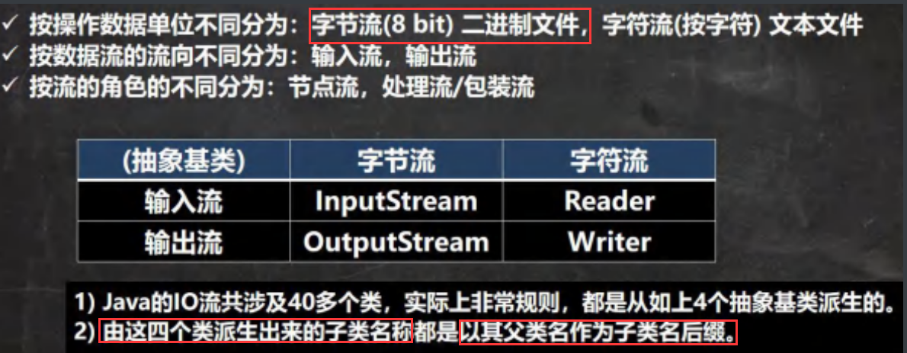


## IO 流体的系图

常用的类

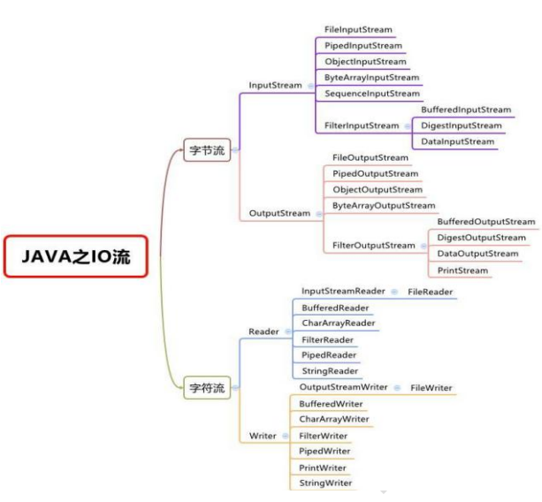


## 文件 VS 流

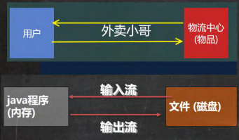


# 1. 字节流


## FileInputStream

（文件字节输入流）


### 基本方法

```java
 FileInputStream fileInputStream =  new FileInputStream(filePath);
//创建文件字节输入流对象

readData = fileInputStream.read()	
//此处读取的内容是一串8bit数字，可与char类型相互转换
//如下

while ((readData = fileInputStream.read()) != -1) {
                System.out.print((char) readData);//转成char显示
            }
```


### 实例

```java
package com.Novice.inputStream;

import org.testng.annotations.Test;

import java.io.FileInputStream;
import java.io.IOException;

//字节输入流演示，文件-> 程序

public class fileInputStream {


    public static void main(String[] args) {


    }


    @Test
   /*
    演示读取
  	  read 读取 单个字节的（8bit）效率比较低，打印汉字会出现乱码
  	  使用read(byte[] b)来读取
   */
    
    public void readFile01() {
        String filePath = "D:\\new3.txt";
        int readData = 0;

        FileInputStream fileInputStream = null;

        try {
            //创建快递员对象，用于读取"D:news3.txt"文件
            fileInputStream = new FileInputStream(filePath);

            //从该输入流读取一个字节的数据。
            如果没有输入可用，此方法将阻止。
            // 如何返回-1，表示读取完了

            while ((readData = fileInputStream.read()) != -1) {
                System.out.print((char) readData);//转成char显示
            }

        } catch (Exception e) {
            e.printStackTrace();
        } finally {
            //关闭文件流释放资源
            try {
                fileInputStream.close();
            } catch (IOException e) {
                e.printStackTrace();
            }

        }


    }

    @Test
/*
使用read(byte[] b)  来读取文件，提高效率
 */

    public void readFile02() {
        String filePath = "D:\\new3.txt";

        //字节数组
        byte[] buf = new byte[8];

        int readlLen = 0;

        FileInputStream fileInputStream = null;

        try {
            //创建快递员对象，用于读取 "D:news3.txt" 文件
            fileInputStream = new FileInputStream(filePath);

            //从该输入流读取最多b.length字节的数据到字节数组。
            
            //如果返回-1，表示读取完了
            //如果读取正常，返回实际读取的字节数

            while ((readlLen = fileInputStream.read(buf)) != -1) {  
            //fileInputStream.read(buf)表示将快递员读取的数据放入 字节数组 返回的值是读取的字节的个数
                
                System.out.println(new String(buf, 0, readlLen));//转成char显示
                //构建的输出长度是[0,readlen]
            }

        } catch (Exception e) {
            e.printStackTrace();
        } finally {
            //关闭文件流释放资源
            try {
                fileInputStream.close();
            } catch (IOException e) {
                e.printStackTrace();
            }

        }


    }


}

```


## FileOutputStream

（文件字节输出流）


### 1.创建对象

```java
//得到fileOutputStream对象

fileOutputStream = new FileOutputStream(filePath);
fileOutputStream = new FileOutputStream(filePath, true);

//说明
     //1. new FileOutputStream(filePath)创建方式，当写入内容，会覆盖原来的内容
     //2. new FileOutputStream(filePath,true)创建方式，当写入内容，是追加到文件后面


//因为是字节输入，文件会以二进制的形式传输，如果是英文字母，在文件解析后不会乱码
//但是如果汉字以字节的形式传入会出现乱码现象
```


### 2.输出数据


#### 1.单字节写出

```apl
         /*写入一个字节
         
         fileOutputStream.write('a');
          //char->会自动转成int
         */
```

#### 2. 字符串写出


```apl
        /*写入字符串

         String str = "Hello world！";
         str.getBytes()    可以把一个字符串->字节数组
         fileOutputStream.write(str.getBytes());
         */
```

#### 3. bye[ ]数组 截取片段


```apl
        /*
        write(byte[] b, int off， int len)
        从字符数组中截取片段进行输入
        */
        //off表示截取的起始位置，len表示截取的长度
```


### 实例

```apl
要求:
请使用 FileOutputStream 在 "a.txt" 文件，中写入 “hello，world”. 
如果文件不存在，会创建文件	("注意：前提是目录已经存在")
```

```java
package com.Novice.outputStream;

import org.testng.annotations.Test;

import java.io.FileOutputStream;
import java.io.IOException;

public class fileoutputStream01 {

    public static void main(String[] args) {

    }


    @Test
/*
演示使用FileOutputStream 将数据写到文件中，
如果文件不存在，就创建该文件
 */

    public void wriiteFile() {

        //创建FileOutputStream
        String filePath = "D:\\a.txt";
        FileOutputStream fileOutputStream = null;

        try {
          

 //说明
     //1. new FileOutputStream(filePath)创建方式，当写入内容，会覆盖原来的内容
     //2. new FileOutputStream(filePath,true)创建方式，当写入内容，是追加到文件后面

            fileOutputStream = new FileOutputStream(filePath, true);

            /*写入一个字节

              fileOutputStream.write('a');
              //char->会自动转成int
             */


            /*写入字符串

             String str = "Hello world！";
             str.getBytes()    可以把一个字符串->字符数组
             fileOutputStream.write(str.getBytes());
             */


            /*
            write(byte[] b, int off， int len)
            从字符数组中截取片段进行输入
            */

            String str = "Hello world！";
            fileOutputStream.write(str.getBytes(), 0, str.length() - 1);


        } catch (IOException e) {
            e.printStackTrace();


        } finally {

            try {
                fileOutputStream.close();
            } catch (IOException e) {
                e.printStackTrace();
            }
        }


    }
}

```


## 字节流copy实例


```apl
要求: 编程完成图片/音乐 的拷贝

   //完成文件拷贝。将 "d:\\a\\awk.jpg"  拷贝到 "d:\\aa"
    //思路分析
        //1.创建文件输入流，将文件读入程序
        //2.创建文件输出流，将读到的文件数据，写入指定的文件
```


```java
package com.Novice.outputStream;

import java.io.FileInputStream;
import java.io.FileOutputStream;
import java.io.IOException;

public class fileCopy {

    public static void main(String[] args) {
        
    //完成文件拷贝。将 "d:\\a\\awk.jpg"  拷贝到 "d:\\aa"
    //思路分析
        //1.创建文件输入流，将文件读入程序
        //2.创建文件输出流，将读到的文件数据，写入指定的文件
        
        String filePath = "d:\\a\\awk.jpg";
        String destFilePath = "d:\\aa\\th.jpg";

        FileInputStream fileInputStream = null;
        FileOutputStream fileOutputStream = null;


        try {
            fileInputStream = new FileInputStream(filePath);
            fileOutputStream = new FileOutputStream(destFilePath);

            //定义一个字节数组，提高读取效果
            byte[] buf = new byte[1024];
            
            int readlen = 0;
            
            while((readlen = fileInputStream.read(buf))!=-1){
                
                //读取到后就写入文件，通过FileOutStream
                //即，是一边读，一边写
                fileOutputStream.write(buf,0,readlen);
                //一定要用write(buf,0,readlen)这个方法.
                //不然最后一段输入流会多输入不正确内容

            }
            
            System.out.println("拷贝ok");


        } catch (IOException e) {
            e.printStackTrace();
        }finally {
            try{

                //关闭输入流和输出流，释放资源
                if(fileInputStream!=null){
                    fileInputStream.close();
                }

                if(fileInputStream!=null){
                    fileOutputStream.close();
                }
            }catch (IOException e){
                e.printStackTrace();
            }
        }
    }
}

```


# 2. 字符流

## FileReader 

(文件字符输入流)

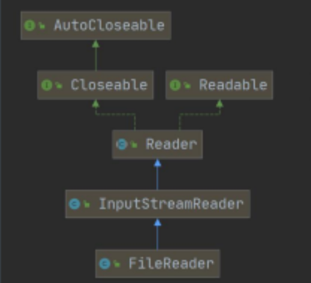 


### 基本方法

```apl
1) new FileReader(File/String)

2) read:每次读取单个字符，返回该字符，如果到文件末尾返回-1

3) read(charD):批量读取多个字符到数组，返回读取到的字符数，如果到文件末尾返回-1
```


### 相关API:

```apl
1) new String(char[]):
   # 将char[]转换成String

2) new String(char,off,len):
   # 将char[]的指定部分转换成String
```


### 实例

```java
package com.Novice.reader;

import org.testng.annotations.Test;

import java.io.FileReader;
import java.io.IOException;

public class fileReader {

    public static void main(String[] args) {


    }


    /*
    单个字符读取文件
     */

    @Test
    
    public void  readFile01(){
        
        String filePath = "D:\\a.txt";
        
        FileReader fileReader = null;
        
        int data = 0;
        
        

        try {
            
            //1.创建一个FileReader对象
            fileReader = new FileReader(filePath);

            //循环读取，使用 read() 单个字符读取
            while ((data = fileReader.read())!=-1){
                
                System.out.print((char) data);
                
            }

        } catch (IOException e) {
            e.printStackTrace();
        } finally {
            try {
                if(fileReader !=null){
                    fileReader.close();
                }
            } catch (IOException e) {
                e.printStackTrace();
            }
        }


    }


    /*
        使用字符数组读取文件
     */

    @Test
    public void  readFile02(){
        
        String filePath = "D:\\a.txt";
        
        FileReader fileReader = null;

        int readln = 0;
        char[] buf = new char[8];
    

        try {
                //1.创建一个FileReader对象
            fileReader = new FileReader(filePath);

            //循环读取，使用read(buf),返回的是实际读取到的字符数
            //如果返回-1，说明文件结束
            while ((readln = fileReader.read(buf))!=-1){
                System.out.print(new String(buf,0,readln));
            }

        } catch (IOException e) {
            e.printStackTrace();
        } finally {
            try {
                if(fileReader !=null){
                    fileReader.close();
                }
            } catch (IOException e) {
                e.printStackTrace();
            }
        }


    }


}
```


##  FileWriter 

文件字符输出流

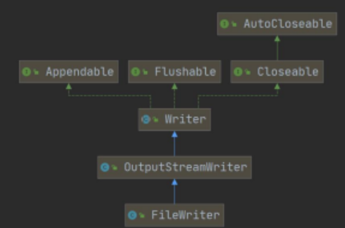


### 常用方法

```apl
1) new FileWriter(File/String):覆盖模式,相当于流的指针在首端

2) new FileWriter(File/String,true):追加模式，相当于流的指针在尾端

3)  write(int):写入单个字符

4) write(char):写入指定数组

5) write(charl.off,len):写入指定数组的指定部分

6) write (string):写入整个字符串

7) write(string,off,len):写入字符串的指定部分
```


### 相关API: 

```apl
String类:	toCharArray: # 将String转换成char[ ]
```


### 注意:

```apl
# FileWriter使用后，必须要 关闭(close) 或 刷新(flush)，否则写入不到指定的文件!
```


### 实例

```apl
要求：
	使用 FileWriter 将 “风雨之后，定见彩虹” 写入到 note.txt 文件中,
```


```java
package com.Novice.writer;

import java.io.FileWriter;
import java.io.IOException;


public class FileWriter01 {

    public static void main(String[] args) {

        String filePath = "d:\\news3.txt";

        FileWriter fileWriter = null;
        
        char[] chars = {'a','b','c'};

        try {
            
            //1)创建一个FileWriter对象
            fileWriter = new FileWriter(filePath);

            //2) write(int):写入单个 "字符"
            fileWriter.write('H');

            
            //1) write(char[]):写入指定数组
            fileWriter.write(chars);
            //2) write(char[] ,off, len):写入指定数组的指定部分
            fileWriter.write("你是我是大家是".toCharArray(),0,3);

            
            //1) write (string):写入整个字符串
            fileWriter.write("你好北京~");
            //2) write(string , off,len):写入字符串的指定部分
            fileWriter.write("上海天津",0,2);
            
            //off后面的数字是起始位置，len后面的数字是要读取的长度
            //在数据量大的情况下用循环的思路

        } catch (IOException e) {
            e.printStackTrace();
        } finally {
            //对于fileWriter，一定要关闭流，或者flush才能真正把数据写入文件

            try {
                fileWriter.close();
            } catch (IOException e) {
                e.printStackTrace();
            }

            System.out.println("输入完毕");
        }

    }


}

```


#  >节点流&处理流


### 基本关系图

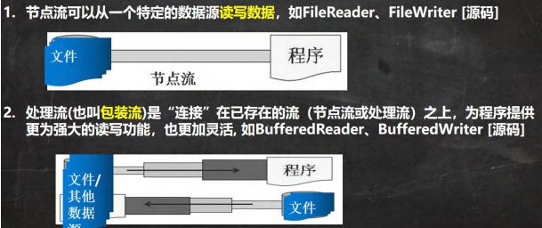


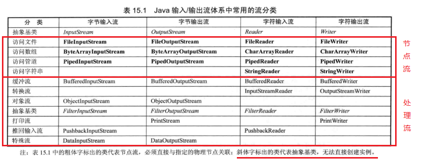

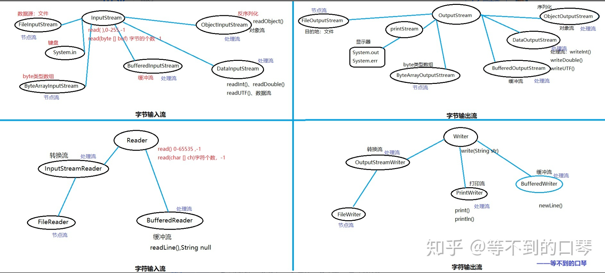


### 区别和联系

```apl
1. 节点流是底层流/低级流,直接跟数据源相接。

2．处理流(包装流)包装节点流，既可以消除不同节点流的实现差异，也可以提供更方
   便的方法来完成输入输出。[源码理解]

3．处理流(也叫包装流)对节点流进行包装，使用了修饰器设计模式，不会直接与数据
   源相连[模拟修饰器设计模式=》小伙伴就会非常清楚.]
```


# 3. 处理流


## 主要功能:

```apl
1. 性能的提高:
   # 主要以增加缓冲的方式来提高输入输出的效率。

2. 操作的便捷:
   # 处理流可能提供了一系列便捷的方法来一次输入输出大批量的数据,使用更加灵活方便
```


## BufferedReader 和 BufferedWriter


### 概念

```apl
BufferedReader和 BufferedWriter属于字符流，

是按照字符来读取数据的关闭时处理流，

只需要关闭外层流即可

[后面看源码]
```


### 1.BufferedReader实例


1.使用BufferedReader读取文本文件,并显示在控制台BufferedReader .java

```java
package com.Novice.reader;

import java.io.BufferedReader;
import java.io.FileReader;

public class BufferedReader_ {

    public static void main(String[] args) throws Exception {

        String filePath = "D:\\a.txt";
        
        //创建BufferedReader对象（快递员对象）
        BufferedReader bufferedReader = new BufferedReader(new FileReader(filePath));

        //读取
        String line;//按行读取，效率高

        //说明
        //1. bufferedReader.readLine()是按行读取文件
        //2.当返回null 时，表示文件读取完毕

        while ((line = bufferedReader.readLine()) != null) {
            System.out.println(line);
        }

        //关闭流，注意只需要关闭BufferedReader，因为底层会自动的去关闭 节点流

        bufferedReader.close();


    }
}

//FileReader

/*
public void close() throws IOException {
    synchronized (lock) {
        if (in == null)
            return;
        try {
            in.close();
            //in 就是我们传入的 new FileReader(filePath), 关闭了. 
        } finally {
            in = null;
            cb = null;
        }
    }
}

*/


```


### 2.BufferedWriter实例

应用案例
2.使用BufferedWriter将”hello,韩顺平教育”，写入到文件中BufferedWriter .java

```java
package com.Novice.writer;

import java.io.BufferedWriter;
import java.io.FileWriter;

public class BuffeeredWriter_ {
    
    public static void main(String[] args) throws Exception {
        
        String filePath = "D:\\news3.txt";
        
      
        //说明:
        //1. new FileWriter(filePath,true)表示以追加的方式写入
        //2. new FileWriter(filePath)，表示以覆盖的方式写入

        //创建一个BufferedWriter对象
        BufferedWriter bufferedWriter = new BufferedWriter(new FileWriter(filePath, true));

        bufferedWriter.write("hello!你是谁我是谁");
        
        //插入一个和系统相关换行符
        bufferedWriter.newLine();

        //说明：关闭外层流即可，传入的fileWriter(filePath) 会自动关闭
        bufferedWriter.close();

    }


}

```


### 3.应用于文件拷贝

应用案例
3)综合使用BufferedReader 和 BufferedWriter完成文本文件拷贝，注意文件编码 BufferedCopy_java

```java
package com.Novice.writer;

import java.io.*;

public class BufferedCopy_ {
    public static void main(String[] args) {

        //老韩说明
        //1.BufferedReader和 BufferedWriter是安装字符操作
        //2．不要去操作二进制文件，可能造成文件损国


        String filePath = "D:\\a.txt";
        String destFilePath = "D:\\a.md";
        
        BufferedReader bufferedReader = null;
        BufferedWriter bufferedWriter = null;

        String line;

        try {
            bufferedReader = new BufferedReader(new FileReader(filePath));
            bufferedWriter = new BufferedWriter(new FileWriter(destFilePath, true));

            //说明:readLine 读取一行内容，但是没有换行
            while ((line = bufferedReader.readLine()) != null) {
                
                //每读取一行就写入
                bufferedWriter.write(line);
                
                //插入一个换行
                bufferedWriter.newLine();
            }

            System.out.println("拷贝完毕！");

        } catch (IOException e) {
            e.printStackTrace();
        } finally {
            //关闭流
            try {
                if (bufferedReader != null) {
                    bufferedReader.close();
                }
                if (bufferedWriter != null) {
                    bufferedWriter.close();
                }
            } catch (IOException e) {
                e.printStackTrace();
            }


        }


    }
}

```


## BufferedInputStream 和 BufferedOutputStream


### BufferedInputStream

BufferedInputStream是字节流，在创建 BufferedlnputStream时，会创建一个内部缓冲区数组.

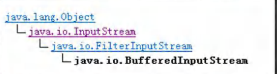


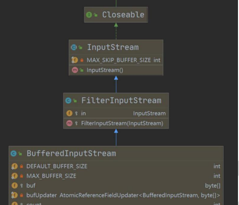


###  BufferedOutputStream


```apl
BufferedOutputStream是字节输出流，实现缓冲的输出流，

可以将多个字节写入底层输出流中，而不必对每次字节写入调用底层系统
```


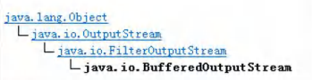


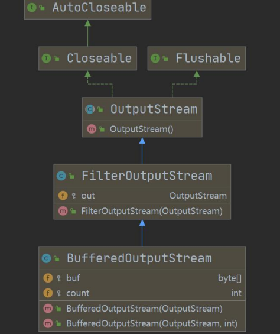


### 应用案例

要求:编程完成图片/音乐的拷贝(要求使用Buffered..流).[老师代码演示]BufferedCopy02.java

```java
package com.Novice.outputStream;


//演示使用BufferedOutputStream和 BufferedInputStream使用
//使用他们，可以完成二进制文件拷贝.
//思考:字节流可以操作二进制文件，可以操作文本文件吗?当然可以


import java.io.*;

public class BufferedCopy02 {
    public static void main(String[] args) {
        
		//图片
		//String srcFilePath = "D:\\a.png";
		//String destFilePath = "D:\\123\\b.jpg";

        //视频
        String srcFilePath = "D:\\a.mp4";
        String destFilePath = "D:\\123\\b.mp4";


        //创建BufferedOutputStream对象BufferedInputStream对象
        BufferedInputStream bis = null;
        BufferedOutputStream bos = null;
        

        try {

            // FileInputStream是 InputStream子类
            bis = new BufferedInputStream(new FileInputStream(srcFilePath));
            bos = new BufferedOutputStream(new FileOutputStream(destFilePath));

            //循环的读取文件，并写入到destFilePath
            byte[] buff = new byte[1024];
            int readline = 0;

            while ((readline = bis.read(buff)) != -1) {
                bos.write(buff, 0, readline);

            }

            System.out.println("文件拷贝成功");

        } catch (IOException e) {
            e.printStackTrace();
        } finally {

            //关闭流，关闭外层处理流即可，底层会去关闭节点流
            try {
                if (bis != null) {
                    bis.close();
                }
                if (bos != null) {
                    bos.close();
                }
            } catch (IOException e) {
                e.printStackTrace();
            }
        }


    }
}

```


# 4. 对象流

## ObjectInputStream &ObjectOutputStream


### 需求举例

> 看一个需求
>
> > 1．将int num = 100这个int数据保存到文件中,注意不是100数字，而是 int 100，并且，能够从文件中直接恢复int 100
> >
> > 2．将Dog dog = new Dog(“小黄”，3)这个 dog对象保存到文件中，并且能够从文件恢复.
> >
> > 3.上面的要求，就是能够将基本数据类型或者对象进行序列化和反序列化操作

***


### 序列化和反序列化

```apl
1.序列化就是在保存数据时,保存数据的值和数据类型

2.反序列化就是在恢复数据时，恢复数据的值和数据类型

3．需要让某个对象支持序列化机制，则必须让其类是可序列化的，为了让某个类是可序列化的，该
类必须实现如下两个接口之一:

		erializable/这是一个标记接口,没有方法
		Externalizable//该接口有方法需要实现，因此我们一般实现上面的Serializable接口


```


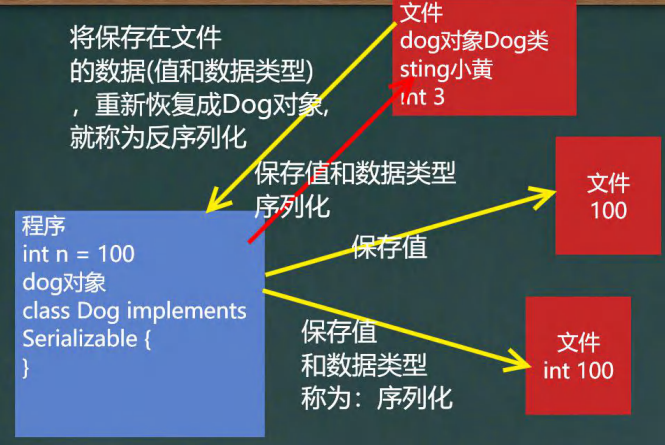


### 对象流


#### 功能：

提供了对基本类型或对象类型的序列化和反序列化的方法 

ObjectOutputStream 提供 序列化功能 

ObjectInputStream 提供 反序列化功能


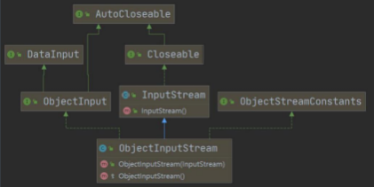

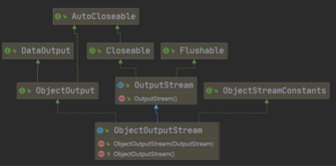

#### 实例


##### ObjectOutputStream序列化

##### 基本数据类型和一个 Dog对象


1．使用ObjectOutputStream序列化基本数据类型和一个 Dog对象(name,age),并
保存到data.dat文件中 ObjectOutStream_.java

```java
package com.Novice.outputStream;

import java.io.FileOutputStream;
import java.io.ObjectOutputStream;

public class objectOutStream {
    public static void main(String[] args) throws Exception {

        ////序列化后，保存的文件格式，不是存文本，而是按照他的格式来保存
        //写下要保存的路径 "D:\\c.md"
        String filePath = "D:\\c.md";

        //.txt里的文件虽然显示乱码，但是可以通过英文字母看到，
        //文件里保存了 值 和 数据类型
        
        //反序列化的时候就可以恢复相应的数据类型

        ObjectOutputStream oos = new ObjectOutputStream(new FileOutputStream(filePath));


        //序列化数据到 D:\\a.txt
        //如果write后面没有加上类型，那么保存的只是数值，而不是数据类型
        //例如oos.write(100);
        oos.writeInt(100); //int->Integer(实现了Serializable 接口)
        oos.writeBoolean(true); //boolean -> Boolean(实现了Serializable 接口)
        oos.writeChar('a');//char->Character(实现了Serializable 接口)
        oos.writeDouble(9.5); //double ->Double(实现了Serializable 接口)
        oos.writeUTF("你是我是");//String (实现了Serializable 接口)

        //保存一个dog对象
        oos.writeObject(new Dog("旺财", 12, "日本", "白色"));

        oos.close();


        System.out.println("数据保存完毕(序列化形式)");
    }
}


////如果需要序列化某个类的对象，该类需要实现Serializable 接口
//
//class Dog implements Serializable {
//    private String name;
//    private int age;
//
//
//    public String getName() {
//        return name;
//    }
//
//    public void setName(String name) {
//        this.name = name;
//    }
//
//    public Dog(String name, int age) {
//        this.name = name;
//        this.age = age;
//
//
//    }
//
//
//    @Override
//    public String toString() {
//        return "Dog{" +
//                "name='" + name + '\'' +
//                ", age=" + age +
//                '}';
//    }
//}

```

##### Dog类

```java
package com.Novice.outputStream;

import java.io.Serializable;

public class Dog implements Serializable {
    private String name;
    private int age;

    private static String nation;
    private transient String color;

    private Master master = new Master();
    //因为这里的Master并没有实现序列化，所以在对Dog序列化的时候会报错

    //serialVersionUID序列化的版本号，可以提高兼容性
    private static final long serialVersionUID = 1L;
    //在添加新的属性或者做修改的时候，会认为这还是原来的版本的升级，不是新的类

    public String getName() {
        return name;
    }

    public void setName(String name) {
        this.name = name;
    }

    public Dog(String name, int age, String nation, String color) {
        this.name = name;
        this.age = age;
        this.color = color;
        this.nation = nation;


    }


    @Override
    //如果不重写toString那么最终反序列化打印出来的是该类内容的哈希值
    public String toString() {
        return "Dog{" +
                "name='" + name + '\'' +
                ", age=" + age +
                ", color='" + color + '\'' +
                '}' + nation;
    }
}
```

##### Master类

```java
package com.Novice.outputStream;

import java.io.Serializable;

public class Master implements Serializable {

}

```

##### ObjectInputStream反序列化文件

```java
package com.Novice.inputStream;

import com.Novice.outputStream.Dog;

import java.io.FileInputStream;
import java.io.ObjectInputStream;

public class ObjectInputStream_ {
    public static void main(String[] args) throws Exception {

        //指定要反序列化文件
        //即从该文件中读取二进制信息，并将其反序列化为 数据类型 和 数据 的形式
        String filePath = "D:\\c.md";

        ObjectInputStream ois = new ObjectInputStream(new FileInputStream(filePath));


        //读取
        //（读取）反序列化的 顺序 需要与 （输入）序列化的顺序一致
        System.out.println(ois.readInt());
        System.out.println(ois.readBoolean());
        System.out.println(ois.readChar());
        System.out.println(ois.readDouble());
        System.out.println(ois.readUTF());

        Object dog = ois.readObject();
        //此处的dog编译类型是Object，运行类型是Dog

        System.out.println("运行类型=" + dog.getClass());
        System.out.println("dog信息=" + dog);//底层0bject ->Dog


        //细节

        //如果希望调用Dog的方法，需要向下转型，但是向下转型，
        //在本.java文件里需要有Dog类的定义，即将Dog类的定义拷贝到可以引用的位置

        Dog dog2 = (Dog) dog;//向下转型
        System.out.println(dog2.getName());//旺财。。


        //关闭流,关闭外层流即可，底层流会自动关闭
        ois.close();


    }

    //之所以使用独立的Dog类是因为序列化的时候已经将Dog所在包也记录进去，
    //如果在新的类里面记录了Dog定义后反序列化
    //Dog所在包的信息前后不一致，最终导致反序列化失败

//    class Dog implements Serializable {
//        private String name;
//        private int age;
//
//
//        public String getName() {
//            return name;
//        }
//
//        public void setName(String name) {
//            this.name = name;
//        }
//
//        public Dog(String name, int age) {
//            this.name = name;
//            this.age = age;
//
//
//        }
//
//
//        @Override
//        public String toString() {
//            return "Dog{" +
//                    "name='" + name + '\'' +
//                    ", age=" + age +
//                    '}';
//        }
//    }
}

```


#### 注意事项和细节说明


```apl
1)读写顺序要一致

2)要求序列化或反序列化对象，需要实现 Serializable

3)序列化的类中建议添加SerialVersionUID,为了提高版本的兼容性

4)序列化对象时，默认将里面所有属性都进行序列化，但除了static或transient修饰的成员

5)序列化对象时,要求里面属性的类型也需要实现序列化接口

6)序列化具备可继承性,也就是如果某类已经实现了序列化，则它的所有子类也已经默认实现了序列化
[在案例上演示下.看data.dat即可]


```


# 5. 标准 输入 输出 流


### 介绍

|                        | 类型        | 默认设备 |
| ---------------------- | ----------- | -------- |
| System.in     标准输入 | lnputStream | 键盘     |
| System.out   标准输出  | PrintStream | 显示器   |
|                        |             |          |


### 实例1

传统方法System.out.printIn(“");是使用out对象将数据输出到显示器

### 实例2

传统的方法,Scanner是从标准输入键盘接收数据

​	

# 6. 转换流

## InputStreamReader 和 OutputStreamWriter

（将字节流转化为字符流）


### 文件乱码问题

先看一个文件乱码问题，引出学习==转换流==必要性.

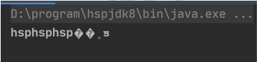

```java
package com.Novice.transformation;


import java.io.BufferedReader;
import java.io.FileReader;

//看一个中文乱码问题
public class CodeQuestion {
    public static void main(String[] args) throws Exception {
        //读取 "d: \la.txt" 文件到程序
        
        //思路
        //1.创建字符输入流BuffeeredReader[处理流]
        //2.使用BufferedReader 对象读取a.txt
        //3.默认情况下读取文件是按照UTF-8编码
          //如果编码发生问题就很有可能出现乱码

        //出现乱码的原因就是没有指定读取文件的编码方式
        //字节流可以指定编码方式进行读取---这就是转换流的价值   InputStreamReader和 OutputStreamWriter


        String filePath = "D:\\a.txt";
        BufferedReader br = new BufferedReader(new FileReader(filePath));

        String s = br.readLine();
        System.out.println("读取到的内容：" + s);
        br.close();

    }
}

```

```apl
读取到的内容：�����

a.txt原本内容:	你好吗

此处使用字符输入流出现了乱码，
乱码的原因是因为 没有指定读取文件的编码方式

//字节流可以指定编码方式进行读取---这就是转换流的价值   InputStreamReader和 OutputStreamWriter
```


### 转换流格式

```apl
1.InputStreamReader:  Reader的子类，可以将 InputStream(字节流) 包装成 Reader(字符流)

2.OutputStreamWriter:Writer的子类，实现将 OutputStream(字节流) 包装成 Writer(字符流)

3.当处理纯文本数据时，如果使用字符流效率更高，并且可以有效解决中文问题，所以建议将字节流转换成字符流

4.可以在使用时指定编码格式(比如utf-8, gbk , gb2312, ISO8859-1等)
```


### 实例1

1.编程将字节流FilelnputStream包装成(转换成)字符流InputStreamReader,对文件进行读取(按照utf-8/gbk格式)，进而在包装成 BufferedReader
InputStreamReader .java

```java
package com.Novice.transformation;


//演示使用工nputStreamReader 转换流解决中文乱码问题
//将字节流  FileInputStredm  转成字符流，InputStreamReader，指定编码gbk/ utf-8

import java.io.*;

public class InputStreamReader_ {
    public static void main(String[] args) throws IOException {

        String filePath = "D:\\a.txt";

        //解读
        //1.把 FileInputStream 转成 InputStreamReader
        //2．指定编码gbk
        
        InputStreamReader isr = new InputStreamReader(new FileInputStream(filePath), "gbk");

        //3. 把 InputStreamReader 传入 BuferedReader
        BufferedReader br = new BufferedReader(isr);

        //简洁写法，将2和3合在一起写
        // BufferedReader br = new BufferedReader(new InputStreamReader(new FileInputStream(filePath),"gbk"));

        //读取
        String s = br.readLine();
        System.out.println("读取内容=" + s);
        //关闭外层流
        br.close();


    }
}

```


### 实例2

编程将字节流 FileOutputStream包装成(转换成)字符流OutputStreamWriter,对文件进行写入(按照gbk格式,可以指定其他，比如utf-8)

```java
package com.Novice.transformation;

//演示OutputStreamWriter使用
//把 FileOutputStream 字节流，转成字符流 OutputStreamWriter
// 指定处理的编码gbk/utf-8/utf8
//即将字节流转化成指定格式后保存


import java.io.FileOutputStream;
import java.io.OutputStreamWriter;

public class OutPutStreamWriter_ {

    public static void main(String[] args) throws Exception {
        
        String filePath = "D:\\a.txt";
        
        String charSet = "utf8";
        
        OutputStreamWriter osw = new OutputStreamWriter(new FileOutputStream(filePath), charSet);

        osw.write("你好哦");
        osw.close();
        System.out.println("按照" + charSet + "保存文件成功");
    }
}

```


# 7. 打印流

## PrintStream 和 PrintWriter


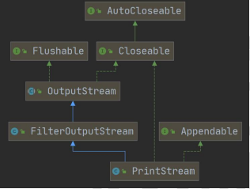


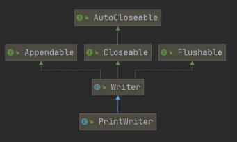


```java
package com.Novice.transformation;


//字符打印流
//PrintWriter使用方式

import java.io.FileWriter;
import java.io.IOException;
import java.io.PrintWriter;

public class PrintWriter_ {
    public static void main(String[] args) throws IOException {

        //直接输出到控制台
        //PrintWriter printWriter = new PrintWriter(System.out);

        //输出到指定文件
        PrintWriter printWriter = new PrintWriter(new FileWriter("D:\\a.txt"));
        printWriter.print("ni hao");

        printWriter.close();//如果改变输出路径没有关闭的话，是不会刷新的，信息也就不会输出到文件中

    }
}

```


```java
package com.Novice.printsream;


import java.io.IOException;
import java.io.PrintStream;

//演示    PrintStream (字节打印流)

public class printStream_ {
    public static void main(String[] args) throws IOException {


        PrintStream out = System.out;
        
        //在默认情况下，printStream输出数据的位置是 标准输出，即显示器
        out.println("你好");
        
        /*
        public void print(String s) {
            if (s == null){
                s = "null";
            }
            writels);
        }

        */

        
        //因为print底层使用的是write ，
        // 所以我们可以直接调用write进行打印/输出
        out.write("你好你好".getBytes());


        out.close();

        //修改打印流输出的位置/设备
        
        	//修改成打印到D:\a.txt
        System.setOut(new PrintStream("D:\\a.txt"));
        	//“你好”会被输出到 D:\\a.txt 中
        System.out.println("你好");
        
        

//        public static void setOut(PrintStream out) {
//            checkIO();
//            setOut0(out);   //native方法，修改了out
//        }


        
        	//输出回到屏幕
        System.setOut(out);


    }
}

```


# 8. Properties 类

### 看一个需求

```apl
如下一个 配置文件 
mysql.propertiesip = 192.168.0.13

user=root
pwd=12345
```

```apl
请编程读取 ip的 user 和 pwd 的值是多少
1.传统的方法
2.使用Properties类可以方便实现
```

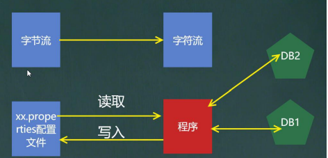


```java
package com.Novice.properties_;

import java.io.BufferedReader;
import java.io.FileReader;

public class Properties01 {

    public static void main(String[] args) throws Exception {


        //读取mysql.properties 文件，并得到ip,user和pwd

        BufferedReader br = new BufferedReader(new FileReader("src\\mysql.properties"));

        String line = "";

        while ((line = br.readLine()) != null) {//循环读取
            //System.out.println(line);

            String[] split = line.split("=");//通过等号做分割，生成字符串数组

            //如果需要指定IP输出
            if ("ip".equals(split[0])) {
                System.out.println(split[0] + "的值是" + split[1]);
            }
        }

        br.close();

    }
}

```


### Properties 类用方法

```apl
1)# 专门用于读写配置文件的集合类
    配置文件的格式:
    键=值
    键=值

2)注意:键值对不需要有空格，值不需要用引号一起来。默认类型是String

3)Properties的常见方法

* load:加载配置文件的键值对到Properties对象list:将数据显示到指定设备
* getProperty(key):根据键获取值
* setProperty(key,value):设置键值对到Properties对象
* store:将Properties中的键值对存储到配置文件.在idea中，保存信息到配置文件，如果含有中文，会存储为unicode码

http://tool.chinaz.com/tools/unicode.aspx unicode码查询工具
```


### 应用案例

```apl
1.使用Properties类完成对mysql.properties的读取,看老师代码演示

2.使用Properties类添加key-val 到新文件mysql2.properties中

3.使用Properties类完成对mysql2.properties 的读取，并修改某个key-val
```


```java
package com.Novice.properties_;

import java.io.FileReader;
import java.io.IOException;
import java.util.Properties;

public class Properties02 {
    
    public static void main(String[] args) throws IOException {
        
        //使用Properties类来读取mysql.properties 文件

        //1.创建 propertoes 对象
        Properties p = new Properties();
        
        //2.加载指定配置文件
        p.load(new FileReader("src\\mysql.properties"));

        //3.把k-v显示到控制台
        p.list(System.out);

        //4.根据key，获取对应的值
        String user = p.getProperty("user");
        String pwd =  p.getProperty("pwd");
        System.out.println("用户名=" + user);
        System.out.println("密码是=" + pwd);


    }
}

```

​	

​	使用Properties 类来创建 配置文件，修改配置文件内容

```java
package com.Novice.properties_;

import java.io.FileOutputStream;
import java.io.IOException;
import java.util.Properties;//底层用的是hashtable

public class Properties03 {

    public static void main(String[] args) throws IOException {
        
        //使用Properties 类来创建 配置文件，修改配置文件内容

        Properties p = new Properties();

        //创建
        //如果该文件没有这个key，就是创建，如果有就是覆盖并修改
        p.setProperty("charset", "utf8");
        p.setProperty("user", "汤姆");//注意保存到文件时，是中文的 unicode 码值
        p.setProperty("pwd", "123456");


        //将k-v存储到文件中
        p.store(new FileOutputStream("src\\mysql2.properties"), null);
        //null代表的是注解，注释的意思


        System.out.println("保存配置文件成功");
    }
}

```


# >本章作业

## 作业一

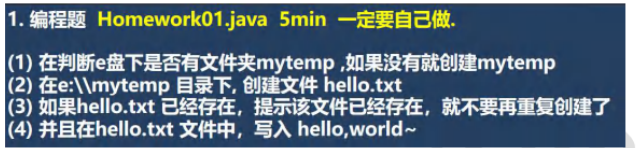

```java
package com.Novice.homeWork;

import java.io.File;
import java.io.IOException;

//要求:
//(1)在判断e盘下是否有文件夹 a ,如果没有就创建 a
//(2)在"D:\\a"目录下，创建文件"D:\\a\\a.txt"
//(3)如果a.txt已经存在，提示该文件已经存在，就不要再重复创建了


public class Test01 {

    public static void main(String[] args) throws IOException {

        String filePath = "D:\\a";
        String filePath2 = "D:\\a\\a.txt";

        File file = new File(filePath);
        File file2 = new File(filePath2);


        if (file.exists()) {
            System.out.println("文件已存在");

            if (file2.exists()) {
                System.out.println("文本文件已存在");

            } else {

                if (file2.createNewFile()) {
                    System.out.println("文本文件创建成功");
                } else {
                    System.out.println("文本文件创建失败");
                }

            }


        } else {

            if (file.mkdirs()) {
                System.out.println("文件创建成功");
            } else {
                System.out.println("文件创建失败");
            }
        }


    }
}
```

## 作业二


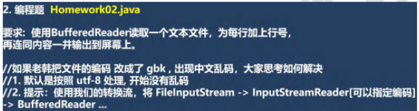

```java
package com.Novice.homeWork;

//要求:
// 使用BufferedReader读取一个文本文件，为每行加上行号,再连同内容一并输出到屏幕上。


import java.io.*;

public class Test02 {
    public static void main(String[] args) throws Exception {

        String filePath = "D:\\a\\b.txt";
        String destFilePath = "D:\\a\\a.txt";

        BufferedReader bufferedReader = null;
 //       BufferedWriter bufferedWriter = null;
        try {
            bufferedReader = new BufferedReader(new FileReader(filePath));
//            bufferedWriter = new BufferedWriter(new FileWriter(destFilePath));

            String line;
            int linuNum = 0;

            while ((line = bufferedReader.readLine())!=null){

                System.out.println(++linuNum + line);

//                bufferedWriter.write(linuNum);
//                bufferedWriter.write(" ");
//                i++;
//                bufferedWriter.write(line);
//                bufferedWriter.newLine();

            }


        } catch (IOException e) {
            e.printStackTrace();
        } finally {

            try {
                if(bufferedReader!=null);
                {
                    bufferedReader.close();
                }
//                if (bufferedWriter!=null){
//                    bufferedWriter.close();
//                }
            } catch (IOException e) {
                e.printStackTrace();
            }


        }

    }
}
```

## 作业三


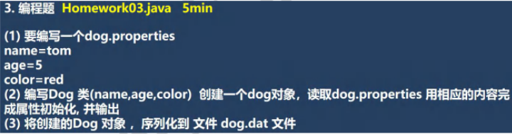


```java
package com.Novice.homeWork;

import org.testng.annotations.Test;

import java.io.*;
import java.util.Properties;

public class Test03 {

    public static <viod> void main(String[] args) throws IOException {


        Properties properties = new Properties();

        properties.setProperty("name","tom");
        properties.setProperty("age" , "5");
        properties.setProperty("color","red");

        properties.store(new FileOutputStream("src\\dog.properties"),null);


        Properties properties1 = new Properties();
        properties1.load(new FileReader("src\\dog.properties"));
        dog Dog = new dog(properties1.getProperty("name"),properties1.getProperty("age"), properties1.getProperty("color"));

     //   String name = properties.getProperty("name");
     //   String age = properties.getProperty("age");
     //   String color =  properties.getProperty("color");

//        dog.setName(properties1.getProperty("name"));
//        dog.setAge(properties1.getProperty("age"));
//        dog.setColor(properties1.getProperty("color"));


        String filePath = "D:\\dog.txt";
        ObjectOutputStream objectOutputStream = new ObjectOutputStream(new FileOutputStream(filePath));


        objectOutputStream.writeObject(Dog);

        objectOutputStream.close();

        System.out.println("序列化成功");


    }

    @Test
    public void m1() throws IOException, ClassNotFoundException {
        String serFilePath = "D:\\dog.txt";

        ObjectInputStream objectInputStream = new ObjectInputStream(new FileInputStream(serFilePath));

        dog DOG = (dog) objectInputStream.readObject();

        System.out.println("反序列化后dog的信息");
        System.out.println(DOG);

        objectInputStream.close();


    }
}
```

```java
package com.Novice.homeWork;


import java.io.Serializable;

public class dog implements Serializable {

    String name;
    String age;
    String color;


    public dog(String name, String age, String color) {
        this.name = name;
        this.age = age;
        this.color = color;
    }


    public String getName(String name) {
        return this.name;
    }

    public void setName(String name) {
        this.name = name;
    }

    public String getAge(String age) {
        return this.age;
    }

    public void setAge(String age) {
        this.age = age;
    }

    public String getColor(String color) {
        return this.color;
    }

    public void setColor(String color) {
        this.color = color;
    }

    @Override
    public String toString() {
        return "dog{" +
                "name='" + name + '\'' +
                ", age='" + age + '\'' +
                ", color='" + color + '\'' +
                '}';
    }
}
```


# >JAVA：IO流 之 节点流与处理

## 1. 流的分类

按数据流的方向不同：输入流，输出流。

按处理数据单位不同：字节流，字符流。
（1） 字节流：数据流中最小的数据单元是字节。
（2）字符流：数据流中最小的数据单元是字符， Java中的字符是Unicode编码，一个字符占用两个字节。

按功能不同：节点流，处理流。
（1）程序用于直接操作目标设备所对应的类叫节点流。
（2）程序通过一个间接流类去调用节点流类，以达到更加灵活方便地读写各种类型的数据，这个间接流类就是处理流。
##2. 节点流
###2.1 节点流的类型

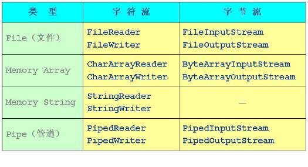


（1）File 文件流。对文件进行读、写操作 ：FileReader、FileWriter、FileInputStream、FileOutputStream。、

（2）Memory
1）从/向内存数组读写数据: CharArrayReader与 CharArrayWriter、ByteArrayInputStream与ByteArrayOutputStream。
2）从/向内存字符串读写数据 StringReader、StringWriter、StringBufferInputStream。

（3）Pipe管道流。 实现管道的输入和输出（进程间通信）: PipedReader与PipedWriter、PipedInputStream与PipedOutputStream。
###2.2 节点流执行的图示

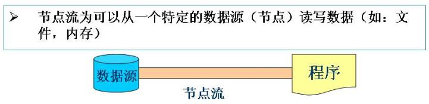

##3. 处理流
###3.1 处理流的类型

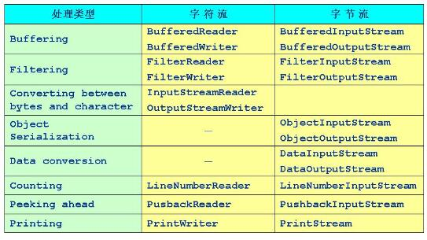


（1）Buffering缓冲流：在读入或写出时，对数据进行缓存，以减少I/O的次数：BufferedReader与BufferedWriter、BufferedInputStream与BufferedOutputStream。

（2）Filtering 滤流：在数据进行读或写时进行过滤：FilterReader与FilterWriter、FilterInputStream与FilterOutputStream。

（3）Converting between Bytes and Characters 转换流：按照一定的编码/解码标准将字节流转换为字符流，或进行反向转换（Stream到Reader）：InputStreamReader、OutputStreamWriter。

（4）Object Serialization 对象流 ：ObjectInputStream、ObjectOutputStream。

（5）DataConversion数据流： 按基本数据类型读、写（处理的数据是Java的基本类型（如布尔型，字节，整数和浮点数））：DataInputStream、DataOutputStream 。

（6）Counting计数流： 在读入数据时对行记数 ：LineNumberReader、LineNumberInputStream。

（7）Peeking Ahead预读流： 通过缓存机制，进行预读 ：PushbackReader、PushbackInputStream。

（8）Printing打印流： 包含方便的打印方法 ：PrintWriter、PrintStream。
###3.2 处理流执行的图示

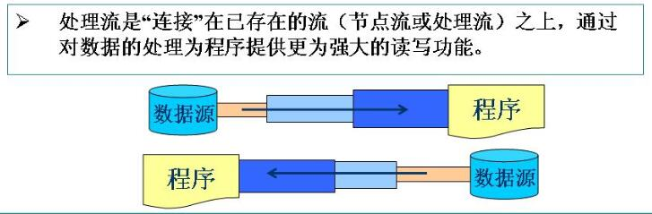

###3.3 缓冲流

【1】对I/O进行缓冲是一种常见的性能优化，缓冲流为I/O流增加了内存缓冲区，增加缓冲区的两个目的：
（1）允许Java的I/O一次不只操作一个字符，这样提高䇖整个系统的性能；
（2）由于有缓冲区，使得在流上执行skip、mark和reset方法都成为可能。

【2】缓冲流：它是要“套接”在相应的节点流之上，对读写的数据提供了缓冲的功能，
提高了读写的效率，同时增加了一些新的方法。例如：BufferedReader中的readLine方法，
BufferedWriter中的newLine方法。

【3】J2SDK提供了4种缓存流，常用的构造方法为：

```java
//字符输入流
BufferedReader(Reader in)//创建一个32字节的缓冲区
BufferedReader(Reader in, int size)//size为自定义缓存区的大小

//字符输出流
BufferedWriter(Writer out)
BufferedWriter(Writer out, int size)

//字节输入流
BufferedInputStream(InputStream in)
BufferedInputStream(InputStream in, int size)

//字节输出流
BufferedOutputStream(OutputStream in)
BufferedOutputStream(OutputStream in, int size)

```


【4】其他
（1）缓冲输入流BufferedInputSTream除了支持read和skip方法意外，还支持其父类的mark和reset方法;
（2）BufferedReader提供了一种新的ReadLine方法用于读取一行字符串（以\r或\n分隔）;
（3）BufferedWriter提供了一种新的newLine方法用于写入一个行分隔符;
（4）对于输出的缓冲流，BufferedWriter和BufferedOutputStream，写出的数据会先在内存中缓存，
使用flush方法将会使内存的数据立刻写出。

示例1:

```java
import java.io.*;
public class TestBufferStream1 {
  public static void main(String[] args) {
    try {
      FileInputStream fis = new FileInputStream(
		  "d:\\JavaProject\\demo13\\ProcessingStream\\TestBufferStream1.java");
      BufferedInputStream bis = new BufferedInputStream(fis);
      int c = 0;
      System.out.println((char)bis.read());
      System.out.println((char)bis.read());
      bis.mark(100);/*在当前输入流的当前位置上做一个标志，允许最多再读入100个字节*/
      for(int i=0;i<=10 && (c=bis.read())!=-1;i++){
        System.out.print((char)c+" ");
      }
      System.out.println(); 
      bis.reset();/*把输入指针返回到以前所做的标志处*/
      for(int i=0;i<=10 && (c=bis.read())!=-1;i++){
        System.out.print((char)c+" ");
      }
      bis.close();
    } catch (IOException e) {e.printStackTrace();}
  }
}

```

示例2：

```java
import java.io.*;
public class TestBufferStream2
{
	public static void main(String[] args)
	{
	try{
	BufferedWriter bw = new BufferedWriter(new FileWriter("D:\\JavaProject\\demo13\\BufferStream\\dat2.txt"));
	BufferedReader br = new BufferedReader(new FileReader("D:\\JavaProject\\demo13\\BufferStream\\dat2.txt"));
	String s = null;
	for(int i=0;i<10;i++)
	{
		s = String.valueOf(Math.random());//产生一个小于1的正的随机数，并转换成字符串形式
		bw.write(s);//把字符串s写入到dat2.txt文件中
		bw.newLine();//写入一个行分隔符
	}
	bw.flush();//使用flush方法将会使内存的数据立刻写出

	while((s=br.readLine()) != null)
	{
		System.out.println(s);
	}
	bw.close();
	br.close();
	}
	catch(IOException e)
	{
		e.printStackTrace();
	}

	}
}

```


### 3.4 转换流

转换流有两种：
（1）InputStreamReader：将字节流转换为字符流;
（2）OutputStreamWriter：将字符流转换为字节流。
什么时候使用转换流？由以下分析： 流对象很多，就要明确使用哪个流对象。

```apl
通过三点来完成： 
	1、明确数据的来源和数据到达的目的地。
	             来源：输入流 [InputStream，Reader]。 
	             目的：输出流 [OutputStream，Writer]。 
	2、操作的数据是否是纯文本。  
	             是：字符流，使用Reader与Writer; 
	             否：字节流，使用InputStream与OutputStream。 
	3、明确要使用哪个具体的对象。 通过设备来进行区分： 
	             源设备：内存用数组，硬盘就加file，键盘用System.in; 
	             目的设备：内存用数组，硬盘就加file，键盘用System.out。 
	4、明确是否还需要其他额外功能：例如 
	            （1）是否需要较高的效率，即是否需要使用缓冲区，是就加上Buffered;
	            （2）是否需要转换，是，就使用转换流，InputStreamReader 和 OutputStreamWriter。

```

用一个例子简单的说明： 将键盘录入的数据保存到一个文件中，输入“over”时表示录入结束。 详细分析：
源：从InputStream，Reader中选择; 因为是键盘录入的是纯文本，所以使用Reader。 
设备：键盘，所以用System.in; 发现System.in是字节流的操作，与Reader(字符流)矛盾，
这时就要用到转换流 InputStreamReader 。为了提高操作效率，使用缓冲技术，选择BufferedReader。 

目的：从 OutputStream，Writer中选择。 因为是文本文件，所以选择Writer。 
设备：硬盘上，一个文件，选择FileWriter。 为了提高操作效率，使用缓冲技术，选择BufferedWriter。 

示例1：

```java
import java.io.*; 
	class ReadinFile 
		{ 
			public static void main(String[] args)throws IOException //这里为了方便阅读，先不做异常处理。 
			{ 
				BufferedReader bufr=new BufferedReader(new InputStreamReader(System.in)); 
				BufferedWriter bufw=new BufferedWriter(new FileWriter("readin.txt")); 
				String line=null; 
				while((line=bufr.readLine())!=null) 
				{ 
					if("over".equals(line)) break; 
					bufw.write(line); 
					bufw.newLine(); 
				} 
				bufw.close(); 
				bufr.close(); 
			} 
		}

```

示例2

```java
import java.io.*;
public class TestTransForm 
{
	public static void main(String[] args) throws IOException //这里为了方便阅读，先不做异常处理。 
	{
		InputStreamReader isr = new InputStreamReader(System.in);
		BufferedReader br = new BufferedReader(isr);
		OutputStreamWriter osw = new OutputStreamWriter(
			                     new FileOutputStream("D:\\JavaProject\\demo13\\TransStream\\TransForm.txt",true));
		BufferedWriter bw = new BufferedWriter(osw);
		String str = null;
		str = br.readLine();
		while(str != null)
		{
			if(str.equalsIgnoreCase("exit")) break;
			bw.write(str);
			bw.newLine();
			str = br.readLine();
		}
		br.close();
		bw.close();
	}
}

```


注意：
（1）构造方法：public FileOutputStream(String name,boolean append) throws FileNotFoundException
如果append为True，输出字节流就写入文件的末尾，而不是开头（覆盖原来的内容）；
如果append为False，输出字节流就写入文件的开头，即覆盖原来的内容从文件开始处写内容。
（2）构造方法：public FileOutputStream(String name) throws FileNotFoundException
每次覆盖原文件的内容，从文件开始处写内容。

###3.5 数据流——数据的存储和数据恢复

数据流：DataInputStream和DataOutputStream
（0）DataInputStream和DataOutputStream是面向字节的，因此要使用InputStream和OutputStream。
（1）DataInputStream和DataOutputStream分别继承InputStream和OutputStream，
它们属于处理流，需要分别“套接”在InputStream和OutputStream类型的节点流上。
（2）DataInputStream和DataOutputStream提供了可以存取与机器无关的Java原始类数据（如：int，double等）的方法。
（3）DataInputStream和DataOutputStream的构造方法：

 ```java
      DataInputStream（InputStream in）
 	 DataOutputStream（OutputStream out）
 
 ```

示例1：

```java
import java.io.*;
public class TestDataStream
{
	public static void main(String[] args) throws IOException
	{
		FileOutputStream fout = new FileOutputStream("D:/JavaProject/demo13_IO/DataStream/demo.txt",true);
	    BufferedOutputStream bout = new BufferedOutputStream(fout);
	    DataOutputStream dout = new DataOutputStream(bout);
		/*DataOutputStream,BufferedOutputStream,FileOutputStream这里使用了流栈。*/

	    dout.writeInt(110);
	    dout.writeUTF("hello,中国");
	    dout.writeFloat(3.14f);
	    dout.writeChar(97);/*97对应的是'a'*/
        dout.close();/*如果正在使用一个流栈，程序关闭最上面的一个流也就自动的关闭了栈中的所有底层流。*/
		
		FileInputStream fin = new FileInputStream("D:/JavaProject/demo13_IO/DataStream/demo.txt");
		BufferedInputStream bin = new BufferedInputStream(fin);
		DataInputStream din = new DataInputStream(bin);
		
		int i = din.readInt();
		String str = din.readUTF();
		float f = din.readFloat();
		char c = din.readChar();
		fin.close();/*如果正在使用一个流栈，程序关闭最上面的一个流也就自动的关闭了栈中的所有底层流。*/
        System.out.println("int:"+i+"\nString:"+str+"\nfloat:"+f+"\nchar:"+c);
	}
	
}

```


```apl
  D:\JavaProject\demo13_IO\DataStream>javac TestDataStream.java

D:\JavaProject\demo13_IO\DataStream>java TestDataStream
int:110
String:hello,中国
float:3.14
char:a

```


注意：

```apl
        int i = din.readInt();
		String str = din.readUTF();
		float f = din.readFloat();
		char c = din.readChar();
		/*此段代码的顺序不能乱，要保证先写入的先读出来的原则，否则会出现错误。
		*    因此，我们在写代码的时候，我们必须：
		*         要么为文件中的数据采用固定的格式；
		*         要么将额外的信息保存到文件中，以便能够对其进行解析以确定数据的寻访位置。
		*/

```


原文链接：https://blog.csdn.net/jingzi123456789/article/details/72123937