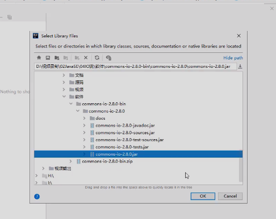
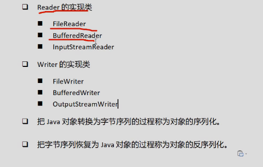

# Java中四大IO抽象类

## InputStream

```apl
此抽象类是表示'字节输入流'的所有类的父类。
InputSteam是一个'抽象类'，它不可以实例化。
数据的读取需要由它的子类来实现。

根据节点的不同，它派生了不同的节点流子类。

继承自InputSteam的流都是用于向程序中输入数据，且数据的单位为字节 (8 bit)。
```

```apl
常用方法:

1 int read():
    读取'一个'字节的数据,并将字节的值作为int类型返回(0-255之间的一个值)。
    如果未读出字节则返回-1(返回值为-1表示读取结束)。

2 void close():
    关闭输入流对象，释放相关系统资源。
```

## outputStream

```apl
此抽象类是表示'字节输出流'的所有类的父类。输出流接收输出字节并将这些字节发送到某个目的地。
```

```apl
常用方法:

1 void write(int n):
	向目的地中写入一个字节。
2 void close():
	关闭输出流对象，释放相关系统资源。
```

## Reader

```apl
Reader用于读取的'字符流'抽象类，数据单位为字符。
```

```apl
int read():
	读取'一个'字符的数据，并将字符的值作为int类型返回(0-65535之间的一个值，即 Unicode值)。
	如果未读出字符则返回-1(返回值为-1表示读取结束)。

void close():
	关闭流对象，释放相关系统资源。
```

## Writer

```apl
Writer用于输出的'字符流'抽象类，数据单位为字符。
```

```apl
void write(int n):
	向输出流中写入一个字符。
	
void close():
	关闭输出流对象，释放相关系统资源。
```


# Java中流的细分概念


## 1. 按处理的数据单元分类:

### 字节流:

```apl
以字节为单位获取数据，命名上以stream结尾的流一般是字节流，如FileInputStream、FileOutputStream。
```

### 字符流:

```apl
以字符为单位获取数据,命名上以Reader/Writer结尾的流一般是字符流，如FileReader、FileWriter。
```


## 2. 按流的方向分类:

### 输入流:

```apl
数据流从数据源到程序(以InputStream、Reader结尾的流)。
```

### 输出流:

```apl
数据流从程序到目的地（以OutPutStream、Writer结尾的流)。
```


## 3. 按处理对象不同分类:

### 节点流:

```apl
可以直接从数据源或目的地读写数据.
如FileInputStream、FileReader、DatalnputStream等

'直接链接数据源的对象'
```

### 处理流:

```apl
不直接连接到数据源或目的地，是'处理流的流'。通过对其他流的处理提高程序的性能。
如 BufferedInputStream、BufferedReader等。
'处理流也叫包装流。
```


```apl
节点流: 处于I0操作的第一线，所有操作必须通过它们进行;

处理流: 可以对节点流进行包装，提高性能或提高程序的灵活性。
```

# Java-IO流类的体系

## 体系图

```apl
Java为我们提供了多种多样的Io流，我们可以根据不同的功能及性能要求挑选合适的lO流。
```


将目录或者文件包装成File对象，就表明我们具有了更多的操作文件或目录的方式，因为file有很多的方法

RandomAccessFile-----随机访问流，只能对文件进行读写操作的访问

## 所有分类以及作用

### 字节流

```apl
1. InputStream/OutputStream
   //字节流的抽象父类。
	
2. FileInputStream/FileOutputStream
   节点流: 以字节为单位直接操作'文件'.适合读写所有类型的文件(图像、视频、文本文件等)
   		  'Java也提供了FileReader专门读取文本文件'以及'FileWriter专门写入文本文件'。
		  //字节输入流返回的值是在0~255之间的。
		  //输出流需要调用.fiush()方法，将数据从内存写入到磁盘中
		 '//char是字符类型  //byte是字节类型'
		 
3. BufferedInputStream/BufferedOutputStream
   处理流: 将InputStream/OutputStream对象进行包装，增加缓存功能，提高读写效率。
    
4. ByteArraylnputStream/ByteArrayOutputStream
   节点流: 以字节为单位直接操作'字节数组对象'。
    
5. ObjectInputStream/ObjectOutputStream
   处理流: 以字节为单位直接操作'对象'。
		
6. DatalnputStream/DataOutputStream
   处理流: 以字节为单位直接操作'基本数据类型'与'字符串类型'。


	
7. PrintStream
	处理流:将OutputStream进行包装，可以方便地输出字符，更加灵活。
```

### 转换流

```apl
1. InputStreamReader/OutputStreamWriter
	处理流:将字节流对象转化成字符流对象。
```

### 字符流

```apl
1. Reader/Writer
	字符流的抽象类。
	
	
2. FileReader/FileWriter
   节点流: 以字符为单位直接操作'文本文件'(注意:只能读写文本文件)。
	      '字符流只能对文本文件进行操作'
	
3. BufferedReader/BufferedWriter
	处理流:将Reader/Writer对象进行包装，增加缓存功能，提高读写效率。
```

### 总结

```apl
1. InputStream/OutputStream
	字节流的抽象类。
2. Reader/Writer
	字符流的抽象类。
	
3. FileInputStream/FileOutputStream
	节点流:以字节为单位直接操作'文件'。适合读写所有类型的文件(图像、视频、文本文件等）。'Java也提供了FileReader专门读取文本文件'。
以及，'FileWriter专门写入文本文件'。
	字节输入流返回的值是在0~255之间的。
	输出流需要调用.fiush()方法，将数据从内存写入到磁盘中
	'//char是字符类型//byte是字节类型'

4. ByteArraylnputStream/ByteArrayOutputStream
	节点流:以字节为单位直接操作'字节数组对象'。
5. FileReader/FileWriter
	节点流:以字符为单位直接操作'文本文件'(注意:只能读写文本文件)。
	
6. ObjectInputStream/ObjectOutputStream
	处理流:以字节为单位直接操作'对象'。
7. DatalnputStream/DataOutputStream
	处理流:以字节为单位直接操作'基本数据类型'与'字符串类型'。
'字符流只能对文本文件进行操作'

8. BufferedInputStream/BufferedOutputStream
	处理流:将InputStream/OutputStream对象进行包装，增加缓存功能，提高读写效率。
	
9. BufferedReader/BufferedWriter
	处理流:将Reader/Writer对象进行包装，增加缓存功能，提高读写效率。
	

10. InputStreamReader/OutputStreamWriter
	处理流:将字节流对象转化成字符流对象。

11. PrintStream
	处理流:将OutputStream进行包装，可以方便地输出字符，更加灵活。
```

# 文件字节流

## 文件-字节输入流

**FileInputStream**

```apl
使用 字节输入流 读取字符 的时候，每次只会读取一个字节(8bit)，而且是以int类型返回字节对应的ASIIC码
```

```java
public class test {
    public static void main(String[] args) throws IOException {


        FileInputStream fis = null;
        try {
            fis=new FileInputStream("D:\\a");
            int a = fis.read();
            int b = fis.read();
            int c = fis.read();
            //... ...
            
        } catch (FileNotFoundException e) {
            throw new RuntimeException(e);
        } finally {
            try {
                fis.close();
            } catch (IOException e) {
                e.printStackTrace();
            }
        }


    }


}
```

### improve

```apl
char类型可以直接转化为整型int
整型int也可以直接转化为char类型

但是
    字节流的缓冲数组用 '字节数组' byte[] a = new byte[1024];
    字符流的缓冲数组用 '字符数组' char[] b = new char[1024];
```


```java
public class test {
    public static void main(String[] args) throws IOException {


        FileInputStream fis = null;
        try {
            fis=new FileInputStream("D:\\a");
            //int a = fis.read();
            //int b = fis.read();
            //int c = fis.read();
            //... ...
            
            
          StringBuilder sb = new StringBuilder();//只是盲区？
          int temp = 0;
          while ((temp = fis.read())!=-1){//读取到就返回ASCII码，读取不到就就返回-1
                System.out.print(temp);
                sb.append((char)temp);//使用(char)将ASCII码转换成char类型，int类型与char类型可以相互转换
            }
          System.out.println(sb.toString());
            
            
        } catch (FileNotFoundException e) {
            throw new RuntimeException(e);
        } finally {
            try {
                fis.close();
            } catch (IOException e) {
                e.printStackTrace();
            }
        }


    }


}
```

## 文件-字节输出流

**FileOutputStream**

```java
package com.Novice.scoket;

import java.io.FileInputStream;
import java.io.FileNotFoundException;
import java.io.FileOutputStream;
import java.io.IOException;

public class test {
    public static void main(String[] args) throws IOException {
        
        FileInputStream fis = null;
        FileOutputStream fos = null;
        try {
            fis = new FileInputStream("D:\\a");
            fos = new FileOutputStream("D:\\b");

            int temp = 0;
            while ((temp = fis.read()) != -1) {
                fos.write(temp);//每次往内存中写入一个字节
            }
            
            //输出流需要调用.fiush()方法，将数据从内存写入到磁盘中
            fos.flush();

        } catch (FileNotFoundException e) {
            throw new RuntimeException(e);
        } finally {
            try {
                 if (fis!=null){
                    fis.close();
                }
                if (fos != null) {                   
                    fos.close();
                }
            } catch (IOException e) {
                e.printStackTrace();
            }
        }

    }

}
```

## 字节缓冲区提高读写效率

### 方式一：人为定长-字节数组


```apl
通过创建一个指定长度的'字节数组'作为缓冲区，以此来提高Io流的读写效率。
该方式适用于读取较大图片时的缓冲区定义。// byte[] a = new byte[1024];

'注意': 缓冲区的长度一定是2的整数幂。
       一般情况下 1024长度较为合适。
```

```java
public class test {
    public static void main(String[] args) throws IOException {

        FileInputStream fis = null;
        FileOutputStream fos = null;
        try {
            fis = new FileInputStream("D:\\a");
            fos = new FileOutputStream("D:\\b");

            byte[] buff = new byte[1024];
            int len = 0;

            // 返回值：读入缓冲区的总字节数，如果由于已到达文件末尾而没有更多数据，则为-1 。
            while ((len = fis.read(buff)) != -1) {
                fos.write(buff,0,len);//一次读取一包
            }

            //输出流需要调用.fiush()方法，将数据从内存写入到磁盘中
            fos.flush();

        } catch (FileNotFoundException e) {
            throw new RuntimeException(e);
        } finally {
            try {
                if (fis!=null){
                    fis.close();
                }
                if (fos != null) {

                    fos.close();
                }
            } catch (IOException e) {
                e.printStackTrace();
            }
        }


    }


}
```

### 方式二：available()方式

```apl
通过创建一个'字节数组'作为缓冲区，
数组长度->是通过输入流对象的available()返回当前文件的预估长度来定义的。
在读取文件时，是在一次读写操作中完成文件读写操作的。

'注意':
如果文件过大，那么对内存的占用也是比较大的。所以大文件不建议使用该方法。
```

```java
public class test {
    public static void main(String[] args) throws IOException {

        FileInputStream fis = null;
        FileOutputStream fos = null;
        try {
            fis = new FileInputStream("D:\\a");
            fos = new FileOutputStream("D:\\b");

            byte[] buff = new byte[fis.available()];//一次都抗进内存
            fis.read(buff);//read是读入程序
            fos.write(buff);//write是写入内存
            //输出流需要调用.fiush()方法，将数据从内存写入到磁盘中
            fos.flush();

        } catch (FileNotFoundException e) {
            throw new RuntimeException(e);
        } finally {
            try {
                if (fis!=null){
                    fis.close();
                }
                if (fos != null) {

                    fos.close();
                }
            } catch (IOException e) {
                e.printStackTrace();
            }
        }


    }


}
```


## 使用-==字节缓冲流==-对象

(**提高读写效率**)

**BufferedInputStream bis = null;**

**BufferedOutputStream bos = null;**

```apl
Java缓冲流本身并不具有Io别的读取与写入功能，'处理流'
只是在别的流（节点流或其他处理流)上加上缓冲功能提高效率,
就像是把别的流包装起来一样，因此缓冲流是一种处理流('包装流')。

当对文件或者其他数据源进行频繁的读写操作时，效率比较低，
这时如果使用缓冲流就能够更高效的读写信息:
因为缓冲流是先将数据缓存起来，然后当缓存区存满后或者手动刷新时再一次性的读取到程序或写入目的地。
因此，缓冲流还是很重要的，我们在Io操作时记得加上缓冲流来提升性能。

BufferedInputStream和BufferedOutputStream这两个流是'缓冲字节流'，'通过内部缓存数组'来提高操作流的效率。
```

```java
public class test {
    public static void main(String[] args) throws IOException {

        FileInputStream fis = null;
        FileOutputStream fos = null;
        BufferedInputStream bis = null;
        BufferedOutputStream bos = null;
        try {
            fis = new FileInputStream("D:\\a");
            fos = new FileOutputStream("D:\\b");

            bis = new BufferedInputStream(fis);
            bos = new BufferedOutputStream(fos);
		
            //缓冲区中，byte数组长度默认是8192,2的13次方
            int temp = 0;
            while ((temp =  bis.read())!=-1){//字节缓冲流里面自己定义了数组
                bos.write(temp);//返回值：数据的下一个字节，如果到达流的末尾，则为-1
            }
            bos.flush();


        } catch (FileNotFoundException e) {
            throw new RuntimeException(e);
        } finally {
            try {
                //后创建的先关闭
                if (bos!=null){
                    bos.close();
                }
                if (bis !=null){
                    bis.close();
                }
                if (fos!=null){
                    fos.close();
                }
                if (fis != null) {

                    fis.close();
                }
            } catch (IOException e) {
                e.printStackTrace();
            }
        }


    }


}
```

## 编写文件拷贝工具类

传入两个路径，其他的和上面的那个方法类似

# 文件字符流

针对字符型文件所提供的类  -> (**用于处理文本文件**)

## 文件字符输入流

```apl
读取字符后，返回的是该字符基于十进制的unicode值

字符流也是一次读取一个字符

字符流读取文件与字节流读取文件，操作基本相似
```

```java
public class test {
    public static void main(String[] args) throws IOException {

        FileReader frd = null;
        FileWriter fwd = null;

        try {
            frd = new FileReader("D:\\a");
            fwd = new FileWriter("D:\\b");


            int temp = 0;
            while ((temp = frd.read()) != -1) {
                System.out.println(temp);// 输出的是字符的unicode值
                System.out.println((char)temp);//强制转换成字符类型
            }


        } catch (FileNotFoundException e) {
            throw new RuntimeException(e);
        } finally {
            try {
                // 后创建的先关闭
                if (frd != null) {
                    frd.close();
                }
                if (fwd != null) {
                    fwd.close();
                }

            } catch (IOException e) {
                e.printStackTrace();
            }
        }


    }


}
```

## 文件字符输出流

```java
public class test {
    public static void main(String[] args) throws IOException {

   
        FileWriter fwd = null;

        try {
           
            fwd = new FileWriter("D:\\b",true);//重写如不会覆盖文件，而是给予追加
            fwd.write("你好");

        } catch (FileNotFoundException e) {
            throw new RuntimeException(e);
        } finally {
            try {
               
                if (fwd != null) {
                    fwd.close();
                }

            } catch (IOException e) {
                e.printStackTrace();
            }
        }


    }


}
```

## 字符流缓冲区提高读写效率

**(文本文件-拷贝)**

```apl
加入'字符数组'进行缓冲，提升效率
```

```java
public class test {
    public static void main(String[] args) throws IOException {

        FileReader frd = null;
        FileWriter fwd = null;

        try {
            frd = new FileReader("D:\\a");
            fwd = new FileWriter("D:\\b");


            //这里没有frd.available()
            char[] buff = new char[1024];//char是字符类型//byte是字节类型
            int temp = 0;
            while ((temp=frd.read(buff))!=-1){
                fwd.write(buff,0,temp);
            }


        } catch (FileNotFoundException e) {
            throw new RuntimeException(e);
        } finally {
            try {
                //后创建的先关闭
                if (frd!=null){
                    frd.close();
                }
                if (fwd !=null){
                    fwd.close();
                }

            } catch (IOException e) {
                e.printStackTrace();
            }
        }


    }


}

```

## 使用-==字符缓冲流==-对象

(**处理流**)--**提高读写效率**

```apl
BufferedReader/BufferedWriter增加了缓存机制，大大提高了读写文本文件的效率。
```


### 字符输入缓冲流

```apl
BufferedReader
	是针对字符输入流的缓冲流对象，提供了更方便的按行读取的方法:

readLine();
	在使用字符流读取文本文件时，我们可以使用该方法以行为单位进行读取。
```

```java
import java.io.*;

public class test {
    public static void main(String[] args) throws IOException {

        FileReader frd = null;
        BufferedReader br = null;
        
        FileWriter fwd = null;

        try {
            br = new BufferedReader(frd);
            frd = new FileReader("D:\\a");
            
            String temp = "";//br.read()返回的是hashcode//使用br.readLine()返回的是字符串
            while ((temp = br.readLine()) != null) {
                System.out.println(temp);
            }


        } catch (FileNotFoundException e) {
            throw new RuntimeException(e);
        } finally {
            try {
                if (br != null) {
                    br.close();
                }
                if (frd != null) {
                    frd.close();
                }


            } catch (IOException e) {
                e.printStackTrace();
            }
        }


    }


}
```

### 字符输出缓冲流

```apl
BufferedWriter
	是针对字符输出流的缓冲流对象，在字符输出缓冲流中可以使用

newLine();
	方法实现换行处理。
```

```java
public class test {
    public static void main(String[] args) throws IOException {

      
        FileWriter fwd = null;
        BufferedWriter Bw = null;

        try {
            fwd = new FileWriter("D:\\a");
            Bw = new BufferedWriter(fwd);
            
            Bw.write("你好");
            Bw.newLine();
            Bw.write("你好呀");
            Bw.newLine();
            
            Bw.flush();


        } catch (FileNotFoundException e) {
            throw new RuntimeException(e);
        } finally {
            try {
                if (Bw != null) {
                    Bw.close();
                }
                if (fwd != null) {
                    fwd.close();
                }


            } catch (IOException e) {
                e.printStackTrace();
            }
        }


    }


}
```

### 字符缓冲流-实现文本文件-拷贝

```java
public class test {
    public static void main(String[] args) throws IOException {


        FileReader frd = null;
        BufferedReader br = null;
        FileWriter fwd = null;
        BufferedWriter bw = null;

        try {
            frd = new FileReader("D:\\a");
            br = new BufferedReader(frd);
            fwd = new FileWriter("D:\\b");
            bw = new BufferedWriter(fwd);

            String temp ="";//此处模块是精髓
            while ((temp= br.readLine())!=null){
                bw.write(temp);
                bw.newLine();
            }
            
            bw.flush();


        } catch (FileNotFoundException e) {
            throw new RuntimeException(e);
        } finally {
            try {

                if (bw != null) {
                    bw.close();
                }
                if (fwd != null) {
                    fwd.close();
                }
                if (br != null) {
                    br.close();
                }
                if (frd != null) {
                    frd.close();
                }


            } catch (IOException e) {
                e.printStackTrace();
            }
        }


    }


}
```

# 转换流 (处理流)

## 概念及使用场景

```apl
InputStreamReader/OutputStreamWriter
用来实现将字节流转化成字符流。
```

比如，如下场景:

```apl
System.in:
    代表键盘的输入的'字节流对象'。
    如果我们想'按行接收'用户的输入时，就必须用到缓冲字符流BufferedReader特有的方法readLine()，
    但是经过观察会发现在创建BufferedReader 的构造方法的参数必须是一个Reader对象，
    这时候我们的转换流InputStreamReader 就派上用场了。

System.out 
    代表输出到显示器的'字节流对象'。
    如果按行读取用户的输入，并且'要将读取的一行字符串直接显示到控制台'，
    就需要用到字符流的write(String str)与bw.newLine()方法，
    所以我们要使用OutputStreamWriter将字节流转化为字符流。
```

```apl
System.in表示的是标准的键盘输入
即，在System类下有一个静态的成员变量叫in，是inputStream类型的

如下图：
```


## System.in用法举例

（**不使用转换流的时候**）

```java
public class test {
    public static void main(String[] args) throws IOException {

        InputStream sin = System.in;
        BufferedReader br = null; //没有用到

        try {
            int a = sin.read();//直接利用System.in创建的InputStream对象读取一个//字节
            System.out.println(a);

        } catch (FileNotFoundException e) {
            throw new RuntimeException(e);
        } finally {
            try {

                if (sin != null) {
                    sin.close();
                }


            } catch (IOException e) {
                e.printStackTrace();
            }
        }


    }


}
```

## System.in与-转换流-结合

**br = new BufferedReader(new ==InputStreamReader== (sin) );** 

```java
public class test {
    public static void main(String[] args) throws IOException {


        BufferedReader br = null;  //字节缓冲流

        try {
            InputStream sin = System.in;
            br = new BufferedReader(new InputStreamReader(sin));  //InputStreamReader(传入字节流对象)
         
            //  int a = br.read();//读取一个字符串
            String input = br.readLine();
            System.out.println(input);


        } catch (FileNotFoundException e) {
            throw new RuntimeException(e);
        } finally {
            try {

                if (br != null) {
                    br.close();
                }


            } catch (IOException e) {
                e.printStackTrace();
            }
        }


    }


}
```

## System.in与System.out齐活

### 加入转换流只读取一行

```java
public class test {
    public static void main(String[] args) throws IOException {


        BufferedReader br = null;
        BufferedWriter bw = null;

        try {

            br = new BufferedReader(new InputStreamReader(System.in));
            bw = new BufferedWriter(new OutputStreamWriter(System.out));

            //  int a = br.read();//读取一个字符串
            String input = br.readLine();
            bw.write(input);
            bw.flush();//这里很重要


        } catch (FileNotFoundException e) {
            throw new RuntimeException(e);
        } finally {
            try {

                if (br != null) {
                    br.close();
                }
                if (bw != null) {
                    bw.close();
                }//问什么没有关闭bw(),就会导致bw.write()无法输出呢

            } catch (IOException e) {
                e.printStackTrace();
            }
        }


    }


}
```

#### 小总结

```apl
问什么没有bw().close(),就会导致bw.write()无法输出呢
因为之前没有使用 bw().flush(); 
bw.close();充当了bw.flush();的作用
```


### 加入转换流---读取多行

**improve**

```java
public class test {
    public static void main(String[] args) throws IOException {


        BufferedReader br = null;
        BufferedWriter bw = null;

        try {

            br = new BufferedReader(new InputStreamReader(System.in));
            bw = new BufferedWriter(new OutputStreamWriter(System.out));

            while (true){
                System.out.println("\n请输入:\n");
                String input = br.readLine();
                if(("exit").equals(input)){
                    System.out.println("进程已结束");
                    break;
                }
                bw.write("\n您输入的是:\n"+input);
                bw.newLine();//另起一行输入
                bw.flush();
            }

        } catch (FileNotFoundException e) {
            throw new RuntimeException(e);
        } finally {
            try {

                if (br != null) {
                    br.close();
                }
                if (bw != null) {
                     bw.close();
                 }

            } catch (IOException e) {
                e.printStackTrace();
            }
        }


    }


}
```


## 字节流读取文本-并添加行号

**需要使用转换流，将字节流转换为字符流**

```apl
直接给字符添加行号是很难做到的,但是可以将字节流转换成'字符流'，
然后再使用字符缓冲流--->读取一行数据，然后，数据添加行号
```

```java
public class test {
    public static void main(String[] args) throws IOException {


        BufferedReader br = null;
        BufferedWriter bw = null;

        try {

            br = new BufferedReader(new InputStreamReader(new FileInputStream("D:\\a.txt")));
            bw = new BufferedWriter(new OutputStreamWriter(new FilterOutputStream("D:\\b.txt")));

            String temp = "";
            int i = 1;
            while ((temp = br.readLine())!=null){
                bw.write(i+","+temp);
                bw.newLine();
                i++;
            }
            bw.flush();


        } catch (FileNotFoundException e) {
            throw new RuntimeException(e);
        } finally {
            try {

                if (br != null) {
                    br.close();
                }
                if (bw != null) {
                    bw.close();
                }

            } catch (IOException e) {
                e.printStackTrace();
            }
        }


    }


}
```


# 字符输出流 PrintWriter (处理流)

## 概念

```apl
在Java的Io流中专门提供了'用于字符输出'的流对象 PrintWriter。

特点:
    1.可以按行写出字符串，
    2.可通过 println();方法实现自动换行。
    3.该对象具有自动行刷新缓冲字符输出流， //不需要调用flush()方法
```

```apl
补充：   
    System类下的out方法可以实现println()
    public final static PrintStream out = null;
    
    java中输入流与输出流没有太大关系，可以是不同的类
```

## 实例

```java
public class test {
    public static void main(String[] args) throws IOException {

        System.out.println();
        BufferedReader br = null;
        PrintWriter pw = null;

        try {

            br = new BufferedReader(new InputStreamReader(new FileInputStream("D:\\a.txt")));
            pw = new PrintWriter("D:\\b.txt");


            String temp = "";
            int i = 1;
            while ((temp = br.readLine())!=null){
                pw.println(i+","+temp);//自带刷新能力
                i++;
            }

            
        } catch (FileNotFoundException e) {
            throw new RuntimeException(e);
        } finally {
            try {

                if (br != null) {
                    br.close();
                }
        
            } catch (IOException e) {
                e.printStackTrace();
            }
        }


    }


}
```

# 字节数组流 (处理流)

```apl
ByteArraylnputStream 和 ByteArrayOutputStream
	经常用在需要'流和数组之间转化'的情况!
```


## 字节数组输入流

```apl
说白了:
FileInputStream是把文件当做数据源。
ByteArrayInputStream则是把内存中的'字节数组对象'当做'数据源'。
```

```java
public class test {
    public static void main(String[] args) throws IOException {

        byte[] arr = "abc".getBytes();//创建字符数组
        ByteArrayInputStream bais = null;//创建字节数组输入流

        StringBuilder Builder = new StringBuilder();
        try {

            bais = new ByteArrayInputStream(arr);//直接往对象里传入数组对象

            int temp = 0;
            while ((temp = bais.read()) != -1){
                Builder.append((char)temp);
            }

            System.out.println(Builder.toString());


        } catch (Exception e) {
            throw new RuntimeException(e);
        } finally {
            try {

                if (bais != null) {
                    bais.close();
                }


            } catch (IOException e) {
                e.printStackTrace();
            }
        }


    }


}
```

## 字节数组输出流

```apl
BvteArravOutputStream流 
	对象是将流中的数据写入到字节数组中。
```

```java
public class test {
    public static void main(String[] args) throws IOException {


        ByteArrayOutputStream baos = null;
        StringBuilder Builder = new StringBuilder();

        try {

            baos = new ByteArrayOutputStream();
            baos.write('a');
            baos.write(98);
            baos.write('c');//依次将数据存入内存
            
            byte[] bytes = baos.toByteArray();//将baos(数组输出流)写的数据 转化为 字节数组，将内存中的数据写入数组中
            
            for (int i = 0; i < bytes.length; i++) {
                Builder.append((char) bytes[i]);
            }
            
            System.out.println(Builder.toString());


        } catch (Exception e) {
            throw new RuntimeException(e);
        } finally {
            try {

                if (baos != null) {
                    baos.close();
                }


            } catch (IOException e) {
                e.printStackTrace();
            }
        }


    }


}
```

# 数据流 (处理流)

**数据字节流**

```apl
数据流将'基本数据类型与字符串类型'作为数据源，
从而允许程序以与机器无关的方式
从底层输入输出流中操作Java'基本数据类型'与'字符串类型'。

DatalnputStream 和 DataOutputStream
提供了可以存取与机器无关的所有Java基础类型数据
(如:int、double、String等)的方法。

说白了其功能:
	配套使用，可以将某类型的元素是按照原本类型存入与取出文件
```

```apl
之前存储的 字节流 与 字符流 的输入不同的行在使用时，都需要进行类型转换

但是使用数据流之后就可以通过DatalnputStream将数据存入文件，

然后再通过DataOutputStream直接将数据以原有的数据类型读取出来，就不需要进行类型转换
```


## 数据输出流

```java
public class test {
    public static void main(String[] args) throws IOException {

        DataOutputStream  dos = null;

        try {

            dos = new DataOutputStream(new BufferedOutputStream(new FileOutputStream("D:\\a")));
            dos.writeBoolean(true);
            dos.writeDouble(1.2);
            dos.writeChar('a');
            dos.writeInt(1);
            dos.writeByte(1);
            
            dos.flush();


        } catch (Exception e) {
            throw new RuntimeException(e);
        } finally {
            try {

                if (dos != null) {
                    dos.close();
                }


            } catch (IOException e) {
                e.printStackTrace();
            }
        }


    }


}
```

## 数据输入流

```apl
按照数据输出流存入的数据类型，将数据读取出来
```

```java
public class test {
    public static void main(String[] args) throws IOException {

        DataInputStream dis = null;

        try {

            dis = new DataInputStream(new BufferedInputStream(new FileInputStream("D:\\a")));
            // 读取的数据类型的顺序一定要与输入的数据类型一致
            System.out.println(dis.readChar());
            System.out.println(dis.readDouble());
            System.out.println(dis.readBoolean());

        } catch (Exception e) {
            throw new RuntimeException(e);
        } finally {
            try {

                if (dis != null) {
                    dis.close();
                }


            } catch (IOException e) {
                e.printStackTrace();
            }
        }


    }


}
```

# 对象流 (处理流)

## 引入概念

```apl
对象的本质是用来组织和存储数据的，对象本身也是数据。

那么，能不能将对象存储到硬盘上的文件中呢?
能不能将对象通过网络传输到另一个电脑呢?

我们可以通过序列化和反序列化来实现这些需求。
```

## Java对象的序列化和反序列化

### 什么是 序列化 和 反序列化

```apl
当两个进程远程通信时，彼此可以发送各种类型的数据。
无论是何种类型的数据，都会以二进制序列的形式在网络上传送。

比如，我们可以通过http协议发送字符串信息;
我们也可以在网络上直接发送Java对象。

发送方需要把这个Java对象转换为字节序列，才能在网络上传送;--'序列化'---把Java对象转换为字节序列的过程

接收方则需要把字节序列再恢复为Java对象才能正常读取。--'反序列化'---把字节序列恢复为Java对象的过程称
```

#### 作用

```apl
对象序列化的作用有如下两种:
    持久化:
        把对象的字节序列永久地保存到硬盘上，通常存放在一个文件中。
    网络通信:
        在网络上传送对象的字节序列。比如:服务器之间的数据通信、对象传递。
```


### 序列化涉及的类和接口


#### 类

##### ObjectOutputStream

```apl
objectOutputStream: 代表对象输出流，
    它的writeObject(Object obj)方法可对参数指定的obj对象进行序列化，
    把得到的字节序列写到一个目标输出流中。
```

##### ObjectInputStream

```apl
ObjectInputStream: 代表对象输入流，
    它的readObject()方法从一个源输入流中读取字节序列，
    再把它们反序列化为一个对象，并将其返回。
```


#### 接口

```apl
注意：
    只有实现了'Serializable接口'的类的对象才能被序列化。
    Serializable接口是一个'空接口，只起到标记作用'。
```


## 操作基本数据类型

```apl
我们前边学到的数据流只能实现对基本数据类型和字符串类型的读写，并不能对Java对象进行读写操作（字符串除外)，

但是在对象流中除了能实现对基本数据类型进行读写操作以外，还可以对Java对象进行读写操作。
```


### 对象输出流-写出基本数据类型

（**与数据流操作方法基本类似**）

```java
public class test {
    public static void main(String[] args) throws IOException {

        ObjectOutputStream oos = null;

        try {

            oos = new ObjectOutputStream(new BufferedOutputStream(new FileOutputStream("D:\\a")));
            oos.writeChar('a');
            oos.writeBoolean(true);
            oos.writeByte(1);

        } catch (Exception e) {
            throw new RuntimeException(e);
        } finally {
            try {

                if (oos != null) {
                    oos.close();
                }


            } catch (IOException e) {
                e.printStackTrace();
            }
        }


    }


}
```

```apl
字节输出流在保存字符/具体类型的数据的时候，会出现乱码
```

### 对象输入流-读取基本数据类型

```java
public class test {
    public static void main(String[] args) throws IOException {

        ObjectInputStream ois = null;

        try {

            ois = new ObjectInputStream(new BufferedInputStream(new FileInputStream("D:\\a")));
            //按照输入顺序写进行读取
            System.out.println(ois.readChar());
            System.out.println(ois.readBoolean());
            System.out.println(ois.readByte());

        } catch (Exception e) {
            throw new RuntimeException(e);
        } finally {
            try {

                if (ois != null) {
                    ois.close();
                }


            } catch (IOException e) {
                e.printStackTrace();
            }
        }


    }


}
```

## 操作对象

### 注意事项

```apl
ObjectOutputStream可以将一个内存中的Java对象通过序列化的方式写入到磁盘的文件中。

被'序列化的对象必须要实现Serializable 序列化接口'，否则会抛出异常。
```

###  创建对象&序列化对象

```java
public class test {
    public static void main(String[] args) throws IOException {

        ObjectOutputStream oos = null;

        try {

            oos = new ObjectOutputStream(new BufferedOutputStream(new FileOutputStream("D:\\a")));
            User user = new User("tom", 12, 1.5); //新建一个对象
            oos.writeObject(user); //将对象传入 对象输出流
            oos.flush(); //刷新


        } catch (Exception e) {
            throw new RuntimeException(e);
        } finally {
            try {

                if (oos != null) {
                    oos.close();
                }


            } catch (IOException e) {
                e.printStackTrace();
            }
        }


    }


}

class User implements Serializable {// 如果一个接口没有要求实现任何方法,那么这个接口就是一个典型的标识方法
    private String name;
    private int age;
    private Double dou;


    public User(String name, int age, Double dou) {
        this.name = name;
        this.age = age;
        this.dou = dou;
    }

    public User() {
    }

    public String getName() {
        return name;
    }

    public void setName(String name) {
        this.name = name;
    }

    public int getAge() {
        return age;
    }

    public void setAge(int age) {
        this.age = age;
    }

    public Double getDou() {
        return dou;
    }

    public void setDou(Double dou) {
        this.dou = dou;
    }
}
```

### 对象反序列化

```java
public class test {
    public static void main(String[] args) throws IOException {

        ObjectInputStream ois = null;

        try {

           ois = new ObjectInputStream(new BufferedInputStream(new FileInputStream("D:b")));
           User user = (User) ois.readObject();//对象输入流，读取序列化成二进制的user对象，并以Object类型传入
            								//需要进行类型的强制转换
            System.out.println(user);

        } catch (Exception e) {
            throw new RuntimeException(e);
        } finally {
            try {

                if (ois != null) {
                    ois.close();
                }


            } catch (IOException e) {
                e.printStackTrace();
            }
        }


    }


}

class User implements Serializable {// 如果一个接口没有要求实现任何方法,那么这个接口就是一个典型的标识方法
    private String name;
    private int age;
    private Double dou;


    public User(String name, int age, Double dou) {
        this.name = name;
        this.age = age;
        this.dou = dou;
    }

    public User() {
    }

    public String getName() {
        return name;
    }

    public void setName(String name) {
        this.name = name;
    }

    public int getAge() {
        return age;
    }

    public void setAge(int age) {
        this.age = age;
    }

    public Double getDou() {
        return dou;
    }

    public void setDou(Double dou) {
        this.dou = dou;
    }

    @Override
    public String toString() {
        return "User{" +
                "name='" + name + '\'' +
                ", age=" + age +
                ", dou=" + dou +
                '}';
    }
}
```

#  随机访问流 (并不是四大抽象类的子类)

（**是独立于java包中的一个类**）


## 作用

```apl
'RandomAccessFile' 可以实现两个作用:
    1.实现对一个文件做读和写的操作。
    2．可以访问文件的任意位置。不像其他流只能按照先后顺序读取。
    
    在开发某些客户端软件时，经常用到这个功能强大的可以'任意操作文件内容'的类。
	比如，软件的使用次数和使用日期，可以通过本类访问文件中保存次数和日期的地方进行比对和修改。
	Java很少开发客户端软件，所以在Java开发中这个类用的相对较少。

```

## 三个核心方法

```apl
学习这个流我们需掌握三个核心方法:
    1. RandomAccessFile(String name， String mode) 
       name 用来确定文件;
       mode取r(读)或rw(可读写)，通过mode可以确定流对文件的访问权限。
       
    2. seek(long a)用来定位流对象读写文件的位置，a确定读写位置距离文件开头的字节个数。
    
    3. getFilePointer()获得流的当前读写位置。
```

**一个int4个字节**

## 核心方法实例

```java
public class test {
    public static void main(String[] args) throws IOException {

        RandomAccessFile raf = null;
        try {

            raf = new RandomAccessFile("D:\\b.txt", "rw");
            int[] arr = {10, 20, 30, 40, 50, 60, 70, 80};

            for (int i = 0; i < arr.length; i++) {
                raf.writeInt(arr[i]);
            }
            raf.seek(4);// 字节是从0开始数的0~3为4个字节,是第一个数;//一个int类型占据4个字节//seek()里面的是指针
            System.out.println(raf.readInt());// 读取一个字节.

            for (int i = 0; i < 8; i += 2) {// 间隔一个字节读取一个字节
                raf.seek(i * 4);
                System.out.print(raf.readInt() + "\t");
            }


            System.out.println();
            // 更换第八个字节所在的位置
            raf.seek(8);// 即第三个数字所在位置
            raf.writeInt(35);
            for (int i = 0; i < 8; i++) {
                raf.seek(i * 4);
                System.out.print(raf.readInt() + "\t");
            }


        } catch (Exception e) {
            throw new IOException(e);
        } finally {
            try {

                if (raf != null) {
                    raf.close();
                }


            } catch (IOException e) {
                e.printStackTrace();
            }
        }


    }


}
```

# File类在IO中的作用

```apl
File类可以帮助我们将磁盘里的文件/目录包装成一个File对象

当以文件作为数据源或目标时，除了可以使用字符串作为文件以及位置的指定以外，我们也可以使用File类指定。
```

```java
  RandomAccessFile raf = new RandomAccessFile(new File("D:\\b.txt"),"rw");
```

# 第三方的IO包

## Apache IO包（阿帕奇）

```apl
JDK中提供的文件操作相关的类，但是功能都非常基础，
进行复杂操作时需要做大量编程工作。
实际开发中，往往需要你自己动手编写相关的代码，尤其在遍历目录文件时，经常用到递归，非常繁琐。

Apache-commons工具包中提供了IOutils/FileUtils，
可以让我们非常方便的对文件和目录进行操作。

本文就是让大家对IOutils/FileUtils类有一个全面的认识，
便于大家以后开发与文件和目录相关的功能。

Apache lOutils和FileUtils类库为我们提供了更加简单、功能更加强大的文件操作和IO流操作功能。非常值得大家学习和使用。
```

 





这个类是一个工具类所以里面的方法都是静态的


```java
String contect = FileUtils.readFileToString(new File("D:\\a.txt"))
System.out.println(connect);
```


# 总结



