# 网络的相关概念

## 网络通信

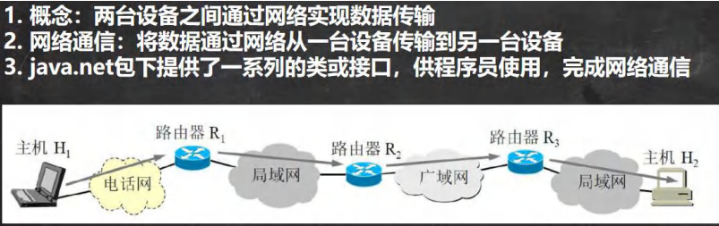

## 网络

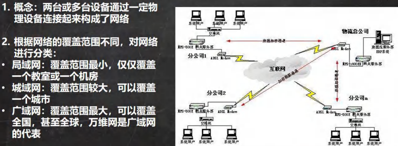

## ip 地址

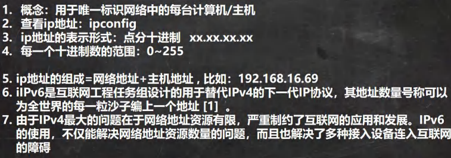

## ipv4 地址分类

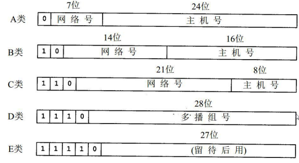

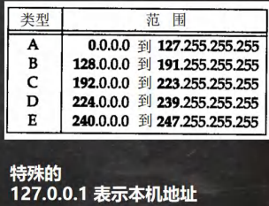

## 域名

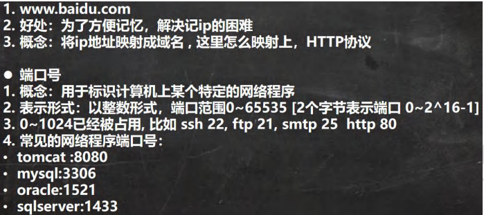

## 网络通信协议

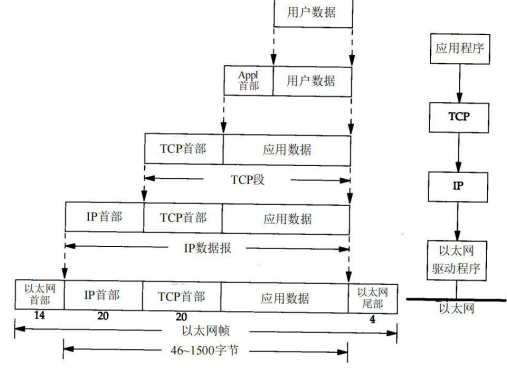

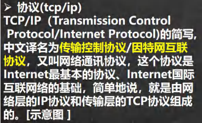

## TCP 和 UDP

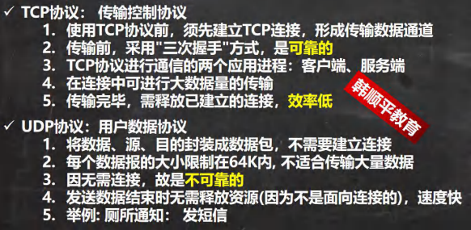

# InetAddress 类

## 相关方法

```apl
1.获取'本机'InetAddress对象getLocalHost()
2.根据指定 主机名/域名 获取 ip地址对象 getByName()
3.获取lnetAddress对象的主机名getHostName()
4.获取InetAddress对象的地址getHostAddress()
```

## 应用案例

```java
package com.Novice.api;

import java.net.InetAddress;
import java.net.UnknownHostException;

public class API_ {
    public static void main(String[] args) throws UnknownHostException {


        // 获取本机 InetAddress 对象 getLocalHost
        InetAddress localHost = InetAddress.getLocalHost();
        System.out.println("getLocalHost=" + localHost);// Inspiron-16Plus/192.168.16.1

        InetAddress[] host1 = InetAddress.getAllByName("Inspiron-16Plus");
        System.out.println("\ngetAllByName=" + host1.toString());//


        // 根据指定主机名/域名获取 ip 地址对象 getByName
        InetAddress host2 = InetAddress.getByName("www.baidu.com");
        System.out.println("\ngetByName=" + host2);

        InetAddress host3 = InetAddress.getByName("www.sdshui.club");
        System.out.println("\ngetByName=" + host3);


        // 获取 InetAddress 对象的主机名 getHostName
        String name = host3.getHostName();
        System.out.println("\nname=" + name);// 主机名/域名


        // 获取 InetAddress 对象的地址 getHostAddress
        String address = host3.getHostAddress();
        System.out.println("\naddress=" + address);// IP


        // 通过InetAddress对象获得主机名字/域名，在通过InetAddress对象的getByName获取新的对象
        InetAddress name1 = InetAddress.getByName(host3.getHostName());
        System.out.println("\nname1=" + name1);


    }
}
```

# Socket

## 基本介绍

```apl
1. 套接字(Socket)开发网络应用程序被广泛采用，以至于成为事实上的标准。
2. 通信的两端都要有Socket，是两台机器间通信的端点
3. 网络通信其实就是Socket间的通信。
4. Socket允许程序'把网络连接当成一个流'，数据在两个Socket间通过IO传输。
5. 一般主动发起通信的应用程序属'客户端',等待通信请求的为'服务端'
```

### 示意图:

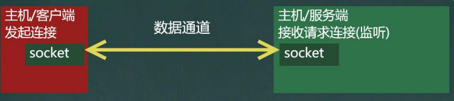

# TCP 网络通信编程

## 基本介绍

```apl
1.基于 客户端 服务端 的网络通信
2.底层使用的是TCP/IP协议
3.应用场景举例: 客户端发送数据，服务端接受并显示控制台
4.基于Socket的TCP编程
```

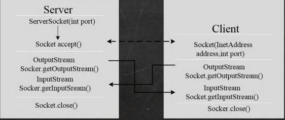

## 案例 1(使用字节流)

```apl
1.编写一个服务器端,和一个客户端
2.服务器端在9999端口监听
3.客户端连接到服务器端,发送"hello,server"，然后退出
4.服务器端接收到客户端发送的信息，输出，并退出
```

### Client

```java
package com.Novice.scoket;

import java.io.IOException;
import java.io.InputStream;
import java.io.OutputStream;
import java.net.InetAddress;
import java.net.Socket;

// 客户端
@SuppressWarnings({"all"})
public class SocketTCP_Client_01 {
    public static void main(String[] args) throws IOException {


        // 思路
        // 1.连接服务端(ip，端口)
        Socket socket = new Socket(InetAddress.getLocalHost(), 9999);
        System.out.println("客户端socket返回=" + socket.getClass());

        // 2.连接上后，生成Socket，通过// socket.getOutputStream()
        // 得到 和 socket 对象关联的输出流对象
        OutputStream outputStream = socket.getOutputStream();

        // 3.通过输出流，写入数据到数据通道
        outputStream.write("hello sever!".getBytes());
        

        // 4. 关闭流对象和 socket, 必须关闭
        outputStream.close();
        socket.close();

        System.out.println("客户端退出了。。。");


    }
}

```

### Sever

```java
package com.Novice.scoket;

import java.io.IOException;
import java.io.InputStream;
import java.net.ServerSocket;
import java.net.Socket;

// 服务端
public class SocketTCP_Server_01 {
    public static void main(String[] args) throws IOException {
        // 思路
        // 1.在本机的9999端口监听，等待连接
        // 细节:要求在本机没有其它服务在监听9999
        // 细节：这个 ServerSocket 可以通过 accept() 返回多个 Socket[多个客户端连接服务器的并发]
        ServerSocket serverSocket = new ServerSocket(9999);

        // 2.当没有客户端连接9999端口时，程序会 阻塞，等待连接
        // 如果有客户端连接，则会返回Socket对象，程序继续
        System.out.println("服务器在9999端口监听，等待连接。。。");
        Socket socket = serverSocket.accept();

        System.out.println("服务端socket=" + socket.getClass());


        // 3.通过socket.getInputStream()读取 客户端写入到数据通道的数据,显示
        InputStream inputStream = socket.getInputStream();// 使用的是字节输入流

        // 4.IO读取
        byte[] buf = new byte[1024];
        int len = 0;
        while ((len = inputStream.read(buf)) != -1) {
            System.out.println(new String(buf, 0, len));
        }

        // 5.关闭流和socket
        inputStream.close();// 关闭资源
        socket.close();
        serverSocket.close();


    }
}

```

## 案例 2(使用字节流)

```apl
1. 编写一个服务端,和一个客户端
2. 服务器端在9999端口监听
3. 客户端连接到服务端，发送"hello, server",
   并接收服务器端回发的"hello,client".再退出
4. 服务器端接收到客户端发送的信息，输出，并发送"hello, client",再退出
```

Client

```java
package com.Novice.scoket;

import java.io.IOException;
import java.io.InputStream;
import java.io.OutputStream;
import java.net.InetAddress;
import java.net.Socket;

//客户端
@SuppressWarnings({"all"})
public class SocketTCP_Client_02 {
    public static void main(String[] args) throws IOException {


        //思路
        //1.连接服务端(ip，端口)
        Socket socket = new Socket(InetAddress.getLocalHost(),9999);
        System.out.println("客户端socket返回="+socket.getClass());

        //2.连接上后，生成Socket，通过// socket.getOutputStream()
        OutputStream outputStream = socket.getOutputStream();

        //3.通过输出流，写入数据到数据通道
        outputStream.write("hello sever!".getBytes());
        //设置一个写入结束标记
        socket.shutdownOutput();

        //4.通过socket.getInputStream()读取 客户端写入到数据通道的数据,显示
        InputStream inputStream = socket.getInputStream();
        byte[] buf = new byte[1024];
        int len = 0;
        while ((len = inputStream.read(buf))!=-1){
            System.out.println(new String(buf,0,len));
        }


        //5.关闭流和socket
        outputStream.close();
        inputStream.close();
        socket.close();

        System.out.println("客户端退出了。。。");


    }
}
```

Sever

```java
package com.Novice.scoket;

import java.io.IOException;
import java.io.InputStream;
import java.io.OutputStream;
import java.net.ServerSocket;
import java.net.Socket;

// 服务端
// 网络编程一定是sever端先开始等待
@SuppressWarnings({"all"})
public class SocketTCP_Server_02 {
    public static void main(String[] args) throws IOException {
        // 思路
        // 1.在本机的9999端口监听，等待连接
        // 细节:要求在本机没有其它服务在监听9999
        // 细节：这个 ServerSocket 可以通过 accept() 返回多个 Socket[多个客户端连接服务器的并发]
        ServerSocket serverSocket = new ServerSocket(9999);

        // 2.当没有客户端连接9999端口时，程序会 阻塞，等待连接
        // 如果有客户端连接，则会返回Socket对象，程序继续
        System.out.println("服务器在9999端口监听，等待连接。。。");
        Socket socket = serverSocket.accept();

        System.out.println("服务端socket=" + socket.getClass());


        // 3.通过socket.getInputStream()读取 客户端写入到数据通道的数据,显示
        InputStream inputStream = socket.getInputStream();

        // IO流读取
        byte[] buf = new byte[1024];
        int len = 0;
        while ((len = inputStream.read(buf)) != -1) {
            System.out.println(new String(buf, 0, len));
        }


        // 5。获取socket相关联的输出流
        OutputStream outputStream = socket.getOutputStream();
        outputStream.write("helllo,client".getBytes());
        // 设置一个写入结束标记
        socket.shutdownOutput();

        // 6.关闭流和socket
        inputStream.close();
        outputStream.close();
        socket.close();
        serverSocket.close();


    }
}
```

## 案例 3(使用字符流)

```apl
1.编写一个服务端,和一个客户端
2.服务端在9999端口监听
3.客户端连接到服务端，发送"hello, server",并接收服务端回发的"hello,client"，再退出
4.服务端接收到客户端发送的信息，输出，并发送"hello, client"再退出
```

### Client

```java
package com.Novice.scoket;

import java.io.*;
import java.net.InetAddress;
import java.net.Socket;

//客户端 ---->使用字符流
@SuppressWarnings({"all"})
public class SocketTCP_Client_03 {
    public static void main(String[] args) throws IOException {


        //思路
        //1.连接服务端(ip，端口)
        Socket socket = new Socket(InetAddress.getLocalHost(),9999);
        System.out.println("客户端socket返回="+socket.getClass());

        //2.连接上后，生成Socket，通过// socket.getOutputStream()
        BufferedWriter bufferedWriter =
                new BufferedWriter(new OutputStreamWriter(socket.getOutputStream()));
        bufferedWriter.write("字符流写-hello sever");
        bufferedWriter.newLine();
        bufferedWriter.flush();//一定要手动刷新，不然数据无法写入数据通道


        //4.通过socket.getInputStream()读取 客户端写入到数据通道的数据,显示
        InputStream inputStream = socket.getInputStream();
        BufferedReader bufferedReader = 
            new BufferedReader(new InputStreamReader(inputStream));
        String s = bufferedReader.readLine();
        System.out.println(s);


        //5.关闭流和socket
        bufferedReader.close();
        bufferedWriter.close();
        socket.close();

        System.out.println("客户端退出了。。。");


    }
}
```

### Sever

```java
package com.Novice.scoket;

import java.io.*;
import java.net.ServerSocket;
import java.net.Socket;

// 服务端 ----> 使用字符流
//网络编程一定是sever端先开始等待
@SuppressWarnings({"all"})
public class SocketTCP_Server_03 {
    public static void main(String[] args) throws IOException {
        // 思路
        // 1.在本机的9999端口监听，等待连接
        // 细节:要求在本机没有其它服务在监听9999
        ServerSocket serverSocket = new ServerSocket(9999);

        // 2.当没有客户端连接9999端口时，程序会 阻塞，等待连接
        // 如果有客户端连接，则会返回Socket对象，程序继续
        System.out.println("服务器在9999端口监听，等待连接。。。");
        Socket socket = serverSocket.accept();

        System.out.println("服务端socket=" + socket.getClass());


        // 3.通过socket.getInputStream()读取 客户端写入到数据通道的数据,显示
        InputStream inputStream = socket.getInputStream();

        // IO流读取，字符流
        BufferedReader bufferedReader = new BufferedReader(new InputStreamReader(inputStream));
        String s = bufferedReader.readLine();
        System.out.println(s);

        // 5。获取socket相关联的输出流
        OutputStream outputStream = socket.getOutputStream();
        BufferedWriter bufferedWriter = new BufferedWriter(new OutputStreamWriter(outputStream));
        bufferedWriter.write("字符流-hello client");
        bufferedWriter.newLine();// 插入一个换行符，表示回复内容的结束
        bufferedWriter.flush();//注意需要手动的 flush

        // 6.关闭流和socket
        bufferedReader.close();//关闭外层流
        bufferedWriter.close();
        socket.close();
        serverSocket.close();


    }
}
```

## 应用案例 4

```apl
1. 编写一个服务端,和一个客户端2.服务器端在8888端口监听
3. 客户端连接到服务端,发送一张图片e:llqie.png
4. 服务器端接收到客户端发送的图片，保存到src下,发送"收到图片”再退出
5. 客户端接收到服务端发送的“收到图片”，再退出
6.该程序要求使用StreamUtils.java,我们直接使用
```

### StreamUtils

```java
package com.Novice.upload;

import java.io.*;

//输入流(地址)->程序(临时数组)->输出流(内存)->flush()->磁盘
class StreamUtils {

    //此类用于演示关于流的读写方法
    public static byte[] streamToByteArray(InputStream is) throws IOException {
        ByteArrayOutputStream baos = new ByteArrayOutputStream();//创建输出流对象

        byte[] arr = new byte[1024];
        int temp = 0;
        while ((temp = is.read(arr))!=-1){//read是读入 //此处循环读取
            baos.write(arr,0,temp);//write是写出   //此处将读入到临时数组的数据写到baos->内存中
        }
        byte[] arr1 = baos.toByteArray();

        // System.out.println(arr.length);
        // System.out.println(arr1.length);
        // System.out.println(arr.equals(arr1));

        baos.close();
        return arr1;

    }


    //功能：将 InputStream 转换成 String
    public static String streamToString(InputStream is) throws IOException {
        BufferedReader br = new BufferedReader(new InputStreamReader(is));//将字节流转换成了字符流
        StringBuilder stringBuilder = new StringBuilder();

        String temp = "";
        while ((temp = br.readLine()) != null) {
            stringBuilder.append(temp);
        }
        String a = stringBuilder.toString();
        return a;
    }


}
```

### Client

```java
package com.Novice.upload;

import java.io.*;
import java.net.InetAddress;
import java.net.Socket;
import java.net.UnknownHostException;

// 文件上传的客户端
public class TCPFileUpload_Client {
    public static void main(String[] args) throws IOException {

        Socket socket = new Socket(InetAddress.getLocalHost(), 8888);

        File filePath = new File("D:\\a\\a.png");
        BufferedInputStream bis = new BufferedInputStream(new FileInputStream(filePath));
        byte[] arr = StreamUtils.streamToByteArray(bis);//调用静态方法StreamUtils.streamToByteArray

        BufferedOutputStream bos = new BufferedOutputStream(socket.getOutputStream());//输出
        bos.write(arr);
        socket.shutdownOutput();

        BufferedReader br = new BufferedReader(new InputStreamReader(socket.getInputStream()));//接收
        InputStream inputStream = socket.getInputStream();
        String temp = StreamUtils.streamToString(inputStream);//调用静态方法StreamUtils.streamToString
        System.out.println(temp);


        br.close();
        bos.close();
        socket.close();


    }
}
```

### Sever

```java
package com.Novice.upload;

import java.io.*;
import java.net.ServerSocket;
import java.net.Socket;

//文件上传的服务端
public class TCPFileUpload_Server {
    public static void main(String[] args) throws IOException {


        ServerSocket serverSocket = new ServerSocket(8888);//监听端口

        System.out.println("等待连接。。。。。。");
        Socket socket = serverSocket.accept();

        InputStream is = socket.getInputStream();//接收客户端信息
        byte[] bytes = StreamUtils.streamToByteArray(is);//调用静态方法

        File filePath = new File("src\\b.png");
        BufferedOutputStream bos = new BufferedOutputStream(new FileOutputStream(filePath));
        //将从客户端接收到的信息写入磁盘
        bos.write(bytes);

        BufferedWriter bw = new BufferedWriter(new OutputStreamWriter(socket.getOutputStream()));
        //向客户端写出信息
        bw.write("成功接收图片");
        bw.flush();//把内容刷新到通道
        socket.shutdownOutput();//设置写入结束标记,不然再Cilent读取的时候不知到在何时结束
        //任何先前写入的数据都将按照 TCP 的正常连接终止顺序发送

        // socket.shutdownOutput();//为什么不能家伙加上这个？
        // 因为需要提前flush(),如果没有flush(),后面bw.close()时依然会自动刷新。
        // 但是加入了socket.shutdownOutput();之后就只会关闭而不会刷新。
        // 之后再使用bw.close(),就会因为通道关闭？而报错。


        bw.close();
        bos.close();
        is.close();
        socket.close();
        serverSocket.close();


    }

}
```


# netstat 指令

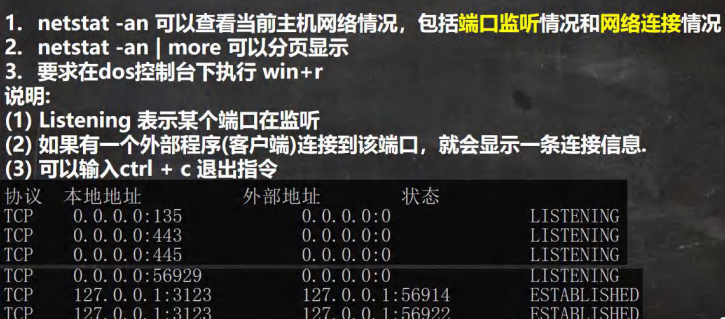

netstat -anp

显示哪两个客户端连接在了一起

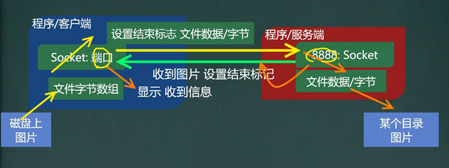

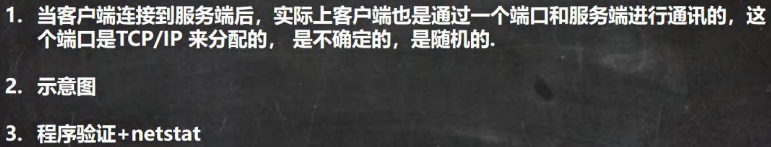


# UDP 网络通信编程

## 基本介绍

```apl
1. 类 DatagramSocket 和 DatagramPacket[数据包/数据报]实现了基于UDP协议网络程序。
2. UDP数据报通过数据报套接字DatagramSocket发送和接收，系统不保证UDP数据报一定能够安全送    到目的地，也不能确定什么时候可以抵达。
3. DatagramPacket 对象封装了UDP数据报，在数据报中包含了发送端的IP地址和
   端口号以及接收端的IP地址和端口号。
4. UDP协议中每个'数据报'都给出了完整的地址信息，因此'无须建立发送方和接收方'的'连接'
```

## 基本流程

```apl
1.核心的两个 类/对象 'DatagramSocket'与'DatagramPacket'
2.建立发送端,接收端(没有服务端和客户端概念)
3.发送数据前,建立数据包/报DatagramPacket对象
4.调用DatagramSocket的发送、接收方法
5.关闭DataaramSocket
```

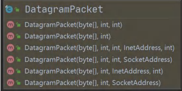

## 应用案例

```apl
1.编写一个接收端A,和一个发送端B
2.接收端A在9999端口等待接收数据(receive)
3.发送端B向接收端A发送数据“hello，明天吃火锅~”
4.接收端A接收到发送端B发送的数据，回复"好的,明天见",再退出5.发送端接收回复的数据，再退出
```

```java
package com.Novice.udp;

import java.io.IOException;
import java.net.DatagramPacket;
import java.net.DatagramSocket;
import java.net.InetAddress;
import java.net.SocketException;

// 接收端A
// 发送端与接收端是相对而言的
public class UDPReceiverA {
    public static void main(String[] args) throws IOException {

        //1. 创建一个 DatagramSocket 对象，准备在 9999 接收数据
        DatagramSocket datagramSocket = new DatagramSocket(9999);

        //2. 构建一个 DatagramPacket 对象，准备接收数据
        // 在前面讲解 UDP 协议时，一个数据包最大 64k
        byte[] arr = new byte[1024];
        DatagramPacket Packet = new DatagramPacket(arr, arr.length);

        //3. 调用 接收方法, 将通过网络传输的 DatagramPacket 对象
        // 填充到 packet 对象
        // 老师提示: 当有数据包发送到 本机的 9999 端口时，就会接收到数据
        // 如果没有数据包发送到 本机的 9999 端口, 就会阻塞等待.
        System.out.println("等待接收信息中。。。");
        datagramSocket.receive(Packet);

        //4. 可以把 packet 进行拆包，取出数据，并显示.
        int len = Packet.getLength();//实际接收到的数据字节长度
        byte[] data = Packet.getData();//接收到数据

        String a = new String(data, 0, len);
        System.out.println("收到信息:"+a);


        //将需要发送的数据，封装到 DatagramPacket 对象
        //说明: 封装的 DatagramPacket 对象 data 内容字节数组 , data.length , 主机(IP) , 端口
        byte[] arr1 = "好呀".getBytes();
        DatagramPacket datagramPacket1 =
                new DatagramPacket(arr1, arr1.length, InetAddress.getByName("192.168.1.105"), 9998);
        datagramSocket.send(datagramPacket1);//发送


        System.out.println("回复信息完毕");
        datagramSocket.close();//5. 关闭资源


    }
}
```

```java
package com.Novice.udp;

import java.io.IOException;
import java.net.*;

// 发送端B
// 发送端与接收端是相对而言的
public class UDPSenderB {
    public static void main(String[] args) throws IOException {

        DatagramSocket datagramSocket = new DatagramSocket(9998);

        byte[] arr = "明天一起去吃饭呀".getBytes();
        DatagramPacket datagramPacket =
                new DatagramPacket(arr, arr.length, InetAddress.getByName("192.168.1.105"), 9999);


        datagramSocket.send(datagramPacket);
        System.out.println("数据发送完毕");

        //接收数据
        byte[] arr1 = new byte[1024];
        DatagramPacket datagramPacket1 = new DatagramPacket(arr1, arr1.length);
        System.out.println("等带接收信息中。。。");
        datagramSocket.receive(datagramPacket1);

        //拆包
        int len = datagramPacket1.getLength();
        byte[] data = datagramPacket1.getData();
        String s = new String(data, 0, len);
        System.out.println("收到信息:"+s);


        datagramSocket.close();


    }
}
```

# 本章作业

## 1.编程题

```apl
(1)使用字符流的方式，编写一个客户端程序和服务器端程序，
(2)客户端发送"name".服务器端接收到后，返回"我是nova ", nova是你自己的名字.
(3)客户端发送"hobby",服务器端接收到后，返回“编弓java程序”"
(4)不是这两个问题,回复"你说啥呢”
```

### Cilent

```java
package com.Novice.homework;

import java.io.*;
import java.net.InetAddress;
import java.net.Socket;
import java.net.UnknownHostException;

public class homeWork01Client {
    public static void main(String[] args) throws IOException {

        Socket socket = new Socket(InetAddress.getLocalHost(),8888);

        BufferedReader br =
                new BufferedReader(new InputStreamReader(System.in));
        String a = br.readLine();//一定要有读取动作才可以实现输入

        BufferedWriter bw =
                new BufferedWriter(new OutputStreamWriter(socket.getOutputStream()));

        bw.write(a);//字符输入缓冲流貌似可以直接读取
        bw.newLine();//告诉对面读取一行
        bw.flush();

        bw.close();
        br.close();
        socket.close();


    }
}
```

### Severe

```java
package com.Novice.homework;

import java.io.*;
import java.net.ServerSocket;
import java.net.Socket;

public class homeWork01Sever {
    public static void main(String[] args) throws IOException {

        ServerSocket serverSocket = new ServerSocket(8888);

        Socket socket = serverSocket.accept();

        BufferedReader bf =
                new BufferedReader(new InputStreamReader(socket.getInputStream()));

        StringBuilder stringBuilder = new StringBuilder();
        String temp = "";
        while ((temp=bf.readLine())!=null){
            stringBuilder.append(temp);
        }

        String a = stringBuilder.toString();
        if ("name".equals(a)){
            System.out.println("tom");
        } else if ("hobby".equals(a)) {
            System.out.println("abc");
        }else {
            System.out.println("你说什么？");
        }


    }
}
```


## 2.编程题

```apl
(1)编写一个接收端A,和一个发送端B，使用UDP协议完成
(2)接收端在8888端口等待接收数据(receive)
(3)发送端向接收端发送数据“四大名著是哪些”
(4)接收端接收到发送端发送的问题后，返回"四大名著是<<红楼梦>>.…."，否则返回what?
(5)接收端和发送端程序退出
```

### ReciverA

```java
package com.Novice.homework;

import java.io.IOException;
import java.net.DatagramPacket;
import java.net.DatagramSocket;
import java.net.SocketException;

public class homeWork02ReciverA {
    public static void main(String[] args) throws IOException {

        DatagramSocket datagramSocket = new DatagramSocket(8888);

        byte[] arr = new byte[1024];
        DatagramPacket datagramPacket = new DatagramPacket(arr,arr.length);

        datagramSocket.receive(datagramPacket);

        int length = datagramPacket.getLength();
        byte[] data = datagramPacket.getData();
        String s = new String(data, 0, length);
        //字节数组转化成字符串
        // System.out.println(s);
        if (s.equals("四大名著是哪些？")){
            System.out.println("四大名著是这些。。。。。。");
        }else {
            System.out.println("what?");
        }

        datagramSocket.close();

    }
}
```

### SenderB

```java
package com.Novice.homework;

import java.io.BufferedReader;
import java.io.IOException;
import java.io.InputStreamReader;
import java.net.DatagramPacket;
import java.net.DatagramSocket;
import java.net.InetAddress;
import java.net.SocketException;

public class homeWork02SenderB {
    public static void main(String[] args) throws IOException {

        DatagramSocket datagramSocket = new DatagramSocket(8889);

        byte[] arr = new BufferedReader(new InputStreamReader(System.in)).readLine().getBytes();
        //String s = new String(arr, "UTF-8");//字节数组转化成字符串
        // System.out.println(s);
        DatagramPacket datagramPacket =
                new DatagramPacket(arr, arr.length, InetAddress.getByName("192.168.1.105"), 8888);

        datagramSocket.send(datagramPacket);

        datagramSocket.close();


    }
}
```


## 3.编程题

```apl
(1) 编写客户端程序和服务器端程序
(2) 客户端可以输入一个音乐文件名，比如高山流水,服务端收到音乐名后，
    可以给客户端返回这个音乐文件，如果服务器没有这个文件，返回一个默认的音乐即可.
(3) 客户端收到文件后,保存到本地e:ll
(4) 提示:该程序可以使用 StreamUtils.java
```

### Client 

```java
package com.Novice.homework;

import java.io.*;
import java.net.InetAddress;
import java.net.Socket;
import java.net.UnknownHostException;

public class homeWork03Client {
    public static void main(String[] args) throws IOException {

        Socket socket = new Socket(InetAddress.getLocalHost(),8888);

        BufferedReader br =//从键盘读取要下载的音乐名称
                new BufferedReader(new InputStreamReader(System.in));
        String s = br.readLine();

        BufferedWriter bw =//将音乐名称传递给服务器
                new BufferedWriter(new OutputStreamWriter(socket.getOutputStream()));
        bw.write(s);
        bw.newLine();
        bw.flush();

        BufferedReader br1 = //接收音乐的下载信息
                new BufferedReader(new InputStreamReader(socket.getInputStream()));
        String string = br1.readLine().toString();
        System.out.println(string);

        br1.close();
        bw.close();
        br.close();
        socket.close();
    }
}
```

### Sever 

```java
package com.Novice.homework;

import java.io.*;
import java.net.ServerSocket;
import java.net.Socket;

public class homeWork03Sever {
    public static void main(String[] args) throws IOException {

        File file = new File("D:\\a\\a.mp3");
        File file1 = new File("D:\\a\\b.mp3");
        File file3 = new File("D:\\a\\e.mp3");
        BufferedInputStream bis = null;//读取磁盘中的音乐


        ServerSocket serverSocket = new ServerSocket(8888);
        Socket socket = serverSocket.accept();

        BufferedReader br =//读取客户端传递的信息
                new BufferedReader(new InputStreamReader(socket.getInputStream()));
        String s = br.readLine().toString();

        BufferedWriter bw =//向客户端传递下载信息
                new BufferedWriter(new OutputStreamWriter(socket.getOutputStream()));


        if (s.equals("a")){
            bis = new BufferedInputStream(new FileInputStream(file));
            bw.write("找到a音乐，已下载到D盘。");
        }else {
            bis = new BufferedInputStream(new FileInputStream(file1));
            bw.write("未找到"+s+"音乐，已将默认音乐下载到D盘。");
        }


        BufferedOutputStream bos = //向磁盘中写入音乐
                new BufferedOutputStream(new FileOutputStream(file3));

        int temp = 0;
        while ((temp=bis.read())!=-1){//数据已经自动装入内部数组，然后利用temp一个字节一个字节的读取！！！
            bos.write(temp);
        }
        bos.flush();


        bos.close();
        bw.close();
        br.close();
        bis.close();
        socket.close();


    }
}
```

