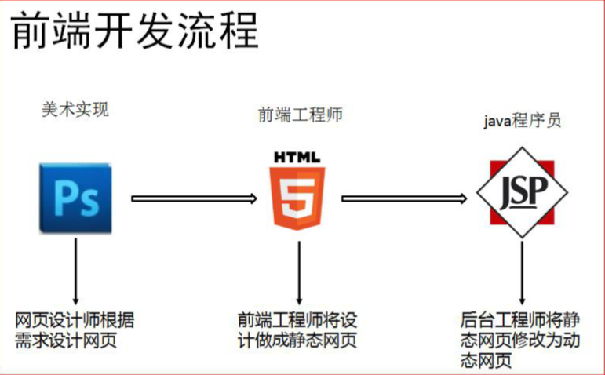
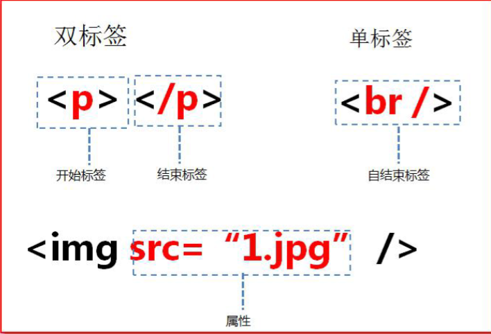
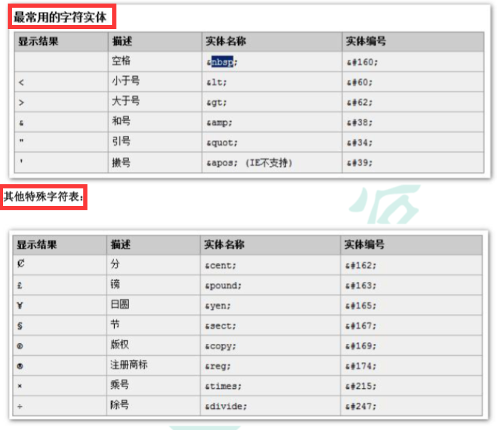
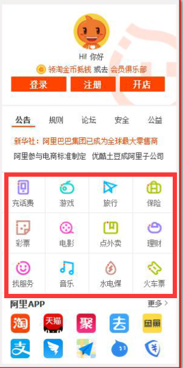
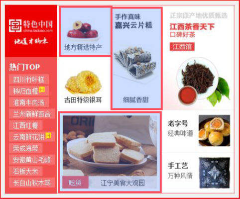
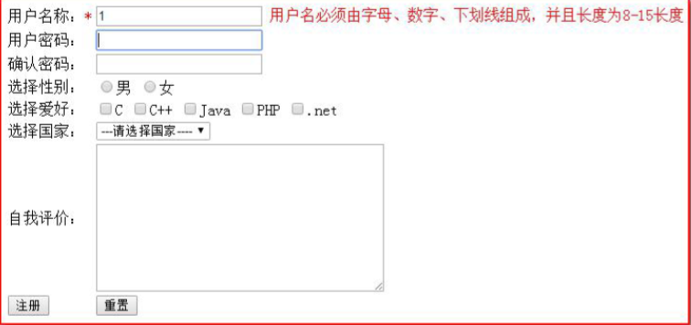

# 引入HTML

## B/S 软件的结构

## 前端的开发流程



## 网页的组成部分

```apl
页面由三部分内容组成:  内容（结构）、表现、行为。 
1. 内容（结构）:
   我们在页面中可以看到的数据,称之为内容。一般内容 我们使用'html'技术来展示。 
2. 表现:
   是这些内容在页面上的展示形式。比如说。布局，颜色，大小等等。一般使用'CSS'技术实现.
3. 行为:
   指的是页面中元素与输入设备交互的响应。一般使用 javascript 技术实现
```

## HTML 简介

```apl
Hyper Text Markup Language （超文本标记语言） 简写：HTML HTML 
通过标签来标记要显示的网页中的各个部分。

网页文件本身是一种文本文件， 通过在文本文件中添加标记符，可以告诉浏览器如何显示其中的内容（如：文字如何处理，画面如何安排，图片如何显示等）
```

## 创建 HTML 文件

```apl
1、创建一个 web 工程（静态的 web 工程）
2、在工程下创建 html 页面
3、选择浏览器执行页面
```

### 第一个 html 示例：

```html
<!DOCTYPE html>
<!--约束，声明-->
<html lang="en">
<!--html标签表示html的开始 lang="zc_CN"表示中文-->

    
    
    
<!--html标签中一般分为两部分，分别是：head 和 body-->

<!--第一部分--头信息-->
<head>
<!--头部(开始)标签，表示头部信息一般包含三部分内容：title标签，css样式，js代码-->
    <meta charset="UTF-8">
    <!--当前页面使用utf-8-->
    <title>标题</title>
    <!--表示标题，浏览器左上角-->
</head>
<!--结束标签-->

    
    

<!--第二部分--页面主题内容-->
    
<body onclick="alert('abc')">
<!--body标签 表示页面整体显示的内容-->
    hello<br/>不错
    <hr/>
    <!--分割线-->
    呀
    <button onclick="alert('cde')">按钮</button>
</body>

</html>
<!--表示html标签的结束-->


<!--
    1. bgcolor是背景颜色属性 属于基本属性 可以用来修改一些简单的样式

    2. onclick表示单机或者点击事件 属于事件属性
        alert()是javaScript语言提供的一个警告框函数，
        它可以接收任意参数，参数就是警告框的信息
-->
```

# HTML 文件书写规范

## HTML结构

```html
<html>	表示整个 html 页面的开始 
    
    <head> 	头信息 
        <title>标题</title>
    </head> 
    
    <body>	body 是页面的主体内容
		页面主体内容 
    </body> 
    
</html> 表示整个 html 页面的结束
```

```apl
Html 的代码注释
<!-- 这是 html 注释，可以在页面右键查看源代码中看到 -->
```

## HTML 标签介绍

```apl
1.标签格式分为，'单标签' 和 '双标签'。 
    i.  单标签格式： <标签名 />		br 换行 	hr水平线
    ii. 双标签格式:  <标签名> ...封装的数据...</标签名>  
    
2.标签名大小写不敏感。 

3.标签拥有自己的属性。 
    i.  基本属性： bgcolor="red"		可以修改简单的样式效果
    ii. 事件属性： onclick="alert('你好！');"	可以直接设置事件响应后的代码。
```




## 标签的语法

```html
<!DOCTYPE html>
<html>
    
<head>
<meta charset="UTF-8">
<title>0-标签语法.html</title>
</head>
    
<body>

	<!-- ①标签不能交叉嵌套 -->
		正确：<div><span>早安，尚硅谷</span></div>
		错误：<div><span>早安，尚硅谷</div></span>
    		 <!--但是浏览器会帮助辅助解析-->
		<hr />

	<!-- ②标签必须正确关闭 ，即要有结束标签-->
		<!-- i.有文本内容的标签：双标签 -->
		正确：<div>早安，尚硅谷</div>
		错误：<div>早安，尚硅谷
		<hr />

		<!-- ii.没有文本内容的标签：单标签 -->
		正确：<br /> 1
		错误：<br > 2
		<hr />
	
	<!-- ③属性必须有值，属性值必须加引号 -->
		正确：<font color="blue">早安，尚硅谷</font><hr/>
		错误：<font color=blue>早安，尚硅谷</font><hr/>
		错误：<font color=>早安，尚硅谷</font><hr/>
    		  <!--没有输入颜色，浏览器默认按照黑色-->
		<hr />
		
	<!-- ④注释不能嵌套 -->
		正确：<!-- 注释内容 --> <br/>
		错误：<!--注释内容<!--注释内容-->--> <!--此处无法修复-->
		<hr />
</body>
</html>
```

```apl
注意事项： 1.html 代码不是很严谨。有时候标签不闭合，也不会报错。
```

# 常用标签介绍 

**文档：w3cschool.CHM**


## font 字体标签

```apl
需求 1：在网页上显示 我是字体标签 ，并修改字体为 宋体，颜色为红色。
```

```html
<!DOCTYPE html>
<html>
<head>
<meta charset="UTF-8">
<title>1.font标签.html</title>
</head>
    
<body>
	
	<!-- 字体标签 -->
	<!--在网页上显示 我是字体标签 ，并修改字体为 宋体，颜色为红色-->

	<!--
		font标签是字体标签,它可以用来修改文本的字体,颜色,大小(尺寸)
		color属性修改颜色
		face属性修改字体
		size属性修改文本大小
		-->

	<font color="red" face="宋体" size="1">我是字体标签</font><br/>
	<font color="red" face="宋体" size="7">我是字体标签</font>


</body>
</html>
```

## 特殊字符

```apl
需求 1：把 <br> 换行标签 变成文本 转换成字符显示在页面上
```



```html
<!DOCTYPE html>
<html>
<head>
<meta charset="UTF-8">
<title>2.特殊字符.html</title>
</head>
    
<body>

	<!-- 特殊字符
		需求1：把<br> 换行标签变成文本转换成字符显示在页面上
		常用的特殊字符:
		<       	&lt;
		>       	&gt;
		空格      	&nbsp;
		通常情况下，HTML会将输入的连续空格只会保留一个，如果使用&nbsp;，就可以在文档中增加空格。

	-->
    我是&lt;br&gt;标签<br/> 国哥好
    &nbsp;&nbsp;&nbsp;&nbsp;&nbsp;&nbsp;&nbsp;&nbsp;&nbsp;&nbsp;&nbsp;&nbsp;&nbsp;&nbsp;&nbsp;&nbsp;&nbsp;&nbsp;
    &nbsp;&nbsp;&nbsp;&nbsp;&nbsp;&nbsp;&nbsp;&nbsp;&nbsp;帅啊!

</body>
    
</html>
```

## 标题标签

```apl
标题标签是 h1 到 h6
```

```html
<!DOCTYPE html>
<html>
<head>
<meta charset="UTF-8">
<title>3.标题标签.html</title>
</head>
    
<body>
	
	<!-- 标题标签
	h1 - h6 都是标题标签
		h1 最大
		h6 最小

	align 属性 是对齐属性
		left 左对齐(默认)
		center 剧中
		right 右对齐
	-->
	<h1 align="center">标题1</h1>
	<h2 align="right">标题2</h2>
	<h3>标题3</h3>
	<h4>标题4</h4>
	<h5>标题5</h5>
	<h6>标题6</h6>
	<!--没有标题7，只会显示文字-->
	<h7>标题7</h7>

	
</body>
</html>
```

## 超链接(重点)

```apl
在网页中所有点击之后可以跳转的内容都是超连接
```

```apl
需求 1：普通的 超连接
```

```html
<!DOCTYPE html>
<html>
<head>
<meta charset="UTF-8">
<title>4.超链接.html</title>
</head>
<body>

	<!-- 超链接
	a标签是超链接
		href属性设置连接的地址

		target属性设置哪个目标进行跳转
			_self 表示当前页面(默认值)
			_blank 表示打开新页面来进行跳转

	-->
	<a href="http://localhost:8080">本地</a><br/>
	<a href="http://www.baidu.com">百度</a><br/>
	<a href="http://www.baidu.com" target="_blank">百度</a><br/>

</body>
</html>
```

## 列表标签

```apl
无序列表 、 有序列表  定义列表
```

```apl
需求 1：使用无序，列表方式，把东北 F4，赵四，刘能，小沈阳，宋小宝，展示出来
```

```html
<!DOCTYPE html>
<html lang="en">
<head>
    <meta charset="UTF-8">
    <title>Title</title>
</head>
<body>
<!--
需求 1：使用无序，列表方式，
      把东北 F4，赵四，刘能，小沈阳，宋小宝，展示出来
-->

<!--
  ul 是无序列表
    type属性可以修改列表项前面的符号
    li 是列表项
-->
  <ul type="none">  <!--无序列表-->
      <li>ul无序列表</li>
      <li>1.赵四</li>
      <li>2.刘能</li>
      <li>3.小沈阳</li>
      <li>4.宋小宝</li>
  </ul>


  <ol>  <!--有序列表-->
      <li>ol有列表</li>
      <li>1.赵四</li>
      <li>2.刘能</li>
      <li>3.小沈阳</li>
      <li>4.宋小宝</li>
  </ol>


</body>
</html>
```

## img 标签

```apl
img 标签可以在 html 页面上显示图片。 
```

```apl
需求 1：使用 img 标签显示一张美女的照片。并修改宽高，和边框属性
```

```HTML
<!DOCTYPE html>
<html>
<head>
<meta charset="UTF-8">
<title>5.img标签.html</title>
</head>
    
<body>
<!--需求 1: 使用 img 标签显示一张美女的照片。
        2: 并修改宽高，和边框属性

     1. img标签是图片标签,用来显示图片
            src属性可以设置图片的路径
            width属性设置图片的宽度
            height属性设置图片的高度
            border属性设置图片边框大小
            alt属性设置当指定路径找不到图片时,用来代替显示的文本内容

     2. 在JavaSE中路径也分为相对路径和绝对路径.
            相对路径:
                从工程名开始算
            绝对路径:
                盘符:/目录/文件名

     3. 在web中路径分为相对路径和绝对路径两种

            相对路径: .表示当前文件所在的目录
                    .. 表示当前文件所在的上一级目录
                    文件名 表示当前文件所在目录的文件,相当于./文件名  简化后 ./省略

            绝对路径:
                正确格式是:
                    http://ip:port/工程名/资源路径
                错误格式是:
                    盘符:/目录/文件名(javaSE中的写法)
        -->

    <!--border 中的 1 表示一个像素宽度的边框-->
    
    
    


</body>
</html>
```

## 表格标签(重点)



```apl
需求 1：做一个 带表头的 ，三行，三列的表格，并显示边框 
需求 2：修改表格的宽度，高度，表格的对齐方式，单元格间距。
```

```html
<!DOCTYPE html PUBLIC "-//W3C//DTD HTML 4.01 Transitional//EN" "http://www.w3.org/TR/html4/loose.dtd">
<html>
<head>
    <meta http-equiv="Content-Type" content="text/html; charset=UTF-8">
    <title>表格标签</title>
</head>
<body>
<!--
需求 1：做一个 带表头的 ，三行，三列的表格，并显示边框
需求 2：修改表格的宽度，高度，表格的对齐方式，单元格间距。
1. table 标签是表格标签
        border 设置表格标签
        width 设置表格宽度
        height 设置表格高度
        align 设置'表格'相对于'页面'的对齐方式
        cellspacing 设置单元格间距(直线与直线间的距离)

2. tr 是行标签
3. th 是表头标签
        td 是单元格标签
        align 设置单元格文本对齐方式
        b 是加粗标签
-->

<table align="center" border="1" width="300" height = "300" cellspacing="10"><!--表格--><!--三行三列-->
    <tr><!--第一行-->
        <td align="center"><b>1.1</b></td><!--单元格-->
        <th>1.2</th><!--与上面那一行表示的标签效果相同-->
        <th>1.3</th>
    </tr>

    <tr><!--第二行-->
        <td>2.1</td><!--单元格-->
        <td>2.2</td>
        <td>2.3</td>
    </tr>

    <tr><!--第三行-->
        <td>3.1</td><!--单元格-->
        <td>3.2</td>
        <td>3.3</td>
    </tr>
</table>


</body>
</html>
```

## 跨行跨列表格(重点)



```apl
需求 1： 新建一个五行，五列的表格，
			第一行，第一列的单元格要跨两列，
			第二行第一列的单元格跨两行，
			第四行第四列的单元格跨两行两列。

			colspan 属性设置跨列
			rowspan 属性设置跨行
```

```html
<!DOCTYPE html PUBLIC "-//W3C//DTD HTML 4.01 Transitional//EN" "http://www.w3.org/TR/html4/loose.dtd">
<html>
	<head>
		<meta http-equiv="Content-Type" content="text/html; charset=UTF-8">
		<title>7.表格的跨行跨列</title>
	</head>
	<body>

	<!--
	需求 1： 新建一个五行，五列的表格，
			第一行，第一列的单元格要跨两列，
			第二行第一列的单元格跨两行，
			第四行第四列的单元格跨两行两列。

			colspan 属性设置跨列
			rowspan 属性设置跨行
-->

	<table align="center" border="1" width="200" height="200">
		<tr>
			<th colspan="2">1</th>
			<!--<th>1</th>--> <!--前面的单元格多占了，后面的单元格就要删除-->
			<th>1</th>
			<th>1</th>
			<th>1</th>
		</tr>

		<tr>
			<th rowspan="2">2</th>
			<th>2</th>
			<th>2</th>
			<th>2</th>
			<th>2</th>
		</tr>

		<tr>
			<!--<th>3</th>-->
			<th>3</th>
			<th>3</th>
			<th>3</th>
			<th>3</th>
		</tr>

		<tr>

			<th>4</th>
			<th>4</th>
			<th>4</th>
			<th colspan="2" rowspan="2">4</th>
			<!--<th>4</th>-->

		</tr>

		<tr>


			<th>5</th>
			<th>5</th>
			<th>5</th>
			<!--<th>5</th>-->
			<!--<th>5</th>-->

		</tr>


	</table>
		

		
	</body>
</html>
```

##  iframe 框架标签 (内嵌窗口)

```apl
ifarme 标签它可以在一个 html 页面上,打开一个小窗口,去加载一个单独的页面.
```

```apl
ifarme 标签可以在页面上开辟一个小区域显示一个单独的页面
    ifarme 和 a 标签组合使用的步骤:
        1 在 iframe 标签中使用 name 属性定义一个名称
        2 在 a 标签的 target 属性上设置 iframe 的 name 的属性值
```


```html
<!DOCTYPE html>
<html>
<head>
    <meta charset="UTF-8">
    <title>8.iframe标签.html</title>
</head>
    
<body>
<!--
ifarme 标签可以在页面上开辟一个小区域显示一个单独的页面
    ifarme 和 a 标签组合使用的步骤:
        1 在 iframe 标签中使用 name 属性定义一个名称
        2 将 a 标签上的 target 属性值 设置成 iframe 的 name 属性值
-->

我是一个单独的完整页面
<iframe src="3.标题标签.html" width="500" height="400" name="abc"></iframe><br/>
<!--<iframe src="../imgs/1.jpg"></iframe>-->

<ul>
    <li><a href="0-标签语法.html" target="abc">0-标签语法.html</a></li>
    <li><a href="1.font标签.html" target="abc">1-font标签.html</a></li>
    <li><a href="2.特殊字符.html" target="abc">2-特殊字符.html</a></li>
    <li><a href="3.标题标签.html" target="abc">3.标题标签.html</a></li>
</ul>
    
</body>
</html>
```

## 表单标签(重点)

```apl
什么是表单? 
表单就是 html 页面中,用来收集用户信息的所有元素集合.然后把这些信息发送给服务器.
```



```apl
需求
    创建一个个人信息注册的表单界面。
      包含用户名，密码，确认密码。性别（单选），兴趣爱好（多选），国籍（下拉列表）。
      隐藏域，自我评价（多行文本域）。
      重置，提交。
      
    表单格式化: 将表单加入到table里面
```


```html
<!DOCTYPE html>
<html lang="en">
<head>
    <meta charset="UTF-8">
    <title>Title</title>
</head>
<body>
<!--
需求
    创建一个个人信息注册的表单界面。
      包含用户名，密码，确认密码。性别（单选），兴趣爱好（多选），国籍（下拉列表）。
      隐藏域，自我评价（多行文本域）。
      重置，提交。
 -->
<!--
1. form
form 标签就是表单

    1. input
        input type=text 是单行文本输入框    value属性 设置默认显示内容
        input type=password 是密码输入框  value属性 设置默认显示内容
        input type=radio 是单选框    name 属性可以对其进行分组    checked="checked"表示默认选中
        input type=checkbox 是复选框    checked="checked"表示默认选中 checked="checked"表示默认选中
        input type=reset 是重置按钮  value 属性修改按钮上的文本
        input type=submit 是提交按钮 value 属性修改按钮上的文本
        input type=button 是按钮   value 属性修改按钮上的文本

        input type=file 是文件上传域
        input type=hidden 是隐藏域 当我们要发送某些信息，而这些信息，不需要用户参与，就可以使用隐藏域（提交的
        时候同样会发送给服务器）(给程序使用的)

    2. select
        select 标签是下拉列表框
            option 标签是下拉列表框中的选项
            selected="selected"设置默认选中

    3. textarea
        textarea 表示多行文本输入框 （起始标签和结束标签中的内容是默认值）
            rows 属性设置可以显示几行的高度
            cols 属性设置每行可以显示几个字符宽度
-->
<form>
    <h1 align="center">用户注册</h1>
    <!-- form 标签就是表单-->
    <table align="center">
        <tr>
            <td>用户名称:</td>
            <td><input type="text" value="默认值"/><br/></td>
        </tr>
        <tr>
            <td>用户密码:</td>
            <td><input type="password" value="abc"/><br/></td>
        </tr>
        <tr>
            <td>确认密码:</td>
            <td><input type="password" value="abc"/><br/></td>
        </tr>
        <tr>
            <td>性别:</td>
            <td><input type="radio" name="sex" checked="checked"/> 男
                <input type="radio" name="sex">女<br/>
            </td>
        </tr>
        <tr>
            <td>兴趣爱好:</td>
            <td><input type="checkbox" checked="checked"/>java
                <input type="checkbox"/>javaScript
                <input type="checkbox"/>C++ <br/>
            </td>
        </tr>
        <tr>
            <td>国籍:</td>
            <td>
                <select>
                    <option>--请选择国籍--</option>
                    <option selected="selected">中国</option>
                    <option>美国</option>
                    <option>日本</option>
                    <option>韩国</option>
                </select>
            </td>
        </tr>
        <tr>
            <td> 自我评价:</td>
            <td><textarea rows="10" cols="20">我才是默认值</textarea><br/></td>
        </tr>

        <tr>
            <td align="right"> <input type="reset" value="abc重置"/></td>

        </tr>
        <tr>
            <td><input type="submit" value="abc提交"/></td>
        </tr>
        <tr>
            <td><input type="button" value="abc按钮"/><br/></td>

        </tr>

    </table>


    <table align="center">
        <tr>
            <td align="left"><input type="file"/><br/></td>
        </tr>
    </table>


    <input type="hidden"/><br/>

</form>


</body>
</html>
```

## 表单提交细节:

```html
<!DOCTYPE html>
<html lang="en">
<head>
    <meta charset="UTF-8">
    <title>Title</title>
</head>
<body>

<!--
    form 标签是表单标签
        action 属性设置提交的服务器地址
        method 属性设置提交的两种方式:
            1. GET(默认值)
            2. POST

    表单提交的时候，数据没有发送给服务器的三种情况：
        1、表单项没有 name 属性值
        2、单选、复选（下拉列表中的 option 标签）都需要添加 value 属性，以便发送给服务器
        3、表单项不在提交的 form 标签中

    GET 请求的特点是：
        1、浏览器地址栏中的地址是：action(URL)属性[+?+请求参数]
          请求参数的格式是：name=value&name=value
        2、不安全
        3、它有数据长度的限制
           如果表单值包含非 ASCII字符或者超过100个字符，您则必须使用method="post"。


    POST 请求的特点是：
        1、浏览器地址栏中只有 action(URL)属性值
        2、相对于 GET 请求要安全
        3、理论上没有数据长度的限制
-->
<form action="http://localhost:8080" method="get">
    <input type="hidden" name="action" value="login"/>
    <h1 align="center">用户注册</h1>
    <!-- form 标签就是表单-->
    <table align="center">
        <tr>
            <td>用户名称:</td>
            <td><input type="text" name="username" value="默认值"/><br/></td>
        </tr>
        <tr>
            <td>用户密码:</td>
            <td><input type="password" name="password" value="abc"/><br/></td>
        </tr>

        <tr>
            <td>性别:</td>
            <td><input type="radio" name="sex" checked="checked" value="boy"/> 男
                <input type="radio" name="sex" value="girl"/>女<br/>
            </td>
        </tr>
        <tr>
            <td>兴趣爱好:</td>
            <td><input name="hobby" type="checkbox" checked="checked" value="java"/>java
                <input name="hobby" type="checkbox" value="javaScript"/>javaScript
                <input name="hobby" type="checkbox" value="C++"/>C++ <br/>
            </td>
        </tr>
        <tr>
            <td>国籍:</td>
            <td>
                <select name="country">
                    <option name="none">--请选择国籍--</option>
                    <option name="cn" selected="selected">中国</option>
                    <option name="usa">美国</option>
                    <option name="jp">日本</option>
                    <option name="韩国">韩国</option>
                </select>
            </td>
        </tr>
        <tr>
            <td> 自我评价:</td>
            <td><textarea name="desc" rows="10" cols="20" >我才是默认值</textarea><br/></td>
        </tr>

        <tr>
            <td align="right"> <input type="reset" value="abc重置"/></td>

        </tr>
        <tr>
            <td><input type="submit" value="abc提交"/></td>
        </tr>
        <tr>
            <td><input type="button" value="abc按钮"/><br/></td>

        </tr>

    </table>


    <table align="center">
        <tr>
            <td align="left"><input type="file"/><br/></td>
        </tr>
    </table>


</form>


</body>
</html>
```

### 表单提交后网址

```apl
//1、表单项没有 name 属性值

http://localhost:8080/?action=login&username=%E9%BB%98%E8%AE%A4%E5%80%BC&password=abc&sex=on&hobby=on&country=%E4%B8%AD%E5%9B%BD&desc=%E6%88%91%E6%89%8D%E6%98%AF%E9%BB%98%E8%AE%A4%E5%80%BC
http://localhost:8080/
?
action=login
&
username=%E9%BB%98%E8%AE%A4%E5%80%BC
&
password=abc
&
sex=on
&
hobby=on
&
country=%E4%B8%AD%E5%9B%BD
&
desc=%E6%88%91%E6%89%8D%E6%98%AF%E9%BB%98%E8%AE%A4%E5%80%BC

//2、单选、复选（下拉列表中的 option 标签）都需要添加 value 属性，以便发送给服务器
http://localhost:8080/?action=login&username=%E9%BB%98%E8%AE%A4%E5%80%BC&password=abc&sex=boy&hobby=java&hobby=javaScript&country=%E4%B8%AD%E5%9B%BD&desc=%E6%88%91%E6%89%8D%E6%98%AF%E9%BB%98%E8%AE%A4%E5%80%BC

http://localhost:8080/
?
action=login
&
username=%E9%BB%98%E8%AE%A4%E5%80%BC
&
password=abc&sex=boy
&
hobby=java
&
hobby=javaScript
&
country=%E4%B8%AD%E5%9B%BD
&
desc=%E6%88%91%E6%89%8D%E6%98%AF%E9%BB%98%E8%AE%A4%E5%80%BC

//3、表单项不在提交的 form 标签中
```

## 其他标签

```apl
需求
    1：div、span、p 标签的演示
```

```html
<!DOCTYPE html>
<html lang="en">
<head>
    <meta charset="UTF-8">
    <title>Title</title>

<!--
  需求
    1：div、span、p 标签的演示

  1. div标签: 默认独占一行
  2. span标签: 里面的文字有多长，显示出来就有多长
  3. p 段落标签: 默认会在段落的上方或下方各空出一行来（如果已有就不再空）

  -->
</head>
    <body>
    
        <div>div标签1</div>
        <div>div标签2</div>
        
        <span>span标签1</span>
        <span>span标签2</span>
        
        <p>p 段落标签1</p>
        <p>p 段落标签1</p>
    
    </body>
</html>
```

