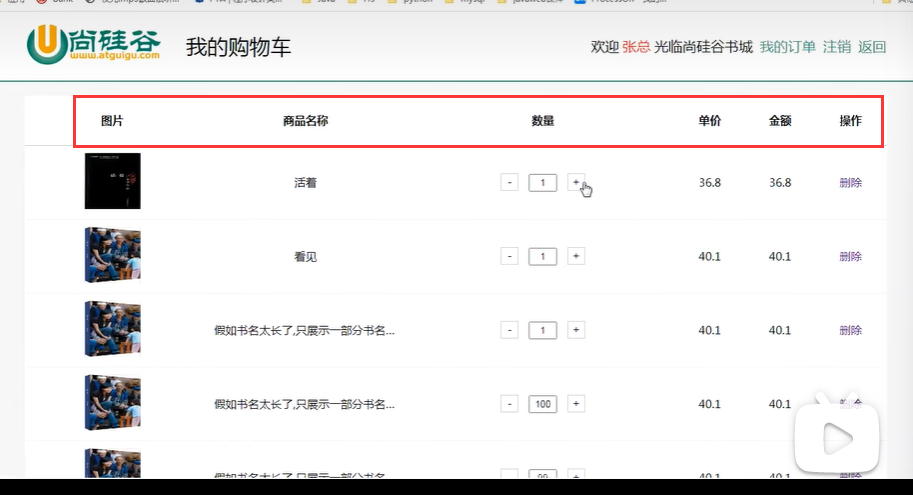

# 书城功能分析

## 登录和注册


### 登录

- 根据用户名和密码进行登录
- 并且已经实现了登录之后，跳转主页面


### 注册


## 普通用户登录

### 首页功能

#### 实现图书列表


#### 实现图书筛选功能


### 购物车功能

#### 实现加入购物车


#### 显示购物车的信息

- 查看购物车


#### 购物车订单信息操作

- 购物车详情，以及增删操作



### 订单功能

#### 实现结账


#### 生成订单


#### 查看以往订单信息


## 管理员的登录

- 输入普通用户账号，那么就会到前端页面
- 输入管理员的账号，就会到后端页面


### 图书管理

- 添加图书 

- 对图书进行修改 

- 删除某一本图书

  - ```
    这里的删除是假删除，因为删除某一本图书之后，这本图书还可能有订单
    就像删除母表，子表就会引用失败，只是对图书的状态修改，比如修改状态值为0，表示已下架
    ```

  


### 订单管理

- 管理员的订单管理可以看到所有人的订单
- 点击发货后，表示已经发货
- 点击查看详情，表示可以查看到订单的详细情况（这里的详细情况与购物车里面订单的详细情况类似）


