# 数据库设计


## 实体分析

- 图书                Book
- 用户                User
- 订单                OrderBean
- 订单详情             OrderItem
- 购物车项             CartItem


## 实体属性分析

### 图书 : 

- 书名、作者、价格、销量、库存、封面、状态

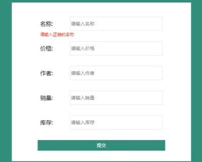


### 用户 :

-  用户名、密码、邮箱

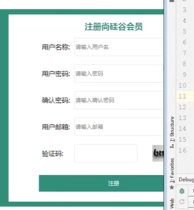

### 订单 : 

- 订单编号、订单日期、订单金额、订单数量、订单状态、用户
  - ==用于描述：==谁在什么时间，花了多少钱，买了多少东西

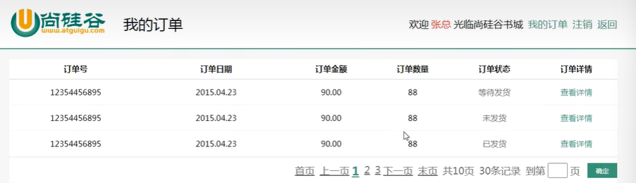


### 订单详情 :

- 图书、数量、所属订单

  

  - 一个订单里面：

    - 可以有多种图书，每一种图书可以买好几本

    - 以及这里所有的书所属于的订单


参考购物车

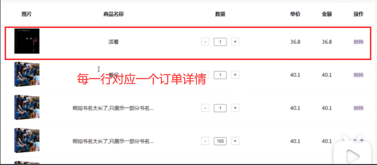

### 购物车项 :

- 图书、数量、所属用户

  - 购物车项，是购物车组成购物车的二级元素

  -  多个购物车项一起结账，得到一个订单，订单里面的所有购物车项组成一个购物车（已结算）

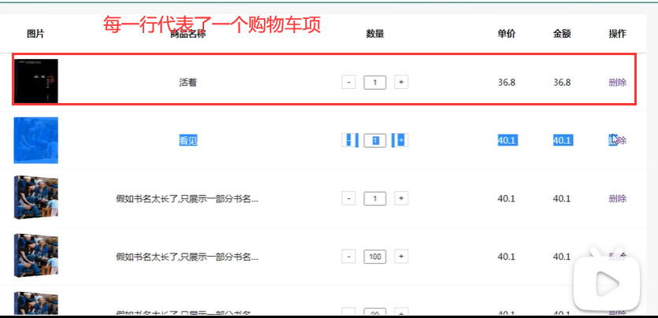


## 画出ER图


1. 一个订单页面里面有多个==订单==，每一个订单对应一个==订单详情==
2. 每一个人都可以买同一种==图书==，所以一本书可以对应多个==订单详情==
3. 每一种==图书==，每个用户都可以买，买后，每个用户的购物车里可以都可以有对应的==购物车项==

根据购物车项，会在项目中新建一个购物车类，但是并不和数据库中的表对应

# sql代码

```mysql
CREATE DATABASE bookdb CHAR SET utf8;
USE bookdb ;
```

## t_book-图书

```
封面图 书名 价格 作者 销量 库存 状态 
```

```mysql
CREATE TABLE `t_book` (
  `id` INT(11) NOT NULL AUTO_INCREMENT,
  `bookImg` VARCHAR(200) NOT NULL,
  `bookName` VARCHAR(20) DEFAULT NULL,
  `price` DOUBLE(10,2) DEFAULT NULL,
  `author` VARCHAR(20) DEFAULT NULL,
  `saleCount` INT(11) DEFAULT NULL,
  `bookCount` INT(11) DEFAULT NULL,
  PRIMARY KEY (`id`)
) ENGINE=INNODB AUTO_INCREMENT=12 DEFAULT CHARSET=utf8;
```

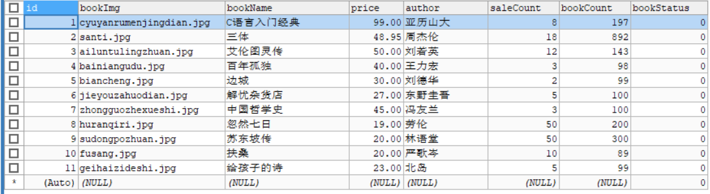

## t_user-用户

```
用户名 密码 邮箱 角色
```

```mysql
CREATE TABLE `t_user` (
  `id` INT(11) NOT NULL AUTO_INCREMENT,
  `uname` VARCHAR(20) NOT NULL,
  `pwd` VARCHAR(32) NOT NULL,
  `email` VARCHAR(100) DEFAULT NULL,
  `role` INT(11) DEFAULT NULL,
  PRIMARY KEY (`id`),
  UNIQUE KEY `uname` (`uname`)
) ENGINE=INNODB AUTO_INCREMENT=17 DEFAULT CHARSET=utf8;
```

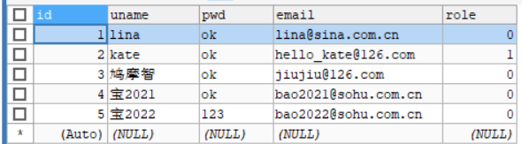

## t_cart_item-购物车项

```
某一种图书 购买数量 所属用户
```

```mysql
CREATE TABLE `t_cart_item` (
  `id` INT(11) NOT NULL AUTO_INCREMENT,
  `book` INT(11) DEFAULT NULL,
  `buyCount` INT(11) DEFAULT NULL,
  `userBean` INT(11) DEFAULT NULL,
  PRIMARY KEY (`id`),
  KEY `FK_cart_book` (`book`),
  KEY `FK_cart_user` (`userBean`),
  CONSTRAINT `FK_cart_book` FOREIGN KEY (`book`) REFERENCES `t_book` (`id`),
  CONSTRAINT `FK_cart_user` FOREIGN KEY (`userBean`) REFERENCES `t_user` (`id`)
) ENGINE=INNODB AUTO_INCREMENT=21 DEFAULT CHARSET=utf8;
```

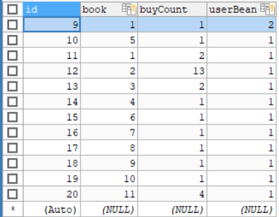

## t_order-订单

```
t_order_item订单号 订单编号 订单日期 所属用户 订单金额 订单状态

即，某一个用户在某一个时间花了多少钱
```

```mysql
CREATE TABLE `t_order` (
  `id` INT(11) NOT NULL AUTO_INCREMENT,
  `orderNo` VARCHAR(128) NOT NULL,
  `orderDate` DATETIME DEFAULT NULL,
  `orderUser` INT(11) DEFAULT NULL,
  `orderMoney` DOUBLE(10,2) DEFAULT NULL,
  `orderStatus` INT(11) DEFAULT NULL,
  PRIMARY KEY (`id`),
  UNIQUE KEY `orderNo` (`orderNo`),
  KEY `FK_order_user` (`orderUser`),
  CONSTRAINT `FK_order_user` FOREIGN KEY (`orderUser`) REFERENCES `t_user` (`id`)
) ENGINE=INNODB AUTO_INCREMENT=12 DEFAULT CHARSET=utf8;
```

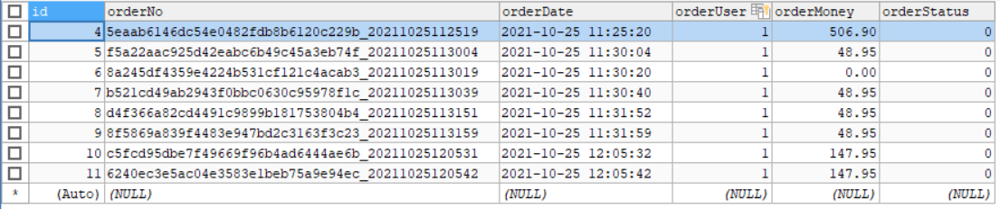

## t_order_item-订单详情

```
商品 数量 订单号

某一个订单究竟买了哪些商品，比如下图中4号订单，有5个订单详情
（将某一个订单拆分开来）
```

```mysql
CREATE TABLE `t_order_item` (
  `id` INT(11) NOT NULL AUTO_INCREMENT,
  `book` INT(11) DEFAULT NULL,
  `buyCount` INT(11) DEFAULT NULL,
  `orderBean` INT(11) DEFAULT NULL,
  PRIMARY KEY (`id`),
  KEY `FK_detail_book` (`book`),
  KEY `FK_detail_order` (`orderBean`),
  CONSTRAINT `FK_detail_book` FOREIGN KEY (`book`) REFERENCES `t_book` (`id`),
  CONSTRAINT `FK_detail_order` FOREIGN KEY (`orderBean`) REFERENCES `t_order` (`id`)
) ENGINE=INNODB AUTO_INCREMENT=19 DEFAULT CHARSET=utf8;
```

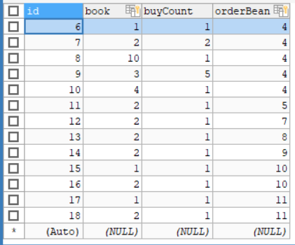


## sql-er

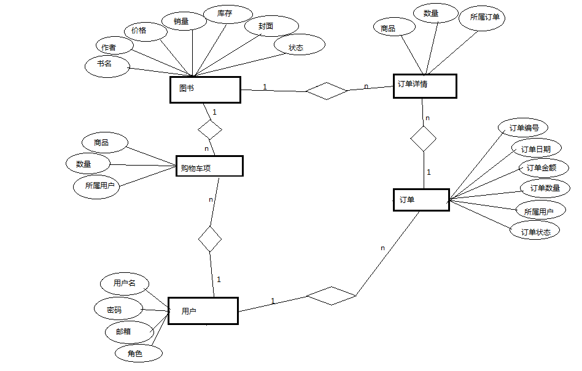


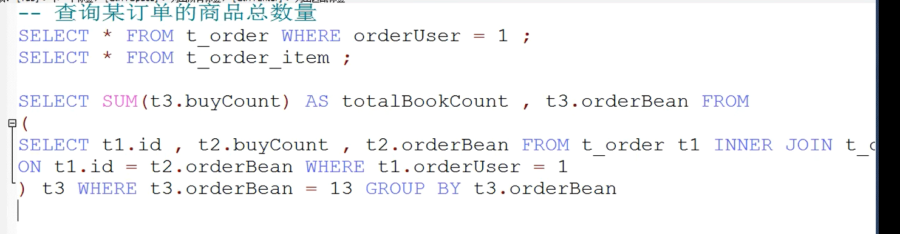

将id为1的用户的所有购买的订单号都找出来

```mysql
SELECT SUM(t3.buyCount) AS totalBookCount , t3.orderBean FROM 
                (
                SELECT t1.id , t2.buyCount , t2.orderBean FROM t_order t1 INNER JOIN t_order_item t2
                ON t1.id = t2.orderBean WHERE t1.orderUser = 1
                ) t3 WHERE t3.orderBean = 13 GROUP BY t3.orderBean
```


