- 所有功能的实现都是基于数据库的查询实现的
  - java提供了调用数据库的代码
  - 前端提供了用户点击的反馈


# 登录功能实现

## 前期准备

### 构建pojo类

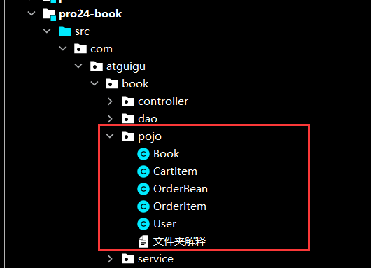

### 构建配置文件

#### web.xml

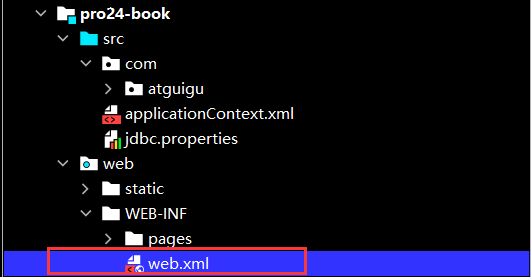

```html
<?xml version="1.0" encoding="UTF-8"?>
<web-app xmlns="http://xmlns.jcp.org/xml/ns/javaee"
         xmlns:xsi="http://www.w3.org/2001/XMLSchema-instance"
         xsi:schemaLocation="http://xmlns.jcp.org/xml/ns/javaee http://xmlns.jcp.org/xml/ns/javaee/web-app_4_0.xsd"
         version="4.0">

    <context-param>
        <param-name>view-prefix</param-name>
        <param-value>/WEB-INF/pages/</param-value>
        <!--       上一行代码表示所有的，网页页面都在pages页面下 -->
    </context-param>
    <context-param>
        <param-name>view-suffix</param-name>
        <param-value>.html</param-value>
        <!--        页面全部都是.html文件，所以对该页面下文件的后缀全部都是.html文件-->
    </context-param>
    <context-param>
        <param-name>contextConfigLocation</param-name>
        <param-value>applicationContext.xml</param-value>
    </context-param>

</web-app>
```

#### applicationContext

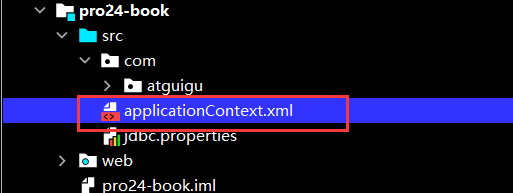

```html
<?xml version="1.0" encoding="utf-8"?>

<!DOCTYPE beans [
    <!ELEMENT beans (bean*)>
    <!ELEMENT bean (property*)>
    <!ELEMENT property (#PCDATA)>

    <!ATTLIST bean id ID #REQUIRED>
    <!ATTLIST bean class CDATA #IMPLIED>
    <!ATTLIST property name CDATA #IMPLIED>
    <!ATTLIST property ref IDREF #IMPLIED>
]>

<beans>

    <bean id="page" class="com.Novice.myssm.myspringmvc.PageController"/>

</beans>
```

### url默认访问界面(设置如下)

#### 代码文件存放位置


#### tomcat设置

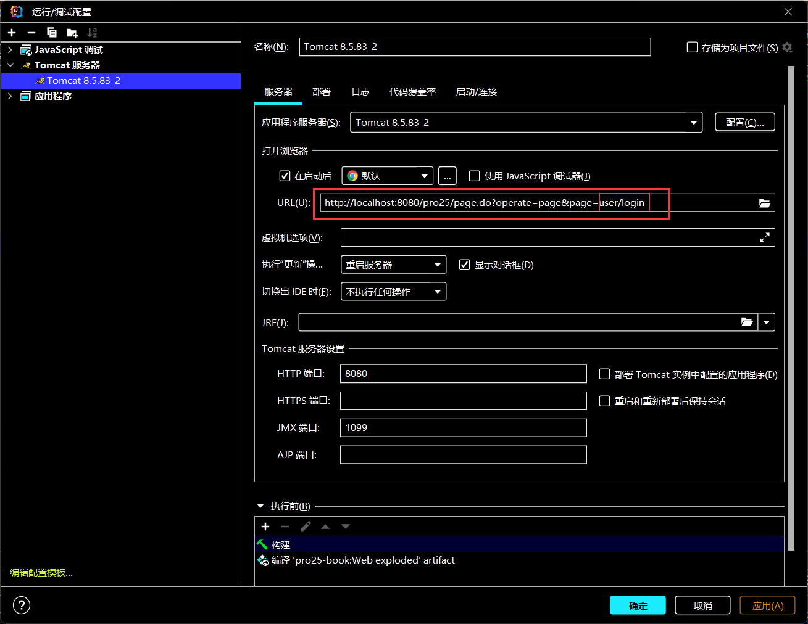

#### 如上设置的目的

```apl
准确位置

/WEB-INF/pages/user/login.html
因为前面的applicationcontext完成了/WEB-INF/pages/路径的设置
所以在tomcat中设置路径时加上了user/login.html
```

### login页面代码

```html
<!DOCTYPE html>
<html xmlns:th="http://www.thymeleaf.org">
  <head>
    <meta charset="UTF-8" />
    <title>尚硅谷会员登录页面</title>
    <link type="text/css" rel="stylesheet" th:href="@{/static/css/style.css}" />
  </head>
  <body>
    <div id="login_header">
      <a href="../index.html">
        
      </a>
    </div>

    <div class="login_banner">
      <div id="l_content">
        <span class="login_word">欢迎登录</span>
      </div>

      <div id="content">
        <div class="login_form">
          <div class="login_box">
            <div class="tit">
              <h1>尚硅谷会员</h1>
            </div>
            <div class="msg_cont">
              <b></b>
              <span class="errorMsg">请输入用户名和密码</span>
            </div>
            <div class="form">
              <form th:action="@{/user.do}" method="post">
                <input type="hidden" name="operate" value="login"/>
                <label>用户名称：</label>
                <input class="itxt" type="text" placeholder="请输入用户名" autocomplete="off" tabindex="1"
                  name="uname" id="username" value="lina" />
                <br />
                <br />
                <label>用户密码：</label>
                <input class="itxt" type="password" placeholder="请输入密码" autocomplete="off" tabindex="1"
                  name="pwd" id="password" value="ok"/>
                <br />
                <br />
                <input type="submit" value="登录" id="sub_btn" />
              </form>
              <div class="tit">
                <a href="regist.html">立即注册</a>
              </div>
            </div>
          </div>
        </div>
      </div>
    </div>
    <div id="bottom">
      <span>
        尚硅谷书城.Copyright &copy;2015
      </span>
    </div>
  </body>
</html>

```


## 实现查询user的功能


### 构建user controller

```
根据上面代码31行的user.do构建一个user controller
```

#### 构建位置


#### 构建代码

```apl
因为上面的login页面中32行的operate = "login",所以这里的方法使用login

而login页面32行之后需要两个参数（uname，pwd），所以下面的类里面的方法也需要两个参数
```


```java
package com.Novice.book.controller;

import com.Novice.book.pojo.User;
import com.Novice.book.service.UserService;

public class UserController {

    private UserService userService ;

    public String login(String uname , String pwd ){

        User user = userService.login(uname, pwd);

        System.out.println("user = " + user);
        return "index";//回到首页上去
    }
}
```

##### 代码的主要作用

```apl
对输入的用户名与密码进行查询，所以需要"DAO"
```

### 构建DAO

#### 构建位置


#### 构建代码

##### impl

```java
package com.Novice.book.dao.impl;

import com.Novice.book.dao.UserDAO;
import com.Novice.book.pojo.User;
import com.Novice.myssm.basedao.BaseDAO;

public class UserDAOImpl extends BaseDAO<User> implements UserDAO {
    @Override
    public User getUser(String uname, String pwd) {
        return load("select * from t_user where uname like ? and pwd like ? " , uname , pwd );
    }
}
```

##### 接口

```java
package com.Novice.book.dao;

import com.Novice.book.pojo.User;

public interface UserDAO {
    User getUser(String uname , String pwd );
}

```

##### 下面需要引入service

```apl
"DAO"上面需要servicce
```


### 构建service

#### 构建位置

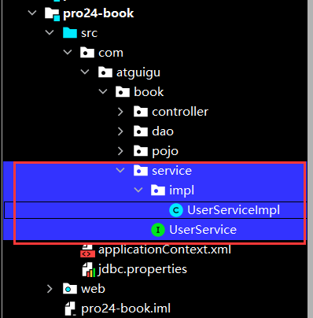

#### 构建代码

##### impl实现类

```java
package com.Novice.book.service.impl;

import com.Novice.book.dao.UserDAO;
import com.Novice.book.pojo.User;
import com.Novice.book.service.UserService;

public class UserServiceImpl implements UserService {

    private UserDAO userDAO ;

    @Override
    public User login(String uname, String pwd) {
        return userDAO.getUser(uname,pwd);
    }
}

```

##### 接口

```java
package com.Novice.book.service;

import com.Novice.book.pojo.User;

public interface UserService {
    User login(String uname , String pwd );
}

```

### 配置-配置文件（applicationcontext）

#### 配置文件代码

```html
<?xml version="1.0" encoding="utf-8"?>

<!DOCTYPE beans [
    <!ELEMENT beans (bean*)>
    <!ELEMENT bean (property*)>
    <!ELEMENT property (#PCDATA)>

    <!ATTLIST bean id ID #REQUIRED>
    <!ATTLIST bean class CDATA #IMPLIED>
    <!ATTLIST property name CDATA #IMPLIED>
    <!ATTLIST property ref IDREF #IMPLIED>
]>

<beans>

    <bean id="page" class="com.Novice.myssm.myspringmvc.PageController"/>

    <!-- DAO -->
    <bean id="userDAO" class="com.Novice.book.dao.impl.UserDAOImpl"/>

    <!-- service -->
    <bean id="userService" class="com.Novice.book.service.impl.UserServiceImpl">
        <property name="userDAO" ref="userDAO"/>
    </bean>

    <!-- controller 这里写user是因为在login.html中返回的是user.do-->
    <bean id="user" class="com.Novice.book.controller.UserController">
        <property name="userService" ref="userService"/>
    </bean>


</beans>
```

 <!-- controller 这里写user是因为在login.html中返回的是user.do--> 如下：

```html
<!DOCTYPE html>
<html xmlns:th="http://www.thymeleaf.org">
  <head>
    <meta charset="UTF-8" />
    <title>尚硅谷会员登录页面</title>
    <link type="text/css" rel="stylesheet" th:href="@{/static/css/style.css}" />
  </head>
  <body>
    <div id="login_header">
      <a href="../index.html">
        
      </a>
    </div>

    <div class="login_banner">
      <div id="l_content">
        <span class="login_word">欢迎登录</span>
      </div>

      <div id="content">
        <div class="login_form">
          <div class="login_box">
            <div class="tit">
              <h1>尚硅谷会员</h1>
            </div>
            <div class="msg_cont">
              <b></b>
              <span class="errorMsg">请输入用户名和密码</span>
            </div>
            <div class="form">
              <form th:action="@{/user.do}" method="post">
                <input type="hidden" name="operate" value="login"/>
                <label>用户名称：</label>
                <input class="itxt" type="text" placeholder="请输入用户名" autocomplete="off" tabindex="1"
                  name="uname" id="username" value="lina" />
                <br />
                <br />
                <label>用户密码：</label>
                <input class="itxt" type="password" placeholder="请输入密码" autocomplete="off" tabindex="1"
                  name="pwd" id="password" value="ok"/>
                <br />
                <br />
                <input type="submit" value="登录" id="sub_btn" />
              </form>
              <div class="tit">
                <a href="regist.html">立即注册</a>
              </div>
            </div>
          </div>
        </div>
      </div>
    </div>
    <div id="bottom">
      <span>
        尚硅谷书城.Copyright &copy;2015
      </span>
    </div>
  </body>
</html>
```

## 报错解决思路 

### jdbc.properties

#### 位置

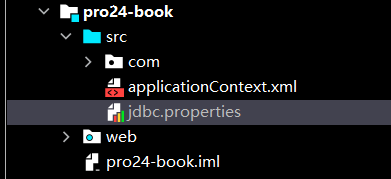

#### 代码

```mysql
# jdbc.driver=com.mysql.jdbc.Driver
# jdbc.url=jdbc:mysql://localhost:3306/qqzonedb?useUnicode=true&characterEncoding=utf-8&useSSL=false
# jdbc.user=root
# jdbc.pwd=123456
driverClassName=com.mysql.jdbc.Driver
url=jdbc:mysql://localhost:3306/bookdb?useUnicode=true&characterEncoding=utf-8&useSSL=false
username=root
password=abcd
# ��ʼ����������
initialSize=5
# ���������
maxActive=10
# ���ʱʱ��
maxWait=3000

#http://localhost:8080/pro24/page.do?operate=page&page=user/login
```

### pojo类里面字段缺失

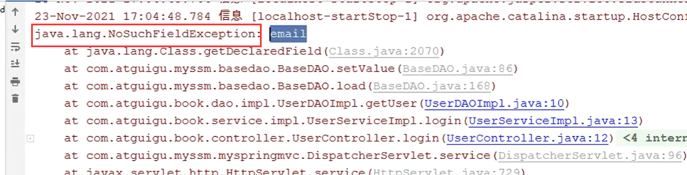


# 首页展示图书列表


## 功能分析

- 因为首页要显示图书列表，所以要实现==查询图书数据==的功能
- 暂时先不考虑分页


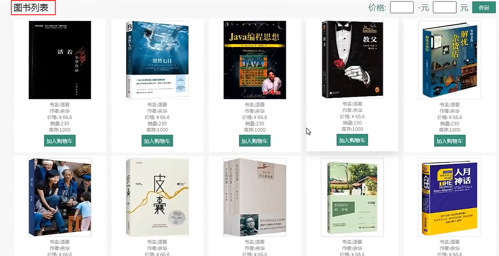


## 后端代码实现逻辑

### ==设计思路==

- 如果userController通过
  - userController就通过Book.do跳转到BookController
    1. BookController调用BookService
    2. BookService调用BookDao
    3. BookDao通过getBookList()方法==获取图书列表==并返回
  - BookController得到的BookList数据
    - 将BookList数据封装在Session中
    - 将Session协同数据传递给 ==index== 代码
    - index代码通过渲染将数据展现出来


### 新建BookDao

- BookDAOImpl ： getBookList()

- 引入bookDao用于查询数据库

#### 功能分析

- 因为这里的查询使用的不是关键字
  - 不适用......like..的sql语句
  - 使用between minPrice and maxPrice


#### 代码位置

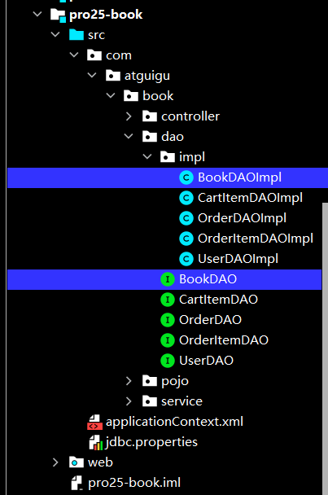

#### 代码详情

##### 接口

```java
public interface BookDAO {

    List<Book> getBookList();
    Book getBook(Integer id);
}

```


##### 实现类

```java
public class BookDAOImpl extends BaseDAO<Book> implements BookDAO {
    @Override
    public List<Book> getBookList() { //获取所有的有货图书的图书列表
        return executeQuery("select * from t_book where bookStatus=0");
        // bookStatus表示书本是否有货，有货bookStatus=0
    }

    @Override
    public Book getBook(Integer id) {
        return load("select * from t_book where id = ? " , id);
    }
}
```


### 新建BookService

- BookServiceImpl : getBookList()

#### 代码位置

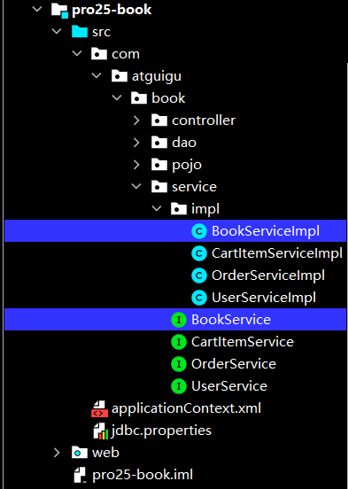

#### 代码详情


##### 接口

```java
public interface BookService {
    List<Book> getBookList();
    Book getBook(Integer id);
}

```


##### 实现类

```java
public class BookServiceImpl implements BookService {

    private BookDAO bookDAO ; //注入BookDao

    @Override
    public List<Book> getBookList() {
        return bookDAO.getBookList(); //通过MVC的方式调用BookDao中的方法
    }

    @Override
    public Book getBook(Integer id) {
        return bookDAO.getBook(id);
    }
}

```


### 新建BookController

- 跳转到 index()

#### 代码位置

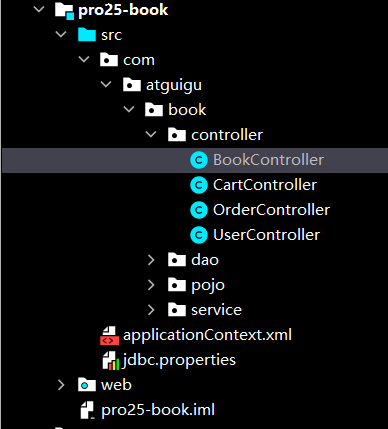

#### 代码详情

##### ==loginController==

```java
public class UserController {

    private UserService userService ;
    private CartItemService cartItemService ;

    public String login(String uname , String pwd , HttpSession session){

        User user = userService.login(uname, pwd);
        if(user!=null){//如果有该用户，就获取该用户的购物车信息，并将该信息传入cart对象
            Cart cart = cartItemService.getCart(user);
            user.setCart(cart);
            session.setAttribute("currUser",user);
            return "redirect:book.do";//返回主页面，并且再session中放入了携带cart信息的user用户
        }
        return "user/login";//如果没有该用户，就返回注册页面
    }
}

```

##### BookController

```java
public class BookController {

    private BookService bookService ;

    public String index(HttpSession session){
        List<Book> bookList = bookService.getBookList();
        session.setAttribute("bookList",bookList);
        return "index";
    }
}

```

#### 另一个BookController实现方法

```java
直接在loginController中导入 
    private BookService bookService ;
然后直接通过调用BookDao获取数据，并返回给index页面
```


### 编辑 index.html 页面


#### 代码位置

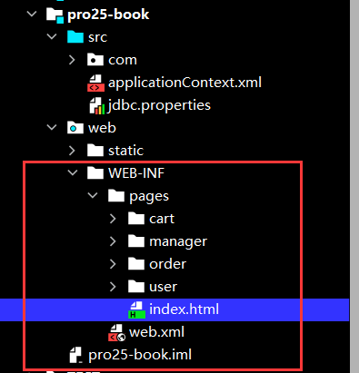

#### 代码详情


##### 总代码


```html
<!DOCTYPE html>
<html lang="en" xmlns:th="http://www.thymeleaf.org">
<head>
  <meta charset="UTF-8" />
  <meta name="viewport" content="width=device-width, initial-scale=1.0" />
  <title>书城首页</title>
  <link rel="stylesheet" th:href="@{/static/css/minireset.css}" />
  <link rel="stylesheet" th:href="@{/static/css/common.css}" />
  <link rel="stylesheet" th:href="@{/static/css/iconfont.css}" />
  <link rel="stylesheet" th:href="@{/static/css/index.css}" />
  <link rel="stylesheet" th:href="@{/static/css/swiper.min.css}" />
  <script language="JavaScript" th:src="@{/static/script/index.js}"></script>
<!--  script不能使用单标签-->
</head>
<body>
<div id="app">
  <div class="topbar">
    <div class="w">
      <div class="topbar-left">
        <i>送至:</i>
        <i>北京</i>
        <i class="iconfont icon-ai-arrow-down"></i>
      </div>

      <div class="topbar-right" th:if="${session.currUser==null}">
        <a href="user/login.html" class="login">登录</a>
        <a href="user/regist.html" class="register">注册</a>
        <a href="cart/cart.html" class="cart iconfont icon-gouwuche">
          购物车
          <div class="cart-num">3</div>
        </a>
        <a href="manager/book_manager.html" class="admin">后台管理</a>
      </div>

      <div class="topbar-right" th:unless="${session.currUser==null}">
        <!--登录后风格-->
        <span>欢迎你<b th:text="${session.currUser.getUname()}">张总</b></span>
        <a href="#" class="register">注销</a>
        <a th:href="@{/cart.do}" class="cart iconfont icon-gouwuche">
          购物车1
          <div class="cart-num" th:text="${session.currUser.cart.totalCount}">3</div>
<!--          这里显示的是用户的购物车详情-->
        </a>
        <a href="./pages/manager/book_manager.html" class="admin">后台管理</a>
      </div>

    </div>
  </div>
  <div class="header w">
    <a href="#" class="header-logo"></a>
    <div class="header-nav">
      <ul>
        <li><a href="#">java</a></li>
        <li><a href="#">前端</a></li>
        <li><a href="#">小说</a></li>
        <li><a href="#">文学</a></li>
        <li><a href="#">青春文学</a></li>
        <li><a href="#">艺术</a></li>
        <li><a href="#">管理</a></li>
      </ul>
    </div>
    <div class="header-search">
      <input type="text" placeholder="十万个为什么" />
      <button class="iconfont icon-search"></button>
    </div>
  </div>
  <div class="banner w clearfix">
    <div class="banner-left">
      <ul>
        <li>
          <a href="">
            <span>文学 鉴赏</span>
            <i class="iconfont icon-jiantou"></i
            ></a>
        </li>
        <li>
          <a href="">
            <span>社科 研究</span>
            <i class="iconfont icon-jiantou"></i
            ></a>
        </li>
        <li>
          <a href="">
            <span>少儿 培训</span>
            <i class="iconfont icon-jiantou"></i
            ></a>
        </li>
        <li>
          <a href="">
            <span>艺术 赏析</span>
            <i class="iconfont icon-jiantou"></i
            ></a>
        </li>
        <li>
          <a href="">
            <span>生活 周边</span>
            <i class="iconfont icon-jiantou"></i
            ></a>
        </li>
        <li>
          <a href="">
            <span>文教 科技</span>
            <i class="iconfont icon-jiantou"></i
            ></a>
        </li>
        <li>
          <a href="">
            <span>热销 畅读</span>
            <i class="iconfont icon-jiantou"></i
            ></a>
        </li>
      </ul>
    </div>
    <div class="banner-right">
      <div class="swiper-container">
        <ul class="swiper-wrapper">
          <li class="swiper-slide">
            
            <!-- <div class="banner-img"></div> -->
          </li>
          <li class="swiper-slide">
            
            <!-- <div class="banner-img"></div> -->
          </li>
          <li class="swiper-slide">
            
            <!-- <div class="banner-img"></div> -->
          </li>
        </ul>
        <div class="swiper-button-prev"></div>

        <div class="swiper-button-next"></div>

        <!-- Add Pagination -->
        <div class="swiper-pagination"></div>
      </div>
    </div>
  </div>
  <div class="books-list ">
    <div class="w">
      <div class="list">
        <div class="list-header">
          <div class="title">图书列表</div>
          <div class="price-search">
            <span>价格:</span>
            <input type="text">
            <span>-元</span>
            <input type="text">
            <span>元</span>
            <button>查询</button>
          </div>
        </div>
        <div class="list-content">
          <div href="" class="list-item" th:each="book : ${session.bookList}" th:object="${book}">
            
            <p th:text="|书名:*{bookName}|">书名:活着</p>
            <p th:text="|作者:*{author}|">作者:余华</p>
            <p th:text="|价格:￥*{price}|">价格:￥66.6</p>
            <p th:text="|销量:*{saleCount}|">销量:230</p>
            <p th:text="|库存:*{bookCount}|">库存:1000</p>
            <button th:onclick="|addCart(*{id})|">加入购物车</button>
          </div>
        </div>
        <div class="list-footer">
          <div>首页</div>
          <div>上一页</div>
          <ul><li class="active">1</li><li>2</li><li>3</li></ul>
          <div>下一页</div>
          <div>末页</div>
          <span>共10页</span>
          <span>30条记录</span>
          <span>到第</span>
          <input type="text">
          <span>页</span>
          <button>确定</button>
        </div>
      </div>
    </div>

  </div>
  <div class="cate w">
    <div class="list">
      <a href="" class="list-item">
        <i class="iconfont icon-java"></i>
        <span>java</span>
      </a>
      <a href="" class="list-item"
      ><i class="iconfont icon-h5"></i>h5</a
      >
      <a href="" class="list-item">
        <i class="iconfont icon-python"></i>python
      </a>
      <a href="" class="list-item"
      ><i class="iconfont icon-tianchongxing-"></i>pm</a
      >
      <a href="" class="list-item"
      ><i class="iconfont icon-php_elephant"></i>php</a
      >
      <a href="" class="list-item"
      ><i class="iconfont icon-go"></i>go</a
      >
    </div>
    <a href="" class="img">
      
    </a>
    <a href="" class="img">
      
    </a>
    <a href="" class="img">
      
    </a>
  </div>
  <div class="books">
    <div class="w">
      <div class="seckill">
        <div class="seckill-header">
          <div class="title">
            图书秒杀
          </div>
          <!-- <i class="iconfont icon-huanyipi"></i> -->
        </div>
        <div class="seckill-content">

          <a href="" class="tip">
            <h5>距离结束还有</h5>
            <i class="iconfont icon-shandian"></i>
            <div class="downcount">
              <span class="time">00</span>
              <span class="token">:</span>
              <span class="time">00</span>
              <span class="token">:</span>
              <span class="time">00</span>
            </div>
          </a>


          <a href="" class="books-sec">
            
            <p>从晚晴到民国</p>
            <div>
              <span class="cur-price">￥28.9</span>
              <span class="pre-price">￥36.5</span>
            </div>
            <button>立即购买</button>
          </a>
          <a href="" class="books-sec">
            
            <p>c语言入门经典</p>
            <div>
              <span class="cur-price">￥55.9</span>
              <span class="pre-price">￥68.5</span>
            </div>
            <button>立即购买</button>
          </a>
          <a href="" class="books-sec">
            
            <p>扶桑</p>
            <div>
              <span class="cur-price">￥30.9</span>
              <span class="pre-price">￥47.5</span>
            </div>
            <button>立即购买</button>
          </a>
          <a href="" class="books-sec">
            
            <p>给孩子的诗</p>
            <div>
              <span class="cur-price">￥18.9</span>
              <span class="pre-price">￥25.5</span>
            </div>
            <button>立即购买</button>
          </a>


          </ul>
        </div>
      </div>
    </div>
  </div>
  <div class="bottom">
    <div class="w">
      <div class="top">
        <ul>
          <li>
            <a href="">
              
              <span>大咖级讲师亲自授课</span>
            </a>
          </li>
          <li>
            <a href="">
              
              <span>课程为学员成长持续赋能</span>
            </a>
          </li>
          <li>
            <a href="">
              
              <span>学员真是情况大公开</span>
            </a>
          </li>
        </ul>
      </div>
      <div class="content">
        <dl>
          <dt>关于尚硅谷</dt>
          <dd>教育理念</dd>
          <!-- <dd>名师团队</dd>
          <dd>学员心声</dd> -->
        </dl>
        <dl>
          <dt>资源下载</dt>
          <dd>视频下载</dd>
          <!-- <dd>资料下载</dd>
          <dd>工具下载</dd> -->
        </dl>
        <dl>
          <dt>加入我们</dt>
          <dd>招聘岗位</dd>
          <!-- <dd>岗位介绍</dd>
          <dd>招贤纳师</dd> -->
        </dl>
        <dl>
          <dt>联系我们</dt>
          <dd>http://www.Novice.com<dd>
        </dl>
      </div>
    </div>
    <div class="down">
      尚硅谷书城.Copyright ©2015
    </div>
  </div>


</div>
<script src="./static/script/swiper.min.js"></script>
<script>
  var swiper = new Swiper('.swiper-container', {
    autoplay: true,
    pagination: {
      el: '.swiper-pagination',
      dynamicBullets: true
    },
    navigation: {
      nextEl: '.swiper-button-next',
      prevEl: '.swiper-button-prev'
    }
  })
</script>
</body>
</html>
```


##### 本次主要修改的代码

```html
<div class="list-content">
          <div href="" class="list-item" th:each="book : ${session.bookList}" th:object="${book}">
            
            <p th:text="|书名:*{bookName}|">书名:活着</p>
            <p th:text="|作者:*{author}|">作者:余华</p>
            <p th:text="|价格:￥*{price}|">价格:￥66.6</p>
            <p th:text="|销量:*{saleCount}|">销量:230</p>
            <p th:text="|库存:*{bookCount}|">库存:1000</p>
            <button th:onclick="|addCart(*{id})|">加入购物车</button>
          </div>
        </div>
```


## 疑惑

1. Controller中Session的作用


# 添加图书到购物车

## 前情提示：

- 功能实现
  1. 首页上登录成功之后显示欢迎语和购物车数量
  2. 点击具体图书的添加到购物车按钮后，书籍添加到购物车
- ==笔记与之前不同之处==
  - 无代码位置
  - 实现逻辑比较简单的代码，无接口代码详情


## index页面代码修改1

### 显示用户名

#### 实现效果

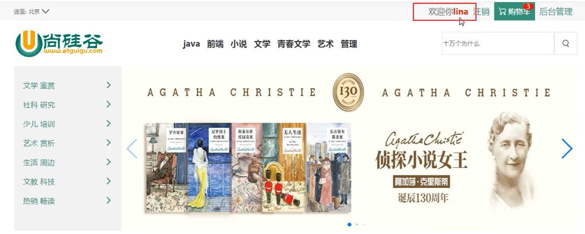

#### 代码详情

- 这里使用了 if - else 的逻辑

  - 如果登录失败显示默认值
  - 如果登录成功显示用户名

  

1. 登录前风格

```html
      <div class="topbar-right" th:if="${session.currUser==null}">
        <a href="user/login.html" class="login">登录</a>
        <a href="user/regist.html" class="register">注册</a>
        <a href="cart/cart.html" class="cart iconfont icon-gouwuche">
          购物车
          <div class="cart-num">3</div>
        </a>
        <a href="manager/book_manager.html" class="admin">后台管理</a>
      </div>
```

2. 登录后风格

```html
 <div class="topbar-right" th:unless="${session.currUser==null}">
        <!--登录后风格-->
        <span>欢迎你<b th:text="${session.currUser.getUname()}">张总</b></span>
     	<!--这里的用户名，是通过userController中存入session中的-->
        <a href="#" class="register">注销</a>
        <a th:href="@{/cart.do}" class="cart iconfont icon-gouwuche">
          购物车1
          <div class="cart-num" th:text="${session.currUser.cart.totalCount}">3</div>
            <!--          这里显示的是用户的购物车详情-->
        </a>
        <a href="./pages/manager/book_manager.html" class="admin">后台管理</a>
      </div>
```

### 书本列表点击按钮加入购物车功能

- 主要作用是实现index显示界面互动操作

#### 实现效果

- 点击之后，会从数据库中获取这本书的 id 
- 之后的一系列操作都是根据获取的书本id进行

#### 代码详情

```html
        <div class="list-content">
          <div href="" class="list-item" th:each="book : ${session.bookList}" th:object="${book}">
            
            <p th:text="|书名:*{bookName}|">书名:活着</p>
            <p th:text="|作者:*{author}|">作者:余华</p>
            <p th:text="|价格:￥*{price}|">价格:￥66.6</p>
            <p th:text="|销量:*{saleCount}|">销量:230</p>
            <p th:text="|库存:*{bookCount}|">库存:1000</p>
            <button th:onclick="|addCart(*{id})|">加入购物车</button>
<!--            点击之后加入购物车，所以需要某一本书的id-->
          </div>
        </div>
```

### 实现加入购物车功能

- 主要是通过javaScript建立html与java代码的桥梁
  - javaScript主要用于从index向后端传输命令

#### index 头部代码

- 需要带头部代码引入javaScript文件文件位置

```html
<head>
  <meta charset="UTF-8" />
  <meta name="viewport" content="width=device-width, initial-scale=1.0" />
  <title>书城首页</title>
  <link rel="stylesheet" th:href="@{/static/css/minireset.css}" />
  <link rel="stylesheet" th:href="@{/static/css/common.css}" />
  <link rel="stylesheet" th:href="@{/static/css/iconfont.css}" />
  <link rel="stylesheet" th:href="@{/static/css/index.css}" />
  <link rel="stylesheet" th:href="@{/static/css/swiper.min.css}" />
  <script language="JavaScript" th:src="@{/static/script/index.js}"></script>
<!--  script不能使用单标签-->
</head>
```


#### JavaScript代码

##### 位置详情

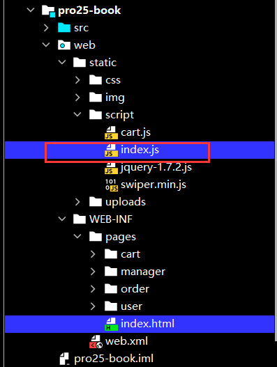

##### 代码详情

```javascript
function addCart(bookId){
    window.location.href='cart.do?operate=addCart&bookId='+bookId;
//    cart.do 说明需要一个cart的controllor
//    operate说明controller里面需要一个addCart()方法
//    bookId说明addCart()方法的参数是bookId    
//    然后这个方法需要一个bookId
}
```


## 后端代码实现逻辑


### 新建CartController

 (CartController —— 购物车控制器)


#### 功能分析：

- 将指定的图书添加到当前用户的购物车中
  1. 如果当前用户的购物车中已经存在这个图书了，那么将购物车中这本图书的数量+1
  2. 否则，在我的==购物车==cart() 中新增一个这本图书的==购物车项==cartItem()  ,数量是1


#### 代码详情

```java
public class CartController {

    private CartItemService cartItemService ;
    
    public String addCart(Integer bookId , HttpSession session){
        //当前用户的cart就存放在session的user对象里面
        User user = (User)session.getAttribute("currUser");
        //将指定的图书添加到当前用户的购物车中，构建该图书的购物车项
        CartItem cartItem = new CartItem(new Book(bookId),1,user);
        cartItemService.addOrUpdateCartItem(cartItem,user.getCart());

        return "redirect:cart.do";
        // 最后再跳转到cartcontroller的index方法上上面去
        // 因为在跳转过来的时候没有添加operate
    }

}
```


### 新建CartItemDao

#### 功能分析：

- 根据CartController要实现的2个功能，在CartDao中新建两个方法
  1. 如果购物车中==没有该图书==，添加新的购物车项（默认值为1）  addCartItem(CartItem cartItem)
  2. 如果购物车中==有该图书==，就在将该图书的购买数量+1    updateCartItem(CartItem cartItem)


#### 代码详情

- 注：下面两个代码块是同一个类

1. 购物车的增删

```java
public class CartItemDAOImpl extends BaseDAO<CartItem> implements CartItemDAO {
    @Override
    public void addCartItem(CartItem cartItem) {
        executeUpdate("insert into t_cart_item values(0,?,?,?)",
                    cartItem.getBook().getId(),cartItem.getBuyCount(),cartItem.getUserBean().getId());
    }

    @Override
    public void updateCartItem(CartItem cartItem) { 
        //先通过service中的方法将java中cart_item中的类的方法的参数修改
        //然后再通过DAO将其中的参数传递回数据库并修改
        executeUpdate("update t_cart_item set buyCount = ? where id = ? " , 
                      cartItem.getBuyCount(),cartItem.getId()) ;
    }
```

2. 登陆时获取购物车信息

```java
  @Override
    public List<CartItem> getCartItemList(User user) {
        return executeQuery("select * from t_cart_item where userBean = ? " , user.getId());
    }

    @Override
    public void delCartItem(CartItem cartItem) {
        super.executeUpdate("delete from t_cart_item where id = ?" , cartItem.getId());
    }
}

```


### 新建CartItemService


#### 代码详情

##### 接口

```java
public interface CartItemService {
    
    
    void addCartItem(CartItem cartItem);
    void updateCartItem(CartItem cartItem);
    //对外只暴露addOrUpdateCartItem()方法，该方法可以调用上面两个方法
    void addOrUpdateCartItem(CartItem cartItem , Cart cart);
```

```java
    //获取指定用户的所有购物车项列表（需要注意的是，这个方法内部查询的时候，会将book的详细信息设置进去）
    List<CartItem> getCartItemList(User user);

    //加载特定用户的购物车信息
    Cart getCart(User user);
}
```


##### 实现类

```java
public class CartItemServiceImpl implements CartItemService {

    private CartItemDAO cartItemDAO ;
    private BookService bookService ;
```

```java
    @Override
    public void addCartItem(CartItem cartItem) {
        //调用CartItemDAO的方法
        cartItemDAO.addCartItem(cartItem);
    }

    @Override
    public void updateCartItem(CartItem cartItem) {
        //调用CartItemDAO的方法
        cartItemDAO.updateCartItem(cartItem);
    }

    @Override
    public void addOrUpdateCartItem(CartItem cartItem , Cart cart) {
        //本类中得到的cart对象经由usrcontroller存入session，然后通过session传入cartcontroller的cart对象，然后再通过sessionaddOrUpdateCartItem方法传入本类

        //1.如果当前用户的购物车中已经存在这个图书了，那么将购物车中这本图书的数量+1
        //2.否则，在我的购物车中新增一个这本图书的CartItem，数量是1
        //判断当前用户的购物车中是否有这本书的CartItem，有->update , 无->add
        if(cart!=null){
            Map<Integer, CartItem> cartItemMap = cart.getCartItemMap();
            if(cartItemMap==null){
                cartItemMap = new HashMap<>();
            }

            if(cartItemMap.containsKey(cartItem.getBook().getId())){
                //如果当前cart对应的map里面有对应的图书(cartitem)
                CartItem cartItemTemp = cartItemMap.get(cartItem.getBook().getId());
                cartItemTemp.setBuyCount(cartItemTemp.getBuyCount()+1);
                updateCartItem(cartItemTemp);
            }else{
                addCartItem(cartItem);//如果购物车项里面没有对应的图书id，那么就使用添加方法
            }
        }else{  
            //连购物车都没有的情况
            //这种情况应该不会发生，因为通过getCart()方法，会新建一个cart对象 
            addCartItem(cartItem);
        }
    }
```

```java
 @Override
    public List<CartItem> getCartItemList(User user) {
        List<CartItem> cartItemList = cartItemDAO.getCartItemList(user);
        for(CartItem cartItem : cartItemList){
            Book book = bookService.getBook(cartItem.getBook().getId());
            cartItem.setBook(book);
        }

        return cartItemList;
    }

    @Override
    public Cart getCart(User user) {  //此处调用了上面自己的getCartItemList（）方法
        List<CartItem> cartItemList = getCartItemList(user);//通过DAO方法传入某一个用户的所有订单项，每个订单项代表了一种商品
        Map<Integer,CartItem> cartItemMap = new HashMap<>();//将这些订单项一次放入一个Map里面
        for (CartItem cartItem : cartItemList){
            cartItemMap.put(cartItem.getBook().getId(),cartItem);
        }
        Cart cart = new Cart();//新建一个cart对象，然后将新建的Map放入cart对象
        cart.setCartItemMap(cartItemMap);

        return cart;//返回新建的cart对象
    }
}
```


### 临时添加购物车 Cart  ( pojo类 )

#### 逻辑分析：

- 因为上面Service的addOrUpdateCartItem()方法，需要判断==购物车==中是否已经有了某一本书
- ==所以这里需要添加一个购物车Cart类，通过这个类来查询，当前购物车里是否已经有了某本书==

#### 代码详情

```java
public class Cart {
    //购物车中 购物车项 的集合 , 这个Map集合中的key是Book的id
    private Map<Integer,CartItem> cartItemMap ;     
    private Double totalMoney ;                     //购物车的总金额
    private Integer totalCount ;                    //购物车中购物项的数量
    private Integer totalBookCount ;                //购物车中书本的总数量，而不是购物车项的总数量
    public Cart(){}

    public Map<Integer, CartItem> getCartItemMap() {
        return cartItemMap;
    }

    public void setCartItemMap(Map<Integer, CartItem> cartItemMap) {
        this.cartItemMap = cartItemMap;
    }

    public Double getTotalMoney() {
        //通过计算，获取当前购物车的总金额
        totalMoney = 0.0;
        if(cartItemMap!=null && cartItemMap.size()>0){
            Set<Map.Entry<Integer, CartItem>> entries = cartItemMap.entrySet();
            for(Map.Entry<Integer,CartItem> cartItemEntry : entries){
                //每一个entrySet()里面都存储了一本书的id，以及当前购物车里这本书所对应的购物车项
                CartItem cartItem = cartItemEntry.getValue();
                totalMoney = totalMoney + cartItem.getBook().getPrice() * cartItem.getBuyCount() ;
            }
        }
        return totalMoney;
    }

    public Integer getTotalCount() {
        //通过cartItemMap.size() 获取购物车的，购物车项的数量（当前购物车的物品种类数）
        //商城首页右上角现实的额购物车的数量，应该是购物车项的数量
        totalCount = 0 ;
        if(cartItemMap!=null && cartItemMap.size()>0){
            totalCount = cartItemMap.size() ;
        }
        return totalCount;
    }

    public Integer getTotalBookCount() {
        //获取当前购物车的所有书本数量
        totalBookCount = 0 ;
        if(cartItemMap!=null && cartItemMap.size()>0){
            for (CartItem cartItem : cartItemMap.values()){
                totalBookCount = totalBookCount + cartItem.getBuyCount() ;
            }
        }
        return totalBookCount;
    }
}

```

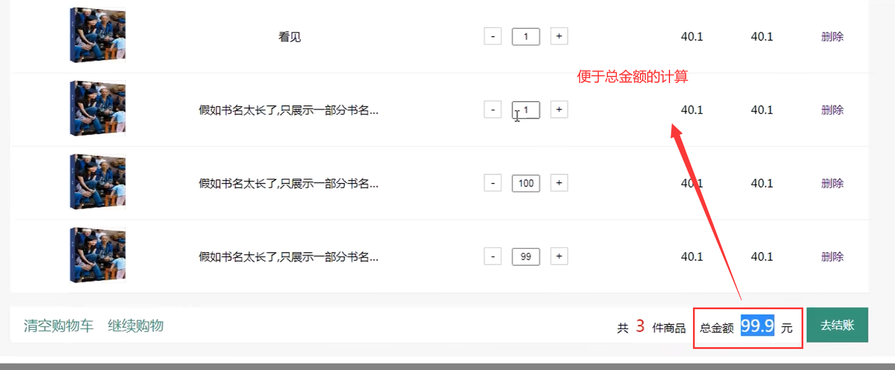


### 修改UserController


#### 逻辑分析：

- 因为需要在登录的时候获取购物车信息（呼应[上文](## 前倾提示：)）
- 所以就在UserController里面注入CartItemService并调用cartItemService.getCart(user)
- 进而获取当前登录用户的购物车信息

#### 功能分析：

登录时获取用户购物车信息

1. ==因为书城的index页面，需要不注册也可以访问==
2. 所以获取购物车数据的功能应该在CartController页面实现

#### 代码详情

```java
public class UserController {

    private UserService userService ;
    private CartItemService cartItemService ;

    public String login(String uname , String pwd , HttpSession session){

        User user = userService.login(uname, pwd);
        if(user!=null){
            //如果有该用户，就获取该用户的购物车信息，并将该信息传入cart对象
            Cart cart = cartItemService.getCart(user);
            user.setCart(cart);
            session.setAttribute("currUser",user);
            return "redirect:book.do";
            //返回主页面，并且在session中放入了携带cart信息的user用户
        }
        return "user/login";//如果没有该用户，就返回注册页面
    }
}
```


#### 在user类中临时添加cart属性

##### 逻辑分析：

- 这里需要将用户对象发送给前端
- 用户对象中需要携带购物车信息
- 购物车类是后来添加的
- 所以这里需要在user类中临时添加cart属性

##### 代码详情

```java
public class User {
    private Integer id ;
    private String uname ;
    private String pwd ;
    private String email;
    private Integer role ;

    private Cart cart ;
    private List<OrderBean> orderList ;     //1:N

    public User(){}

    public User(Integer id) {
        this.id = id;
    }

    public Integer getId() {
        return id;
    }

    public void setId(Integer id) {
        this.id = id;
    }

    public String getUname() {
        return uname;
    }

    public void setUname(String uname) {
        this.uname = uname;
    }

    public String getEmail() {
        return email;
    }

    public void setEmail(String email) {
        this.email = email;
    }

    public String getPwd() {
        return pwd;
    }

    public void setPwd(String pwd) {
        this.pwd = pwd;
    }

    public Integer getRole() {
        return role;
    }

    public void setRole(Integer role) {
        this.role = role;
    }

    public Cart getCart() {
        return cart;
    }

    public void setCart(Cart cart) {
        this.cart = cart;
    }

    public List<OrderBean> getOrderList() {
        return orderList;
    }

    public void setOrderList(List<OrderBean> orderList) {
        this.orderList = orderList;
    }
}
```

## index页面代码修改2

### 实现首页右上角购物车项数目实时显示

#### 逻辑分析

- 注：此处需要是因为前面的后端代码实现了，用户登录后对用户的购物车Cart信息的查询
- 这里需要使用user携带的cart属性的购物车项的总数目

#### 实现效果

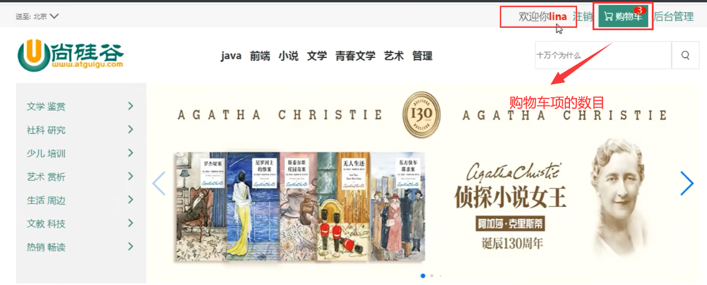

#### 代码位置

index页面代码的38行左右

#### 代码详情

```html
          <div class="cart-num" th:text="${session.currUser.cart.totalCount}">3</div>
```


## 配置文件

- 注：不要忘记添加注解的配置文件


## 报错解决思路 

- html 的 javaScript 头文件不能使用单标签


# 展示购物车详情页面

## 功能分析

- 在经过，cartController添加书籍到购物车之后，需要再跳转到购物车页面，进行查询

### 图示

- 首页添加书籍到购物车之后，下面数据会得到更新

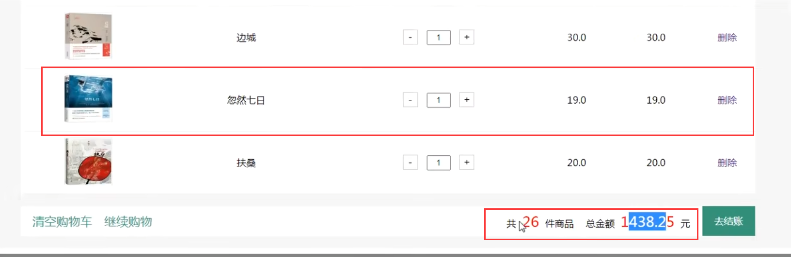

## 后端代码完善


### CartController代码修改

#### 图示

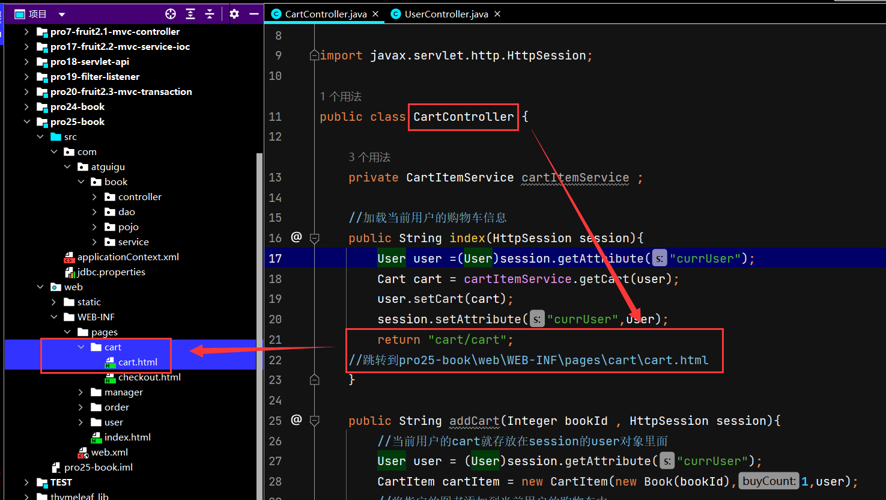

#### 代码详情

```java
public class CartController {

    private CartItemService cartItemService ;

    //加载当前用户的购物车信息
    public String index(HttpSession session){
        User user =(User)session.getAttribute("currUser");
        Cart cart = cartItemService.getCart(user);
        user.setCart(cart);
        session.setAttribute("currUser",user);
        return "cart/cart";
    //跳转到pro25-book\web\WEB-INF\pages\cart\cart.html
    }

    public String addCart(Integer bookId , HttpSession session){
        //当前用户的cart就存放在session的user对象里面
        User user = (User)session.getAttribute("currUser");
        CartItem cartItem = new CartItem(new Book(bookId),1,user);
        //将指定的图书添加到当前用户的购物车中
        cartItemService.addOrUpdateCartItem(cartItem,user.getCart());

        return "redirect:cart.do";//最后再跳转到cartcontroller的index方法上上面去
        // 因为在跳转过来的时候没有添加operate
    }

    public String editCart(Integer cartItemId , Integer buyCount){
        cartItemService.updateCartItem(new CartItem(cartItemId , buyCount));
        return "redirect:cart.do";
    }
}
```

#### 代码分析

- 使用cartController的addCart()方法之后，再次通过return "redirect:cart.do";跳转回CartController中
- 然后，会直接调用index()方法
  - index()方法会先查询数据库，然后更新session中存储的user对象的cart数据
  - 然后跳转到购物车的html页面


## 前端代码完善


### Cart.html修改

```html
<!DOCTYPE html>
<html lang="en" xmlns:th="http://www.thymeleaf.org">
  <head>
    <meta charset="UTF-8" />
    <meta name="viewport" content="width=device-width, initial-scale=1.0" />
    <title>Document</title>
    <link rel="stylesheet" th:href="@{/static/css/minireset.css}" />
    <link rel="stylesheet" th:href="@{/static/css/common.css}" />
    <link rel="stylesheet" th:href="@{/static/css/cart.css}" />
    <script language="JavaScript" th:src="@{/static/script/cart.js}"></script>
  </head>
  <body>
    <div class="header">
      <div class="w">
```

```html
        <div class="header-left">
          <a th:href="@{/index.html}">
            </a>
          <h1>我的购物车</h1>
        </div>
          
        <div class="header-right">
          <h3>欢迎<span th:text="${session.currUser.uname}">张总</span>光临尚硅谷书城</h3>
          <div class="order"><a th:href="@{/order.do(operate='getOrderList')}">我的订单1</a></div>
          <div class="destory"><a href="../index.html">注销</a></div>
          <div class="gohome">
            <a href="../index.html">返回</a>
          </div>
        </div>
```

```html
      </div>
    </div>
    <div class="list">
      <div class="w">
        <table>
          <thead>
            <tr>
              <th>图片</th>
              <th>商品名称</th>

              <th>数量</th>
              <th>单价</th>
              <th>金额</th>
              <th>操作</th>
            </tr>
          </thead>
```

```html
          <tbody>
<!--          循环遍历购物车Map并依次去除每一个购物车项-->
            <tr th:each="cartItem : ${session.currUser.cart.cartItemMap.values()}">
              <td>
                
              </td>
              <td th:text="${cartItem.book.bookName}">活着</td>
              <td>
                <span class="count" th:onclick="|editCart(${cartItem.id} , ${cartItem.buyCount-1})|">-</span>
                <input class="count-num" type="text" value="1" th:value="${cartItem.buyCount}"/>
                <span class="count" th:onclick="|editCart(${cartItem.id} , ${cartItem.buyCount+1})|">+</span>
              </td>
              <td th:text="${cartItem.book.price}">36.8</td>
              <td th:text="${cartItem.xj}">36.8</td>
              <td><a href="">删除123</a></td>
            </tr>
          </tbody>
```

```html
        </table>
        <div class="footer">
          <div class="footer-left">
            <a href="#" class="clear-cart">清空购物车</a>
            <a href="#">继续购物</a>
          </div>
          <div class="footer-right">
            <div>共<span th:text="${session.currUser.cart.totalBookCount}">3</span>件商品</div>
            <div class="total-price">总金额<span th:text="${session.currUser.cart.totalMoney}">99.9</span>元</div>
            <a class="pay" th:href="@{/order.do(operate='checkout')}">去结账</a>
          </div>
        </div>
      </div>
    </div>
    <div class="bottom">
      <div class="w">
        <div class="top">
          <ul>
            <li>
              <a href="">
                
                <span>大咖级讲师亲自授课</span>
              </a>
            </li>
            <li>
              <a href="">
                
                <span>课程为学员成长持续赋能</span>
              </a>
            </li>
            <li>
              <a href="">
                
                <span>学员真是情况大公开</span>
              </a>
            </li>
          </ul>
        </div>
        <div class="content">
          <dl>
            <dt>关于尚硅谷</dt>
            <dd>教育理念</dd>
            <!-- <dd>名师团队</dd>
            <dd>学员心声</dd> -->
          </dl>
          <dl>
            <dt>资源下载</dt>
            <dd>视频下载</dd>
            <!-- <dd>资料下载</dd>
            <dd>工具下载</dd> -->
          </dl>
          <dl>
            <dt>加入我们</dt>
            <dd>招聘岗位</dd>
            <!-- <dd>岗位介绍</dd>
            <dd>招贤纳师</dd> -->
          </dl>
          <dl>
            <dt>联系我们</dt>
            <dd>http://www.Novice.com</dd>
            <dd></dd>
          </dl>
        </div>
      </div>
      <div class="down">
        尚硅谷书城.Copyright ©2015
      </div>
    </div>
  </body>
</html>
```

## 代码bug与解决思路


### 代码bug

- 下面的数据不显示
- 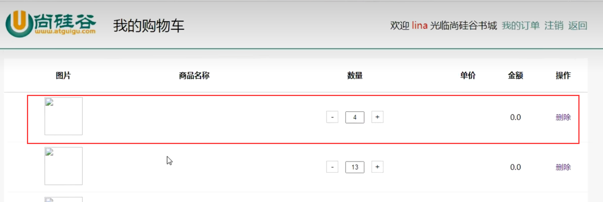


### 代码debug

#### 控制台信息

1. 显示cart.html中的某一段表达式有问题

- 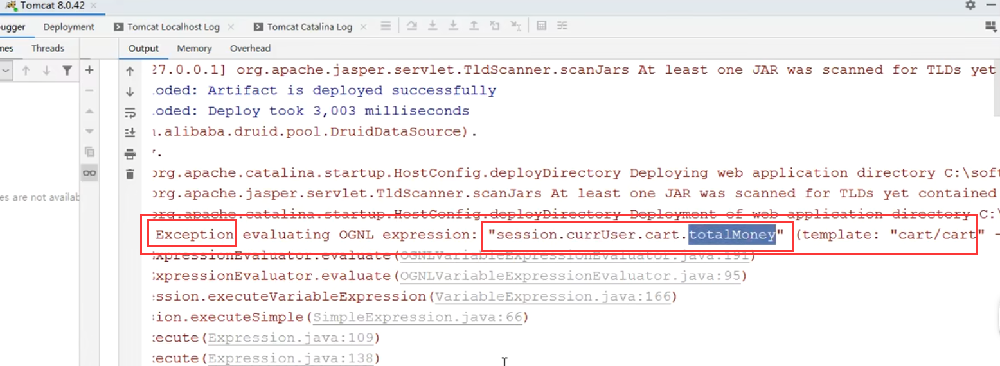
- 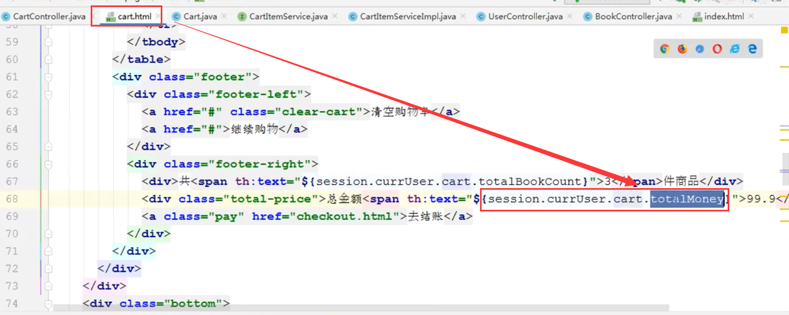

1. totalMoney有空指针异常

- 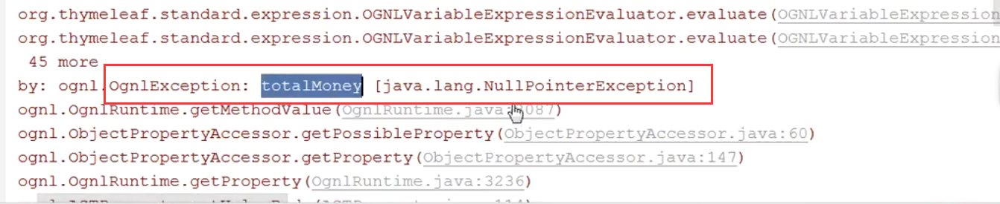


#### 设置断点

- 在控制台报错的totalMoney处设置断点查看

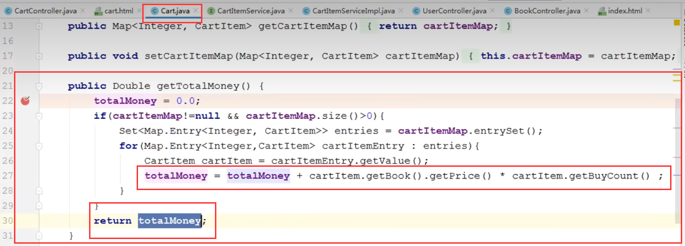

- 执行到下面这一步出现问题
- 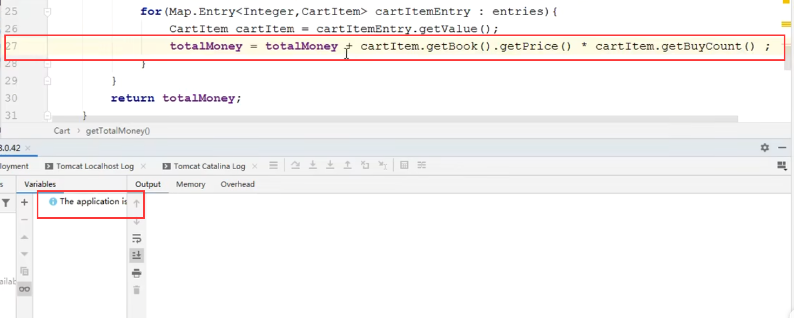

- 发现执行这句代码时，有的数据没有提取到
- 例如，下面数据里面，book对应的书本价格没有对应数据
- 

#### 分析原因

- 从CartItem中引用的book没有包含price选项
- 所以去查看CartItemService选项
- 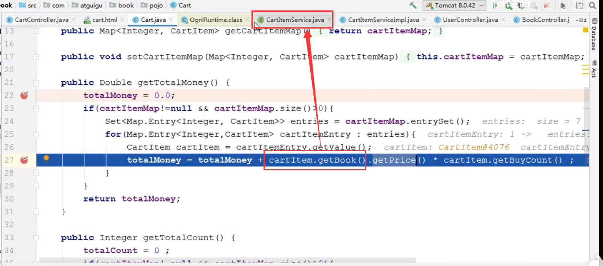

- 找到获取CartItem的方法 (这里以Cart的形式返回)
- 发现与Dao相关，所以再深入查找
- 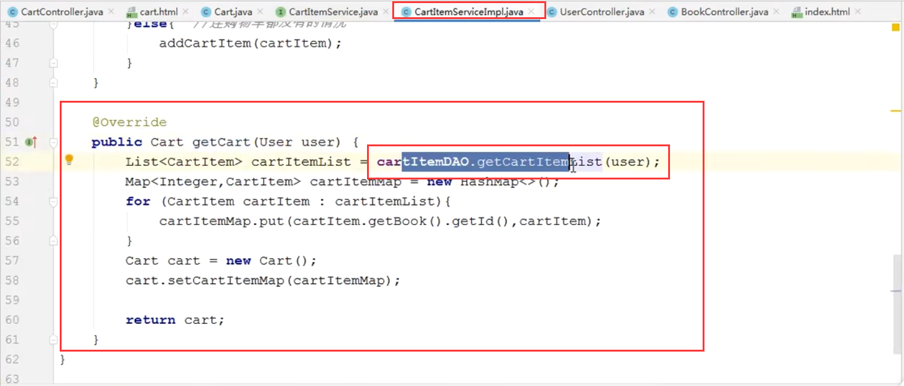

- 发现这里只是查找了数据库里面的t_cart_Item
- 但是里面只有书籍的book_ID
- 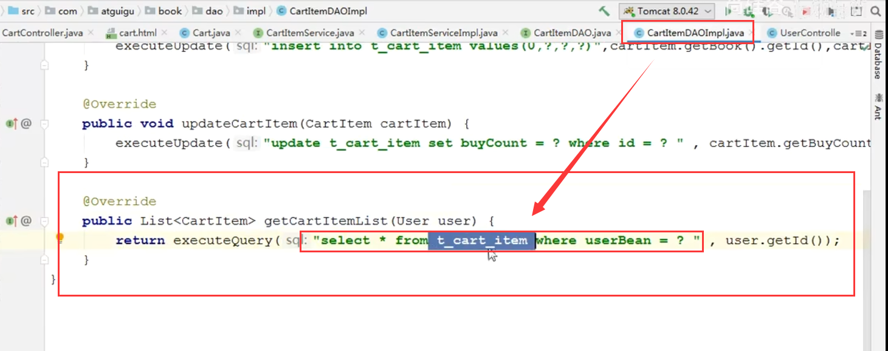

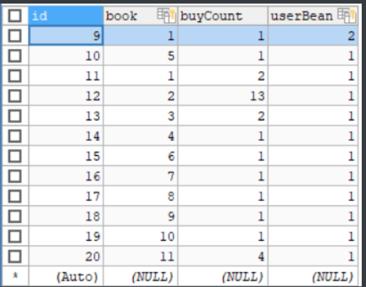

### 解决方法

- 在==CartItemService==中添加新的方法(用于获取Book的详细信息)，并修改原来不合适的代码 (用于获取Cart)
- 并且将该详细信息保存进，购物车项的的Book属性中去

#### 新加入的方法

```java
@Override
    //该方法会被getCart()方法调用，进而解决，获取Cart时，只得到BookID的问题
    public List<CartItem> getCartItemList(User user) {
        //查询 t_cart_item表获取购物车项列表
        List<CartItem> cartItemList = cartItemDAO.getCartItemList(user);
        //注入bookService，令bookService通过购物车项列表的每一个项所带的id获取对应book的详细信息
        for(CartItem cartItem : cartItemList){
            Book book = bookService.getBook(cartItem.getBook().getId());
            cartItem.setBook(book);
        }

        return cartItemList;
    }

```

#### 修改不合适的代码

```java
    @Override
    public Cart getCart(User user) {  //此处调用了上面自己的getCartItemList（）方法
        List<CartItem> cartItemList = getCartItemList(user);//通过DAO方法传入某一个用户的所有订单项，每个订单项代表了一种商品
        Map<Integer,CartItem> cartItemMap = new HashMap<>();//将这些订单项一次放入一个Map里面
        for (CartItem cartItem : cartItemList){
            cartItemMap.put(cartItem.getBook().getId(),cartItem);
        }
        Cart cart = new Cart();//新建一个cart对象，然后将新建的Map放入cart对象
        cart.setCartItemMap(cartItemMap);

        return cart;//返回新建的cart对象
    }
}
```

#### 原来不合适的代码

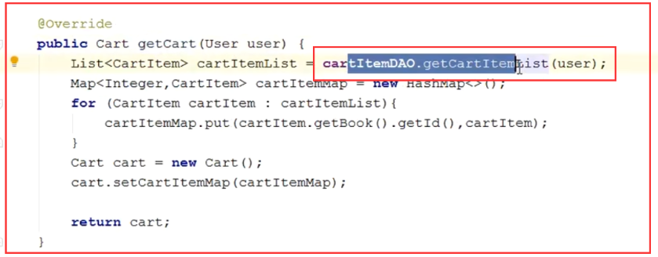


# 结账功能实现


## 功能分析

- 点击了下述按钮之后，后端会实现如下功能

  - 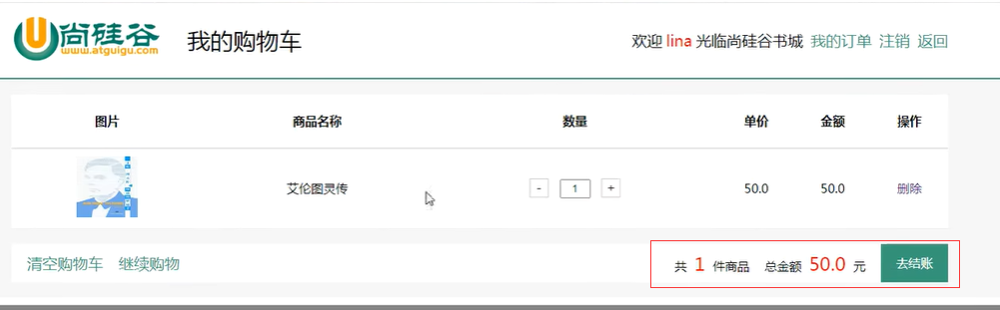

  1. 生成一条订单记录，存入数据库
     - 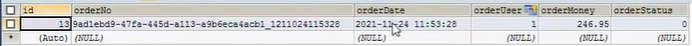
  2. 生成一份对应的订单详情，存入数据库
     - 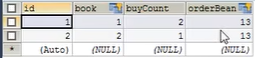
  3. 删除购物车的内容
     - 


## 功能实现过程

- 用户点击，前端传递
  - 触发了，orderController 的checkout()方法

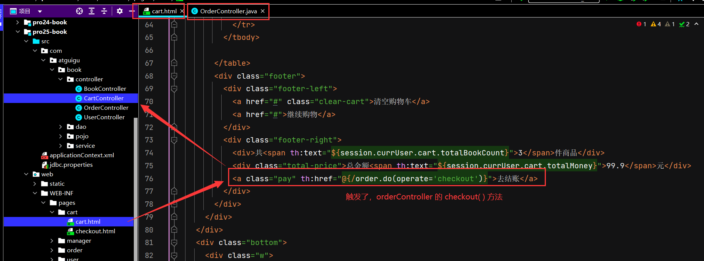

```java
public class OrderController {

    private OrderService orderService ;

    //结账
    public String checkout(HttpSession session){
        //创建一个空的订单类
        OrderBean orderBean = new OrderBean() ;
        //创建日期类
        Date now = new Date();
        int year = now.getYear();
        int month = now.getMonth() ;
        int day = now.getDate();
        int hour = now.getHours();
        int min = now.getMinutes() ;
        int sec = now.getSeconds() ;
        //设置订单类的setOrderNo()属性
        orderBean.setOrderNo(UUID.randomUUID().toString()+"_"+year+month+day+hour+min+sec);
        //设置订单类的setOrderDate()属性
        orderBean.setOrderDate(now);

        //获取当前用户
        User user =(User)session.getAttribute("currUser");
        //设置订单类的用户属性
        orderBean.setOrderUser(user);
        //设置订单类的总花费属性
        orderBean.setOrderMoney(user.getCart().getTotalMoney());
        //设置订单状态
        orderBean.setOrderStatus(0);

        //调用Service中添加订单的方法
        orderService.addOrderBean(orderBean);

        return "index" ;
    }
    
   }
```

- 调用Service中添加订单的方法
  1. 订单表添加一条记录
  2. 订单详情表添加的记录
  3. 购物车项表中需要删除对应的7条记录

```java
public class OrderServiceImpl implements OrderService {

    private OrderDAO orderDAO ;
    private OrderItemDAO orderItemDAO ;
    private CartItemDAO cartItemDAO ;

    @Override
    public void addOrderBean(OrderBean orderBean) {
        //1) 订单表添加一条记录
        //2) 订单详情表添加7条记录
        //3) 购物车项表中需要删除对应的7条记录

        //第1步：
        orderDAO.addOrderBean(orderBean);   //执行完这一步，orderBean中的id是有值的

        //第2步：
        //orderBean中的orderItemList是空的，此处我们应该根据用户的购物车中的购物车项去转换成一个一个的订单项
        User currUser = orderBean.getOrderUser();
        Map<Integer, CartItem> cartItemMap = currUser.getCart().getCartItemMap();
        for(CartItem cartItem : cartItemMap.values()){
            OrderItem orderItem = new OrderItem();
            orderItem.setBook(cartItem.getBook());
            orderItem.setBuyCount(cartItem.getBuyCount());
            orderItem.setOrderBean(orderBean);
            orderItemDAO.addOrderItem(orderItem);
        }

        //第3步：

        for(CartItem cartItem : cartItemMap.values()){
            cartItemDAO.delCartItem(cartItem);
        }

        //准确来讲，上面2，3步就是将购物车里的数据提取出来，传入到orderbean对象的map属性中，然后购物车再从数据库里删除数据
    }

    @Override
    public List<OrderBean> getOrderList(User user) {
        List<OrderBean> orderBeanList = orderDAO.getOrderList(user);

        for (OrderBean orderBean: orderBeanList) {
            Integer totalBookCount = orderDAO.getOrderTotalBookCount(orderBean);
            orderBean.setTotalBookCount(totalBookCount);
        }

        return orderBeanList ;
    }
}

```

- 底层就是调用OrdeDao方法，进行增删改查


# 计算订单数量


## 实现购物车实时加载

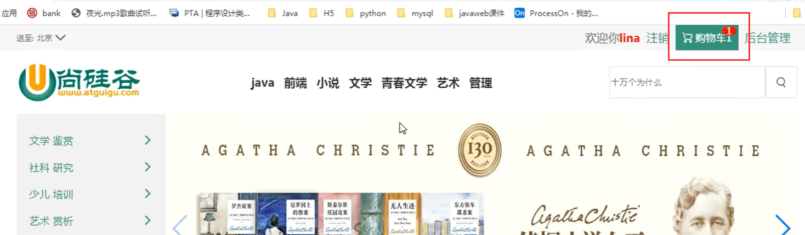

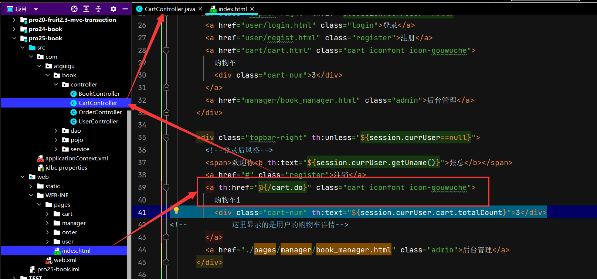

- 这里跳转到CartController之后，==默认执行的就是CartController的index( ) 方法==

- ```java
  public class CartController {
  
      private CartItemService cartItemService ;
  
      //加载当前用户的购物车信息
      public String index(HttpSession session){
          User user =(User)session.getAttribute("currUser");
          Cart cart = cartItemService.getCart(user);
          user.setCart(cart);
          session.setAttribute("currUser",user);
          return "cart/cart";
      //跳转到pro25-book\web\WEB-INF\pages\cart\cart.html
      }
  
      public String addCart(Integer bookId , HttpSession session){
          //当前用户的cart就存放在session的user对象里面
          User user = (User)session.getAttribute("currUser");
          CartItem cartItem = new CartItem(new Book(bookId),1,user);
          //将指定的图书添加到当前用户的购物车中
          cartItemService.addOrUpdateCartItem(cartItem,user.getCart());
  
          return "redirect:cart.do";//最后再跳转到cartcontroller的index方法上上面去
          // 因为在跳转过来的时候没有添加operate
      }
  
      public String editCart(Integer cartItemId , Integer buyCount){
          cartItemService.updateCartItem(new CartItem(cartItemId , buyCount));
          return "redirect:cart.do";
      }
  }
  ```


## 实现查看订单列表

### 前后端代码改进 (一)

#### 代码

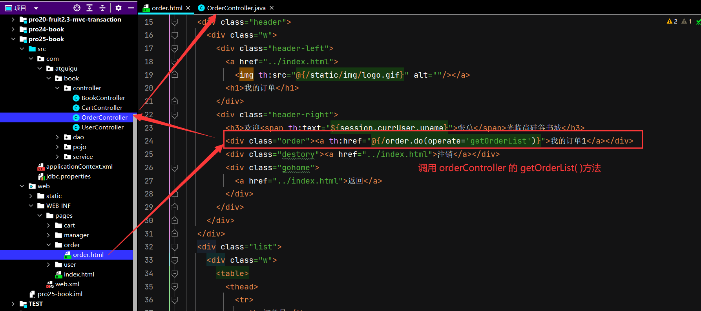

```java
public class OrderController {

    private OrderService orderService ;

    //结账
    public String checkout(HttpSession session){
        //创建一个空的订单类
        OrderBean orderBean = new OrderBean() ;
        //创建日期类
        Date now = new Date();
        int year = now.getYear();
        int month = now.getMonth() ;
        int day = now.getDate();
        int hour = now.getHours();
        int min = now.getMinutes() ;
        int sec = now.getSeconds() ;
        //设置订单类的setOrderNo()属性
        orderBean.setOrderNo(UUID.randomUUID().toString()+"_"+year+month+day+hour+min+sec);
        //设置订单类的setOrderDate()属性
        orderBean.setOrderDate(now);

        //获取当前用户
        User user =(User)session.getAttribute("currUser");
        //设置订单类的用户属性
        orderBean.setOrderUser(user);
        //设置订单类的总花费属性
        orderBean.setOrderMoney(user.getCart().getTotalMoney());
        //设置订单状态
        orderBean.setOrderStatus(0);

        //调用Service中添加订单的方法
        orderService.addOrderBean(orderBean);

        return "index" ;
    }

    //查看订单列表
    public String getOrderList(HttpSession session){
        User user =(User)session.getAttribute("currUser");

        List<OrderBean> orderList = orderService.getOrderList(user);
        user.setOrderList(orderList);
        //在user中新添加一个list属性,然后将获取的该用户的订单list放入当前用户的list中

        session.setAttribute("currUser",user);//在session中添加当前user

        //返回到Order.html
        return "order/order" ;
    }
}

```

#### 实现效果

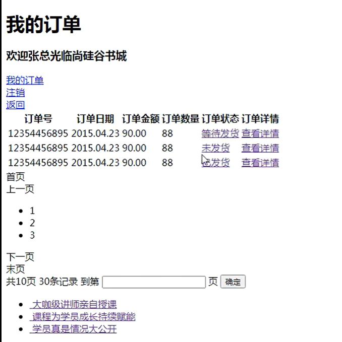


### 前后端代码改进 (二)

#### 前端

- 修改路径

```html
<!DOCTYPE html>
<html lang="en" xmlns:th="http://www.thymeleaf.org">
  <head>
    <meta charset="UTF-8" />
    <meta name="viewport" content="width=device-width, initial-scale=1.0" />
    <title>我的订单</title>
    <link rel="stylesheet" th:href="@{/static/css/minireset.css}" />
    <link rel="stylesheet" th:href="@{/static/css/common.css}" />
    <link rel="stylesheet" th:href="@{/static/css/cart.css}" />

    <link rel="stylesheet" th:href="@{/static/css/bookManger.css}" />
    <link rel="stylesheet" th:href="@{/static/css/orderManger.css}" />
  </head>
 
```

```html
// 可以运用前端的替换语法 
<body>
    <div class="header">
      <div class="w">
        <div class="header-left">
          <a href="../index.html">
            </a>
          <h1>我的订单</h1>
        </div>
        <div class="header-right">
          <h3>欢迎<span th:text="${session.currUser.uname}">张总</span>光临尚硅谷书城</h3>
          <div class="order"><a th:href="@{/order.do(operate='getOrderList')}">我的订单1</a></div>
          <div class="destory"><a href="../index.html">注销</a></div>
          <div class="gohome">
            <a href="../index.html">返回</a>
          </div>
        </div>
      </div>
    </div>
    <div class="list">
      <div class="w">
        <table>
          <thead>
            <tr>
              <th>订单号</th>
              <th>订单日期</th>
              <th>订单金额</th>
              <th>订单数量</th>
              <th>订单状态</th>
              <th>订单详情</th>
            </tr>
          </thead>

```

==下面的代码是精华片段==

```html
          <tbody>
            <tr th:each="orderBean : ${session.currUser.orderList}" th:object="${orderBean}">
<!--              从session中循环获取每一个orderbean-->
              <td th:text="*{orderNo}">12354456895</td>
              <td th:text="*{orderDate}">
                2015.04.23
              </td>
              <td th:text="*{orderMoney}">90.00</td>
              <td th:text="*{totalBookCount}">88</td>
              <td><a href="" class="send">等待发货</a></td>
              <td><a href="">查看详情</a></td>
            </tr>

          </tbody>
```

```html
      </table>
        <div class="footer">
          <div class="footer-right">
            <div>首页</div>
            <div>上一页</div>
            <ul>
              <li class="active">1</li>
              <li>2</li>
              <li>3</li>
            </ul>
            <div>下一页</div>
            <div>末页</div>
            <span>共10页</span>
            <span>30条记录</span>
            <span>到第</span>
            <input type="text" />
            <span>页</span>
            <button>确定</button>
          </div>
        </div>
      </div>
    </div>
    <div class="bottom">
      <div class="w">
        <div class="top">
          <ul>
            <li>
              <a href="">
                
                <span>大咖级讲师亲自授课</span>
              </a>
            </li>
            <li>
              <a href="">
                
                <span>课程为学员成长持续赋能</span>
              </a>
            </li>
            <li>
              <a href="">
                
                <span>学员真是情况大公开</span>
              </a>
            </li>
          </ul>
        </div>
        <div class="content">
          <dl>
            <dt>关于尚硅谷</dt>
            <dd>教育理念</dd>
            <!-- <dd>名师团队</dd>
            <dd>学员心声</dd> -->
          </dl>
          <dl>
            <dt>资源下载</dt>
            <dd>视频下载</dd>
            <!-- <dd>资料下载</dd>
            <dd>工具下载</dd> -->
          </dl>
          <dl>
            <dt>加入我们</dt>
            <dd>招聘岗位</dd>
            <!-- <dd>岗位介绍</dd>
            <dd>招贤纳师</dd> -->
          </dl>
          <dl>
            <dt>联系我们</dt>
            <dd>http://www.Novice.com</dd>
            <dd></dd>
          </dl>
        </div>
      </div>
      <div class="down">
        尚硅谷书城.Copyright ©2015
      </div>
    </div>
  </body>
</html>

```


#### 后端 

- 下面的代码主要是为了获取购买的数目

##### OrderController

```java
public class OrderController {

    private OrderService orderService ;

    //结账
    public String checkout(HttpSession session){
        //创建一个空的订单类
        OrderBean orderBean = new OrderBean() ;
        //创建日期类
        Date now = new Date();
        int year = now.getYear();
        int month = now.getMonth() ;
        int day = now.getDate();
        int hour = now.getHours();
        int min = now.getMinutes() ;
        int sec = now.getSeconds() ;
        //设置订单类的setOrderNo()属性
        orderBean.setOrderNo(UUID.randomUUID().toString()+"_"+year+month+day+hour+min+sec);
        //设置订单类的setOrderDate()属性
        orderBean.setOrderDate(now);

        //获取当前用户
        User user =(User)session.getAttribute("currUser");
        //设置订单类的用户属性
        orderBean.setOrderUser(user);
        //设置订单类的总花费属性
        orderBean.setOrderMoney(user.getCart().getTotalMoney());
        //设置订单状态
        orderBean.setOrderStatus(0);

        //调用Service中添加订单的方法
        orderService.addOrderBean(orderBean);

        return "index" ;
    }
```

==本小段用到的代码==

```java
 //查看订单列表
    public String getOrderList(HttpSession session){
        User user =(User)session.getAttribute("currUser");

        List<OrderBean> orderList = orderService.getOrderList(user);
        user.setOrderList(orderList);//在user中新添加一个list属性,然后将获取的该用户的订单list放入当前用户的list中

        session.setAttribute("currUser",user);//在session中添加当前user

        return "order/order" ;
    }
}
```


##### OrderServiceImpl

```java
public class OrderServiceImpl implements OrderService {

    private OrderDAO orderDAO ;
    private OrderItemDAO orderItemDAO ;
    private CartItemDAO cartItemDAO ;

    @Override
    public void addOrderBean(OrderBean orderBean) {
        //1) 订单表添加一条记录
        //2) 订单详情表添加7条记录
        //3) 购物车项表中需要删除对应的7条记录

        //第1步：
        orderDAO.addOrderBean(orderBean);   //执行完这一步，orderBean中的id是有值的

        //第2步：
        //orderBean中的orderItemList是空的，此处我们应该根据用户的购物车中的购物车项去转换成一个一个的订单项
        User currUser = orderBean.getOrderUser();
        Map<Integer, CartItem> cartItemMap = currUser.getCart().getCartItemMap();
        for(CartItem cartItem : cartItemMap.values()){
            OrderItem orderItem = new OrderItem();
            orderItem.setBook(cartItem.getBook());
            orderItem.setBuyCount(cartItem.getBuyCount());
            orderItem.setOrderBean(orderBean);
            orderItemDAO.addOrderItem(orderItem);
        }

        //第3步：

        for(CartItem cartItem : cartItemMap.values()){
            cartItemDAO.delCartItem(cartItem);
        }

        //准确来讲，上面2，3步就是将购物车里的数据提取出来，传入到orderbean对象的map属性中，然后购物车再从数据库里删除数据
    }

```

==本小段用到的代码==

```java
   @Override
    public List<OrderBean> getOrderList(User user) {
        List<OrderBean> orderBeanList = orderDAO.getOrderList(user);

        for (OrderBean orderBean: orderBeanList) {
            Integer totalBookCount = orderDAO.getOrderTotalBookCount(orderBean);
            orderBean.setTotalBookCount(totalBookCount);
        }

        return orderBeanList ;
    }
}
```


##### OrderDAOImpl

```java
public class OrderDAOImpl extends BaseDAO<OrderBean> implements OrderDAO {
    @Override
    public void addOrderBean(OrderBean orderBean) {  //这里的t_order就是总的订单
        int orderBeanId = super.executeUpdate("insert into t_order values(0,?,?,?,?,?)",orderBean.getOrderNo(),orderBean.getOrderDate(),orderBean.getOrderUser().getId(),orderBean.getOrderMoney(),orderBean.getOrderStatus());
        orderBean.setId(orderBeanId);  //向总订单插入数据后，将订单的自增id返回给总订单对应的object
        //思考： 此处为什么需要接受executeUpdate的返回值，然后设置到OrderBean中的id属性上？
    }

    @Override
    public List<OrderBean> getOrderList(User user) {
        return executeQuery("SELECT * FROM t_order WHERE orderUser = ?",user.getId());
        //获取某个用户的所有订单组成的列表
    }
```

==本小段用到的代码==

```java
  @Override
    public Integer getOrderTotalBookCount(OrderBean orderBean) {
        String sql = "SELECT SUM(t3.buyCount) AS totalBookCount , t3.orderBean FROM " +
                "(" +
                "SELECT t1.id , t2.buyCount , t2.orderBean FROM t_order t1 INNER JOIN t_order_item t2 " +
                "ON t1.id = t2.orderBean WHERE t1.orderUser = ? " +
                ") t3 WHERE t3.orderBean = ? GROUP BY t3.orderBean" ;
        return ((BigDecimal)executeComplexQuery(sql,orderBean.getOrderUser().getId(),orderBean.getId())[0]).intValue();
    }//通过订单号获取对应订单的商品数量
}
```

##### OrderBean_Pojo

```java
public class OrderBean { //总订单
    private Integer id ;
    private String orderNo ;
    //订单编号
    private Date orderDate;
    //订单日期
    private User orderUser ;
    //订单用户
    private Double orderMoney ;
    //订单金额
    private Integer orderStatus;
    //订单状态

    private Integer totalBookCount ;
    //所有书本订单数量

    private List<OrderItem> orderItemList ;     //1:N
    //订单项数组

    public OrderBean(){}
    public OrderBean(Integer id){
        this.id= id;
    }

    public Integer getId() {
        return id;
    }

    public void setId(Integer id) {
        this.id = id;
    }

    public String getOrderNo() {
        return orderNo;
    }

    public void setOrderNo(String orderNo) {
        this.orderNo = orderNo;
    }

    public Date getOrderDate() {
        return orderDate;
    }

    public void setOrderDate(Date orderDate) {
        this.orderDate = orderDate;
    }

    public User getOrderUser() {
        return orderUser;
    }

    public void setOrderUser(User orderUser) {
        this.orderUser = orderUser;
    }

    public Double getOrderMoney() {
        return orderMoney;
    }

    public void setOrderMoney(Double orderMoney) {
        this.orderMoney = orderMoney;
    }

    public Integer getOrderStatus() {
        return orderStatus;
    }

    public void setOrderStatus(Integer orderStatus) {
        this.orderStatus = orderStatus;
    }

    public List<OrderItem> getOrderItemList() {
        return orderItemList;
    }

    public void setOrderItemList(List<OrderItem> orderItemList) {
        this.orderItemList = orderItemList;
    }
```

==本小段用到的代码==

```java
 public void setTotalBookCount(Integer totalBookCount) {
        this.totalBookCount = totalBookCount;
    }

    public Integer getTotalBookCount() {
        return totalBookCount;
    }
}

```


# 编辑购物车和合法用户过滤器的添加


## 编辑购物车

### 功能分析

- 实现效果
- 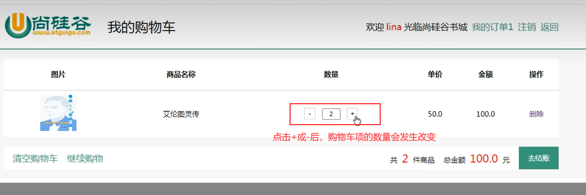


- 过程分析
  - 前端根据用户点击产生的数据，调用对应script方法，并将参数传递给script
  - script调用后端的购物车项更新代码，并将数据传递给后端用于更新
  - 后端将数据传递给数据库，然后返回到新数据的页面


### 代码实现细节

#### 前端代码

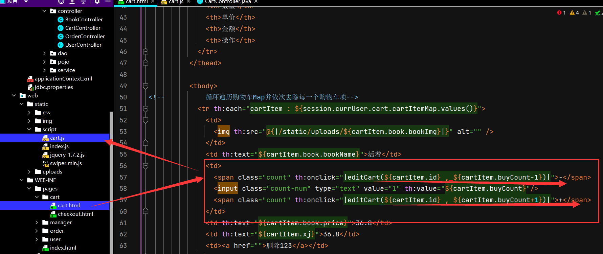

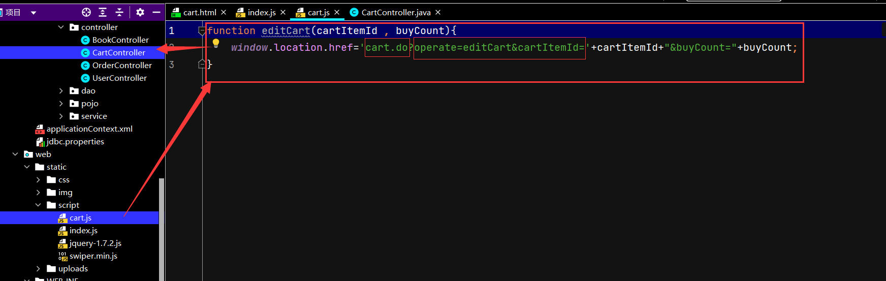


#### 后端代码

##### CartController

```java
public class CartController {

    private CartItemService cartItemService ;

    //加载当前用户的购物车信息
    public String index(HttpSession session){
        User user =(User)session.getAttribute("currUser");
        Cart cart = cartItemService.getCart(user);
        user.setCart(cart);
        session.setAttribute("currUser",user);
        return "cart/cart";
    //跳转到pro25-book\web\WEB-INF\pages\cart\cart.html
    }

    public String addCart(Integer bookId , HttpSession session){
        //当前用户的cart就存放在session的user对象里面
        User user = (User)session.getAttribute("currUser");
        CartItem cartItem = new CartItem(new Book(bookId),1,user);
        //将指定的图书添加到当前用户的购物车中
        cartItemService.addOrUpdateCartItem(cartItem,user.getCart());

        return "redirect:cart.do";//最后再跳转到cartcontroller的index方法上上面去
        // 因为在跳转过来的时候没有添加operate
    }
```

==使用到的代码==

```java
   public String editCart(Integer cartItemId , Integer buyCount){
        cartItemService.updateCartItem(new CartItem(cartItemId , buyCount));
        return "redirect:cart.do";
    }
}
```

- 这里会调用 cartItemService 的 updateCartItem( )方法，然后会向该方法中传入新CartItem对象
- 该对象是通过，script传递过来的数据构建的


## Double数据运算过程中精度调整

### 问题现象

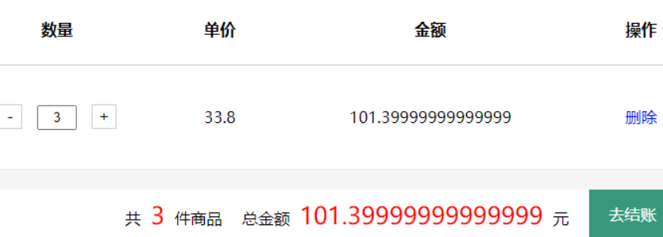

### 解决方案

- 使用BigDecimal类型来进行Double类型数据运算
- 创建BigDecimal类型对象时将Double类型的数据转换为字符串

Cart类：

```java
// 计算总金额
public Double getTotalAmount() {

    // 1.声明一个变量用于存储累加结果
    BigDecimal sum = new BigDecimal("0.0");

    // 2.遍历Map集合
    Set<String> keySet = cartItemMap.keySet();

    for (String key : keySet) {
        CartItem cartItem = cartItemMap.get(key);
        Double amount = cartItem.getAmount();

        sum = sum.add(new BigDecimal(amount + ""));
    }

    // 3.返回累加结果
    return sum.doubleValue();

}
```

CartItem类：

```java
// 获取金额时需要计算得到
public Double getAmount() {

    BigDecimal bigDecimalCount = new BigDecimal(this.count + "");
    BigDecimal bigDecimalPrice = new BigDecimal(this.price + "");

    BigDecimal multiReuslt = bigDecimalCount.multiply(bigDecimalPrice);

    return multiReuslt.doubleValue();
}
```


## 合法用户过滤器的添加


### 功能分析

- 因为当前用户的信息，都是从session中获得的
- 如果没有该用户信息，那么访问某些页面的时候，就会出一些问题
- 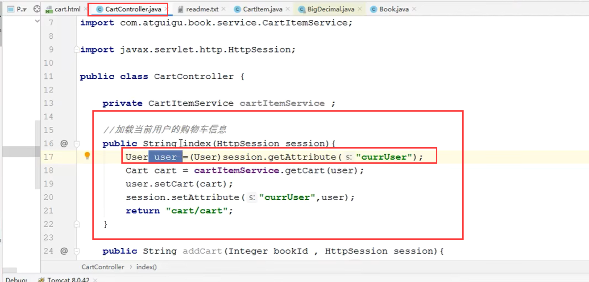
- ==所以需要添加一个过滤器==
  - 过滤器中应该有一个白名单
  - 如果是请求的是登录 / 注册 / index，那么可以放行
  - 如果是其他请求就强制返回登录或注册页面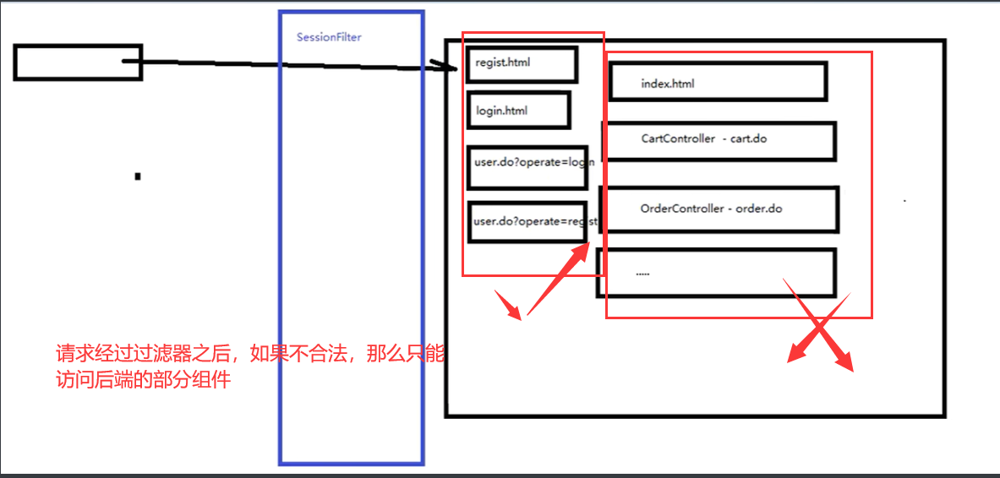


### 过滤器实现代码

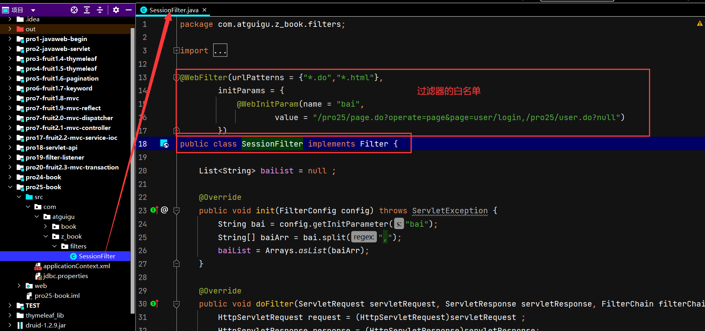

```java

@WebFilter(urlPatterns = {"*.do","*.html"},
        initParams = {
            @WebInitParam(name = "bai",
                    value = "/pro25/page.do?operate=page&page=user/login,/pro25/user.do?null")
        })


public class SessionFilter implements Filter {

    List<String> baiList = null ;

    @Override
    public void init(FilterConfig config) throws ServletException {
        String bai = config.getInitParameter("bai");
        String[] baiArr = bai.split(",");
        baiList = Arrays.asList(baiArr);
    }

    @Override
    public void doFilter(ServletRequest servletRequest, ServletResponse servletResponse, FilterChain filterChain) throws IOException, ServletException {
        HttpServletRequest request = (HttpServletRequest)servletRequest ;
        HttpServletResponse response = (HttpServletResponse)servletResponse;

        //http://localhost:8080/pro25/page.do?operate=page&page=user/login
        //System.out.println("request.getRequestURI() = " + request.getRequestURI());
        //System.out.println("request.getQueryString() = " + request.getQueryString());

        //获取请求的数据
        String uri = request.getRequestURI() ;
        String queryString = request.getQueryString() ;
        //对数据进行拼接
        String str = uri + "?" + queryString ;
        //如果白名单里面包含了对应的数据，那么就放行到下一个过滤器
        if(baiList.contains(str)){
            filterChain.doFilter(request,response);
        }else{//如果没有包含那就进行重定向
            HttpSession session = request.getSession() ;
            Object currUserObj = session.getAttribute("currUser");

            if(currUserObj==null){
                response.sendRedirect("page.do?operate=page&page=user/login");
            }else{
                filterChain.doFilter(request,response);
            }
        }
    }

    @Override
    public void destroy() {

    }
}
```

