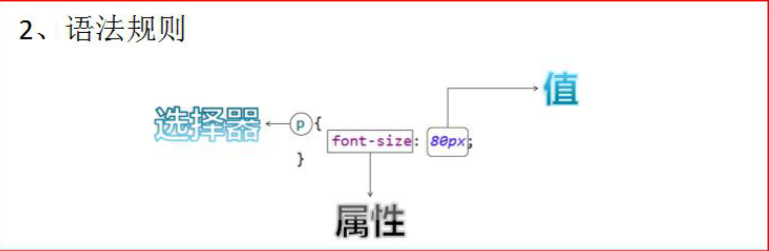
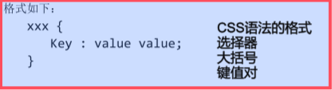
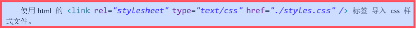
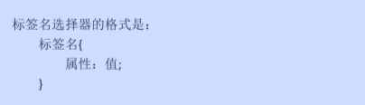
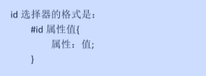
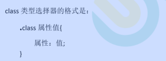
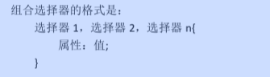

**文档:CSS2.0.chm**

# CSS 技术介绍

```apl
CSS 是「层叠样式表单」。是用于(增强)控制网页样式并允许将样式信息与网页内容分离的一种标记性语言。
```

# CSS 语法规则



```apl
1. 选择器：
   浏览器根据“选择器”决定受 CSS 样式影响的HTML 元素（标签）。 

2. 属性 (property) 
   是要改变的样式名，并且每个属性都有一个值。
   属性和值被冒号分开，并 由花括号包围，这样就组成了一个完整的样式声明（declaration）
   例如：p {color: blue} 

3. 多个声明：
   如果要定义不止一个声明，则需要用分号将每个声明分开。
   虽然最后一条声明的最后可以不加分号(但尽量在每条声明的末尾都加上分号)
   
4. CSS 注释：
   /*注释内容*/
```

# CSS 和HTML 的结合方式

## 第一种： 

```apl
在标签的 style 属性上设置”key:value value;”，修改标签样式。
```

```html
<!DOCTYPE html>
<html lang="en">
<head>
    <meta charset="UTF-8">
    <title>Title</title>
</head>
<body>
<!--
  需求
  1：分别定义两个 div、span 标签，
    分别修改每个 div 标签的样式为：
      边框 1 个像素(粗细)
      实线 (样式)
      红色 (颜色)
 -->

<div style="border: 10px solid #bd0f0f; width: 1000px; height: 100px; background-color: aqua; text-align: center;">div标签1</div>

<span style="border: 10px solid #bd0f0f ; ">span标签1</span>

<p style="border: 10px solid #bd0f0f ; ">p 段落标签1</p>


</body>
</html>
```

```apl
缺点：
    1. 如果标签多了。样式多了。代码量非常庞大。 
    2. 可读性非常差。
    3. Css 代码没什么复用性可方言。
```


## 第二种：

```apl
在 head 标签中，使用 style 标签来定义各种自己需要的 css 样式
```



```html
<!DOCTYPE html>
<html lang="en">
<head>
    <meta charset="UTF-8">
    <title>Title</title>

    <!--style 标签专门用来定义 css 样式代码-->
    <style type="text/css">
        /*
        需求 1：分别定义两个 div、span 标签，分别修改每个 div 标签的样式为：边框 1 个像素，实线，红色
         */
        div{
            border: 5px solid red;
        }
        span{
            border: 5px solid red;
        }
    </style>
</head>
<body>

<div>div标签1</div>
<div>div标签2</div>
<div>div标签3</div>

<span >span标签1</span>

<p>p 段落标签1</p>

</body>
</html>
```

```apl
缺点:
1. 只能在同一页面内复用代码，不能在多个页面中复用 css 代码。
2. 维护起来不方便，实际的项目中会有成千上万的页面，要到每个页面中去修改。工作量太大了。
```

## 第三种

```apl
把 css 样式写成一个单独的 css 文件，再通过 link 标签引入即可复用。
```



### css 文件内容：

```apl
div{
    border: 2px solid red;
}
span{
    border: 2px solid red;
}
```

### html 文件代码：

```html
<!DOCTYPE html>
<html lang="en">
<head>
    <meta charset="UTF-8">
    <title>Title</title>
    	<!---->
    <link rel="stylesheet" type="text/css" href="-3.1.css">
    	<!---->
</head>
<body>

<div>div标签1</div>
<div>div标签2</div>
<div>div标签3</div>

<span >span标签1</span>

<p>p 段落标签1</p>

</body>
</html>
```

# CSS 选择器

## 标签名选择器



```apl
标签名选择器，可以决定哪些标签被动的使用这个样式。
```

```html
<!DOCTYPE html>
<html>
<head>
	<meta charset="UTF-8">
	<title>CSS选择器</title>
	<style type="text/css">
		div{
			border: 1px solid yellow;
			color: blue;
			font-size: 30px;
		}
		span{
			border: 5px dashed blue;
			color: yellow;
			font-size: 20px;
		}
	</style>
</head>
<body>		
	<!-- 
	需求1：
        在所有div标签上
            修改字体颜色为蓝色
            字体大小30个像素
            边框为1像素黄色实线

        并且修改所有span 标签的
            字体颜色为黄色
            字体大小20个像素
            边框为5像素蓝色虚线
	 -->
	<div>div标签1</div>
	<div>div标签2</div>
	<span>span标签1</span>
	<span>span标签2</span>
	
</body>
</html>
```

## id 选择器



```apl
id 选择器，可以让我们通过 id 属性选择性的去使用这个样式。
但无法同时被两个标签使用
```

```html
<!DOCTYPE html>
<html>
<head>
	<meta charset="UTF-8">
	<title>ID选择器</title>
	<style>
		#id001{
			color: blue;
			font-size: 30px;
			border: 3px yellow solid;
		}
		#id002{
			color: #bd0f0f;
			font-size: 20px;
			border: 5px blue dotted;
		}
	</style>
</head>
<body>		
	
	<!-- 
	需求1：分别定义两个 div 标签，

	第一个div 标签定义
		id 为 id001
		根据id属性定义
			css样式修改字体颜色为蓝色，
			字体大小30个像素。边框为1像素黄色实线。
	
	第二个div 标签定义
		id 为 id002
		然后根据id 属性定义
			css样式 修改的字体颜色为红色，
			字体大小20个像素。边框为5像素蓝色点线。
	 -->
	
	<div id="id001">div标签1</div>
	<div id="id002">div标签2</div>
	<!--<span id="id002">sapn标签</span>-->
	<!--通过id选择器，选择性的使用id样式，但无法同时被两个标签使用-->
</body>
</html>
```

## class 选择器（类选择器）



```apl
class 类型选择器，可以通过 class 属性有效的选择性地去使用这个样式。
```

```html
<!DOCTYPE html>
<html>
<head>
<meta charset="UTF-8">
<title>class类型选择器</title>
	<style>
		.class01{
			color: blue;
			font-size: 30px;
			border: 1px solid yellow;
		}
		.class02{
			color: gray;
			font-size: 26px;
			border: 1px solid red;
		}

	</style>
</head>
<body>

	<!-- 
		需求1：修改 class 属性值为 class01的 span 或 div 标签，字体颜色为蓝色，字体大小30个像素。边框为1像素黄色实线。
		需求2：修改 class 属性值为 class02的 div 标签，字体颜色为灰色，字体大小26个像素。边框为1像素红色实线。
	 -->

	<div class="class01">div标签class01</div>
	<div class="class02">div标签</div>
	<span class="class01">span标签class01</span>
	<span class="class02">span标签2</span>

	<!--class貌似可以重复使用-->

</body>
</html>
```

## 组合选择器



```apl
组合选择器可以让多个选择器共用同一个 css 样式代码。
```

```html
<!DOCTYPE html>
<html>
<head>
<meta charset="UTF-8">
<title>class类型选择器</title>
    <style>
        .class01,#id01{
            color: blue;
            font-size: 20px;
            border: 5px solid yellow;

        }
    </style>
</head>
<body>

	<!-- 
	需求1：修改
	class="class01" 的div 标签
	和
	id="id01" 所有的span标签，
        字体颜色为蓝色，
        字体大小20个像素。
        边框为1像素黄色实线。
	 -->

   <div class="class01">div标签class01</div> <br />
   <span id="id01">span 标签</span>  <br /> 
   <div class="class01">div标签</div> <br />
   <div>div标签id01</div> <br />

</body>
</html>
```

## 常用样式：

### 1、字体颜色 

```apl
color ：red； 
```

```apl
颜色可以写颜色名如：black, blue, red, green 等 

颜色也可以写 rgb 值和十六进制表示值：如 rgb(255,0,0)，#00F6DE。

如果写十六进制值必须加#
```

### 2、宽度 

```
width:19px;
```

```
宽度可以写像素值：19px； 也可以写百分比值：20%；
```


### 3、高度 

```
height : 20px;
```

```
高度可以写像素值：19px； 也可以写百分比值：20%；
```


### 4、背景颜色 

```
background-color : #0F2D4C
```


### 5、字体样式：

```apl
color：#FF0000；	字体颜色红色 

font-size：20px; 	  字体大小
```


### 6、红色 1 像素实线边框

```apl
 border：1px solid red;
```


### 7、DIV 居中

```apl
margin-left : auto; 

margin-right : auto;
```


### 8、文本居中：

```apl
text-align : center;
```


### 9、超连接去下划线

```apl
 text-decoration : none;
```


### 10、表格细线

```apl
table { 
    border: 1px solid black; /*设置边框*/ 

    border-collapse: collapse; /*将边框合并*/
} 

td,th { 
	border: 1px solid black; /*设置边框*/
}
```


### 11、列表去除修饰

```apl
ul {
	list-style : none;
}
```

## 实例

### 未添加效果

```html
<!DOCTYPE html>
<html>
<head>
<meta charset="UTF-8">
<title>06-css常用样式.html</title>

</head>


<body>

<div>div标签</div>
<a href="http://www.baidu.com">百度</a>

<table>

    <tr>
        <td>1.1</td>
        <td>1.2</td>
    </tr>
</table>

<ul>
    <li>1111111</li>
    <li>1111111</li>
    <li>1111111</li>
    <li>1111111</li>
    <li>1111111</li>
</ul>

</body>
</html>
```

### 添加后效果

```html
<!DOCTYPE html>
<html>
<head>
<meta charset="UTF-8">
<title>06-css常用样式.html</title>
    <style>
        div{
            color: red;
            /*设置宽度与高度之前需要先设置边框*/
            border: 3px blue solid;
            width: 300px;
            height: 300px;
            background-color: aqua;
            font-size: 30px;
            /*边框居中*/
            margin-left: auto;/*左边默认*/
            margin-right: auto;
            /*文字居中*/
            text-align: center;
        }

        a{
            text-decoration: none;
        }

        table{
            border: 3px blue solid;
            /*合并表格中不同边框，使得边框之间没有间隙*/
            border-collapse: collapse;
        }
        td{
            border: 3px blue solid;
        }

        ul{
            list-style: none;
        }
    </style>
</head>


<body>

<div>div标签</div>
<a href="http://www.baidu.com">百度</a>

<table>

    <tr>
        <td>1.1</td>
        <td>1.2</td>
    </tr>
</table>

<ul>
    <li>1111111</li>
    <li>1111111</li>
    <li>1111111</li>
    <li>1111111</li>
    <li>1111111</li>
</ul>

</body>
</html>
```


