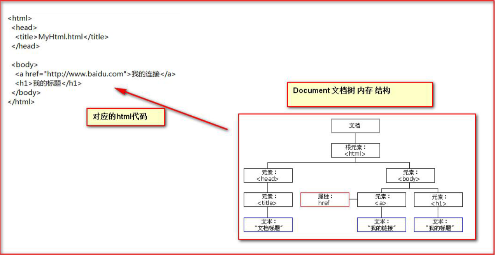

# JavaScript 介绍 

## 概念

```apl
Javascript 语言诞生主要是完成页面的'数据验证'。
因此它运行在客户端，需要运行浏览器来解析执行 JavaScript 代码。

 JS 是 Netscape 网景公司的产品，最早取名为 LiveScript;
为了吸引更多 java 程序员。更名为 JavaScript。
```

```apl
JS 是弱类型，Java 是强类型。

强类型,就是定义变量的时候。类型已确定。而且不可变。
    int i= 12;
弱类型就是类型可变。
    var i;
    i = 12;数值型
    i="abc"字符串类型
```

## 特点： 

```apl
1. 交互性（它可以做的就是信息的动态交互） 
2. 安全性（不允许直接访问本地硬盘） 
3. 跨平台性（只要是可以解释 JS 的浏览器都可以执行，和平台无关）
```

```apl
java的跨平台是通过JVM实现的，js的跨平台是通过浏览器来实现的浏览器的内核里面有is的解析器
```

# JS 与 html 代码结合

## 方式一

### 概念

```apl
只需要'在 head 标签'中，或者'在 body 标签'中， 使用 script 标签来书写 JavaScript 代码
```

### 实例

```html
<!DOCTYPE html>
<html lang="en">
<head>
    <meta charset="UTF-8">
    <title>Title</title>
    
    <script type="text/javascript">
        // alert是JavaScript语言提供的一个警告框函数。
        // 它可以接收任意类型的参数，这个参数就是警告框的提示信息
        alert("hello new world!")
    </script>
    
</head>
<body>

</body>
</html>
```

## 方式 二

### 概念

```apl
使用 script 标签引入 单独的 JavaScript 代码文件
```

```apl
为了复用代码，可以将代码单独的写在一个文件中，在页面要使用的时候，使用script标签来引入
```

### 1.js

```javascript
alert("hello new");
```

### test

```html
<!DOCTYPE html>
<html lang="en">
<head>
    <meta charset="UTF-8">
    <title>Title</title>
    <!--
        现在需要使用script引入外部的js文件来执行
            src 属性专门用来引入js文件路径（可以是相对路径，也可以是绝对路径）

        script标签可以用来定义js代码，也可以用来引入js文件
        但是，两个功能二选一使用。不能同时使用两个功能
        例如：
        <script type="text/javascript" src="1.js">
             alert("国哥现在可以帅了");
        </script>  # wrong
    -->

    <!--下面的两个是依次执行-->
    <script type="text/javascript" src="1.js">
    </script>
    
    <script type="text/javascript">
        alert("国哥现在可以帅了");
    </script>
    
</head>
<body>

</body>
</html>
```

# 变量 

## 概念

```apl
什么是变量？
变量是可以存放某些值的内存的命名。
```

```apl
JavaScript 的变量类型： 
1. 数值类型：	number 
2. 字符串类型： 	string
3. 对象类型：	object
4. 布尔类型： 	boolean 
5. 函数类型：	function
```

```apl
JavaScript 里特殊的值： 

1. undefined  
	未定义，所有 js 变量未赋于初始值的时候，默认值都是 undefined.
2. null 
	 空值
3. NaN
	全称是：Not a Number。非数字。非数值。
```

```apl
JS 中的定义变量格式：
    var 变量名;
    var 变量名 = 值;
```

## 实例

```html
<!DOCTYPE html>
<html lang="en">
<head>
    <meta charset="UTF-8">
    <title>Title</title>
    <script type="text/javascript">
        var i;
        // alert(i); // undefined

        i = 12;
        //alert(typeof(i)); //number
        // typeof()是JavaScript语言提供的一个函数。
        // 它可以取变量的数据类型返回

        i = "abc";
        //alert(typeof(i));  //String
        //js的变量是弱类型，赋值之后还可以赋值其他类型的变量

        var a = 12;
        var b = "abc";
        alert(a*b);  // NaN是非数字，非数值。

    </script>
</head>
<body>

</body>
</html>
```

# 变量的运算

## 关系(比较)运算

```apl
等于:	==	等于是简单的做字面值的比较
全等于: ===	除了做字面值的比较之外，还会比较两个变量的数据类型
```

```html
<!DOCTYPE html>
<html lang="en">
<head>
    <meta charset="UTF-8">
    <title>Title</title>
    <script type="text/javascript">

        var a = "50";
        var b = 50;

        alert(a == b);  //true
        alert(a === b);  //false

    </script>
</head>
<body>

</body>
</html>
```

## 逻辑运算

```apl
且运算： && 
或运算： || 
取反运算： !
```

```apl
在 JavaScript 语言中，所有的变量，都可以做为一个 boolean 类型的变量去使用。 

0 、null、 undefined、""(空串) 都认为是 false；
```

```java
/* 

&& 且运算，有两种情况： 
    第一种：当表达式全为真的时候。返回最后一个表达式的值。 
    第二种：当表达式中，有一个为假的时候。返回第一个为假的表达式的值

|| 或运算 
    第一种情况：当表达式全为假时，返回最后一个表达式的值 
    第二种情况：只要有一个表达式为真。就会把回第一个为真的表达式的值

并且 && 与运算 和 ||或运算 有短路。
短路就是说，当这个&&或||运算有结果了之后 。后面的表达式不再执行 
*/
```

```html
<!DOCTYPE html>
<html lang="en">
<head>
    <meta charset="UTF-8">
    <title>Title</title>
    <script type="text/javascript">
        /*     在JavaScript语言中，所有的变量，都可以做为一个boolean类型的变量去使用。
             0 、null、 undefined、””(空串) 都认为是 false；*/

        // var a = 0;
        // if (a){
        //     alert("0为真");
        // }else {
        //     alert("0为假");
        // }

        // var b = null;
        // if (b){
        //     alert("null为真");
        // }else {
        //     alert("null为假");
        // }

        // var c = undefined;
        // if (c){
        //     alert("undefined为真");
        // }else {
        //     alert("undefined为假");
        // }

        // var d = "";
        // if (d){
        //     alert("空字符串为真");
        // }else {
        //     alert("空字符串为假");
        // }

        /*         && 且运算。
                有两种情况：
                第一种：当表达式全为真的时候。返回最后一个表达式的值。
                第二种：当表达式中，有一个为假的时候。返回第一个为假的表达式的值*/

        var a = "abc";
        var b = true;
        var d = false;
        var c = null;

        // alert(a && b);    //true
        // alert(b && a);    //abc
        // alert(a && c);    //null
        // alert(c && a);    //null
        // alert(a && c && d); // null

        /*      || 或运算
              第一种情况：当表达式全为假时，返回最后一个表达式的值
              第二种情况：只要有一个表达式为真。就会把回第一个为真的表达式的值*/
        alert(a || b); // abc
        alert(b || a); //true

        alert(a || c); //abc
        alert(c || a); //abc

        alert(d || c);    //null
        alert(c || d);    //false

    </script>
</head>
<body>

</body>
</html>
```

# 数组(重点)

## 定义方式

```apl
 JS 中 数组的定义：
 
 格式： 
     var 数组名 = []; // 空数组
     var 数组名 = [1 , ’abc’ , true] ;// 定义数组同时赋值元素
```

## 实例

```html
<!DOCTYPE html>
<html lang="en">
<head>
    <meta charset="UTF-8">
    <title>Title</title>
    <script type="text/javascript">

        // 定义一个空数组
        var arr = [];

        // 输出数组长度
        alert(arr.length);

        // 为数组赋值
        arr  = [1,"abc",true];
        alert(arr[0]);
        alert(arr[1]);
        arr[1] = "cde"; //”abc“的数据会直接被覆盖
        alert(arr[1]);

        // javaScript语言中的数组，只要我们通过数组下标赋值，那么最大的下标值，就会自动的给数组做扩容操作。
        alert(arr.length);
        arr[8] =  "cde";
        alert(arr.length);
        //剩余的未赋值的位置均是undefined


        alert("数组遍历");
        for (var i = 0; i < arr.length; i++) {
            alert(arr[i]);
        }


    </script>
</head>
<body>
</body>
</html>
```

# 函数(重点)

## 函数定义方式(2种)

### 第一种

```apl
可以使用 'function 关键字' 来定义函数。 

使用的格式如下:
    function 函数名(形参列表){ 
    	
    	函数体
    }
```

```apl
在 JavaScript 语言中，如何定义带有返回值的函数？

	只需要在函数体内直接使用 return 语句返回值即可！
```

```html
<!DOCTYPE html>
<html lang="en">
<head>
    <meta charset="UTF-8">
    <title>Title</title>
    <script type="text/javascript">
        // 定义一个无参函数
        function fun(){// 函数调用才会执行
            alert("无参函数被调用")
        }
        fun();


        function fun1(a,b){
            alert("有参函数被调用"+a+b);
        }
        fun1(12,"abc");


        // 定义带有返回值的函数
        function sum(a,b){
            return a+b;
        }
        alert(sum(1,2));//如果是数字，就是数字相加
        alert(sum("ac",2));//如果是字符串，就是字符串拼接


    </script>
</head>
<body>

</body>
</html>
```

### 第二种

```apl
使用格式如下：
    var 函数名 = function(形参列表) { 
        函数体 
    }
```

```html
<!DOCTYPE html>
<html lang="en">
<head>
    <meta charset="UTF-8">
    <title>Title</title>
    <script type="text/javascript">
        // 定义一个无参函数
        var fun = function(){// 函数调用才会执行
            alert("无参函数被调用")
        }
        fun();


        var fun1 = function (a,b){
            alert("有参函数被调用"+a+b);
        }
        fun1(12,"abc");


        // 定义带有返回值的函数
        var sum = function(a,b){
            return a+b;
        }
        alert(sum(1,2));//如果是数字，就是数字相加
        alert(sum("ac",2));//如果是字符串，就是字符串拼接


    </script>
</head>
<body>

</body>
</html>
```

## 函数不允许重载

```apl
注：在 Java 中函数允许重载。但是在 JS 中函数的重载会直接覆盖掉上一次的定义
```

```html
<!DOCTYPE html>
<html lang="en">
<head>
    <meta charset="UTF-8">
    <title>Title</title>
    <script type="text/javascript">


        function fun() {
            alert("无参函数fun()");
        }

        function fun(a,b) {
            alert("有参函数fun(a,b)");
        }

        fun();

        fun(1,"ad");

    </script>
</head>
<body>

</body>
</html>
```

##  arguments 隐形参数

**（只在 function 函数内）** 

```apl
隐形参数
在 function 函数中不需要定义，但却可以直接用来获取所有参数的变量。

隐形参数特别像 java 基础的可变长参数一样。 
public void fun( Object ... args );  //可变长参数其实是一个数组。

那么 js 中的隐形参数也跟 java 的可变长参数一样。操作类似数组。
```

```html
<!DOCTYPE html>
<html lang="en">
<head>
    <meta charset="UTF-8">
    <title>Title</title>

    <script type="text/javascript">
        // var fun = function (a, b) {
        //     alert(a + b);//1ad
        //     alert(arguments);//[Objects Arguments]
        //     alert(arguments.length);
        //
        //     for (var i = 0; i < arguments.length; i++) {
        //         alert(arguments[i]);
        //     }
        // }
        // fun(1, "ad", true, "c", "d");


        // 需求：要求 编写 一个函数。用于计算所有参数相加的和并返回
        function sum(num1, num2) {
            var value = 0;
            for (var i = 0; i < arguments.length; i++) {
                if (typeof(arguments[i])=="number"){
                    value += arguments[i];
                }
            }
            return value;
        }

        alert(sum(1, 2, 3, 4, "abc", 5, 6, 7, 8, 9));


    </script>
</head>
<body>

</body>
</html>
```

# JS 中自定义对象

（扩展内容)

## Object 形式自定义对象 

```apl
对象的定义： 
    var 变量名 = new Object(); 	// 对象实例（空对象）
    变量名.属性名 = 值;	// 定义一个属性
    变量名.函数名 = function(){}		// 定义一个函数

对象的访问：
    变量名.属性 / 函数名();
```

```html
<!DOCTYPE html>
<html lang="en">
<head>
    <meta charset="UTF-8">
    <title>Title</title>
    <script type="text/javascript">

        // 对象的定义：
        //     var 变量名 = new Object();   // 对象实例（空对象）
        //     变量名.属性名 = 值;		  // 定义一个属性
        //     变量名.函数名 = function(){}  // 定义一个函数

            var obj = new Object();

            alert(typeof(obj));

            obj.name = "abc";
            obj.age = 18;
            obj.fun = function (){//变量名后面不用加()
                alert("新的方法");
            }

        // 对象的访问：
            // 变量名.属性 / 函数名();
            alert( obj.name );
            obj.fun();

    </script>
</head>
<body>

</body>
</html>
```

## { }花括号形式自定义对象

```apl
对象的定义：
    var 变量名 = {		// 空对象
        属性名：值, 		// 定义一个属性
        属性名：值,		// 定义一个属性
        函数名：function(){} 	// 定义一个函数
    };

对象的访问：
	变量名.属性 / 函数名();
```


```html
<!DOCTYPE html>
<html lang="en">
<head>
    <meta charset="UTF-8">
    <title>Title</title>
    <script type="text/javascript">
        // 对象的定义：
        // var 变量名 = {			// 空对象
        //     属性名：值,			// 定义一个属性
        //     属性名：值,			// 定义一个属性
        //     函数名：function(){}	// 定义一个函数
        // };
           var obj = {
               // 注意方法体里面都是使用:
               // 并且用,分割
               name :"aabc",
               age : 18,
               fun : function (){
                   alert("新的方法");
                   alert("姓名:"+this.name+"年龄:"+this.age);
               }

            }

        // 对象的访问：
        // 变量名.属性 / 函数名();
            alert(obj.name);
            obj.fun();
    </script>
</head>
<body>

</body>
</html>
```


# js 中的事件

```apl
什么是事件？
事件是电脑输入设备与页面进行交互的响应。我们称之为事件。
例如：点击一个按钮之后，出现的响应
```

```apl
常用的事件： 

1. onload 加载完成事件：     页面加载完成之后，常用于做页面 js 代码初始化操作

2. onclick 单击事件：        常用于按钮的点击响应操作。

3. onblur 失去焦点事件：      常用用于输入框失去焦点后验证其输入内容是否合法。

4. onchange 内容发生改变事件： 常用于下拉列表和输入框内容发生改变后操作

5. onsubmit 表单提交事件：     常用于表单提交前，验证所有表单项是否合法。
```

## 事件的注册

```apl
什么是事件的注册（绑定）？ 
其实就是告诉浏览器，当事件响应后要执行哪些操作代码，叫事件注册或事件绑定。
```

### 静态注册事件

```apl
通过 html 标签的事件属性直接赋于事件响应后的代码，这种方式我们叫静态注册。
```

### 动态注册事件

```apl
是指先通过 js 代码得到标签的 dom对象，
然后再通过 
dom对象.事件名 = function(){} 
这种形式赋于事件 响应后的代码，叫动态注册。
```

```apl
动态注册基本步骤： 
1、获取标签对象
2、标签对象.事件名 = fucntion(){}
```

## onload 加载完成事件

### 静态注册_01

```html
<!DOCTYPE html>
<html lang="en">
<head>
    <meta charset="UTF-8">
    <title>Title</title>
</head>

<!--静态注册onload事件
        onload事件是浏览器解析完页面之后就会自动触发的事件-->

<body onload="alert('静态注册事件01')">

</body>
</html>
```


### 静态注册_02

```html
<!DOCTYPE html>
<html lang="en">
<head>
    <meta charset="UTF-8">
    <title>Title</title>

    <script type="text/javascript">
        function funlod(){
            // onload事件的方法
            alert("静态注册事件02");
        }

    </script>
</head>

<!--静态注册onload事件
        onload事件是浏览器解析完页面之后就会自动触发的事件-->

<body onload="funlod()">

</body>
</html>
```


### 动态注册

```html
<!DOCTYPE html>
<html lang="en">
<head>
    <meta charset="UTF-8">
    <title>Title</title>
    <script type="text/javascript">

        // onload事件动态注册。是固定写法
        window.onload = function (){ //使用onload，在加载时就执行代码
            alert("动态注册事件");
        }
    </script>
</head>
<body>

</body>
</html>
```


## onclick 单击事件

### 静态注册

```html
<!DOCTYPE html>
<html lang="en">
<head>
    <meta charset="UTF-8">
    <title>Title</title>

    <script type="text/javascript">
        function funclick(){
            alert("onclick静态注册");
        }
    </script>

    <style type="text/css">
        button{
            width: 100px;
            height: 50px;
            background-color: #99ff99;
        }
    </style>


</head>
<body>
<!--静态注册onClick事件-->
<button onclick="funclick()" >点我!</button>

</body>
</html>
```


### 动态注册


```html
<!DOCTYPE html>
<html lang="en">
<head>
    <meta charset="UTF-8">
    <title>Title</title>

    <script type="text/javascript">
        window.onload = function (){ //使用onload

            // 1 获取标签对象
            /*
            * document 是JavaScript语言提供的一个对象（文档）表示当前页面里面的所有内容<br/>
            * get           获取
            * Element       元素（就是标签）
            * By            通过。。   由。。经。。。
            * Id            id属性
            *
            * getElementById通过id属性获取标签对象
            **/
            var obj = document.getElementById("click01");
            // alert(obj);

            // 2 通过标签对象.事件名 = function(){}
            obj.onclick = function (){
                alert("click动态注册");
            }
        }
    </script>

</head>
<body>
<button id="click01"></button>
</body>
</html>
```


## onblur 失去焦点事件

### 静态注册


```html
<!DOCTYPE html>
<html lang="en">
<head>
    <meta charset="UTF-8">
    <title>Title</title>
    <script type="text/javascript">
        // 静态注册失去焦点事件
        function funblur(){
            // console是控制台对象，是由JavaScript语言提供，专门用来向浏览器的控制器打印输出， 用于测试使用
            // log() 是打印的方法
            console.log("静态注册");
        }
    </script>
</head>
<body>
用户名:<input type="text" onblur="funblur()">
</body>
</html>
```


### 动态注册


```html
<!DOCTYPE html>
<html lang="en">
<head>
    <meta charset="UTF-8">
    <title>Title</title>
    <script type="text/javascript">

        // 动态注册 onblur事件
        window.onload = function (){ //使用onload

            //1 获取标签对象
            var elementById = document.getElementById("bulr01");
            // alert(passwordObj);
            //2 通过标签对象.事件名 = function(){};
            elementById.onblur = function (){
                console.log("动态注册");
            }
        }
    </script>
</head>
<body>
用户名:<input type="text" id="bulr01">
</body>
</html>
```


## onchange 内容发生改变事件

### 静态注册


```html
<!DOCTYPE html>
<html lang="en">
<head>
    <meta charset="UTF-8">
    <title>Title</title>
    <script type="text/javascript">
        function funchange(){
            alert("女神改变了");
        }
    </script>
</head>
<body>
请选择你心中的女神<br/>
<!--静态注册onchange事件-->
<select onchange="funchange()">
    <option>--女神--</option>
    <option>芳芳</option>
    <option>环环</option>
</select>

</body>
</html>
```

### 动态注册


```html
1<!DOCTYPE html>
<html lang="en">
<head>
    <meta charset="UTF-8">
    <title>Title</title>
    <script type="text/javascript">
        window.onload = function (){ //使用onload

            //1 获取标签对象
            var byId = document.getElementById("btn01");
            // alert(byId);

            // alert( selObj );
            //2 通过标签对象.事件名 = function(){}
            byId.onchange = function (){
                alert("女神改变了");
            }
        }
    </script>
</head>
<body>
请选择你心中的女神<br/>
<select id="btn01">
    <option>--女神--</option>
    <option>芳芳</option>
    <option>环环</option>
</select>
</body>
</html>
```


## onsubmit 表单提交事件

### 静态注册


```html
<!DOCTYPE html>
<html lang="en">
<head>
    <meta charset="UTF-8">
    <title>Title</title>

    <script type="text/javascript">
        // 静态注册表单提交事务
        function funSubmit(){
            // 要验证所有表单项是否合法，如果，有一个不合法就阻止表单提交
            alert("表单有错误");
            return false;
        }
    </script>

</head>
<body>
<!--<form action="http://localhost:8080" onsubmit="funSubmit()">
    <form action="http://localhost:8080" onsubmit=" return false">
-->
<form action="http://localhost:8080" method="get" onsubmit="return funSubmit()">
  <input type="submit" value="静态注册">
</form>
</body>
</html>
```


### 动态注册


```html
<!DOCTYPE html>
<html lang="en">
<head>
    <meta charset="UTF-8">
    <title>Title</title>

    <script type="text/javascript">

        window.onload = function (){ //使用onload
            //获取标签对象
             var byId = document.getElementById("btn001");
            //2 通过标签对象.事件名 = function(){}
             byId.onsubmit = function (){
                 // 要验证所有表单项是否合法，如果，有一个不合法就阻止表单提交
                 alert("表单出现错误");
                 return false;
             }

        }
    </script>
</head>
<body>
<!--return false 可以阻止 表单提交 -->
<form action="http://localhost:8080" method="get" id="btn001">
    <input type="submit" value="动态注册">
</form>
</body>
</html>
```


# DOM 模型 (重点)

```apl
DOM 全称是 Document Object Model 文档对象模型
'就是把文档中的标签，属性，文本，转换成为对象来管理'。
那么 它们是如何实现把标签，属性，文本转换成为对象来管理呢。这就是我们马上要学习的重点。
```


## Document 对象



```apl
Document 对象的理解： 
第一点：Document 它管理了所有的 HTML 文档内容。 
第二点：Document 它是一种树结构的文档。有层级关系。 
第三点：它让我们把所有的标签 都 对象化
第四点：我们可以通过 document 访问所有的标签对象

Document对象代表了当前html页面的所有内容，可以将不同的部分进行实例化
```

```apl
什么是对象化？？已经学过面向对象。请问什么是对象化？ 

举例： 
有一个人有年龄：18 岁，性别：女，名字：张某某 我们要把这个人的信息对象化怎么办！
Class Person {
    private int age; 
    private String sex;
    private String name;
}
```


```apl
那么 html 标签 要 对象化 怎么办？ 
<body> 
	<div id="div01">div01</div>
</body>

模拟对象化，相当于： 
class Dom{ 
    private String id;	// id 属性
    private String tagName; //表示标签名 
    private Dom parentNode; //父亲 
    private List<Dom> children; // 孩子结点 
    private String innerHTML; // 起始标签和结束标签中间的内容
}
```


## Document 对象中的方法

```apl
1. document.getElementById(elementId) 
   通过标签的 id 属性查找标签 dom 对象，elementId 是标签的 id 属性值

2. document.getElementsByName(elementName) 
   通过标签的 name 属性查找标签 dom 对象，elementName 标签的 name 属性值

3. document.getElementsByTagName(tagname) 
   通过标签名查找标签 dom 对象。tagname 是标签名

4. document.createElement( tagName) 
   通过给定的标签名，创建一个标签对象。tagName 是要创建的标签名 
```

```apl
注：
document 对象的三个查询方法，
    如果有 id 属性，优先使用 getElementById 方法来进行查询 
    如果没有 id 属性，则优先使用 getElementsByName 方法来进行查询 
    如果 id 属性和 name 属性都没有最后再按标签名查 getElementsByTagName
以上三个方法，一定要在页面加载完成之后执行，才能查询到标签对象。
```


### 1. getElementById 方法

#### getElementById _01

```html
<!DOCTYPE html>
<html lang="en">
<head>
    <meta charset="UTF-8">
    <title>Title</title>


    <script type="text/javascript">

        /*
        * 需求：当用户点击了较验按钮，要获取输出框中的内容。然后验证其是否合法。<br/>
        * 验证的规则是：必须由字母，数字。下划线组成。并且长度是5到12位。
        */

        function fun(){
            // 1 当我们要操作一个标签的时候，一定要先获取这个标签对象。
            var byId = document.getElementById("btnList01"); // [object HTMLInputElement] 它就是dom对象
            var value = byId.value;
            // alert(value);

            var patt = /^\w{5,12}$/ // 如何 验证 字符串，符合某个规则 ，需要使用正则表达式技术

            /*
           *  test()方法用于测试某个字符串，是不是匹配我的规则 ，
           *  匹配就返回true。不匹配就返回false.
            */

            if (patt.test(value)){
                alert("用户名合法");
            }else {
                alert("用户名不合法");
            }
        }
    </script>
</head>
<body>

用户名:
<input type="text" id="btnList01" value="abc">
<button onclick="fun()">验证</button>


</body>
</html>
```

#### getElementById _02

```html
<!DOCTYPE html>
<html lang="en">
<head>
    <meta charset="UTF-8">
    <title>Title</title>
    <script type="text/javascript">
        function fun(){
            // 1 当我们要操作一个标签的时候，一定要先获取这个标签对象。
            var byId = document.getElementById("btnList01");
            var value = byId.value;
            // alert(value);
            var patt = /^\w{5,12}$/

            var spanById = document.getElementById("btnList02");
            // innerHTML 表示起始标签和结束标签中的内容
            // innerHTML 这个属性可读，可写
            // spanById.innerHTML="123";

            if (patt.test(value)){
                spanById.innerHTML="用户名合法";
            }else {
                spanById.innerHTML="用户名不合法";
            }
        }
    </script>
</head>
<body>

用户名:
<input type="text" id="btnList01" value="abc">
<span id="btnList02" style="color: red">用户名不合法</span>
<button onclick="fun()">验证</button>


</body>
</html>
```

#### getElementById _03

```html
<!DOCTYPE html>
<html lang="en">
<head>
    <meta charset="UTF-8">
    <title>Title</title>
    <script type="text/javascript">
        function fun(){
            // 1 当我们要操作一个标签的时候，一定要先获取这个标签对象。
            var byId = document.getElementById("btnList01");
            var value = byId.value;
            // alert(value);

            var patt = /^\w{5,12}$/

            var sapnById = document.getElementById("btnList02");

            if (patt.test(value)){
                sapnById.innerHTML = "";
            }else {
                sapnById.innerHTML = "";
            }
        }
    </script>
</head>
<body>

用户名:
<input type="text" id="btnList01" value="abc">
<span id="btnList02" ></span>

<button onclick="fun()">验证</button>


</body>
</html>
```


### 2. getElementsByName 方法


```html
<!DOCTYPE html>
<html lang="en">
<head>
    <meta charset="UTF-8">
    <title>Title</title>

    <script type="text/javascript">

        function checkAll(){// 全选

            // 让所有复选框都选中
            // document.getElementsByName();是根据 指定的name属性查询返回多个标签对象集合
            // 这个集合的操作跟数组 一样
            // 集合中每个元素都是dom对象
            // 这个集合中的元素顺序是他们在html页面中从上到下的顺序

            var hobbies = document.getElementsByName("hobby");
            // alert(hobbies.length);
            // checked表示复选框的选中状态。如果选中是true，不选中是false
            // checked 这个属性可读，可写
            for (var i = 0; i < hobbies.length; i++) {
                hobbies[i].checked = true;
            }

        }

        function checkNo(){ //全不选
            var hobbies = document.getElementsByName("hobby");
            // checked表示复选框的选中状态。如果选中是true，不选中是false
            // checked 这个属性可读，可写
            for (var i = 0; i < hobbies.length; i++) {
                hobbies[i].checked = false;
            }
        }

        function checkReverse(){ // 反选
            var hobbies = document.getElementsByName("hobby");
            for (var i = 0; i < hobbies.length; i++) {
                hobbies[i].checked = !hobbies[i].checked;
            }

            // if (hobbies[i].checked) {
            //     hobbies[i].checked = false;
            // }else {
            //     hobbies[i].checked = true;
            // }
        }
    </script>


</head>
<body>
兴趣爱好
<input type="checkbox" name="hobby" value="cpp" checked>c++
<input type="checkbox" name="hobby" value="java" >java
<input type="checkbox" name="hobby" value="js" >js
<br/>
<button onclick="checkAll()">全选</button>
<button onclick="checkNo()">全不选</button>
<button onclick="checkReverse()">反选</button>
</body>
</html>
```


### 3. getElementsByTagName 方法


```html
<!DOCTYPE html>
<html lang="en">
<head>
    <meta charset="UTF-8">
    <title>Title</title>
    <script type="text/javascript">

        //页面被编译器加载完就会执行onload()事件
        window.onload = function (){
            alert(document.getElementsByTagName())
        }


       function checkAll(){
           var tagName = document.getElementsByTagName("input");
           // document.getElementsByTagName("input");
           // 是按照指定标签名来进行查询并返回集合
           // 这个集合的操作跟数组 一样
           // 集合中都是dom对象 <-
           // 集合中元素顺序 是他们在html页面中从上到下的顺序。
           for (let i = 0; i < tagName.length; i++) {
               tagName[i].checked = true;
           }
       }
    </script>
</head>
<body>
兴趣爱好
<input type="checkbox"  value="cpp" checked>c++
<input type="checkbox"  value="java" >java
<input type="checkbox"  value="js" >js
<br/>
<button onclick="checkAll()">全选</button>
</body>
</html>
```


### 4. createElement 方法

#### createElement _01

```html
<!DOCTYPE html>
<html lang="en">
<head>
    <meta charset="UTF-8">
    <title>Title</title>

    <script type="text/javascript">

        window.onload = function (){
            //现在需要我们使用js代码来创建html标签，并显示在页面上
            // 标签的内容就是：<div>国哥，我爱你</div>
            var htmlDivElement = document.createElement("div");
            htmlDivElement.innerHTML = "abc";// <div>abc</div>,但，还只是在内存中

            // 添加子元素
            document.body.append(htmlDivElement);
        }

    </script>

</head>
<body>

</body>
</html>
```


#### createElement _02

```html
<!DOCTYPE html>
<html lang="en">
<head>
    <meta charset="UTF-8">
    <title>Title</title>
  <script type="text/javascript">
    window.onload = function (){
        //现在需要我们使用js代码来创建html标签，并显示在页面上
        // 标签的内容就是：<div>abc</div>
        var comment = document.createElement("div");// 有一个文本节点对象
        var text = document.createTextNode("abc");
        comment.appendChild(text);

        // 添加子元素
        document.body.appendChild(comment);
    }
  </script>
</head>
<body>

</body>
</html>
```


正则表达式


```html
<!DOCTYPE html>
<html lang="en">
<head>
    <meta charset="UTF-8">
    <title>Title</title>
    <script type="text/javascript">
        // 表示要求字符串中，是否包含字母e
        // var patt = new RegExp("e");
        // var patt = /e/; // 也是正则表达式对象

        // 表示要求字符串中，是否包含字母a或b或c
        // var patt = /[abc]/;

        // 表示要求字符串，是否包含小写字母
        // var patt = /[a-z]/;

        // 表示要求字符串，是否包含任意大写字母
        // var patt = /[A-Z]/;

        // 表示要求字符串，是否包含任意数字
        // var patt = /[0-9]/;

        // 表示要求字符串，是否包含字母，数字，下划线
        // var patt = /\w/;

        // 表示要求 字符串中是否包含至少一个a
        // var patt = /a+/;

        // 表示要求 字符串中是否 包含 零个 或 多个a
        // var patt = /a*/;

        // 表示要求 字符串是否包含一个或零个a
        // var patt = /a?/;

        // 表示要求 字符串是否包含连续三个a
        // var patt = /a{3}/;

        // 表示要求 字符串是否包 至少3个连续的a，最多5个连续的a
        // var patt = /a{3,5}/;

        // 表示要求 字符串是否包 至少3个连续的a，
        // var patt = /a{3,}/;

        // 表示要求 字符串必须以a结尾
        // var patt = /a$/;

        // 表示要求 字符串必须以a打头
        // var patt = /^a/;

        // 要求字符串中是否包含 至少3个连续的a
        // var patt = /a{3,5}/;

        // 要求字符串，从头到尾都必须完全匹配
        // var patt = /^a{3,5}$/;

        var patt = /^\w{5,12}$/;

        var str = "wzg168[[[";

        alert( patt.test(str) );


    </script>
</head>
<body>

</body>
</html>
```


# 节点的常用属性和方法

**节点就是标签对象**

## 方法： 

```apl
通过具体的元素节点调用 

1. getElementsByTagName() 方法，
   获取当前节点的指定标签名孩子节点 

2. appendChild( oChildNode )方法，
   可以添加一个子节点，oChildNode 是要添加的孩子节点
```

## 属性：

```apl
1. childNodes 属性	# 获取当前节点的所有子节点 

2. firstChild 属性	# 获取当前节点的第一个子节点 

3. lastChild 属性		# 获取当前节点的最后一个子节点 

4. parentNode 属性	# 获取当前节点的父节点 

5. nextSibling 属性	# 获取当前节点的下一个节点 

6. previousSibling 属性	# 获取当前节点的上一个节点 

7. className 	# 用于获取或设置标签的 class 属性值 

8. innerHTML 属性		# 表示获取/设置起始标签和结束标签中的内容 

9. innerText 属性		# 表示获取/设置起始标签和结束标签中的文本
```

## DOM查询练习

```html
<!DOCTYPE html>
<html>
<head>
<meta charset="UTF-8">
<title>dom查询</title>
<link rel="stylesheet" type="text/css" href="style/css.css" />
<script type="text/javascript">
	window.onload = function(){
		//1.查找#bj节点
		document.getElementById("btn01").onclick = function () {
			var bjObj = document.getElementById("bj");
			alert(bjObj.innerHTML);
		}
		//2.查找所有li节点
		var btn02Ele = document.getElementById("btn02");
		btn02Ele.onclick = function(){
			var lis = document.getElementsByTagName("li");
			alert(lis.length)
		};
		//3.查找name=gender的所有节点
		var btn03Ele = document.getElementById("btn03");
		btn03Ele.onclick = function(){
			var genders = document.getElementsByName("gender");
			alert(genders.length)
		};
		//4.查找#city下所有li节点
		var btn04Ele = document.getElementById("btn04");
		btn04Ele.onclick = function(){
			//1 获取id为city的节点
			//2 通过city节点.getElementsByTagName按标签名查子节点
			var lis = document.getElementById("city").getElementsByTagName("li");
			alert(lis.length)
		};
		//5.返回#city的所有子节点
		var btn05Ele = document.getElementById("btn05");
		btn05Ele.onclick = function(){
			//1 获取id为city的节点
			//2 通过city获取所有子节点
			alert(document.getElementById("city").childNodes.length);
		};
		//6.返回#phone的第一个子节点
		var btn06Ele = document.getElementById("btn06");
		btn06Ele.onclick = function(){
			// 查询id为phone的节点
			alert( document.getElementById("phone").firstChild.innerHTML );
		};
		//7.返回#bj的父节点
		var btn07Ele = document.getElementById("btn07");
		btn07Ele.onclick = function(){
			//1 查询id为bj的节点
			var bjObj = document.getElementById("bj");
			//2 bj节点获取父节点
			alert( bjObj.parentNode.innerHTML );
		};
		//8.返回#android的前一个兄弟节点
		var btn08Ele = document.getElementById("btn08");
		btn08Ele.onclick = function(){
			// 获取id为android的节点
			// 通过android节点获取前面兄弟节点
			alert( document.getElementById("android").previousSibling.innerHTML );
		};
		//9.读取#username的value属性值
		var btn09Ele = document.getElementById("btn09");
		btn09Ele.onclick = function(){
			alert(document.getElementById("username").value);
		};
		//10.设置#username的value属性值
		var btn10Ele = document.getElementById("btn10");
		btn10Ele.onclick = function(){
			document.getElementById("username").value = "国哥你真牛逼";
		};
		//11.返回#bj的文本值
		var btn11Ele = document.getElementById("btn11");
		btn11Ele.onclick = function(){
			alert(document.getElementById("city").innerHTML);
			// alert(document.getElementById("city").innerText);
		};
	};
</script>
</head>
<body>
<div id="total">
	<div class="inner">
		<p>
			你喜欢哪个城市?
		</p>

		<ul id="city">
			<li id="bj">北京</li>
			<li>上海</li>
			<li>东京</li>
			<li>首尔</li>
		</ul>

		<br>
		<br>

		<p>
			你喜欢哪款单机游戏?
		</p>

		<ul id="game">
			<li id="rl">红警</li>
			<li>实况</li>
			<li>极品飞车</li>
			<li>魔兽</li>
		</ul>

		<br />
		<br />

		<p>
			你手机的操作系统是?
		</p>

		<ul id="phone"><li>IOS</li><li id="android">Android</li><li>Windows Phone</li></ul>
	</div>

	<div class="inner">
		gender:
		<input type="radio" name="gender" value="male"/>
		Male
		<input type="radio" name="gender" value="female"/>
		Female
		<br>
		<br>
		name:
		<input type="text" name="name" id="username" value="abcde"/>
	</div>
</div>

<div id="btnList">
	<div><button id="btn01">查找#bj节点</button></div>
	<div><button id="btn02">查找所有li节点</button></div>
	<div><button id="btn03">查找name=gender的所有节点</button></div>
	<div><button id="btn04">查找#city下所有li节点</button></div>
	<div><button id="btn05">返回#city的所有子节点</button></div>
	<div><button id="btn06">返回#phone的第一个子节点</button></div>
	<div><button id="btn07">返回#bj的父节点</button></div>
	<div><button id="btn08">返回#android的前一个兄弟节点</button></div>
	<div><button id="btn09">返回#username的value属性值</button></div>
	<div><button id="btn10">设置#username的value属性值</button></div>
	<div><button id="btn11">返回#bj的文本值</button></div>
</div>
</body>
</html>
```

### style

```css
@CHARSET "UTF-8";

body {
	width: 800px;
	margin-left: auto;
	margin-right: auto;
}

button {
	width: 300px;
	margin-bottom: 10px;
}

#btnList {
	float:left;
}

#total{
	width: 450px;
	float:left;
}

ul{
	list-style-type: none;
	margin: 0px;
	padding: 0px;
}

.inner li{
	border-style: solid;
	border-width: 1px;
	padding: 5px;
	margin: 5px;
	background-color: #99ff99;
	float:left;
}

.inner{
	width:400px;
	border-style: solid;
	border-width: 1px;
	margin-bottom: 10px;
	padding: 10px;
	float: left;
}
```


# 
