**这个文件里面引用了很多本地链接，上传时需要修改**

```apl
1.CSS
  1) CSS的角色：页面显示的美观风格
  2) CSS的基础语法：标签样式；类样式；ID样式；组合样式；嵌入式样式表；内部样式表；外部样式表
  3) 盒子模型：border、margin、padding
  4) 定位和浮动：position、float、DIV+CSS布局
```

```apl
2.JS
  1) JS是客户端（浏览器端）运行的脚本语言，语法风格和java比较类似
  2) JS是弱类型的语言 var str = 99 ;
     之要不是非定义的/null就都可以认为是True
  3) JS的函数  function hello(var num){方法主体}
  4) DOM技术:
	4-1) 鼠标悬浮：onmouseover[鼠标悬浮],event.srcElement[得到事件源],事件传递,parentElement,style.backgroundColor
	     鼠标离开：onmouseout
	4-2) 鼠标点击：hand/pointer,onclick , td.innerText , td.innerHTML="<input type='text'/>", td.firstChild.value=oldPrice
	     失去焦点：onblur , input.parentElement.innerText = newPrice ;
	     更新小计：input = event.srcElement , tr = input.parentElement.parentElement ; tr.cells , parseInt
	     更新总计：document.getElementById("fruit_tbl") , fruitTbl.rows 
	4-3) 删除一行：img , img.parentElement.parentElement.rowIndex , table.deleteRow(rowIndex)
```

# CS和BS的异同点

## 前置知识

```apl
Java / DB/JDBCHTML/CSS/JS
```

## CS: 客户端-服务器 架构模式

```apl
例子: cf游戏，需要本地下载

优点:
	充分利用客户端机器的资源，减轻服务器的负荷
	(一部分安全要求不高的计算任务存储任务放在客户端执行，不需要把所有的计算和存储都在服务器端执行，从而能够减轻服务器的压力，也能够减轻网络负荷)

缺点∶
	需要安装;升级维护成本较高
```

## BS: 浏览器-服务器 架构模式

```apl
优点︰
	客户端不需要安装;维护成本较低
缺点∶
	所有的计算和存储任务都是放在服务器端的，服务器的负荷较重;
	在服务端计算完成之后把结果再传输给客户端，因此客户端和服务器端会进行非常频繁的数据通信，从而网络负荷较重
```

# tomcat-新建项目

**（部署-运行-访问）**


## 1.Tomcat的安装和配置

### 1）解压安装Tomcat∶

```apl
路径中不要有中文不要有空格
```

### 2）目录结构说明︰

```apl
bin  # 可执行文件目录（里面的都是一些可执行文件）
conf # 配置文件目录
lib  # 存放lib的目录（tomcat本身也是由java/c写的项目，也需要一些类，放在lib中）
logs # 日志文件目录
temp # 临时文件夹目录
webapps # 项目部署的目录
work # 工作目录
```

### 3）配置环境变量：

```apl
tomcat能够运行因为tomcat也是用java和C来写的也是运行在jvm虚拟机中，因此需要需要配置JAVA_HOME环境变量
```

### 4）启动tomcat，然后访问主页

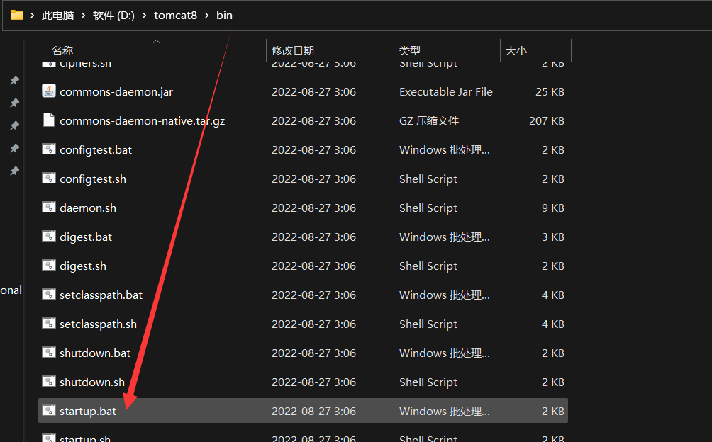

```apl
点击上述.bat文件后，在浏览器输 http://localhost:8080/ 访问tomcat
```

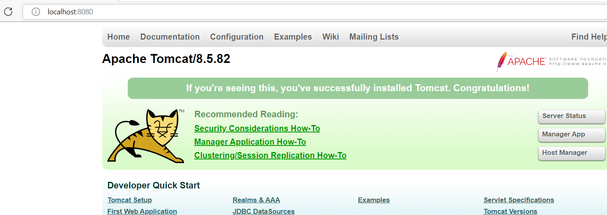

## 2.新建Web项目

```apl
在tomcat中部署，然后再访问
```

```apl
简单部署:
1) 在tomcat/webapps文件夹下新建文件夹(例如baidu文件夹) 
   baidu文件夹就是context root 在网页访问格式是：localhost:8080/baidu/demo09.html
   之前访问下面的页面是本地访问，现在的访问时http开头
2) 一定要在baidu文件夹下新建WEB-INF文件夹
```

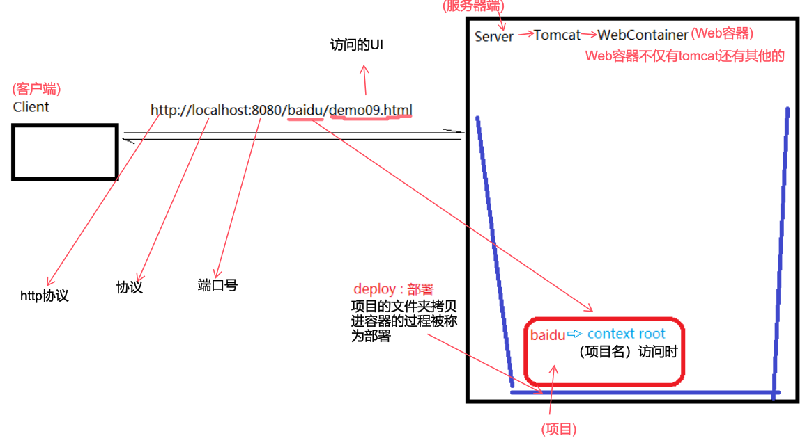

[demo09.html代码](D:\typora笔记\gitee-notes\javaWeb\javaWeb笔记\4号\4.5 demo09.html .md)

网页显示效果如下

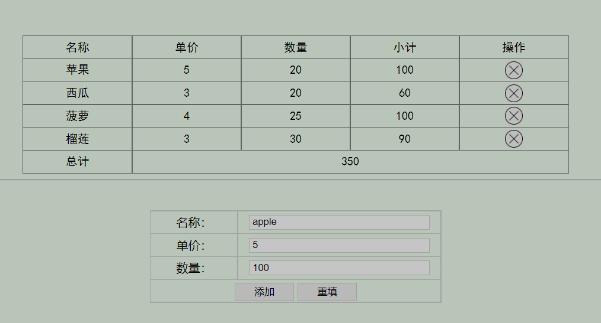


# idea新建javaWeb项目

**部署-运行**


## 新建javaWeb项目

[idea2022搭建javaWeb项目教程链接](D:\typora笔记\gitee-notes\javaWeb\javaWeb笔记\4.2 创建javaWeb项目.md)

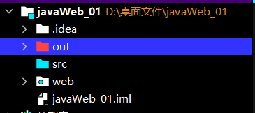

## 简单工作

### web文件下新建html

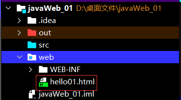


### 编写html代码

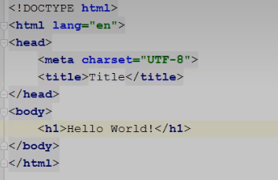

## 配置tomcat

### 点击编辑配置

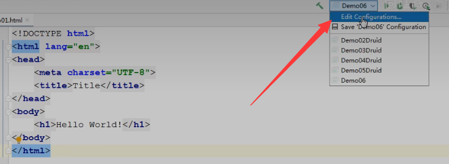

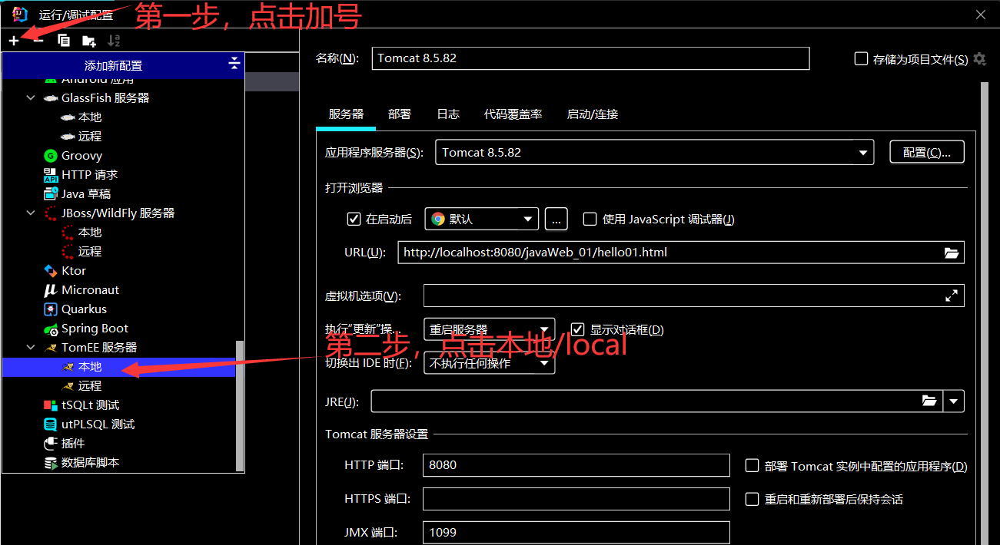

### 设置tomcat模板

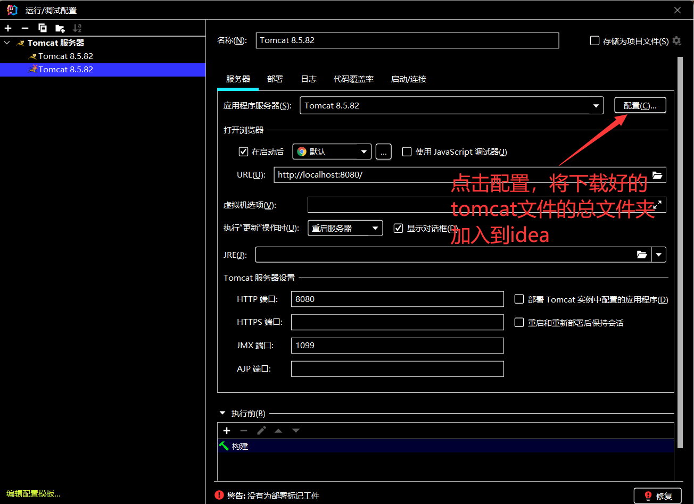

### 项目部署到配置好的tomcat

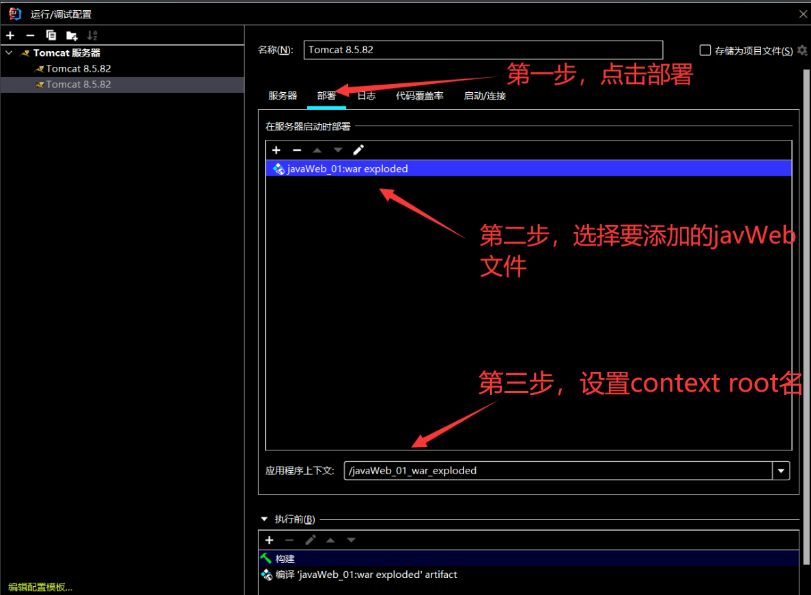

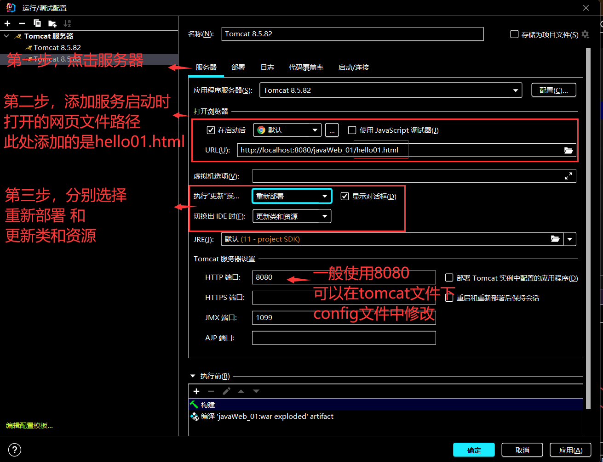

```apl
修改端口号的时候，尽量不要使用两千以内的
因为两千以内的一般都被操作系统占用了
```

## 启动toncat 

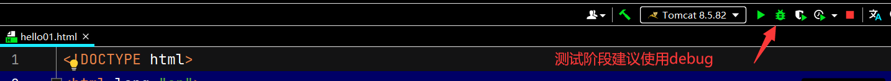

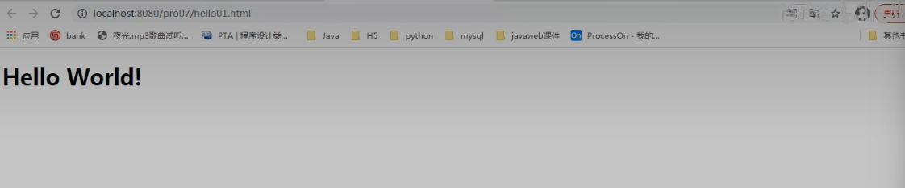

```apl
前提是tomcat中的startup必须要关掉
因为startup使用的也是8080端口
```

## idea的tomcat部署位置

```apl
部署在了out目录
```

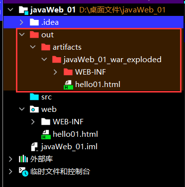

```apl
而在eclipse中
则是依旧部署在tomcat/webapps/context root文件夹中
context root文件夹中要提前建立WEB-INF文件夹
```

# Servlet入门-获取参数

## 写一个简单html页面

### 位置

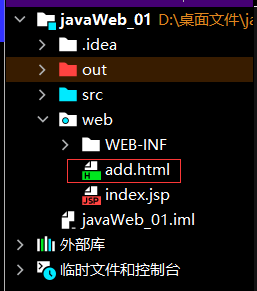

### 代码

```html
<!DOCTYPE html>
<html lang="en">
<head>
    <meta charset="UTF-8">
    <title>Title</title>
</head>
<body>
    <form action="add" method="post">
        名称:<input type="text" name="fname"/><br/>
        价格:<input type="text" name="price"/><br/>
        库存:<input type="text" name="fcount"/><br/>
        备注:<input type="text" name="remark"/><br/>
        <input type="submit" value="添加"/>
    </form>
</body>
</html>
```

```apl
1. 以post方式进行发送 methond = 'post'

2. 发给 add action = 'add'
   (add就是一个代号，指向的是服务器端的一个组件)
```


### 效果

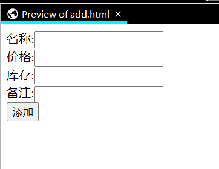


## 新建一个组件类

### 位置

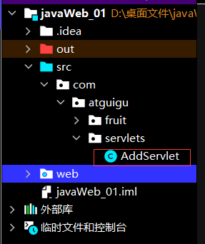

### 代码

```java
package com.Novice.servlets;

import com.Novice.fruit.impl.FruitDAOImpl;
import com.Novice.fruit.pojo.Fruit;

import javax.servlet.ServletException;
import javax.servlet.http.HttpServlet;
import javax.servlet.http.HttpServletRequest;
import javax.servlet.http.HttpServletResponse;
import java.io.IOException;

public class AddServlet extends HttpServlet {
    // public void doPost(HttpServletRequest request, HttpServletResponse response) throws IOException ,SecurityException{
    // 方法重写的时候，访问修饰符不可以重写
    // }

    @Override//客户端发送一个post请求，该方法就会被调用
    //因为html文件中写的 method='post'，所以此处重写的HttpServlet的方法是dopost
    protected void doPost(HttpServletRequest request, HttpServletResponse response) throws ServletException, IOException {
        
        //如果客户端发送了请求那么，服务器就将请求封装成一个对象使用
        
        String fname = request.getParameter("fname");

        String priceStr = request.getParameter("price"); //使用该方法获取的只能是字符串
        Integer price = Integer.parseInt(priceStr);

        String fcountStr = request.getParameter("fcount");
        Integer fcount = Integer.parseInt(fcountStr);

        String remark = request.getParameter("remark");

        // System.out.println("frame："+fname);
        // System.out.println("price："+price);
        // System.out.println("fcount："+fcount);
        // System.out.println("remark："+remark);

        FruitDAOImpl fruitDAO = new FruitDAOImpl();

        boolean b = fruitDAO.addFruit(new Fruit(0, fname, price, fcount, remark));

        System.out.println(b ? "添加成功" : "添加失败");


    }
}
```

```apl
单独一个普通的类是无法接收用户发送的数据的
所以 HttpServlet 继承了 HttpServlet 
```

### HttpServlet 早ServletAPI包里面

#### 1. 将ServletAPI包复制进lib中

#### 2. 将tomcat以来加进来

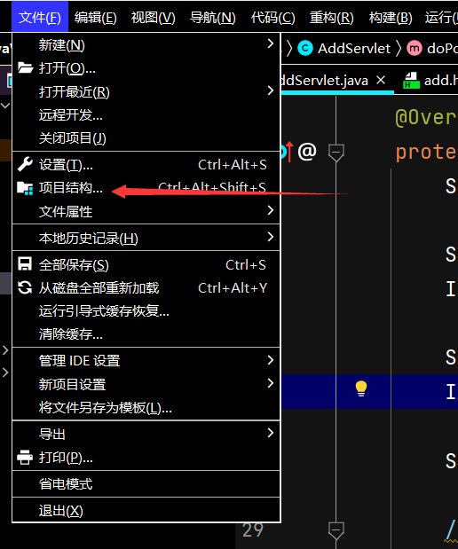

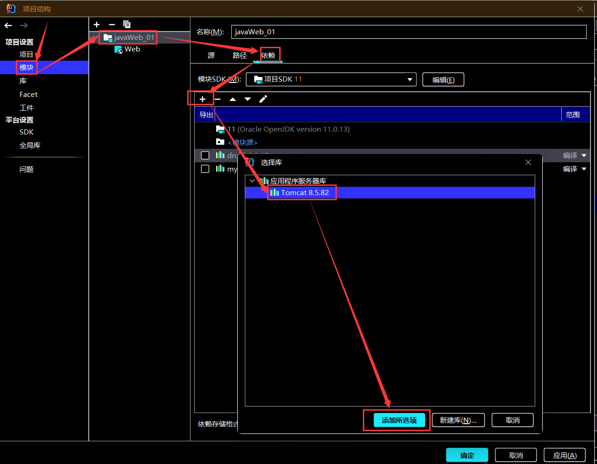

### 检查

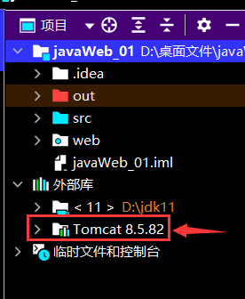

```apl
如果目录如上则证明添加成功
```


## 设置Servlet


### 目录

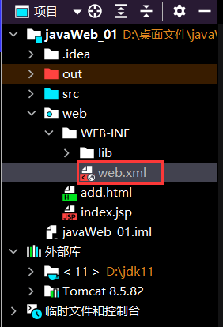


### 代码

#### 原始代码

```html
<?xml version="1.0" encoding="UTF-8"?>
<web-app xmlns="http://xmlns.jcp.org/xml/ns/javaee"
         xmlns:xsi="http://www.w3.org/2001/XMLSchema-instance"
         xsi:schemaLocation="http://xmlns.jcp.org/xml/ns/javaee http://xmlns.jcp.org/xml/ns/javaee/web-app_4_0.xsd"
         version="4.0">

</web-app>

```

#### 修改后

```html
<?xml version="1.0" encoding="UTF-8"?>
<web-app xmlns="http://xmlns.jcp.org/xml/ns/javaee"
         xmlns:xsi="http://www.w3.org/2001/XMLSchema-instance"
         xsi:schemaLocation="http://xmlns.jcp.org/xml/ns/javaee http://xmlns.jcp.org/xml/ns/javaee/web-app_4_0.xsd"
         version="4.0">
    <servlet>
        <servlet-name>AddServlet</servlet-name>
        <servlet-class>com.Novice.servlets.AddServlet</servlet-class>
    </servlet>
    <servlet-mapping>
        <servlet-name>AddServlet</servlet-name>
        <url-pattern>/add</url-pattern> <!--add前面一定要加上/-->
    </servlet-mapping>
    <!--
    1. 用户发请求，action=add
    2. 项目中，web.xml中找到url-pattern = /add   -> 第12行
    3. 找第11行的servlet-name = AddServlet
    4. 找和servlet-mapping中servlet-name一致的servlet ， 找到第7行
    5. 找第8行的servlet-class -> com.Novice.servlets.AddServlet
    6. 用户发送的是post请求（method=post） ， 因此 tomcat会执行AddServlet中的doPost方法
     -->
</web-app>
```

### 作用过程

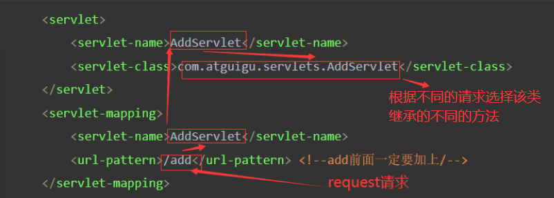

## 与JDBC联动

### 导入文件

#### 加入写好的Fruit_DAO包  -> fruit

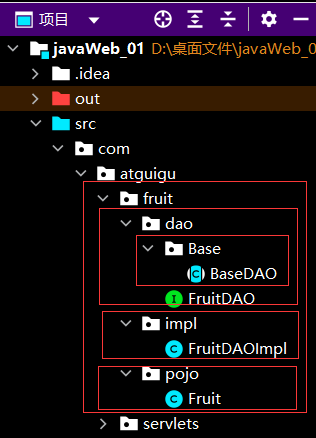

[上述代码路径](D:\typora笔记\gitee-notes\javaWeb\javaWeb笔记\4号\4.4 fruitDAO代码.md)

#### 导入对应的依赖

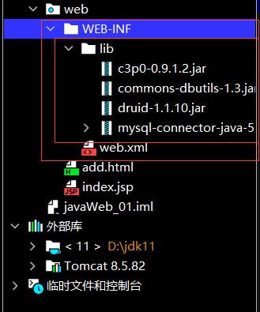

### 导入lib依赖后

#### 删除如下两个文件

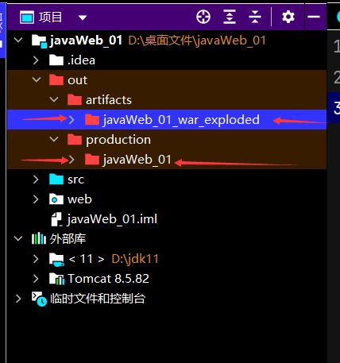

#### 重新配置

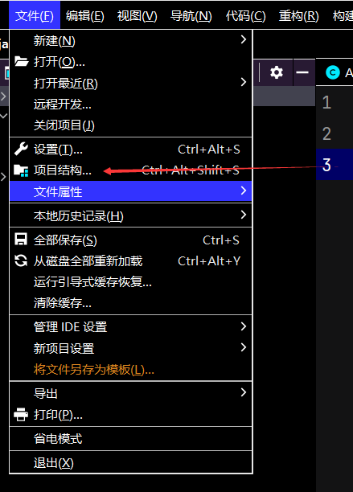

##### 法1

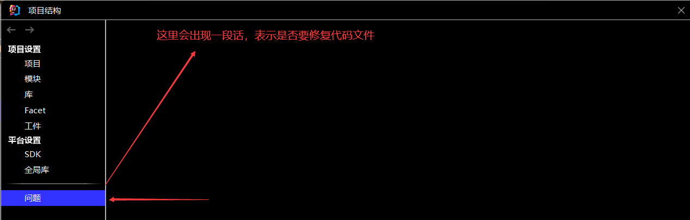

##### 法2

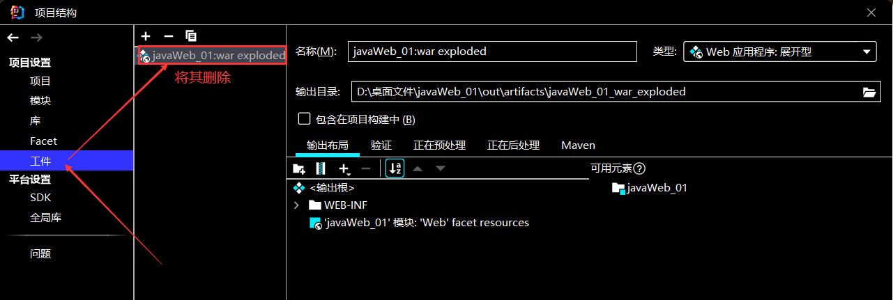

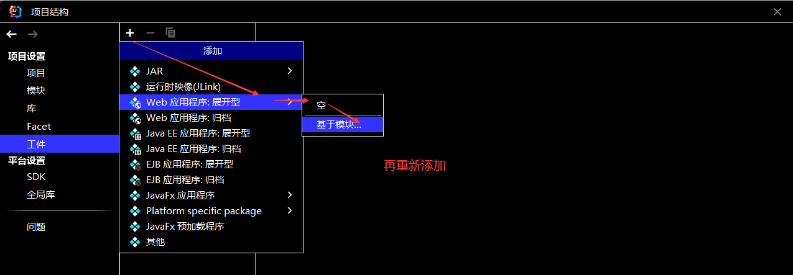

### 建立数据库

#### 创建fruitdb数据库

```mysql
CREATE DATABASE fruitdb
```

#### 创建t_fruit表

```mysql
CREATE TABLE t_fruit(
	fid INT,
	fname VARCHAR(32),
	price INT,
	fcount INT,
	remark VARCHAR(255))
```

#### 部分视图

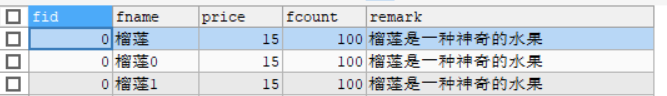

## 注意与总结

```apl
再DAO包中需要使用
import com.mysql.jdbc.Driver等代码
不然会出现找不到驱动的尴尬景象

然后libs包需要放在WEB-INF目录下
```

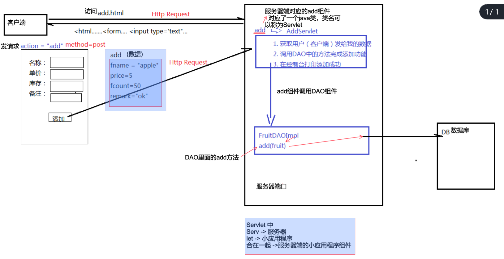

