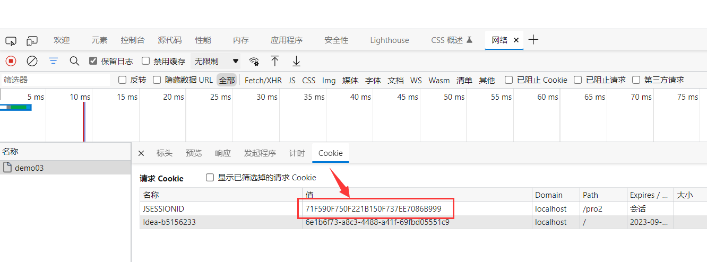
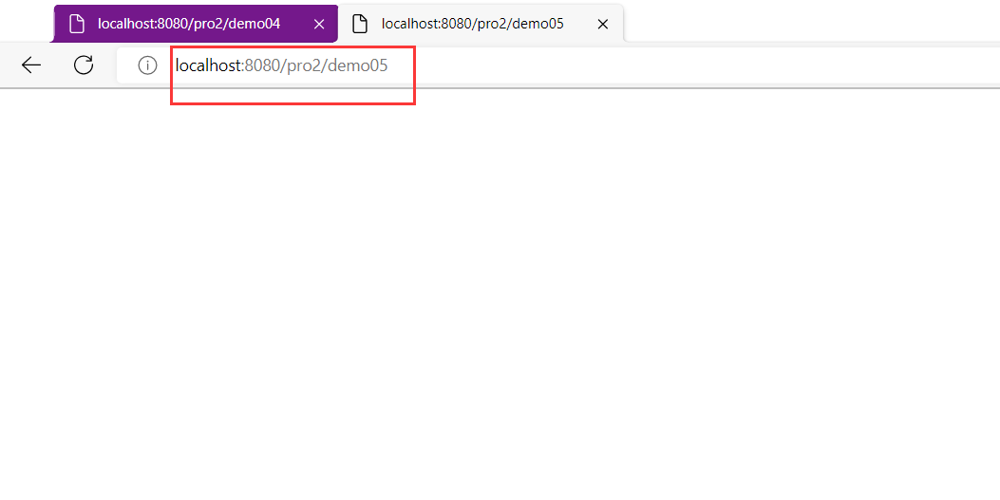

# servlet-review

**(一些==基础使用==以及==上一节常见错误==总结)**

## 基础使用

### 1.新建项目

```apl
新建一个空的java项目作为总文件夹，建号项目后可以将总文件夹的src文件夹删除

建立该项目总文件夹后，idea中还会有一个与之同名且对应的model
```

### 2.新建javaWeb模块

#### 示例


#### 方式一：

```apl
直接在创建java项目的时候加入web模块
```


#### 方式二：

##### 先创建一个java项目


##### 在idea中添加Web程序


### 3.创建artifact - 部署包  (artifact  —— 工件)


### 4.lib - artifact的关系

#### 添加mysql.jar的方式

##### 全局添加


添加过后，在模块中引用该jar库


```apl
先有artifact，后来才添加的mysql.jar。此时，这个jar包并没有添加到部署包中
那么在projectSettings中有一个Problems中会有提示的,我们点击fix选择add to...
```


##### 局部model添加

```apl
我们也可以直接把lib文件夹直接新建在WEB-INF下。
这种情况下，jar包会直接添加进入model，不需要进行二外操作
```

```apl
这样不好的地方是这个lib只能是当前这个moudle独享。

如果有第二个moudle我们需要再次重复的新建lib。
```


## 报错总结

### 1. 404报错

[部署tomcat链接](##1.Tomcat的安装和配置)

```apl
在部署tomcat的时候，修改application Context。然后再回到server选项卡，检查URL的值。
URL的值指的是tomcat启动完成后自动打开你指定的浏览器，然后默认访问的网址。
启动后，报错404意味着找不到指定的资源。
```

```apl
如果server选项卡中URL的值使用默认值，例如：http://localhost:8080/pro01/ , 那么表明我们访问的是index.html.

我们可以通过<welcome-file-list>标签进行设置欢迎页(在tomcat的web.xml中设置，或者在自己项目的web.xml中设置)
两个位置的设置效果相同
```

#### 在tomcat的web.xml中设置


#### 在自己项目的web.xml中设置


### 2. 405问题。

```apl
当前请求的方法不支持。比如，我们表单method=post , 那么Servlet必须对应doPost。否则报405错误。

(表单中的method默认方法是get)
```


### 3. 空指针或者是NumberFormatException 

```apl
因为有价格和库存。如果价格取不到，结果你想对null进行Integer.parseInt()就会报错。

错误的原因大部分是因为 name="price"此处写错了，结果在Servlet端还是使用request.getParameter("price")去获取。
```


### 4 . <url — pattern>中以斜杠开头

[Servlet入门-获取参数 / 设置Servlet](##设置Servlet)


### 5. servlet 处理请求参数中文乱码

#### 设置编码

```apl
tomcat8之前，设置编码：

  1)get请求方式：
    //get方式目前不需要设置编码（基于tomcat8）
    //如果是get请求发送的中文数据，转码稍微有点麻烦（tomcat8之前）
   		 String fname = request.getParameter("fname");
    //1.将字符串打散成字节数组，tomcat8之前tomcat使用的是ISO-8859-1编码
    	byte[] bytes = fname.getBytes("ISO-8859-1");
    //2.将字节数组按照设定的编码重新组装成字符串
  		  fname = new String(bytes,"UTF-8");
    
  2)post请求方式：
    request.setCharacterEncoding("UTF-8");
```

```apl
tomcat8开始，设置编码，只需要针对post方式
    request.setCharacterEncoding("UTF-8");
```

#### 注意：

```apl
需要注意的是，设置编码(post)这一句代码必须在所有的获取参数动作之前
```

#### 代码

```java
package com.Novice.servlets;

import com.Novice.fruit.impl.FruitDAOImpl;
import com.Novice.fruit.pojo.Fruit;

import javax.servlet.ServletException;
import javax.servlet.http.HttpServlet;
import javax.servlet.http.HttpServletRequest;
import javax.servlet.http.HttpServletResponse;
import java.io.IOException;

public class AddServlet extends HttpServlet {
    // public void doPost(HttpServletRequest request, HttpServletResponse response) throws IOException ,SecurityException{
    // 方法重写的时候，访问修饰符不可以重写
    // }

    @Override//客户端发送一个post请求，该方法就会被调用
    protected void doPost(HttpServletRequest request, HttpServletResponse response) throws ServletException, IOException {
         /*
        //get方式目前不需要设置编码（基于tomcat8）
        //如果是get请求发送的中文数据，转码稍微有点麻烦（tomcat8之前）
        String fname = request.getParameter("fname");
        //1.将字符串打散成字节数组
        byte[] bytes = fname.getBytes("ISO-8859-1");
        //2.将字节数组按照设定的编码重新组装成字符串
        fname = new String(bytes,"UTF-8");
        */

        //post方式下，设置编码，防止中文乱码
        //需要注意的是，设置编码这一句代码必须在所有的获取参数动作之前
        request.setCharacterEncoding("utf-8");
        
        String fname = request.getParameter("fname");

        String priceStr = request.getParameter("price"); //使用该方法获取的只能是字符串
        Integer price = Integer.parseInt(priceStr);

        String fcountStr = request.getParameter("fcount");
        Integer fcount = Integer.parseInt(fcountStr);

        String remark = request.getParameter("remark");

        // System.out.println("frame："+fname);
        // System.out.println("price："+price);
        // System.out.println("fcount："+fcount);
        // System.out.println("remark："+remark);

        FruitDAOImpl fruitDAO = new FruitDAOImpl();

        boolean b = fruitDAO.addFruit(new Fruit(0, fname, price, fcount, remark));

        System.out.println(b ? "添加成功" : "添加失败");


    }
}
```

# Servlet的继承关系 

 **重点查看的是服务方法（service()）**

## 1. 继承关系

```apl
javax.servlet.Servlet接口
    javax.servlet.GenericServlet抽象类
        javax.servlet.http.HttpServlet抽象子类 （该子类基于http协议）
```


## 2.相关方法(相关API)

### javax.servlet.Servlet 接口:

```apl
javax.servlet.Servlet 接口:
  void init(config) 			- 初始化方法
  void service(request,response) - 服务方法
  void destory() 			    - 销毁方法
```


### javax.servlet.GenericServlet

```apl
javax.servlet.GenericServlet 抽象类：
  void service(request,response) - 仍然是抽象的
```


### javax.servlet.http.HttpServlet

```apl
javax.servlet.http.HttpServlet 抽象子类：
  void service(request,response) - 不是抽象的
```


#### 常规执行

```apl
String method = req.getMethod(); //以字符串的形式，获取请求的方式

    //各种if判断，根据请求方式不同，决定去调用不同的do方法
        if (method.equals("GET")) {
            this.doGet(req,resp);
        } else if (method.equals("HEAD")) {
            this.doHead(req, resp);
        } else if (method.equals("POST")) {
            this.doPost(req, resp);
        } else if (method.equals("PUT")) {
        	his.doPut(req, resp);
        }
```

```apl
在HttpServlet这个抽象类中，do方法都差不多:

例如doGet()

protected void doGet(HttpServletRequest req, HttpServletResponse resp) throws ServletException, IOException {
        String msg = lStrings.getString("http.method_get_not_supported");
        this.sendMethodNotAllowed(req, resp, msg);
    }


 private void sendMethodNotAllowed(HttpServletRequest req, HttpServletResponse resp, String msg) throws IOException {
        String protocol = req.getProtocol();
        if (protocol.length() != 0 && !protocol.endsWith("0.9") && !protocol.endsWith("1.0")) {
            resp.sendError(405, msg);
        } else {
            resp.sendError(400, msg);
        }

    }
```

#### 报错405总结

```apl
如果自己写的servlet类继承了HttpServlet类，只是重写了doPost()，
如果表中调用的 action = get，那么在传入servlet类之后找不到doGet(),会继续上传到其父类HttpServlet类，
'注：该action需要在pro2-javaweb-servlet\web\WEB-INF\web.xml文件中进行配置'

1. 执行HttpServlet类的
	String method = req.getMethod();，获取到method = get
	
2. 然后执行HttpServlet类的
    protected void doGet(HttpServletRequest req, HttpServletResponse resp) throws ServletException, IOException {
            String msg = lStrings.getString("http.method_get_not_supported");
            this.sendMethodNotAllowed(req, resp, msg);
        }
        
3. 然后通过判断执行
     private void sendMethodNotAllowed(HttpServletRequest req, HttpServletResponse resp, String msg) throws IOException {
            String protocol = req.getProtocol();
            if (protocol.length() != 0 && !protocol.endsWith("0.9") && !protocol.endsWith("1.0")) {
                resp.sendError(405, msg);  //执行这一段代码
            } else {
                resp.sendError(400, msg);
            }

        }
4. 通过 HttpServlet类 开头定义的字段
   通过msg对应的properties里的对应字段传入到页面中去，并报错405
```


## 小结：

### 继承关系： 

```apl
HttpServlet -> GenericServlet -> Servlet
```


### Servlet中的核心方法：

```apl
 init() , service() , destroy()
```


### 服务方法：

```apl
当有请求过来时，service方法会自动响应（其实是tomcat容器调用的）

在HttpServlet中我们会去分析请求的方式：到底是get、post、head还是delete等等
然后再决定调用的是哪个do开头的方法
那么在HttpServlet中这些do方法默认都是405的实现风格-要我们子类去实现对应的方法，否则默认会报405错误

因此，我们在新建Servlet时，我们才会去考虑请求方法，从而决定重写哪个do方法
```


# Servlet的生命周期

**Servlet没有直接使用 new 方法，其自身生命周期是由tomcat容器维护的**

##   1） 生命周期：

```apl
从出生到死亡的过程就是生命周期。
对应Servlet中的三个方法：init(),service(),destroy()  
分别对应了Servlet的 初始化，服务，销毁
```

**一个servlet可以对应多个</servlet-mapping>**

 

## 2） 默认情况：

###  第一次接收请求时，

```apl
这个Servlet会进行
	1. 实例化(调用构造方法)  【'tomcat底层是用反射做的实例化'】
	1. 初始化(调用init())
	3. 服务(调用service()) 
```

### 第二次请求

```apl
因为服务已经开启，所以后来的每一次都是直接进行服务
```

### 当容器关闭时

```apl
调用销毁方法，其中的所有的servlet实例会被销毁
```

### 原始代码

```xml
<?xml version="1.0" encoding="UTF-8"?>
<web-app xmlns="http://xmlns.jcp.org/xml/ns/javaee"
         xmlns:xsi="http://www.w3.org/2001/XMLSchema-instance"
         xsi:schemaLocation="http://xmlns.jcp.org/xml/ns/javaee http://xmlns.jcp.org/xml/ns/javaee/web-app_4_0.xsd"
         version="4.0">
         
    <servlet>
        <servlet-name>Demo02_Serclet</servlet-name>
        <servlet-class>com.Novice.servlets.Demo02_Serclet</servlet-class>
        <!-- <load-on-startup>1</load-on-startup>  数字越小，启动的时间越早-->
    </servlet>
    <servlet-mapping>
        <servlet-name>Demo02_Serclet</servlet-name>
        <url-pattern>/demo02</url-pattern>
    </servlet-mapping>
   
   
</web-app>
```


```java
package com.Novice.servlets;

import javax.servlet.ServletException;
import javax.servlet.http.HttpServlet;
import javax.servlet.http.HttpServletRequest;
import javax.servlet.http.HttpServletResponse;
import java.io.IOException;

public class Demo02_Serclet extends HttpServlet {


    public Demo02_Serclet(){
        System.out.println("正在实例化");
    }

    // private Demo02_Serclet(){ // 500 : 服务器内部错误
    //     System.out.println("正在实例化");
    // }

    @Override
    public void init() throws ServletException {
        System.out.println("正在初始化。。。");
    }

    @Override
    protected void service(HttpServletRequest req, HttpServletResponse resp) throws ServletException, IOException {
        System.out.println("正在服务。。。");
    }

    @Override
    public void destroy() {
        System.out.println("正在销毁。。。");
    }
}
```


##   3） 通过案例发现：

### 发现内容:

```apl
 - Servlet实例tomcat只会创建一个，所有的请求都是这个实例去响应。
```

```apl
 - 默认情况下，第一次请求时，tomcat才会去实例化，初始化，然后再服务.
 	1. 这样的好处是什么？ 提高系统的启动速度 。 
 	2. 这样的缺点是什么？ 第一次请求时，耗时较长。
```

### 得出结论： 

```apl
1. 如果需要提高系统的启动速度，就是用Servlet的默认情况。
2. 如果需要提高响应速度，我们应该设置Servlet的初始化时机。
```


## 4） Servlet初始化时机：

### 默认情况初始化

```apl
在与服务建立联系之后的，第一次接收请求时，实例化，初始化
```

### 提高用户端响应

```apl
我们可以通过<load-on-startup>来设置servlet启动的先后顺序,数字越小，启动越靠前，最小值0

例如有多个Servlet，那么不同的servlet按照顺序设置数字大小是12345，那么多个Servlet就会按照顺序启动
```

```apl
1. 不设置<load-on-startup>是第一次访问时创建实例并初始化

2. 设置了<load-on-startup>随容器创建(服务器的启动自动创建实例并实例化)
```

### 修改后代码

```xml
<?xml version="1.0" encoding="UTF-8"?>
<web-app xmlns="http://xmlns.jcp.org/xml/ns/javaee"
         xmlns:xsi="http://www.w3.org/2001/XMLSchema-instance"
         xsi:schemaLocation="http://xmlns.jcp.org/xml/ns/javaee http://xmlns.jcp.org/xml/ns/javaee/web-app_4_0.xsd"
         version="4.0">
         
    <servlet>
        <servlet-name>Demo02_Serclet</servlet-name>
        <servlet-class>com.Novice.servlets.Demo02_Serclet</servlet-class>
        <load-on-startup>1</load-on-startup> <!--数字越小，启动的时间越早-->
    </servlet>
    <servlet-mapping>
        <servlet-name>Demo02_Serclet</servlet-name>
        <url-pattern>/demo02</url-pattern>
    </servlet-mapping>
   
   
</web-app>
```


```java
package com.Novice.servlets;

import javax.servlet.ServletException;
import javax.servlet.http.HttpServlet;
import javax.servlet.http.HttpServletRequest;
import javax.servlet.http.HttpServletResponse;
import java.io.IOException;

public class Demo02_Serclet extends HttpServlet {


    public Demo02_Serclet(){
        System.out.println("正在实例化");
    }

    // private Demo02_Serclet(){ // 500 : 服务器内部错误
    //     System.out.println("正在实例化");
    // }

    @Override
    public void init() throws ServletException {
        System.out.println("正在初始化。。。");
    }

    @Override
    protected void service(HttpServletRequest req, HttpServletResponse resp) throws ServletException, IOException {
        System.out.println("正在服务。。。");
    }

    @Override
    public void destroy() {
        System.out.println("正在销毁。。。");
    }
}
```


## 5） Servlet在容器中是: 单例的、线程不安全的

### 单例：

```apl
所有的请求都是同一个实例去响应（从始至终无论有多少请求，服务器中就只有一个实例）
```


### 线程不安全：

```apl
一个线程需要根据这个实例中的某个成员变量值去做逻辑判断。
但是在中间某个时机，另一个线程改变了这个成员变量的值，从而导致第一个线程的执行路径发生了变化
```


### 启发： 

```apl
尽量的不要在servlet中定义成员变量。

如果不得不定义成员变量，那么：
    1. 不要去修改成员变量的值 
    2. 不要去根据成员变量的值做一些逻辑判断
```


## 6）补充：

```apl
由于上述内容中并没有给tomcat部署 html文件，所以在对Servlet进行访问的时候按照如下步骤
```


将上图中自己设置的contect root -> demo02记下，填入下图对应的位置，并回车


idea中就会按照代码做下面的输出


# Http协议

```apl
1） Http 称之为 超文本传输协议
2） Http是无状态的
3） Http请求响应包含两个部分：请求和响应
```


## 请求报文：

```apl
请求包含三个部分： 
	1.请求行  
	2.请求消息头 
    3.请求主体
```

### 1.请求行

#### 作用：

```apl
'展示当前请求的最基本信息

包含是三个信息： 
	1. 请求的方式 	
	2.请求的URL
	3.请求的协议（一般都是HTTP1.1）
	GET dynamic/ HTTP/1.1
```

#### 例子:

```apl
	POST /dynamic/target.jsp HTTP/1.1
```


**注：【因为这里并没有具体的html文件，所以默认调用的是get方法】**


### 2.请求消息头

#### 作用

```apl
'通过具体的参数对本次请求进行详细的说明

其中包含了很多客户端需要告诉服务器的信息，比如：
	浏览器型号、版本、我能接收的内容的类型、我给你发的内容的类型、内容的长度等等
```

#### 较重要请求消息头:


#### 格式：

```apl
键值对，键和值之间使用冒号隔开
```


### 3.请求体

#### 作用：

```apl
'作为请求的主体，发送数据给服务器。具体来说其实就是POST请求方式下的请求参数。
```

#### 分类：

```apl
 1. get方式，没有请求体，但是有一个queryString【查询字符串】  因为这里并没有具体的html文件，所以默认调用的是get方法
 2. post方式，有请求体，form data
 3. json格式，有请求体，request payload【请求负载】
```


#### 格式：

##### [1] form data

```apl
含义：当前请求体是一个表单提交的请求参数。

源码格式：username=tom&password=123456
        - 每一组请求参数是一个键值对
        - 键和值中间是等号
        - 键值对之间是&号
```


##### [2]Request Payload

```apl
含义：整个请求体以某种特定格式来组织数据，例如JSON格式。
```


## 响应报文：

```apl
响应也包含三b部分： 
	1.响应行 
	2.响应头 
	3.响应体
```

**注: 如果没有返回的html文件，那么是没有如下的相应信息的**


### 1.响应状态行:

```apl
包含三个信息： 
	1.协议 
	2.响应状态码(200 表示状态正常) 【例如还有非正常状态 404 405】 
	3.响应状态(ok)
```


### 2.响应消息头：

```apl
包含了服务器的信息；服务器发送给浏览器的信息（内容的媒体类型、编码、内容长度等）

响应体的说明书。
服务器端对浏览器端设置数据，例如：服务器端返回Cookie信息。
```


### 3.响应体：

```apl
服务器返回的数据主体，有可能是各种数据类型。
    HTML页面
    图片
    视频
    以下载形式返回的文件
    CSS文件
    JavaScript文件
```

```apl
例如：
	响应的实际内容（比如请求add.html页面时，响应的内容就是<html><head><body><form....）
```

## 补充：

利用[Servlet声明周期](#Servlet的生命周期)中的代码进行试验

启动后端服务器


完成下图操作后先点击F12再对连接回车


点击下图中的位置后直接显示的就是请求报文中的信息


如果想要看响应报文，就按照如下点击，由于删一个测试中没有对浏览器的返回文件，所以下面显示的是空


如果要看到请求体【这里没有设置特定请求，所以默认是get请求对应了request payload】

需要事先再URL后面再加上例如:

```apl
?Username=jane&age=22
```


# 会话-sessions

[Http协议中写， Http是无状态的](#Http协议)

## 1） Http是无状态的

### HTTP 无状态 ：

```apl
服务器无法判断这两次请求是同一个客户端发过来的，还是不同的客户端发过来的
```


### 无状态带来的现实问题：

```apl
第一次请求是添加商品到购物车，第二次请求是结账；如果这两次请求服务器无法区分是同一个用户的，那么就会导致混乱
```

通过[会话跟踪技术](##会话跟踪技术)来解决无状态的问题。


##  2）会话跟踪技术：

```apl
1. 客户端第一次发请求给服务器，服务器获取session，获取不到，则创建新的，然后响应给客户端

2. 下次客户端给服务器发请求时，会把sessionID带给服务器，服务器获取到了，就判断这一次请求和上次某次请求是同一个客户端，从而能够区分开客户端
```


## 3）常用的API：

```apl
# request.getSession() -> 获取当前的会话，没有则创建一个新的会话
# request.getSession(true) -> 效果和不带参数相同
# request.getSession(false) -> 获取当前会话，没有则返回null，不会创建新的

# session.getId() -> 获取sessionID
# session.isNew() -> 判断当前session是否是新的

# session.getMaxInactiveInterval() -> session的非激活间隔时长，默认1800秒
# session.setMaxInactiveInterval()

# session.invalidate() -> 强制性让会话立即失效
```

## 4）实例补充：

### 代码

```xml
<?xml version="1.0" encoding="UTF-8"?>
<web-app xmlns="http://xmlns.jcp.org/xml/ns/javaee"
         xmlns:xsi="http://www.w3.org/2001/XMLSchema-instance"
         xsi:schemaLocation="http://xmlns.jcp.org/xml/ns/javaee http://xmlns.jcp.org/xml/ns/javaee/web-app_4_0.xsd"
         version="4.0">


    <servlet>
        <servlet-name>Demo03_Serclet</servlet-name>
        <servlet-class>com.Novice.servlets.Demo03_Serclet</servlet-class>
        <load-on-startup>1</load-on-startup> <!--数字越小，启动的时间越早-->
    </servlet>
    <servlet-mapping>
        <servlet-name>Demo03_Serclet</servlet-name>
        <url-pattern>/demo03</url-pattern>
    </servlet-mapping>
   
   
</web-app>
```

```java
package com.Novice.servlets;

import javax.servlet.ServletException;
import javax.servlet.http.HttpServlet;
import javax.servlet.http.HttpServletRequest;
import javax.servlet.http.HttpServletResponse;
import javax.servlet.http.HttpSession;
import java.io.IOException;

public class Demo03_Serclet extends HttpServlet {

    @Override
    protected void service(HttpServletRequest request, HttpServletResponse response) throws ServletException, IOException {

        //获取session,如果获取不到,则创建一个新的
        HttpSession session = request.getSession();

        System.out.println("SessionID:"+session);


    }
}
```

### 操作

运行服务器并建立联系


idea中生成的Cookie是通过响应头的形式传递回浏览器

下面的Cookie与idea中打印出来的相同




```
对于不同的浏览器，cookie出现的位置是不同的，总之按照逻辑
应该是，浏览器第一次连接服务器的时候，cookie是出现在响应标头中的
后续刷新连接的过程中Cookie应该是出现在请求标头中的
```


##  5） session保存作用域

### 内容

```apl
session保存作用域是和具体的某一个session对应的
```


### 常用的API：

```apl
void session.setAttribute(k,v)
Object session.getAttribute(k)
void removeAttribute(k)
```

### 实例演示

#### 代码

web.xml

```xml
<?xml version="1.0" encoding="UTF-8"?>
<web-app xmlns="http://xmlns.jcp.org/xml/ns/javaee"
         xmlns:xsi="http://www.w3.org/2001/XMLSchema-instance"
         xsi:schemaLocation="http://xmlns.jcp.org/xml/ns/javaee http://xmlns.jcp.org/xml/ns/javaee/web-app_4_0.xsd"
         version="4.0">

    <servlet>
        <servlet-name>Demo04_Serclet</servlet-name>
        <servlet-class>com.Novice.servlets.Demo04_Serclet</servlet-class>
        <load-on-startup>1</load-on-startup> <!--数字越小，启动的时间越早-->
    </servlet>
    <servlet-mapping>
        <servlet-name>Demo04_Serclet</servlet-name>
        <url-pattern>/demo04</url-pattern>
    </servlet-mapping>


    <servlet>
        <servlet-name>Demo05_Serclet</servlet-name>
        <servlet-class>com.Novice.servlets.Demo05_Serclet</servlet-class>
        <load-on-startup>1</load-on-startup> <!--数字越小，启动的时间越早-->
    </servlet>
    <servlet-mapping>
        <servlet-name>Demo05_Serclet</servlet-name>
        <url-pattern>/demo05</url-pattern>
    </servlet-mapping>


</web-app>
```

demo04

```java
package com.Novice.servlets;

import javax.servlet.ServletException;
import javax.servlet.http.HttpServlet;
import javax.servlet.http.HttpServletRequest;
import javax.servlet.http.HttpServletResponse;
import java.io.IOException;

//演示向Httpsession保存数据
public class Demo04_Serclet extends HttpServlet {
    @Override
    protected void service(HttpServletRequest request, HttpServletResponse response) throws ServletException, IOException {
        request.getSession().setAttribute("uname","lina");
    }
}
```

demo05

```java
package com.Novice.servlets;

import javax.servlet.ServletException;
import javax.servlet.http.HttpServlet;
import javax.servlet.http.HttpServletRequest;
import javax.servlet.http.HttpServletResponse;
import java.io.IOException;

public class Demo05_Serclet extends HttpServlet {
    @Override
    protected void service(HttpServletRequest req, HttpServletResponse resp) throws ServletException, IOException {
        Object unameObj = req.getSession().getAttribute("uname");
        System.out.println(unameObj);
    }
}
```

#### 演示

运行服务器，先连接demo04，存储数据


再连接demo05，访问该数据，此时直接访问，与前一个Cookie是保持一致的



查看idea，发现有内容输出


更换浏览器，再连接demo05，发现并没有结果输出，新的浏览器访问不到对应内容，输出的内容是null


#### debug演示

运行服务器，先连接demo04，存储数据


点击下面的按键去debug下一段代码


再连接demo05，访问该数据，此时直接访问，与前一个Cookie是保持一致的


更换浏览器，再连接demo05


# 服务器内部转发 | 客户端重定向

## 服务器内部转发 :

```apl
 request.getRequestDispatcher("...").forward(request,response);
 
 一次请求响应的过程，对于客户端而言，内部经过了多少次转发，客户端是不知道的、
 
 地址栏没有变化
```


## 客户端重定向：

```apl
 response.sendRedirect("....");
 
 两次请求响应的过程。客户端肯定知道请求URL有变化

地址栏有变化
```


## 代码

web.xml

```xml
<?xml version="1.0" encoding="UTF-8"?>
<web-app xmlns="http://xmlns.jcp.org/xml/ns/javaee"
         xmlns:xsi="http://www.w3.org/2001/XMLSchema-instance"
         xsi:schemaLocation="http://xmlns.jcp.org/xml/ns/javaee http://xmlns.jcp.org/xml/ns/javaee/web-app_4_0.xsd"
         version="4.0">

    <servlet>
        <servlet-name>Demo06_Serclet</servlet-name>
        <servlet-class>com.Novice.servlets.Demo06_Serclet</servlet-class>
        <load-on-startup>1</load-on-startup> <!--数字越小，启动的时间越早-->
    </servlet>
    <servlet-mapping>
        <servlet-name>Demo06_Serclet</servlet-name>
        <url-pattern>/demo06</url-pattern>
    </servlet-mapping>


    <servlet>
        <servlet-name>Demo07_Serclet</servlet-name>
        <servlet-class>com.Novice.servlets.Demo07_Serclet</servlet-class>
        <load-on-startup>1</load-on-startup> <!--数字越小，启动的时间越早-->
    </servlet>
    <servlet-mapping>
        <servlet-name>Demo07_Serclet</servlet-name>
        <url-pattern>/demo07</url-pattern>
    </servlet-mapping>


</web-app>
```

demo06

```java
package com.Novice.servlets;

import javax.servlet.ServletException;
import javax.servlet.http.HttpServlet;
import javax.servlet.http.HttpServletRequest;
import javax.servlet.http.HttpServletResponse;
import java.io.IOException;

//演示服务器端内部转发以及客户端重定向
public class Demo06_Serclet extends HttpServlet {

    @Override
    protected void service(HttpServletRequest req, HttpServletResponse resp) throws ServletException, IOException {

        System.out.println("demo06......");
        //服务器端内部转发
        // req.getRequestDispatcher("demo07").forward(req,resp);

        //客户端重定向
        resp.sendRedirect("demo07");

    }
}
```

demo07

```java
package com.Novice.servlets;

import javax.servlet.ServletException;
import javax.servlet.http.HttpServlet;
import javax.servlet.http.HttpServletRequest;
import javax.servlet.http.HttpServletResponse;
import java.io.IOException;

public class Demo07_Serclet extends HttpServlet {
    @Override
    protected void service(HttpServletRequest req, HttpServletResponse resp) throws ServletException, IOException {
        System.out.println("demo07......");
    }
}

```

## debug

### 服务器内部转发 :

设置断点


建立连接


第一个输出


第二个输出


```apl
在以上过程中，地址栏的URL并没有发生改变
服务器内部，damo06将任务交给了dam07，然后将dano07再根据指令执行
```

### 客户端重定向：

```apl
debug的方式与服务器内部转发类似，但是地址栏的URL最终变成了damo07的
服务器内部，damo06给浏览器发送指令让浏览器自己去访问damo07
```


// 200 : 正常响应
// 404 : 找不到资源
// 405 : 请求方式不支持
// 500 : 服务器内部错误