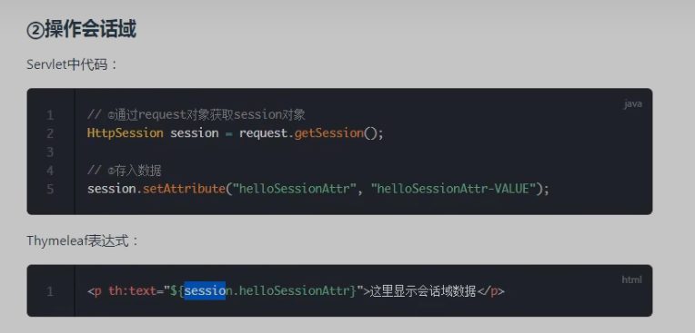
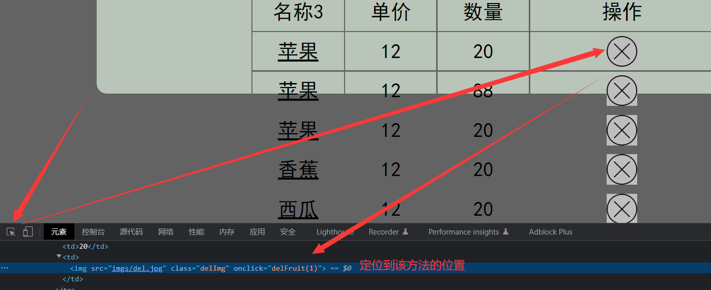

# Thymeleaf - 视图模板技术

```apl
让页面中显示的数据是.html页面根据数据库查找出来的数据实时显示出来的
```

	

## 1） 添加thymeleaf的jar包


## 2）配置BaseDAO类


```apl
在新建Servlet类之前，先配置好BaseDAO类，然后根据之前使用的代码，进行简化，
只实现从数据库中查询所有Fruit数据，并且按照List的形式返回
```


## 3） 新建一个Servlet类ViewBaseServlet

### 前置总结

```apl
这个类里面的内容是从Thymeleaf Servlet中拷贝出来的

要使得该类有作用，还需要在.xml中添加一些配置信息
该配置的作用是配置上下文参数
在ViewBaseServlet类的nit()方法中会读取.xml文件中配置的两个参数
```

### ViewBaseServlet代码

```java
package com.Novice.myssm.myspringmvc;

import org.thymeleaf.TemplateEngine;
import org.thymeleaf.context.WebContext;
import org.thymeleaf.templatemode.TemplateMode;
import org.thymeleaf.templateresolver.ServletContextTemplateResolver;

import javax.servlet.ServletContext;
import javax.servlet.ServletException;
import javax.servlet.http.HttpServlet;
import javax.servlet.http.HttpServletRequest;
import javax.servlet.http.HttpServletResponse;
import java.io.IOException;

public class ViewBaseServlet extends HttpServlet {

    private TemplateEngine templateEngine;

    @Override
    public void init() throws ServletException {//这个方法会读取xml文件中的两个参数

        // 1.获取ServletContext对象
        ServletContext servletContext = this.getServletContext();

        // 2.创建Thymeleaf解析器对象
        ServletContextTemplateResolver templateResolver = new ServletContextTemplateResolver(servletContext);

        // 3.给解析器对象设置参数
        // ①HTML是默认模式，明确设置是为了代码更容易理解
        templateResolver.setTemplateMode(TemplateMode.HTML);

        // ②设置前缀
        String viewPrefix = servletContext.getInitParameter("view-prefix");

        templateResolver.setPrefix(viewPrefix);

        // ③设置后缀
        String viewSuffix = servletContext.getInitParameter("view-suffix");

        templateResolver.setSuffix(viewSuffix);

        // ④设置缓存过期时间（毫秒）
        templateResolver.setCacheTTLMs(60000L);

        // ⑤设置是否缓存
        templateResolver.setCacheable(true);

        // ⑥设置服务器端编码方式
        templateResolver.setCharacterEncoding("utf-8");

        // 4.创建模板引擎对象
        templateEngine = new TemplateEngine();

        // 5.给模板引擎对象设置模板解析器
        templateEngine.setTemplateResolver(templateResolver);

    }

    // 处理模板(模板名字，请求，响应)
    protected void processTemplate(String templateName, HttpServletRequest req, HttpServletResponse resp) throws IOException {
        // 1.设置响应体内容类型和字符集
        resp.setContentType("text/html;charset=UTF-8");

        // 2.创建WebContext对象
        WebContext webContext = new WebContext(req, resp, getServletContext());

        // 3.处理模板数据
        templateEngine.process(templateName, webContext, resp.getWriter());
    }
}
```


## 4） 在web.xml文件中添加配置

```apl
此处对应ViewBaseServlet类而建立的配置文件，主要包含两个内容

    1. 配置前缀 view-prefix

    2. 配置后缀 view-suffix
```


```xml
<?xml version="1.0" encoding="UTF-8"?>
<web-app xmlns="http://xmlns.jcp.org/xml/ns/javaee"
         xmlns:xsi="http://www.w3.org/2001/XMLSchema-instance"
         xsi:schemaLocation="http://xmlns.jcp.org/xml/ns/javaee http://xmlns.jcp.org/xml/ns/javaee/web-app_4_0.xsd"
         version="4.0">


    <!-- 在上下文参数中配置视图前缀和视图后缀 -->
    <context-param>
        <param-name>view-prefix</param-name> <!--第一个上下文参数: 前缀-->
        <param-value>/</param-value> <!--此处 / 代表的是web根目录-->
    </context-param>
    
    <context-param>
        <param-name>view-suffix</param-name> <!--第二个上下文参数: 后缀-->
        <param-value>.html</param-value>
    </context-param>


</web-app>
```


## 5） indexServlet继承ViewBaseServlet

### indexServlet 的 代码

**注：// Servlet3.0开始支持注解,和写在xml文件中的效果一样**  	**注解格式: @WebServlet("/index")**

```java
package com.Novice.fruit.servlets;

import com.Novice.fruit.dao.FruitDAO;
import com.Novice.fruit.dao.impl.FruitDAOImpl;
import com.Novice.fruit.pojo.Fruit;
import com.Novice.myssm.myspringmvc.ViewBaseServlet;

import javax.servlet.ServletException;
import javax.servlet.annotation.WebServlet;
import javax.servlet.http.HttpServletRequest;
import javax.servlet.http.HttpServletResponse;
import javax.servlet.http.HttpSession;
import java.io.IOException;
import java.util.List;

// Servlet3.0开始支持注解,和写在xml文件中的效果一样
@WebServlet("/index")
public class indexServlet extends ViewBaseServlet {
    @Override
    protected void doGet(HttpServletRequest req, HttpServletResponse resp) throws ServletException, IOException {
        FruitDAO fruitDAO = new FruitDAOImpl();
        List<Fruit> fruitList = fruitDAO.getFruitList();
        //保存到session作用域
        HttpSession session = req.getSession();
        session.setAttribute("fruitList",fruitList);

        //此处的视图名称是 index
        //那么thymeleaf会将这个 逻辑视图名称 对应到 物理视图 名称上去
        //逻辑视图名称 ：   index
        //物理视图名称 ：   view-prefix + 逻辑视图名称 + view-suffix
        //所以真实的视图名称是：      /       index       .html

        super.processTemplate("index",req,resp);
        //processTemplate("index",req,resp)
        //处理模板("视图名称"，"","")
    }
}
```


###  indexServlet 继承该类的目的

```apl
ViewBaseServlet类都配置好之后，就让indexServlet去继承indexServlet类
然后在indexServlet类中就可以调用indexServlet类中的processTemplate()方法了

//processTemplate("index",req,resp)
//	处理模板	("视图名称"，rea,resp)
```

```apl
经过上面的操作，直接运行服务器，虽然网址URL最后面的值是index
但是由于super.processTemplate("index",req,resp);方法跳转到的页面已经是index.html文件了.
'具体原理见下一个小标题内容
```


###  由 逻辑视图名称 得到 物理视图名称

#### 前提条件

```apl
ViewBaseServlet类都配置好之后，就让indexServlet去继承indexServlet类
然后在indexServlet类中就可以调用indexServlet类中的processTemplate()方法了
```

#### 方法步骤

```apl
该方法的作用是通过不同的字段以及与.xml中配置文件的视图前缀与视图后缀的组合，进而得到视图的真实名称
//processTemplate("index",req,resp)
//	处理模板	("视图名称"，rea,resp)
```

#### 举例

```apl
//此处的视图名称是 index
//那么thymeleaf会将这个 逻辑视图名称 对应到 物理视图 名称上去
//逻辑视图名称 ：   index
//物理视图名称 ：   view-prefix + 逻辑视图名称 + view-suffix  <==> (视图前缀 + index + 视图后缀)
//所以真实的视图名称是：      /       index       .html
super.processTemplate("index",request,response);
```


## 6）thymeleaf在html中的标签

### 四种标签

```apl
  1. th:if   
  2. th:unless  # th:unless 对应了java中的else{}
  3. th:each    # th:each 对应了java中的for{} 
  4. th:text    # 表示td内部的文本
```

### 步骤总结

```apl
此处是使用thymeleaf的标签对index.html文件进行改造
因为要实现所有数据都显示在html页面上，所以需要使用循环将存储在Session中的数据取出
首先通过thymeleaf判断Session是否为空
如果为空就返回"对不起，库存为空！"
如果判断不为空就循环遍历Session中list中的数据
并将数据一次填充进<td></td>中输出会html网页中
```

### 代码

#### 修改前的index.html

```html
<html>
	<head>
		<meta charset="utf-8">
		<link rel="stylesheet" href="css/index.css">
	</head>
	<body>
		<div id="div_container">
			<div id="div_fruit_list">
				<table id="tbl_fruit">
					<tr>
						<th class="w20">名称</th>
						<th class="w20">单价</th>
						<th class="w20">数量</th>
						<th>操作</th>
					</tr>
					<tr>
						<td>苹果</td>
						<td>5</td>
						<td>20</td>
						<td></td>
					</tr>
				</table>

			</div>
		</div>
	</body>
</html>
```


#### 修改后的index.html

```html
<html>
	<head>
		<meta charset="utf-8">
		<link rel="stylesheet" href="css/index.css">
	</head>
	<body>
		<div id="div_container">
			<div id="div_fruit_list">
				<p class="center f30">欢迎使用水果库存后台管理系统</p>
				<table id="tbl_fruit">
                    
					<tr>
						<th class="w20">名称</th>
						<th class="w20">单价</th>
						<th class="w20">数量</th>
						<th>操作</th>
					</tr>

					<tr th:if="${#lists.isEmpty(session.fruitList)}" >
						<td colspan="4">对不起，库存为空！</td> <!--colspan="4"表示合并了4行-->
					</tr>

				     <!--下面的代码是每循环一次就将session中的list中的数据取出来一个-->
                      <!--如果此处session省略了，那么将会从request作用域中去取数据-->
					<tr th:unless="${#lists.isEmpty(session.fruitList)}" th:each="fruit:${session.fruitList}">
						<td th:text="${fruit.fname}">苹果</td>
                           <!--此处的text表示的是此处td内部的文本，默认是 苹果-->
						<td th:text="${fruit.price}">5</td>
						<td th:text="${fruit.fcount}">20</td>
						<td></td>
					</tr>
                    
				</table>
			</div>
		</div>
	</body>
</html>
```


# Servlet-Thymeleaf-review

## 在项目中复制一个目录


粘贴目录


每一个model都会有一个与该model同名的配置文件


由于复制上一个model时，会将其中所有的内容都复制进去，包括配置文件

所以复制过后需要修改配置文件名


注意修改完配置文件的名之后，原来文件的配置文件名也会同时被修改，此时需要对员文件的配置文件名修改复原


此时文件还没有被导入模块，需要通过 项目结构 完成简单的配置

导入模块


**注：idea中重命名的快捷键是 shift+F6**


## 前面的知识点总结


```apl
review:
1. post提交方式下的设置编码，防止中文乱码
   request.setCharacterEncoding("utf-8");
   get提交方式，tomcat8开始，编码不需要设置
   tomcat8之前，get方式设置比较麻烦：
   String fname = request.getParameter("fname");
   byte[] bytes = fname.getBytes("iso-8859-1");
   fname = new String(bytes,"UTF-8");

2. Servlet继承关系以及生命周期
   1） Servlet接口 ： init() , service() , destroy()
       GenericServlet抽象子类： abstract service();
       HttpServlet抽象子类：实现了service方法，在service方法内部通过request.getMethod()来判断请求的方式，
            然后根据请求的方式去调用内部的do方法。每一个do方法进行了简单实现，主要是如果请求方式不符合，则报405错误。
            目的是让我们的Servlet子类去重写对应的方法（如果重写的不对，则使用父类的405错误实现）
   2） 生命周期：实例化、初始化、服务、销毁
        - Tomcat负责维护Servlet实例的生命周期
        - 每个Servlet在Tomcat容器中只有一个实例，它是线程不安全的
        - Servlet的启动时机：<load-on-startup>
        - Servlet3.0开始支持注解: @WebServlet

3. HTTP协议：
   1） 由 Request 和 Response 两部分组成
   2） 请求包含了三部分：请求行、请求消息头、请求主体： 普通的get方式请求-query string；post方式- form data ； json格式 - request payload
   3） 响应包含了三部分：响应行、响应消息头、响应主体

4. HttpSession
   1） HttpSession ：表示 会话
   2） 为什么需要HttpSession ， 原因是因为 Http协议是无状态的
   3） Session保存作用域 ：一次会话范围都有效 ； void session.setAttribute(k,v) ,Object session.getAttribute(k)
   4） 其他的API： session.getId() , session.isNew() , session.getCreationTime() , session.invalidate() 等等

5. 服务器端转发和客户端重定向
   1) 服务器端转发 ： request.getRequestDispatcher("index.html").forward(request,response);
   2) 客户端重定向： response.sendRedirect("index.html");

6. thymeleaf的部分标签
   1） 使用步骤： 添加jar ， 新建ViewBaseServlet(有两个方法） ， 配置两个<context-param> : view-prefix , view-suffix
   2） 部分标签： <th:if> , <th:unless> , <th:each> , <th:text>


```


# servlet-保存作用域


## 4种保存作用域

```apl
1. page（页面级别，现在几乎不用（jsp）） 

2. request（一次请求响应范围） 

3. session（一次会话范围） 

4. application（整个应用程序范围）
```

### 1） request：一次请求响应范围

#### 概念

```apl
每一次请求之后，客户端用来请求服务器的实例就会关闭，下一次请求就是新的客户端实例
```

#### 图解


#### 代码

##### demo01

```java
package com.Novice.demo.request作用域;

import javax.servlet.ServletException;
import javax.servlet.annotation.WebServlet;
import javax.servlet.http.HttpServlet;
import javax.servlet.http.HttpServletRequest;
import javax.servlet.http.HttpServletResponse;
import java.io.IOException;


//演示request保存作用域（demo01和demo02）
@WebServlet("/demo01")
public class Demo01_Servlet extends HttpServlet {
    @Override
    protected void service(HttpServletRequest req, HttpServletResponse resp) throws ServletException, IOException {
        //1.向request保存作用域保存数据
       req.setAttribute("uname","lili");
        //2.客户端重定向
        // resp.sendRedirect("demo02");


        //3.服务器端转发
        req.getRequestDispatcher("demo02").forward(req,resp);

    }
}

```

##### demo02

```java
package com.Novice.demo.request作用域;

import javax.servlet.ServletException;
import javax.servlet.annotation.WebServlet;
import javax.servlet.http.HttpServlet;
import javax.servlet.http.HttpServletRequest;
import javax.servlet.http.HttpServletResponse;
import java.io.IOException;

//演示request保存作用域（demo01和demo02）
@WebServlet("/demo02")
public class Demo02_Servlet extends HttpServlet {
    @Override
    protected void service(HttpServletRequest req, HttpServletResponse resp) throws ServletException, IOException {
        //1.获取request保存作用域保存的数据，key为uname
        Object unameObj = req.getAttribute("uname");
        System.out.println("unameObj = "+unameObj);
    }
}

```


### 2） session：一次会话范围有效

#### 概念

```apl
每一次请求之后，客户端用来请求服务器的实例会在同一个浏览器下规定时间内保存
如果更换服务器，或者超出时间cookie的限制时间，就会关闭该客户端服务器
```

#### 图解


#### 代码

##### demo_03

```java
package com.Novice.demo.session作用域;

import javax.servlet.ServletException;
import javax.servlet.annotation.WebServlet;
import javax.servlet.http.HttpServlet;
import javax.servlet.http.HttpServletRequest;
import javax.servlet.http.HttpServletResponse;
import java.io.IOException;

//演示session保存作用域（demo_03和demo_04）
@WebServlet("/demo03")
public class Demo_03_ervlet extends HttpServlet {
    @Override
    protected void service(HttpServletRequest req, HttpServletResponse resp) throws ServletException, IOException {
        //1.向session保存作用域保存数据
       req.getSession().setAttribute("uname","lili");
        //2.客户端重定向
        resp.sendRedirect("demo04");


        //3.服务器端转发
        // req.getRequestDispatcher("demo02").forward(req,resp);

    }
}
```

##### demo_04

```java
package com.Novice.demo.session作用域;

import javax.servlet.ServletException;
import javax.servlet.annotation.WebServlet;
import javax.servlet.http.HttpServlet;
import javax.servlet.http.HttpServletRequest;
import javax.servlet.http.HttpServletResponse;
import java.io.IOException;


//演示session保存作用域（demo_03和demo_04）
@WebServlet("/demo04")
public class Demo_04_Servlet extends HttpServlet {
    @Override
    protected void service(HttpServletRequest req, HttpServletResponse resp) throws ServletException, IOException {
        //1.获取session保存作用域保存的数据，key为uname
        Object unameObj = req.getSession().getAttribute("uname");
        System.out.println("unameObj = "+unameObj);
    }
}
```


### 3） application： 一次应用程序范围有效

#### 概念

```apl
只要tomcat服务器不会关闭，无论从任何浏览器的任何服务器上访问都可以访问到在这个服务器开启时间段内存储在服务器上的信息
```

#### 图解


#### 代码

##### demo_05

```java
package com.Novice.demo.application作用域;

import javax.servlet.ServletContext;
import javax.servlet.ServletException;
import javax.servlet.annotation.WebServlet;
import javax.servlet.http.HttpServlet;
import javax.servlet.http.HttpServletRequest;
import javax.servlet.http.HttpServletResponse;
import java.io.IOException;

//演示application保存作用域（demo_05和demo_06）
@WebServlet("/demo05")
public class Demo_05_ervlet extends HttpServlet {
    @Override
    protected void service(HttpServletRequest req, HttpServletResponse resp) throws ServletException, IOException {
        //1.向application保存作用域保存数据
        //ServletContext叫做Servlet上下文
        ServletContext application = req.getServletContext();
        application.setAttribute("uname","lili");
        //2.客户端重定向
        resp.sendRedirect("demo06");


        //3.服务器端转发
        // req.getRequestDispatcher("demo02").forward(req,resp);

    }
}
```

##### demo_06

```java
package com.Novice.demo.application作用域;

import javax.servlet.ServletContext;
import javax.servlet.ServletException;
import javax.servlet.annotation.WebServlet;
import javax.servlet.http.HttpServlet;
import javax.servlet.http.HttpServletRequest;
import javax.servlet.http.HttpServletResponse;
import java.io.IOException;


//演示application保存作用域（demo_05和demo_06）
@WebServlet("/demo06")
public class Demo_06_Servlet extends HttpServlet {
    @Override
    protected void service(HttpServletRequest req, HttpServletResponse resp) throws ServletException, IOException {
        //1.获取application保存作用域保存的数据，key为uname
        ServletContext application = req.getServletContext();
        Object unameObj = application.getAttribute("uname");
        System.out.println("unameObj = "+unameObj);
    }
}
```


## 补充知识点

**out 路径以及其包含路径的内容**


```apl
out  	输出目录

    artifacts 一些web项目部署的文件夹

    production java类编译好的clss文件
```


# 路径问题

```apl
 1） 相对路径

 2） 绝对路径
```


# 实现库存系统的功能


## 1. 编辑和修改待定库存信息

**(注：代码的注释)**


### 实现 接入的 前后后端

#### indexServlet

```java
package com.Novice.fruit.servlets;

import com.Novice.fruit.dao.FruitDAO;
import com.Novice.fruit.dao.impl.FruitDAOImpl;
import com.Novice.fruit.pojo.Fruit;
import com.Novice.myssm.myspringmvc.ViewBaseServlet;
import com.Novice.myssm.util.StringUtils;

import javax.servlet.ServletException;
import javax.servlet.annotation.WebServlet;
import javax.servlet.http.HttpServletRequest;
import javax.servlet.http.HttpServletResponse;
import javax.servlet.http.HttpSession;
import java.io.IOException;
import java.util.List;

// Servlet3.0开始支持注解,和写在xml文件中的效果一样
@WebServlet("/index")
public class indexServlet extends ViewBaseServlet {
    @Override
    protected void doGet(HttpServletRequest req, HttpServletResponse resp) throws ServletException, IOException {

        FruitDAO fruitDAO = new FruitDAOImpl();

        Integer pageNo = 1;
        String pageNoSrt = req.getParameter("pageNo");
        if(StringUtils.isNotEmpty(pageNoSrt)){
            pageNo = Integer.parseInt(pageNoSrt);
        }
        HttpSession session = req.getSession();
        session.setAttribute("pageNo",pageNo);


        int fruitNum = fruitDAO.getFruitNum();
        int pagecount = (fruitNum + 5 - 1) / 5;
        session.setAttribute("pagecount",pagecount);


        //1. 获取到对应页码的全部的数据
        List<Fruit> fruitList = fruitDAO.getFruitList(pageNo);

        //2. 保存到session作用域
        // HttpSession session = req.getSession();
        session.setAttribute("fruitList",fruitList);

        //此处的视图名称是 index
        //那么thymeleaf会将这个 逻辑视图名称 对应到 物理视图 名称上去
        //逻辑视图名称 ：   index
        //物理视图名称 ：   view-prefix + 逻辑视图名称 + view-suffix
        //所以真实的视图名称是：      /       index       .html

        //3. 通过继承的方法processTemplate()将收集到的数据发送到，对应地址的index.html页面上
        super.processTemplate("index",req,resp);
    }
}
```

```apl
tomcat中部署的地址 :http://localhost:8080/pro5/index
根据 @WebServlet("/index"),首先找到indexServlet，进行信息的收集，
然后通过  super.processTemplate("index",req,resp);将收集到的数据反馈到index.html
```


***


### 实现 读取的 前后端

```apl
后端editServlet读取数据库中的内容,前端index.html将后端的数据展现在html页面
同时index.html页面实现超链接功能将某一元素的详情展现在下一组的edit.html页面上
```


#### index.html

```html
<html>
	<head>
		<meta charset="utf-8">
		<link rel="stylesheet" href="css/index.css">
	</head>
	<body>
		<div id="div_container">
			<div id="div_fruit_list">
				<p class="center f30">欢迎使用水果库存后台管理系统1</p>
				<table id="tbl_fruit">
                    
					<tr>
						<th class="w20">名称8</th>
						<th class="w20">单价</th>
						<th class="w20">数量</th>
						<th>操作</th>
					</tr>

					<tr th:if="${#lists.isEmpty(session.fruitList)}" >
						<td colspan="4">对不起，库存为空！</td> <!--colspan="4"表示合并了4行-->
					</tr>

					<!--下面的代码是每循环一次就将list中的数据取出来一个-->
				<tr th:unless="${#lists.isEmpty(session.fruitList)}" th:each="fruit:${session.fruitList}">
        			 <!--如果此处session省略了，那么将会从request作用域中去取数据-->
                        
<!--    <td th:text="${fruit.fname}"> <a herf="edit.do"> 苹果1 </a> </td>    -->
<!--    此处td中的内容都会别text取得的值所取代，所以此处的超链接会失效    -->
                        
<!--    <td > <a th:text="${fruit.fname}" th:href="@{ '/edit.do?fid=' + ${fruit.fid} } "> 苹果1 </a> </td>    -->
<!--    此处超链接虽然会起作用，并且地址的表现形式也是绝对路径，也可以正常获取fruit对象的ID，但是代码太过冗长    --->                        
<!--    常规写法:  th:href=" @{ /edit.do (fid=${fruit.fid}),fname=$(fruit.fname) } "    -->
					 <td ><a th:text="${fruit.fname}" th:href="@{/edit.do (fid=${fruit.fid})}">苹果1</a></td>

					 <td th:text="${fruit.price}">5</td>
					 <td th:text="${fruit.fcount}">20</td>
					 <td></td>			
                    </tr>
                    
				</table>

			</div>
		</div>
	</body>
</html>
```

​					???:arrow_down:




#### editServlet

```apl
index.html中的链接(按钮)，调用editServlet并传入fid数据，然后editServlrt根据fid数据取出对应个单个商品元素
并将该元素传入到edit.html
```


```java
package com.Novice.fruit.servlets;

import com.Novice.fruit.dao.FruitDAO;
import com.Novice.fruit.dao.impl.FruitDAOImpl;
import com.Novice.fruit.pojo.Fruit;
import com.Novice.myssm.myspringmvc.ViewBaseServlet;
import com.Novice.myssm.util.StringUtils;

import javax.servlet.ServletException;
import javax.servlet.annotation.WebServlet;
import javax.servlet.http.HttpServletRequest;
import javax.servlet.http.HttpServletResponse;
import java.io.IOException;

@WebServlet("/edit.do")
public class editServlet extends ViewBaseServlet {

   private FruitDAO fruitDAO = new FruitDAOImpl();

    @Override  //不是form表单种method="post"，重写的方法一般都是doget()
    protected void doGet(HttpServletRequest request, HttpServletResponse response) throws ServletException, IOException { 


        String fidStr = request.getParameter("fid");
        
        if (StringUtils.isNotEmpty(fidStr)){
            
            int fid = Integer.parseInt(fidStr);
            Fruit fruit = fruitDAO.getFruitByFid(fid);
            request.setAttribute("fruit",fruit);
            
            super.processTemplate("edit",request,response);
            //将收集到的数据展现在到 edit.html上去
        }
        
    }
}

```


#### StringUtils工具类

**(主要用于判断一个字符串是否为空)**

```java
package com.Novice.myssm.util;

public class StringUtils {
    //判断字符串是否为null或者为""(空字符串)
    public static boolean isEmpty(String str){
        return str==null||"".equals(str);
    }

    public static boolean isNotEmpty(String str){
        return !isEmpty(str);
    }

}
```

***

### 实现 修改的 前后端

```apl
前端的edit.html页面负责接收index.html页面传递过来的单个元素的详细信息，并从收集客户的修改要求
将要求传递给 updateServlet后端，后端通过链接数据库进行数据的修改，在将修改后的信息反馈给上一组的index.html
让其将修改后的数据展现在总表上
```


#### edit.html

```html
<html  xmlns="http://www.w3.org/1999/xhtml" xmlns:th="http://www.thymeleaf.org">
<html>
<head>
	<meta charset="utf-8">
	<link rel="stylesheet" href="css/edit.css">
</head>
<body>
<div id="div_container">
	<div id="div_fruit_list">
		<p class="center f30">编辑库存信息1</p>
        
<!--    因为修改后的内容要一齐提交给update对应的Servlet，所以要建立一张表单    -->
		<form  th:action="@{/update.do}"  method="post" >
<!--    th:action="@{/update.do}" 使用绝对地址的形式表示的对应Servlet的地址    -->    

<!--    <table id="tbl_fruit"  th:object="${fruit}" >    左边例子中，表明总属性是fruit，对应的table表中所有关于    -->
<!--    fruit要取出的元素都可以通过 *{fname} 的方式取出    -->

<!--    隐藏域 ： 功能类似于文本框 ， 它的值会随着表单的发送也会发送给服务器，但是界面上用户看不到 -->
			<td ><input type="hidden" name = "fid" th:value="${fruit.fid}"/></td>

			<table id="tbl_fruit" >


<!--				<tr>-->
<!--					<th class="w20">名称:</th>-->
<!--					<td ><input type="text" name = "fname" th:value="*{fname}"/></td>-->
<!--				</tr>-->

<!--				<tr>-->
<!--					<th class="w20">单价:</th>-->
<!--					<td><input type="text" name="price" th:value="*{price}"/></td>-->
<!--				</tr>-->

<!--				<tr>-->
<!--					<th class="w20">库存:</th>-->
<!--					<td><input type="text" name="fcount" th:value="*{fcount}"/></td>-->
<!--				</tr>-->

<!--				<tr>-->
<!--					<th class="w20">备注:</th>-->
<!--					<td><input type="text" name="remark" th:value="*{remark}"/></td>-->
<!--				</tr>-->

<!--				<tr>-->
<!--					<th colspan="2">-->
<!--						<input type="submit" value="修改">-->
<!--					</th>-->
<!--				</tr>-->


				<tr>
					<th class="w20">名称:</th>
					<td ><input type="text" name = "fname" th:value="${fruit.fname}"/></td>
				</tr>

				<tr>
					<th class="w20">单价:</th>
					<td><input type="text" name="price" th:value="${fruit.price}"/></td>
				</tr>

				<tr>
					<th class="w20">库存:</th>
					<td><input type="text" name="fcount" th:value="${fruit.fcount}"/></td>
				</tr>

				<tr>
					<th class="w20">备注:</th>
					<td><input type="text" name="remark" th:value="${fruit.remark}"/></td>
				</tr>

				<tr>
					<th colspan="2">  <!--th时默认居中的-->
						<input type="submit" value="修改">
					</th>
				</tr>

			</table>
		</form>
	</div>
</div>
</body>
</html>
```


####  updateServlet

```java
package com.Novice.fruit.servlets;

import com.Novice.fruit.dao.FruitDAO;
import com.Novice.fruit.dao.impl.FruitDAOImpl;
import com.Novice.fruit.pojo.Fruit;
import com.Novice.myssm.myspringmvc.ViewBaseServlet;

import javax.servlet.ServletException;
import javax.servlet.annotation.WebServlet;
import javax.servlet.http.HttpServletRequest;
import javax.servlet.http.HttpServletResponse;
import java.io.IOException;

@WebServlet("/update.do")
public class updateServlet extends ViewBaseServlet {


    private FruitDAO fruitDAO = new FruitDAOImpl();


    @Override
    protected void doPost(HttpServletRequest req, HttpServletResponse resp) throws ServletException, IOException {
        //1. 设置编码
        req.setCharacterEncoding("utf-8");

        //2. 获取参数
        String FIDStr = req.getParameter("fid"); //这里的字符串名一定要与html传过来的fruit的对象对应的元素名相同
        int fid = Integer.parseInt(FIDStr);


        String fname = req.getParameter("fname");

        String priceStr = req.getParameter("price");
        int price = Integer.parseInt(priceStr);

        String fcountStr = req.getParameter("fcount");
        int fcount = Integer.parseInt(fcountStr);

        String remark = req.getParameter("remark");


        //3. 执行更新
        fruitDAO.updateFruit(new Fruit(fid,fname,price,fcount,remark));

        //4. 跳转页面
         // super.processTemplate("index",req,resp);
         // req.getRequestDispatcher("index.html").forward(req,resp);
         //上面两句代码的功能相同(属于服务器内部转发)都是获取到ndex.html页面的地址之后，直接跳转，虽然数据库的内容被修改了，
         //但是此时网页Session中存储的数据依然是修改前的数据，需要让index.html页面重新读取数据库中的内容
         //所以此处应该使用下面的 updateServlet客户端重定向的方式来跳转页面
        
        //此处需要重定向，目的是重新给IndexServlet发请求，重新获取furitList，然后覆盖到session中，这样index.html页面上显示的session中的数据才是最新的
        
        resp.sendRedirect("index");
        //当然直接将数据发送给indexServlet也可以达到同样的效果

    }
}
```

### JDBC-DAO配置

#### FruitDAO接口

```java
package com.Novice.fruit.dao;

import com.Novice.fruit.pojo.Fruit;

import java.util.List;

public interface FruitDAO {
    //获取所有的库存列表信息

    List<Fruit> getFruitList();

    //根据水果ID获取特定的水果信息
    Fruit getFruitByFid(Integer fid);

    //修改指定的水果数据
    void updateFruit(Fruit fruit);
}
```

#### FruitDAOImpl

```java
package com.Novice.fruit.dao.impl;

import com.Novice.fruit.dao.FruitDAO;
import com.Novice.fruit.pojo.Fruit;
import com.Novice.myssm.basedao.BaseDAO;

import java.util.List;

public class FruitDAOImpl extends BaseDAO<Fruit> implements FruitDAO {
    @Override
    public List<Fruit> getFruitList() {
        return super.executeQuery("select * from t_fruit");
    }

    @Override
    public Fruit getFruitByFid(Integer fid) {
        return super.load("select * from t_fruit where fid = ?", fid);
    }

    @Override
    public void updateFruit(Fruit fruit) {
        String sql = "update t_fruit set fname=? ,price=?,fcount=?,remark=? where fid =?";
        super.executeUpdate(sql, fruit.getFname(), fruit.getPrice(), fruit.getFcount(), fruit.getRemark(), fruit.getFid());
    }
}
```

#### BaseDAO

```java
package com.Novice.myssm.basedao;

import java.lang.reflect.Field;
import java.lang.reflect.ParameterizedType;
import java.lang.reflect.Type;
import java.sql.*;
import java.util.ArrayList;
import java.util.List;

public abstract class BaseDAO<T> {
    public final String DRIVER = "com.mysql.jdbc.Driver" ;
    public final String URL = "jdbc:mysql://localhost:3306/fruitdb?useUnicode=true&characterEncoding=utf-8&useSSL=false";
    public final String USER = "root";
    public final String PWD = "abcd" ;

    protected Connection conn ;
    protected PreparedStatement psmt ;
    protected ResultSet rs ;

    //T的Class对象
    private Class entityClass ;

    public BaseDAO(){
        //getClass() 获取Class对象，当前我们执行的是new FruitDAOImpl() , 创建的是FruitDAOImpl的实例
        //那么子类构造方法内部首先会调用父类（BaseDAO）的无参构造方法
        //因此此处的getClass()会被执行，但是getClass获取的是FruitDAOImpl的Class
        //所以getGenericSuperclass()获取到的是BaseDAO的Class
        Type genericType = getClass().getGenericSuperclass();
        //ParameterizedType 参数化类型
        Type[] actualTypeArguments = ((ParameterizedType) genericType).getActualTypeArguments();
        //获取到的<T>中的T的真实的类型
        Type actualType = actualTypeArguments[0];
        try {
            entityClass = Class.forName(actualType.getTypeName());
        } catch (ClassNotFoundException e) {
            e.printStackTrace();
        }
    }

    protected Connection getConn(){
        try {
            //1.加载驱动
            Class.forName(DRIVER);
            //2.通过驱动管理器获取连接对象
            return DriverManager.getConnection(URL, USER, PWD);
        } catch (ClassNotFoundException | SQLException e) {
            e.printStackTrace();
        }
        return null ;
    }

    protected void close(ResultSet rs , PreparedStatement psmt , Connection conn){
        try {
            if (rs != null) {
                rs.close();
            }
            if(psmt!=null){
                psmt.close();
            }
            if(conn!=null && !conn.isClosed()){
                conn.close();
            }
        } catch (SQLException e) {
            e.printStackTrace();
        }
    }

    //给预处理命令对象设置参数
    private void setParams(PreparedStatement psmt , Object... params) throws SQLException {
        if(params!=null && params.length>0){
            for (int i = 0; i < params.length; i++) {
                psmt.setObject(i+1,params[i]);
            }
        }
    }

    //执行更新，返回影响行数
    protected int executeUpdate(String sql , Object... params){
        boolean insertFlag = false ;
        insertFlag = sql.trim().toUpperCase().startsWith("INSERT");
        try {
            conn = getConn();
            if(insertFlag){
                psmt = conn.prepareStatement(sql,Statement.RETURN_GENERATED_KEYS);
            }else {
                psmt = conn.prepareStatement(sql);
            }
            setParams(psmt,params);
            int count = psmt.executeUpdate() ;

            if(insertFlag){
                if(rs.next()){
                    return ((Long)rs.getLong(1)).intValue();
                }
            }

            rs = psmt.getGeneratedKeys();

            return count ;
        } catch (SQLException e) {
            e.printStackTrace();
        }finally {
            close(rs,psmt,conn);
        }
        return 0;
    }

    //通过反射技术给obj对象的property属性赋propertyValue值
    private void setValue(Object obj ,  String property , Object propertyValue){
        Class clazz = obj.getClass();
        try {
            //获取property这个字符串对应的属性名 ， 比如 "fid"  去找 obj对象中的 fid 属性
            Field field = clazz.getDeclaredField(property);
            if(field!=null){
                field.setAccessible(true);
                field.set(obj,propertyValue);
            }
        } catch (NoSuchFieldException | IllegalAccessException e) {
            e.printStackTrace();
        }
    }

    //执行复杂查询，返回例如统计结果
    protected Object[] executeComplexQuery(String sql , Object... params){
        try {
            conn = getConn() ;
            psmt = conn.prepareStatement(sql);
            setParams(psmt,params);
            rs = psmt.executeQuery();

            //通过rs可以获取结果集的元数据
            //元数据：描述结果集数据的数据 , 简单讲，就是这个结果集有哪些列，什么类型等等

            ResultSetMetaData rsmd = rs.getMetaData();
            //获取结果集的列数
            int columnCount = rsmd.getColumnCount();
            Object[] columnValueArr = new Object[columnCount];
            //6.解析rs
            if(rs.next()){
                for(int i = 0 ; i<columnCount;i++){
                    Object columnValue = rs.getObject(i+1);     //33    苹果      5
                    columnValueArr[i]=columnValue;
                }
                return columnValueArr ;
            }
        } catch (SQLException e) {
            e.printStackTrace();
        } finally {
            close(rs,psmt,conn);
        }
        return null ;
    }

    //执行查询，返回单个实体对象
    protected T load(String sql , Object... params){
        try {
            conn = getConn() ;
            psmt = conn.prepareStatement(sql);
            setParams(psmt,params);
            rs = psmt.executeQuery();

            //通过rs可以获取结果集的元数据
            //元数据：描述结果集数据的数据 , 简单讲，就是这个结果集有哪些列，什么类型等等

            ResultSetMetaData rsmd = rs.getMetaData();
            //获取结果集的列数
            int columnCount = rsmd.getColumnCount();
            //6.解析rs
            if(rs.next()){
                T entity = (T)entityClass.newInstance();

                for(int i = 0 ; i<columnCount;i++){
                    String columnName = rsmd.getColumnName(i+1);            //fid   fname   price
                    Object columnValue = rs.getObject(i+1);     //33    苹果      5
                    setValue(entity,columnName,columnValue);
                }
                return entity ;
            }
        } catch (SQLException e) {
            e.printStackTrace();
        } catch (IllegalAccessException e) {
            e.printStackTrace();
        } catch (InstantiationException e) {
            e.printStackTrace();
        } finally {
            close(rs,psmt,conn);
        }
        return null ;
    }


    //执行查询，返回List
    protected List<T> executeQuery(String sql , Object... params){
        List<T> list = new ArrayList<>();
        try {
            conn = getConn() ;
            psmt = conn.prepareStatement(sql);
            setParams(psmt,params);
            rs = psmt.executeQuery();

            //通过rs可以获取结果集的元数据
            //元数据：描述结果集数据的数据 , 简单讲，就是这个结果集有哪些列，什么类型等等

            ResultSetMetaData rsmd = rs.getMetaData();
            //获取结果集的列数
            int columnCount = rsmd.getColumnCount();
            //6.解析rs
            while(rs.next()){
                T entity = (T)entityClass.newInstance();

                for(int i = 0 ; i<columnCount;i++){
                    String columnName = rsmd.getColumnName(i+1);            //fid   fname   price
                    Object columnValue = rs.getObject(i+1);     //33    苹果      5
                    setValue(entity,columnName,columnValue);
                }
                list.add(entity);
            }
        } catch (SQLException e) {
            e.printStackTrace();
        } catch (IllegalAccessException e) {
            e.printStackTrace();
        } catch (InstantiationException e) {
            e.printStackTrace();
        } finally {
            close(rs,psmt,conn);
        }
        return list ;
    }
}
```

### 简要总结

```apl
总体思路是有两个html页面，第一个页面与查询Servlet绑定
并且第一个html页面对应的list中的每一个元素的name都附带有一个跳转到第二个页面的超链接
(通过超链接可以进入到对应字段的详情的html)，
第二个html页面上的各种功能对应的Servlet实现，主要用于实现修改功能，并作用到对应的数库，
并且第二个Servlet最后还有一句代码用于实现跳转到第一个html页面，并且修改的内容也会显示在第二个页面上
```


***


## 2. 删除和添加功能

### 删除功能

```html
<html xmlns:th="http://www.thymeleaf.org">
<head>
    <meta charset="utf-8">
    <link rel="stylesheet" href="css/index.css">
    <script language="JavaScript" src="js/index.js"></script>
</head>
<body>
<div id="div_container">
    <div id="div_fruit_list">
        <p class="center f30">欢迎使用水果库存后台管理系统</p>

        <div style="border: 0px solid red; width: 60%; margin-left: 20%; text-align: right;">
            <a th:href="@{/add.html}" style="border: 0px solid blue; margin-bottom: 4px;">添加库存记录</a>
        </div>

        <table id="tbl_fruit">
            <tr>
                <th class="w20">名称1</th>
                <th class="w20">单价</th>
                <th class="w20">数量</th>
                <th>操作</th>
            </tr>

            <tr th:if="${#lists.isEmpty(session.fruitList)}">
                <td colspan="4">对不起，库存为空！</td> <!--colspan="4"表示合并了4行-->
            </tr>

            <!--下面的代码是每循环一次就将list中的数据取出来一个-->
            <tr th:unless="${#lists.isEmpty(session.fruitList)}" th:each="fruit:${session.fruitList}">
                <!--如果此处session省略了，那么将会从request作用域中去取数据-->
                <!--						<td th:text="${fruit.fname}"><a herf="edit.do">苹果1</a></td>-->
                <!--						<td ><a th:text="${fruit.fname}" th:href="@{'/edit.do?fid='+${fruit.fid}}">苹果1</a></td>-->
                <td><a th:text="${fruit.fname}" th:href="@{/edit.do(fid=${fruit.fid})}">苹果1</a></td>

                <td th:text="${fruit.price}">5</td>
                <td th:text="${fruit.fcount}">20</td>

                <!--						<td></td>-->
                <td></td>
                <!--						上式中，"|delFruit(${fruit.fid})|"，虽然是一个字符串，但是遇到thymleaf表达式${}之后,就会自动识别完成字符串的拼接-->

            </tr>
        </table>
        <div style=" width: 60%; margin-left: 20%; border: 0px solid red; padding-top: 4px" class="center">
            <input type="button" value="首 页" class="btn" th:onclick="|page(1)|" th:disabled="|${session.pageNo==1}|"/>
            <input type="button" value="下一页" class="btn" th:onclick="|page(${session.pageNo + 1})|" th:disabled="|${session.pageNo==session.pagecount}|"/>
            <input type="button" value="上一页" class="btn" th:onclick="|page(${session.pageNo - 1})|" th:disabled="|${session.pageNo==1}|"/>
            <input type="button" value="尾 页" class="btn" th:onclick="|page(${session.pagecount})|" th:disabled="|${session.pageNo==session.pagecount}|"/>
        </div>

    </div>
</div>
</body>
</html>
```

```java
package com.Novice.fruit.servlets;

import com.Novice.fruit.dao.FruitDAO;
import com.Novice.fruit.dao.impl.FruitDAOImpl;
import com.Novice.myssm.myspringmvc.ViewBaseServlet;
import com.Novice.myssm.util.StringUtils;

import javax.servlet.ServletException;
import javax.servlet.annotation.WebServlet;
import javax.servlet.http.HttpServletRequest;
import javax.servlet.http.HttpServletResponse;
import java.io.IOException;

@WebServlet("/del.do")
public class delServlet extends ViewBaseServlet {

    FruitDAO fruitDAO = new FruitDAOImpl();

    @Override
    protected void doGet(HttpServletRequest request, HttpServletResponse response) throws ServletException, IOException {

        String fidObj = request.getParameter("fid");
        if (StringUtils.isNotEmpty(fidObj)){
            int fid = Integer.parseInt(fidObj);
            fruitDAO.delFruit(fid);

            // super.processTemplate("index",req,resp);
            response.sendRedirect("index");
        }
    }
}
```

### 添加功能

```html
<html xmlns:th="http://www.thymeleaf.org">
<head>
    <meta charset="utf-8">
    <link rel="stylesheet" href="css/index.css">
    <script language="JavaScript" src="js/index.js"></script>
</head>
<body>
<div id="div_container">
    <div id="div_fruit_list">
        <p class="center f30">欢迎使用水果库存后台管理系统</p>

        <div style="border: 0px solid red; width: 60%; margin-left: 20%; text-align: right;">
            <a th:href="@{/add.html}" style="border: 0px solid blue; margin-bottom: 4px;">添加库存记录</a>
        </div>

        <table id="tbl_fruit">
            <tr>
                <th class="w20">名称1</th>
                <th class="w20">单价</th>
                <th class="w20">数量</th>
                <th>操作</th>
            </tr>

            <tr th:if="${#lists.isEmpty(session.fruitList)}">
                <td colspan="4">对不起，库存为空！</td> <!--colspan="4"表示合并了4行-->
            </tr>

            <!--下面的代码是每循环一次就将list中的数据取出来一个-->
            <tr th:unless="${#lists.isEmpty(session.fruitList)}" th:each="fruit:${session.fruitList}">
                <!--如果此处session省略了，那么将会从request作用域中去取数据-->
                <!--						<td th:text="${fruit.fname}"><a herf="edit.do">苹果1</a></td>-->
                <!--						<td ><a th:text="${fruit.fname}" th:href="@{'/edit.do?fid='+${fruit.fid}}">苹果1</a></td>-->
                <td><a th:text="${fruit.fname}" th:href="@{/edit.do(fid=${fruit.fid})}">苹果1</a></td>

                <td th:text="${fruit.price}">5</td>
                <td th:text="${fruit.fcount}">20</td>

                <!--						<td></td>-->
                <td></td>
                <!--						上式中，"|delFruit(${fruit.fid})|"，虽然是一个字符串，但是遇到thymleaf表达式${}之后,就会自动识别完成字符串的拼接-->

            </tr>
        </table>
        <div style=" width: 60%; margin-left: 20%; border: 0px solid red; padding-top: 4px" class="center">
            <input type="button" value="首 页" class="btn" th:onclick="|page(1)|" th:disabled="|${session.pageNo==1}|"/>
            <input type="button" value="下一页" class="btn" th:onclick="|page(${session.pageNo + 1})|" th:disabled="|${session.pageNo==session.pagecount}|"/>
            <input type="button" value="上一页" class="btn" th:onclick="|page(${session.pageNo - 1})|" th:disabled="|${session.pageNo==1}|"/>
            <input type="button" value="尾 页" class="btn" th:onclick="|page(${session.pagecount})|" th:disabled="|${session.pageNo==session.pagecount}|"/>
        </div>

    </div>
</div>
</body>
</html>
```


```java
package com.Novice.fruit.servlets;

import com.Novice.fruit.dao.FruitDAO;
import com.Novice.fruit.dao.impl.FruitDAOImpl;
import com.Novice.fruit.pojo.Fruit;
import com.Novice.myssm.myspringmvc.ViewBaseServlet;

import javax.servlet.ServletException;
import javax.servlet.annotation.WebServlet;
import javax.servlet.http.HttpServletRequest;
import javax.servlet.http.HttpServletResponse;
import java.io.IOException;


@WebServlet("/add.do")
public class addServlet extends ViewBaseServlet {

   private FruitDAO fruitDAO = new FruitDAOImpl();
    @Override
    protected void doPost(HttpServletRequest req, HttpServletResponse resp) throws ServletException, IOException {
        req.setCharacterEncoding("utf-8");

        String fname = req.getParameter("fname");

        String priceStr = req.getParameter("price");
        int price = Integer.parseInt(priceStr);

        String fcountStr = req.getParameter("fcount");
        int fcount = Integer.parseInt(fcountStr);

        String remark = req.getParameter("remark");

        fruitDAO.addFruit(new Fruit(0,fname,price,fcount,remark));

        resp.sendRedirect("index");

    }
}
```


### JDBC-DAO配置

####  FruitDAO接口

```java
package com.Novice.fruit.dao;

import com.Novice.fruit.pojo.Fruit;

import java.util.List;

public interface FruitDAO {
    //获取所有的库存列表信息

    List<Fruit> getFruitList(Integer pageNo);

    //根据水果ID获取特定的水果信息
    Fruit getFruitByFid(Integer fid);

    //修改指定的水果数据
    void updateFruit(Fruit fruit);

    void delFruit(Integer fid);

    void addFruit(Fruit fruit);

    int getFruitNum();
}
```


#### FruitDAOImpl类

```java
package com.Novice.fruit.dao.impl;

import com.Novice.fruit.dao.FruitDAO;
import com.Novice.fruit.pojo.Fruit;
import com.Novice.myssm.basedao.BaseDAO;

import java.util.List;

public class FruitDAOImpl extends BaseDAO<Fruit> implements FruitDAO {
    @Override
    public List<Fruit> getFruitList(Integer pageNo) {
        return super.executeQuery("select * from t_fruit limit ?,5",(pageNo-1)*5);
    }

    @Override
    public Fruit getFruitByFid(Integer fid) {
        return super.load("select * from t_fruit where fid = ?", fid);
    }

    @Override
    public void updateFruit(Fruit fruit) {
        String sql = "update t_fruit set fname=? ,price=?,fcount=?,remark=? where fid =?";
        super.executeUpdate(sql, fruit.getFname(), fruit.getPrice(), fruit.getFcount(), fruit.getRemark(), fruit.getFid());
    }

    @Override
    public void delFruit(Integer fid) {
        super.executeUpdate("delete from t_fruit where fid = ?",fid);
    }

    @Override
    public void addFruit(Fruit fruit) {
        String sql = "insert into t_fruit values (0,?,?,?,?)";
        super.executeUpdate(sql,fruit.getFname(),fruit.getPrice(),fruit.getFcount(),fruit.getRemark());
    }

    @Override
    public int getFruitNum() {
        return ((Long)super.executeComplexQuery("select count(*) from t_fruit")[0]).intValue();
        //转型为long类型时，需要使用(Long)
        // return ((long)super.executeComplexQuery("select count(*) from t_fruit")[0]).intValue();
    }
}
```


## 3.  添加分页功能

### index.html

```html
<html xmlns:th="http://www.thymeleaf.org">
<head>
    <meta charset="utf-8">
    <link rel="stylesheet" href="css/index.css">
    <script language="JavaScript" src="js/index.js"></script>
</head>
<body>
<div id="div_container">
    <div id="div_fruit_list">
        <p class="center f30">欢迎使用水果库存后台管理系统</p>

        <div style="border: 0px solid red; width: 60%; margin-left: 20%; text-align: right;">
            <a th:href="@{/add.html}" style="border: 0px solid blue; margin-bottom: 4px;">添加库存记录</a>
        </div>

        <table id="tbl_fruit">
            <tr>
                <th class="w20">名称1</th>
                <th class="w20">单价</th>
                <th class="w20">数量</th>
                <th>操作</th>
            </tr>

            <tr th:if="${#lists.isEmpty(session.fruitList)}">
                <td colspan="4">对不起，库存为空！</td> <!--colspan="4"表示合并了4行-->
            </tr>

            <!--下面的代码是每循环一次就将list中的数据取出来一个-->
            <tr th:unless="${#lists.isEmpty(session.fruitList)}" th:each="fruit:${session.fruitList}">
                <!--如果此处session省略了，那么将会从request作用域中去取数据-->
                <!--						<td th:text="${fruit.fname}"><a herf="edit.do">苹果1</a></td>-->
                <!--						<td ><a th:text="${fruit.fname}" th:href="@{'/edit.do?fid='+${fruit.fid}}">苹果1</a></td>-->
                <td><a th:text="${fruit.fname}" th:href="@{/edit.do(fid=${fruit.fid})}">苹果1</a></td>

                <td th:text="${fruit.price}">5</td>
                <td th:text="${fruit.fcount}">20</td>

                <!--						<td></td>-->
                <td></td>
                <!--						上式中，"|delFruit(${fruit.fid})|"，虽然是一个字符串，但是遇到thymleaf表达式${}之后,就会自动识别完成字符串的拼接-->

            </tr>
        </table>
        
        <div style=" width: 60%; margin-left: 20%; border: 0px solid red; padding-top: 4px" class="center">
            <input type="button" value="首 页" class="btn" th:onclick="|page(1)|" th:disabled="|${session.pageNo==1}|"/>
            <input type="button" value="下一页" class="btn" th:onclick="|page(${session.pageNo + 1})|" th:disabled="|${session.pageNo==session.pagecount}|"/>
            <input type="button" value="上一页" class="btn" th:onclick="|page(${session.pageNo - 1})|" th:disabled="|${session.pageNo==1}|"/>
            <input type="button" value="尾 页" class="btn" th:onclick="|page(${session.pagecount})|" th:disabled="|${session.pageNo==session.pagecount}|"/>
        </div>

    </div>
</div>
</body>
</html>
```

### indexServlet

```java
package com.Novice.fruit.servlets;

import com.Novice.fruit.dao.FruitDAO;
import com.Novice.fruit.dao.impl.FruitDAOImpl;
import com.Novice.fruit.pojo.Fruit;
import com.Novice.myssm.myspringmvc.ViewBaseServlet;
import com.Novice.myssm.util.StringUtils;

import javax.servlet.ServletException;
import javax.servlet.annotation.WebServlet;
import javax.servlet.http.HttpServletRequest;
import javax.servlet.http.HttpServletResponse;
import javax.servlet.http.HttpSession;
import java.io.IOException;
import java.util.List;

// Servlet3.0开始支持注解,和写在xml文件中的效果一样
@WebServlet("/index")
public class indexServlet extends ViewBaseServlet {
    @Override
    protected void doGet(HttpServletRequest req, HttpServletResponse resp) throws ServletException, IOException {

        FruitDAO fruitDAO = new FruitDAOImpl();

        Integer pageNo = 1;//默认跳转到第一页
        String pageNoSrt = req.getParameter("pageNo");
        if(StringUtils.isNotEmpty(pageNoSrt)){
            pageNo = Integer.parseInt(pageNoSrt);
        }
        
        HttpSession session = req.getSession();
        session.setAttribute("pageNo",pageNo);//将页码存储到session中


        int fruitNum = fruitDAO.getFruitNum();//取得单个商品的总数
        int pagecount = (fruitNum + 5 - 1) / 5;
        session.setAttribute("pagecount",pagecount);


        //1. 获取到对应页码的全部的数据
        List<Fruit> fruitList = fruitDAO.getFruitList(pageNo);

        //2. 保存到session作用域
        // HttpSession session = req.getSession();
        session.setAttribute("fruitList",fruitList);

        //此处的视图名称是 index
        //那么thymeleaf会将这个 逻辑视图名称 对应到 物理视图 名称上去
        //逻辑视图名称 ：   index
        //物理视图名称 ：   view-prefix + 逻辑视图名称 + view-suffix
        //所以真实的视图名称是：      /       index       .html

        //3. 通过继承的方法processTemplate()将收集到的数据发送到，对应地址的index.html页面上
        super.processTemplate("index",req,resp);
    }
}
```

### JDBC-DAO配置

####  FruitDAO接口

```java
package com.Novice.fruit.dao;

import com.Novice.fruit.pojo.Fruit;

import java.util.List;

public interface FruitDAO {
    //获取所有的库存列表信息

    List<Fruit> getFruitList(Integer pageNo);

    //根据水果ID获取特定的水果信息
    Fruit getFruitByFid(Integer fid);

    //修改指定的水果数据
    void updateFruit(Fruit fruit);

    void delFruit(Integer fid);

    void addFruit(Fruit fruit);

    int getFruitNum();
}
```


#### FruitDAOImpl类

```java
package com.Novice.fruit.dao.impl;

import com.Novice.fruit.dao.FruitDAO;
import com.Novice.fruit.pojo.Fruit;
import com.Novice.myssm.basedao.BaseDAO;

import java.util.List;

public class FruitDAOImpl extends BaseDAO<Fruit> implements FruitDAO {
    @Override
    public List<Fruit> getFruitList(Integer pageNo) {
        return super.executeQuery("select * from t_fruit limit ?,5",(pageNo-1)*5);
    }

    @Override
    public Fruit getFruitByFid(Integer fid) {
        return super.load("select * from t_fruit where fid = ?", fid);
    }

    @Override
    public void updateFruit(Fruit fruit) {
        String sql = "update t_fruit set fname=? ,price=?,fcount=?,remark=? where fid =?";
        super.executeUpdate(sql, fruit.getFname(), fruit.getPrice(), fruit.getFcount(), fruit.getRemark(), fruit.getFid());
    }

    @Override
    public void delFruit(Integer fid) {
        super.executeUpdate("delete from t_fruit where fid = ?",fid);
    }

    @Override
    public void addFruit(Fruit fruit) {
        String sql = "insert into t_fruit values (0,?,?,?,?)";
        super.executeUpdate(sql,fruit.getFname(),fruit.getPrice(),fruit.getFcount(),fruit.getRemark());
    }

    @Override
    public int getFruitNum() {
        return ((Long)super.executeComplexQuery("select count(*) from t_fruit")[0]).intValue();
        //转型为long类型时，需要使用(Long)
        // return ((long)super.executeComplexQuery("select count(*) from t_fruit")[0]).intValue();
    }
}
```


## 4.根据关键字查找


### index.html

```html
<html xmlns:th="http://www.thymeleaf.org">
<head>
    <meta charset="utf-8">
    <link rel="stylesheet" href="css/index.css">
    <script language="JavaScript" src="js/index.js"></script>
</head>
<body>
<div id="div_container">
    <div id="div_fruit_list">
        <p class="center f30">欢迎使用水果库存后台管理系统</p>

        <div style="border: 0px solid red; width: 60%; margin-left: 20%; text-align: right;">

            <form th:action="@{/index}" method="post" style="float: left ;width: 60%;margin-left: 20%">
                <input type="hidden" name="oper" value="search"/>
                请输入关键字:<input type="text" name="keyword" th:value="${session.keyword}"/>
                <input type="submit" value="查询" class="btn"/>
            </form>

            <a th:href="@{/add.html}" style="border: 0px solid blue; margin-bottom: 4px;">添加库存记录</a>
        </div>

        <table id="tbl_fruit">
            <tr>
                <th class="w20">名称1</th>
                <th class="w20">单价</th>
                <th class="w20">数量</th>
                <th>操作</th>
            </tr>

            <tr th:if="${#lists.isEmpty(session.fruitList)}">
                <td colspan="4">对不起，库存为空！</td> <!--colspan="4"表示合并了4行-->
            </tr>

            <!--下面的代码是每循环一次就将list中的数据取出来一个-->
            <tr th:unless="${#lists.isEmpty(session.fruitList)}" th:each="fruit:${session.fruitList}">
                <!--如果此处session省略了，那么将会从request作用域中去取数据-->
                <!--						<td th:text="${fruit.fname}"><a herf="edit.do">苹果1</a></td>-->
                <!--						<td ><a th:text="${fruit.fname}" th:href="@{'/edit.do?fid='+${fruit.fid}}">苹果1</a></td>-->
                <td><a th:text="${fruit.fname}" th:href="@{/edit.do(fid=${fruit.fid})}">苹果1</a></td>

                <td th:text="${fruit.price}">5</td>
                <td th:text="${fruit.fcount}">20</td>

                <!--						<td></td>-->
                <td></td>
                <!--						上式中，"|delFruit(${fruit.fid})|"，虽然是一个字符串，但是遇到thymleaf表达式${}之后,就会自动识别完成字符串的拼接-->

            </tr>
        </table>
        <div style=" width: 60%; margin-left: 20%; border: 0px solid red; padding-top: 4px" class="center">
            <input type="button" value="首 页" class="btn" th:onclick="|page(1)|" th:disabled="|${session.pageNo==1}|"/>
            <input type="button" value="下一页" class="btn" th:onclick="|page(${session.pageNo + 1})|"
                   th:disabled="|${session.pageNo==session.pagecount}|"/>
            <input type="button" value="上一页" class="btn" th:onclick="|page(${session.pageNo - 1})|"
                   th:disabled="|${session.pageNo==1}|"/>
            <input type="button" value="尾 页" class="btn" th:onclick="|page(${session.pagecount})|"
                   th:disabled="|${session.pageNo==session.pagecount}|"/>
        </div>

    </div>
</div>
</body>
</html>
```

### indexServlet

```java
package com.Novice.fruit.servlets;

import com.Novice.fruit.dao.FruitDAO;
import com.Novice.fruit.dao.impl.FruitDAOImpl;
import com.Novice.fruit.pojo.Fruit;
import com.Novice.myssm.myspringmvc.ViewBaseServlet;
import com.Novice.myssm.util.StringUtils;

import javax.servlet.ServletException;
import javax.servlet.annotation.WebServlet;
import javax.servlet.http.HttpServletRequest;
import javax.servlet.http.HttpServletResponse;
import javax.servlet.http.HttpSession;
import java.io.IOException;
import java.util.List;

// Servlet3.0开始支持注解,和写在xml文件中的效果一样
@WebServlet("/index")
public class indexServlet extends ViewBaseServlet {
    @Override
    protected void doPost(HttpServletRequest req, HttpServletResponse resp) throws ServletException, IOException {
        // 由于逻辑大致相同，所以直接调用doget()方法
        doGet(req, resp); //dopost()里面也会调用diget()

    }

    @Override
    protected void doGet(HttpServletRequest req, HttpServletResponse resp) throws ServletException, IOException {

        //设置编码
        req.setCharacterEncoding("utf-8");
        //获取当前的会话session
        HttpSession session = req.getSession();
        FruitDAO fruitDAO = new FruitDAOImpl();
        Integer pageNo = 1;  //设置当前页默认值是1
        String keyword = null;
        String oper = req.getParameter("oper");
        //如果oper!=null 说明 通过表单的查询按钮点击过来的
        //如果oper是空的，说明 不是通过表单的查询按钮点击过来的

        if (StringUtils.isNotEmpty(oper) && "search".equals(oper)) {
            //说明是点击表单查询发送过来的请求
            //此时，pageNo应该还原为1 ， keyword应该从请求参数中获取

            pageNo=1; //新的查询，页面应该在第一页开始
            keyword = req.getParameter("keyword");
            if (StringUtils.isEmpty(keyword)) {
                keyword="";//如果keyword为null，需要设置为空字符串”“，否则查询时会拼接为%null%,我们期望的是%%
            }
            session.setAttribute("keyword", keyword);
            //将keyword保存到session中，目的是换页的时候，查询得到的结果依然是基于keyword进行的查询

        } else {
            String pageNoSrt = req.getParameter("pageNo");
            if (StringUtils.isNotEmpty(pageNoSrt)) {
                pageNo = Integer.parseInt(pageNoSrt);//如果传入的是网址直接index，pageNo就使用默认值
            }

            //如果不是点击的查询按钮，那么查询是基于session中保存的现有keyword进行查询
            Object keywordObj = session.getAttribute("keyword");
            if (keywordObj!=null) {
                keyword = (String) keywordObj;
            }else {
                keyword="";
            }
        }


        int fruitNum = fruitDAO.getFruitNum(keyword);
        int pagecount = (fruitNum + 5 - 1) / 5;
        session.setAttribute("pagecount", pagecount);


        // 1. 获取到对应页码的全部的数据
        session.setAttribute("pageNo", pageNo);
        List<Fruit> fruitList = fruitDAO.getFruitList(keyword, pageNo);

        // 2. 保存到session作用域
        // HttpSession session = req.getSession();
        session.setAttribute("fruitList", fruitList);

        // 此处的视图名称是 index
        // 那么thymeleaf会将这个 逻辑视图名称 对应到 物理视图 名称上去
        // 逻辑视图名称 ：   index
        // 物理视图名称 ：   view-prefix + 逻辑视图名称 + view-suffix
        // 所以真实的视图名称是：      /       index       .html

        // 3. 通过继承的方法processTemplate()将收集到的数据发送到，对应地址的index.html页面上
        super.processTemplate("index", req, resp);
    }
}
```

### JDBC-DAO配置

####  FruitDAO接口

```java
package com.Novice.fruit.dao;

import com.Novice.fruit.pojo.Fruit;

import java.util.List;

public interface FruitDAO {
    //获取所有的库存列表信息

    List<Fruit> getFruitList(String keyword,Integer pageNo);

    //根据水果ID获取特定的水果信息
    Fruit getFruitByFid(Integer fid);

    //修改指定的水果数据
    void updateFruit(Fruit fruit);

    void delFruit(Integer fid);

    void addFruit(Fruit fruit);

    int getFruitNum(String keywoed);
}
```


#### FruitDAOImpl类

```java
package com.Novice.fruit.dao.impl;

import com.Novice.fruit.dao.FruitDAO;
import com.Novice.fruit.pojo.Fruit;
import com.Novice.myssm.basedao.BaseDAO;

import java.util.List;

public class FruitDAOImpl extends BaseDAO<Fruit> implements FruitDAO {
    @Override
    public List<Fruit> getFruitList(String keyword, Integer pageNo) {
        // return super.executeQuery("select * from t_fruit where fname like ? or remark like ? limit ?,5",keyword, keyword,(pageNo-1)*5);
        return super.executeQuery("select * from t_fruit where fname like ? or remark like ? limit ? , 5" ,"%"+keyword+"%","%"+keyword+"%", (pageNo-1)*5);
    }

    @Override
    public Fruit getFruitByFid(Integer fid) {
        return super.load("select * from t_fruit where fid = ?", fid);
    }

    @Override
    public void updateFruit(Fruit fruit) {
        String sql = "update t_fruit set fname=? ,price=?,fcount=?,remark=? where fid =?";
        super.executeUpdate(sql, fruit.getFname(), fruit.getPrice(), fruit.getFcount(), fruit.getRemark(), fruit.getFid());
    }

    @Override
    public void delFruit(Integer fid) {
        super.executeUpdate("delete from t_fruit where fid = ?",fid);
    }

    @Override
    public void addFruit(Fruit fruit) {
        String sql = "insert into t_fruit values (0,?,?,?,?)";
        super.executeUpdate(sql,fruit.getFname(),fruit.getPrice(),fruit.getFcount(),fruit.getRemark());
    }

    @Override
    public int getFruitNum(String keyword) {

        return ((Long)super.executeComplexQuery("select count(*) from t_fruit where fname like ? or remark like ?" , "%"+keyword+"%","%"+keyword+"%")[0]).intValue();

        //转型为long类型时，需要使用(Long)
        // return ((long)super.executeComplexQuery("select count(*) from t_fruit")[0]).intValue();
    }
}
```


## 5. 补充知识


### 在网页中对前端代码进行debug





### 看artifacts是否更新


如果网页或者artifacts没有更新的话，常常会导致代码修改过后，执行的依然是之前的代码L


重写service不用管是post还是get


```
pro7-fruit1.8-mvc
```


```
<html xmlns:th="http://www.thymeleaf.org">
<head>
    <meta charset="utf-8">
    <link rel="stylesheet" href="css/index.css">
    <script language="JavaScript" src="js/index.js"></script>
</head>
<body>
<div id="div_container">
    <div id="div_fruit_list">
        <p class="center f30">欢迎使用水果库存后台管理系统</p>

        <div style="border: 0px solid red; width: 60%; margin-left: 20%; text-align: right;">

            <form th:action="@{/fruit.do}" method="post" style="float: left ;width: 60%;margin-left: 20%">
                <input type="hidden" name="oper" value="search"/>
                请输入关键字:<input type="text" name="keyword" th:value="${session.keyword}"/>
                <input type="submit" value="查询" class="btn"/>
            </form>

            <a th:href="@{/add.html}" style="border: 0px solid blue; margin-bottom: 4px;">添加库存记录</a>
        </div>

        <table id="tbl_fruit">
            <tr>
                <th class="w20">名称1</th>
                <th class="w20">单价</th>
                <th class="w20">数量</th>
                <th>操作</th>
            </tr>

            <tr th:if="${#lists.isEmpty(session.fruitList)}">
                <td colspan="4">对不起，库存为空！</td> <!--colspan="4"表示合并了4行-->
            </tr>

            <!--下面的代码是每循环一次就将list中的数据取出来一个-->
            <tr th:unless="${#lists.isEmpty(session.fruitList)}" th:each="fruit:${session.fruitList}">
                <!--如果此处session省略了，那么将会从request作用域中去取数据-->
                <!--						<td th:text="${fruit.fname}"><a herf="edit.do">苹果1</a></td>-->
                <!--						<td ><a th:text="${fruit.fname}" th:href="@{'/edit.do?fid='+${fruit.fid}}">苹果1</a></td>-->
                <td><a th:text="${fruit.fname}" th:href="@{/fruit.do(fid=${fruit.fid},operate='edit')}">苹果1</a></td>

                <td th:text="${fruit.price}">5</td>
                <td th:text="${fruit.fcount}">20</td>

                <!--						<td></td>-->
                <td></td>
                <!--						上式中，"|delFruit(${fruit.fid})|"，虽然是一个字符串，但是遇到thymleaf表达式${}之后,就会自动识别完成字符串的拼接-->

            </tr>
        </table>
        <div style=" width: 60%; margin-left: 20%; border: 0px solid red; padding-top: 4px" class="center">
            <input type="button" value="首 页" class="btn" th:onclick="|page(1)|" th:disabled="|${session.pageNo==1}|"/>
            <input type="button" value="下一页" class="btn" th:onclick="|page(${session.pageNo + 1})|"
                   th:disabled="|${session.pageNo==session.pagecount}|"/>
            <input type="button" value="上一页" class="btn" th:onclick="|page(${session.pageNo - 1})|"
                   th:disabled="|${session.pageNo==1}|"/>
            <input type="button" value="尾 页" class="btn" th:onclick="|page(${session.pagecount})|"
                   th:disabled="|${session.pageNo==session.pagecount}|"/>
        </div>

    </div>
</div>
</body>
</html>

```

```
-Xmx2027m

-Dfile.encoding=UTF-8
```

```
Method[] Methods = this.getClass().getDeclaredMethods();
        for (Method m : Methods) {

            if (operate==m.getName()){
                try {
                    m.invoke(this,request,response);
                    return;
                } catch (IllegalAccessException e) {
                    throw new RuntimeException(e);
                } catch (InvocationTargetException e) {
                    throw new RuntimeException(e);
                }
            }

        }

        throw new RuntimeException("operate不合法!");
```

