# mvc - servlet 优化1

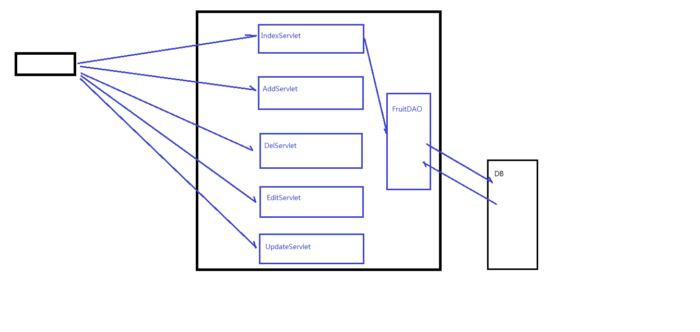

##  furitServlet

```apl
将所有的servlet中的主干方法都放在一个servlet中
```

```java
@WebServlet("/fruit.do")
public class furitServlet extends ViewBaseServlet {
    FruitDAO fruitDAO = new FruitDAOImpl();
    @Override
    protected void service(HttpServletRequest request, HttpServletResponse response) throws ServletException, IOException {


        request.setCharacterEncoding("utf-8");

        String operate = request.getParameter("operate");

        if (StringUtils.isEmpty(operate)){
            index(request,response);
        }
         switch (operate){
            case "index":
                index(request,response);
                break;
            case "edit":
                edit(request,response);
                break;
            case "del":
                del(request,response);
                break;
            case "add":
                add(request,response);
                break;
            case "upadte":
                update(request,response);
                break;
            default:
                throw new RuntimeException("operate字符串不合法！");
            
        }


    }


    private void updte(HttpServletRequest req, HttpServletResponse resp) throws ServletException, IOException {
        //设置编码
        req.setCharacterEncoding("utf-8");

        //获取参数
        String FIDStr = req.getParameter("fid");
        int fid = Integer.parseInt(FIDStr);


        String fname = req.getParameter("fname");

        String priceStr = req.getParameter("price");
        int price = Integer.parseInt(priceStr);

        String fcountStr = req.getParameter("fcount");
        int fcount = Integer.parseInt(fcountStr);

        String remark = req.getParameter("remark");


        //执行更新
        fruitDAO.updateFruit(new Fruit(fid,fname,price,fcount,remark));

        //跳转页面
        // super.processTemplate("index",req,resp);
        // req.getRequestDispatcher("index.html").forward(req,resp);
        resp.sendRedirect("fruit.do");

    }


    private void add(HttpServletRequest req, HttpServletResponse resp) throws ServletException, IOException {
        req.setCharacterEncoding("utf-8");

        String fname = req.getParameter("fname");

        String priceStr = req.getParameter("price");
        int price = Integer.parseInt(priceStr);

        String fcountStr = req.getParameter("fcount");
        int fcount = Integer.parseInt(fcountStr);

        String remark = req.getParameter("remark");

        fruitDAO.addFruit(new Fruit(0,fname,price,fcount,remark));

        resp.sendRedirect("fruit.do");

    }


    private void del(HttpServletRequest request, HttpServletResponse response) throws ServletException, IOException {

        String fidObj = request.getParameter("fid");
        if (StringUtils.isNotEmpty(fidObj)){
            int fid = Integer.parseInt(fidObj);
            fruitDAO.delFruit(fid);

            // super.processTemplate("index",req,resp);
            response.sendRedirect("fruit.do");
        }
    }


    private void edit(HttpServletRequest request, HttpServletResponse response) throws ServletException, IOException {


        String fidStr = request.getParameter("fid");
        if (StringUtils.isNotEmpty(fidStr)){
            int fid = Integer.parseInt(fidStr);

            Fruit fruit = fruitDAO.getFruitByFid(fid);
            request.setAttribute("fruit",fruit);
            super.processTemplate("edit",request,response);
        }
    }


    private void index(HttpServletRequest req, HttpServletResponse resp) throws ServletException, IOException {

        req.setCharacterEncoding("utf-8");
        HttpSession session = req.getSession();
        FruitDAO fruitDAO = new FruitDAOImpl();
        Integer pageNo = 1;
        String keyword = null;
        String oper = req.getParameter("oper");

        if (StringUtils.isNotEmpty(oper) && "search".equals(oper)) {

            pageNo=1; //新的查询，页面应该在第一页开始
            keyword = req.getParameter("keyword");
            if (StringUtils.isEmpty(keyword)) {
                keyword="";
            }
            session.setAttribute("keyword", keyword);


        } else {
            String pageNoSrt = req.getParameter("pageNo");
            if (StringUtils.isNotEmpty(pageNoSrt)) {
                pageNo = Integer.parseInt(pageNoSrt);
            }

            Object keywordObj = session.getAttribute("keyword");
            if (keywordObj!=null) {
                keyword = (String) keywordObj;
            }else {
                keyword="";
            }
        }


        int fruitNum = fruitDAO.getFruitNum(keyword);
        int pagecount = (fruitNum + 5 - 1) / 5;
        session.setAttribute("pagecount", pagecount);


        // 1. 获取到对应页码的全部的数据
        session.setAttribute("pageNo", pageNo);
        List<Fruit> fruitList = fruitDAO.getFruitList(keyword, pageNo);

        // 2. 保存到session作用域
        // HttpSession session = req.getSession();
        session.setAttribute("fruitList", fruitList);

        // 此处的视图名称是 index
        // 那么thymeleaf会将这个 逻辑视图名称 对应到 物理视图 名称上去
        // 逻辑视图名称 ：   index
        // 物理视图名称 ：   view-prefix + 逻辑视图名称 + view-suffix
        // 所以真实的视图名称是：      /       index       .html

        // 3. 通过继承的方法processTemplate()将收集到的数据发送到，对应地址的index.html页面上
        super.processTemplate("index", req, resp);
    }


}
```

## ViewBaseServlet

```java
public class ViewBaseServlet extends HttpServlet {

    private TemplateEngine templateEngine;

    @Override
    public void init() throws ServletException {//这个方法会读取xml文件中的两个参数

        // 1.获取ServletContext对象
        ServletContext servletContext = this.getServletContext();

        // 2.创建Thymeleaf解析器对象
        ServletContextTemplateResolver templateResolver = new ServletContextTemplateResolver(servletContext);

        // 3.给解析器对象设置参数
        // ①HTML是默认模式，明确设置是为了代码更容易理解
        templateResolver.setTemplateMode(TemplateMode.HTML);

        // ②设置前缀
        String viewPrefix = servletContext.getInitParameter("view-prefix");

        templateResolver.setPrefix(viewPrefix);

        // ③设置后缀
        String viewSuffix = servletContext.getInitParameter("view-suffix");

        templateResolver.setSuffix(viewSuffix);

        // ④设置缓存过期时间（毫秒）
        templateResolver.setCacheTTLMs(60000L);

        // ⑤设置是否缓存
        templateResolver.setCacheable(true);

        // ⑥设置服务器端编码方式
        templateResolver.setCharacterEncoding("utf-8");

        // 4.创建模板引擎对象
        templateEngine = new TemplateEngine();

        // 5.给模板引擎对象设置模板解析器
        templateEngine.setTemplateResolver(templateResolver);

    }

    // 处理模板(模板名字，请求，响应)
    protected void processTemplate(String templateName, HttpServletRequest req, HttpServletResponse resp) throws IOException {
        // 1.设置响应体内容类型和字符集
        resp.setContentType("text/html;charset=UTF-8");

        // 2.创建WebContext对象
        WebContext webContext = new WebContext(req, resp, getServletContext());

        // 3.处理模板数据
        templateEngine.process(templateName, webContext, resp.getWriter());
    }
}
```

## index.html

```html
<html xmlns:th="http://www.thymeleaf.org">
<head>
    <meta charset="utf-8">
    <link rel="stylesheet" href="css/index.css">
    <script language="JavaScript" src="js/index.js"></script>
</head>
<body>
<div id="div_container">
    <div id="div_fruit_list">
        <p class="center f30">欢迎使用水果库存后台管理系统</p>

        <div style="border: 0px solid red; width: 60%; margin-left: 20%; text-align: right;">

            <form th:action="@{/fruit.do}" method="post" style="float: left ;width: 60%;margin-left: 20%">
                <input type="hidden" name="oper" value="search"/>
                请输入关键字:<input type="text" name="keyword" th:value="${session.keyword}"/>
                <input type="submit" value="查询" class="btn"/>
            </form>

            <a th:href="@{/add.html}" style="border: 0px solid blue; margin-bottom: 4px;">添加库存记录</a>
        </div>

        <table id="tbl_fruit">
            <tr>
                <th class="w20">名称1</th>
                <th class="w20">单价</th>
                <th class="w20">数量</th>
                <th>操作</th>
            </tr>

            
            
            <tr th:if="${#lists.isEmpty(session.fruitList)}">
                <td colspan="4">对不起，库存为空！</td> <!--colspan="4"表示合并了4行-->
            </tr>

            <!--下面的代码是每循环一次就将list中的数据取出来一个-->
            <tr th:unless="${#lists.isEmpty(session.fruitList)}" th:each="fruit:${session.fruitList}">
                <!--如果此处session省略了，那么将会从request作用域中去取数据-->
                <!--<td th:text="${fruit.fname}"><a herf="edit.do">苹果1</a></td>-->
                <!--<td ><a th:text="${fruit.fname}" th:href="@{'/edit.do?fid='+${fruit.fid}}">苹果1</a></td>-->
                <td><a th:text="${fruit.fname}" th:href="@{/fruit.do(fid=${fruit.fid},operate='edit')}">苹果1</a></td>

                <td th:text="${fruit.price}">5</td>
                <td th:text="${fruit.fcount}">20</td>

                <!--<td></td>-->
                <td></td>
  <!--上式中，"|delFruit(${fruit.fid})|"，虽然是一个字符串，但是遇到thymleaf表达式${}之后,就会自动识别完成字符串的拼接-->

            </tr>
        </table>
        <div style=" width: 60%; margin-left: 20%; border: 0px solid red; padding-top: 4px" class="center">
            <input type="button" value="首 页" class="btn" th:onclick="|page(1)|" th:disabled="|${session.pageNo==1}|"/>
            <input type="button" value="下一页" class="btn" th:onclick="|page(${session.pageNo + 1})|"
                   th:disabled="|${session.pageNo==session.pagecount}|"/>
            <input type="button" value="上一页" class="btn" th:onclick="|page(${session.pageNo - 1})|"
                   th:disabled="|${session.pageNo==1}|"/>
            <input type="button" value="尾 页" class="btn" th:onclick="|page(${session.pagecount})|"
                   th:disabled="|${session.pageNo==session.pagecount}|"/>
        </div>

    </div>
</div>
</body>
</html>

```


## edit.html

```html
<html  xmlns="http://www.w3.org/1999/xhtml" xmlns:th="http://www.thymeleaf.org">
<html>
<head>
	<meta charset="utf-8">
	<link rel="stylesheet" href="css/edit.css">
</head>
<body>
<div id="div_container">
	<div id="div_fruit_list">
		<p class="center f30">编辑库存信息1</p>
        
        
		<form  th:action="@{/fruit.do}"  method="post" >
			<input type="hidden" name="operate" value="update"/>
			<!--			th:object="${fruit}"-->


			<!-- 隐藏域 ： 功能类似于文本框 ， 它的值会随着表单的发送也会发送给服务器，但是界面上用户看不到 -->
			<td ><input type="hidden" name = "fid" th:value="${fruit.fid}"/></td>

			<table id="tbl_fruit" >


				<tr>
					<th class="w20">名称:</th>
					<td ><input type="text" name = "fname" th:value="${fruit.fname}"/></td>
				</tr>

				<tr>
					<th class="w20">单价:</th>
					<td><input type="text" name="price" th:value="${fruit.price}"/></td>
				</tr>

				<tr>
					<th class="w20">库存:</th>
					<td><input type="text" name="fcount" th:value="${fruit.fcount}"/></td>
				</tr>

				<tr>
					<th class="w20">备注:</th>
					<td><input type="text" name="remark" th:value="${fruit.remark}"/></td>
				</tr>

				<tr>
					<th colspan="2">
						<input type="submit" value="修改" class="btn">
					</th>
				</tr>

			</table>
		</form>
	</div>
</div>
</body>
</html>

```


## add.html

```apl
 <!--这个页面中thymeleaf语法没有被后端的Servlet中processTemplate解析 ，看评论去有详细说-->
```


```html
<html  xmlns="http://www.w3.org/1999/xhtml" xmlns:th="http://www.thymeleaf.org">
<html>
<head>
	<meta charset="utf-8">
	<link rel="stylesheet" href="css/add.css">
</head>
<body>
<div id="div_container">
	<div id="div_fruit_list">
		<p class="center f30">新增库存信息</p>

		<form  action="fruit.do"  method="post" >
            <!--这个页面中thymeleaf语法没有被后端的Servlet中processTemplate解析 ，看评论去有详细说-->
			<!--需要吧页面托管给 thymleaf-->

			<input type="hidden" name="operate" value="add"/>

			<!--		<form  th:action="@{/add.do}"   method="post" >  这里是wrong-->
			<!--    index.html是直接访问物理页面add.html，物理页面未经过Thyemeleaf渲染，因此Thyemeleaf表达式未生效-->
			<!--			问题就是时通过超链接直接访问的html页面，没有经过thy渲染-->
			<table id="tbl_fruit" >

				<tr>
					<th class="w20">名称:</th>
					<td ><input type="text" name = "fname" /></td>
				</tr>

				<tr>
					<th class="w20">单价:</th>
					<td><input type="text" name="price" /></td>
				</tr>

				<tr>
					<th class="w20">库存:</th>
					<td><input type="text" name="fcount"/></td>
				</tr>

				<tr>
					<th class="w20">备注:</th>
					<td><input type="text" name="remark"/></td>
				</tr>

				<tr>
					<th colspan="2">
						<input type="submit" value="修改">
					</th>
				</tr>

			</table>
		</form>
	</div>
</div>
</body>
</html>

```

## index.js

```javascript
function delFruit(fid){
    if (confirm("是否确认删除？")){
        window.location.href='fruit.do?fid='+fid+'&operate=del';
        // window表示的是当前窗口，location值得是此时的网址URl，.herf表示在其后方拼接'del.do'+fid
    }
}

function page(pageNo){ //需要在变量处定义一下
    window.location.href='fruit.do?pageNo='+pageNo; //没有带这operate，默认找index方法
}

```


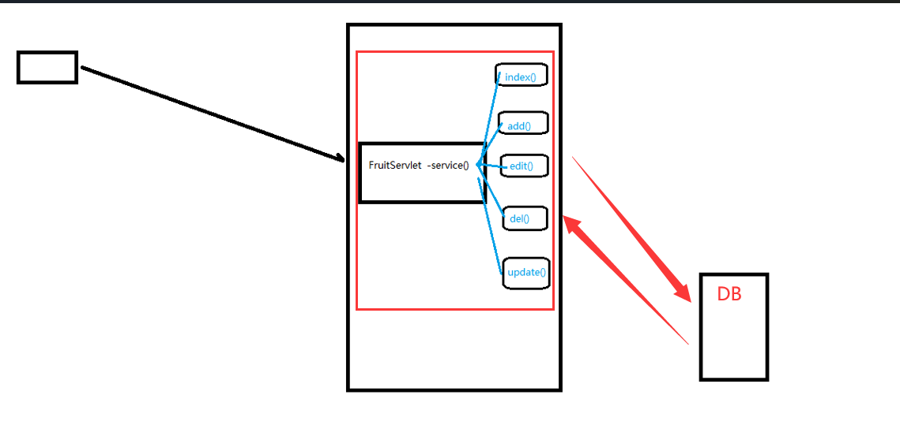


# 引用反射优化

```
如果servlet中的方法有很多，那么就会导致swith很长，所以下面使用反射进行优化
```

```java
@WebServlet("/fruit.do")
public class furitServlet extends ViewBaseServlet {
    FruitDAO fruitDAO = new FruitDAOImpl();
    @Override
    protected void service(HttpServletRequest request, HttpServletResponse response) throws ServletException, IOException {


        request.setCharacterEncoding("utf-8");

        String operate = request.getParameter("operate");

        if (StringUtils.isEmpty(operate)){
            index(request,response);
        }

       //获取所有方法名的数组
        Method[] Methods = this.getClass().getDeclaredMethods();
        
        //循环遍历数组，并从中找到与operate字符串值相等的数组
        for (Method m : Methods) {

            if (operate.equals(m.getName())){ //此处的相等要使用equals()
                try {
                    //执行该方法
                    m.invoke(this,request,response);
                    return;
                } catch (IllegalAccessException e) {
                    throw new RuntimeException(e);
                } catch (InvocationTargetException e) {
                    throw new RuntimeException(e);
                }
            }

        }

        throw new RuntimeException("operate不合法!");


    }


    private void updte(HttpServletRequest req, HttpServletResponse resp) throws ServletException, IOException {
        //设置编码
        req.setCharacterEncoding("utf-8");

        //获取参数
        String FIDStr = req.getParameter("fid");
        int fid = Integer.parseInt(FIDStr);


        String fname = req.getParameter("fname");

        String priceStr = req.getParameter("price");
        int price = Integer.parseInt(priceStr);

        String fcountStr = req.getParameter("fcount");
        int fcount = Integer.parseInt(fcountStr);

        String remark = req.getParameter("remark");


        //执行更新
        fruitDAO.updateFruit(new Fruit(fid,fname,price,fcount,remark));

        //跳转页面
        // super.processTemplate("index",req,resp);
        // req.getRequestDispatcher("index.html").forward(req,resp);
        resp.sendRedirect("fruit.do");

    }


    private void add(HttpServletRequest req, HttpServletResponse resp) throws ServletException, IOException {
        req.setCharacterEncoding("utf-8");

        String fname = req.getParameter("fname");

        String priceStr = req.getParameter("price");
        int price = Integer.parseInt(priceStr);

        String fcountStr = req.getParameter("fcount");
        int fcount = Integer.parseInt(fcountStr);

        String remark = req.getParameter("remark");

        fruitDAO.addFruit(new Fruit(0,fname,price,fcount,remark));

        resp.sendRedirect("fruit.do");

    }


    private void del(HttpServletRequest request, HttpServletResponse response) throws ServletException, IOException {

        String fidObj = request.getParameter("fid");
        if (StringUtils.isNotEmpty(fidObj)){
            int fid = Integer.parseInt(fidObj);
            fruitDAO.delFruit(fid);

            // super.processTemplate("index",req,resp);
            response.sendRedirect("fruit.do");
        }
    }


    private void edit(HttpServletRequest request, HttpServletResponse response) throws ServletException, IOException {


        String fidStr = request.getParameter("fid");
        if (StringUtils.isNotEmpty(fidStr)){
            int fid = Integer.parseInt(fidStr);

            Fruit fruit = fruitDAO.getFruitByFid(fid);
            request.setAttribute("fruit",fruit);
            super.processTemplate("edit",request,response);
        }
    }


    private void index(HttpServletRequest req, HttpServletResponse resp) throws ServletException, IOException {

        req.setCharacterEncoding("utf-8");
        HttpSession session = req.getSession();
        FruitDAO fruitDAO = new FruitDAOImpl();
        Integer pageNo = 1;
        String keyword = null;
        String oper = req.getParameter("oper");

        if (StringUtils.isNotEmpty(oper) && "search".equals(oper)) {

            pageNo=1; //新的查询，页面应该在第一页开始
            keyword = req.getParameter("keyword");
            if (StringUtils.isEmpty(keyword)) {
                keyword="";
            }
            session.setAttribute("keyword", keyword);


        } else {
            String pageNoSrt = req.getParameter("pageNo");
            if (StringUtils.isNotEmpty(pageNoSrt)) {
                pageNo = Integer.parseInt(pageNoSrt);
            }

            Object keywordObj = session.getAttribute("keyword");
            if (keywordObj!=null) {
                keyword = (String) keywordObj;
            }else {
                keyword="";
            }
        }


        int fruitNum = fruitDAO.getFruitNum(keyword);
        int pagecount = (fruitNum + 5 - 1) / 5;
        session.setAttribute("pagecount", pagecount);


        // 1. 获取到对应页码的全部的数据
        session.setAttribute("pageNo", pageNo);
        List<Fruit> fruitList = fruitDAO.getFruitList(keyword, pageNo);

        // 2. 保存到session作用域
        // HttpSession session = req.getSession();
        session.setAttribute("fruitList", fruitList);

        // 此处的视图名称是 index
        // 那么thymeleaf会将这个 逻辑视图名称 对应到 物理视图 名称上去
        // 逻辑视图名称 ：   index
        // 物理视图名称 ：   view-prefix + 逻辑视图名称 + view-suffix
        // 所以真实的视图名称是：      /       index       .html

        // 3. 通过继承的方法processTemplate()将收集到的数据发送到，对应地址的index.html页面上
        super.processTemplate("index", req, resp);
    }


}
```

# dispactherServlet引入

## 主要思想

```apl
1. 根据请求的URL获取SelvertPath， 然后根据SelvertPath解析截取字符串，解析出一个名字

1. 加载配置文件applicatin.xml并读取文件中的bean ，并将bean对应的标签以及标签对应的实例放在map容器中

3. 根据刚才得到的selvertpath中传递的名字去map中找到 对应的处理类Controler,然后调用comtroler类里面的方法（该方法的值由operate的值来决定）


这样做的好处是，反射代码从controler中提取了出来，并集中放在了dispatcher中去了
```

```apl
注解被拿掉，就不再是一个servlet组件了
```


## 修改目录

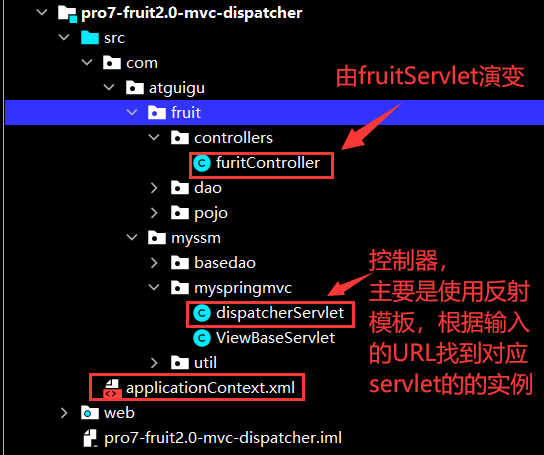

## 结构图解

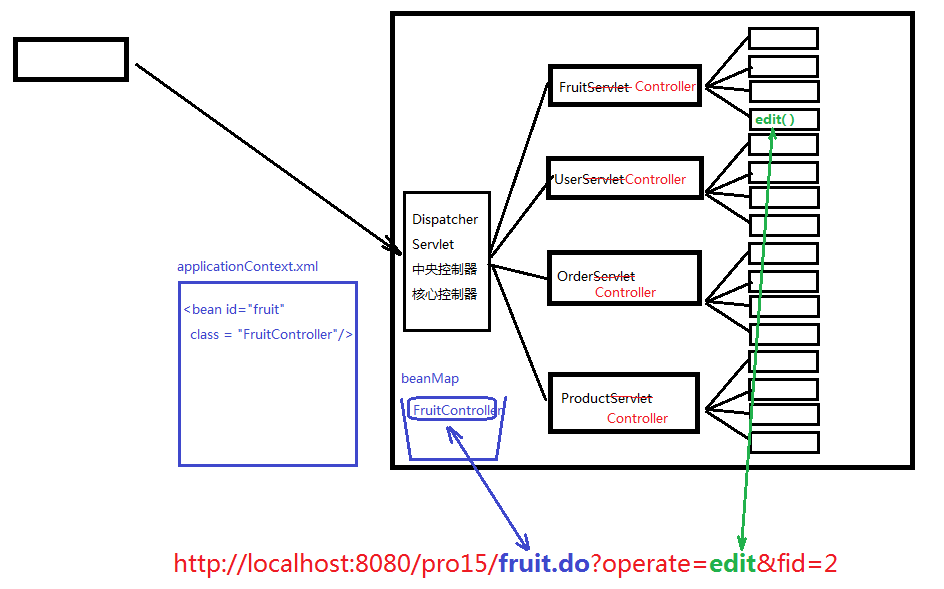


## applicationContext.xml

```xml
<?xml version="1.0" encoding="utf-8"?>
<!-- xml声明的固定写法 -->


<beans><!-- 正文,此处的bean表示java对象，加上个s表示多个java对象 -->

    <!-- 这个bean标签的作用是 将来servletpath中涉及的名字对应的是fruit，那么就要FruitController这个类来处理 -->
    <bean id="fruit" class="com.Novice.fruit.controllers.furitController"/>
    <!--此处表明id="fruit"与后面的controller路径上的类相对应-->

</beans>


<!--
1.概念
HTML : 超文本标记语言
XML : 可扩展的标记语言
HTML是XML的一个子集

2.XML包含三个部分：
1) XML声明 ， 而且声明这一行代码必须在XML文件的第一行 (必须要写的)
2) DTD 文档类型定义
3) XML正文
 -->
```

## fruitContrroller


```apl
为了获取servlet上下文(servletComtext)
```

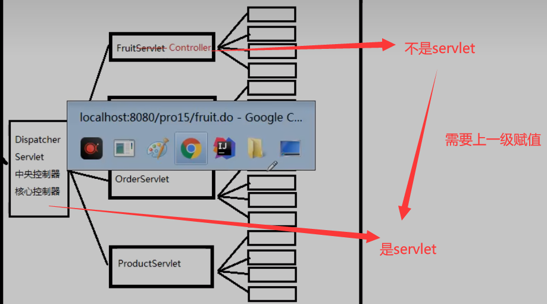


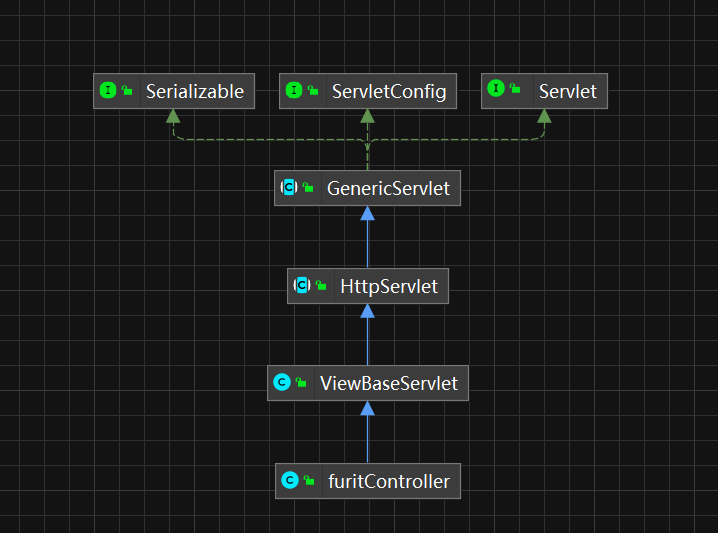


```java
public class furitController extends ViewBaseServlet {


    //之前FruitServlet是一个Sevlet组件,init方法是servlet继承下来的，由tomcat调用
    //所以在furitController实例化时，会自动调用父类ViewBaseServlet的构造方法

    //之前FruitServlet是一个Sevlet组件，那么其中的init方法一定会被调用
    //之前的init方法内部会出现一句话：super.init();

    //以前这里有@WebServlet()所以tomcat可以自动调用super.init(),但是，此时该类已经不是组件了，所以就不会被调用


    private ServletContext servletContext;


    //为元素 servletContext 重写一个set方法
    public void setServletContext(ServletContext servletContext) throws ServletException {
        this.servletContext=servletContext;

        //将获取到的servletContext方法传入父类的init()中去
        super.init(servletContext);
    }


    FruitDAO fruitDAO = new FruitDAOImpl();


    private void updte(HttpServletRequest req, HttpServletResponse resp) throws ServletException, IOException {
        //设置编码
        req.setCharacterEncoding("utf-8");

        //获取参数
        String FIDStr = req.getParameter("fid");
        int fid = Integer.parseInt(FIDStr);


        String fname = req.getParameter("fname");

        String priceStr = req.getParameter("price");
        int price = Integer.parseInt(priceStr);

        String fcountStr = req.getParameter("fcount");
        int fcount = Integer.parseInt(fcountStr);

        String remark = req.getParameter("remark");


        //执行更新
        fruitDAO.updateFruit(new Fruit(fid,fname,price,fcount,remark));

        //跳转页面
        // super.processTemplate("index",req,resp);
        // req.getRequestDispatcher("index.html").forward(req,resp);
        resp.sendRedirect("fruit.do");

    }


    private void add(HttpServletRequest req, HttpServletResponse resp) throws ServletException, IOException {
        req.setCharacterEncoding("utf-8");

        String fname = req.getParameter("fname");

        String priceStr = req.getParameter("price");
        int price = Integer.parseInt(priceStr);

        String fcountStr = req.getParameter("fcount");
        int fcount = Integer.parseInt(fcountStr);

        String remark = req.getParameter("remark");

        fruitDAO.addFruit(new Fruit(0,fname,price,fcount,remark));

        resp.sendRedirect("fruit.do");

    }


    private void del(HttpServletRequest request, HttpServletResponse response) throws ServletException, IOException {

        String fidObj = request.getParameter("fid");
        if (StringUtils.isNotEmpty(fidObj)){
            int fid = Integer.parseInt(fidObj);
            fruitDAO.delFruit(fid);

            // super.processTemplate("index",req,resp);
            response.sendRedirect("fruit.do");
        }
    }


    private void edit(HttpServletRequest request, HttpServletResponse response) throws ServletException, IOException {


        String fidStr = request.getParameter("fid");
        if (StringUtils.isNotEmpty(fidStr)){
            int fid = Integer.parseInt(fidStr);

            Fruit fruit = fruitDAO.getFruitByFid(fid);
            request.setAttribute("fruit",fruit);
            super.processTemplate("edit",request,response);
        }
    }


    private void index(HttpServletRequest req, HttpServletResponse resp) throws ServletException, IOException {

        req.setCharacterEncoding("utf-8");
        HttpSession session = req.getSession();
        FruitDAO fruitDAO = new FruitDAOImpl();
        Integer pageNo = 1;
        String keyword = null;
        String oper = req.getParameter("oper");

        if (StringUtils.isNotEmpty(oper) && "search".equals(oper)) {

            pageNo=1; //新的查询，页面应该在第一页开始
            keyword = req.getParameter("keyword");
            if (StringUtils.isEmpty(keyword)) {
                keyword="";
            }
            session.setAttribute("keyword", keyword);


        } else {
            String pageNoSrt = req.getParameter("pageNo");
            if (StringUtils.isNotEmpty(pageNoSrt)) {
                pageNo = Integer.parseInt(pageNoSrt);
            }

            Object keywordObj = session.getAttribute("keyword");
            if (keywordObj!=null) {
                keyword = (String) keywordObj;
            }else {
                keyword="";
            }
        }


        int fruitNum = fruitDAO.getFruitNum(keyword);
        int pagecount = (fruitNum + 5 - 1) / 5;
        session.setAttribute("pagecount", pagecount);


        // 1. 获取到对应页码的全部的数据
        session.setAttribute("pageNo", pageNo);
        List<Fruit> fruitList = fruitDAO.getFruitList(keyword, pageNo);

        // 2. 保存到session作用域
        // HttpSession session = req.getSession();
        session.setAttribute("fruitList", fruitList);

        // 此处的视图名称是 index
        // 那么thymeleaf会将这个 逻辑视图名称 对应到 物理视图 名称上去
        // 逻辑视图名称 ：   index
        // 物理视图名称 ：   view-prefix + 逻辑视图名称 + view-suffix
        // 所以真实的视图名称是：      /       index       .html

        // 3. 通过继承的方法processTemplate()将收集到的数据发送到，对应地址的index.html页面上
        super.processTemplate("index", req, resp);
    }


}
```

## dispatcherServlet

```java
@WebServlet("*.do") // 此处使用了通配符，表明只要是以.do结尾就可以，拦截所有以.do结尾的请求
public class dispatcherServlet extends HttpServlet {


    HashMap<String,Object>  beanMap = new HashMap<>(); //保证存储在beanMap中的元素对，id对应的是实例对象


    public dispatcherServlet() { //构造器里面不能用this，还没有实例化  因为先实例化再初始化
        // try {
        //
        //     InputStream inputStream = getClass().getClassLoader().getResourceAsStream("applicationContext.xml");
        //     //1.创建DocumentBuilderFactory
        //     DocumentBuilderFactory documentBuilderFactory = DocumentBuilderFactory.newInstance();
        //     //2.创建DocumentBuilder对象
        //     DocumentBuilder documentBuilder = documentBuilderFactory.newDocumentBuilder();
        //     //3.创建Document对象
        //     Document document = documentBuilder.parse(inputStream);
        //     //4.获取所有的bean节点
        //     NodeList beanNodeList = document.getElementsByTagName("bean");
        //
        //
        //     for (int i = 0; i < beanNodeList.getLength(); i++) {
        //
        //         Node beanNode = beanNodeList.item(i); //节点类型等于元素节点
        //
        //         if (beanNode.getNodeType() == Node.ELEMENT_NODE) {
        //             Element beanElement = (Element) beanNode;
        //             String id = beanElement.getAttribute("id");
        //             String className = beanElement.getAttribute("class");
        //
        //             Class controllerBeanClass = Class.forName(className);
        //             Object beanObj = controllerBeanClass.newInstance();
        //
        //             // 通过下面的方法得到furitController的servletContext参数，然后再使用下面的方法为该参数赋值
        //             // Field servletContext = controllerBeanClass.getDeclaredField("servletContext");
        //             // servletContext.setAccessible(true);
        //             // servletContext.set(beanObj,this.getServletContext());
        //
        //             Method setServletContextMethod = controllerBeanClass.getDeclaredMethod("setServletContext", ServletContext.class);
        //             setServletContextMethod.invoke(beanObj,this.getServletContext());
        //
        //
        //
        //
        //             beanMap.put(id,beanObj);
        //
        //
        //         }
        //     }
        //
        // } catch (ParserConfigurationException e) {
        //     throw new RuntimeException(e);
        // } catch (IOException e) {
        //     throw new RuntimeException(e);
        // } catch (SAXException e) {
        //     throw new RuntimeException(e);
        // } catch (ClassNotFoundException e) {
        //     throw new RuntimeException(e);
        // } catch (InstantiationException e) {
        //     throw new RuntimeException(e);
        // } catch (IllegalAccessException e) {
        //     throw new RuntimeException(e);
        // } catch (NoSuchMethodException e) {
        //     throw new RuntimeException(e);
        // } catch (InvocationTargetException e) {
        //     throw new RuntimeException(e);
        // }

    }


    @Override
    // public void init(ServletConfig servletConfig){
    public void init(){


        try {

            //下面一段的主要内容就是为了读取applicationContext.xml中的bean
            
            InputStream inputStream = getClass().getClassLoader().getResourceAsStream("applicationContext.xml");
            //1.创建DocumentBuilderFactory
            DocumentBuilderFactory documentBuilderFactory = DocumentBuilderFactory.newInstance();
            //2.创建DocumentBuilder对象
            DocumentBuilder documentBuilder = documentBuilderFactory.newDocumentBuilder();
            //3.创建Document对象
            Document document = documentBuilder.parse(inputStream);
            //4.获取所有的bean节点
            NodeList beanNodeList = document.getElementsByTagName("bean");


            for (int i = 0; i < beanNodeList.getLength(); i++) {

                Node beanNode = beanNodeList.item(i); //节点类型等于元素节点

                if (beanNode.getNodeType() == Node.ELEMENT_NODE) {
                    Element beanElement = (Element) beanNode;
                    String id = beanElement.getAttribute("id");
                    String className = beanElement.getAttribute("class");

                    Class controllerBeanClass = Class.forName(className);
                    Object beanObj = controllerBeanClass.newInstance();

                // 通过下面的方法得到furitController的servletContext参数，然后再使用下面的方法为该参数赋值
                    // Field servletContext = controllerBeanClass.getDeclaredField("servletContext");
                    // servletContext.setAccessible(true);
                    // servletContext.set(beanObj,this.getServletContext());
                    
                //重写了init(ServletConfig servletConfig)方法发现并不对
                    // servletContext.set(beanObj,servletConfig.getServletContext());


                    //下面的是通过controllerBeanClass的setServletContext()方法来为字段servletContext赋值
                    Method setServletContextMethod =
                            controllerBeanClass.getDeclaredMethod("setServletContext", ServletContext.class);
                    
                    setServletContextMethod.invoke(beanObj,this.getServletContext());


                    beanMap.put(id,beanObj);


                }
            }

        } catch (ParserConfigurationException e) {
            throw new RuntimeException(e);
        } catch (IOException e) {
            throw new RuntimeException(e);
        } catch (SAXException e) {
            throw new RuntimeException(e);
        } catch (ClassNotFoundException e) {
            throw new RuntimeException(e);
        } catch (InstantiationException e) {
            throw new RuntimeException(e);
        } catch (IllegalAccessException e) {
            throw new RuntimeException(e);
        } catch (NoSuchMethodException e) {
            throw new RuntimeException(e);
        } catch (InvocationTargetException e) {
            throw new RuntimeException(e);
        }

    }


    @Override
    protected void service(HttpServletRequest request, HttpServletResponse response) throws ServletException, IOException {
        
        // 设置编码
        request.setCharacterEncoding("UTF-8");
        
        
        // 假设url是：  http://localhost:8080/pro15/hello.do
        // 那么servletPath是：    /hello.do
        String servletPath = request.getServletPath();

        // 思路：
        // 第1步： /hello.do 通过字符串截取->   hello   (或者  /fruit.do  -> fruit)
        servletPath = servletPath.substring(1);
        int i = servletPath.lastIndexOf(".do");
        servletPath = servletPath.substring(0, i);

        // 第2步： hello -> HelloController 或者 fruit -> FruitController
        // 即通过截取得到的字符串与上一个方法得到的Map合作得到对应的对应的controller对象
        Object conrtollerBeanObj = beanMap.get(servletPath);


        String operate = request.getParameter("operate");
        if (StringUtils.isEmpty(operate)){
            operate="index";
        }

        try {

            //通过operate的值，以及后面传入的两个参数来确定应该选择哪一个方法
            Method m =
                    conrtollerBeanObj.getClass().
                            getDeclaredMethod(operate, HttpServletRequest.class, HttpServletResponse.class);


            if (m!=null){
                //确定了方法，如果conrtollerBeanObj对象中有该方法，那么通过m.invoke(conrtollerBeanObj,request,response)就可以进行调用
                m.setAccessible(true);//如果不为true那么没有调用该方法的权限

                // m.invoke(this,request,response);  之前这个代码写在了fruitControler里面，所以使用this可以，但是现在需要直接传入对象
                m.invoke(conrtollerBeanObj,request,response);

            }else{
                throw new RuntimeException("operate不合法!");
            }

        } catch (NoSuchMethodException | IllegalAccessException | InvocationTargetException e) {
            throw new RuntimeException(e);
        }


    }


}
```


**下面这一坨代码就是将bean中某一个标签以及该标签保存的实例对象保存到Map中去**

```java
HashMap<String,Object>  beanMap = new HashMap<>(); //保证存储在beanMap中的元素对，id对应的是实例对象


    public dispatcherServlet() {

    }


    public void init(){


        try {

            InputStream inputStream = getClass().getClassLoader().getResourceAsStream("applicationContext.xml");
            //1.创建DocumentBuilderFactory
            DocumentBuilderFactory documentBuilderFactory = DocumentBuilderFactory.newInstance();
            //2.创建DocumentBuilder对象
            DocumentBuilder documentBuilder = documentBuilderFactory.newDocumentBuilder();
            //3.创建Document对象
            Document document = documentBuilder.parse(inputStream);
            //4.获取所有的bean节点
            NodeList beanNodeList = document.getElementsByTagName("bean");


            for (int i = 0; i < beanNodeList.getLength(); i++) {

                Node beanNode = beanNodeList.item(i); //节点类型等于元素节点

                if (beanNode.getNodeType() == Node.ELEMENT_NODE) {
                    Element beanElement = (Element) beanNode;
                    String id = beanElement.getAttribute("id");
                    String className = beanElement.getAttribute("class");
                    Class controllerBeanClass = Class.forName(className);
                    Object beanObj = controllerBeanClass.newInstance();

                    Method setServletContextMethod = controllerBeanClass.getDeclaredMethod("setServletContext", ServletContext.class);
                    setServletContextMethod.invoke(beanObj,this.getServletContext());


                    beanMap.put(id,beanObj);


                }
            }

        } catch (ParserConfigurationException e) {
            throw new RuntimeException(e);
        } catch (IOException e) {
            throw new RuntimeException(e);
        } catch (SAXException e) {
            throw new RuntimeException(e);
        } catch (ClassNotFoundException e) {
            throw new RuntimeException(e);
        } catch (InstantiationException e) {
            throw new RuntimeException(e);
        } catch (IllegalAccessException e) {
            throw new RuntimeException(e);
        } catch (NoSuchMethodException e) {
            throw new RuntimeException(e);
        } catch (InvocationTargetException e) {
            throw new RuntimeException(e);
        }

    }
```


## ViewBserServlet

```apl
继承这个类的作用是为了使用Thymeleaf（视图模板技术）
```


```java
package com.Novice.myssm.myspringmvc;

import org.thymeleaf.TemplateEngine;
import org.thymeleaf.context.WebContext;
import org.thymeleaf.templatemode.TemplateMode;
import org.thymeleaf.templateresolver.ServletContextTemplateResolver;

import javax.servlet.ServletContext;
import javax.servlet.ServletException;
import javax.servlet.http.HttpServlet;
import javax.servlet.http.HttpServletRequest;
import javax.servlet.http.HttpServletResponse;
import java.io.IOException;

public class ViewBaseServlet extends HttpServlet {

    private TemplateEngine templateEngine;
    private ServletContext servletContext;

    // @Override
    public void init(ServletContext servletContext) throws ServletException {//这个方法会读取xml文件中的两个参数

        //为了能够调用这里的init(),并将servletContrxt数据传进来，所以此处在init()方法中加入了参数
        this.servletContext = servletContext;//将子类传入的servletSontext值传给字段


        // 1.获取ServletContext对象
        // ServletContext servletContext = this.getServletContext();
        //之前这里的SelvetContext()是可以通过继承自己的类别tomcat调用super.init()传递进来的

        // 2.创建Thymeleaf解析器对象
        ServletContextTemplateResolver templateResolver = new ServletContextTemplateResolver(servletContext);

        // 3.给解析器对象设置参数
        // ①HTML是默认模式，明确设置是为了代码更容易理解
        templateResolver.setTemplateMode(TemplateMode.HTML);

        // ②设置前缀
        String viewPrefix = servletContext.getInitParameter("view-prefix");

        templateResolver.setPrefix(viewPrefix);

        // ③设置后缀
        String viewSuffix = servletContext.getInitParameter("view-suffix");

        templateResolver.setSuffix(viewSuffix);

        // ④设置缓存过期时间（毫秒）
        templateResolver.setCacheTTLMs(60000L);

        // ⑤设置是否缓存
        templateResolver.setCacheable(true);

        // ⑥设置服务器端编码方式
        templateResolver.setCharacterEncoding("utf-8");

        // 4.创建模板引擎对象
        templateEngine = new TemplateEngine();

        // 5.给模板引擎对象设置模板解析器
        templateEngine.setTemplateResolver(templateResolver);

    }

    // 处理模板(模板名字，请求，响应)
    protected void processTemplate(String templateName, HttpServletRequest req, HttpServletResponse resp) throws IOException {
        // 1.设置响应体内容类型和字符集
        resp.setContentType("text/html;charset=UTF-8");

        // 2.创建WebContext对象
        // WebContext webContext = new WebContext(req, resp, servletContext);
        // 将被子类传入的servletContext值赋值给下面的对象
        WebContext webContext = new WebContext(req, resp, this.servletContext);

        // 3.处理模板数据
        templateEngine.process(templateName, webContext, resp.getWriter());
    }
}
```


# 提取视图资源处理通用代码


```apl
fruitcontroller中的对html操作的代码中都有获取参数的代码并且方法的结尾都进行重定向或者转发，看起来可提取为模板，如下
```


## 提取资源转移

### ViewBaseServlet

```java
public class ViewBaseServlet extends HttpServlet {

    private TemplateEngine templateEngine;

    @Override
    public void init() throws ServletException {//这个方法会读取xml文件中的两个参数

        // 1.获取ServletContext对象
        ServletContext servletContext = this.getServletContext();

        // 2.创建Thymeleaf解析器对象
        ServletContextTemplateResolver templateResolver = new ServletContextTemplateResolver(servletContext);

        // 3.给解析器对象设置参数
        // ①HTML是默认模式，明确设置是为了代码更容易理解
        templateResolver.setTemplateMode(TemplateMode.HTML);

        // ②设置前缀
        String viewPrefix = servletContext.getInitParameter("view-prefix");

        templateResolver.setPrefix(viewPrefix);

        // ③设置后缀
        String viewSuffix = servletContext.getInitParameter("view-suffix");

        templateResolver.setSuffix(viewSuffix);

        // ④设置缓存过期时间（毫秒）
        templateResolver.setCacheTTLMs(60000L);

        // ⑤设置是否缓存
        templateResolver.setCacheable(true);

        // ⑥设置服务器端编码方式
        templateResolver.setCharacterEncoding("utf-8");

        // 4.创建模板引擎对象
        templateEngine = new TemplateEngine();

        // 5.给模板引擎对象设置模板解析器
        templateEngine.setTemplateResolver(templateResolver);

    }

    // 处理模板(模板名字，请求，响应)
    protected void processTemplate(String templateName, HttpServletRequest req, HttpServletResponse resp) throws IOException {
        // 1.设置响应体内容类型和字符集
        resp.setContentType("text/html;charset=UTF-8");

        // 2.创建WebContext对象
        WebContext webContext = new WebContext(req, resp, getServletContext());

        // 3.处理模板数据
        templateEngine.process(templateName, webContext, resp.getWriter());
    }
}
```


### dispatcherServlet

```java
@WebServlet("*.do") // 此处使用了通配符，表明只要是以.do结尾就可以，拦截所有以.do结尾的请求
public class dispatcherServlet extends ViewBaseServlet {
    //因为需要接收并处controller返回的字符串，有些情况需要调用ViewBaseServlet的方法，所以此处继承了ViewBaseServlet类


    HashMap<String,Object>  beanMap = new HashMap<>(); //保证存储在beanMap中的元素对，id对应的是实例对象


    public dispatcherServlet() { //构造器里面不能用this，还没有实例化  因为先实例化再初始化

    }


    @Override
    // public void init(ServletConfig servletConfig){
    public void init() throws ServletException {

        super.init();

        try {

            InputStream inputStream = getClass().getClassLoader().getResourceAsStream("applicationContext.xml");
            //1.创建DocumentBuilderFactory
            DocumentBuilderFactory documentBuilderFactory = DocumentBuilderFactory.newInstance();
            //2.创建DocumentBuilder对象
            DocumentBuilder documentBuilder = documentBuilderFactory.newDocumentBuilder();
            //3.创建Document对象
            Document document = documentBuilder.parse(inputStream);
            //4.获取所有的bean节点
            NodeList beanNodeList = document.getElementsByTagName("bean");


            for (int i = 0; i < beanNodeList.getLength(); i++) {

                Node beanNode = beanNodeList.item(i); //节点类型等于元素节点

                if (beanNode.getNodeType() == Node.ELEMENT_NODE) {
                    Element beanElement = (Element) beanNode;
                    String id = beanElement.getAttribute("id");
                    String className = beanElement.getAttribute("class");

                    Class controllerBeanClass = Class.forName(className);
                    Object beanObj = controllerBeanClass.newInstance();

                    beanMap.put(id,beanObj);


                }
            }

        } catch (ParserConfigurationException e) {
            throw new RuntimeException(e);
        } catch (IOException e) {
            throw new RuntimeException(e);
        } catch (SAXException e) {
            throw new RuntimeException(e);
        } catch (ClassNotFoundException e) {
            throw new RuntimeException(e);
        } catch (InstantiationException e) {
            throw new RuntimeException(e);
        } catch (IllegalAccessException e) {
            throw new RuntimeException(e);
        }

    }


    @Override
    protected void service(HttpServletRequest request, HttpServletResponse response) throws ServletException, IOException {
        // 设置编码
        request.setCharacterEncoding("UTF-8");
        // 假设url是：  http://localhost:8080/pro15/hello.do

        // 那么servletPath是：    /hello.do
        String servletPath = request.getServletPath();


        // 思路是：
        // 第1步： /hello.do 通过字符串截取->   hello   (或者  /fruit.do  -> fruit)
        servletPath = servletPath.substring(1);
        int i = servletPath.lastIndexOf(".do");
        servletPath = servletPath.substring(0, i);

        // 第2步： hello -> HelloController 或者 fruit -> FruitController
        // 即通过截取得到的字符串与上一个方法得到的Map合作得到对应的对应的controller对象
        Object conrtollerBeanObj = beanMap.get(servletPath);


        String operate = request.getParameter("operate");
        if (StringUtils.isEmpty(operate)){
            operate="index";
        }

        try {

            //通过operate的值，以及后面传入的两个参数来确定应该选择哪一个方法
            Method m =
                    conrtollerBeanObj.getClass().
                            getDeclaredMethod(operate, HttpServletRequest.class); //因为controller中的方法改变了，所以不需要再传入多余的参数了
                            // getDeclaredMethod(operate, HttpServletRequest.class, HttpServletResponse.class);


            if (m!=null){
                //conrtoller组件中的方法调用
                m.setAccessible(true);//如果不为true那么没有调用该方法的权限
                Object returnObj = m.invoke(conrtollerBeanObj,request); //.invoke()方法返回的是obj类型

                //视图处理
                String methodReturnObj = (String) returnObj;
                if (methodReturnObj.startsWith("redirect:")){   // 比如: “redirect:fruit.do”
                    String refirectStr = methodReturnObj.substring("redirect:".length());
                    response.sendRedirect(refirectStr);
                }else {
                    super.processTemplate(methodReturnObj,request,response); //比如: “edit”
                }


            }else{
                throw new RuntimeException("operate不合法!");
            }

        } catch (NoSuchMethodException | IllegalAccessException | InvocationTargetException e) {
            throw new RuntimeException(e);
        }


    }


}

```


### furitController

```java
public class furitController  {

    //此时fruitcontriller已经越来越接近一个普通的类了，但是此时这还不能算是一个普通的类，因为还是和serbvletAPI有一定的关系


    FruitDAO fruitDAO = new FruitDAOImpl();


    //提取资源跳转之后，方法就只用关心数据的处理，只用在处理后return一个字符串
    //并不需要关系资源的额跳转重定向，以及资源的处理

    private String updte(HttpServletRequest req) throws ServletException{

        //获取参数
        String FIDStr = req.getParameter("fid");
        int fid = Integer.parseInt(FIDStr);


        String fname = req.getParameter("fname");

        String priceStr = req.getParameter("price");
        int price = Integer.parseInt(priceStr);

        String fcountStr = req.getParameter("fcount");
        int fcount = Integer.parseInt(fcountStr);

        String remark = req.getParameter("remark");


        //执行更新
        fruitDAO.updateFruit(new Fruit(fid,fname,price,fcount,remark));

        //资源的跳转

        // resp.sendRedirect("fruit.do");

        //对资源重定向进行抽取
        return "fruit.do";
        //此处是谁调用的这个方法，就将这里的数据返回给谁
        //（这里是中央控制器调用的该方法，那么就将其返回给中央控制器）

    }


    private String add(HttpServletRequest req) throws ServletException, IOException {
        req.setCharacterEncoding("utf-8");

        String fname = req.getParameter("fname");

        String priceStr = req.getParameter("price");
        int price = Integer.parseInt(priceStr);

        String fcountStr = req.getParameter("fcount");
        int fcount = Integer.parseInt(fcountStr);

        String remark = req.getParameter("remark");

        fruitDAO.addFruit(new Fruit(0,fname,price,fcount,remark));

        // resp.sendRedirect("fruit.do");

        return "fruit.do";

    }


    private String del(HttpServletRequest request) throws ServletException, IOException {

        String fidObj = request.getParameter("fid");
        if (StringUtils.isNotEmpty(fidObj)){
            int fid = Integer.parseInt(fidObj);
            fruitDAO.delFruit(fid);

            // response.sendRedirect("fruit.do");

            return "fruit.do";
        }
        return "error";
    }


    private String edit(HttpServletRequest request) throws ServletException, IOException {


        String fidStr = request.getParameter("fid");
        if (StringUtils.isNotEmpty(fidStr)){
            int fid = Integer.parseInt(fidStr);

            Fruit fruit = fruitDAO.getFruitByFid(fid);
            request.setAttribute("fruit",fruit);

            // super.processTemplate("edit",request,response);

            return "edit";
        }
        return "error";
    }


    private String index(HttpServletRequest req) throws ServletException, IOException {

        req.setCharacterEncoding("utf-8");

        HttpSession session = req.getSession();
        FruitDAO fruitDAO = new FruitDAOImpl();
        Integer pageNo = 1;
        String keyword = null;
        String oper = req.getParameter("oper");

        if (StringUtils.isNotEmpty(oper) && "search".equals(oper)) {

            pageNo=1; //新的查询，页面应该在第一页开始
            keyword = req.getParameter("keyword");
            if (StringUtils.isEmpty(keyword)) {
                keyword="";
            }
            session.setAttribute("keyword", keyword);


        } else {
            String pageNoSrt = req.getParameter("pageNo");
            if (StringUtils.isNotEmpty(pageNoSrt)) {
                pageNo = Integer.parseInt(pageNoSrt);
            }

            Object keywordObj = session.getAttribute("keyword");
            if (keywordObj!=null) {
                keyword = (String) keywordObj;
            }else {
                keyword="";
            }
        }


        int fruitNum = fruitDAO.getFruitNum(keyword);
        int pagecount = (fruitNum + 5 - 1) / 5;
        session.setAttribute("pagecount", pagecount);


        // 1. 获取到对应页码的全部的数据
        session.setAttribute("pageNo", pageNo);
        List<Fruit> fruitList = fruitDAO.getFruitList(keyword, pageNo);

        // 2. 保存到session作用域
        // HttpSession session = req.getSession();
        session.setAttribute("fruitList", fruitList);

        // 此处的视图名称是 index
        // 那么thymeleaf会将这个 逻辑视图名称 对应到 物理视图 名称上去
        // 逻辑视图名称 ：   index
        // 物理视图名称 ：   view-prefix + 逻辑视图名称 + view-suffix
        // 所以真实的视图名称是：      /       index       .html

        // 3. 通过继承的方法processTemplate()将收集到的数据发送到，对应地址的index.html页面上

        // super.processTemplate("index", req, resp);

        return "index";
    }


}
```

## 提取获取请求


# 在核心控制器中统一获取参数及视图处理


## furitController

```java
package com.Novice.fruit.controllers;

import com.Novice.fruit.dao.FruitDAO;
import com.Novice.fruit.dao.impl.FruitDAOImpl;
import com.Novice.fruit.pojo.Fruit;
import com.Novice.myssm.util.StringUtils;

import javax.servlet.ServletException;
import javax.servlet.http.HttpServletRequest;
import javax.servlet.http.HttpSession;
import java.util.List;


public class furitController  {

    //此时fruitcontriller已经越来越接近一个普通的类了，但是此时这还不能算是一个普通的类，因为还是和serbvletAPI有一定的关系


    FruitDAO fruitDAO = new FruitDAOImpl();


    //提取资源跳转之后，方法就只用关心数据的处理，只用在处理后return一个字符串
    //并不需要关系资源的额跳转重定向，以及资源的处理

    private String updte(Integer fid,String fname,Integer price,Integer fcount,String remark) throws ServletException{


        //执行更新
        fruitDAO.updateFruit(new Fruit(fid,fname,price,fcount,remark));

        //资源的跳转

        // resp.sendRedirect("fruit.do");

        //对资源重定向进行抽取
        return "redirect:fruit.do";
        //此处是谁调用的这个方法，就将这里的数据返回给谁
        //（这里是中央控制器调用的该方法，那么就将其返回给中央控制器）

    }


    private String add(String fname, Integer price,Integer fcount, String remark) {


        fruitDAO.addFruit(new Fruit(0,fname,price,fcount,remark));

        // resp.sendRedirect("fruit.do");

        return "redirect:fruit.do";

    }


    private String del(Integer fid){


        if (fid!=null){

            fruitDAO.delFruit(fid);

            // response.sendRedirect("fruit.do");

            return "redirect:fruit.do";
        }
        return "error";
    }


    private String edit(Integer fid, HttpServletRequest request) {


        if (fid != null){

            Fruit fruit = fruitDAO.getFruitByFid(fid);
            request.setAttribute("fruit",fruit); //这里有一个request作用域

            // super.processTemplate("edit",request,response);

            return "edit";
        }
        return "error";
    }


    private String index(String oper,String keyword,Integer pageNo,HttpServletRequest request){


        HttpSession session = request.getSession();


        if(pageNo==null){
            pageNo = 1;
        }


        if (StringUtils.isNotEmpty(oper) && "search".equals(oper)) {

            pageNo=1; //新的查询，页面应该在第一页开始

            if (StringUtils.isEmpty(keyword)) {
                keyword="";
            }
            session.setAttribute("keyword", keyword);


        } else {

            Object keywordObj = session.getAttribute("keyword");
            if (keywordObj!=null) {
                keyword = (String) keywordObj;
            }else {
                keyword="";
            }
        }


        int fruitNum = fruitDAO.getFruitNum(keyword);
        int pagecount = (fruitNum + 5 - 1) / 5;
        session.setAttribute("pagecount", pagecount);


        // 1. 获取到对应页码的全部的数据
        session.setAttribute("pageNo", pageNo);
        List<Fruit> fruitList = fruitDAO.getFruitList(keyword, pageNo);

        // 2. 保存到session作用域
        session.setAttribute("fruitList", fruitList);


        return "index";
    }


}

```

## dispatcherServlet

```java
@WebServlet("*.do") // 此处使用了通配符，表明只要是以.do结尾就可以，拦截所有以.do结尾的请求
public class dispatcherServlet extends ViewBaseServlet {
    // 因为需要接收并处controller返回的字符串，有些情况需要调用ViewBaseServlet的方法，所以此处继承了ViewBaseServlet类

    HashMap<String, Object> beanMap = new HashMap<>(); // 保证存储在beanMap中的元素对，id对应的是实例对象

    public dispatcherServlet() { // 构造器里面不能用this，还没有实例化  因为先实例化再初始化

    }


    @Override
    // public void init(ServletConfig servletConfig){
    public void init() throws ServletException {

        super.init();

        try {

            InputStream inputStream = getClass().getClassLoader().getResourceAsStream("applicationContext.xml");
            // 1.创建DocumentBuilderFactory
            DocumentBuilderFactory documentBuilderFactory = DocumentBuilderFactory.newInstance();
            // 2.创建DocumentBuilder对象
            DocumentBuilder documentBuilder = documentBuilderFactory.newDocumentBuilder();
            // 3.创建Document对象
            Document document = documentBuilder.parse(inputStream);
            // 4.获取所有的bean节点
            NodeList beanNodeList = document.getElementsByTagName("bean");


            for (int i = 0; i < beanNodeList.getLength(); i++) {

                Node beanNode = beanNodeList.item(i); // 节点类型等于元素节点

                if (beanNode.getNodeType() == Node.ELEMENT_NODE) {
                    Element beanElement = (Element) beanNode;
                    String id = beanElement.getAttribute("id");
                    String className = beanElement.getAttribute("class");

                    Class controllerBeanClass = Class.forName(className);
                    Object beanObj = controllerBeanClass.newInstance();

                    beanMap.put(id, beanObj);


                }
            }

        } catch (ParserConfigurationException e) {
            throw new RuntimeException(e);
        } catch (IOException e) {
            throw new RuntimeException(e);
        } catch (SAXException e) {
            throw new RuntimeException(e);
        } catch (ClassNotFoundException e) {
            throw new RuntimeException(e);
        } catch (InstantiationException e) {
            throw new RuntimeException(e);
        } catch (IllegalAccessException e) {
            throw new RuntimeException(e);
        }

    }


    @Override
    protected void service(HttpServletRequest request, HttpServletResponse response) throws ServletException, IOException {
        // 设置编码
        request.setCharacterEncoding("UTF-8");
        // 假设url是：  http://localhost:8080/pro15/hello.do

        // 那么servletPath是：    /hello.do
        String servletPath = request.getServletPath();


        // 思路是：
        // 第1步： /hello.do 通过字符串截取->   hello   (或者  /fruit.do  -> fruit)
        servletPath = servletPath.substring(1);
        int i = servletPath.lastIndexOf(".do");
        servletPath = servletPath.substring(0, i);

        // 第2步： hello -> HelloController 或者 fruit -> FruitController
        // 即通过截取得到的字符串与上一个方法得到的Map合作得到对应的对应的controller对象
        Object conrtollerBeanObj = beanMap.get(servletPath);


        String operate = request.getParameter("operate");
        if (StringUtils.isEmpty(operate)) {
            operate = "index";
        }
//////////////////////////////////////////////////////////////////////////////////////////////////////////////////
        try {

            Method[] Methods = conrtollerBeanObj.getClass().getDeclaredMethods();
            //获取该controler 下所有的方法所组成的数组
            
            for (Method method : Methods) {//便遍历该数组
                if (operate.equals(method.getName())) {//根据operate确定某一方法
                    //1.统一获取请求参数

                    //1-1.获取当前方法的参数，返回  参数数组   Parameter-参数
                    // 反射中Method的getParameters()方法获取真实参数名
                    Parameter[] parameters = method.getParameters();

                    //1-2.parameterValues 用来承载参数的值
                    Object[] parameterValues = new Object[parameters.length];

                    for (int j = 0; j < parameters.length; j++) {

                        //获取变量名
                        Parameter parameter = parameters[j];
                        String parameterName = parameter.getName();

                        if ("request".equals(parameterName)) {
                            parameterValues[j] = request;//这里传入的都是上面的参数
                        } else if ("response".equals(parameterName)) {
                            parameterValues[j] = response; 
                            // 常见错误： IllegalArgumentException: argument type mismatch
                        } else if ("session".equals(parameterName)) {
                            parameterValues[j] = request.getSession();

                        } else {

                            //获取变量类型
                            String typename = parameters[j].getType().getName();
                            //从请求中获取参数值，如果参数名不是特殊的，那么就用该参数名再获取参数值，并传递给参数
                            String parameterValue = request.getParameter(parameterName);

                            Object parmenterObj = parameterValue;//这里采用Object可以接受各种类型的参数 
                            // 常见错误： IllegalArgumentException: argument type mismatch
                            
                            if (parameterValue != null) {
                                if ("java.lang.Integer".equals(typename)) {
                                    parmenterObj = Integer.parseInt(parameterValue);
                                }
                            }

                            parameterValues[j] = parmenterObj;
                        }


                    }
                    /////////////////////////////////////////////////////////////////////////////////////////////////////////////////

                    // 2. conrtoller组件中的方法调用
                    method.setAccessible(true);// 如果不为true那么没有调用该方法的权限
                    Object returnObj = method.invoke(conrtollerBeanObj, parameterValues); 
                    //.invoke()方法返回的是obj类型

                    // 3. 视图处理
                    String methodReturnObj = (String) returnObj;
                    if (methodReturnObj.startsWith("redirect:")) {   // 比如: “redirect:fruit.do”
                        String refirectStr = methodReturnObj.substring("redirect:".length());
                        response.sendRedirect(refirectStr);
                    } else {
                        super.processTemplate(methodReturnObj, request, response); // 比如: “edit”
                    }

                }
            }


        } catch (InvocationTargetException ex) {
            throw new RuntimeException(ex);
        } catch (IllegalAccessException ex) {
            throw new RuntimeException(ex);
            // }else{
            //         throw new RuntimeException("operate不合法!");
            //     }

        }


    }


}


// 常见错误： IllegalArgumentException: argument type mismatch
```

## debug

```
默认情况下,Parameter[] parameters = method.getParameters();方法只会将各个
```

从jdk8开始可以获取方法形参的名称


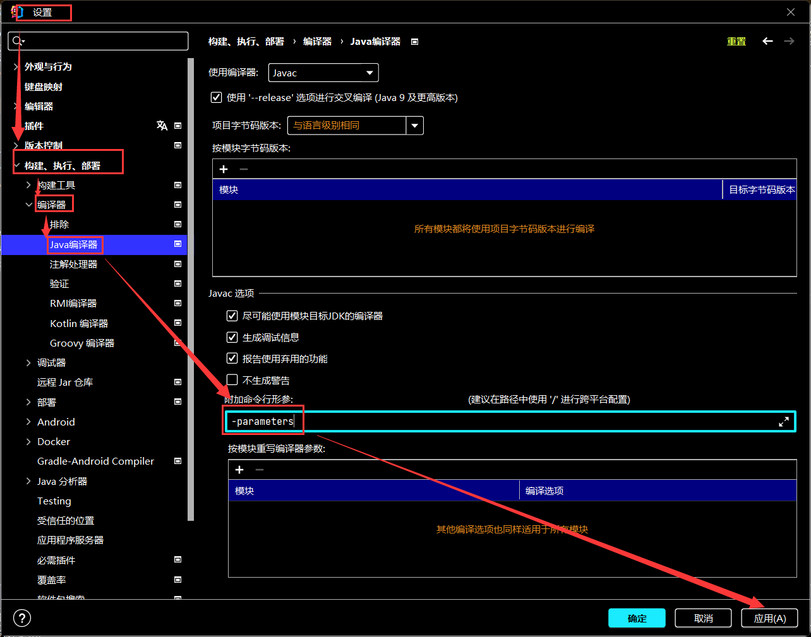


在编译的时候里面的class文件就附带，对应形参的名称

所以需要重新配置out目录下因编译修改前的代码而形成的.class文件


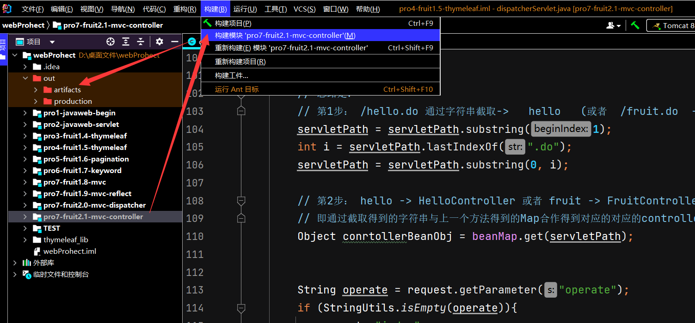


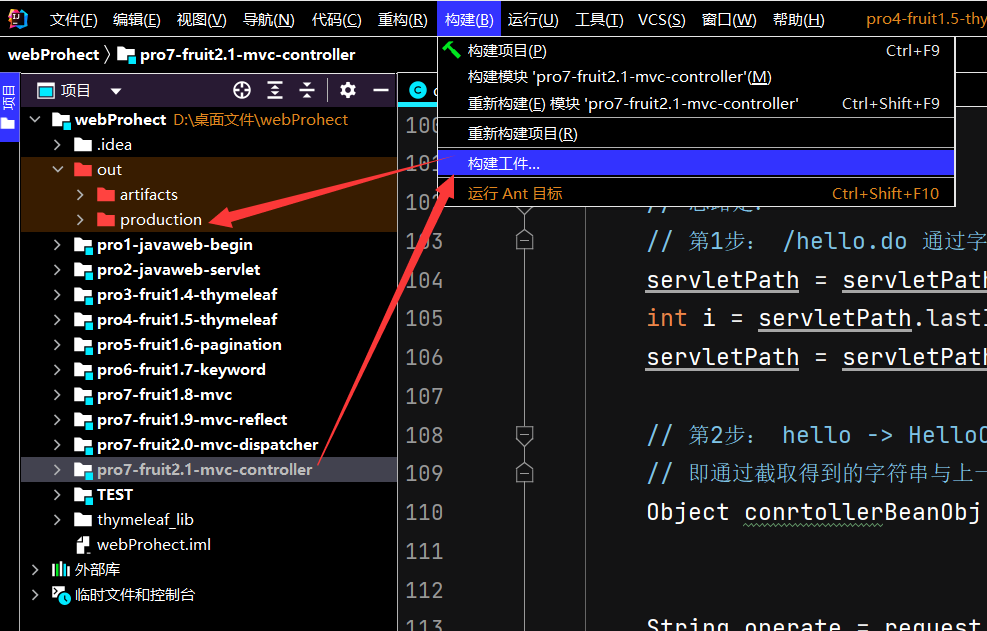


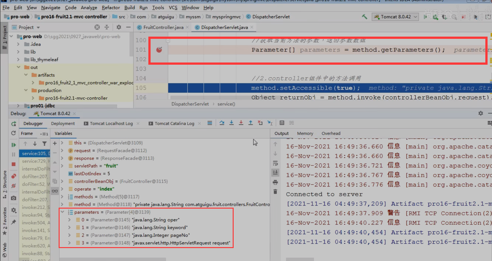


# :star:==review==

```apl
review:
1. 最初的做法是： 一个请求对应一个Servlet，这样存在的问题是servlet太多了
2. 把一些列的请求都对应一个Servlet, IndexServlet/AddServlet/EditServlet/DelServlet/UpdateServlet -> 合并成FruitServlet
   通过一个operate的值来决定调用FruitServlet中的哪一个方法
   使用的是switch-case
3. 在上一个版本中，Servlet中充斥着大量的switch-case，试想一下，随着我们的项目的业务规模扩大，那么会有很多的Servlet，也就意味着会有很多的switch-case，这是一种代码冗余
   因此，我们在servlet中使用了反射技术，我们规定operate的值和方法名一致，那么接收到operate的值是什么就表明我们需要调用对应的方法进行响应，如果找不到对应的方法，则抛异常
4. 在上一个版本中我们使用了反射技术，但是其实还是存在一定的问题：每一个servlet中都有类似的反射技术的代码。因此继续抽取，设计了中央控制器类：DispatcherServlet
   DispatcherServlet这个类的工作分为两大部分：
   1.根据url定位到能够处理这个请求的controller组件：
    1)从url中提取servletPath : /fruit.do -> fruit
    2)根据fruit找到对应的组件:FruitController ， 这个对应的依据我们存储在applicationContext.xml中
      <bean id="fruit" class="com.Novice.fruit.controllers.FruitController/>
      通过DOM技术我们去解析XML文件，在中央控制器中形成一个beanMap容器，用来存放所有的Controller组件
    3)根据获取到的operate的值定位到我们FruitController中需要调用的方法
   2.调用Controller组件中的方法：
    1) 获取参数
       获取即将要调用的方法的参数签名信息: Parameter[] parameters = method.getParameters();
       通过parameter.getName()获取参数的名称；
       准备了Object[] parameterValues 这个数组用来存放对应参数的参数值
       另外，我们需要考虑参数的类型问题，需要做类型转化的工作。通过parameter.getType()获取参数的类型
    2) 执行方法
       Object returnObj = method.invoke(controllerBean , parameterValues);
    3) 视图处理
       String returnStr = (String)returnObj;
       if(returnStr.startWith("redirect:")){
        ....
       }else if.....
```


# 补充

## init( ) 与 destory( ) 的理解

```apl
初始化和销毁工作并不是这俩个方法做的，是tomcat或者其他容器做的，只是在初始化和销毁时会执行这两个方法而已，所以你能把需要的准备和结束业务放到这两个方法中。

init(): 容器初始化Servlet时调用该方法  
初始化工作由Servlet容器完成 不需要我们在init()方法体中写 
init()方法体可以写一些 初始化的时候希望额外执行的内容 
注意此时Servlet对象已经被容器创建了 创建后才会执行init()方法

destroy(): 
无论是否写destory()方法，Servlet都会被Servlet容器销毁 如果在销毁前想执行一些额外工作 可以在detory()方法体种中写一些方法  
注意 此时Servlet对象还没有被销毁 被销毁前会执行destroy方法

总结:
1. init()方法在Servlet容器创建Servlet对象后执行  
2. destroy方法在Servlet对象被销毁前执行 
3. 共同点是 都只会被执行一次 
   (因为Servlet的生命周期 就是初始化 运行 销毁 初始化和销毁在一个生命周期中只能执行一次)
```


## 理解根目录

==**getClass().getResourceAsStream 和 getClass().getClassLoader().getResourceAsStream的区别**==


1. web项目中 ，编译好的.class文件，xml、properties等配置文件都在 **WEB-INF/classes**目录下。也就是编译后的根目录。

2. **getClass().getClassLoader().getResourceAsStream** ，通过类加载器可以直接定位到根目录下。（因为双亲委派机制）

3. **getClass().getResourceAsStream** 则是定位到当前类的平级。（也就是当前类所在包）

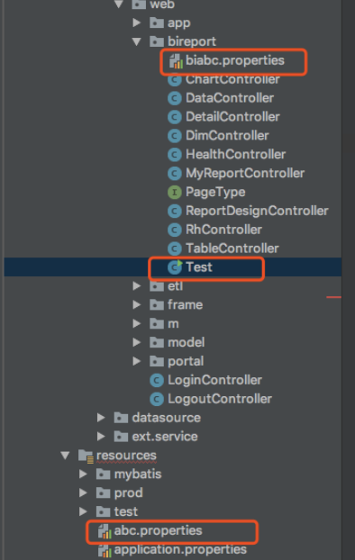

分别访问两个配置文件：

```java
this.getClass().getClassLoader().getResourceAsStream("abc.properties")
```

 

```java
new Test().getClass().getResourceAsStream("biabc.properties")
```


## DocumentBuilderFactory解析xml

### 1. documentBuilderFactory API description

1.  javax.xml.parsers 包

```apl
DocumentBuilderFactory创建DOM模式的解析器对象, DocumentBuilderFactory是抽象工厂类，不能直接实例化，但是有newInstance方法
```


2. DocumentBuilderFactory.newInstance() 得到创建 DOM 解析器的工厂

```apl
DocumentBuilderFactory documentBuilderFactory = DocumentBuilderFactory.newInstance()
```


3. newDocumentBuilder方法得到 DOM 解析器对象

```apl
DocumentBuilder documentBuilder = documentBuilderFactory.newDocumentBuilder();
```

 


4. DOM解析器解析输入流，

```apl
这里可以是XML，文档转化为输入流，或者字符串转为ByteArrayInputStream,
DOM 解析器对象的 parse() 方法解析 XML 文档，得到代表整个文档的 Document 对象
```

```apl
InputStream is = new FileInputStream("xxx.xml");
documentBuilder.parse(is);
documentBuilder.parse(new ByteArrayInputStream(str.getBytes())); 
```


5. 得到 XML 文档的根节点

```apl
Element rootElement = document.getDocumentElement();
```


6. 得到节点的子节点

```apl
NodeList studentInfo = appElement.getChildNodes();
```


### 2. Test Demo


#### Student.java文件

```java
package com.parse.doc;
 
public class Student {
	
	public String name;
	public String age;
	public String sex;
	public Student() {}
	
	public String getName() {
		return name;
	}
	public void setName(String name) {
		this.name = name;
	}
	public String getAge() {
		return age;
	}
	public void setAge(String age) {
		this.age = age;
	}
	public String getSex() {
		return sex;
	}
	public void setSex(String sex) {
		this.sex = sex;
	}
	@Override
	public String toString() {
		return "name=" + name + ", age=" + age + ", sex=" + sex;
	}
}
```

#### ParseXml.java文件

```java
package com.parse.doc;
 
import java.io.ByteArrayInputStream;
import java.util.ArrayList;
import java.util.List;
 
import javax.xml.parsers.DocumentBuilder;
import javax.xml.parsers.DocumentBuilderFactory;
 
import org.w3c.dom.Document;
import org.w3c.dom.Element;
import org.w3c.dom.NodeList;
 
 
public class ParseXml {
	
	public static String xml = "<Students><student><name><![CDATA[陈喻]]></name><age><![CDATA[26]]></age><sex><![CDATA[男]]></sex></student><student><name><![CDATA[陈彩凤]]></name><age><![CDATA[25]]></age><sex><![CDATA[女]]></sex></student><student><name><![CDATA[陈紫宣]]></name><age><![CDATA[2]]></age><sex><![CDATA[女]]></sex></student><student><name><![CDATA[陈紫曦]]></name><age><![CDATA[7个月]]></age><sex><![CDATA[女]]></sex></student></Students>";
	public static final String STUDENT = "student";
	public static final String NAME = "name";
	public static final String AGE = "age";
	public static final String SEX = "sex";
	
	public static void main(String args[]) {
		List<Student> students = parseXmlByDoc(xml);
		if (students != null && students.size() > 0) {
			for (Student student : students) {
				System.out.println(student);
			}
		} else {
			System.out.println("students size is 0");
		}
		
	}
	
	public static List<Student> parseXmlByDoc(String str) {
		if (str == null || "".equals(str)) {
			System.out.println("str is null or ''");
			return null;
		}
		DocumentBuilderFactory documentBuilderFactory = DocumentBuilderFactory.newInstance();
		List<Student> students = new ArrayList<Student>();
		DocumentBuilder documentBuilder;
		try {
			documentBuilder = documentBuilderFactory.newDocumentBuilder();
			Document document = documentBuilder.parse(new ByteArrayInputStream(str.getBytes()));
			Element rootElement = document.getDocumentElement();
			NodeList studentNodeList = rootElement.getElementsByTagName(STUDENT);
			for (int i = 0; i < studentNodeList.getLength(); i++) {
				Element appElement = (Element) studentNodeList.item(i);
				NodeList studentInfo = appElement.getChildNodes();
				Student student = new Student();
				for(int j = 0; j < studentInfo.getLength(); j++) { 
					Element element = (Element) studentInfo.item(j);
					String appAttr = element.getTagName();
					switch (appAttr) {
						case NAME:
							student.setName(element.getTextContent());
							break;
						case AGE:
							student.setAge(element.getTextContent());
							break;
						case SEX:
							student.setSex(element.getTextContent());
							break;
						default:
							break;
					} 
				}
				students.add(student);
			}
		} catch (Exception e) {
			e.printStackTrace();
			return null;
		}
		return students;
	}
}
```


### 3. Running results

```apl
name=陈喻, age=26, sex=男
name=陈彩凤, age=25, sex=女
name=陈紫宣, age=2, sex=女
name=陈紫曦, age=7个月, sex=女
```


原文链接：https://blog.csdn.net/u011068702/article/details/80543576


## Servlet详解之两个init方法的作用


在Servlet中 javax.servlet.GenericServlet类 继承自java.lang.Object 实现了Serializable,，servlet ，ServletConfig 三个接口 被继承对象javax.servlet.http.HttpServlet（这是我们常用的一个类）

```apl
Servlet接口中只有一个void init(ServletConfig config) 方法 

GenericServlet的API，有两个init方法 void init() void init(ServletConfig config)
```

 

### 官方说明:

```apl
1. void init() 
 	A convenience method which can be overridden so that there‘s no need to call super.init(config). 
 	
2. void init(ServletConfig config) 
	Called by the servlet container to indicate to a servlet that the servlet is being placed into service. 
```

 

### 查看两个函数的源码发现：

```apl
可以看到有参的init方法又调用了无参的init方法 (Tomcat默认调用的是有参的)

如果我们在想调用init方法时执行一些操作，那怎么办呢?
只要我们复写无参的init方法，tomcat在调用完 有参的init()方法后会去调用 无参的init()方法，这样两个操作都执行了。
而且我们也不用写super.init();

如果没有无参的init()方法，那我们复写有参的init()方法时忘记了些super.init(config)方法，那么config就不能初始化了，
而这样设计即使我们不调用super的方法，也不会出问题。何乐而不为呢！
```


## 什么是ServletContext?

```apl
即servlet环境对象，包含从容器环境中获得的初始化信息,servletContext即servlet容器，其内提供的方法可以在同一web应用下的所有servlet中被使用.servlet上下文提供对应用程序中所有Servlet所共有的各种资源和功能的访问.
servletContext接口是Servlet中最大的一个接口，呈现了web应用的Servlet视图.通过ServletContext可以访问应用范围的初始化参数和属性:
```

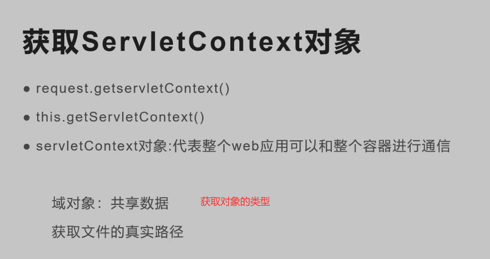


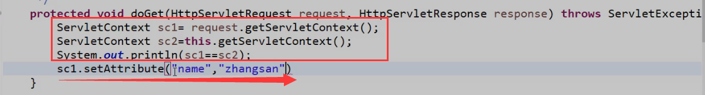

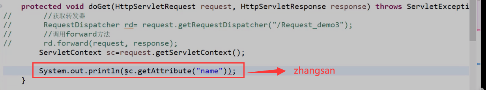

```
ServletContext对象是一个全局对象不需要请求转发，要慎重使用
```

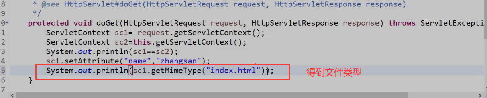

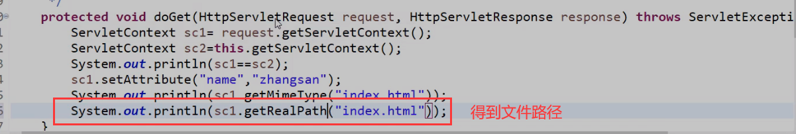


```
这个之前讲过 应该重写init()方法，或者重写init(ServletConfig)但是要调用super.init(servletconfig)
```

```
出现问题的主要原因是，furitController已经不是servlet了，但是其父类竟然还是需要servlet
```

```
不懂得可以多看看GenericServlet类的源码
```

```
卧槽原来如此。。。子类不是Servlet初始化父类的时候init就是一个普通的成员方法了

不是servlet了service方法也不会调用
```

```
ctrl+alt+o 
```


