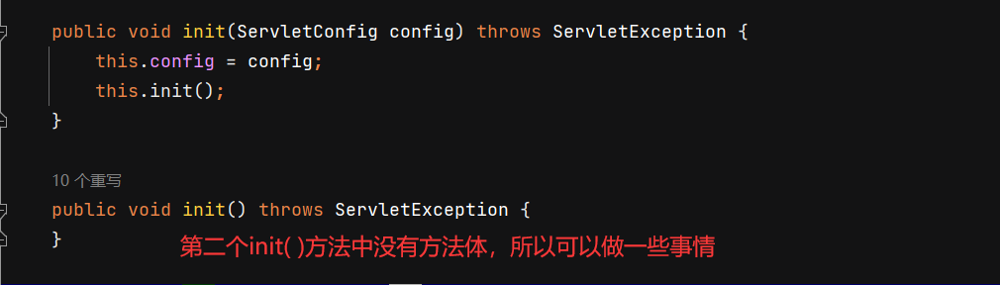
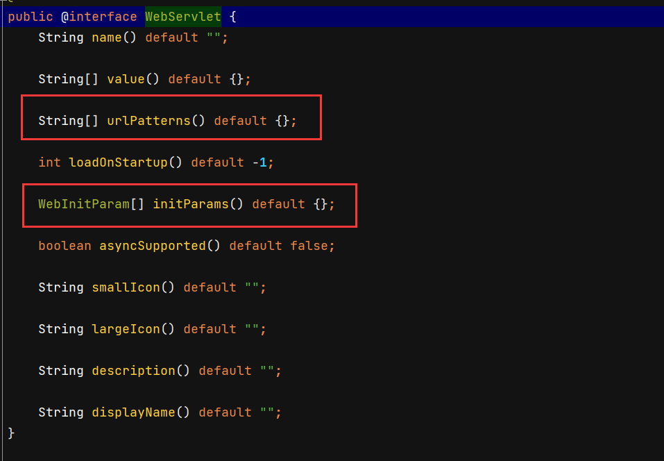
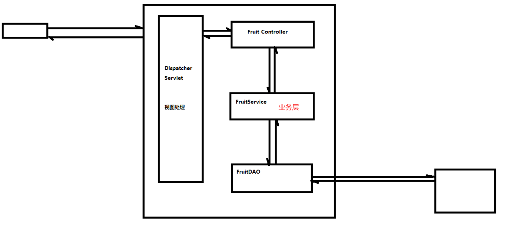
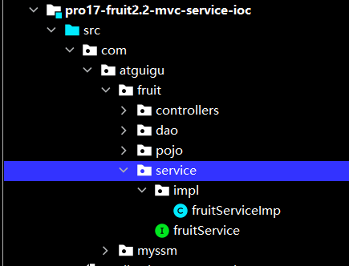

# servlet-api



## 1. 学习Servlet的初始化方法

### 1) Servlet生命周期：

```
 实例化、初始化、服务、销毁
```

### 2) Servlet中两个初始化方法

```apl
Servlet中的初始化方法有两个：init() , init(config)
   其中带参数的方法代码如下：
       public void init(ServletConfig config) throws ServletException {
         this.config = config ;
         init();
       }
       
   另外一个无参的init方法如下：
       public void init() throws ServletException{
       }
       
   '如果我们想要在Servlet初始化时做一些准备工作，那么我们可以重写init方法'
       我们可以通过如下步骤去获取初始化设置的数据
       - 获取config对象：ServletConfig config = getServletConfig();
       - 获取初始化参数值： config.getInitParameter(key);
```

### 3) web.xml文件中配置Servlet

3) 在web.xml文件中配置Servlet

     <context-param>
        <param-name>contextConfigLocation</param-name>
        <param-value>classpath:applicationContext.xml</param-value>
    </context-param>


​    <servlet>
​        <servlet-name>Demo01Servlet</servlet-name>
​        <servlet-class>com.Novice.servlet.Demo01Servlet</servlet-class>

​        <init-param>
​            <param-name>hello</param-name>
​            <param-value>world</param-value>
​        </init-param>
​        <init-param>
​            <param-name>uname</param-name>
​            <param-value>jim</param-value>
​        </init-param>
​    </servlet>
​    <servlet-mapping>
​        <servlet-name>Demo01Servlet</servlet-name>
​        <url-pattern>/demo01</url-pattern>
​    </servlet-mapping>

### 4) 注解方式配置Servlet：

```xml
 4) 也可以通过注解的方式进行配置：
     @WebServlet(urlPatterns = {"/demo01"} ,
         initParams = {
             @WebInitParam(name="hello",value="world"),
             @WebInitParam(name="uname",value="jim")
         })
```


## 2. 学习Servlet中的ServletContext和<context-param>

```apl
1) 获取ServletContext，有很多方法
    1.在初始化方法中获取servletContext： 
      servletContext = getServletContext();
    2.在服务方法中也可以通过request对象获取，也可以通过session获取：
      request.getServletContext(); 
      session.getServletContext()
    
2) 获取初始化值：
    servletContext.getInitParameter();
```


## 代码

### Demo01Servlet 

```java
// @WebServlet(urlPatterns = {"/demo01"},
//         initParams = {
//         @WebInitParam(name = "hello" ,value = "hi"),
//         @WebInitParam(name = "bucuo",value = "keyi")})

public class Demo01Servlet extends HttpServlet {
    @Override
    public void init() throws ServletException {
        ServletConfig servletConfig = getServletConfig();
        String initParameter = servletConfig.getInitParameter("hello");
        System.out.println(initParameter);

        ServletContext servletContext = getServletContext();
        String application = servletContext.getInitParameter("application");
        System.out.println(application);

    }


    @Override
    protected void service(HttpServletRequest req, HttpServletResponse resp) throws ServletException, IOException {
        ServletContext servletContext = req.getServletContext();

        ServletContext servletContext1 = req.getSession().getServletContext();


    }
}
```

### web.xml

```html
<?xml version="1.0" encoding="UTF-8"?>
<web-app xmlns="http://xmlns.jcp.org/xml/ns/javaee"
         xmlns:xsi="http://www.w3.org/2001/XMLSchema-instance"
         xsi:schemaLocation="http://xmlns.jcp.org/xml/ns/javaee http://xmlns.jcp.org/xml/ns/javaee/web-app_4_0.xsd"
         version="4.0">

    <context-param>
        <param-name>application</param-name>
        <param-value>classpath:applicationContext.xm</param-value>
    </context-param>
    
    
    <servlet>
        <servlet-name>Demo01Servlet</servlet-name>
        <servlet-class>com.Novice.servlet.Demo01Servlet</servlet-class>

        <init-param>
            <param-name>hello</param-name>
            <param-value>nihao</param-value>
        </init-param>
        <init-param>
            <param-name>bucuo</param-name>
            <param-value>dui</param-value>
        </init-param>
    </servlet>


    <servlet-mapping>
        <servlet-name>Demo01Servlet</servlet-name>
        <url-pattern>/demo01</url-pattern>
    </servlet-mapping>


</web-app>
```

## 注意

```java
@WebServlet(urlPatterns = {"/demo01"} ,
         initParams = {
             @WebInitParam(name="hello",value="world"),
             @WebInitParam(name="uname",value="jim")
         })
```



```
上图中的两个变量与下图中的两对Servlet相对应
第一个变量名urlpatterns表示的是一个<servlet>可以对应多个<servlet-mapping>
```

```html
<servlet>
    <servlet-name>Demo01Servlet</servlet-name>
    <servlet-class>com.Novice.servlet.Demo01Servlet</servlet-class>

    <init-param>
        <param-name>hello</param-name>
        <param-value>nihao</param-value>
    </init-param>
    <init-param>
        <param-name>bucuo</param-name>
        <param-value>dui</param-value>
    </init-param>
</servlet>

<servlet-mapping>
    <servlet-name>Demo01Servlet</servlet-name>
    <url-pattern>/demo01</url-pattern>
</servlet-mapping>
```

# mvc-service引入







## fruitService

```java
public interface fruitService {
    // 获取指定页面的库存列表信息
    List<Fruit> getFruitList(String keyword, Integer pageNo);

    // 添加库存记录信息
    void addFruit(Fruit fruit);

    // 根据id查看指定库存记录
    Fruit getFruitByFid(Integer fid);

    // 删除特定库存记录
    void delFruit(Integer id);

    // 获取总页数
    Integer getFruitNum(String keyword);

    // 修改特定库存记录
    void updateFruit(Fruit fruit);
}

```

## fruitServiceImp

```java
public class fruitServiceImp implements fruitService {

    private FruitDAO fruitDAO = null;

    @Override
    public List<Fruit> getFruitList(String keyword, Integer pageNo) {
        return fruitDAO.getFruitList(keyword,pageNo);
    }

    @Override
    public void addFruit(Fruit fruit) {
        fruitDAO.addFruit(fruit);

    }

    @Override
    public Fruit getFruitByFid(Integer fid) {
        return fruitDAO.getFruitByFid(fid);
    }

    @Override
    public void delFruit(Integer id) {
        fruitDAO.delFruit(id);
    }

    @Override
    public Integer getFruitNum(String keyword) {
        // return getFruitNum(keyword);
        int fruitNum = fruitDAO.getFruitNum(keyword);
        return (fruitNum+ 5 - 1) / 5;
   
    }

    @Override
    public void updateFruit(Fruit fruit) {
        updateFruit(fruit);
    }
}

```

## furitController

```java
public class furitController  {

    //此时fruitcontriller已经越来越接近一个普通的类了，但是此时这还不能算是一个普通的类，因为还是和serbvletAPI有一定的关系

    fruitServiceImp fruitServiceImp = new fruitServiceImp();

    //提取资源跳转之后，方法就只用关心数据的处理，只用在处理后return一个字符串
    //并不需要关系资源的额跳转重定向，以及资源的处理

    private String updte(Integer fid,String fname,Integer price,Integer fcount,String remark) throws ServletException{


        //执行更新
        fruitServiceImp.updateFruit(new Fruit(fid,fname,price,fcount,remark));

        //资源的跳转

        // resp.sendRedirect("fruit.do");

        //对资源重定向进行抽取
        return "redirect:fruit.do";
        //此处是谁调用的这个方法，就将这里的数据返回给谁
        //（这里是中央控制器调用的该方法，那么就将其返回给中央控制器）

    }


    private String add(String fname, Integer price,Integer fcount, String remark) {


        fruitServiceImp.addFruit(new Fruit(0,fname,price,fcount,remark));

        // resp.sendRedirect("fruit.do");

        return "redirect:fruit.do";

    }


    private String del(Integer fid){


        if (fid!=null){

            fruitServiceImp.delFruit(fid);

            // response.sendRedirect("fruit.do");

            return "redirect:fruit.do";
        }
        return "error";
    }


    private String edit(Integer fid, HttpServletRequest request) {


        if (fid != null){

            Fruit fruit = fruitServiceImp.getFruitByFid(fid);
            request.setAttribute("fruit",fruit); //这里有一个request作用域

            // super.processTemplate("edit",request,response);

            return "edit";
        }
        return "error";
    }


    private String index(String oper,String keyword,Integer pageNo,HttpServletRequest request){


        HttpSession session = request.getSession();


        if(pageNo==null){
            pageNo = 1;
        }


        if (StringUtils.isNotEmpty(oper) && "search".equals(oper)) {

            pageNo=1; //新的查询，页面应该在第一页开始

            if (StringUtils.isEmpty(keyword)) {
                keyword="";
            }
            session.setAttribute("keyword", keyword);


        } else {

            Object keywordObj = session.getAttribute("keyword");
            if (keywordObj!=null) {
                keyword = (String) keywordObj;
            }else {
                keyword="";
            }
        }


        int pagecount = fruitServiceImp.getFruitNum(keyword);
        // int pagecount = (fruitNum + 5 - 1) / 5;
        session.setAttribute("pagecount", pagecount);


        // 1. 获取到对应页码的全部的数据
        session.setAttribute("pageNo", pageNo);
        List<Fruit> fruitList = fruitServiceImp.getFruitList(keyword, pageNo);

        // 2. 保存到session作用域
        session.setAttribute("fruitList", fruitList);


        return "index";
    }


}
```


# mvc-ioc实现

```apl
ClassPathXmlApplicationContext通过加载applicationContext里面的内容
将applicationContext里面对应的类都加载到beanMap容器里面,
并且通过applicationContext与反射的应用，
个层次之间的调用并不是直接创建对象而是通过反射调用对象，实现了低耦合
```


```apl
dispatcherServlet在得到dispatcherServlet后
通过调用ClassPathXmlApplicationContext的方法之后，
得到对应的object对象
```


## applicationContext

```xml
<?xml version="1.0" encoding="utf-8"?>
<!--xml声明的固定写法-->


<beans><!--正文,此处的bean表示java对象，加上个s表示多个java对象-->

    <!--下面的3个bean其实就是3个组件，然后这3个组件放在一个容器里面，然后在服务启动的时候，需要哪一个组件就从该容器里调用-->


    <bean id="FruitDAO" class="com.Novice.fruit.dao.impl.FruitDAOImpl"/>

    <bean id="fruitService" class="com.Novice.fruit.service.impl.fruitServiceImp">
        <property name="fruitDAO" ref="FruitDAO"/>
    </bean>

    <!-- 这个bean标签的作用是 将来servletpath中涉及的名字对应的是fruit，那么就要FruitController这个类来处理 -->
    <bean id="fruit" class="com.Novice.fruit.controllers.furitController">
        <property name="fruitService" ref="fruitService"/>
    </bean>
    <!--此处表明id="fruit"与后面的 路径上的类相对应-->

</beans>


        <!--
        1.概念
        HTML : 超文本标记语言
        XML : 可扩展的标记语言
        HTML是XML的一个子集

        2.XML包含三个部分：
        1) XML声明 ， 而且声明这一行代码必须在XML文件的第一行 (必须要写的)
        2) DTD 文档类型定义
        3) XML正文
         -->
```

## beanFactory

```java
package com.Novice.myssm.io;

public interface beanFactory {

    //根据id获取某一个bean对象
    Object getBean(String ida);
}
```

## ClassPathXmlApplicationContext

```java
public class ClassPathXmlApplicationContext implements beanFactory {


    private HashMap<String, Object> beanMap = new HashMap<>();

    public ClassPathXmlApplicationContext() {
        try {

            InputStream inputStream = getClass().getClassLoader().getResourceAsStream("applicationContext.xml");
            // 1.创建DocumentBuilderFactory
            DocumentBuilderFactory documentBuilderFactory = DocumentBuilderFactory.newInstance();
            // 2.创建DocumentBuilder对象
            DocumentBuilder documentBuilder = documentBuilderFactory.newDocumentBuilder();
            // 3.创建Document对象
            Document document = documentBuilder.parse(inputStream);
            // 4.获取所有的bean节点
            NodeList beanNodeList = document.getElementsByTagName("bean");


            for (int i = 0; i < beanNodeList.getLength(); i++) {

                Node beanNode = beanNodeList.item(i); // 节点类型等于元素节点

                if (beanNode.getNodeType() == Node.ELEMENT_NODE) {
                    Element beanElement = (Element) beanNode;
                    String beanId = beanElement.getAttribute("id");
                    String className = beanElement.getAttribute("class");

                    Class beanClass = Class.forName(className);
                    Object beanObj = beanClass.newInstance();

                    beanMap.put(beanId, beanObj);

                }

            }


            for (int i = 0; i < beanNodeList.getLength(); i++) {
                Node beanNode = beanNodeList.item(i);

                if (beanNode.getNodeType() == Node.ELEMENT_NODE ) {
                    Element beanElement = (Element) beanNode;
                    String beanId = beanElement.getAttribute("id");
                    NodeList beanChildNodeList = beanElement.getChildNodes();

                    for (int j = 0; j < beanChildNodeList.getLength(); j++) {
                        Node beanChildNode = beanChildNodeList.item(j);
                        if (beanChildNode.getNodeType() == Node.ELEMENT_NODE
                                && "property".equals(beanChildNode.getNodeName())){
                            Element propertyElement = (Element) beanChildNode;
                            String propertyName = propertyElement.getAttribute("name");
                            String propertyRef = propertyElement.getAttribute("ref");
                            Object refObj = beanMap.get(propertyRef);
                            Object beanObj = beanMap.get(beanId);
                            Class beanClazz = beanObj.getClass();
                            Field propertyField = beanClazz.getDeclaredField(propertyName);
                            propertyField.setAccessible(true);
                            propertyField.set(beanObj, refObj);
                        }


                    }
                }

            }


        } catch (ParserConfigurationException e) {
            throw new RuntimeException(e);
        } catch (IOException e) {
            throw new RuntimeException(e);
        } catch (SAXException e) {
            throw new RuntimeException(e);
        } catch (ClassNotFoundException e) {
            throw new RuntimeException(e);
        } catch (InstantiationException e) {
            throw new RuntimeException(e);
        } catch (IllegalAccessException e) {
            throw new RuntimeException(e);
        } catch (NoSuchFieldException e) {
            throw new RuntimeException(e);
        }
    }


    @Override
    public Object getBean(String id) {
        return beanMap.get(id);
    }
}
```

## dispatcherServlet

```java
@WebServlet("*.do") // 此处使用了通配符，表明只要是以.do结尾就可以，拦截所有以.do结尾的请求
public class dispatcherServlet extends ViewBaseServlet {
    // 因为需要接收并处controller返回的字符串，有些情况需要调用ViewBaseServlet的方法，所以此处继承了ViewBaseServlet类

    // HashMap<String, Object> beanMap = new HashMap<>();
    private beanFactory beanfactory;

    public dispatcherServlet() { // 构造器里面不能用this，还没有实例化  因为先实例化再初始化
    }


    @Override
    // public void init(ServletConfig servletConfig){
    public void init() throws ServletException {

        super.init();
        beanfactory = new ClassPathXmlApplicationContext();


    }


    @Override
    protected void service(HttpServletRequest request, HttpServletResponse response) throws ServletException, IOException {
        // 设置编码
        request.setCharacterEncoding("UTF-8");
        // 假设url是：  http://localhost:8080/pro15/hello.do

        // 那么servletPath是：    /hello.do
        String servletPath = request.getServletPath();


        // 思路是：
        // 第1步： /hello.do 通过字符串截取->   hello   (或者  /fruit.do  -> fruit)
        servletPath = servletPath.substring(1);
        int i = servletPath.lastIndexOf(".do");
        servletPath = servletPath.substring(0, i);

        // 第2步： hello -> HelloController 或者 fruit -> FruitController
        // 即通过截取得到的字符串与上一个方法得到的Map合作得到对应的对应的controller对象
        Object conrtollerBeanObj = beanfactory.getBean(servletPath);


        String operate = request.getParameter("operate");
        if (StringUtils.isEmpty(operate)) {
            operate = "index";
        }

        try {

            Method[] Methods = conrtollerBeanObj.getClass().getDeclaredMethods();
            for (Method method : Methods) {
                if (operate.equals(method.getName())) {
                    // 1.统一获取请求参数

                    // 1-1.获取当前方法的参数，返回  参数数组   Parameter-参数
                    // 反射中Method的getParameters()方法获取真实参数名
                    Parameter[] parameters = method.getParameters();

                    // 1-2.parameterValues 用来承载参数的值
                    Object[] parameterValues = new Object[parameters.length];

                    for (int j = 0; j < parameters.length; j++) {

                        // 获取变量名
                        Parameter parameter = parameters[j];
                        String parameterName = parameter.getName();

                        if ("request".equals(parameterName)) {
                            parameterValues[j] = request;// 这里传入的都是上面的参数
                        } else if ("response".equals(parameterName)) {
                            parameterValues[j] = response; // 常见错误： IllegalArgumentException: argument type mismatch
                        } else if ("session".equals(parameterName)) {
                            parameterValues[j] = request.getSession();

                        } else {

                            // 获取变量类型
                            String typename = parameters[j].getType().getName();
                            // 从请求中获取参数值，如果参数名不是特殊的，那么就用该参数名再获取参数值，并传递给参数
                            String parameterValue = request.getParameter(parameterName);

                            Object parmenterObj = parameterValue;// 这里采用Object可以接受各种类型的参数 // 常见错误： IllegalArgumentException: argument type mismatch
                            if (parameterValue != null) {
                                if ("java.lang.Integer".equals(typename)) {
                                    parmenterObj = Integer.parseInt(parameterValue);
                                }
                            }

                            parameterValues[j] = parmenterObj;
                        }


                    }

                    // 2. conrtoller组件中的方法调用
                    method.setAccessible(true);// 如果不为true那么没有调用该方法的权限
                    Object returnObj = method.invoke(conrtollerBeanObj, parameterValues); //.invoke()方法返回的是obj类型

                    // 3. 视图处理
                    String methodReturnObj = (String) returnObj;
                    if (methodReturnObj.startsWith("redirect:")) {   // 比如: “redirect:fruit.do”
                        String refirectStr = methodReturnObj.substring("redirect:".length());
                        response.sendRedirect(refirectStr);
                    } else {
                        super.processTemplate(methodReturnObj, request, response); // 比如: “edit”
                    }

                }
            }


        } catch (InvocationTargetException e) {
            throw new RuntimeException(e);
        } catch (IllegalAccessException e) {
            throw new RuntimeException(e);
            // }else{
            //         throw new RuntimeException("operate不合法!");
            //     }

        }


    }


}


// 常见错误： IllegalArgumentException: argument type mismatch
```


## furitController

```java
public class furitController  {

    //此时fruitcontriller已经越来越接近一个普通的类了，但是此时这还不能算是一个普通的类，因为还是和serbvletAPI有一定的关系

    private fruitService fruitService = null;


    //提取资源跳转之后，方法就只用关心数据的处理，只用在处理后return一个字符串
    //并不需要关系资源的额跳转重定向，以及资源的处理

    private String updte(Integer fid,String fname,Integer price,Integer fcount,String remark) throws ServletException{


        //执行更新
        fruitService.updateFruit(new Fruit(fid,fname,price,fcount,remark));

        //资源的跳转

        // resp.sendRedirect("fruit.do");

        //对资源重定向进行抽取
        return "redirect:fruit.do";
        //此处是谁调用的这个方法，就将这里的数据返回给谁
        //（这里是中央控制器调用的该方法，那么就将其返回给中央控制器）

    }


    private String add(String fname, Integer price,Integer fcount, String remark) {


        fruitService.addFruit(new Fruit(0,fname,price,fcount,remark));

        // resp.sendRedirect("fruit.do");

        return "redirect:fruit.do";

    }


    private String del(Integer fid){


        if (fid!=null){

            fruitService.delFruit(fid);

            // response.sendRedirect("fruit.do");

            return "redirect:fruit.do";
        }
        return "error";
    }


    private String edit(Integer fid, HttpServletRequest request) {


        if (fid != null){

            Fruit fruit = fruitService.getFruitByFid(fid);
            request.setAttribute("fruit",fruit); //这里有一个request作用域

            // super.processTemplate("edit",request,response);

            return "edit";
        }
        return "error";
    }


    private String index(String oper,String keyword,Integer pageNo,HttpServletRequest request){


        HttpSession session = request.getSession();


        if(pageNo==null){
            pageNo = 1;
        }


        if (StringUtils.isNotEmpty(oper) && "search".equals(oper)) {

            pageNo=1; //新的查询，页面应该在第一页开始

            if (StringUtils.isEmpty(keyword)) {
                keyword="";
            }
            session.setAttribute("keyword", keyword);


        } else {

            Object keywordObj = session.getAttribute("keyword");
            if (keywordObj!=null) {
                keyword = (String) keywordObj;
            }else {
                keyword="";
            }
        }


        int pagecount = fruitService.getFruitNum(keyword);
        // int pagecount = (fruitNum + 5 - 1) / 5;
        session.setAttribute("pagecount", pagecount);


        // 1. 获取到对应页码的全部的数据
        session.setAttribute("pageNo", pageNo);
        List<Fruit> fruitList = fruitService.getFruitList(keyword, pageNo);

        // 2. 保存到session作用域
        session.setAttribute("fruitList", fruitList);


        return "index";
    }


}
```

## fruitServiceImp

```java
public class fruitServiceImp implements fruitService {

    private FruitDAO fruitDAO = null;

    @Override
    public List<Fruit> getFruitList(String keyword, Integer pageNo) {
        return fruitDAO.getFruitList(keyword,pageNo);
    }

    @Override
    public void addFruit(Fruit fruit) {
        fruitDAO.addFruit(fruit);

    }

    @Override
    public Fruit getFruitByFid(Integer fid) {
        return fruitDAO.getFruitByFid(fid);
    }

    @Override
    public void delFruit(Integer id) {
        fruitDAO.delFruit(id);
    }

    @Override
    public Integer getFruitNum(String keyword) {
        // return getFruitNum(keyword);
        int fruitNum = fruitDAO.getFruitNum(keyword);
        return (fruitNum+ 5 - 1) / 5;

    }

    @Override
    public void updateFruit(Fruit fruit) {
        updateFruit(fruit);
    }
}
```

# mvc-review

##  Servlet初始化

```
1. Servlet生命周期中的初始化方法： init() ， init(config)
   public void init(ServletConfig config) throws ServletException {
        this.config = config ;
        init();
   }
   因此，如果我们需要在初始化时执行一些自定义的操作，那么我们可以重写无参的init方法。
   我们可以通过getConfig()获取ServletConfig对象
   可以通过config.getInitParameter()获取初始化参数
   这里的初始化参数，既可以在.xml文件中配置，也可以在注解中配置
```

==（ServletContext与ServletConfig是属于不同的接口 ,这里的初始化和具体的某个servlet实例相关，而下面的 servlet上下文和整个应用程序相关,即在任何servlet程序中都可以获取到，所以可以在web.xml文件中通过parm设置)==

##  Servlet上下文

```
2. 通过ServletContext获取配置的上下文参数	(也叫作上下文)
```


##  MVC模式

```
3. MVC ： V：view 视图 ； C：Controller 控制器  ； M：Model 模型
   模型有很多种类：数据访问模型（DAO）；业务逻辑模型（BO）；值对象模型（POJO）；数据传输对象（DTO）

```

(之前写的模型是直接使用Controller控制器调用数据访问模型，但是中间没有经过业务逻辑模型
 改进之后，比如注册功能，使用Controller调用业务逻辑模型中的regest方法，然后该方法在集中调用数据访问模型里面的方法)

## :star:==IOC==


```
4. IOC
    IOC - 控制反转 / DI - 依赖注入
```

###  控制反转：

```
1) 之前在Servlet中，我们创建service对象 ， FruitService fruitService = new FruitServiceImpl();
       1.如果这句话出现在servlet中的某个方法内部，那么这个fruitService的作用域（生命周期）应该就是这个方法级别；
       2.如果这句话出现在servlet的类中，也就是说fruitService是一个成员变量，那么这个fruitService的作用域（生命周期）应该就是这个servlet实例级别
       
（如果生命周期过长就可能会存在线程不安全的问题(对象的声明周期 应该由于程序员维护，只不过因为java有虚拟机，所以可以不用关注其回收）

2) 之后我们在applicationContext.xml中定义了这个fruitService。然后通过解析XML，产生fruitService实例，存放在beanMap中，这个beanMap在一个BeanFactory中
       因此，我们转移（改变）了之前的service实例、dao实例等等他们的生命周期。'控制权从程序员转移到BeanFactory(IOC容器)'。这个现象我们称之为控制反转
（实例对象依附于容器，容器存在，实例对象就存在，容器销毁，实例对象就销毁了）
```

### 依赖注入：

```
1) 之前我们在控制层出现代码：FruitService fruitService = new FruitServiceImpl()；
   那么，控制层和service层存在耦合。
2) 之后，我们将代码修改成FruitService fruitService = null ;
   然后，在配置文件中配置:(使用反射技术进行注入)
    <bean id="fruit" class="FruitController">
    <property name="fruitService" ref="fruitService"/>
    </bean>
```

